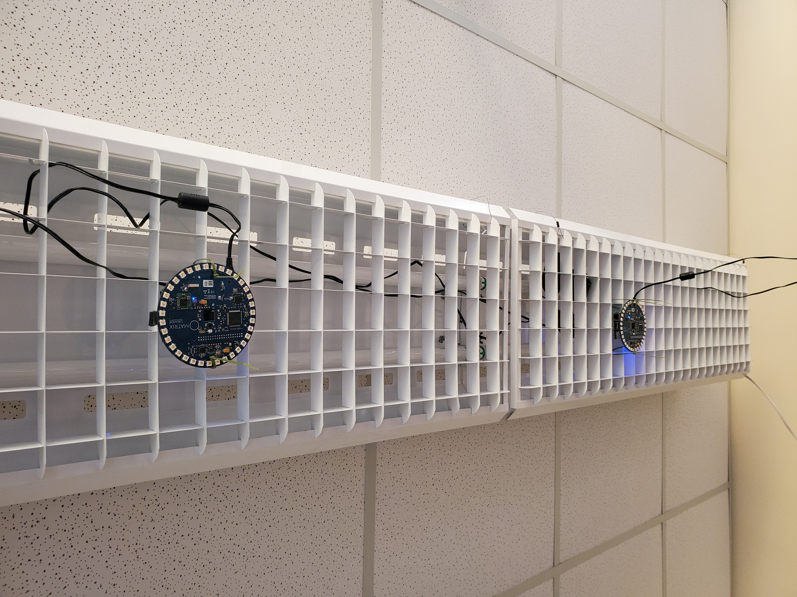
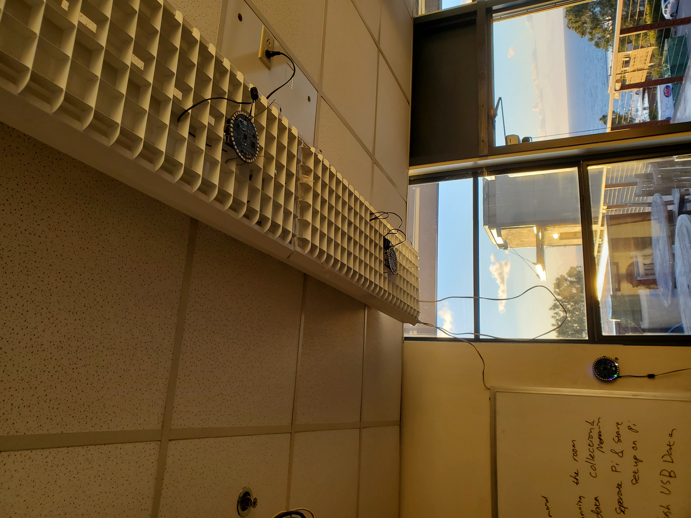
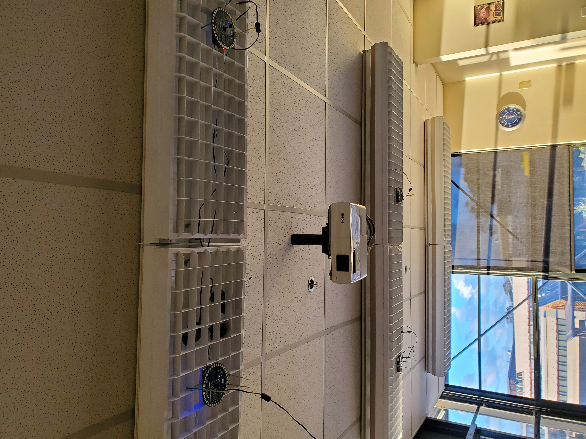

<html>
<head><meta charset="utf-8" />
<meta name="viewport" content="width=device-width, initial-scale=1.0">

<title>site</title>

<style type="text/css">
/*-----------------------------------------------------------------------------
| Copyright (c) Jupyter Development Team.
| Distributed under the terms of the Modified BSD License.
|----------------------------------------------------------------------------*/

/*
 * Mozilla scrollbar styling
 */

/* use standard opaque scrollbars for most nodes */
[data-jp-theme-scrollbars='true'] {
  scrollbar-color: rgb(var(--jp-scrollbar-thumb-color))
    var(--jp-scrollbar-background-color);
}

/* for code nodes, use a transparent style of scrollbar. These selectors
 * will match lower in the tree, and so will override the above */
[data-jp-theme-scrollbars='true'] .CodeMirror-hscrollbar,
[data-jp-theme-scrollbars='true'] .CodeMirror-vscrollbar {
  scrollbar-color: rgba(var(--jp-scrollbar-thumb-color), 0.5) transparent;
}

/* tiny scrollbar */

.jp-scrollbar-tiny {
  scrollbar-color: rgba(var(--jp-scrollbar-thumb-color), 0.5) transparent;
  scrollbar-width: thin;
}

/*
 * Webkit scrollbar styling
 */

/* use standard opaque scrollbars for most nodes */

[data-jp-theme-scrollbars='true'] ::-webkit-scrollbar,
[data-jp-theme-scrollbars='true'] ::-webkit-scrollbar-corner {
  background: var(--jp-scrollbar-background-color);
}

[data-jp-theme-scrollbars='true'] ::-webkit-scrollbar-thumb {
  background: rgb(var(--jp-scrollbar-thumb-color));
  border: var(--jp-scrollbar-thumb-margin) solid transparent;
  background-clip: content-box;
  border-radius: var(--jp-scrollbar-thumb-radius);
}

[data-jp-theme-scrollbars='true'] ::-webkit-scrollbar-track:horizontal {
  border-left: var(--jp-scrollbar-endpad) solid
    var(--jp-scrollbar-background-color);
  border-right: var(--jp-scrollbar-endpad) solid
    var(--jp-scrollbar-background-color);
}

[data-jp-theme-scrollbars='true'] ::-webkit-scrollbar-track:vertical {
  border-top: var(--jp-scrollbar-endpad) solid
    var(--jp-scrollbar-background-color);
  border-bottom: var(--jp-scrollbar-endpad) solid
    var(--jp-scrollbar-background-color);
}

/* for code nodes, use a transparent style of scrollbar */

[data-jp-theme-scrollbars='true'] .CodeMirror-hscrollbar::-webkit-scrollbar,
[data-jp-theme-scrollbars='true'] .CodeMirror-vscrollbar::-webkit-scrollbar,
[data-jp-theme-scrollbars='true']
  .CodeMirror-hscrollbar::-webkit-scrollbar-corner,
[data-jp-theme-scrollbars='true']
  .CodeMirror-vscrollbar::-webkit-scrollbar-corner {
  background-color: transparent;
}

[data-jp-theme-scrollbars='true']
  .CodeMirror-hscrollbar::-webkit-scrollbar-thumb,
[data-jp-theme-scrollbars='true']
  .CodeMirror-vscrollbar::-webkit-scrollbar-thumb {
  background: rgba(var(--jp-scrollbar-thumb-color), 0.5);
  border: var(--jp-scrollbar-thumb-margin) solid transparent;
  background-clip: content-box;
  border-radius: var(--jp-scrollbar-thumb-radius);
}

[data-jp-theme-scrollbars='true']
  .CodeMirror-hscrollbar::-webkit-scrollbar-track:horizontal {
  border-left: var(--jp-scrollbar-endpad) solid transparent;
  border-right: var(--jp-scrollbar-endpad) solid transparent;
}

[data-jp-theme-scrollbars='true']
  .CodeMirror-vscrollbar::-webkit-scrollbar-track:vertical {
  border-top: var(--jp-scrollbar-endpad) solid transparent;
  border-bottom: var(--jp-scrollbar-endpad) solid transparent;
}

/* tiny scrollbar */

.jp-scrollbar-tiny::-webkit-scrollbar,
.jp-scrollbar-tiny::-webkit-scrollbar-corner {
  background-color: transparent;
  height: 4px;
  width: 4px;
}

.jp-scrollbar-tiny::-webkit-scrollbar-thumb {
  background: rgba(var(--jp-scrollbar-thumb-color), 0.5);
}

.jp-scrollbar-tiny::-webkit-scrollbar-track:horizontal {
  border-left: 0px solid transparent;
  border-right: 0px solid transparent;
}

.jp-scrollbar-tiny::-webkit-scrollbar-track:vertical {
  border-top: 0px solid transparent;
  border-bottom: 0px solid transparent;
}

/*
 * Phosphor
 */

.lm-ScrollBar[data-orientation='horizontal'] {
  min-height: 16px;
  max-height: 16px;
  min-width: 45px;
  border-top: 1px solid #a0a0a0;
}

.lm-ScrollBar[data-orientation='vertical'] {
  min-width: 16px;
  max-width: 16px;
  min-height: 45px;
  border-left: 1px solid #a0a0a0;
}

.lm-ScrollBar-button {
  background-color: #f0f0f0;
  background-position: center center;
  min-height: 15px;
  max-height: 15px;
  min-width: 15px;
  max-width: 15px;
}

.lm-ScrollBar-button:hover {
  background-color: #dadada;
}

.lm-ScrollBar-button.lm-mod-active {
  background-color: #cdcdcd;
}

.lm-ScrollBar-track {
  background: #f0f0f0;
}

.lm-ScrollBar-thumb {
  background: #cdcdcd;
}

.lm-ScrollBar-thumb:hover {
  background: #bababa;
}

.lm-ScrollBar-thumb.lm-mod-active {
  background: #a0a0a0;
}

.lm-ScrollBar[data-orientation='horizontal'] .lm-ScrollBar-thumb {
  height: 100%;
  min-width: 15px;
  border-left: 1px solid #a0a0a0;
  border-right: 1px solid #a0a0a0;
}

.lm-ScrollBar[data-orientation='vertical'] .lm-ScrollBar-thumb {
  width: 100%;
  min-height: 15px;
  border-top: 1px solid #a0a0a0;
  border-bottom: 1px solid #a0a0a0;
}

.lm-ScrollBar[data-orientation='horizontal']
  .lm-ScrollBar-button[data-action='decrement'] {
  background-image: var(--jp-icon-caret-left);
  background-size: 17px;
}

.lm-ScrollBar[data-orientation='horizontal']
  .lm-ScrollBar-button[data-action='increment'] {
  background-image: var(--jp-icon-caret-right);
  background-size: 17px;
}

.lm-ScrollBar[data-orientation='vertical']
  .lm-ScrollBar-button[data-action='decrement'] {
  background-image: var(--jp-icon-caret-up);
  background-size: 17px;
}

.lm-ScrollBar[data-orientation='vertical']
  .lm-ScrollBar-button[data-action='increment'] {
  background-image: var(--jp-icon-caret-down);
  background-size: 17px;
}

/*-----------------------------------------------------------------------------
| Copyright (c) Jupyter Development Team.
| Copyright (c) 2014-2017, PhosphorJS Contributors
|
| Distributed under the terms of the BSD 3-Clause License.
|
| The full license is in the file LICENSE, distributed with this software.
|----------------------------------------------------------------------------*/

/* <DEPRECATED> */ .p-Widget, /* </DEPRECATED> */
.lm-Widget {
  box-sizing: border-box;
  position: relative;
  overflow: hidden;
  cursor: default;
}

/* <DEPRECATED> */ .p-Widget.p-mod-hidden, /* </DEPRECATED> */
.lm-Widget.lm-mod-hidden {
  display: none !important;
}

/*-----------------------------------------------------------------------------
| Copyright (c) Jupyter Development Team.
| Copyright (c) 2014-2017, PhosphorJS Contributors
|
| Distributed under the terms of the BSD 3-Clause License.
|
| The full license is in the file LICENSE, distributed with this software.
|----------------------------------------------------------------------------*/

/* <DEPRECATED> */ .p-CommandPalette, /* </DEPRECATED> */
.lm-CommandPalette {
  display: flex;
  flex-direction: column;
  -webkit-user-select: none;
  -moz-user-select: none;
  -ms-user-select: none;
  user-select: none;
}

/* <DEPRECATED> */ .p-CommandPalette-search, /* </DEPRECATED> */
.lm-CommandPalette-search {
  flex: 0 0 auto;
}

/* <DEPRECATED> */ .p-CommandPalette-content, /* </DEPRECATED> */
.lm-CommandPalette-content {
  flex: 1 1 auto;
  margin: 0;
  padding: 0;
  min-height: 0;
  overflow: auto;
  list-style-type: none;
}

/* <DEPRECATED> */ .p-CommandPalette-header, /* </DEPRECATED> */
.lm-CommandPalette-header {
  overflow: hidden;
  white-space: nowrap;
  text-overflow: ellipsis;
}

/* <DEPRECATED> */ .p-CommandPalette-item, /* </DEPRECATED> */
.lm-CommandPalette-item {
  display: flex;
  flex-direction: row;
}

/* <DEPRECATED> */ .p-CommandPalette-itemIcon, /* </DEPRECATED> */
.lm-CommandPalette-itemIcon {
  flex: 0 0 auto;
}

/* <DEPRECATED> */ .p-CommandPalette-itemContent, /* </DEPRECATED> */
.lm-CommandPalette-itemContent {
  flex: 1 1 auto;
  overflow: hidden;
}

/* <DEPRECATED> */ .p-CommandPalette-itemShortcut, /* </DEPRECATED> */
.lm-CommandPalette-itemShortcut {
  flex: 0 0 auto;
}

/* <DEPRECATED> */ .p-CommandPalette-itemLabel, /* </DEPRECATED> */
.lm-CommandPalette-itemLabel {
  overflow: hidden;
  white-space: nowrap;
  text-overflow: ellipsis;
}

.lm-close-icon {
	border:1px solid transparent;
  background-color: transparent;
  position: absolute;
	z-index:1;
	right:3%;
	top: 0;
	bottom: 0;
	margin: auto;
	padding: 7px 0;
	display: none;
	vertical-align: middle;
  outline: 0;
  cursor: pointer;
}
.lm-close-icon:after {
	content: "X";
	display: block;
	width: 15px;
	height: 15px;
	text-align: center;
	color:#000;
	font-weight: normal;
	font-size: 12px;
	cursor: pointer;
}

/*-----------------------------------------------------------------------------
| Copyright (c) Jupyter Development Team.
| Copyright (c) 2014-2017, PhosphorJS Contributors
|
| Distributed under the terms of the BSD 3-Clause License.
|
| The full license is in the file LICENSE, distributed with this software.
|----------------------------------------------------------------------------*/

/* <DEPRECATED> */ .p-DockPanel, /* </DEPRECATED> */
.lm-DockPanel {
  z-index: 0;
}

/* <DEPRECATED> */ .p-DockPanel-widget, /* </DEPRECATED> */
.lm-DockPanel-widget {
  z-index: 0;
}

/* <DEPRECATED> */ .p-DockPanel-tabBar, /* </DEPRECATED> */
.lm-DockPanel-tabBar {
  z-index: 1;
}

/* <DEPRECATED> */ .p-DockPanel-handle, /* </DEPRECATED> */
.lm-DockPanel-handle {
  z-index: 2;
}

/* <DEPRECATED> */ .p-DockPanel-handle.p-mod-hidden, /* </DEPRECATED> */
.lm-DockPanel-handle.lm-mod-hidden {
  display: none !important;
}

/* <DEPRECATED> */ .p-DockPanel-handle:after, /* </DEPRECATED> */
.lm-DockPanel-handle:after {
  position: absolute;
  top: 0;
  left: 0;
  width: 100%;
  height: 100%;
  content: '';
}

/* <DEPRECATED> */
.p-DockPanel-handle[data-orientation='horizontal'],
/* </DEPRECATED> */
.lm-DockPanel-handle[data-orientation='horizontal'] {
  cursor: ew-resize;
}

/* <DEPRECATED> */
.p-DockPanel-handle[data-orientation='vertical'],
/* </DEPRECATED> */
.lm-DockPanel-handle[data-orientation='vertical'] {
  cursor: ns-resize;
}

/* <DEPRECATED> */
.p-DockPanel-handle[data-orientation='horizontal']:after,
/* </DEPRECATED> */
.lm-DockPanel-handle[data-orientation='horizontal']:after {
  left: 50%;
  min-width: 8px;
  transform: translateX(-50%);
}

/* <DEPRECATED> */
.p-DockPanel-handle[data-orientation='vertical']:after,
/* </DEPRECATED> */
.lm-DockPanel-handle[data-orientation='vertical']:after {
  top: 50%;
  min-height: 8px;
  transform: translateY(-50%);
}

/* <DEPRECATED> */ .p-DockPanel-overlay, /* </DEPRECATED> */
.lm-DockPanel-overlay {
  z-index: 3;
  box-sizing: border-box;
  pointer-events: none;
}

/* <DEPRECATED> */ .p-DockPanel-overlay.p-mod-hidden, /* </DEPRECATED> */
.lm-DockPanel-overlay.lm-mod-hidden {
  display: none !important;
}

/*-----------------------------------------------------------------------------
| Copyright (c) Jupyter Development Team.
| Copyright (c) 2014-2017, PhosphorJS Contributors
|
| Distributed under the terms of the BSD 3-Clause License.
|
| The full license is in the file LICENSE, distributed with this software.
|----------------------------------------------------------------------------*/

/* <DEPRECATED> */ .p-Menu, /* </DEPRECATED> */
.lm-Menu {
  z-index: 10000;
  position: absolute;
  white-space: nowrap;
  overflow-x: hidden;
  overflow-y: auto;
  outline: none;
  -webkit-user-select: none;
  -moz-user-select: none;
  -ms-user-select: none;
  user-select: none;
}

/* <DEPRECATED> */ .p-Menu-content, /* </DEPRECATED> */
.lm-Menu-content {
  margin: 0;
  padding: 0;
  display: table;
  list-style-type: none;
}

/* <DEPRECATED> */ .p-Menu-item, /* </DEPRECATED> */
.lm-Menu-item {
  display: table-row;
}

/* <DEPRECATED> */
.p-Menu-item.p-mod-hidden,
.p-Menu-item.p-mod-collapsed,
/* </DEPRECATED> */
.lm-Menu-item.lm-mod-hidden,
.lm-Menu-item.lm-mod-collapsed {
  display: none !important;
}

/* <DEPRECATED> */
.p-Menu-itemIcon,
.p-Menu-itemSubmenuIcon,
/* </DEPRECATED> */
.lm-Menu-itemIcon,
.lm-Menu-itemSubmenuIcon {
  display: table-cell;
  text-align: center;
}

/* <DEPRECATED> */ .p-Menu-itemLabel, /* </DEPRECATED> */
.lm-Menu-itemLabel {
  display: table-cell;
  text-align: left;
}

/* <DEPRECATED> */ .p-Menu-itemShortcut, /* </DEPRECATED> */
.lm-Menu-itemShortcut {
  display: table-cell;
  text-align: right;
}

/*-----------------------------------------------------------------------------
| Copyright (c) Jupyter Development Team.
| Copyright (c) 2014-2017, PhosphorJS Contributors
|
| Distributed under the terms of the BSD 3-Clause License.
|
| The full license is in the file LICENSE, distributed with this software.
|----------------------------------------------------------------------------*/

/* <DEPRECATED> */ .p-MenuBar, /* </DEPRECATED> */
.lm-MenuBar {
  outline: none;
  -webkit-user-select: none;
  -moz-user-select: none;
  -ms-user-select: none;
  user-select: none;
}

/* <DEPRECATED> */ .p-MenuBar-content, /* </DEPRECATED> */
.lm-MenuBar-content {
  margin: 0;
  padding: 0;
  display: flex;
  flex-direction: row;
  list-style-type: none;
}

/* <DEPRECATED> */ .p--MenuBar-item, /* </DEPRECATED> */
.lm-MenuBar-item {
  box-sizing: border-box;
}

/* <DEPRECATED> */
.p-MenuBar-itemIcon,
.p-MenuBar-itemLabel,
/* </DEPRECATED> */
.lm-MenuBar-itemIcon,
.lm-MenuBar-itemLabel {
  display: inline-block;
}

/*-----------------------------------------------------------------------------
| Copyright (c) Jupyter Development Team.
| Copyright (c) 2014-2017, PhosphorJS Contributors
|
| Distributed under the terms of the BSD 3-Clause License.
|
| The full license is in the file LICENSE, distributed with this software.
|----------------------------------------------------------------------------*/

/* <DEPRECATED> */ .p-ScrollBar, /* </DEPRECATED> */
.lm-ScrollBar {
  display: flex;
  -webkit-user-select: none;
  -moz-user-select: none;
  -ms-user-select: none;
  user-select: none;
}

/* <DEPRECATED> */
.p-ScrollBar[data-orientation='horizontal'],
/* </DEPRECATED> */
.lm-ScrollBar[data-orientation='horizontal'] {
  flex-direction: row;
}

/* <DEPRECATED> */
.p-ScrollBar[data-orientation='vertical'],
/* </DEPRECATED> */
.lm-ScrollBar[data-orientation='vertical'] {
  flex-direction: column;
}

/* <DEPRECATED> */ .p-ScrollBar-button, /* </DEPRECATED> */
.lm-ScrollBar-button {
  box-sizing: border-box;
  flex: 0 0 auto;
}

/* <DEPRECATED> */ .p-ScrollBar-track, /* </DEPRECATED> */
.lm-ScrollBar-track {
  box-sizing: border-box;
  position: relative;
  overflow: hidden;
  flex: 1 1 auto;
}

/* <DEPRECATED> */ .p-ScrollBar-thumb, /* </DEPRECATED> */
.lm-ScrollBar-thumb {
  box-sizing: border-box;
  position: absolute;
}

/*-----------------------------------------------------------------------------
| Copyright (c) Jupyter Development Team.
| Copyright (c) 2014-2017, PhosphorJS Contributors
|
| Distributed under the terms of the BSD 3-Clause License.
|
| The full license is in the file LICENSE, distributed with this software.
|----------------------------------------------------------------------------*/

/* <DEPRECATED> */ .p-SplitPanel-child, /* </DEPRECATED> */
.lm-SplitPanel-child {
  z-index: 0;
}

/* <DEPRECATED> */ .p-SplitPanel-handle, /* </DEPRECATED> */
.lm-SplitPanel-handle {
  z-index: 1;
}

/* <DEPRECATED> */ .p-SplitPanel-handle.p-mod-hidden, /* </DEPRECATED> */
.lm-SplitPanel-handle.lm-mod-hidden {
  display: none !important;
}

/* <DEPRECATED> */ .p-SplitPanel-handle:after, /* </DEPRECATED> */
.lm-SplitPanel-handle:after {
  position: absolute;
  top: 0;
  left: 0;
  width: 100%;
  height: 100%;
  content: '';
}

/* <DEPRECATED> */
.p-SplitPanel[data-orientation='horizontal'] > .p-SplitPanel-handle,
/* </DEPRECATED> */
.lm-SplitPanel[data-orientation='horizontal'] > .lm-SplitPanel-handle {
  cursor: ew-resize;
}

/* <DEPRECATED> */
.p-SplitPanel[data-orientation='vertical'] > .p-SplitPanel-handle,
/* </DEPRECATED> */
.lm-SplitPanel[data-orientation='vertical'] > .lm-SplitPanel-handle {
  cursor: ns-resize;
}

/* <DEPRECATED> */
.p-SplitPanel[data-orientation='horizontal'] > .p-SplitPanel-handle:after,
/* </DEPRECATED> */
.lm-SplitPanel[data-orientation='horizontal'] > .lm-SplitPanel-handle:after {
  left: 50%;
  min-width: 8px;
  transform: translateX(-50%);
}

/* <DEPRECATED> */
.p-SplitPanel[data-orientation='vertical'] > .p-SplitPanel-handle:after,
/* </DEPRECATED> */
.lm-SplitPanel[data-orientation='vertical'] > .lm-SplitPanel-handle:after {
  top: 50%;
  min-height: 8px;
  transform: translateY(-50%);
}

/*-----------------------------------------------------------------------------
| Copyright (c) Jupyter Development Team.
| Copyright (c) 2014-2017, PhosphorJS Contributors
|
| Distributed under the terms of the BSD 3-Clause License.
|
| The full license is in the file LICENSE, distributed with this software.
|----------------------------------------------------------------------------*/

/* <DEPRECATED> */ .p-TabBar, /* </DEPRECATED> */
.lm-TabBar {
  display: flex;
  -webkit-user-select: none;
  -moz-user-select: none;
  -ms-user-select: none;
  user-select: none;
}

/* <DEPRECATED> */ .p-TabBar[data-orientation='horizontal'], /* </DEPRECATED> */
.lm-TabBar[data-orientation='horizontal'] {
  flex-direction: row;
}

/* <DEPRECATED> */ .p-TabBar[data-orientation='vertical'], /* </DEPRECATED> */
.lm-TabBar[data-orientation='vertical'] {
  flex-direction: column;
}

/* <DEPRECATED> */ .p-TabBar-content, /* </DEPRECATED> */
.lm-TabBar-content {
  margin: 0;
  padding: 0;
  display: flex;
  flex: 1 1 auto;
  list-style-type: none;
}

/* <DEPRECATED> */
.p-TabBar[data-orientation='horizontal'] > .p-TabBar-content,
/* </DEPRECATED> */
.lm-TabBar[data-orientation='horizontal'] > .lm-TabBar-content {
  flex-direction: row;
}

/* <DEPRECATED> */
.p-TabBar[data-orientation='vertical'] > .p-TabBar-content,
/* </DEPRECATED> */
.lm-TabBar[data-orientation='vertical'] > .lm-TabBar-content {
  flex-direction: column;
}

/* <DEPRECATED> */ .p-TabBar-tab, /* </DEPRECATED> */
.lm-TabBar-tab {
  display: flex;
  flex-direction: row;
  box-sizing: border-box;
  overflow: hidden;
}

/* <DEPRECATED> */
.p-TabBar-tabIcon,
.p-TabBar-tabCloseIcon,
/* </DEPRECATED> */
.lm-TabBar-tabIcon,
.lm-TabBar-tabCloseIcon {
  flex: 0 0 auto;
}

/* <DEPRECATED> */ .p-TabBar-tabLabel, /* </DEPRECATED> */
.lm-TabBar-tabLabel {
  flex: 1 1 auto;
  overflow: hidden;
  white-space: nowrap;
}

.lm-TabBar-tabInput {
  user-select: all;
  width: 100%;
  box-sizing : border-box;
}

/* <DEPRECATED> */ .p-TabBar-tab.p-mod-hidden, /* </DEPRECATED> */
.lm-TabBar-tab.lm-mod-hidden {
  display: none !important;
}

/* <DEPRECATED> */ .p-TabBar.p-mod-dragging .p-TabBar-tab, /* </DEPRECATED> */
.lm-TabBar.lm-mod-dragging .lm-TabBar-tab {
  position: relative;
}

/* <DEPRECATED> */
.p-TabBar.p-mod-dragging[data-orientation='horizontal'] .p-TabBar-tab,
/* </DEPRECATED> */
.lm-TabBar.lm-mod-dragging[data-orientation='horizontal'] .lm-TabBar-tab {
  left: 0;
  transition: left 150ms ease;
}

/* <DEPRECATED> */
.p-TabBar.p-mod-dragging[data-orientation='vertical'] .p-TabBar-tab,
/* </DEPRECATED> */
.lm-TabBar.lm-mod-dragging[data-orientation='vertical'] .lm-TabBar-tab {
  top: 0;
  transition: top 150ms ease;
}

/* <DEPRECATED> */
.p-TabBar.p-mod-dragging .p-TabBar-tab.p-mod-dragging,
/* </DEPRECATED> */
.lm-TabBar.lm-mod-dragging .lm-TabBar-tab.lm-mod-dragging {
  transition: none;
}

/*-----------------------------------------------------------------------------
| Copyright (c) Jupyter Development Team.
| Copyright (c) 2014-2017, PhosphorJS Contributors
|
| Distributed under the terms of the BSD 3-Clause License.
|
| The full license is in the file LICENSE, distributed with this software.
|----------------------------------------------------------------------------*/

/* <DEPRECATED> */ .p-TabPanel-tabBar, /* </DEPRECATED> */
.lm-TabPanel-tabBar {
  z-index: 1;
}

/* <DEPRECATED> */ .p-TabPanel-stackedPanel, /* </DEPRECATED> */
.lm-TabPanel-stackedPanel {
  z-index: 0;
}

/*-----------------------------------------------------------------------------
| Copyright (c) Jupyter Development Team.
| Copyright (c) 2014-2017, PhosphorJS Contributors
|
| Distributed under the terms of the BSD 3-Clause License.
|
| The full license is in the file LICENSE, distributed with this software.
|----------------------------------------------------------------------------*/

@charset "UTF-8";
html{
  -webkit-box-sizing:border-box;
          box-sizing:border-box; }

*,
*::before,
*::after{
  -webkit-box-sizing:inherit;
          box-sizing:inherit; }

body{
  font-size:14px;
  font-weight:400;
  letter-spacing:0;
  line-height:1.28581;
  text-transform:none;
  color:#182026;
  font-family:-apple-system, "BlinkMacSystemFont", "Segoe UI", "Roboto", "Oxygen", "Ubuntu", "Cantarell", "Open Sans", "Helvetica Neue", "Icons16", sans-serif; }

p{
  margin-bottom:10px;
  margin-top:0; }

small{
  font-size:12px; }

strong{
  font-weight:600; }

::-moz-selection{
  background:rgba(125, 188, 255, 0.6); }

::selection{
  background:rgba(125, 188, 255, 0.6); }
.bp3-heading{
  color:#182026;
  font-weight:600;
  margin:0 0 10px;
  padding:0; }
  .bp3-dark .bp3-heading{
    color:#f5f8fa; }

h1.bp3-heading, .bp3-running-text h1{
  font-size:36px;
  line-height:40px; }

h2.bp3-heading, .bp3-running-text h2{
  font-size:28px;
  line-height:32px; }

h3.bp3-heading, .bp3-running-text h3{
  font-size:22px;
  line-height:25px; }

h4.bp3-heading, .bp3-running-text h4{
  font-size:18px;
  line-height:21px; }

h5.bp3-heading, .bp3-running-text h5{
  font-size:16px;
  line-height:19px; }

h6.bp3-heading, .bp3-running-text h6{
  font-size:14px;
  line-height:16px; }
.bp3-ui-text{
  font-size:14px;
  font-weight:400;
  letter-spacing:0;
  line-height:1.28581;
  text-transform:none; }

.bp3-monospace-text{
  font-family:monospace;
  text-transform:none; }

.bp3-text-muted{
  color:#5c7080; }
  .bp3-dark .bp3-text-muted{
    color:#a7b6c2; }

.bp3-text-disabled{
  color:rgba(92, 112, 128, 0.6); }
  .bp3-dark .bp3-text-disabled{
    color:rgba(167, 182, 194, 0.6); }

.bp3-text-overflow-ellipsis{
  overflow:hidden;
  text-overflow:ellipsis;
  white-space:nowrap;
  word-wrap:normal; }
.bp3-running-text{
  font-size:14px;
  line-height:1.5; }
  .bp3-running-text h1{
    color:#182026;
    font-weight:600;
    margin-bottom:20px;
    margin-top:40px; }
    .bp3-dark .bp3-running-text h1{
      color:#f5f8fa; }
  .bp3-running-text h2{
    color:#182026;
    font-weight:600;
    margin-bottom:20px;
    margin-top:40px; }
    .bp3-dark .bp3-running-text h2{
      color:#f5f8fa; }
  .bp3-running-text h3{
    color:#182026;
    font-weight:600;
    margin-bottom:20px;
    margin-top:40px; }
    .bp3-dark .bp3-running-text h3{
      color:#f5f8fa; }
  .bp3-running-text h4{
    color:#182026;
    font-weight:600;
    margin-bottom:20px;
    margin-top:40px; }
    .bp3-dark .bp3-running-text h4{
      color:#f5f8fa; }
  .bp3-running-text h5{
    color:#182026;
    font-weight:600;
    margin-bottom:20px;
    margin-top:40px; }
    .bp3-dark .bp3-running-text h5{
      color:#f5f8fa; }
  .bp3-running-text h6{
    color:#182026;
    font-weight:600;
    margin-bottom:20px;
    margin-top:40px; }
    .bp3-dark .bp3-running-text h6{
      color:#f5f8fa; }
  .bp3-running-text hr{
    border:none;
    border-bottom:1px solid rgba(16, 22, 26, 0.15);
    margin:20px 0; }
    .bp3-dark .bp3-running-text hr{
      border-color:rgba(255, 255, 255, 0.15); }
  .bp3-running-text p{
    margin:0 0 10px;
    padding:0; }

.bp3-text-large{
  font-size:16px; }

.bp3-text-small{
  font-size:12px; }
a{
  color:#106ba3;
  text-decoration:none; }
  a:hover{
    color:#106ba3;
    cursor:pointer;
    text-decoration:underline; }
  a .bp3-icon, a .bp3-icon-standard, a .bp3-icon-large{
    color:inherit; }
  a code,
  .bp3-dark a code{
    color:inherit; }
  .bp3-dark a,
  .bp3-dark a:hover{
    color:#48aff0; }
    .bp3-dark a .bp3-icon, .bp3-dark a .bp3-icon-standard, .bp3-dark a .bp3-icon-large,
    .bp3-dark a:hover .bp3-icon,
    .bp3-dark a:hover .bp3-icon-standard,
    .bp3-dark a:hover .bp3-icon-large{
      color:inherit; }
.bp3-running-text code, .bp3-code{
  font-family:monospace;
  text-transform:none;
  background:rgba(255, 255, 255, 0.7);
  border-radius:3px;
  -webkit-box-shadow:inset 0 0 0 1px rgba(16, 22, 26, 0.2);
          box-shadow:inset 0 0 0 1px rgba(16, 22, 26, 0.2);
  color:#5c7080;
  font-size:smaller;
  padding:2px 5px; }
  .bp3-dark .bp3-running-text code, .bp3-running-text .bp3-dark code, .bp3-dark .bp3-code{
    background:rgba(16, 22, 26, 0.3);
    -webkit-box-shadow:inset 0 0 0 1px rgba(16, 22, 26, 0.4);
            box-shadow:inset 0 0 0 1px rgba(16, 22, 26, 0.4);
    color:#a7b6c2; }
  .bp3-running-text a > code, a > .bp3-code{
    color:#137cbd; }
    .bp3-dark .bp3-running-text a > code, .bp3-running-text .bp3-dark a > code, .bp3-dark a > .bp3-code{
      color:inherit; }

.bp3-running-text pre, .bp3-code-block{
  font-family:monospace;
  text-transform:none;
  background:rgba(255, 255, 255, 0.7);
  border-radius:3px;
  -webkit-box-shadow:inset 0 0 0 1px rgba(16, 22, 26, 0.15);
          box-shadow:inset 0 0 0 1px rgba(16, 22, 26, 0.15);
  color:#182026;
  display:block;
  font-size:13px;
  line-height:1.4;
  margin:10px 0;
  padding:13px 15px 12px;
  word-break:break-all;
  word-wrap:break-word; }
  .bp3-dark .bp3-running-text pre, .bp3-running-text .bp3-dark pre, .bp3-dark .bp3-code-block{
    background:rgba(16, 22, 26, 0.3);
    -webkit-box-shadow:inset 0 0 0 1px rgba(16, 22, 26, 0.4);
            box-shadow:inset 0 0 0 1px rgba(16, 22, 26, 0.4);
    color:#f5f8fa; }
  .bp3-running-text pre > code, .bp3-code-block > code{
    background:none;
    -webkit-box-shadow:none;
            box-shadow:none;
    color:inherit;
    font-size:inherit;
    padding:0; }

.bp3-running-text kbd, .bp3-key{
  -webkit-box-align:center;
      -ms-flex-align:center;
          align-items:center;
  background:#ffffff;
  border-radius:3px;
  -webkit-box-shadow:0 0 0 1px rgba(16, 22, 26, 0.1), 0 0 0 rgba(16, 22, 26, 0), 0 1px 1px rgba(16, 22, 26, 0.2);
          box-shadow:0 0 0 1px rgba(16, 22, 26, 0.1), 0 0 0 rgba(16, 22, 26, 0), 0 1px 1px rgba(16, 22, 26, 0.2);
  color:#5c7080;
  display:-webkit-inline-box;
  display:-ms-inline-flexbox;
  display:inline-flex;
  font-family:inherit;
  font-size:12px;
  height:24px;
  -webkit-box-pack:center;
      -ms-flex-pack:center;
          justify-content:center;
  line-height:24px;
  min-width:24px;
  padding:3px 6px;
  vertical-align:middle; }
  .bp3-running-text kbd .bp3-icon, .bp3-key .bp3-icon, .bp3-running-text kbd .bp3-icon-standard, .bp3-key .bp3-icon-standard, .bp3-running-text kbd .bp3-icon-large, .bp3-key .bp3-icon-large{
    margin-right:5px; }
  .bp3-dark .bp3-running-text kbd, .bp3-running-text .bp3-dark kbd, .bp3-dark .bp3-key{
    background:#394b59;
    -webkit-box-shadow:0 0 0 1px rgba(16, 22, 26, 0.2), 0 0 0 rgba(16, 22, 26, 0), 0 1px 1px rgba(16, 22, 26, 0.4);
            box-shadow:0 0 0 1px rgba(16, 22, 26, 0.2), 0 0 0 rgba(16, 22, 26, 0), 0 1px 1px rgba(16, 22, 26, 0.4);
    color:#a7b6c2; }
.bp3-running-text blockquote, .bp3-blockquote{
  border-left:solid 4px rgba(167, 182, 194, 0.5);
  margin:0 0 10px;
  padding:0 20px; }
  .bp3-dark .bp3-running-text blockquote, .bp3-running-text .bp3-dark blockquote, .bp3-dark .bp3-blockquote{
    border-color:rgba(115, 134, 148, 0.5); }
.bp3-running-text ul,
.bp3-running-text ol, .bp3-list{
  margin:10px 0;
  padding-left:30px; }
  .bp3-running-text ul li:not(:last-child), .bp3-running-text ol li:not(:last-child), .bp3-list li:not(:last-child){
    margin-bottom:5px; }
  .bp3-running-text ul ol, .bp3-running-text ol ol, .bp3-list ol,
  .bp3-running-text ul ul,
  .bp3-running-text ol ul,
  .bp3-list ul{
    margin-top:5px; }

.bp3-list-unstyled{
  list-style:none;
  margin:0;
  padding:0; }
  .bp3-list-unstyled li{
    padding:0; }
.bp3-rtl{
  text-align:right; }

.bp3-dark{
  color:#f5f8fa; }

:focus{
  outline:rgba(19, 124, 189, 0.6) auto 2px;
  outline-offset:2px;
  -moz-outline-radius:6px; }

.bp3-focus-disabled :focus{
  outline:none !important; }
  .bp3-focus-disabled :focus ~ .bp3-control-indicator{
    outline:none !important; }

.bp3-alert{
  max-width:400px;
  padding:20px; }

.bp3-alert-body{
  display:-webkit-box;
  display:-ms-flexbox;
  display:flex; }
  .bp3-alert-body .bp3-icon{
    font-size:40px;
    margin-right:20px;
    margin-top:0; }

.bp3-alert-contents{
  word-break:break-word; }

.bp3-alert-footer{
  display:-webkit-box;
  display:-ms-flexbox;
  display:flex;
  -webkit-box-orient:horizontal;
  -webkit-box-direction:reverse;
      -ms-flex-direction:row-reverse;
          flex-direction:row-reverse;
  margin-top:10px; }
  .bp3-alert-footer .bp3-button{
    margin-left:10px; }
.bp3-breadcrumbs{
  -webkit-box-align:center;
      -ms-flex-align:center;
          align-items:center;
  cursor:default;
  display:-webkit-box;
  display:-ms-flexbox;
  display:flex;
  -ms-flex-wrap:wrap;
      flex-wrap:wrap;
  height:30px;
  list-style:none;
  margin:0;
  padding:0; }
  .bp3-breadcrumbs > li{
    -webkit-box-align:center;
        -ms-flex-align:center;
            align-items:center;
    display:-webkit-box;
    display:-ms-flexbox;
    display:flex; }
    .bp3-breadcrumbs > li::after{
      background:url("data:image/svg+xml,%3csvg xmlns='http://www.w3.org/2000/svg' viewBox='0 0 16 16'%3e%3cpath fill-rule='evenodd' clip-rule='evenodd' d='M10.71 7.29l-4-4a1.003 1.003 0 00-1.42 1.42L8.59 8 5.3 11.29c-.19.18-.3.43-.3.71a1.003 1.003 0 001.71.71l4-4c.18-.18.29-.43.29-.71 0-.28-.11-.53-.29-.71z' fill='%235C7080'/%3e%3c/svg%3e");
      content:"";
      display:block;
      height:16px;
      margin:0 5px;
      width:16px; }
    .bp3-breadcrumbs > li:last-of-type::after{
      display:none; }

.bp3-breadcrumb,
.bp3-breadcrumb-current,
.bp3-breadcrumbs-collapsed{
  -webkit-box-align:center;
      -ms-flex-align:center;
          align-items:center;
  display:-webkit-inline-box;
  display:-ms-inline-flexbox;
  display:inline-flex;
  font-size:16px; }

.bp3-breadcrumb,
.bp3-breadcrumbs-collapsed{
  color:#5c7080; }

.bp3-breadcrumb:hover{
  text-decoration:none; }

.bp3-breadcrumb.bp3-disabled{
  color:rgba(92, 112, 128, 0.6);
  cursor:not-allowed; }

.bp3-breadcrumb .bp3-icon{
  margin-right:5px; }

.bp3-breadcrumb-current{
  color:inherit;
  font-weight:600; }
  .bp3-breadcrumb-current .bp3-input{
    font-size:inherit;
    font-weight:inherit;
    vertical-align:baseline; }

.bp3-breadcrumbs-collapsed{
  background:#ced9e0;
  border:none;
  border-radius:3px;
  cursor:pointer;
  margin-right:2px;
  padding:1px 5px;
  vertical-align:text-bottom; }
  .bp3-breadcrumbs-collapsed::before{
    background:url("data:image/svg+xml,%3csvg xmlns='http://www.w3.org/2000/svg' viewBox='0 0 16 16'%3e%3cg fill='%235C7080'%3e%3ccircle cx='2' cy='8.03' r='2'/%3e%3ccircle cx='14' cy='8.03' r='2'/%3e%3ccircle cx='8' cy='8.03' r='2'/%3e%3c/g%3e%3c/svg%3e") center no-repeat;
    content:"";
    display:block;
    height:16px;
    width:16px; }
  .bp3-breadcrumbs-collapsed:hover{
    background:#bfccd6;
    color:#182026;
    text-decoration:none; }

.bp3-dark .bp3-breadcrumb,
.bp3-dark .bp3-breadcrumbs-collapsed{
  color:#a7b6c2; }

.bp3-dark .bp3-breadcrumbs > li::after{
  color:#a7b6c2; }

.bp3-dark .bp3-breadcrumb.bp3-disabled{
  color:rgba(167, 182, 194, 0.6); }

.bp3-dark .bp3-breadcrumb-current{
  color:#f5f8fa; }

.bp3-dark .bp3-breadcrumbs-collapsed{
  background:rgba(16, 22, 26, 0.4); }
  .bp3-dark .bp3-breadcrumbs-collapsed:hover{
    background:rgba(16, 22, 26, 0.6);
    color:#f5f8fa; }
.bp3-button{
  display:-webkit-inline-box;
  display:-ms-inline-flexbox;
  display:inline-flex;
  -webkit-box-orient:horizontal;
  -webkit-box-direction:normal;
      -ms-flex-direction:row;
          flex-direction:row;
  -webkit-box-align:center;
      -ms-flex-align:center;
          align-items:center;
  border:none;
  border-radius:3px;
  cursor:pointer;
  font-size:14px;
  -webkit-box-pack:center;
      -ms-flex-pack:center;
          justify-content:center;
  padding:5px 10px;
  text-align:left;
  vertical-align:middle;
  min-height:30px;
  min-width:30px; }
  .bp3-button > *{
    -webkit-box-flex:0;
        -ms-flex-positive:0;
            flex-grow:0;
    -ms-flex-negative:0;
        flex-shrink:0; }
  .bp3-button > .bp3-fill{
    -webkit-box-flex:1;
        -ms-flex-positive:1;
            flex-grow:1;
    -ms-flex-negative:1;
        flex-shrink:1; }
  .bp3-button::before,
  .bp3-button > *{
    margin-right:7px; }
  .bp3-button:empty::before,
  .bp3-button > :last-child{
    margin-right:0; }
  .bp3-button:empty{
    padding:0 !important; }
  .bp3-button:disabled, .bp3-button.bp3-disabled{
    cursor:not-allowed; }
  .bp3-button.bp3-fill{
    display:-webkit-box;
    display:-ms-flexbox;
    display:flex;
    width:100%; }
  .bp3-button.bp3-align-right,
  .bp3-align-right .bp3-button{
    text-align:right; }
  .bp3-button.bp3-align-left,
  .bp3-align-left .bp3-button{
    text-align:left; }
  .bp3-button:not([class*="bp3-intent-"]){
    background-color:#f5f8fa;
    background-image:-webkit-gradient(linear, left top, left bottom, from(rgba(255, 255, 255, 0.8)), to(rgba(255, 255, 255, 0)));
    background-image:linear-gradient(to bottom, rgba(255, 255, 255, 0.8), rgba(255, 255, 255, 0));
    -webkit-box-shadow:inset 0 0 0 1px rgba(16, 22, 26, 0.2), inset 0 -1px 0 rgba(16, 22, 26, 0.1);
            box-shadow:inset 0 0 0 1px rgba(16, 22, 26, 0.2), inset 0 -1px 0 rgba(16, 22, 26, 0.1);
    color:#182026; }
    .bp3-button:not([class*="bp3-intent-"]):hover{
      background-clip:padding-box;
      background-color:#ebf1f5;
      -webkit-box-shadow:inset 0 0 0 1px rgba(16, 22, 26, 0.2), inset 0 -1px 0 rgba(16, 22, 26, 0.1);
              box-shadow:inset 0 0 0 1px rgba(16, 22, 26, 0.2), inset 0 -1px 0 rgba(16, 22, 26, 0.1); }
    .bp3-button:not([class*="bp3-intent-"]):active, .bp3-button:not([class*="bp3-intent-"]).bp3-active{
      background-color:#d8e1e8;
      background-image:none;
      -webkit-box-shadow:inset 0 0 0 1px rgba(16, 22, 26, 0.2), inset 0 1px 2px rgba(16, 22, 26, 0.2);
              box-shadow:inset 0 0 0 1px rgba(16, 22, 26, 0.2), inset 0 1px 2px rgba(16, 22, 26, 0.2); }
    .bp3-button:not([class*="bp3-intent-"]):disabled, .bp3-button:not([class*="bp3-intent-"]).bp3-disabled{
      background-color:rgba(206, 217, 224, 0.5);
      background-image:none;
      -webkit-box-shadow:none;
              box-shadow:none;
      color:rgba(92, 112, 128, 0.6);
      cursor:not-allowed;
      outline:none; }
      .bp3-button:not([class*="bp3-intent-"]):disabled.bp3-active, .bp3-button:not([class*="bp3-intent-"]):disabled.bp3-active:hover, .bp3-button:not([class*="bp3-intent-"]).bp3-disabled.bp3-active, .bp3-button:not([class*="bp3-intent-"]).bp3-disabled.bp3-active:hover{
        background:rgba(206, 217, 224, 0.7); }
  .bp3-button.bp3-intent-primary{
    background-color:#137cbd;
    background-image:-webkit-gradient(linear, left top, left bottom, from(rgba(255, 255, 255, 0.1)), to(rgba(255, 255, 255, 0)));
    background-image:linear-gradient(to bottom, rgba(255, 255, 255, 0.1), rgba(255, 255, 255, 0));
    -webkit-box-shadow:inset 0 0 0 1px rgba(16, 22, 26, 0.4), inset 0 -1px 0 rgba(16, 22, 26, 0.2);
            box-shadow:inset 0 0 0 1px rgba(16, 22, 26, 0.4), inset 0 -1px 0 rgba(16, 22, 26, 0.2);
    color:#ffffff; }
    .bp3-button.bp3-intent-primary:hover, .bp3-button.bp3-intent-primary:active, .bp3-button.bp3-intent-primary.bp3-active{
      color:#ffffff; }
    .bp3-button.bp3-intent-primary:hover{
      background-color:#106ba3;
      -webkit-box-shadow:inset 0 0 0 1px rgba(16, 22, 26, 0.4), inset 0 -1px 0 rgba(16, 22, 26, 0.2);
              box-shadow:inset 0 0 0 1px rgba(16, 22, 26, 0.4), inset 0 -1px 0 rgba(16, 22, 26, 0.2); }
    .bp3-button.bp3-intent-primary:active, .bp3-button.bp3-intent-primary.bp3-active{
      background-color:#0e5a8a;
      background-image:none;
      -webkit-box-shadow:inset 0 0 0 1px rgba(16, 22, 26, 0.4), inset 0 1px 2px rgba(16, 22, 26, 0.2);
              box-shadow:inset 0 0 0 1px rgba(16, 22, 26, 0.4), inset 0 1px 2px rgba(16, 22, 26, 0.2); }
    .bp3-button.bp3-intent-primary:disabled, .bp3-button.bp3-intent-primary.bp3-disabled{
      background-color:rgba(19, 124, 189, 0.5);
      background-image:none;
      border-color:transparent;
      -webkit-box-shadow:none;
              box-shadow:none;
      color:rgba(255, 255, 255, 0.6); }
  .bp3-button.bp3-intent-success{
    background-color:#0f9960;
    background-image:-webkit-gradient(linear, left top, left bottom, from(rgba(255, 255, 255, 0.1)), to(rgba(255, 255, 255, 0)));
    background-image:linear-gradient(to bottom, rgba(255, 255, 255, 0.1), rgba(255, 255, 255, 0));
    -webkit-box-shadow:inset 0 0 0 1px rgba(16, 22, 26, 0.4), inset 0 -1px 0 rgba(16, 22, 26, 0.2);
            box-shadow:inset 0 0 0 1px rgba(16, 22, 26, 0.4), inset 0 -1px 0 rgba(16, 22, 26, 0.2);
    color:#ffffff; }
    .bp3-button.bp3-intent-success:hover, .bp3-button.bp3-intent-success:active, .bp3-button.bp3-intent-success.bp3-active{
      color:#ffffff; }
    .bp3-button.bp3-intent-success:hover{
      background-color:#0d8050;
      -webkit-box-shadow:inset 0 0 0 1px rgba(16, 22, 26, 0.4), inset 0 -1px 0 rgba(16, 22, 26, 0.2);
              box-shadow:inset 0 0 0 1px rgba(16, 22, 26, 0.4), inset 0 -1px 0 rgba(16, 22, 26, 0.2); }
    .bp3-button.bp3-intent-success:active, .bp3-button.bp3-intent-success.bp3-active{
      background-color:#0a6640;
      background-image:none;
      -webkit-box-shadow:inset 0 0 0 1px rgba(16, 22, 26, 0.4), inset 0 1px 2px rgba(16, 22, 26, 0.2);
              box-shadow:inset 0 0 0 1px rgba(16, 22, 26, 0.4), inset 0 1px 2px rgba(16, 22, 26, 0.2); }
    .bp3-button.bp3-intent-success:disabled, .bp3-button.bp3-intent-success.bp3-disabled{
      background-color:rgba(15, 153, 96, 0.5);
      background-image:none;
      border-color:transparent;
      -webkit-box-shadow:none;
              box-shadow:none;
      color:rgba(255, 255, 255, 0.6); }
  .bp3-button.bp3-intent-warning{
    background-color:#d9822b;
    background-image:-webkit-gradient(linear, left top, left bottom, from(rgba(255, 255, 255, 0.1)), to(rgba(255, 255, 255, 0)));
    background-image:linear-gradient(to bottom, rgba(255, 255, 255, 0.1), rgba(255, 255, 255, 0));
    -webkit-box-shadow:inset 0 0 0 1px rgba(16, 22, 26, 0.4), inset 0 -1px 0 rgba(16, 22, 26, 0.2);
            box-shadow:inset 0 0 0 1px rgba(16, 22, 26, 0.4), inset 0 -1px 0 rgba(16, 22, 26, 0.2);
    color:#ffffff; }
    .bp3-button.bp3-intent-warning:hover, .bp3-button.bp3-intent-warning:active, .bp3-button.bp3-intent-warning.bp3-active{
      color:#ffffff; }
    .bp3-button.bp3-intent-warning:hover{
      background-color:#bf7326;
      -webkit-box-shadow:inset 0 0 0 1px rgba(16, 22, 26, 0.4), inset 0 -1px 0 rgba(16, 22, 26, 0.2);
              box-shadow:inset 0 0 0 1px rgba(16, 22, 26, 0.4), inset 0 -1px 0 rgba(16, 22, 26, 0.2); }
    .bp3-button.bp3-intent-warning:active, .bp3-button.bp3-intent-warning.bp3-active{
      background-color:#a66321;
      background-image:none;
      -webkit-box-shadow:inset 0 0 0 1px rgba(16, 22, 26, 0.4), inset 0 1px 2px rgba(16, 22, 26, 0.2);
              box-shadow:inset 0 0 0 1px rgba(16, 22, 26, 0.4), inset 0 1px 2px rgba(16, 22, 26, 0.2); }
    .bp3-button.bp3-intent-warning:disabled, .bp3-button.bp3-intent-warning.bp3-disabled{
      background-color:rgba(217, 130, 43, 0.5);
      background-image:none;
      border-color:transparent;
      -webkit-box-shadow:none;
              box-shadow:none;
      color:rgba(255, 255, 255, 0.6); }
  .bp3-button.bp3-intent-danger{
    background-color:#db3737;
    background-image:-webkit-gradient(linear, left top, left bottom, from(rgba(255, 255, 255, 0.1)), to(rgba(255, 255, 255, 0)));
    background-image:linear-gradient(to bottom, rgba(255, 255, 255, 0.1), rgba(255, 255, 255, 0));
    -webkit-box-shadow:inset 0 0 0 1px rgba(16, 22, 26, 0.4), inset 0 -1px 0 rgba(16, 22, 26, 0.2);
            box-shadow:inset 0 0 0 1px rgba(16, 22, 26, 0.4), inset 0 -1px 0 rgba(16, 22, 26, 0.2);
    color:#ffffff; }
    .bp3-button.bp3-intent-danger:hover, .bp3-button.bp3-intent-danger:active, .bp3-button.bp3-intent-danger.bp3-active{
      color:#ffffff; }
    .bp3-button.bp3-intent-danger:hover{
      background-color:#c23030;
      -webkit-box-shadow:inset 0 0 0 1px rgba(16, 22, 26, 0.4), inset 0 -1px 0 rgba(16, 22, 26, 0.2);
              box-shadow:inset 0 0 0 1px rgba(16, 22, 26, 0.4), inset 0 -1px 0 rgba(16, 22, 26, 0.2); }
    .bp3-button.bp3-intent-danger:active, .bp3-button.bp3-intent-danger.bp3-active{
      background-color:#a82a2a;
      background-image:none;
      -webkit-box-shadow:inset 0 0 0 1px rgba(16, 22, 26, 0.4), inset 0 1px 2px rgba(16, 22, 26, 0.2);
              box-shadow:inset 0 0 0 1px rgba(16, 22, 26, 0.4), inset 0 1px 2px rgba(16, 22, 26, 0.2); }
    .bp3-button.bp3-intent-danger:disabled, .bp3-button.bp3-intent-danger.bp3-disabled{
      background-color:rgba(219, 55, 55, 0.5);
      background-image:none;
      border-color:transparent;
      -webkit-box-shadow:none;
              box-shadow:none;
      color:rgba(255, 255, 255, 0.6); }
  .bp3-button[class*="bp3-intent-"] .bp3-button-spinner .bp3-spinner-head{
    stroke:#ffffff; }
  .bp3-button.bp3-large,
  .bp3-large .bp3-button{
    min-height:40px;
    min-width:40px;
    font-size:16px;
    padding:5px 15px; }
    .bp3-button.bp3-large::before,
    .bp3-button.bp3-large > *,
    .bp3-large .bp3-button::before,
    .bp3-large .bp3-button > *{
      margin-right:10px; }
    .bp3-button.bp3-large:empty::before,
    .bp3-button.bp3-large > :last-child,
    .bp3-large .bp3-button:empty::before,
    .bp3-large .bp3-button > :last-child{
      margin-right:0; }
  .bp3-button.bp3-small,
  .bp3-small .bp3-button{
    min-height:24px;
    min-width:24px;
    padding:0 7px; }
  .bp3-button.bp3-loading{
    position:relative; }
    .bp3-button.bp3-loading[class*="bp3-icon-"]::before{
      visibility:hidden; }
    .bp3-button.bp3-loading .bp3-button-spinner{
      margin:0;
      position:absolute; }
    .bp3-button.bp3-loading > :not(.bp3-button-spinner){
      visibility:hidden; }
  .bp3-button[class*="bp3-icon-"]::before{
    font-family:"Icons16", sans-serif;
    font-size:16px;
    font-style:normal;
    font-weight:400;
    line-height:1;
    -moz-osx-font-smoothing:grayscale;
    -webkit-font-smoothing:antialiased;
    color:#5c7080; }
  .bp3-button .bp3-icon, .bp3-button .bp3-icon-standard, .bp3-button .bp3-icon-large{
    color:#5c7080; }
    .bp3-button .bp3-icon.bp3-align-right, .bp3-button .bp3-icon-standard.bp3-align-right, .bp3-button .bp3-icon-large.bp3-align-right{
      margin-left:7px; }
  .bp3-button .bp3-icon:first-child:last-child,
  .bp3-button .bp3-spinner + .bp3-icon:last-child{
    margin:0 -7px; }
  .bp3-dark .bp3-button:not([class*="bp3-intent-"]){
    background-color:#394b59;
    background-image:-webkit-gradient(linear, left top, left bottom, from(rgba(255, 255, 255, 0.05)), to(rgba(255, 255, 255, 0)));
    background-image:linear-gradient(to bottom, rgba(255, 255, 255, 0.05), rgba(255, 255, 255, 0));
    -webkit-box-shadow:0 0 0 1px rgba(16, 22, 26, 0.4);
            box-shadow:0 0 0 1px rgba(16, 22, 26, 0.4);
    color:#f5f8fa; }
    .bp3-dark .bp3-button:not([class*="bp3-intent-"]):hover, .bp3-dark .bp3-button:not([class*="bp3-intent-"]):active, .bp3-dark .bp3-button:not([class*="bp3-intent-"]).bp3-active{
      color:#f5f8fa; }
    .bp3-dark .bp3-button:not([class*="bp3-intent-"]):hover{
      background-color:#30404d;
      -webkit-box-shadow:0 0 0 1px rgba(16, 22, 26, 0.4);
              box-shadow:0 0 0 1px rgba(16, 22, 26, 0.4); }
    .bp3-dark .bp3-button:not([class*="bp3-intent-"]):active, .bp3-dark .bp3-button:not([class*="bp3-intent-"]).bp3-active{
      background-color:#202b33;
      background-image:none;
      -webkit-box-shadow:0 0 0 1px rgba(16, 22, 26, 0.6), inset 0 1px 2px rgba(16, 22, 26, 0.2);
              box-shadow:0 0 0 1px rgba(16, 22, 26, 0.6), inset 0 1px 2px rgba(16, 22, 26, 0.2); }
    .bp3-dark .bp3-button:not([class*="bp3-intent-"]):disabled, .bp3-dark .bp3-button:not([class*="bp3-intent-"]).bp3-disabled{
      background-color:rgba(57, 75, 89, 0.5);
      background-image:none;
      -webkit-box-shadow:none;
              box-shadow:none;
      color:rgba(167, 182, 194, 0.6); }
      .bp3-dark .bp3-button:not([class*="bp3-intent-"]):disabled.bp3-active, .bp3-dark .bp3-button:not([class*="bp3-intent-"]).bp3-disabled.bp3-active{
        background:rgba(57, 75, 89, 0.7); }
    .bp3-dark .bp3-button:not([class*="bp3-intent-"]) .bp3-button-spinner .bp3-spinner-head{
      background:rgba(16, 22, 26, 0.5);
      stroke:#8a9ba8; }
    .bp3-dark .bp3-button:not([class*="bp3-intent-"])[class*="bp3-icon-"]::before{
      color:#a7b6c2; }
    .bp3-dark .bp3-button:not([class*="bp3-intent-"]) .bp3-icon, .bp3-dark .bp3-button:not([class*="bp3-intent-"]) .bp3-icon-standard, .bp3-dark .bp3-button:not([class*="bp3-intent-"]) .bp3-icon-large{
      color:#a7b6c2; }
  .bp3-dark .bp3-button[class*="bp3-intent-"]{
    -webkit-box-shadow:0 0 0 1px rgba(16, 22, 26, 0.4);
            box-shadow:0 0 0 1px rgba(16, 22, 26, 0.4); }
    .bp3-dark .bp3-button[class*="bp3-intent-"]:hover{
      -webkit-box-shadow:0 0 0 1px rgba(16, 22, 26, 0.4);
              box-shadow:0 0 0 1px rgba(16, 22, 26, 0.4); }
    .bp3-dark .bp3-button[class*="bp3-intent-"]:active, .bp3-dark .bp3-button[class*="bp3-intent-"].bp3-active{
      -webkit-box-shadow:0 0 0 1px rgba(16, 22, 26, 0.4), inset 0 1px 2px rgba(16, 22, 26, 0.2);
              box-shadow:0 0 0 1px rgba(16, 22, 26, 0.4), inset 0 1px 2px rgba(16, 22, 26, 0.2); }
    .bp3-dark .bp3-button[class*="bp3-intent-"]:disabled, .bp3-dark .bp3-button[class*="bp3-intent-"].bp3-disabled{
      background-image:none;
      -webkit-box-shadow:none;
              box-shadow:none;
      color:rgba(255, 255, 255, 0.3); }
    .bp3-dark .bp3-button[class*="bp3-intent-"] .bp3-button-spinner .bp3-spinner-head{
      stroke:#8a9ba8; }
  .bp3-button:disabled::before,
  .bp3-button:disabled .bp3-icon, .bp3-button:disabled .bp3-icon-standard, .bp3-button:disabled .bp3-icon-large, .bp3-button.bp3-disabled::before,
  .bp3-button.bp3-disabled .bp3-icon, .bp3-button.bp3-disabled .bp3-icon-standard, .bp3-button.bp3-disabled .bp3-icon-large, .bp3-button[class*="bp3-intent-"]::before,
  .bp3-button[class*="bp3-intent-"] .bp3-icon, .bp3-button[class*="bp3-intent-"] .bp3-icon-standard, .bp3-button[class*="bp3-intent-"] .bp3-icon-large{
    color:inherit !important; }
  .bp3-button.bp3-minimal{
    background:none;
    -webkit-box-shadow:none;
            box-shadow:none; }
    .bp3-button.bp3-minimal:hover{
      background:rgba(167, 182, 194, 0.3);
      -webkit-box-shadow:none;
              box-shadow:none;
      color:#182026;
      text-decoration:none; }
    .bp3-button.bp3-minimal:active, .bp3-button.bp3-minimal.bp3-active{
      background:rgba(115, 134, 148, 0.3);
      -webkit-box-shadow:none;
              box-shadow:none;
      color:#182026; }
    .bp3-button.bp3-minimal:disabled, .bp3-button.bp3-minimal:disabled:hover, .bp3-button.bp3-minimal.bp3-disabled, .bp3-button.bp3-minimal.bp3-disabled:hover{
      background:none;
      color:rgba(92, 112, 128, 0.6);
      cursor:not-allowed; }
      .bp3-button.bp3-minimal:disabled.bp3-active, .bp3-button.bp3-minimal:disabled:hover.bp3-active, .bp3-button.bp3-minimal.bp3-disabled.bp3-active, .bp3-button.bp3-minimal.bp3-disabled:hover.bp3-active{
        background:rgba(115, 134, 148, 0.3); }
    .bp3-dark .bp3-button.bp3-minimal{
      background:none;
      -webkit-box-shadow:none;
              box-shadow:none;
      color:inherit; }
      .bp3-dark .bp3-button.bp3-minimal:hover, .bp3-dark .bp3-button.bp3-minimal:active, .bp3-dark .bp3-button.bp3-minimal.bp3-active{
        background:none;
        -webkit-box-shadow:none;
                box-shadow:none; }
      .bp3-dark .bp3-button.bp3-minimal:hover{
        background:rgba(138, 155, 168, 0.15); }
      .bp3-dark .bp3-button.bp3-minimal:active, .bp3-dark .bp3-button.bp3-minimal.bp3-active{
        background:rgba(138, 155, 168, 0.3);
        color:#f5f8fa; }
      .bp3-dark .bp3-button.bp3-minimal:disabled, .bp3-dark .bp3-button.bp3-minimal:disabled:hover, .bp3-dark .bp3-button.bp3-minimal.bp3-disabled, .bp3-dark .bp3-button.bp3-minimal.bp3-disabled:hover{
        background:none;
        color:rgba(167, 182, 194, 0.6);
        cursor:not-allowed; }
        .bp3-dark .bp3-button.bp3-minimal:disabled.bp3-active, .bp3-dark .bp3-button.bp3-minimal:disabled:hover.bp3-active, .bp3-dark .bp3-button.bp3-minimal.bp3-disabled.bp3-active, .bp3-dark .bp3-button.bp3-minimal.bp3-disabled:hover.bp3-active{
          background:rgba(138, 155, 168, 0.3); }
    .bp3-button.bp3-minimal.bp3-intent-primary{
      color:#106ba3; }
      .bp3-button.bp3-minimal.bp3-intent-primary:hover, .bp3-button.bp3-minimal.bp3-intent-primary:active, .bp3-button.bp3-minimal.bp3-intent-primary.bp3-active{
        background:none;
        -webkit-box-shadow:none;
                box-shadow:none;
        color:#106ba3; }
      .bp3-button.bp3-minimal.bp3-intent-primary:hover{
        background:rgba(19, 124, 189, 0.15);
        color:#106ba3; }
      .bp3-button.bp3-minimal.bp3-intent-primary:active, .bp3-button.bp3-minimal.bp3-intent-primary.bp3-active{
        background:rgba(19, 124, 189, 0.3);
        color:#106ba3; }
      .bp3-button.bp3-minimal.bp3-intent-primary:disabled, .bp3-button.bp3-minimal.bp3-intent-primary.bp3-disabled{
        background:none;
        color:rgba(16, 107, 163, 0.5); }
        .bp3-button.bp3-minimal.bp3-intent-primary:disabled.bp3-active, .bp3-button.bp3-minimal.bp3-intent-primary.bp3-disabled.bp3-active{
          background:rgba(19, 124, 189, 0.3); }
      .bp3-button.bp3-minimal.bp3-intent-primary .bp3-button-spinner .bp3-spinner-head{
        stroke:#106ba3; }
      .bp3-dark .bp3-button.bp3-minimal.bp3-intent-primary{
        color:#48aff0; }
        .bp3-dark .bp3-button.bp3-minimal.bp3-intent-primary:hover{
          background:rgba(19, 124, 189, 0.2);
          color:#48aff0; }
        .bp3-dark .bp3-button.bp3-minimal.bp3-intent-primary:active, .bp3-dark .bp3-button.bp3-minimal.bp3-intent-primary.bp3-active{
          background:rgba(19, 124, 189, 0.3);
          color:#48aff0; }
        .bp3-dark .bp3-button.bp3-minimal.bp3-intent-primary:disabled, .bp3-dark .bp3-button.bp3-minimal.bp3-intent-primary.bp3-disabled{
          background:none;
          color:rgba(72, 175, 240, 0.5); }
          .bp3-dark .bp3-button.bp3-minimal.bp3-intent-primary:disabled.bp3-active, .bp3-dark .bp3-button.bp3-minimal.bp3-intent-primary.bp3-disabled.bp3-active{
            background:rgba(19, 124, 189, 0.3); }
    .bp3-button.bp3-minimal.bp3-intent-success{
      color:#0d8050; }
      .bp3-button.bp3-minimal.bp3-intent-success:hover, .bp3-button.bp3-minimal.bp3-intent-success:active, .bp3-button.bp3-minimal.bp3-intent-success.bp3-active{
        background:none;
        -webkit-box-shadow:none;
                box-shadow:none;
        color:#0d8050; }
      .bp3-button.bp3-minimal.bp3-intent-success:hover{
        background:rgba(15, 153, 96, 0.15);
        color:#0d8050; }
      .bp3-button.bp3-minimal.bp3-intent-success:active, .bp3-button.bp3-minimal.bp3-intent-success.bp3-active{
        background:rgba(15, 153, 96, 0.3);
        color:#0d8050; }
      .bp3-button.bp3-minimal.bp3-intent-success:disabled, .bp3-button.bp3-minimal.bp3-intent-success.bp3-disabled{
        background:none;
        color:rgba(13, 128, 80, 0.5); }
        .bp3-button.bp3-minimal.bp3-intent-success:disabled.bp3-active, .bp3-button.bp3-minimal.bp3-intent-success.bp3-disabled.bp3-active{
          background:rgba(15, 153, 96, 0.3); }
      .bp3-button.bp3-minimal.bp3-intent-success .bp3-button-spinner .bp3-spinner-head{
        stroke:#0d8050; }
      .bp3-dark .bp3-button.bp3-minimal.bp3-intent-success{
        color:#3dcc91; }
        .bp3-dark .bp3-button.bp3-minimal.bp3-intent-success:hover{
          background:rgba(15, 153, 96, 0.2);
          color:#3dcc91; }
        .bp3-dark .bp3-button.bp3-minimal.bp3-intent-success:active, .bp3-dark .bp3-button.bp3-minimal.bp3-intent-success.bp3-active{
          background:rgba(15, 153, 96, 0.3);
          color:#3dcc91; }
        .bp3-dark .bp3-button.bp3-minimal.bp3-intent-success:disabled, .bp3-dark .bp3-button.bp3-minimal.bp3-intent-success.bp3-disabled{
          background:none;
          color:rgba(61, 204, 145, 0.5); }
          .bp3-dark .bp3-button.bp3-minimal.bp3-intent-success:disabled.bp3-active, .bp3-dark .bp3-button.bp3-minimal.bp3-intent-success.bp3-disabled.bp3-active{
            background:rgba(15, 153, 96, 0.3); }
    .bp3-button.bp3-minimal.bp3-intent-warning{
      color:#bf7326; }
      .bp3-button.bp3-minimal.bp3-intent-warning:hover, .bp3-button.bp3-minimal.bp3-intent-warning:active, .bp3-button.bp3-minimal.bp3-intent-warning.bp3-active{
        background:none;
        -webkit-box-shadow:none;
                box-shadow:none;
        color:#bf7326; }
      .bp3-button.bp3-minimal.bp3-intent-warning:hover{
        background:rgba(217, 130, 43, 0.15);
        color:#bf7326; }
      .bp3-button.bp3-minimal.bp3-intent-warning:active, .bp3-button.bp3-minimal.bp3-intent-warning.bp3-active{
        background:rgba(217, 130, 43, 0.3);
        color:#bf7326; }
      .bp3-button.bp3-minimal.bp3-intent-warning:disabled, .bp3-button.bp3-minimal.bp3-intent-warning.bp3-disabled{
        background:none;
        color:rgba(191, 115, 38, 0.5); }
        .bp3-button.bp3-minimal.bp3-intent-warning:disabled.bp3-active, .bp3-button.bp3-minimal.bp3-intent-warning.bp3-disabled.bp3-active{
          background:rgba(217, 130, 43, 0.3); }
      .bp3-button.bp3-minimal.bp3-intent-warning .bp3-button-spinner .bp3-spinner-head{
        stroke:#bf7326; }
      .bp3-dark .bp3-button.bp3-minimal.bp3-intent-warning{
        color:#ffb366; }
        .bp3-dark .bp3-button.bp3-minimal.bp3-intent-warning:hover{
          background:rgba(217, 130, 43, 0.2);
          color:#ffb366; }
        .bp3-dark .bp3-button.bp3-minimal.bp3-intent-warning:active, .bp3-dark .bp3-button.bp3-minimal.bp3-intent-warning.bp3-active{
          background:rgba(217, 130, 43, 0.3);
          color:#ffb366; }
        .bp3-dark .bp3-button.bp3-minimal.bp3-intent-warning:disabled, .bp3-dark .bp3-button.bp3-minimal.bp3-intent-warning.bp3-disabled{
          background:none;
          color:rgba(255, 179, 102, 0.5); }
          .bp3-dark .bp3-button.bp3-minimal.bp3-intent-warning:disabled.bp3-active, .bp3-dark .bp3-button.bp3-minimal.bp3-intent-warning.bp3-disabled.bp3-active{
            background:rgba(217, 130, 43, 0.3); }
    .bp3-button.bp3-minimal.bp3-intent-danger{
      color:#c23030; }
      .bp3-button.bp3-minimal.bp3-intent-danger:hover, .bp3-button.bp3-minimal.bp3-intent-danger:active, .bp3-button.bp3-minimal.bp3-intent-danger.bp3-active{
        background:none;
        -webkit-box-shadow:none;
                box-shadow:none;
        color:#c23030; }
      .bp3-button.bp3-minimal.bp3-intent-danger:hover{
        background:rgba(219, 55, 55, 0.15);
        color:#c23030; }
      .bp3-button.bp3-minimal.bp3-intent-danger:active, .bp3-button.bp3-minimal.bp3-intent-danger.bp3-active{
        background:rgba(219, 55, 55, 0.3);
        color:#c23030; }
      .bp3-button.bp3-minimal.bp3-intent-danger:disabled, .bp3-button.bp3-minimal.bp3-intent-danger.bp3-disabled{
        background:none;
        color:rgba(194, 48, 48, 0.5); }
        .bp3-button.bp3-minimal.bp3-intent-danger:disabled.bp3-active, .bp3-button.bp3-minimal.bp3-intent-danger.bp3-disabled.bp3-active{
          background:rgba(219, 55, 55, 0.3); }
      .bp3-button.bp3-minimal.bp3-intent-danger .bp3-button-spinner .bp3-spinner-head{
        stroke:#c23030; }
      .bp3-dark .bp3-button.bp3-minimal.bp3-intent-danger{
        color:#ff7373; }
        .bp3-dark .bp3-button.bp3-minimal.bp3-intent-danger:hover{
          background:rgba(219, 55, 55, 0.2);
          color:#ff7373; }
        .bp3-dark .bp3-button.bp3-minimal.bp3-intent-danger:active, .bp3-dark .bp3-button.bp3-minimal.bp3-intent-danger.bp3-active{
          background:rgba(219, 55, 55, 0.3);
          color:#ff7373; }
        .bp3-dark .bp3-button.bp3-minimal.bp3-intent-danger:disabled, .bp3-dark .bp3-button.bp3-minimal.bp3-intent-danger.bp3-disabled{
          background:none;
          color:rgba(255, 115, 115, 0.5); }
          .bp3-dark .bp3-button.bp3-minimal.bp3-intent-danger:disabled.bp3-active, .bp3-dark .bp3-button.bp3-minimal.bp3-intent-danger.bp3-disabled.bp3-active{
            background:rgba(219, 55, 55, 0.3); }
  .bp3-button.bp3-outlined{
    background:none;
    -webkit-box-shadow:none;
            box-shadow:none;
    border:1px solid rgba(24, 32, 38, 0.2);
    -webkit-box-sizing:border-box;
            box-sizing:border-box; }
    .bp3-button.bp3-outlined:hover{
      background:rgba(167, 182, 194, 0.3);
      -webkit-box-shadow:none;
              box-shadow:none;
      color:#182026;
      text-decoration:none; }
    .bp3-button.bp3-outlined:active, .bp3-button.bp3-outlined.bp3-active{
      background:rgba(115, 134, 148, 0.3);
      -webkit-box-shadow:none;
              box-shadow:none;
      color:#182026; }
    .bp3-button.bp3-outlined:disabled, .bp3-button.bp3-outlined:disabled:hover, .bp3-button.bp3-outlined.bp3-disabled, .bp3-button.bp3-outlined.bp3-disabled:hover{
      background:none;
      color:rgba(92, 112, 128, 0.6);
      cursor:not-allowed; }
      .bp3-button.bp3-outlined:disabled.bp3-active, .bp3-button.bp3-outlined:disabled:hover.bp3-active, .bp3-button.bp3-outlined.bp3-disabled.bp3-active, .bp3-button.bp3-outlined.bp3-disabled:hover.bp3-active{
        background:rgba(115, 134, 148, 0.3); }
    .bp3-dark .bp3-button.bp3-outlined{
      background:none;
      -webkit-box-shadow:none;
              box-shadow:none;
      color:inherit; }
      .bp3-dark .bp3-button.bp3-outlined:hover, .bp3-dark .bp3-button.bp3-outlined:active, .bp3-dark .bp3-button.bp3-outlined.bp3-active{
        background:none;
        -webkit-box-shadow:none;
                box-shadow:none; }
      .bp3-dark .bp3-button.bp3-outlined:hover{
        background:rgba(138, 155, 168, 0.15); }
      .bp3-dark .bp3-button.bp3-outlined:active, .bp3-dark .bp3-button.bp3-outlined.bp3-active{
        background:rgba(138, 155, 168, 0.3);
        color:#f5f8fa; }
      .bp3-dark .bp3-button.bp3-outlined:disabled, .bp3-dark .bp3-button.bp3-outlined:disabled:hover, .bp3-dark .bp3-button.bp3-outlined.bp3-disabled, .bp3-dark .bp3-button.bp3-outlined.bp3-disabled:hover{
        background:none;
        color:rgba(167, 182, 194, 0.6);
        cursor:not-allowed; }
        .bp3-dark .bp3-button.bp3-outlined:disabled.bp3-active, .bp3-dark .bp3-button.bp3-outlined:disabled:hover.bp3-active, .bp3-dark .bp3-button.bp3-outlined.bp3-disabled.bp3-active, .bp3-dark .bp3-button.bp3-outlined.bp3-disabled:hover.bp3-active{
          background:rgba(138, 155, 168, 0.3); }
    .bp3-button.bp3-outlined.bp3-intent-primary{
      color:#106ba3; }
      .bp3-button.bp3-outlined.bp3-intent-primary:hover, .bp3-button.bp3-outlined.bp3-intent-primary:active, .bp3-button.bp3-outlined.bp3-intent-primary.bp3-active{
        background:none;
        -webkit-box-shadow:none;
                box-shadow:none;
        color:#106ba3; }
      .bp3-button.bp3-outlined.bp3-intent-primary:hover{
        background:rgba(19, 124, 189, 0.15);
        color:#106ba3; }
      .bp3-button.bp3-outlined.bp3-intent-primary:active, .bp3-button.bp3-outlined.bp3-intent-primary.bp3-active{
        background:rgba(19, 124, 189, 0.3);
        color:#106ba3; }
      .bp3-button.bp3-outlined.bp3-intent-primary:disabled, .bp3-button.bp3-outlined.bp3-intent-primary.bp3-disabled{
        background:none;
        color:rgba(16, 107, 163, 0.5); }
        .bp3-button.bp3-outlined.bp3-intent-primary:disabled.bp3-active, .bp3-button.bp3-outlined.bp3-intent-primary.bp3-disabled.bp3-active{
          background:rgba(19, 124, 189, 0.3); }
      .bp3-button.bp3-outlined.bp3-intent-primary .bp3-button-spinner .bp3-spinner-head{
        stroke:#106ba3; }
      .bp3-dark .bp3-button.bp3-outlined.bp3-intent-primary{
        color:#48aff0; }
        .bp3-dark .bp3-button.bp3-outlined.bp3-intent-primary:hover{
          background:rgba(19, 124, 189, 0.2);
          color:#48aff0; }
        .bp3-dark .bp3-button.bp3-outlined.bp3-intent-primary:active, .bp3-dark .bp3-button.bp3-outlined.bp3-intent-primary.bp3-active{
          background:rgba(19, 124, 189, 0.3);
          color:#48aff0; }
        .bp3-dark .bp3-button.bp3-outlined.bp3-intent-primary:disabled, .bp3-dark .bp3-button.bp3-outlined.bp3-intent-primary.bp3-disabled{
          background:none;
          color:rgba(72, 175, 240, 0.5); }
          .bp3-dark .bp3-button.bp3-outlined.bp3-intent-primary:disabled.bp3-active, .bp3-dark .bp3-button.bp3-outlined.bp3-intent-primary.bp3-disabled.bp3-active{
            background:rgba(19, 124, 189, 0.3); }
    .bp3-button.bp3-outlined.bp3-intent-success{
      color:#0d8050; }
      .bp3-button.bp3-outlined.bp3-intent-success:hover, .bp3-button.bp3-outlined.bp3-intent-success:active, .bp3-button.bp3-outlined.bp3-intent-success.bp3-active{
        background:none;
        -webkit-box-shadow:none;
                box-shadow:none;
        color:#0d8050; }
      .bp3-button.bp3-outlined.bp3-intent-success:hover{
        background:rgba(15, 153, 96, 0.15);
        color:#0d8050; }
      .bp3-button.bp3-outlined.bp3-intent-success:active, .bp3-button.bp3-outlined.bp3-intent-success.bp3-active{
        background:rgba(15, 153, 96, 0.3);
        color:#0d8050; }
      .bp3-button.bp3-outlined.bp3-intent-success:disabled, .bp3-button.bp3-outlined.bp3-intent-success.bp3-disabled{
        background:none;
        color:rgba(13, 128, 80, 0.5); }
        .bp3-button.bp3-outlined.bp3-intent-success:disabled.bp3-active, .bp3-button.bp3-outlined.bp3-intent-success.bp3-disabled.bp3-active{
          background:rgba(15, 153, 96, 0.3); }
      .bp3-button.bp3-outlined.bp3-intent-success .bp3-button-spinner .bp3-spinner-head{
        stroke:#0d8050; }
      .bp3-dark .bp3-button.bp3-outlined.bp3-intent-success{
        color:#3dcc91; }
        .bp3-dark .bp3-button.bp3-outlined.bp3-intent-success:hover{
          background:rgba(15, 153, 96, 0.2);
          color:#3dcc91; }
        .bp3-dark .bp3-button.bp3-outlined.bp3-intent-success:active, .bp3-dark .bp3-button.bp3-outlined.bp3-intent-success.bp3-active{
          background:rgba(15, 153, 96, 0.3);
          color:#3dcc91; }
        .bp3-dark .bp3-button.bp3-outlined.bp3-intent-success:disabled, .bp3-dark .bp3-button.bp3-outlined.bp3-intent-success.bp3-disabled{
          background:none;
          color:rgba(61, 204, 145, 0.5); }
          .bp3-dark .bp3-button.bp3-outlined.bp3-intent-success:disabled.bp3-active, .bp3-dark .bp3-button.bp3-outlined.bp3-intent-success.bp3-disabled.bp3-active{
            background:rgba(15, 153, 96, 0.3); }
    .bp3-button.bp3-outlined.bp3-intent-warning{
      color:#bf7326; }
      .bp3-button.bp3-outlined.bp3-intent-warning:hover, .bp3-button.bp3-outlined.bp3-intent-warning:active, .bp3-button.bp3-outlined.bp3-intent-warning.bp3-active{
        background:none;
        -webkit-box-shadow:none;
                box-shadow:none;
        color:#bf7326; }
      .bp3-button.bp3-outlined.bp3-intent-warning:hover{
        background:rgba(217, 130, 43, 0.15);
        color:#bf7326; }
      .bp3-button.bp3-outlined.bp3-intent-warning:active, .bp3-button.bp3-outlined.bp3-intent-warning.bp3-active{
        background:rgba(217, 130, 43, 0.3);
        color:#bf7326; }
      .bp3-button.bp3-outlined.bp3-intent-warning:disabled, .bp3-button.bp3-outlined.bp3-intent-warning.bp3-disabled{
        background:none;
        color:rgba(191, 115, 38, 0.5); }
        .bp3-button.bp3-outlined.bp3-intent-warning:disabled.bp3-active, .bp3-button.bp3-outlined.bp3-intent-warning.bp3-disabled.bp3-active{
          background:rgba(217, 130, 43, 0.3); }
      .bp3-button.bp3-outlined.bp3-intent-warning .bp3-button-spinner .bp3-spinner-head{
        stroke:#bf7326; }
      .bp3-dark .bp3-button.bp3-outlined.bp3-intent-warning{
        color:#ffb366; }
        .bp3-dark .bp3-button.bp3-outlined.bp3-intent-warning:hover{
          background:rgba(217, 130, 43, 0.2);
          color:#ffb366; }
        .bp3-dark .bp3-button.bp3-outlined.bp3-intent-warning:active, .bp3-dark .bp3-button.bp3-outlined.bp3-intent-warning.bp3-active{
          background:rgba(217, 130, 43, 0.3);
          color:#ffb366; }
        .bp3-dark .bp3-button.bp3-outlined.bp3-intent-warning:disabled, .bp3-dark .bp3-button.bp3-outlined.bp3-intent-warning.bp3-disabled{
          background:none;
          color:rgba(255, 179, 102, 0.5); }
          .bp3-dark .bp3-button.bp3-outlined.bp3-intent-warning:disabled.bp3-active, .bp3-dark .bp3-button.bp3-outlined.bp3-intent-warning.bp3-disabled.bp3-active{
            background:rgba(217, 130, 43, 0.3); }
    .bp3-button.bp3-outlined.bp3-intent-danger{
      color:#c23030; }
      .bp3-button.bp3-outlined.bp3-intent-danger:hover, .bp3-button.bp3-outlined.bp3-intent-danger:active, .bp3-button.bp3-outlined.bp3-intent-danger.bp3-active{
        background:none;
        -webkit-box-shadow:none;
                box-shadow:none;
        color:#c23030; }
      .bp3-button.bp3-outlined.bp3-intent-danger:hover{
        background:rgba(219, 55, 55, 0.15);
        color:#c23030; }
      .bp3-button.bp3-outlined.bp3-intent-danger:active, .bp3-button.bp3-outlined.bp3-intent-danger.bp3-active{
        background:rgba(219, 55, 55, 0.3);
        color:#c23030; }
      .bp3-button.bp3-outlined.bp3-intent-danger:disabled, .bp3-button.bp3-outlined.bp3-intent-danger.bp3-disabled{
        background:none;
        color:rgba(194, 48, 48, 0.5); }
        .bp3-button.bp3-outlined.bp3-intent-danger:disabled.bp3-active, .bp3-button.bp3-outlined.bp3-intent-danger.bp3-disabled.bp3-active{
          background:rgba(219, 55, 55, 0.3); }
      .bp3-button.bp3-outlined.bp3-intent-danger .bp3-button-spinner .bp3-spinner-head{
        stroke:#c23030; }
      .bp3-dark .bp3-button.bp3-outlined.bp3-intent-danger{
        color:#ff7373; }
        .bp3-dark .bp3-button.bp3-outlined.bp3-intent-danger:hover{
          background:rgba(219, 55, 55, 0.2);
          color:#ff7373; }
        .bp3-dark .bp3-button.bp3-outlined.bp3-intent-danger:active, .bp3-dark .bp3-button.bp3-outlined.bp3-intent-danger.bp3-active{
          background:rgba(219, 55, 55, 0.3);
          color:#ff7373; }
        .bp3-dark .bp3-button.bp3-outlined.bp3-intent-danger:disabled, .bp3-dark .bp3-button.bp3-outlined.bp3-intent-danger.bp3-disabled{
          background:none;
          color:rgba(255, 115, 115, 0.5); }
          .bp3-dark .bp3-button.bp3-outlined.bp3-intent-danger:disabled.bp3-active, .bp3-dark .bp3-button.bp3-outlined.bp3-intent-danger.bp3-disabled.bp3-active{
            background:rgba(219, 55, 55, 0.3); }
    .bp3-button.bp3-outlined:disabled, .bp3-button.bp3-outlined.bp3-disabled, .bp3-button.bp3-outlined:disabled:hover, .bp3-button.bp3-outlined.bp3-disabled:hover{
      border-color:rgba(92, 112, 128, 0.1); }
    .bp3-dark .bp3-button.bp3-outlined{
      border-color:rgba(255, 255, 255, 0.4); }
      .bp3-dark .bp3-button.bp3-outlined:disabled, .bp3-dark .bp3-button.bp3-outlined:disabled:hover, .bp3-dark .bp3-button.bp3-outlined.bp3-disabled, .bp3-dark .bp3-button.bp3-outlined.bp3-disabled:hover{
        border-color:rgba(255, 255, 255, 0.2); }
    .bp3-button.bp3-outlined.bp3-intent-primary{
      border-color:rgba(16, 107, 163, 0.6); }
      .bp3-button.bp3-outlined.bp3-intent-primary:disabled, .bp3-button.bp3-outlined.bp3-intent-primary.bp3-disabled{
        border-color:rgba(16, 107, 163, 0.2); }
      .bp3-dark .bp3-button.bp3-outlined.bp3-intent-primary{
        border-color:rgba(72, 175, 240, 0.6); }
        .bp3-dark .bp3-button.bp3-outlined.bp3-intent-primary:disabled, .bp3-dark .bp3-button.bp3-outlined.bp3-intent-primary.bp3-disabled{
          border-color:rgba(72, 175, 240, 0.2); }
    .bp3-button.bp3-outlined.bp3-intent-success{
      border-color:rgba(13, 128, 80, 0.6); }
      .bp3-button.bp3-outlined.bp3-intent-success:disabled, .bp3-button.bp3-outlined.bp3-intent-success.bp3-disabled{
        border-color:rgba(13, 128, 80, 0.2); }
      .bp3-dark .bp3-button.bp3-outlined.bp3-intent-success{
        border-color:rgba(61, 204, 145, 0.6); }
        .bp3-dark .bp3-button.bp3-outlined.bp3-intent-success:disabled, .bp3-dark .bp3-button.bp3-outlined.bp3-intent-success.bp3-disabled{
          border-color:rgba(61, 204, 145, 0.2); }
    .bp3-button.bp3-outlined.bp3-intent-warning{
      border-color:rgba(191, 115, 38, 0.6); }
      .bp3-button.bp3-outlined.bp3-intent-warning:disabled, .bp3-button.bp3-outlined.bp3-intent-warning.bp3-disabled{
        border-color:rgba(191, 115, 38, 0.2); }
      .bp3-dark .bp3-button.bp3-outlined.bp3-intent-warning{
        border-color:rgba(255, 179, 102, 0.6); }
        .bp3-dark .bp3-button.bp3-outlined.bp3-intent-warning:disabled, .bp3-dark .bp3-button.bp3-outlined.bp3-intent-warning.bp3-disabled{
          border-color:rgba(255, 179, 102, 0.2); }
    .bp3-button.bp3-outlined.bp3-intent-danger{
      border-color:rgba(194, 48, 48, 0.6); }
      .bp3-button.bp3-outlined.bp3-intent-danger:disabled, .bp3-button.bp3-outlined.bp3-intent-danger.bp3-disabled{
        border-color:rgba(194, 48, 48, 0.2); }
      .bp3-dark .bp3-button.bp3-outlined.bp3-intent-danger{
        border-color:rgba(255, 115, 115, 0.6); }
        .bp3-dark .bp3-button.bp3-outlined.bp3-intent-danger:disabled, .bp3-dark .bp3-button.bp3-outlined.bp3-intent-danger.bp3-disabled{
          border-color:rgba(255, 115, 115, 0.2); }

a.bp3-button{
  text-align:center;
  text-decoration:none;
  -webkit-transition:none;
  transition:none; }
  a.bp3-button, a.bp3-button:hover, a.bp3-button:active{
    color:#182026; }
  a.bp3-button.bp3-disabled{
    color:rgba(92, 112, 128, 0.6); }

.bp3-button-text{
  -webkit-box-flex:0;
      -ms-flex:0 1 auto;
          flex:0 1 auto; }

.bp3-button.bp3-align-left .bp3-button-text, .bp3-button.bp3-align-right .bp3-button-text,
.bp3-button-group.bp3-align-left .bp3-button-text,
.bp3-button-group.bp3-align-right .bp3-button-text{
  -webkit-box-flex:1;
      -ms-flex:1 1 auto;
          flex:1 1 auto; }
.bp3-button-group{
  display:-webkit-inline-box;
  display:-ms-inline-flexbox;
  display:inline-flex; }
  .bp3-button-group .bp3-button{
    -webkit-box-flex:0;
        -ms-flex:0 0 auto;
            flex:0 0 auto;
    position:relative;
    z-index:4; }
    .bp3-button-group .bp3-button:focus{
      z-index:5; }
    .bp3-button-group .bp3-button:hover{
      z-index:6; }
    .bp3-button-group .bp3-button:active, .bp3-button-group .bp3-button.bp3-active{
      z-index:7; }
    .bp3-button-group .bp3-button:disabled, .bp3-button-group .bp3-button.bp3-disabled{
      z-index:3; }
    .bp3-button-group .bp3-button[class*="bp3-intent-"]{
      z-index:9; }
      .bp3-button-group .bp3-button[class*="bp3-intent-"]:focus{
        z-index:10; }
      .bp3-button-group .bp3-button[class*="bp3-intent-"]:hover{
        z-index:11; }
      .bp3-button-group .bp3-button[class*="bp3-intent-"]:active, .bp3-button-group .bp3-button[class*="bp3-intent-"].bp3-active{
        z-index:12; }
      .bp3-button-group .bp3-button[class*="bp3-intent-"]:disabled, .bp3-button-group .bp3-button[class*="bp3-intent-"].bp3-disabled{
        z-index:8; }
  .bp3-button-group:not(.bp3-minimal) > .bp3-popover-wrapper:not(:first-child) .bp3-button,
  .bp3-button-group:not(.bp3-minimal) > .bp3-button:not(:first-child){
    border-bottom-left-radius:0;
    border-top-left-radius:0; }
  .bp3-button-group:not(.bp3-minimal) > .bp3-popover-wrapper:not(:last-child) .bp3-button,
  .bp3-button-group:not(.bp3-minimal) > .bp3-button:not(:last-child){
    border-bottom-right-radius:0;
    border-top-right-radius:0;
    margin-right:-1px; }
  .bp3-button-group.bp3-minimal .bp3-button{
    background:none;
    -webkit-box-shadow:none;
            box-shadow:none; }
    .bp3-button-group.bp3-minimal .bp3-button:hover{
      background:rgba(167, 182, 194, 0.3);
      -webkit-box-shadow:none;
              box-shadow:none;
      color:#182026;
      text-decoration:none; }
    .bp3-button-group.bp3-minimal .bp3-button:active, .bp3-button-group.bp3-minimal .bp3-button.bp3-active{
      background:rgba(115, 134, 148, 0.3);
      -webkit-box-shadow:none;
              box-shadow:none;
      color:#182026; }
    .bp3-button-group.bp3-minimal .bp3-button:disabled, .bp3-button-group.bp3-minimal .bp3-button:disabled:hover, .bp3-button-group.bp3-minimal .bp3-button.bp3-disabled, .bp3-button-group.bp3-minimal .bp3-button.bp3-disabled:hover{
      background:none;
      color:rgba(92, 112, 128, 0.6);
      cursor:not-allowed; }
      .bp3-button-group.bp3-minimal .bp3-button:disabled.bp3-active, .bp3-button-group.bp3-minimal .bp3-button:disabled:hover.bp3-active, .bp3-button-group.bp3-minimal .bp3-button.bp3-disabled.bp3-active, .bp3-button-group.bp3-minimal .bp3-button.bp3-disabled:hover.bp3-active{
        background:rgba(115, 134, 148, 0.3); }
    .bp3-dark .bp3-button-group.bp3-minimal .bp3-button{
      background:none;
      -webkit-box-shadow:none;
              box-shadow:none;
      color:inherit; }
      .bp3-dark .bp3-button-group.bp3-minimal .bp3-button:hover, .bp3-dark .bp3-button-group.bp3-minimal .bp3-button:active, .bp3-dark .bp3-button-group.bp3-minimal .bp3-button.bp3-active{
        background:none;
        -webkit-box-shadow:none;
                box-shadow:none; }
      .bp3-dark .bp3-button-group.bp3-minimal .bp3-button:hover{
        background:rgba(138, 155, 168, 0.15); }
      .bp3-dark .bp3-button-group.bp3-minimal .bp3-button:active, .bp3-dark .bp3-button-group.bp3-minimal .bp3-button.bp3-active{
        background:rgba(138, 155, 168, 0.3);
        color:#f5f8fa; }
      .bp3-dark .bp3-button-group.bp3-minimal .bp3-button:disabled, .bp3-dark .bp3-button-group.bp3-minimal .bp3-button:disabled:hover, .bp3-dark .bp3-button-group.bp3-minimal .bp3-button.bp3-disabled, .bp3-dark .bp3-button-group.bp3-minimal .bp3-button.bp3-disabled:hover{
        background:none;
        color:rgba(167, 182, 194, 0.6);
        cursor:not-allowed; }
        .bp3-dark .bp3-button-group.bp3-minimal .bp3-button:disabled.bp3-active, .bp3-dark .bp3-button-group.bp3-minimal .bp3-button:disabled:hover.bp3-active, .bp3-dark .bp3-button-group.bp3-minimal .bp3-button.bp3-disabled.bp3-active, .bp3-dark .bp3-button-group.bp3-minimal .bp3-button.bp3-disabled:hover.bp3-active{
          background:rgba(138, 155, 168, 0.3); }
    .bp3-button-group.bp3-minimal .bp3-button.bp3-intent-primary{
      color:#106ba3; }
      .bp3-button-group.bp3-minimal .bp3-button.bp3-intent-primary:hover, .bp3-button-group.bp3-minimal .bp3-button.bp3-intent-primary:active, .bp3-button-group.bp3-minimal .bp3-button.bp3-intent-primary.bp3-active{
        background:none;
        -webkit-box-shadow:none;
                box-shadow:none;
        color:#106ba3; }
      .bp3-button-group.bp3-minimal .bp3-button.bp3-intent-primary:hover{
        background:rgba(19, 124, 189, 0.15);
        color:#106ba3; }
      .bp3-button-group.bp3-minimal .bp3-button.bp3-intent-primary:active, .bp3-button-group.bp3-minimal .bp3-button.bp3-intent-primary.bp3-active{
        background:rgba(19, 124, 189, 0.3);
        color:#106ba3; }
      .bp3-button-group.bp3-minimal .bp3-button.bp3-intent-primary:disabled, .bp3-button-group.bp3-minimal .bp3-button.bp3-intent-primary.bp3-disabled{
        background:none;
        color:rgba(16, 107, 163, 0.5); }
        .bp3-button-group.bp3-minimal .bp3-button.bp3-intent-primary:disabled.bp3-active, .bp3-button-group.bp3-minimal .bp3-button.bp3-intent-primary.bp3-disabled.bp3-active{
          background:rgba(19, 124, 189, 0.3); }
      .bp3-button-group.bp3-minimal .bp3-button.bp3-intent-primary .bp3-button-spinner .bp3-spinner-head{
        stroke:#106ba3; }
      .bp3-dark .bp3-button-group.bp3-minimal .bp3-button.bp3-intent-primary{
        color:#48aff0; }
        .bp3-dark .bp3-button-group.bp3-minimal .bp3-button.bp3-intent-primary:hover{
          background:rgba(19, 124, 189, 0.2);
          color:#48aff0; }
        .bp3-dark .bp3-button-group.bp3-minimal .bp3-button.bp3-intent-primary:active, .bp3-dark .bp3-button-group.bp3-minimal .bp3-button.bp3-intent-primary.bp3-active{
          background:rgba(19, 124, 189, 0.3);
          color:#48aff0; }
        .bp3-dark .bp3-button-group.bp3-minimal .bp3-button.bp3-intent-primary:disabled, .bp3-dark .bp3-button-group.bp3-minimal .bp3-button.bp3-intent-primary.bp3-disabled{
          background:none;
          color:rgba(72, 175, 240, 0.5); }
          .bp3-dark .bp3-button-group.bp3-minimal .bp3-button.bp3-intent-primary:disabled.bp3-active, .bp3-dark .bp3-button-group.bp3-minimal .bp3-button.bp3-intent-primary.bp3-disabled.bp3-active{
            background:rgba(19, 124, 189, 0.3); }
    .bp3-button-group.bp3-minimal .bp3-button.bp3-intent-success{
      color:#0d8050; }
      .bp3-button-group.bp3-minimal .bp3-button.bp3-intent-success:hover, .bp3-button-group.bp3-minimal .bp3-button.bp3-intent-success:active, .bp3-button-group.bp3-minimal .bp3-button.bp3-intent-success.bp3-active{
        background:none;
        -webkit-box-shadow:none;
                box-shadow:none;
        color:#0d8050; }
      .bp3-button-group.bp3-minimal .bp3-button.bp3-intent-success:hover{
        background:rgba(15, 153, 96, 0.15);
        color:#0d8050; }
      .bp3-button-group.bp3-minimal .bp3-button.bp3-intent-success:active, .bp3-button-group.bp3-minimal .bp3-button.bp3-intent-success.bp3-active{
        background:rgba(15, 153, 96, 0.3);
        color:#0d8050; }
      .bp3-button-group.bp3-minimal .bp3-button.bp3-intent-success:disabled, .bp3-button-group.bp3-minimal .bp3-button.bp3-intent-success.bp3-disabled{
        background:none;
        color:rgba(13, 128, 80, 0.5); }
        .bp3-button-group.bp3-minimal .bp3-button.bp3-intent-success:disabled.bp3-active, .bp3-button-group.bp3-minimal .bp3-button.bp3-intent-success.bp3-disabled.bp3-active{
          background:rgba(15, 153, 96, 0.3); }
      .bp3-button-group.bp3-minimal .bp3-button.bp3-intent-success .bp3-button-spinner .bp3-spinner-head{
        stroke:#0d8050; }
      .bp3-dark .bp3-button-group.bp3-minimal .bp3-button.bp3-intent-success{
        color:#3dcc91; }
        .bp3-dark .bp3-button-group.bp3-minimal .bp3-button.bp3-intent-success:hover{
          background:rgba(15, 153, 96, 0.2);
          color:#3dcc91; }
        .bp3-dark .bp3-button-group.bp3-minimal .bp3-button.bp3-intent-success:active, .bp3-dark .bp3-button-group.bp3-minimal .bp3-button.bp3-intent-success.bp3-active{
          background:rgba(15, 153, 96, 0.3);
          color:#3dcc91; }
        .bp3-dark .bp3-button-group.bp3-minimal .bp3-button.bp3-intent-success:disabled, .bp3-dark .bp3-button-group.bp3-minimal .bp3-button.bp3-intent-success.bp3-disabled{
          background:none;
          color:rgba(61, 204, 145, 0.5); }
          .bp3-dark .bp3-button-group.bp3-minimal .bp3-button.bp3-intent-success:disabled.bp3-active, .bp3-dark .bp3-button-group.bp3-minimal .bp3-button.bp3-intent-success.bp3-disabled.bp3-active{
            background:rgba(15, 153, 96, 0.3); }
    .bp3-button-group.bp3-minimal .bp3-button.bp3-intent-warning{
      color:#bf7326; }
      .bp3-button-group.bp3-minimal .bp3-button.bp3-intent-warning:hover, .bp3-button-group.bp3-minimal .bp3-button.bp3-intent-warning:active, .bp3-button-group.bp3-minimal .bp3-button.bp3-intent-warning.bp3-active{
        background:none;
        -webkit-box-shadow:none;
                box-shadow:none;
        color:#bf7326; }
      .bp3-button-group.bp3-minimal .bp3-button.bp3-intent-warning:hover{
        background:rgba(217, 130, 43, 0.15);
        color:#bf7326; }
      .bp3-button-group.bp3-minimal .bp3-button.bp3-intent-warning:active, .bp3-button-group.bp3-minimal .bp3-button.bp3-intent-warning.bp3-active{
        background:rgba(217, 130, 43, 0.3);
        color:#bf7326; }
      .bp3-button-group.bp3-minimal .bp3-button.bp3-intent-warning:disabled, .bp3-button-group.bp3-minimal .bp3-button.bp3-intent-warning.bp3-disabled{
        background:none;
        color:rgba(191, 115, 38, 0.5); }
        .bp3-button-group.bp3-minimal .bp3-button.bp3-intent-warning:disabled.bp3-active, .bp3-button-group.bp3-minimal .bp3-button.bp3-intent-warning.bp3-disabled.bp3-active{
          background:rgba(217, 130, 43, 0.3); }
      .bp3-button-group.bp3-minimal .bp3-button.bp3-intent-warning .bp3-button-spinner .bp3-spinner-head{
        stroke:#bf7326; }
      .bp3-dark .bp3-button-group.bp3-minimal .bp3-button.bp3-intent-warning{
        color:#ffb366; }
        .bp3-dark .bp3-button-group.bp3-minimal .bp3-button.bp3-intent-warning:hover{
          background:rgba(217, 130, 43, 0.2);
          color:#ffb366; }
        .bp3-dark .bp3-button-group.bp3-minimal .bp3-button.bp3-intent-warning:active, .bp3-dark .bp3-button-group.bp3-minimal .bp3-button.bp3-intent-warning.bp3-active{
          background:rgba(217, 130, 43, 0.3);
          color:#ffb366; }
        .bp3-dark .bp3-button-group.bp3-minimal .bp3-button.bp3-intent-warning:disabled, .bp3-dark .bp3-button-group.bp3-minimal .bp3-button.bp3-intent-warning.bp3-disabled{
          background:none;
          color:rgba(255, 179, 102, 0.5); }
          .bp3-dark .bp3-button-group.bp3-minimal .bp3-button.bp3-intent-warning:disabled.bp3-active, .bp3-dark .bp3-button-group.bp3-minimal .bp3-button.bp3-intent-warning.bp3-disabled.bp3-active{
            background:rgba(217, 130, 43, 0.3); }
    .bp3-button-group.bp3-minimal .bp3-button.bp3-intent-danger{
      color:#c23030; }
      .bp3-button-group.bp3-minimal .bp3-button.bp3-intent-danger:hover, .bp3-button-group.bp3-minimal .bp3-button.bp3-intent-danger:active, .bp3-button-group.bp3-minimal .bp3-button.bp3-intent-danger.bp3-active{
        background:none;
        -webkit-box-shadow:none;
                box-shadow:none;
        color:#c23030; }
      .bp3-button-group.bp3-minimal .bp3-button.bp3-intent-danger:hover{
        background:rgba(219, 55, 55, 0.15);
        color:#c23030; }
      .bp3-button-group.bp3-minimal .bp3-button.bp3-intent-danger:active, .bp3-button-group.bp3-minimal .bp3-button.bp3-intent-danger.bp3-active{
        background:rgba(219, 55, 55, 0.3);
        color:#c23030; }
      .bp3-button-group.bp3-minimal .bp3-button.bp3-intent-danger:disabled, .bp3-button-group.bp3-minimal .bp3-button.bp3-intent-danger.bp3-disabled{
        background:none;
        color:rgba(194, 48, 48, 0.5); }
        .bp3-button-group.bp3-minimal .bp3-button.bp3-intent-danger:disabled.bp3-active, .bp3-button-group.bp3-minimal .bp3-button.bp3-intent-danger.bp3-disabled.bp3-active{
          background:rgba(219, 55, 55, 0.3); }
      .bp3-button-group.bp3-minimal .bp3-button.bp3-intent-danger .bp3-button-spinner .bp3-spinner-head{
        stroke:#c23030; }
      .bp3-dark .bp3-button-group.bp3-minimal .bp3-button.bp3-intent-danger{
        color:#ff7373; }
        .bp3-dark .bp3-button-group.bp3-minimal .bp3-button.bp3-intent-danger:hover{
          background:rgba(219, 55, 55, 0.2);
          color:#ff7373; }
        .bp3-dark .bp3-button-group.bp3-minimal .bp3-button.bp3-intent-danger:active, .bp3-dark .bp3-button-group.bp3-minimal .bp3-button.bp3-intent-danger.bp3-active{
          background:rgba(219, 55, 55, 0.3);
          color:#ff7373; }
        .bp3-dark .bp3-button-group.bp3-minimal .bp3-button.bp3-intent-danger:disabled, .bp3-dark .bp3-button-group.bp3-minimal .bp3-button.bp3-intent-danger.bp3-disabled{
          background:none;
          color:rgba(255, 115, 115, 0.5); }
          .bp3-dark .bp3-button-group.bp3-minimal .bp3-button.bp3-intent-danger:disabled.bp3-active, .bp3-dark .bp3-button-group.bp3-minimal .bp3-button.bp3-intent-danger.bp3-disabled.bp3-active{
            background:rgba(219, 55, 55, 0.3); }
  .bp3-button-group .bp3-popover-wrapper,
  .bp3-button-group .bp3-popover-target{
    display:-webkit-box;
    display:-ms-flexbox;
    display:flex;
    -webkit-box-flex:1;
        -ms-flex:1 1 auto;
            flex:1 1 auto; }
  .bp3-button-group.bp3-fill{
    display:-webkit-box;
    display:-ms-flexbox;
    display:flex;
    width:100%; }
  .bp3-button-group .bp3-button.bp3-fill,
  .bp3-button-group.bp3-fill .bp3-button:not(.bp3-fixed){
    -webkit-box-flex:1;
        -ms-flex:1 1 auto;
            flex:1 1 auto; }
  .bp3-button-group.bp3-vertical{
    -webkit-box-align:stretch;
        -ms-flex-align:stretch;
            align-items:stretch;
    -webkit-box-orient:vertical;
    -webkit-box-direction:normal;
        -ms-flex-direction:column;
            flex-direction:column;
    vertical-align:top; }
    .bp3-button-group.bp3-vertical.bp3-fill{
      height:100%;
      width:unset; }
    .bp3-button-group.bp3-vertical .bp3-button{
      margin-right:0 !important;
      width:100%; }
    .bp3-button-group.bp3-vertical:not(.bp3-minimal) > .bp3-popover-wrapper:first-child .bp3-button,
    .bp3-button-group.bp3-vertical:not(.bp3-minimal) > .bp3-button:first-child{
      border-radius:3px 3px 0 0; }
    .bp3-button-group.bp3-vertical:not(.bp3-minimal) > .bp3-popover-wrapper:last-child .bp3-button,
    .bp3-button-group.bp3-vertical:not(.bp3-minimal) > .bp3-button:last-child{
      border-radius:0 0 3px 3px; }
    .bp3-button-group.bp3-vertical:not(.bp3-minimal) > .bp3-popover-wrapper:not(:last-child) .bp3-button,
    .bp3-button-group.bp3-vertical:not(.bp3-minimal) > .bp3-button:not(:last-child){
      margin-bottom:-1px; }
  .bp3-button-group.bp3-align-left .bp3-button{
    text-align:left; }
  .bp3-dark .bp3-button-group:not(.bp3-minimal) > .bp3-popover-wrapper:not(:last-child) .bp3-button,
  .bp3-dark .bp3-button-group:not(.bp3-minimal) > .bp3-button:not(:last-child){
    margin-right:1px; }
  .bp3-dark .bp3-button-group.bp3-vertical > .bp3-popover-wrapper:not(:last-child) .bp3-button,
  .bp3-dark .bp3-button-group.bp3-vertical > .bp3-button:not(:last-child){
    margin-bottom:1px; }
.bp3-callout{
  font-size:14px;
  line-height:1.5;
  background-color:rgba(138, 155, 168, 0.15);
  border-radius:3px;
  padding:10px 12px 9px;
  position:relative;
  width:100%; }
  .bp3-callout[class*="bp3-icon-"]{
    padding-left:40px; }
    .bp3-callout[class*="bp3-icon-"]::before{
      font-family:"Icons20", sans-serif;
      font-size:20px;
      font-style:normal;
      font-weight:400;
      line-height:1;
      -moz-osx-font-smoothing:grayscale;
      -webkit-font-smoothing:antialiased;
      color:#5c7080;
      left:10px;
      position:absolute;
      top:10px; }
  .bp3-callout.bp3-callout-icon{
    padding-left:40px; }
    .bp3-callout.bp3-callout-icon > .bp3-icon:first-child{
      color:#5c7080;
      left:10px;
      position:absolute;
      top:10px; }
  .bp3-callout .bp3-heading{
    line-height:20px;
    margin-bottom:5px;
    margin-top:0; }
    .bp3-callout .bp3-heading:last-child{
      margin-bottom:0; }
  .bp3-dark .bp3-callout{
    background-color:rgba(138, 155, 168, 0.2); }
    .bp3-dark .bp3-callout[class*="bp3-icon-"]::before{
      color:#a7b6c2; }
  .bp3-callout.bp3-intent-primary{
    background-color:rgba(19, 124, 189, 0.15); }
    .bp3-callout.bp3-intent-primary[class*="bp3-icon-"]::before,
    .bp3-callout.bp3-intent-primary > .bp3-icon:first-child,
    .bp3-callout.bp3-intent-primary .bp3-heading{
      color:#106ba3; }
    .bp3-dark .bp3-callout.bp3-intent-primary{
      background-color:rgba(19, 124, 189, 0.25); }
      .bp3-dark .bp3-callout.bp3-intent-primary[class*="bp3-icon-"]::before,
      .bp3-dark .bp3-callout.bp3-intent-primary > .bp3-icon:first-child,
      .bp3-dark .bp3-callout.bp3-intent-primary .bp3-heading{
        color:#48aff0; }
  .bp3-callout.bp3-intent-success{
    background-color:rgba(15, 153, 96, 0.15); }
    .bp3-callout.bp3-intent-success[class*="bp3-icon-"]::before,
    .bp3-callout.bp3-intent-success > .bp3-icon:first-child,
    .bp3-callout.bp3-intent-success .bp3-heading{
      color:#0d8050; }
    .bp3-dark .bp3-callout.bp3-intent-success{
      background-color:rgba(15, 153, 96, 0.25); }
      .bp3-dark .bp3-callout.bp3-intent-success[class*="bp3-icon-"]::before,
      .bp3-dark .bp3-callout.bp3-intent-success > .bp3-icon:first-child,
      .bp3-dark .bp3-callout.bp3-intent-success .bp3-heading{
        color:#3dcc91; }
  .bp3-callout.bp3-intent-warning{
    background-color:rgba(217, 130, 43, 0.15); }
    .bp3-callout.bp3-intent-warning[class*="bp3-icon-"]::before,
    .bp3-callout.bp3-intent-warning > .bp3-icon:first-child,
    .bp3-callout.bp3-intent-warning .bp3-heading{
      color:#bf7326; }
    .bp3-dark .bp3-callout.bp3-intent-warning{
      background-color:rgba(217, 130, 43, 0.25); }
      .bp3-dark .bp3-callout.bp3-intent-warning[class*="bp3-icon-"]::before,
      .bp3-dark .bp3-callout.bp3-intent-warning > .bp3-icon:first-child,
      .bp3-dark .bp3-callout.bp3-intent-warning .bp3-heading{
        color:#ffb366; }
  .bp3-callout.bp3-intent-danger{
    background-color:rgba(219, 55, 55, 0.15); }
    .bp3-callout.bp3-intent-danger[class*="bp3-icon-"]::before,
    .bp3-callout.bp3-intent-danger > .bp3-icon:first-child,
    .bp3-callout.bp3-intent-danger .bp3-heading{
      color:#c23030; }
    .bp3-dark .bp3-callout.bp3-intent-danger{
      background-color:rgba(219, 55, 55, 0.25); }
      .bp3-dark .bp3-callout.bp3-intent-danger[class*="bp3-icon-"]::before,
      .bp3-dark .bp3-callout.bp3-intent-danger > .bp3-icon:first-child,
      .bp3-dark .bp3-callout.bp3-intent-danger .bp3-heading{
        color:#ff7373; }
  .bp3-running-text .bp3-callout{
    margin:20px 0; }
.bp3-card{
  background-color:#ffffff;
  border-radius:3px;
  -webkit-box-shadow:0 0 0 1px rgba(16, 22, 26, 0.15), 0 0 0 rgba(16, 22, 26, 0), 0 0 0 rgba(16, 22, 26, 0);
          box-shadow:0 0 0 1px rgba(16, 22, 26, 0.15), 0 0 0 rgba(16, 22, 26, 0), 0 0 0 rgba(16, 22, 26, 0);
  padding:20px;
  -webkit-transition:-webkit-transform 200ms cubic-bezier(0.4, 1, 0.75, 0.9), -webkit-box-shadow 200ms cubic-bezier(0.4, 1, 0.75, 0.9);
  transition:-webkit-transform 200ms cubic-bezier(0.4, 1, 0.75, 0.9), -webkit-box-shadow 200ms cubic-bezier(0.4, 1, 0.75, 0.9);
  transition:transform 200ms cubic-bezier(0.4, 1, 0.75, 0.9), box-shadow 200ms cubic-bezier(0.4, 1, 0.75, 0.9);
  transition:transform 200ms cubic-bezier(0.4, 1, 0.75, 0.9), box-shadow 200ms cubic-bezier(0.4, 1, 0.75, 0.9), -webkit-transform 200ms cubic-bezier(0.4, 1, 0.75, 0.9), -webkit-box-shadow 200ms cubic-bezier(0.4, 1, 0.75, 0.9); }
  .bp3-card.bp3-dark,
  .bp3-dark .bp3-card{
    background-color:#30404d;
    -webkit-box-shadow:0 0 0 1px rgba(16, 22, 26, 0.4), 0 0 0 rgba(16, 22, 26, 0), 0 0 0 rgba(16, 22, 26, 0);
            box-shadow:0 0 0 1px rgba(16, 22, 26, 0.4), 0 0 0 rgba(16, 22, 26, 0), 0 0 0 rgba(16, 22, 26, 0); }

.bp3-elevation-0{
  -webkit-box-shadow:0 0 0 1px rgba(16, 22, 26, 0.15), 0 0 0 rgba(16, 22, 26, 0), 0 0 0 rgba(16, 22, 26, 0);
          box-shadow:0 0 0 1px rgba(16, 22, 26, 0.15), 0 0 0 rgba(16, 22, 26, 0), 0 0 0 rgba(16, 22, 26, 0); }
  .bp3-elevation-0.bp3-dark,
  .bp3-dark .bp3-elevation-0{
    -webkit-box-shadow:0 0 0 1px rgba(16, 22, 26, 0.4), 0 0 0 rgba(16, 22, 26, 0), 0 0 0 rgba(16, 22, 26, 0);
            box-shadow:0 0 0 1px rgba(16, 22, 26, 0.4), 0 0 0 rgba(16, 22, 26, 0), 0 0 0 rgba(16, 22, 26, 0); }

.bp3-elevation-1{
  -webkit-box-shadow:0 0 0 1px rgba(16, 22, 26, 0.1), 0 0 0 rgba(16, 22, 26, 0), 0 1px 1px rgba(16, 22, 26, 0.2);
          box-shadow:0 0 0 1px rgba(16, 22, 26, 0.1), 0 0 0 rgba(16, 22, 26, 0), 0 1px 1px rgba(16, 22, 26, 0.2); }
  .bp3-elevation-1.bp3-dark,
  .bp3-dark .bp3-elevation-1{
    -webkit-box-shadow:0 0 0 1px rgba(16, 22, 26, 0.2), 0 0 0 rgba(16, 22, 26, 0), 0 1px 1px rgba(16, 22, 26, 0.4);
            box-shadow:0 0 0 1px rgba(16, 22, 26, 0.2), 0 0 0 rgba(16, 22, 26, 0), 0 1px 1px rgba(16, 22, 26, 0.4); }

.bp3-elevation-2{
  -webkit-box-shadow:0 0 0 1px rgba(16, 22, 26, 0.1), 0 1px 1px rgba(16, 22, 26, 0.2), 0 2px 6px rgba(16, 22, 26, 0.2);
          box-shadow:0 0 0 1px rgba(16, 22, 26, 0.1), 0 1px 1px rgba(16, 22, 26, 0.2), 0 2px 6px rgba(16, 22, 26, 0.2); }
  .bp3-elevation-2.bp3-dark,
  .bp3-dark .bp3-elevation-2{
    -webkit-box-shadow:0 0 0 1px rgba(16, 22, 26, 0.2), 0 1px 1px rgba(16, 22, 26, 0.4), 0 2px 6px rgba(16, 22, 26, 0.4);
            box-shadow:0 0 0 1px rgba(16, 22, 26, 0.2), 0 1px 1px rgba(16, 22, 26, 0.4), 0 2px 6px rgba(16, 22, 26, 0.4); }

.bp3-elevation-3{
  -webkit-box-shadow:0 0 0 1px rgba(16, 22, 26, 0.1), 0 2px 4px rgba(16, 22, 26, 0.2), 0 8px 24px rgba(16, 22, 26, 0.2);
          box-shadow:0 0 0 1px rgba(16, 22, 26, 0.1), 0 2px 4px rgba(16, 22, 26, 0.2), 0 8px 24px rgba(16, 22, 26, 0.2); }
  .bp3-elevation-3.bp3-dark,
  .bp3-dark .bp3-elevation-3{
    -webkit-box-shadow:0 0 0 1px rgba(16, 22, 26, 0.2), 0 2px 4px rgba(16, 22, 26, 0.4), 0 8px 24px rgba(16, 22, 26, 0.4);
            box-shadow:0 0 0 1px rgba(16, 22, 26, 0.2), 0 2px 4px rgba(16, 22, 26, 0.4), 0 8px 24px rgba(16, 22, 26, 0.4); }

.bp3-elevation-4{
  -webkit-box-shadow:0 0 0 1px rgba(16, 22, 26, 0.1), 0 4px 8px rgba(16, 22, 26, 0.2), 0 18px 46px 6px rgba(16, 22, 26, 0.2);
          box-shadow:0 0 0 1px rgba(16, 22, 26, 0.1), 0 4px 8px rgba(16, 22, 26, 0.2), 0 18px 46px 6px rgba(16, 22, 26, 0.2); }
  .bp3-elevation-4.bp3-dark,
  .bp3-dark .bp3-elevation-4{
    -webkit-box-shadow:0 0 0 1px rgba(16, 22, 26, 0.2), 0 4px 8px rgba(16, 22, 26, 0.4), 0 18px 46px 6px rgba(16, 22, 26, 0.4);
            box-shadow:0 0 0 1px rgba(16, 22, 26, 0.2), 0 4px 8px rgba(16, 22, 26, 0.4), 0 18px 46px 6px rgba(16, 22, 26, 0.4); }

.bp3-card.bp3-interactive:hover{
  -webkit-box-shadow:0 0 0 1px rgba(16, 22, 26, 0.1), 0 2px 4px rgba(16, 22, 26, 0.2), 0 8px 24px rgba(16, 22, 26, 0.2);
          box-shadow:0 0 0 1px rgba(16, 22, 26, 0.1), 0 2px 4px rgba(16, 22, 26, 0.2), 0 8px 24px rgba(16, 22, 26, 0.2);
  cursor:pointer; }
  .bp3-card.bp3-interactive:hover.bp3-dark,
  .bp3-dark .bp3-card.bp3-interactive:hover{
    -webkit-box-shadow:0 0 0 1px rgba(16, 22, 26, 0.2), 0 2px 4px rgba(16, 22, 26, 0.4), 0 8px 24px rgba(16, 22, 26, 0.4);
            box-shadow:0 0 0 1px rgba(16, 22, 26, 0.2), 0 2px 4px rgba(16, 22, 26, 0.4), 0 8px 24px rgba(16, 22, 26, 0.4); }

.bp3-card.bp3-interactive:active{
  -webkit-box-shadow:0 0 0 1px rgba(16, 22, 26, 0.1), 0 0 0 rgba(16, 22, 26, 0), 0 1px 1px rgba(16, 22, 26, 0.2);
          box-shadow:0 0 0 1px rgba(16, 22, 26, 0.1), 0 0 0 rgba(16, 22, 26, 0), 0 1px 1px rgba(16, 22, 26, 0.2);
  opacity:0.9;
  -webkit-transition-duration:0;
          transition-duration:0; }
  .bp3-card.bp3-interactive:active.bp3-dark,
  .bp3-dark .bp3-card.bp3-interactive:active{
    -webkit-box-shadow:0 0 0 1px rgba(16, 22, 26, 0.2), 0 0 0 rgba(16, 22, 26, 0), 0 1px 1px rgba(16, 22, 26, 0.4);
            box-shadow:0 0 0 1px rgba(16, 22, 26, 0.2), 0 0 0 rgba(16, 22, 26, 0), 0 1px 1px rgba(16, 22, 26, 0.4); }

.bp3-collapse{
  height:0;
  overflow-y:hidden;
  -webkit-transition:height 200ms cubic-bezier(0.4, 1, 0.75, 0.9);
  transition:height 200ms cubic-bezier(0.4, 1, 0.75, 0.9); }
  .bp3-collapse .bp3-collapse-body{
    -webkit-transition:-webkit-transform 200ms cubic-bezier(0.4, 1, 0.75, 0.9);
    transition:-webkit-transform 200ms cubic-bezier(0.4, 1, 0.75, 0.9);
    transition:transform 200ms cubic-bezier(0.4, 1, 0.75, 0.9);
    transition:transform 200ms cubic-bezier(0.4, 1, 0.75, 0.9), -webkit-transform 200ms cubic-bezier(0.4, 1, 0.75, 0.9); }
    .bp3-collapse .bp3-collapse-body[aria-hidden="true"]{
      display:none; }

.bp3-context-menu .bp3-popover-target{
  display:block; }

.bp3-context-menu-popover-target{
  position:fixed; }

.bp3-divider{
  border-bottom:1px solid rgba(16, 22, 26, 0.15);
  border-right:1px solid rgba(16, 22, 26, 0.15);
  margin:5px; }
  .bp3-dark .bp3-divider{
    border-color:rgba(16, 22, 26, 0.4); }
.bp3-dialog-container{
  opacity:1;
  -webkit-transform:scale(1);
          transform:scale(1);
  -webkit-box-align:center;
      -ms-flex-align:center;
          align-items:center;
  display:-webkit-box;
  display:-ms-flexbox;
  display:flex;
  -webkit-box-pack:center;
      -ms-flex-pack:center;
          justify-content:center;
  min-height:100%;
  pointer-events:none;
  -webkit-user-select:none;
     -moz-user-select:none;
      -ms-user-select:none;
          user-select:none;
  width:100%; }
  .bp3-dialog-container.bp3-overlay-enter > .bp3-dialog, .bp3-dialog-container.bp3-overlay-appear > .bp3-dialog{
    opacity:0;
    -webkit-transform:scale(0.5);
            transform:scale(0.5); }
  .bp3-dialog-container.bp3-overlay-enter-active > .bp3-dialog, .bp3-dialog-container.bp3-overlay-appear-active > .bp3-dialog{
    opacity:1;
    -webkit-transform:scale(1);
            transform:scale(1);
    -webkit-transition-delay:0;
            transition-delay:0;
    -webkit-transition-duration:300ms;
            transition-duration:300ms;
    -webkit-transition-property:opacity, -webkit-transform;
    transition-property:opacity, -webkit-transform;
    transition-property:opacity, transform;
    transition-property:opacity, transform, -webkit-transform;
    -webkit-transition-timing-function:cubic-bezier(0.54, 1.12, 0.38, 1.11);
            transition-timing-function:cubic-bezier(0.54, 1.12, 0.38, 1.11); }
  .bp3-dialog-container.bp3-overlay-exit > .bp3-dialog{
    opacity:1;
    -webkit-transform:scale(1);
            transform:scale(1); }
  .bp3-dialog-container.bp3-overlay-exit-active > .bp3-dialog{
    opacity:0;
    -webkit-transform:scale(0.5);
            transform:scale(0.5);
    -webkit-transition-delay:0;
            transition-delay:0;
    -webkit-transition-duration:300ms;
            transition-duration:300ms;
    -webkit-transition-property:opacity, -webkit-transform;
    transition-property:opacity, -webkit-transform;
    transition-property:opacity, transform;
    transition-property:opacity, transform, -webkit-transform;
    -webkit-transition-timing-function:cubic-bezier(0.54, 1.12, 0.38, 1.11);
            transition-timing-function:cubic-bezier(0.54, 1.12, 0.38, 1.11); }

.bp3-dialog{
  background:#ebf1f5;
  border-radius:6px;
  -webkit-box-shadow:0 0 0 1px rgba(16, 22, 26, 0.1), 0 4px 8px rgba(16, 22, 26, 0.2), 0 18px 46px 6px rgba(16, 22, 26, 0.2);
          box-shadow:0 0 0 1px rgba(16, 22, 26, 0.1), 0 4px 8px rgba(16, 22, 26, 0.2), 0 18px 46px 6px rgba(16, 22, 26, 0.2);
  display:-webkit-box;
  display:-ms-flexbox;
  display:flex;
  -webkit-box-orient:vertical;
  -webkit-box-direction:normal;
      -ms-flex-direction:column;
          flex-direction:column;
  margin:30px 0;
  padding-bottom:20px;
  pointer-events:all;
  -webkit-user-select:text;
     -moz-user-select:text;
      -ms-user-select:text;
          user-select:text;
  width:500px; }
  .bp3-dialog:focus{
    outline:0; }
  .bp3-dialog.bp3-dark,
  .bp3-dark .bp3-dialog{
    background:#293742;
    -webkit-box-shadow:0 0 0 1px rgba(16, 22, 26, 0.2), 0 4px 8px rgba(16, 22, 26, 0.4), 0 18px 46px 6px rgba(16, 22, 26, 0.4);
            box-shadow:0 0 0 1px rgba(16, 22, 26, 0.2), 0 4px 8px rgba(16, 22, 26, 0.4), 0 18px 46px 6px rgba(16, 22, 26, 0.4);
    color:#f5f8fa; }

.bp3-dialog-header{
  -webkit-box-align:center;
      -ms-flex-align:center;
          align-items:center;
  background:#ffffff;
  border-radius:6px 6px 0 0;
  -webkit-box-shadow:0 1px 0 rgba(16, 22, 26, 0.15);
          box-shadow:0 1px 0 rgba(16, 22, 26, 0.15);
  display:-webkit-box;
  display:-ms-flexbox;
  display:flex;
  -webkit-box-flex:0;
      -ms-flex:0 0 auto;
          flex:0 0 auto;
  min-height:40px;
  padding-left:20px;
  padding-right:5px; }
  .bp3-dialog-header .bp3-icon-large,
  .bp3-dialog-header .bp3-icon{
    color:#5c7080;
    -webkit-box-flex:0;
        -ms-flex:0 0 auto;
            flex:0 0 auto;
    margin-right:10px; }
  .bp3-dialog-header .bp3-heading{
    overflow:hidden;
    text-overflow:ellipsis;
    white-space:nowrap;
    word-wrap:normal;
    -webkit-box-flex:1;
        -ms-flex:1 1 auto;
            flex:1 1 auto;
    line-height:inherit;
    margin:0; }
    .bp3-dialog-header .bp3-heading:last-child{
      margin-right:20px; }
  .bp3-dark .bp3-dialog-header{
    background:#30404d;
    -webkit-box-shadow:0 1px 0 rgba(16, 22, 26, 0.4);
            box-shadow:0 1px 0 rgba(16, 22, 26, 0.4); }
    .bp3-dark .bp3-dialog-header .bp3-icon-large,
    .bp3-dark .bp3-dialog-header .bp3-icon{
      color:#a7b6c2; }

.bp3-dialog-body{
  -webkit-box-flex:1;
      -ms-flex:1 1 auto;
          flex:1 1 auto;
  line-height:18px;
  margin:20px; }

.bp3-dialog-footer{
  -webkit-box-flex:0;
      -ms-flex:0 0 auto;
          flex:0 0 auto;
  margin:0 20px; }

.bp3-dialog-footer-actions{
  display:-webkit-box;
  display:-ms-flexbox;
  display:flex;
  -webkit-box-pack:end;
      -ms-flex-pack:end;
          justify-content:flex-end; }
  .bp3-dialog-footer-actions .bp3-button{
    margin-left:10px; }
.bp3-drawer{
  background:#ffffff;
  -webkit-box-shadow:0 0 0 1px rgba(16, 22, 26, 0.1), 0 4px 8px rgba(16, 22, 26, 0.2), 0 18px 46px 6px rgba(16, 22, 26, 0.2);
          box-shadow:0 0 0 1px rgba(16, 22, 26, 0.1), 0 4px 8px rgba(16, 22, 26, 0.2), 0 18px 46px 6px rgba(16, 22, 26, 0.2);
  display:-webkit-box;
  display:-ms-flexbox;
  display:flex;
  -webkit-box-orient:vertical;
  -webkit-box-direction:normal;
      -ms-flex-direction:column;
          flex-direction:column;
  margin:0;
  padding:0; }
  .bp3-drawer:focus{
    outline:0; }
  .bp3-drawer.bp3-position-top{
    height:50%;
    left:0;
    right:0;
    top:0; }
    .bp3-drawer.bp3-position-top.bp3-overlay-enter, .bp3-drawer.bp3-position-top.bp3-overlay-appear{
      -webkit-transform:translateY(-100%);
              transform:translateY(-100%); }
    .bp3-drawer.bp3-position-top.bp3-overlay-enter-active, .bp3-drawer.bp3-position-top.bp3-overlay-appear-active{
      -webkit-transform:translateY(0);
              transform:translateY(0);
      -webkit-transition-delay:0;
              transition-delay:0;
      -webkit-transition-duration:200ms;
              transition-duration:200ms;
      -webkit-transition-property:-webkit-transform;
      transition-property:-webkit-transform;
      transition-property:transform;
      transition-property:transform, -webkit-transform;
      -webkit-transition-timing-function:cubic-bezier(0.4, 1, 0.75, 0.9);
              transition-timing-function:cubic-bezier(0.4, 1, 0.75, 0.9); }
    .bp3-drawer.bp3-position-top.bp3-overlay-exit{
      -webkit-transform:translateY(0);
              transform:translateY(0); }
    .bp3-drawer.bp3-position-top.bp3-overlay-exit-active{
      -webkit-transform:translateY(-100%);
              transform:translateY(-100%);
      -webkit-transition-delay:0;
              transition-delay:0;
      -webkit-transition-duration:100ms;
              transition-duration:100ms;
      -webkit-transition-property:-webkit-transform;
      transition-property:-webkit-transform;
      transition-property:transform;
      transition-property:transform, -webkit-transform;
      -webkit-transition-timing-function:cubic-bezier(0.4, 1, 0.75, 0.9);
              transition-timing-function:cubic-bezier(0.4, 1, 0.75, 0.9); }
  .bp3-drawer.bp3-position-bottom{
    bottom:0;
    height:50%;
    left:0;
    right:0; }
    .bp3-drawer.bp3-position-bottom.bp3-overlay-enter, .bp3-drawer.bp3-position-bottom.bp3-overlay-appear{
      -webkit-transform:translateY(100%);
              transform:translateY(100%); }
    .bp3-drawer.bp3-position-bottom.bp3-overlay-enter-active, .bp3-drawer.bp3-position-bottom.bp3-overlay-appear-active{
      -webkit-transform:translateY(0);
              transform:translateY(0);
      -webkit-transition-delay:0;
              transition-delay:0;
      -webkit-transition-duration:200ms;
              transition-duration:200ms;
      -webkit-transition-property:-webkit-transform;
      transition-property:-webkit-transform;
      transition-property:transform;
      transition-property:transform, -webkit-transform;
      -webkit-transition-timing-function:cubic-bezier(0.4, 1, 0.75, 0.9);
              transition-timing-function:cubic-bezier(0.4, 1, 0.75, 0.9); }
    .bp3-drawer.bp3-position-bottom.bp3-overlay-exit{
      -webkit-transform:translateY(0);
              transform:translateY(0); }
    .bp3-drawer.bp3-position-bottom.bp3-overlay-exit-active{
      -webkit-transform:translateY(100%);
              transform:translateY(100%);
      -webkit-transition-delay:0;
              transition-delay:0;
      -webkit-transition-duration:100ms;
              transition-duration:100ms;
      -webkit-transition-property:-webkit-transform;
      transition-property:-webkit-transform;
      transition-property:transform;
      transition-property:transform, -webkit-transform;
      -webkit-transition-timing-function:cubic-bezier(0.4, 1, 0.75, 0.9);
              transition-timing-function:cubic-bezier(0.4, 1, 0.75, 0.9); }
  .bp3-drawer.bp3-position-left{
    bottom:0;
    left:0;
    top:0;
    width:50%; }
    .bp3-drawer.bp3-position-left.bp3-overlay-enter, .bp3-drawer.bp3-position-left.bp3-overlay-appear{
      -webkit-transform:translateX(-100%);
              transform:translateX(-100%); }
    .bp3-drawer.bp3-position-left.bp3-overlay-enter-active, .bp3-drawer.bp3-position-left.bp3-overlay-appear-active{
      -webkit-transform:translateX(0);
              transform:translateX(0);
      -webkit-transition-delay:0;
              transition-delay:0;
      -webkit-transition-duration:200ms;
              transition-duration:200ms;
      -webkit-transition-property:-webkit-transform;
      transition-property:-webkit-transform;
      transition-property:transform;
      transition-property:transform, -webkit-transform;
      -webkit-transition-timing-function:cubic-bezier(0.4, 1, 0.75, 0.9);
              transition-timing-function:cubic-bezier(0.4, 1, 0.75, 0.9); }
    .bp3-drawer.bp3-position-left.bp3-overlay-exit{
      -webkit-transform:translateX(0);
              transform:translateX(0); }
    .bp3-drawer.bp3-position-left.bp3-overlay-exit-active{
      -webkit-transform:translateX(-100%);
              transform:translateX(-100%);
      -webkit-transition-delay:0;
              transition-delay:0;
      -webkit-transition-duration:100ms;
              transition-duration:100ms;
      -webkit-transition-property:-webkit-transform;
      transition-property:-webkit-transform;
      transition-property:transform;
      transition-property:transform, -webkit-transform;
      -webkit-transition-timing-function:cubic-bezier(0.4, 1, 0.75, 0.9);
              transition-timing-function:cubic-bezier(0.4, 1, 0.75, 0.9); }
  .bp3-drawer.bp3-position-right{
    bottom:0;
    right:0;
    top:0;
    width:50%; }
    .bp3-drawer.bp3-position-right.bp3-overlay-enter, .bp3-drawer.bp3-position-right.bp3-overlay-appear{
      -webkit-transform:translateX(100%);
              transform:translateX(100%); }
    .bp3-drawer.bp3-position-right.bp3-overlay-enter-active, .bp3-drawer.bp3-position-right.bp3-overlay-appear-active{
      -webkit-transform:translateX(0);
              transform:translateX(0);
      -webkit-transition-delay:0;
              transition-delay:0;
      -webkit-transition-duration:200ms;
              transition-duration:200ms;
      -webkit-transition-property:-webkit-transform;
      transition-property:-webkit-transform;
      transition-property:transform;
      transition-property:transform, -webkit-transform;
      -webkit-transition-timing-function:cubic-bezier(0.4, 1, 0.75, 0.9);
              transition-timing-function:cubic-bezier(0.4, 1, 0.75, 0.9); }
    .bp3-drawer.bp3-position-right.bp3-overlay-exit{
      -webkit-transform:translateX(0);
              transform:translateX(0); }
    .bp3-drawer.bp3-position-right.bp3-overlay-exit-active{
      -webkit-transform:translateX(100%);
              transform:translateX(100%);
      -webkit-transition-delay:0;
              transition-delay:0;
      -webkit-transition-duration:100ms;
              transition-duration:100ms;
      -webkit-transition-property:-webkit-transform;
      transition-property:-webkit-transform;
      transition-property:transform;
      transition-property:transform, -webkit-transform;
      -webkit-transition-timing-function:cubic-bezier(0.4, 1, 0.75, 0.9);
              transition-timing-function:cubic-bezier(0.4, 1, 0.75, 0.9); }
  .bp3-drawer:not(.bp3-position-top):not(.bp3-position-bottom):not(.bp3-position-left):not(
  .bp3-position-right):not(.bp3-vertical){
    bottom:0;
    right:0;
    top:0;
    width:50%; }
    .bp3-drawer:not(.bp3-position-top):not(.bp3-position-bottom):not(.bp3-position-left):not(
    .bp3-position-right):not(.bp3-vertical).bp3-overlay-enter, .bp3-drawer:not(.bp3-position-top):not(.bp3-position-bottom):not(.bp3-position-left):not(
    .bp3-position-right):not(.bp3-vertical).bp3-overlay-appear{
      -webkit-transform:translateX(100%);
              transform:translateX(100%); }
    .bp3-drawer:not(.bp3-position-top):not(.bp3-position-bottom):not(.bp3-position-left):not(
    .bp3-position-right):not(.bp3-vertical).bp3-overlay-enter-active, .bp3-drawer:not(.bp3-position-top):not(.bp3-position-bottom):not(.bp3-position-left):not(
    .bp3-position-right):not(.bp3-vertical).bp3-overlay-appear-active{
      -webkit-transform:translateX(0);
              transform:translateX(0);
      -webkit-transition-delay:0;
              transition-delay:0;
      -webkit-transition-duration:200ms;
              transition-duration:200ms;
      -webkit-transition-property:-webkit-transform;
      transition-property:-webkit-transform;
      transition-property:transform;
      transition-property:transform, -webkit-transform;
      -webkit-transition-timing-function:cubic-bezier(0.4, 1, 0.75, 0.9);
              transition-timing-function:cubic-bezier(0.4, 1, 0.75, 0.9); }
    .bp3-drawer:not(.bp3-position-top):not(.bp3-position-bottom):not(.bp3-position-left):not(
    .bp3-position-right):not(.bp3-vertical).bp3-overlay-exit{
      -webkit-transform:translateX(0);
              transform:translateX(0); }
    .bp3-drawer:not(.bp3-position-top):not(.bp3-position-bottom):not(.bp3-position-left):not(
    .bp3-position-right):not(.bp3-vertical).bp3-overlay-exit-active{
      -webkit-transform:translateX(100%);
              transform:translateX(100%);
      -webkit-transition-delay:0;
              transition-delay:0;
      -webkit-transition-duration:100ms;
              transition-duration:100ms;
      -webkit-transition-property:-webkit-transform;
      transition-property:-webkit-transform;
      transition-property:transform;
      transition-property:transform, -webkit-transform;
      -webkit-transition-timing-function:cubic-bezier(0.4, 1, 0.75, 0.9);
              transition-timing-function:cubic-bezier(0.4, 1, 0.75, 0.9); }
  .bp3-drawer:not(.bp3-position-top):not(.bp3-position-bottom):not(.bp3-position-left):not(
  .bp3-position-right).bp3-vertical{
    bottom:0;
    height:50%;
    left:0;
    right:0; }
    .bp3-drawer:not(.bp3-position-top):not(.bp3-position-bottom):not(.bp3-position-left):not(
    .bp3-position-right).bp3-vertical.bp3-overlay-enter, .bp3-drawer:not(.bp3-position-top):not(.bp3-position-bottom):not(.bp3-position-left):not(
    .bp3-position-right).bp3-vertical.bp3-overlay-appear{
      -webkit-transform:translateY(100%);
              transform:translateY(100%); }
    .bp3-drawer:not(.bp3-position-top):not(.bp3-position-bottom):not(.bp3-position-left):not(
    .bp3-position-right).bp3-vertical.bp3-overlay-enter-active, .bp3-drawer:not(.bp3-position-top):not(.bp3-position-bottom):not(.bp3-position-left):not(
    .bp3-position-right).bp3-vertical.bp3-overlay-appear-active{
      -webkit-transform:translateY(0);
              transform:translateY(0);
      -webkit-transition-delay:0;
              transition-delay:0;
      -webkit-transition-duration:200ms;
              transition-duration:200ms;
      -webkit-transition-property:-webkit-transform;
      transition-property:-webkit-transform;
      transition-property:transform;
      transition-property:transform, -webkit-transform;
      -webkit-transition-timing-function:cubic-bezier(0.4, 1, 0.75, 0.9);
              transition-timing-function:cubic-bezier(0.4, 1, 0.75, 0.9); }
    .bp3-drawer:not(.bp3-position-top):not(.bp3-position-bottom):not(.bp3-position-left):not(
    .bp3-position-right).bp3-vertical.bp3-overlay-exit{
      -webkit-transform:translateY(0);
              transform:translateY(0); }
    .bp3-drawer:not(.bp3-position-top):not(.bp3-position-bottom):not(.bp3-position-left):not(
    .bp3-position-right).bp3-vertical.bp3-overlay-exit-active{
      -webkit-transform:translateY(100%);
              transform:translateY(100%);
      -webkit-transition-delay:0;
              transition-delay:0;
      -webkit-transition-duration:100ms;
              transition-duration:100ms;
      -webkit-transition-property:-webkit-transform;
      transition-property:-webkit-transform;
      transition-property:transform;
      transition-property:transform, -webkit-transform;
      -webkit-transition-timing-function:cubic-bezier(0.4, 1, 0.75, 0.9);
              transition-timing-function:cubic-bezier(0.4, 1, 0.75, 0.9); }
  .bp3-drawer.bp3-dark,
  .bp3-dark .bp3-drawer{
    background:#30404d;
    -webkit-box-shadow:0 0 0 1px rgba(16, 22, 26, 0.2), 0 4px 8px rgba(16, 22, 26, 0.4), 0 18px 46px 6px rgba(16, 22, 26, 0.4);
            box-shadow:0 0 0 1px rgba(16, 22, 26, 0.2), 0 4px 8px rgba(16, 22, 26, 0.4), 0 18px 46px 6px rgba(16, 22, 26, 0.4);
    color:#f5f8fa; }

.bp3-drawer-header{
  -webkit-box-align:center;
      -ms-flex-align:center;
          align-items:center;
  border-radius:0;
  -webkit-box-shadow:0 1px 0 rgba(16, 22, 26, 0.15);
          box-shadow:0 1px 0 rgba(16, 22, 26, 0.15);
  display:-webkit-box;
  display:-ms-flexbox;
  display:flex;
  -webkit-box-flex:0;
      -ms-flex:0 0 auto;
          flex:0 0 auto;
  min-height:40px;
  padding:5px;
  padding-left:20px;
  position:relative; }
  .bp3-drawer-header .bp3-icon-large,
  .bp3-drawer-header .bp3-icon{
    color:#5c7080;
    -webkit-box-flex:0;
        -ms-flex:0 0 auto;
            flex:0 0 auto;
    margin-right:10px; }
  .bp3-drawer-header .bp3-heading{
    overflow:hidden;
    text-overflow:ellipsis;
    white-space:nowrap;
    word-wrap:normal;
    -webkit-box-flex:1;
        -ms-flex:1 1 auto;
            flex:1 1 auto;
    line-height:inherit;
    margin:0; }
    .bp3-drawer-header .bp3-heading:last-child{
      margin-right:20px; }
  .bp3-dark .bp3-drawer-header{
    -webkit-box-shadow:0 1px 0 rgba(16, 22, 26, 0.4);
            box-shadow:0 1px 0 rgba(16, 22, 26, 0.4); }
    .bp3-dark .bp3-drawer-header .bp3-icon-large,
    .bp3-dark .bp3-drawer-header .bp3-icon{
      color:#a7b6c2; }

.bp3-drawer-body{
  -webkit-box-flex:1;
      -ms-flex:1 1 auto;
          flex:1 1 auto;
  line-height:18px;
  overflow:auto; }

.bp3-drawer-footer{
  -webkit-box-shadow:inset 0 1px 0 rgba(16, 22, 26, 0.15);
          box-shadow:inset 0 1px 0 rgba(16, 22, 26, 0.15);
  -webkit-box-flex:0;
      -ms-flex:0 0 auto;
          flex:0 0 auto;
  padding:10px 20px;
  position:relative; }
  .bp3-dark .bp3-drawer-footer{
    -webkit-box-shadow:inset 0 1px 0 rgba(16, 22, 26, 0.4);
            box-shadow:inset 0 1px 0 rgba(16, 22, 26, 0.4); }
.bp3-editable-text{
  cursor:text;
  display:inline-block;
  max-width:100%;
  position:relative;
  vertical-align:top;
  white-space:nowrap; }
  .bp3-editable-text::before{
    bottom:-3px;
    left:-3px;
    position:absolute;
    right:-3px;
    top:-3px;
    border-radius:3px;
    content:"";
    -webkit-transition:background-color 100ms cubic-bezier(0.4, 1, 0.75, 0.9), -webkit-box-shadow 100ms cubic-bezier(0.4, 1, 0.75, 0.9);
    transition:background-color 100ms cubic-bezier(0.4, 1, 0.75, 0.9), -webkit-box-shadow 100ms cubic-bezier(0.4, 1, 0.75, 0.9);
    transition:background-color 100ms cubic-bezier(0.4, 1, 0.75, 0.9), box-shadow 100ms cubic-bezier(0.4, 1, 0.75, 0.9);
    transition:background-color 100ms cubic-bezier(0.4, 1, 0.75, 0.9), box-shadow 100ms cubic-bezier(0.4, 1, 0.75, 0.9), -webkit-box-shadow 100ms cubic-bezier(0.4, 1, 0.75, 0.9); }
  .bp3-editable-text:hover::before{
    -webkit-box-shadow:0 0 0 0 rgba(19, 124, 189, 0), 0 0 0 0 rgba(19, 124, 189, 0), inset 0 0 0 1px rgba(16, 22, 26, 0.15);
            box-shadow:0 0 0 0 rgba(19, 124, 189, 0), 0 0 0 0 rgba(19, 124, 189, 0), inset 0 0 0 1px rgba(16, 22, 26, 0.15); }
  .bp3-editable-text.bp3-editable-text-editing::before{
    background-color:#ffffff;
    -webkit-box-shadow:0 0 0 1px #137cbd, 0 0 0 3px rgba(19, 124, 189, 0.3), inset 0 1px 1px rgba(16, 22, 26, 0.2);
            box-shadow:0 0 0 1px #137cbd, 0 0 0 3px rgba(19, 124, 189, 0.3), inset 0 1px 1px rgba(16, 22, 26, 0.2); }
  .bp3-editable-text.bp3-disabled::before{
    -webkit-box-shadow:none;
            box-shadow:none; }
  .bp3-editable-text.bp3-intent-primary .bp3-editable-text-input,
  .bp3-editable-text.bp3-intent-primary .bp3-editable-text-content{
    color:#137cbd; }
  .bp3-editable-text.bp3-intent-primary:hover::before{
    -webkit-box-shadow:0 0 0 0 rgba(19, 124, 189, 0), 0 0 0 0 rgba(19, 124, 189, 0), inset 0 0 0 1px rgba(19, 124, 189, 0.4);
            box-shadow:0 0 0 0 rgba(19, 124, 189, 0), 0 0 0 0 rgba(19, 124, 189, 0), inset 0 0 0 1px rgba(19, 124, 189, 0.4); }
  .bp3-editable-text.bp3-intent-primary.bp3-editable-text-editing::before{
    -webkit-box-shadow:0 0 0 1px #137cbd, 0 0 0 3px rgba(19, 124, 189, 0.3), inset 0 1px 1px rgba(16, 22, 26, 0.2);
            box-shadow:0 0 0 1px #137cbd, 0 0 0 3px rgba(19, 124, 189, 0.3), inset 0 1px 1px rgba(16, 22, 26, 0.2); }
  .bp3-editable-text.bp3-intent-success .bp3-editable-text-input,
  .bp3-editable-text.bp3-intent-success .bp3-editable-text-content{
    color:#0f9960; }
  .bp3-editable-text.bp3-intent-success:hover::before{
    -webkit-box-shadow:0 0 0 0 rgba(15, 153, 96, 0), 0 0 0 0 rgba(15, 153, 96, 0), inset 0 0 0 1px rgba(15, 153, 96, 0.4);
            box-shadow:0 0 0 0 rgba(15, 153, 96, 0), 0 0 0 0 rgba(15, 153, 96, 0), inset 0 0 0 1px rgba(15, 153, 96, 0.4); }
  .bp3-editable-text.bp3-intent-success.bp3-editable-text-editing::before{
    -webkit-box-shadow:0 0 0 1px #0f9960, 0 0 0 3px rgba(15, 153, 96, 0.3), inset 0 1px 1px rgba(16, 22, 26, 0.2);
            box-shadow:0 0 0 1px #0f9960, 0 0 0 3px rgba(15, 153, 96, 0.3), inset 0 1px 1px rgba(16, 22, 26, 0.2); }
  .bp3-editable-text.bp3-intent-warning .bp3-editable-text-input,
  .bp3-editable-text.bp3-intent-warning .bp3-editable-text-content{
    color:#d9822b; }
  .bp3-editable-text.bp3-intent-warning:hover::before{
    -webkit-box-shadow:0 0 0 0 rgba(217, 130, 43, 0), 0 0 0 0 rgba(217, 130, 43, 0), inset 0 0 0 1px rgba(217, 130, 43, 0.4);
            box-shadow:0 0 0 0 rgba(217, 130, 43, 0), 0 0 0 0 rgba(217, 130, 43, 0), inset 0 0 0 1px rgba(217, 130, 43, 0.4); }
  .bp3-editable-text.bp3-intent-warning.bp3-editable-text-editing::before{
    -webkit-box-shadow:0 0 0 1px #d9822b, 0 0 0 3px rgba(217, 130, 43, 0.3), inset 0 1px 1px rgba(16, 22, 26, 0.2);
            box-shadow:0 0 0 1px #d9822b, 0 0 0 3px rgba(217, 130, 43, 0.3), inset 0 1px 1px rgba(16, 22, 26, 0.2); }
  .bp3-editable-text.bp3-intent-danger .bp3-editable-text-input,
  .bp3-editable-text.bp3-intent-danger .bp3-editable-text-content{
    color:#db3737; }
  .bp3-editable-text.bp3-intent-danger:hover::before{
    -webkit-box-shadow:0 0 0 0 rgba(219, 55, 55, 0), 0 0 0 0 rgba(219, 55, 55, 0), inset 0 0 0 1px rgba(219, 55, 55, 0.4);
            box-shadow:0 0 0 0 rgba(219, 55, 55, 0), 0 0 0 0 rgba(219, 55, 55, 0), inset 0 0 0 1px rgba(219, 55, 55, 0.4); }
  .bp3-editable-text.bp3-intent-danger.bp3-editable-text-editing::before{
    -webkit-box-shadow:0 0 0 1px #db3737, 0 0 0 3px rgba(219, 55, 55, 0.3), inset 0 1px 1px rgba(16, 22, 26, 0.2);
            box-shadow:0 0 0 1px #db3737, 0 0 0 3px rgba(219, 55, 55, 0.3), inset 0 1px 1px rgba(16, 22, 26, 0.2); }
  .bp3-dark .bp3-editable-text:hover::before{
    -webkit-box-shadow:0 0 0 0 rgba(19, 124, 189, 0), 0 0 0 0 rgba(19, 124, 189, 0), inset 0 0 0 1px rgba(255, 255, 255, 0.15);
            box-shadow:0 0 0 0 rgba(19, 124, 189, 0), 0 0 0 0 rgba(19, 124, 189, 0), inset 0 0 0 1px rgba(255, 255, 255, 0.15); }
  .bp3-dark .bp3-editable-text.bp3-editable-text-editing::before{
    background-color:rgba(16, 22, 26, 0.3);
    -webkit-box-shadow:0 0 0 1px #137cbd, 0 0 0 3px rgba(19, 124, 189, 0.3), inset 0 0 0 1px rgba(16, 22, 26, 0.3), inset 0 1px 1px rgba(16, 22, 26, 0.4);
            box-shadow:0 0 0 1px #137cbd, 0 0 0 3px rgba(19, 124, 189, 0.3), inset 0 0 0 1px rgba(16, 22, 26, 0.3), inset 0 1px 1px rgba(16, 22, 26, 0.4); }
  .bp3-dark .bp3-editable-text.bp3-disabled::before{
    -webkit-box-shadow:none;
            box-shadow:none; }
  .bp3-dark .bp3-editable-text.bp3-intent-primary .bp3-editable-text-content{
    color:#48aff0; }
  .bp3-dark .bp3-editable-text.bp3-intent-primary:hover::before{
    -webkit-box-shadow:0 0 0 0 rgba(72, 175, 240, 0), 0 0 0 0 rgba(72, 175, 240, 0), inset 0 0 0 1px rgba(72, 175, 240, 0.4);
            box-shadow:0 0 0 0 rgba(72, 175, 240, 0), 0 0 0 0 rgba(72, 175, 240, 0), inset 0 0 0 1px rgba(72, 175, 240, 0.4); }
  .bp3-dark .bp3-editable-text.bp3-intent-primary.bp3-editable-text-editing::before{
    -webkit-box-shadow:0 0 0 1px #48aff0, 0 0 0 3px rgba(72, 175, 240, 0.3), inset 0 0 0 1px rgba(16, 22, 26, 0.3), inset 0 1px 1px rgba(16, 22, 26, 0.4);
            box-shadow:0 0 0 1px #48aff0, 0 0 0 3px rgba(72, 175, 240, 0.3), inset 0 0 0 1px rgba(16, 22, 26, 0.3), inset 0 1px 1px rgba(16, 22, 26, 0.4); }
  .bp3-dark .bp3-editable-text.bp3-intent-success .bp3-editable-text-content{
    color:#3dcc91; }
  .bp3-dark .bp3-editable-text.bp3-intent-success:hover::before{
    -webkit-box-shadow:0 0 0 0 rgba(61, 204, 145, 0), 0 0 0 0 rgba(61, 204, 145, 0), inset 0 0 0 1px rgba(61, 204, 145, 0.4);
            box-shadow:0 0 0 0 rgba(61, 204, 145, 0), 0 0 0 0 rgba(61, 204, 145, 0), inset 0 0 0 1px rgba(61, 204, 145, 0.4); }
  .bp3-dark .bp3-editable-text.bp3-intent-success.bp3-editable-text-editing::before{
    -webkit-box-shadow:0 0 0 1px #3dcc91, 0 0 0 3px rgba(61, 204, 145, 0.3), inset 0 0 0 1px rgba(16, 22, 26, 0.3), inset 0 1px 1px rgba(16, 22, 26, 0.4);
            box-shadow:0 0 0 1px #3dcc91, 0 0 0 3px rgba(61, 204, 145, 0.3), inset 0 0 0 1px rgba(16, 22, 26, 0.3), inset 0 1px 1px rgba(16, 22, 26, 0.4); }
  .bp3-dark .bp3-editable-text.bp3-intent-warning .bp3-editable-text-content{
    color:#ffb366; }
  .bp3-dark .bp3-editable-text.bp3-intent-warning:hover::before{
    -webkit-box-shadow:0 0 0 0 rgba(255, 179, 102, 0), 0 0 0 0 rgba(255, 179, 102, 0), inset 0 0 0 1px rgba(255, 179, 102, 0.4);
            box-shadow:0 0 0 0 rgba(255, 179, 102, 0), 0 0 0 0 rgba(255, 179, 102, 0), inset 0 0 0 1px rgba(255, 179, 102, 0.4); }
  .bp3-dark .bp3-editable-text.bp3-intent-warning.bp3-editable-text-editing::before{
    -webkit-box-shadow:0 0 0 1px #ffb366, 0 0 0 3px rgba(255, 179, 102, 0.3), inset 0 0 0 1px rgba(16, 22, 26, 0.3), inset 0 1px 1px rgba(16, 22, 26, 0.4);
            box-shadow:0 0 0 1px #ffb366, 0 0 0 3px rgba(255, 179, 102, 0.3), inset 0 0 0 1px rgba(16, 22, 26, 0.3), inset 0 1px 1px rgba(16, 22, 26, 0.4); }
  .bp3-dark .bp3-editable-text.bp3-intent-danger .bp3-editable-text-content{
    color:#ff7373; }
  .bp3-dark .bp3-editable-text.bp3-intent-danger:hover::before{
    -webkit-box-shadow:0 0 0 0 rgba(255, 115, 115, 0), 0 0 0 0 rgba(255, 115, 115, 0), inset 0 0 0 1px rgba(255, 115, 115, 0.4);
            box-shadow:0 0 0 0 rgba(255, 115, 115, 0), 0 0 0 0 rgba(255, 115, 115, 0), inset 0 0 0 1px rgba(255, 115, 115, 0.4); }
  .bp3-dark .bp3-editable-text.bp3-intent-danger.bp3-editable-text-editing::before{
    -webkit-box-shadow:0 0 0 1px #ff7373, 0 0 0 3px rgba(255, 115, 115, 0.3), inset 0 0 0 1px rgba(16, 22, 26, 0.3), inset 0 1px 1px rgba(16, 22, 26, 0.4);
            box-shadow:0 0 0 1px #ff7373, 0 0 0 3px rgba(255, 115, 115, 0.3), inset 0 0 0 1px rgba(16, 22, 26, 0.3), inset 0 1px 1px rgba(16, 22, 26, 0.4); }

.bp3-editable-text-input,
.bp3-editable-text-content{
  color:inherit;
  display:inherit;
  font:inherit;
  letter-spacing:inherit;
  max-width:inherit;
  min-width:inherit;
  position:relative;
  resize:none;
  text-transform:inherit;
  vertical-align:top; }

.bp3-editable-text-input{
  background:none;
  border:none;
  -webkit-box-shadow:none;
          box-shadow:none;
  padding:0;
  white-space:pre-wrap;
  width:100%; }
  .bp3-editable-text-input::-webkit-input-placeholder{
    color:rgba(92, 112, 128, 0.6);
    opacity:1; }
  .bp3-editable-text-input::-moz-placeholder{
    color:rgba(92, 112, 128, 0.6);
    opacity:1; }
  .bp3-editable-text-input:-ms-input-placeholder{
    color:rgba(92, 112, 128, 0.6);
    opacity:1; }
  .bp3-editable-text-input::-ms-input-placeholder{
    color:rgba(92, 112, 128, 0.6);
    opacity:1; }
  .bp3-editable-text-input::placeholder{
    color:rgba(92, 112, 128, 0.6);
    opacity:1; }
  .bp3-editable-text-input:focus{
    outline:none; }
  .bp3-editable-text-input::-ms-clear{
    display:none; }

.bp3-editable-text-content{
  overflow:hidden;
  padding-right:2px;
  text-overflow:ellipsis;
  white-space:pre; }
  .bp3-editable-text-editing > .bp3-editable-text-content{
    left:0;
    position:absolute;
    visibility:hidden; }
  .bp3-editable-text-placeholder > .bp3-editable-text-content{
    color:rgba(92, 112, 128, 0.6); }
    .bp3-dark .bp3-editable-text-placeholder > .bp3-editable-text-content{
      color:rgba(167, 182, 194, 0.6); }

.bp3-editable-text.bp3-multiline{
  display:block; }
  .bp3-editable-text.bp3-multiline .bp3-editable-text-content{
    overflow:auto;
    white-space:pre-wrap;
    word-wrap:break-word; }
.bp3-divider{
  border-bottom:1px solid rgba(16, 22, 26, 0.15);
  border-right:1px solid rgba(16, 22, 26, 0.15);
  margin:5px; }
  .bp3-dark .bp3-divider{
    border-color:rgba(16, 22, 26, 0.4); }
.bp3-control-group{
  -webkit-transform:translateZ(0);
          transform:translateZ(0);
  display:-webkit-box;
  display:-ms-flexbox;
  display:flex;
  -webkit-box-orient:horizontal;
  -webkit-box-direction:normal;
      -ms-flex-direction:row;
          flex-direction:row;
  -webkit-box-align:stretch;
      -ms-flex-align:stretch;
          align-items:stretch; }
  .bp3-control-group > *{
    -webkit-box-flex:0;
        -ms-flex-positive:0;
            flex-grow:0;
    -ms-flex-negative:0;
        flex-shrink:0; }
  .bp3-control-group > .bp3-fill{
    -webkit-box-flex:1;
        -ms-flex-positive:1;
            flex-grow:1;
    -ms-flex-negative:1;
        flex-shrink:1; }
  .bp3-control-group .bp3-button,
  .bp3-control-group .bp3-html-select,
  .bp3-control-group .bp3-input,
  .bp3-control-group .bp3-select{
    position:relative; }
  .bp3-control-group .bp3-input{
    border-radius:inherit;
    z-index:2; }
    .bp3-control-group .bp3-input:focus{
      border-radius:3px;
      z-index:14; }
    .bp3-control-group .bp3-input[class*="bp3-intent"]{
      z-index:13; }
      .bp3-control-group .bp3-input[class*="bp3-intent"]:focus{
        z-index:15; }
    .bp3-control-group .bp3-input[readonly], .bp3-control-group .bp3-input:disabled, .bp3-control-group .bp3-input.bp3-disabled{
      z-index:1; }
  .bp3-control-group .bp3-input-group[class*="bp3-intent"] .bp3-input{
    z-index:13; }
    .bp3-control-group .bp3-input-group[class*="bp3-intent"] .bp3-input:focus{
      z-index:15; }
  .bp3-control-group .bp3-button,
  .bp3-control-group .bp3-html-select select,
  .bp3-control-group .bp3-select select{
    -webkit-transform:translateZ(0);
            transform:translateZ(0);
    border-radius:inherit;
    z-index:4; }
    .bp3-control-group .bp3-button:focus,
    .bp3-control-group .bp3-html-select select:focus,
    .bp3-control-group .bp3-select select:focus{
      z-index:5; }
    .bp3-control-group .bp3-button:hover,
    .bp3-control-group .bp3-html-select select:hover,
    .bp3-control-group .bp3-select select:hover{
      z-index:6; }
    .bp3-control-group .bp3-button:active,
    .bp3-control-group .bp3-html-select select:active,
    .bp3-control-group .bp3-select select:active{
      z-index:7; }
    .bp3-control-group .bp3-button[readonly], .bp3-control-group .bp3-button:disabled, .bp3-control-group .bp3-button.bp3-disabled,
    .bp3-control-group .bp3-html-select select[readonly],
    .bp3-control-group .bp3-html-select select:disabled,
    .bp3-control-group .bp3-html-select select.bp3-disabled,
    .bp3-control-group .bp3-select select[readonly],
    .bp3-control-group .bp3-select select:disabled,
    .bp3-control-group .bp3-select select.bp3-disabled{
      z-index:3; }
    .bp3-control-group .bp3-button[class*="bp3-intent"],
    .bp3-control-group .bp3-html-select select[class*="bp3-intent"],
    .bp3-control-group .bp3-select select[class*="bp3-intent"]{
      z-index:9; }
      .bp3-control-group .bp3-button[class*="bp3-intent"]:focus,
      .bp3-control-group .bp3-html-select select[class*="bp3-intent"]:focus,
      .bp3-control-group .bp3-select select[class*="bp3-intent"]:focus{
        z-index:10; }
      .bp3-control-group .bp3-button[class*="bp3-intent"]:hover,
      .bp3-control-group .bp3-html-select select[class*="bp3-intent"]:hover,
      .bp3-control-group .bp3-select select[class*="bp3-intent"]:hover{
        z-index:11; }
      .bp3-control-group .bp3-button[class*="bp3-intent"]:active,
      .bp3-control-group .bp3-html-select select[class*="bp3-intent"]:active,
      .bp3-control-group .bp3-select select[class*="bp3-intent"]:active{
        z-index:12; }
      .bp3-control-group .bp3-button[class*="bp3-intent"][readonly], .bp3-control-group .bp3-button[class*="bp3-intent"]:disabled, .bp3-control-group .bp3-button[class*="bp3-intent"].bp3-disabled,
      .bp3-control-group .bp3-html-select select[class*="bp3-intent"][readonly],
      .bp3-control-group .bp3-html-select select[class*="bp3-intent"]:disabled,
      .bp3-control-group .bp3-html-select select[class*="bp3-intent"].bp3-disabled,
      .bp3-control-group .bp3-select select[class*="bp3-intent"][readonly],
      .bp3-control-group .bp3-select select[class*="bp3-intent"]:disabled,
      .bp3-control-group .bp3-select select[class*="bp3-intent"].bp3-disabled{
        z-index:8; }
  .bp3-control-group .bp3-input-group > .bp3-icon,
  .bp3-control-group .bp3-input-group > .bp3-button,
  .bp3-control-group .bp3-input-group > .bp3-input-action{
    z-index:16; }
  .bp3-control-group .bp3-select::after,
  .bp3-control-group .bp3-html-select::after,
  .bp3-control-group .bp3-select > .bp3-icon,
  .bp3-control-group .bp3-html-select > .bp3-icon{
    z-index:17; }
  .bp3-control-group .bp3-select:focus-within{
    z-index:5; }
  .bp3-control-group:not(.bp3-vertical) > *:not(.bp3-divider){
    margin-right:-1px; }
  .bp3-control-group:not(.bp3-vertical) > .bp3-divider:not(:first-child){
    margin-left:6px; }
  .bp3-dark .bp3-control-group:not(.bp3-vertical) > *:not(.bp3-divider){
    margin-right:0; }
  .bp3-dark .bp3-control-group:not(.bp3-vertical) > .bp3-button + .bp3-button{
    margin-left:1px; }
  .bp3-control-group .bp3-popover-wrapper,
  .bp3-control-group .bp3-popover-target{
    border-radius:inherit; }
  .bp3-control-group > :first-child{
    border-radius:3px 0 0 3px; }
  .bp3-control-group > :last-child{
    border-radius:0 3px 3px 0;
    margin-right:0; }
  .bp3-control-group > :only-child{
    border-radius:3px;
    margin-right:0; }
  .bp3-control-group .bp3-input-group .bp3-button{
    border-radius:3px; }
  .bp3-control-group .bp3-numeric-input:not(:first-child) .bp3-input-group{
    border-bottom-left-radius:0;
    border-top-left-radius:0; }
  .bp3-control-group.bp3-fill{
    width:100%; }
  .bp3-control-group > .bp3-fill{
    -webkit-box-flex:1;
        -ms-flex:1 1 auto;
            flex:1 1 auto; }
  .bp3-control-group.bp3-fill > *:not(.bp3-fixed){
    -webkit-box-flex:1;
        -ms-flex:1 1 auto;
            flex:1 1 auto; }
  .bp3-control-group.bp3-vertical{
    -webkit-box-orient:vertical;
    -webkit-box-direction:normal;
        -ms-flex-direction:column;
            flex-direction:column; }
    .bp3-control-group.bp3-vertical > *{
      margin-top:-1px; }
    .bp3-control-group.bp3-vertical > :first-child{
      border-radius:3px 3px 0 0;
      margin-top:0; }
    .bp3-control-group.bp3-vertical > :last-child{
      border-radius:0 0 3px 3px; }
.bp3-control{
  cursor:pointer;
  display:block;
  margin-bottom:10px;
  position:relative;
  text-transform:none; }
  .bp3-control input:checked ~ .bp3-control-indicator{
    background-color:#137cbd;
    background-image:-webkit-gradient(linear, left top, left bottom, from(rgba(255, 255, 255, 0.1)), to(rgba(255, 255, 255, 0)));
    background-image:linear-gradient(to bottom, rgba(255, 255, 255, 0.1), rgba(255, 255, 255, 0));
    -webkit-box-shadow:inset 0 0 0 1px rgba(16, 22, 26, 0.4), inset 0 -1px 0 rgba(16, 22, 26, 0.2);
            box-shadow:inset 0 0 0 1px rgba(16, 22, 26, 0.4), inset 0 -1px 0 rgba(16, 22, 26, 0.2);
    color:#ffffff; }
  .bp3-control:hover input:checked ~ .bp3-control-indicator{
    background-color:#106ba3;
    -webkit-box-shadow:inset 0 0 0 1px rgba(16, 22, 26, 0.4), inset 0 -1px 0 rgba(16, 22, 26, 0.2);
            box-shadow:inset 0 0 0 1px rgba(16, 22, 26, 0.4), inset 0 -1px 0 rgba(16, 22, 26, 0.2); }
  .bp3-control input:not(:disabled):active:checked ~ .bp3-control-indicator{
    background:#0e5a8a;
    -webkit-box-shadow:inset 0 0 0 1px rgba(16, 22, 26, 0.4), inset 0 1px 2px rgba(16, 22, 26, 0.2);
            box-shadow:inset 0 0 0 1px rgba(16, 22, 26, 0.4), inset 0 1px 2px rgba(16, 22, 26, 0.2); }
  .bp3-control input:disabled:checked ~ .bp3-control-indicator{
    background:rgba(19, 124, 189, 0.5);
    -webkit-box-shadow:none;
            box-shadow:none; }
  .bp3-dark .bp3-control input:checked ~ .bp3-control-indicator{
    -webkit-box-shadow:0 0 0 1px rgba(16, 22, 26, 0.4);
            box-shadow:0 0 0 1px rgba(16, 22, 26, 0.4); }
  .bp3-dark .bp3-control:hover input:checked ~ .bp3-control-indicator{
    background-color:#106ba3;
    -webkit-box-shadow:0 0 0 1px rgba(16, 22, 26, 0.4);
            box-shadow:0 0 0 1px rgba(16, 22, 26, 0.4); }
  .bp3-dark .bp3-control input:not(:disabled):active:checked ~ .bp3-control-indicator{
    background-color:#0e5a8a;
    -webkit-box-shadow:0 0 0 1px rgba(16, 22, 26, 0.4), inset 0 1px 2px rgba(16, 22, 26, 0.2);
            box-shadow:0 0 0 1px rgba(16, 22, 26, 0.4), inset 0 1px 2px rgba(16, 22, 26, 0.2); }
  .bp3-dark .bp3-control input:disabled:checked ~ .bp3-control-indicator{
    background:rgba(14, 90, 138, 0.5);
    -webkit-box-shadow:none;
            box-shadow:none; }
  .bp3-control:not(.bp3-align-right){
    padding-left:26px; }
    .bp3-control:not(.bp3-align-right) .bp3-control-indicator{
      margin-left:-26px; }
  .bp3-control.bp3-align-right{
    padding-right:26px; }
    .bp3-control.bp3-align-right .bp3-control-indicator{
      margin-right:-26px; }
  .bp3-control.bp3-disabled{
    color:rgba(92, 112, 128, 0.6);
    cursor:not-allowed; }
  .bp3-control.bp3-inline{
    display:inline-block;
    margin-right:20px; }
  .bp3-control input{
    left:0;
    opacity:0;
    position:absolute;
    top:0;
    z-index:-1; }
  .bp3-control .bp3-control-indicator{
    background-clip:padding-box;
    background-color:#f5f8fa;
    background-image:-webkit-gradient(linear, left top, left bottom, from(rgba(255, 255, 255, 0.8)), to(rgba(255, 255, 255, 0)));
    background-image:linear-gradient(to bottom, rgba(255, 255, 255, 0.8), rgba(255, 255, 255, 0));
    border:none;
    -webkit-box-shadow:inset 0 0 0 1px rgba(16, 22, 26, 0.2), inset 0 -1px 0 rgba(16, 22, 26, 0.1);
            box-shadow:inset 0 0 0 1px rgba(16, 22, 26, 0.2), inset 0 -1px 0 rgba(16, 22, 26, 0.1);
    cursor:pointer;
    display:inline-block;
    font-size:16px;
    height:1em;
    margin-right:10px;
    margin-top:-3px;
    position:relative;
    -webkit-user-select:none;
       -moz-user-select:none;
        -ms-user-select:none;
            user-select:none;
    vertical-align:middle;
    width:1em; }
    .bp3-control .bp3-control-indicator::before{
      content:"";
      display:block;
      height:1em;
      width:1em; }
  .bp3-control:hover .bp3-control-indicator{
    background-color:#ebf1f5; }
  .bp3-control input:not(:disabled):active ~ .bp3-control-indicator{
    background:#d8e1e8;
    -webkit-box-shadow:inset 0 0 0 1px rgba(16, 22, 26, 0.2), inset 0 1px 2px rgba(16, 22, 26, 0.2);
            box-shadow:inset 0 0 0 1px rgba(16, 22, 26, 0.2), inset 0 1px 2px rgba(16, 22, 26, 0.2); }
  .bp3-control input:disabled ~ .bp3-control-indicator{
    background:rgba(206, 217, 224, 0.5);
    -webkit-box-shadow:none;
            box-shadow:none;
    cursor:not-allowed; }
  .bp3-control input:focus ~ .bp3-control-indicator{
    outline:rgba(19, 124, 189, 0.6) auto 2px;
    outline-offset:2px;
    -moz-outline-radius:6px; }
  .bp3-control.bp3-align-right .bp3-control-indicator{
    float:right;
    margin-left:10px;
    margin-top:1px; }
  .bp3-control.bp3-large{
    font-size:16px; }
    .bp3-control.bp3-large:not(.bp3-align-right){
      padding-left:30px; }
      .bp3-control.bp3-large:not(.bp3-align-right) .bp3-control-indicator{
        margin-left:-30px; }
    .bp3-control.bp3-large.bp3-align-right{
      padding-right:30px; }
      .bp3-control.bp3-large.bp3-align-right .bp3-control-indicator{
        margin-right:-30px; }
    .bp3-control.bp3-large .bp3-control-indicator{
      font-size:20px; }
    .bp3-control.bp3-large.bp3-align-right .bp3-control-indicator{
      margin-top:0; }
  .bp3-control.bp3-checkbox input:indeterminate ~ .bp3-control-indicator{
    background-color:#137cbd;
    background-image:-webkit-gradient(linear, left top, left bottom, from(rgba(255, 255, 255, 0.1)), to(rgba(255, 255, 255, 0)));
    background-image:linear-gradient(to bottom, rgba(255, 255, 255, 0.1), rgba(255, 255, 255, 0));
    -webkit-box-shadow:inset 0 0 0 1px rgba(16, 22, 26, 0.4), inset 0 -1px 0 rgba(16, 22, 26, 0.2);
            box-shadow:inset 0 0 0 1px rgba(16, 22, 26, 0.4), inset 0 -1px 0 rgba(16, 22, 26, 0.2);
    color:#ffffff; }
  .bp3-control.bp3-checkbox:hover input:indeterminate ~ .bp3-control-indicator{
    background-color:#106ba3;
    -webkit-box-shadow:inset 0 0 0 1px rgba(16, 22, 26, 0.4), inset 0 -1px 0 rgba(16, 22, 26, 0.2);
            box-shadow:inset 0 0 0 1px rgba(16, 22, 26, 0.4), inset 0 -1px 0 rgba(16, 22, 26, 0.2); }
  .bp3-control.bp3-checkbox input:not(:disabled):active:indeterminate ~ .bp3-control-indicator{
    background:#0e5a8a;
    -webkit-box-shadow:inset 0 0 0 1px rgba(16, 22, 26, 0.4), inset 0 1px 2px rgba(16, 22, 26, 0.2);
            box-shadow:inset 0 0 0 1px rgba(16, 22, 26, 0.4), inset 0 1px 2px rgba(16, 22, 26, 0.2); }
  .bp3-control.bp3-checkbox input:disabled:indeterminate ~ .bp3-control-indicator{
    background:rgba(19, 124, 189, 0.5);
    -webkit-box-shadow:none;
            box-shadow:none; }
  .bp3-dark .bp3-control.bp3-checkbox input:indeterminate ~ .bp3-control-indicator{
    -webkit-box-shadow:0 0 0 1px rgba(16, 22, 26, 0.4);
            box-shadow:0 0 0 1px rgba(16, 22, 26, 0.4); }
  .bp3-dark .bp3-control.bp3-checkbox:hover input:indeterminate ~ .bp3-control-indicator{
    background-color:#106ba3;
    -webkit-box-shadow:0 0 0 1px rgba(16, 22, 26, 0.4);
            box-shadow:0 0 0 1px rgba(16, 22, 26, 0.4); }
  .bp3-dark .bp3-control.bp3-checkbox input:not(:disabled):active:indeterminate ~ .bp3-control-indicator{
    background-color:#0e5a8a;
    -webkit-box-shadow:0 0 0 1px rgba(16, 22, 26, 0.4), inset 0 1px 2px rgba(16, 22, 26, 0.2);
            box-shadow:0 0 0 1px rgba(16, 22, 26, 0.4), inset 0 1px 2px rgba(16, 22, 26, 0.2); }
  .bp3-dark .bp3-control.bp3-checkbox input:disabled:indeterminate ~ .bp3-control-indicator{
    background:rgba(14, 90, 138, 0.5);
    -webkit-box-shadow:none;
            box-shadow:none; }
  .bp3-control.bp3-checkbox .bp3-control-indicator{
    border-radius:3px; }
  .bp3-control.bp3-checkbox input:checked ~ .bp3-control-indicator::before{
    background-image:url("data:image/svg+xml,%3csvg xmlns='http://www.w3.org/2000/svg' viewBox='0 0 16 16'%3e%3cpath fill-rule='evenodd' clip-rule='evenodd' d='M12 5c-.28 0-.53.11-.71.29L7 9.59l-2.29-2.3a1.003 1.003 0 00-1.42 1.42l3 3c.18.18.43.29.71.29s.53-.11.71-.29l5-5A1.003 1.003 0 0012 5z' fill='white'/%3e%3c/svg%3e"); }
  .bp3-control.bp3-checkbox input:indeterminate ~ .bp3-control-indicator::before{
    background-image:url("data:image/svg+xml,%3csvg xmlns='http://www.w3.org/2000/svg' viewBox='0 0 16 16'%3e%3cpath fill-rule='evenodd' clip-rule='evenodd' d='M11 7H5c-.55 0-1 .45-1 1s.45 1 1 1h6c.55 0 1-.45 1-1s-.45-1-1-1z' fill='white'/%3e%3c/svg%3e"); }
  .bp3-control.bp3-radio .bp3-control-indicator{
    border-radius:50%; }
  .bp3-control.bp3-radio input:checked ~ .bp3-control-indicator::before{
    background-image:radial-gradient(#ffffff, #ffffff 28%, transparent 32%); }
  .bp3-control.bp3-radio input:checked:disabled ~ .bp3-control-indicator::before{
    opacity:0.5; }
  .bp3-control.bp3-radio input:focus ~ .bp3-control-indicator{
    -moz-outline-radius:16px; }
  .bp3-control.bp3-switch input ~ .bp3-control-indicator{
    background:rgba(167, 182, 194, 0.5); }
  .bp3-control.bp3-switch:hover input ~ .bp3-control-indicator{
    background:rgba(115, 134, 148, 0.5); }
  .bp3-control.bp3-switch input:not(:disabled):active ~ .bp3-control-indicator{
    background:rgba(92, 112, 128, 0.5); }
  .bp3-control.bp3-switch input:disabled ~ .bp3-control-indicator{
    background:rgba(206, 217, 224, 0.5); }
    .bp3-control.bp3-switch input:disabled ~ .bp3-control-indicator::before{
      background:rgba(255, 255, 255, 0.8); }
  .bp3-control.bp3-switch input:checked ~ .bp3-control-indicator{
    background:#137cbd; }
  .bp3-control.bp3-switch:hover input:checked ~ .bp3-control-indicator{
    background:#106ba3; }
  .bp3-control.bp3-switch input:checked:not(:disabled):active ~ .bp3-control-indicator{
    background:#0e5a8a; }
  .bp3-control.bp3-switch input:checked:disabled ~ .bp3-control-indicator{
    background:rgba(19, 124, 189, 0.5); }
    .bp3-control.bp3-switch input:checked:disabled ~ .bp3-control-indicator::before{
      background:rgba(255, 255, 255, 0.8); }
  .bp3-control.bp3-switch:not(.bp3-align-right){
    padding-left:38px; }
    .bp3-control.bp3-switch:not(.bp3-align-right) .bp3-control-indicator{
      margin-left:-38px; }
  .bp3-control.bp3-switch.bp3-align-right{
    padding-right:38px; }
    .bp3-control.bp3-switch.bp3-align-right .bp3-control-indicator{
      margin-right:-38px; }
  .bp3-control.bp3-switch .bp3-control-indicator{
    border:none;
    border-radius:1.75em;
    -webkit-box-shadow:none !important;
            box-shadow:none !important;
    min-width:1.75em;
    -webkit-transition:background-color 100ms cubic-bezier(0.4, 1, 0.75, 0.9);
    transition:background-color 100ms cubic-bezier(0.4, 1, 0.75, 0.9);
    width:auto; }
    .bp3-control.bp3-switch .bp3-control-indicator::before{
      background:#ffffff;
      border-radius:50%;
      -webkit-box-shadow:0 0 0 1px rgba(16, 22, 26, 0.2), 0 1px 1px rgba(16, 22, 26, 0.2);
              box-shadow:0 0 0 1px rgba(16, 22, 26, 0.2), 0 1px 1px rgba(16, 22, 26, 0.2);
      height:calc(1em - 4px);
      left:0;
      margin:2px;
      position:absolute;
      -webkit-transition:left 100ms cubic-bezier(0.4, 1, 0.75, 0.9);
      transition:left 100ms cubic-bezier(0.4, 1, 0.75, 0.9);
      width:calc(1em - 4px); }
  .bp3-control.bp3-switch input:checked ~ .bp3-control-indicator::before{
    left:calc(100% - 1em); }
  .bp3-control.bp3-switch.bp3-large:not(.bp3-align-right){
    padding-left:45px; }
    .bp3-control.bp3-switch.bp3-large:not(.bp3-align-right) .bp3-control-indicator{
      margin-left:-45px; }
  .bp3-control.bp3-switch.bp3-large.bp3-align-right{
    padding-right:45px; }
    .bp3-control.bp3-switch.bp3-large.bp3-align-right .bp3-control-indicator{
      margin-right:-45px; }
  .bp3-dark .bp3-control.bp3-switch input ~ .bp3-control-indicator{
    background:rgba(16, 22, 26, 0.5); }
  .bp3-dark .bp3-control.bp3-switch:hover input ~ .bp3-control-indicator{
    background:rgba(16, 22, 26, 0.7); }
  .bp3-dark .bp3-control.bp3-switch input:not(:disabled):active ~ .bp3-control-indicator{
    background:rgba(16, 22, 26, 0.9); }
  .bp3-dark .bp3-control.bp3-switch input:disabled ~ .bp3-control-indicator{
    background:rgba(57, 75, 89, 0.5); }
    .bp3-dark .bp3-control.bp3-switch input:disabled ~ .bp3-control-indicator::before{
      background:rgba(16, 22, 26, 0.4); }
  .bp3-dark .bp3-control.bp3-switch input:checked ~ .bp3-control-indicator{
    background:#137cbd; }
  .bp3-dark .bp3-control.bp3-switch:hover input:checked ~ .bp3-control-indicator{
    background:#106ba3; }
  .bp3-dark .bp3-control.bp3-switch input:checked:not(:disabled):active ~ .bp3-control-indicator{
    background:#0e5a8a; }
  .bp3-dark .bp3-control.bp3-switch input:checked:disabled ~ .bp3-control-indicator{
    background:rgba(14, 90, 138, 0.5); }
    .bp3-dark .bp3-control.bp3-switch input:checked:disabled ~ .bp3-control-indicator::before{
      background:rgba(16, 22, 26, 0.4); }
  .bp3-dark .bp3-control.bp3-switch .bp3-control-indicator::before{
    background:#394b59;
    -webkit-box-shadow:0 0 0 1px rgba(16, 22, 26, 0.4);
            box-shadow:0 0 0 1px rgba(16, 22, 26, 0.4); }
  .bp3-dark .bp3-control.bp3-switch input:checked ~ .bp3-control-indicator::before{
    -webkit-box-shadow:inset 0 0 0 1px rgba(16, 22, 26, 0.4);
            box-shadow:inset 0 0 0 1px rgba(16, 22, 26, 0.4); }
  .bp3-control.bp3-switch .bp3-switch-inner-text{
    font-size:0.7em;
    text-align:center; }
  .bp3-control.bp3-switch .bp3-control-indicator-child:first-child{
    line-height:0;
    margin-left:0.5em;
    margin-right:1.2em;
    visibility:hidden; }
  .bp3-control.bp3-switch .bp3-control-indicator-child:last-child{
    line-height:1em;
    margin-left:1.2em;
    margin-right:0.5em;
    visibility:visible; }
  .bp3-control.bp3-switch input:checked ~ .bp3-control-indicator .bp3-control-indicator-child:first-child{
    line-height:1em;
    visibility:visible; }
  .bp3-control.bp3-switch input:checked ~ .bp3-control-indicator .bp3-control-indicator-child:last-child{
    line-height:0;
    visibility:hidden; }
  .bp3-dark .bp3-control{
    color:#f5f8fa; }
    .bp3-dark .bp3-control.bp3-disabled{
      color:rgba(167, 182, 194, 0.6); }
    .bp3-dark .bp3-control .bp3-control-indicator{
      background-color:#394b59;
      background-image:-webkit-gradient(linear, left top, left bottom, from(rgba(255, 255, 255, 0.05)), to(rgba(255, 255, 255, 0)));
      background-image:linear-gradient(to bottom, rgba(255, 255, 255, 0.05), rgba(255, 255, 255, 0));
      -webkit-box-shadow:0 0 0 1px rgba(16, 22, 26, 0.4);
              box-shadow:0 0 0 1px rgba(16, 22, 26, 0.4); }
    .bp3-dark .bp3-control:hover .bp3-control-indicator{
      background-color:#30404d; }
    .bp3-dark .bp3-control input:not(:disabled):active ~ .bp3-control-indicator{
      background:#202b33;
      -webkit-box-shadow:0 0 0 1px rgba(16, 22, 26, 0.6), inset 0 1px 2px rgba(16, 22, 26, 0.2);
              box-shadow:0 0 0 1px rgba(16, 22, 26, 0.6), inset 0 1px 2px rgba(16, 22, 26, 0.2); }
    .bp3-dark .bp3-control input:disabled ~ .bp3-control-indicator{
      background:rgba(57, 75, 89, 0.5);
      -webkit-box-shadow:none;
              box-shadow:none;
      cursor:not-allowed; }
    .bp3-dark .bp3-control.bp3-checkbox input:disabled:checked ~ .bp3-control-indicator, .bp3-dark .bp3-control.bp3-checkbox input:disabled:indeterminate ~ .bp3-control-indicator{
      color:rgba(167, 182, 194, 0.6); }
.bp3-file-input{
  cursor:pointer;
  display:inline-block;
  height:30px;
  position:relative; }
  .bp3-file-input input{
    margin:0;
    min-width:200px;
    opacity:0; }
    .bp3-file-input input:disabled + .bp3-file-upload-input,
    .bp3-file-input input.bp3-disabled + .bp3-file-upload-input{
      background:rgba(206, 217, 224, 0.5);
      -webkit-box-shadow:none;
              box-shadow:none;
      color:rgba(92, 112, 128, 0.6);
      cursor:not-allowed;
      resize:none; }
      .bp3-file-input input:disabled + .bp3-file-upload-input::after,
      .bp3-file-input input.bp3-disabled + .bp3-file-upload-input::after{
        background-color:rgba(206, 217, 224, 0.5);
        background-image:none;
        -webkit-box-shadow:none;
                box-shadow:none;
        color:rgba(92, 112, 128, 0.6);
        cursor:not-allowed;
        outline:none; }
        .bp3-file-input input:disabled + .bp3-file-upload-input::after.bp3-active, .bp3-file-input input:disabled + .bp3-file-upload-input::after.bp3-active:hover,
        .bp3-file-input input.bp3-disabled + .bp3-file-upload-input::after.bp3-active,
        .bp3-file-input input.bp3-disabled + .bp3-file-upload-input::after.bp3-active:hover{
          background:rgba(206, 217, 224, 0.7); }
      .bp3-dark .bp3-file-input input:disabled + .bp3-file-upload-input, .bp3-dark
      .bp3-file-input input.bp3-disabled + .bp3-file-upload-input{
        background:rgba(57, 75, 89, 0.5);
        -webkit-box-shadow:none;
                box-shadow:none;
        color:rgba(167, 182, 194, 0.6); }
        .bp3-dark .bp3-file-input input:disabled + .bp3-file-upload-input::after, .bp3-dark
        .bp3-file-input input.bp3-disabled + .bp3-file-upload-input::after{
          background-color:rgba(57, 75, 89, 0.5);
          background-image:none;
          -webkit-box-shadow:none;
                  box-shadow:none;
          color:rgba(167, 182, 194, 0.6); }
          .bp3-dark .bp3-file-input input:disabled + .bp3-file-upload-input::after.bp3-active, .bp3-dark
          .bp3-file-input input.bp3-disabled + .bp3-file-upload-input::after.bp3-active{
            background:rgba(57, 75, 89, 0.7); }
  .bp3-file-input.bp3-file-input-has-selection .bp3-file-upload-input{
    color:#182026; }
  .bp3-dark .bp3-file-input.bp3-file-input-has-selection .bp3-file-upload-input{
    color:#f5f8fa; }
  .bp3-file-input.bp3-fill{
    width:100%; }
  .bp3-file-input.bp3-large,
  .bp3-large .bp3-file-input{
    height:40px; }
  .bp3-file-input .bp3-file-upload-input-custom-text::after{
    content:attr(bp3-button-text); }

.bp3-file-upload-input{
  -webkit-appearance:none;
     -moz-appearance:none;
          appearance:none;
  background:#ffffff;
  border:none;
  border-radius:3px;
  -webkit-box-shadow:0 0 0 0 rgba(19, 124, 189, 0), 0 0 0 0 rgba(19, 124, 189, 0), inset 0 0 0 1px rgba(16, 22, 26, 0.15), inset 0 1px 1px rgba(16, 22, 26, 0.2);
          box-shadow:0 0 0 0 rgba(19, 124, 189, 0), 0 0 0 0 rgba(19, 124, 189, 0), inset 0 0 0 1px rgba(16, 22, 26, 0.15), inset 0 1px 1px rgba(16, 22, 26, 0.2);
  color:#182026;
  font-size:14px;
  font-weight:400;
  height:30px;
  line-height:30px;
  outline:none;
  padding:0 10px;
  -webkit-transition:-webkit-box-shadow 100ms cubic-bezier(0.4, 1, 0.75, 0.9);
  transition:-webkit-box-shadow 100ms cubic-bezier(0.4, 1, 0.75, 0.9);
  transition:box-shadow 100ms cubic-bezier(0.4, 1, 0.75, 0.9);
  transition:box-shadow 100ms cubic-bezier(0.4, 1, 0.75, 0.9), -webkit-box-shadow 100ms cubic-bezier(0.4, 1, 0.75, 0.9);
  vertical-align:middle;
  overflow:hidden;
  text-overflow:ellipsis;
  white-space:nowrap;
  word-wrap:normal;
  color:rgba(92, 112, 128, 0.6);
  left:0;
  padding-right:80px;
  position:absolute;
  right:0;
  top:0;
  -webkit-user-select:none;
     -moz-user-select:none;
      -ms-user-select:none;
          user-select:none; }
  .bp3-file-upload-input::-webkit-input-placeholder{
    color:rgba(92, 112, 128, 0.6);
    opacity:1; }
  .bp3-file-upload-input::-moz-placeholder{
    color:rgba(92, 112, 128, 0.6);
    opacity:1; }
  .bp3-file-upload-input:-ms-input-placeholder{
    color:rgba(92, 112, 128, 0.6);
    opacity:1; }
  .bp3-file-upload-input::-ms-input-placeholder{
    color:rgba(92, 112, 128, 0.6);
    opacity:1; }
  .bp3-file-upload-input::placeholder{
    color:rgba(92, 112, 128, 0.6);
    opacity:1; }
  .bp3-file-upload-input:focus, .bp3-file-upload-input.bp3-active{
    -webkit-box-shadow:0 0 0 1px #137cbd, 0 0 0 3px rgba(19, 124, 189, 0.3), inset 0 1px 1px rgba(16, 22, 26, 0.2);
            box-shadow:0 0 0 1px #137cbd, 0 0 0 3px rgba(19, 124, 189, 0.3), inset 0 1px 1px rgba(16, 22, 26, 0.2); }
  .bp3-file-upload-input[type="search"], .bp3-file-upload-input.bp3-round{
    border-radius:30px;
    -webkit-box-sizing:border-box;
            box-sizing:border-box;
    padding-left:10px; }
  .bp3-file-upload-input[readonly]{
    -webkit-box-shadow:inset 0 0 0 1px rgba(16, 22, 26, 0.15);
            box-shadow:inset 0 0 0 1px rgba(16, 22, 26, 0.15); }
  .bp3-file-upload-input:disabled, .bp3-file-upload-input.bp3-disabled{
    background:rgba(206, 217, 224, 0.5);
    -webkit-box-shadow:none;
            box-shadow:none;
    color:rgba(92, 112, 128, 0.6);
    cursor:not-allowed;
    resize:none; }
  .bp3-file-upload-input::after{
    background-color:#f5f8fa;
    background-image:-webkit-gradient(linear, left top, left bottom, from(rgba(255, 255, 255, 0.8)), to(rgba(255, 255, 255, 0)));
    background-image:linear-gradient(to bottom, rgba(255, 255, 255, 0.8), rgba(255, 255, 255, 0));
    -webkit-box-shadow:inset 0 0 0 1px rgba(16, 22, 26, 0.2), inset 0 -1px 0 rgba(16, 22, 26, 0.1);
            box-shadow:inset 0 0 0 1px rgba(16, 22, 26, 0.2), inset 0 -1px 0 rgba(16, 22, 26, 0.1);
    color:#182026;
    min-height:24px;
    min-width:24px;
    overflow:hidden;
    text-overflow:ellipsis;
    white-space:nowrap;
    word-wrap:normal;
    border-radius:3px;
    content:"Browse";
    line-height:24px;
    margin:3px;
    position:absolute;
    right:0;
    text-align:center;
    top:0;
    width:70px; }
    .bp3-file-upload-input::after:hover{
      background-clip:padding-box;
      background-color:#ebf1f5;
      -webkit-box-shadow:inset 0 0 0 1px rgba(16, 22, 26, 0.2), inset 0 -1px 0 rgba(16, 22, 26, 0.1);
              box-shadow:inset 0 0 0 1px rgba(16, 22, 26, 0.2), inset 0 -1px 0 rgba(16, 22, 26, 0.1); }
    .bp3-file-upload-input::after:active, .bp3-file-upload-input::after.bp3-active{
      background-color:#d8e1e8;
      background-image:none;
      -webkit-box-shadow:inset 0 0 0 1px rgba(16, 22, 26, 0.2), inset 0 1px 2px rgba(16, 22, 26, 0.2);
              box-shadow:inset 0 0 0 1px rgba(16, 22, 26, 0.2), inset 0 1px 2px rgba(16, 22, 26, 0.2); }
    .bp3-file-upload-input::after:disabled, .bp3-file-upload-input::after.bp3-disabled{
      background-color:rgba(206, 217, 224, 0.5);
      background-image:none;
      -webkit-box-shadow:none;
              box-shadow:none;
      color:rgba(92, 112, 128, 0.6);
      cursor:not-allowed;
      outline:none; }
      .bp3-file-upload-input::after:disabled.bp3-active, .bp3-file-upload-input::after:disabled.bp3-active:hover, .bp3-file-upload-input::after.bp3-disabled.bp3-active, .bp3-file-upload-input::after.bp3-disabled.bp3-active:hover{
        background:rgba(206, 217, 224, 0.7); }
  .bp3-file-upload-input:hover::after{
    background-clip:padding-box;
    background-color:#ebf1f5;
    -webkit-box-shadow:inset 0 0 0 1px rgba(16, 22, 26, 0.2), inset 0 -1px 0 rgba(16, 22, 26, 0.1);
            box-shadow:inset 0 0 0 1px rgba(16, 22, 26, 0.2), inset 0 -1px 0 rgba(16, 22, 26, 0.1); }
  .bp3-file-upload-input:active::after{
    background-color:#d8e1e8;
    background-image:none;
    -webkit-box-shadow:inset 0 0 0 1px rgba(16, 22, 26, 0.2), inset 0 1px 2px rgba(16, 22, 26, 0.2);
            box-shadow:inset 0 0 0 1px rgba(16, 22, 26, 0.2), inset 0 1px 2px rgba(16, 22, 26, 0.2); }
  .bp3-large .bp3-file-upload-input{
    font-size:16px;
    height:40px;
    line-height:40px;
    padding-right:95px; }
    .bp3-large .bp3-file-upload-input[type="search"], .bp3-large .bp3-file-upload-input.bp3-round{
      padding:0 15px; }
    .bp3-large .bp3-file-upload-input::after{
      min-height:30px;
      min-width:30px;
      line-height:30px;
      margin:5px;
      width:85px; }
  .bp3-dark .bp3-file-upload-input{
    background:rgba(16, 22, 26, 0.3);
    -webkit-box-shadow:0 0 0 0 rgba(19, 124, 189, 0), 0 0 0 0 rgba(19, 124, 189, 0), 0 0 0 0 rgba(19, 124, 189, 0), inset 0 0 0 1px rgba(16, 22, 26, 0.3), inset 0 1px 1px rgba(16, 22, 26, 0.4);
            box-shadow:0 0 0 0 rgba(19, 124, 189, 0), 0 0 0 0 rgba(19, 124, 189, 0), 0 0 0 0 rgba(19, 124, 189, 0), inset 0 0 0 1px rgba(16, 22, 26, 0.3), inset 0 1px 1px rgba(16, 22, 26, 0.4);
    color:#f5f8fa;
    color:rgba(167, 182, 194, 0.6); }
    .bp3-dark .bp3-file-upload-input::-webkit-input-placeholder{
      color:rgba(167, 182, 194, 0.6); }
    .bp3-dark .bp3-file-upload-input::-moz-placeholder{
      color:rgba(167, 182, 194, 0.6); }
    .bp3-dark .bp3-file-upload-input:-ms-input-placeholder{
      color:rgba(167, 182, 194, 0.6); }
    .bp3-dark .bp3-file-upload-input::-ms-input-placeholder{
      color:rgba(167, 182, 194, 0.6); }
    .bp3-dark .bp3-file-upload-input::placeholder{
      color:rgba(167, 182, 194, 0.6); }
    .bp3-dark .bp3-file-upload-input:focus{
      -webkit-box-shadow:0 0 0 1px #137cbd, 0 0 0 1px #137cbd, 0 0 0 3px rgba(19, 124, 189, 0.3), inset 0 0 0 1px rgba(16, 22, 26, 0.3), inset 0 1px 1px rgba(16, 22, 26, 0.4);
              box-shadow:0 0 0 1px #137cbd, 0 0 0 1px #137cbd, 0 0 0 3px rgba(19, 124, 189, 0.3), inset 0 0 0 1px rgba(16, 22, 26, 0.3), inset 0 1px 1px rgba(16, 22, 26, 0.4); }
    .bp3-dark .bp3-file-upload-input[readonly]{
      -webkit-box-shadow:inset 0 0 0 1px rgba(16, 22, 26, 0.4);
              box-shadow:inset 0 0 0 1px rgba(16, 22, 26, 0.4); }
    .bp3-dark .bp3-file-upload-input:disabled, .bp3-dark .bp3-file-upload-input.bp3-disabled{
      background:rgba(57, 75, 89, 0.5);
      -webkit-box-shadow:none;
              box-shadow:none;
      color:rgba(167, 182, 194, 0.6); }
    .bp3-dark .bp3-file-upload-input::after{
      background-color:#394b59;
      background-image:-webkit-gradient(linear, left top, left bottom, from(rgba(255, 255, 255, 0.05)), to(rgba(255, 255, 255, 0)));
      background-image:linear-gradient(to bottom, rgba(255, 255, 255, 0.05), rgba(255, 255, 255, 0));
      -webkit-box-shadow:0 0 0 1px rgba(16, 22, 26, 0.4);
              box-shadow:0 0 0 1px rgba(16, 22, 26, 0.4);
      color:#f5f8fa; }
      .bp3-dark .bp3-file-upload-input::after:hover, .bp3-dark .bp3-file-upload-input::after:active, .bp3-dark .bp3-file-upload-input::after.bp3-active{
        color:#f5f8fa; }
      .bp3-dark .bp3-file-upload-input::after:hover{
        background-color:#30404d;
        -webkit-box-shadow:0 0 0 1px rgba(16, 22, 26, 0.4);
                box-shadow:0 0 0 1px rgba(16, 22, 26, 0.4); }
      .bp3-dark .bp3-file-upload-input::after:active, .bp3-dark .bp3-file-upload-input::after.bp3-active{
        background-color:#202b33;
        background-image:none;
        -webkit-box-shadow:0 0 0 1px rgba(16, 22, 26, 0.6), inset 0 1px 2px rgba(16, 22, 26, 0.2);
                box-shadow:0 0 0 1px rgba(16, 22, 26, 0.6), inset 0 1px 2px rgba(16, 22, 26, 0.2); }
      .bp3-dark .bp3-file-upload-input::after:disabled, .bp3-dark .bp3-file-upload-input::after.bp3-disabled{
        background-color:rgba(57, 75, 89, 0.5);
        background-image:none;
        -webkit-box-shadow:none;
                box-shadow:none;
        color:rgba(167, 182, 194, 0.6); }
        .bp3-dark .bp3-file-upload-input::after:disabled.bp3-active, .bp3-dark .bp3-file-upload-input::after.bp3-disabled.bp3-active{
          background:rgba(57, 75, 89, 0.7); }
      .bp3-dark .bp3-file-upload-input::after .bp3-button-spinner .bp3-spinner-head{
        background:rgba(16, 22, 26, 0.5);
        stroke:#8a9ba8; }
    .bp3-dark .bp3-file-upload-input:hover::after{
      background-color:#30404d;
      -webkit-box-shadow:0 0 0 1px rgba(16, 22, 26, 0.4);
              box-shadow:0 0 0 1px rgba(16, 22, 26, 0.4); }
    .bp3-dark .bp3-file-upload-input:active::after{
      background-color:#202b33;
      background-image:none;
      -webkit-box-shadow:0 0 0 1px rgba(16, 22, 26, 0.6), inset 0 1px 2px rgba(16, 22, 26, 0.2);
              box-shadow:0 0 0 1px rgba(16, 22, 26, 0.6), inset 0 1px 2px rgba(16, 22, 26, 0.2); }
.bp3-file-upload-input::after{
  -webkit-box-shadow:inset 0 0 0 1px rgba(16, 22, 26, 0.2), inset 0 -1px 0 rgba(16, 22, 26, 0.1);
          box-shadow:inset 0 0 0 1px rgba(16, 22, 26, 0.2), inset 0 -1px 0 rgba(16, 22, 26, 0.1); }
.bp3-form-group{
  display:-webkit-box;
  display:-ms-flexbox;
  display:flex;
  -webkit-box-orient:vertical;
  -webkit-box-direction:normal;
      -ms-flex-direction:column;
          flex-direction:column;
  margin:0 0 15px; }
  .bp3-form-group label.bp3-label{
    margin-bottom:5px; }
  .bp3-form-group .bp3-control{
    margin-top:7px; }
  .bp3-form-group .bp3-form-helper-text{
    color:#5c7080;
    font-size:12px;
    margin-top:5px; }
  .bp3-form-group.bp3-intent-primary .bp3-form-helper-text{
    color:#106ba3; }
  .bp3-form-group.bp3-intent-success .bp3-form-helper-text{
    color:#0d8050; }
  .bp3-form-group.bp3-intent-warning .bp3-form-helper-text{
    color:#bf7326; }
  .bp3-form-group.bp3-intent-danger .bp3-form-helper-text{
    color:#c23030; }
  .bp3-form-group.bp3-inline{
    -webkit-box-align:start;
        -ms-flex-align:start;
            align-items:flex-start;
    -webkit-box-orient:horizontal;
    -webkit-box-direction:normal;
        -ms-flex-direction:row;
            flex-direction:row; }
    .bp3-form-group.bp3-inline.bp3-large label.bp3-label{
      line-height:40px;
      margin:0 10px 0 0; }
    .bp3-form-group.bp3-inline label.bp3-label{
      line-height:30px;
      margin:0 10px 0 0; }
  .bp3-form-group.bp3-disabled .bp3-label,
  .bp3-form-group.bp3-disabled .bp3-text-muted,
  .bp3-form-group.bp3-disabled .bp3-form-helper-text{
    color:rgba(92, 112, 128, 0.6) !important; }
  .bp3-dark .bp3-form-group.bp3-intent-primary .bp3-form-helper-text{
    color:#48aff0; }
  .bp3-dark .bp3-form-group.bp3-intent-success .bp3-form-helper-text{
    color:#3dcc91; }
  .bp3-dark .bp3-form-group.bp3-intent-warning .bp3-form-helper-text{
    color:#ffb366; }
  .bp3-dark .bp3-form-group.bp3-intent-danger .bp3-form-helper-text{
    color:#ff7373; }
  .bp3-dark .bp3-form-group .bp3-form-helper-text{
    color:#a7b6c2; }
  .bp3-dark .bp3-form-group.bp3-disabled .bp3-label,
  .bp3-dark .bp3-form-group.bp3-disabled .bp3-text-muted,
  .bp3-dark .bp3-form-group.bp3-disabled .bp3-form-helper-text{
    color:rgba(167, 182, 194, 0.6) !important; }
.bp3-input-group{
  display:block;
  position:relative; }
  .bp3-input-group .bp3-input{
    position:relative;
    width:100%; }
    .bp3-input-group .bp3-input:not(:first-child){
      padding-left:30px; }
    .bp3-input-group .bp3-input:not(:last-child){
      padding-right:30px; }
  .bp3-input-group .bp3-input-action,
  .bp3-input-group > .bp3-input-left-container,
  .bp3-input-group > .bp3-button,
  .bp3-input-group > .bp3-icon{
    position:absolute;
    top:0; }
    .bp3-input-group .bp3-input-action:first-child,
    .bp3-input-group > .bp3-input-left-container:first-child,
    .bp3-input-group > .bp3-button:first-child,
    .bp3-input-group > .bp3-icon:first-child{
      left:0; }
    .bp3-input-group .bp3-input-action:last-child,
    .bp3-input-group > .bp3-input-left-container:last-child,
    .bp3-input-group > .bp3-button:last-child,
    .bp3-input-group > .bp3-icon:last-child{
      right:0; }
  .bp3-input-group .bp3-button{
    min-height:24px;
    min-width:24px;
    margin:3px;
    padding:0 7px; }
    .bp3-input-group .bp3-button:empty{
      padding:0; }
  .bp3-input-group > .bp3-input-left-container,
  .bp3-input-group > .bp3-icon{
    z-index:1; }
  .bp3-input-group > .bp3-input-left-container > .bp3-icon,
  .bp3-input-group > .bp3-icon{
    color:#5c7080; }
    .bp3-input-group > .bp3-input-left-container > .bp3-icon:empty,
    .bp3-input-group > .bp3-icon:empty{
      font-family:"Icons16", sans-serif;
      font-size:16px;
      font-style:normal;
      font-weight:400;
      line-height:1;
      -moz-osx-font-smoothing:grayscale;
      -webkit-font-smoothing:antialiased; }
  .bp3-input-group > .bp3-input-left-container > .bp3-icon,
  .bp3-input-group > .bp3-icon,
  .bp3-input-group .bp3-input-action > .bp3-spinner{
    margin:7px; }
  .bp3-input-group .bp3-tag{
    margin:5px; }
  .bp3-input-group .bp3-input:not(:focus) + .bp3-button.bp3-minimal:not(:hover):not(:focus),
  .bp3-input-group .bp3-input:not(:focus) + .bp3-input-action .bp3-button.bp3-minimal:not(:hover):not(:focus){
    color:#5c7080; }
    .bp3-dark .bp3-input-group .bp3-input:not(:focus) + .bp3-button.bp3-minimal:not(:hover):not(:focus), .bp3-dark
    .bp3-input-group .bp3-input:not(:focus) + .bp3-input-action .bp3-button.bp3-minimal:not(:hover):not(:focus){
      color:#a7b6c2; }
    .bp3-input-group .bp3-input:not(:focus) + .bp3-button.bp3-minimal:not(:hover):not(:focus) .bp3-icon, .bp3-input-group .bp3-input:not(:focus) + .bp3-button.bp3-minimal:not(:hover):not(:focus) .bp3-icon-standard, .bp3-input-group .bp3-input:not(:focus) + .bp3-button.bp3-minimal:not(:hover):not(:focus) .bp3-icon-large,
    .bp3-input-group .bp3-input:not(:focus) + .bp3-input-action .bp3-button.bp3-minimal:not(:hover):not(:focus) .bp3-icon,
    .bp3-input-group .bp3-input:not(:focus) + .bp3-input-action .bp3-button.bp3-minimal:not(:hover):not(:focus) .bp3-icon-standard,
    .bp3-input-group .bp3-input:not(:focus) + .bp3-input-action .bp3-button.bp3-minimal:not(:hover):not(:focus) .bp3-icon-large{
      color:#5c7080; }
  .bp3-input-group .bp3-input:not(:focus) + .bp3-button.bp3-minimal:disabled,
  .bp3-input-group .bp3-input:not(:focus) + .bp3-input-action .bp3-button.bp3-minimal:disabled{
    color:rgba(92, 112, 128, 0.6) !important; }
    .bp3-input-group .bp3-input:not(:focus) + .bp3-button.bp3-minimal:disabled .bp3-icon, .bp3-input-group .bp3-input:not(:focus) + .bp3-button.bp3-minimal:disabled .bp3-icon-standard, .bp3-input-group .bp3-input:not(:focus) + .bp3-button.bp3-minimal:disabled .bp3-icon-large,
    .bp3-input-group .bp3-input:not(:focus) + .bp3-input-action .bp3-button.bp3-minimal:disabled .bp3-icon,
    .bp3-input-group .bp3-input:not(:focus) + .bp3-input-action .bp3-button.bp3-minimal:disabled .bp3-icon-standard,
    .bp3-input-group .bp3-input:not(:focus) + .bp3-input-action .bp3-button.bp3-minimal:disabled .bp3-icon-large{
      color:rgba(92, 112, 128, 0.6) !important; }
  .bp3-input-group.bp3-disabled{
    cursor:not-allowed; }
    .bp3-input-group.bp3-disabled .bp3-icon{
      color:rgba(92, 112, 128, 0.6); }
  .bp3-input-group.bp3-large .bp3-button{
    min-height:30px;
    min-width:30px;
    margin:5px; }
  .bp3-input-group.bp3-large > .bp3-input-left-container > .bp3-icon,
  .bp3-input-group.bp3-large > .bp3-icon,
  .bp3-input-group.bp3-large .bp3-input-action > .bp3-spinner{
    margin:12px; }
  .bp3-input-group.bp3-large .bp3-input{
    font-size:16px;
    height:40px;
    line-height:40px; }
    .bp3-input-group.bp3-large .bp3-input[type="search"], .bp3-input-group.bp3-large .bp3-input.bp3-round{
      padding:0 15px; }
    .bp3-input-group.bp3-large .bp3-input:not(:first-child){
      padding-left:40px; }
    .bp3-input-group.bp3-large .bp3-input:not(:last-child){
      padding-right:40px; }
  .bp3-input-group.bp3-small .bp3-button{
    min-height:20px;
    min-width:20px;
    margin:2px; }
  .bp3-input-group.bp3-small .bp3-tag{
    min-height:20px;
    min-width:20px;
    margin:2px; }
  .bp3-input-group.bp3-small > .bp3-input-left-container > .bp3-icon,
  .bp3-input-group.bp3-small > .bp3-icon,
  .bp3-input-group.bp3-small .bp3-input-action > .bp3-spinner{
    margin:4px; }
  .bp3-input-group.bp3-small .bp3-input{
    font-size:12px;
    height:24px;
    line-height:24px;
    padding-left:8px;
    padding-right:8px; }
    .bp3-input-group.bp3-small .bp3-input[type="search"], .bp3-input-group.bp3-small .bp3-input.bp3-round{
      padding:0 12px; }
    .bp3-input-group.bp3-small .bp3-input:not(:first-child){
      padding-left:24px; }
    .bp3-input-group.bp3-small .bp3-input:not(:last-child){
      padding-right:24px; }
  .bp3-input-group.bp3-fill{
    -webkit-box-flex:1;
        -ms-flex:1 1 auto;
            flex:1 1 auto;
    width:100%; }
  .bp3-input-group.bp3-round .bp3-button,
  .bp3-input-group.bp3-round .bp3-input,
  .bp3-input-group.bp3-round .bp3-tag{
    border-radius:30px; }
  .bp3-dark .bp3-input-group .bp3-icon{
    color:#a7b6c2; }
  .bp3-dark .bp3-input-group.bp3-disabled .bp3-icon{
    color:rgba(167, 182, 194, 0.6); }
  .bp3-input-group.bp3-intent-primary .bp3-input{
    -webkit-box-shadow:0 0 0 0 rgba(19, 124, 189, 0), 0 0 0 0 rgba(19, 124, 189, 0), inset 0 0 0 1px #137cbd, inset 0 0 0 1px rgba(16, 22, 26, 0.15), inset 0 1px 1px rgba(16, 22, 26, 0.2);
            box-shadow:0 0 0 0 rgba(19, 124, 189, 0), 0 0 0 0 rgba(19, 124, 189, 0), inset 0 0 0 1px #137cbd, inset 0 0 0 1px rgba(16, 22, 26, 0.15), inset 0 1px 1px rgba(16, 22, 26, 0.2); }
    .bp3-input-group.bp3-intent-primary .bp3-input:focus{
      -webkit-box-shadow:0 0 0 1px #137cbd, 0 0 0 3px rgba(19, 124, 189, 0.3), inset 0 1px 1px rgba(16, 22, 26, 0.2);
              box-shadow:0 0 0 1px #137cbd, 0 0 0 3px rgba(19, 124, 189, 0.3), inset 0 1px 1px rgba(16, 22, 26, 0.2); }
    .bp3-input-group.bp3-intent-primary .bp3-input[readonly]{
      -webkit-box-shadow:inset 0 0 0 1px #137cbd;
              box-shadow:inset 0 0 0 1px #137cbd; }
    .bp3-input-group.bp3-intent-primary .bp3-input:disabled, .bp3-input-group.bp3-intent-primary .bp3-input.bp3-disabled{
      -webkit-box-shadow:none;
              box-shadow:none; }
  .bp3-input-group.bp3-intent-primary > .bp3-icon{
    color:#106ba3; }
    .bp3-dark .bp3-input-group.bp3-intent-primary > .bp3-icon{
      color:#48aff0; }
  .bp3-input-group.bp3-intent-success .bp3-input{
    -webkit-box-shadow:0 0 0 0 rgba(15, 153, 96, 0), 0 0 0 0 rgba(15, 153, 96, 0), inset 0 0 0 1px #0f9960, inset 0 0 0 1px rgba(16, 22, 26, 0.15), inset 0 1px 1px rgba(16, 22, 26, 0.2);
            box-shadow:0 0 0 0 rgba(15, 153, 96, 0), 0 0 0 0 rgba(15, 153, 96, 0), inset 0 0 0 1px #0f9960, inset 0 0 0 1px rgba(16, 22, 26, 0.15), inset 0 1px 1px rgba(16, 22, 26, 0.2); }
    .bp3-input-group.bp3-intent-success .bp3-input:focus{
      -webkit-box-shadow:0 0 0 1px #0f9960, 0 0 0 3px rgba(15, 153, 96, 0.3), inset 0 1px 1px rgba(16, 22, 26, 0.2);
              box-shadow:0 0 0 1px #0f9960, 0 0 0 3px rgba(15, 153, 96, 0.3), inset 0 1px 1px rgba(16, 22, 26, 0.2); }
    .bp3-input-group.bp3-intent-success .bp3-input[readonly]{
      -webkit-box-shadow:inset 0 0 0 1px #0f9960;
              box-shadow:inset 0 0 0 1px #0f9960; }
    .bp3-input-group.bp3-intent-success .bp3-input:disabled, .bp3-input-group.bp3-intent-success .bp3-input.bp3-disabled{
      -webkit-box-shadow:none;
              box-shadow:none; }
  .bp3-input-group.bp3-intent-success > .bp3-icon{
    color:#0d8050; }
    .bp3-dark .bp3-input-group.bp3-intent-success > .bp3-icon{
      color:#3dcc91; }
  .bp3-input-group.bp3-intent-warning .bp3-input{
    -webkit-box-shadow:0 0 0 0 rgba(217, 130, 43, 0), 0 0 0 0 rgba(217, 130, 43, 0), inset 0 0 0 1px #d9822b, inset 0 0 0 1px rgba(16, 22, 26, 0.15), inset 0 1px 1px rgba(16, 22, 26, 0.2);
            box-shadow:0 0 0 0 rgba(217, 130, 43, 0), 0 0 0 0 rgba(217, 130, 43, 0), inset 0 0 0 1px #d9822b, inset 0 0 0 1px rgba(16, 22, 26, 0.15), inset 0 1px 1px rgba(16, 22, 26, 0.2); }
    .bp3-input-group.bp3-intent-warning .bp3-input:focus{
      -webkit-box-shadow:0 0 0 1px #d9822b, 0 0 0 3px rgba(217, 130, 43, 0.3), inset 0 1px 1px rgba(16, 22, 26, 0.2);
              box-shadow:0 0 0 1px #d9822b, 0 0 0 3px rgba(217, 130, 43, 0.3), inset 0 1px 1px rgba(16, 22, 26, 0.2); }
    .bp3-input-group.bp3-intent-warning .bp3-input[readonly]{
      -webkit-box-shadow:inset 0 0 0 1px #d9822b;
              box-shadow:inset 0 0 0 1px #d9822b; }
    .bp3-input-group.bp3-intent-warning .bp3-input:disabled, .bp3-input-group.bp3-intent-warning .bp3-input.bp3-disabled{
      -webkit-box-shadow:none;
              box-shadow:none; }
  .bp3-input-group.bp3-intent-warning > .bp3-icon{
    color:#bf7326; }
    .bp3-dark .bp3-input-group.bp3-intent-warning > .bp3-icon{
      color:#ffb366; }
  .bp3-input-group.bp3-intent-danger .bp3-input{
    -webkit-box-shadow:0 0 0 0 rgba(219, 55, 55, 0), 0 0 0 0 rgba(219, 55, 55, 0), inset 0 0 0 1px #db3737, inset 0 0 0 1px rgba(16, 22, 26, 0.15), inset 0 1px 1px rgba(16, 22, 26, 0.2);
            box-shadow:0 0 0 0 rgba(219, 55, 55, 0), 0 0 0 0 rgba(219, 55, 55, 0), inset 0 0 0 1px #db3737, inset 0 0 0 1px rgba(16, 22, 26, 0.15), inset 0 1px 1px rgba(16, 22, 26, 0.2); }
    .bp3-input-group.bp3-intent-danger .bp3-input:focus{
      -webkit-box-shadow:0 0 0 1px #db3737, 0 0 0 3px rgba(219, 55, 55, 0.3), inset 0 1px 1px rgba(16, 22, 26, 0.2);
              box-shadow:0 0 0 1px #db3737, 0 0 0 3px rgba(219, 55, 55, 0.3), inset 0 1px 1px rgba(16, 22, 26, 0.2); }
    .bp3-input-group.bp3-intent-danger .bp3-input[readonly]{
      -webkit-box-shadow:inset 0 0 0 1px #db3737;
              box-shadow:inset 0 0 0 1px #db3737; }
    .bp3-input-group.bp3-intent-danger .bp3-input:disabled, .bp3-input-group.bp3-intent-danger .bp3-input.bp3-disabled{
      -webkit-box-shadow:none;
              box-shadow:none; }
  .bp3-input-group.bp3-intent-danger > .bp3-icon{
    color:#c23030; }
    .bp3-dark .bp3-input-group.bp3-intent-danger > .bp3-icon{
      color:#ff7373; }
.bp3-input{
  -webkit-appearance:none;
     -moz-appearance:none;
          appearance:none;
  background:#ffffff;
  border:none;
  border-radius:3px;
  -webkit-box-shadow:0 0 0 0 rgba(19, 124, 189, 0), 0 0 0 0 rgba(19, 124, 189, 0), inset 0 0 0 1px rgba(16, 22, 26, 0.15), inset 0 1px 1px rgba(16, 22, 26, 0.2);
          box-shadow:0 0 0 0 rgba(19, 124, 189, 0), 0 0 0 0 rgba(19, 124, 189, 0), inset 0 0 0 1px rgba(16, 22, 26, 0.15), inset 0 1px 1px rgba(16, 22, 26, 0.2);
  color:#182026;
  font-size:14px;
  font-weight:400;
  height:30px;
  line-height:30px;
  outline:none;
  padding:0 10px;
  -webkit-transition:-webkit-box-shadow 100ms cubic-bezier(0.4, 1, 0.75, 0.9);
  transition:-webkit-box-shadow 100ms cubic-bezier(0.4, 1, 0.75, 0.9);
  transition:box-shadow 100ms cubic-bezier(0.4, 1, 0.75, 0.9);
  transition:box-shadow 100ms cubic-bezier(0.4, 1, 0.75, 0.9), -webkit-box-shadow 100ms cubic-bezier(0.4, 1, 0.75, 0.9);
  vertical-align:middle; }
  .bp3-input::-webkit-input-placeholder{
    color:rgba(92, 112, 128, 0.6);
    opacity:1; }
  .bp3-input::-moz-placeholder{
    color:rgba(92, 112, 128, 0.6);
    opacity:1; }
  .bp3-input:-ms-input-placeholder{
    color:rgba(92, 112, 128, 0.6);
    opacity:1; }
  .bp3-input::-ms-input-placeholder{
    color:rgba(92, 112, 128, 0.6);
    opacity:1; }
  .bp3-input::placeholder{
    color:rgba(92, 112, 128, 0.6);
    opacity:1; }
  .bp3-input:focus, .bp3-input.bp3-active{
    -webkit-box-shadow:0 0 0 1px #137cbd, 0 0 0 3px rgba(19, 124, 189, 0.3), inset 0 1px 1px rgba(16, 22, 26, 0.2);
            box-shadow:0 0 0 1px #137cbd, 0 0 0 3px rgba(19, 124, 189, 0.3), inset 0 1px 1px rgba(16, 22, 26, 0.2); }
  .bp3-input[type="search"], .bp3-input.bp3-round{
    border-radius:30px;
    -webkit-box-sizing:border-box;
            box-sizing:border-box;
    padding-left:10px; }
  .bp3-input[readonly]{
    -webkit-box-shadow:inset 0 0 0 1px rgba(16, 22, 26, 0.15);
            box-shadow:inset 0 0 0 1px rgba(16, 22, 26, 0.15); }
  .bp3-input:disabled, .bp3-input.bp3-disabled{
    background:rgba(206, 217, 224, 0.5);
    -webkit-box-shadow:none;
            box-shadow:none;
    color:rgba(92, 112, 128, 0.6);
    cursor:not-allowed;
    resize:none; }
  .bp3-input.bp3-large{
    font-size:16px;
    height:40px;
    line-height:40px; }
    .bp3-input.bp3-large[type="search"], .bp3-input.bp3-large.bp3-round{
      padding:0 15px; }
  .bp3-input.bp3-small{
    font-size:12px;
    height:24px;
    line-height:24px;
    padding-left:8px;
    padding-right:8px; }
    .bp3-input.bp3-small[type="search"], .bp3-input.bp3-small.bp3-round{
      padding:0 12px; }
  .bp3-input.bp3-fill{
    -webkit-box-flex:1;
        -ms-flex:1 1 auto;
            flex:1 1 auto;
    width:100%; }
  .bp3-dark .bp3-input{
    background:rgba(16, 22, 26, 0.3);
    -webkit-box-shadow:0 0 0 0 rgba(19, 124, 189, 0), 0 0 0 0 rgba(19, 124, 189, 0), 0 0 0 0 rgba(19, 124, 189, 0), inset 0 0 0 1px rgba(16, 22, 26, 0.3), inset 0 1px 1px rgba(16, 22, 26, 0.4);
            box-shadow:0 0 0 0 rgba(19, 124, 189, 0), 0 0 0 0 rgba(19, 124, 189, 0), 0 0 0 0 rgba(19, 124, 189, 0), inset 0 0 0 1px rgba(16, 22, 26, 0.3), inset 0 1px 1px rgba(16, 22, 26, 0.4);
    color:#f5f8fa; }
    .bp3-dark .bp3-input::-webkit-input-placeholder{
      color:rgba(167, 182, 194, 0.6); }
    .bp3-dark .bp3-input::-moz-placeholder{
      color:rgba(167, 182, 194, 0.6); }
    .bp3-dark .bp3-input:-ms-input-placeholder{
      color:rgba(167, 182, 194, 0.6); }
    .bp3-dark .bp3-input::-ms-input-placeholder{
      color:rgba(167, 182, 194, 0.6); }
    .bp3-dark .bp3-input::placeholder{
      color:rgba(167, 182, 194, 0.6); }
    .bp3-dark .bp3-input:focus{
      -webkit-box-shadow:0 0 0 1px #137cbd, 0 0 0 1px #137cbd, 0 0 0 3px rgba(19, 124, 189, 0.3), inset 0 0 0 1px rgba(16, 22, 26, 0.3), inset 0 1px 1px rgba(16, 22, 26, 0.4);
              box-shadow:0 0 0 1px #137cbd, 0 0 0 1px #137cbd, 0 0 0 3px rgba(19, 124, 189, 0.3), inset 0 0 0 1px rgba(16, 22, 26, 0.3), inset 0 1px 1px rgba(16, 22, 26, 0.4); }
    .bp3-dark .bp3-input[readonly]{
      -webkit-box-shadow:inset 0 0 0 1px rgba(16, 22, 26, 0.4);
              box-shadow:inset 0 0 0 1px rgba(16, 22, 26, 0.4); }
    .bp3-dark .bp3-input:disabled, .bp3-dark .bp3-input.bp3-disabled{
      background:rgba(57, 75, 89, 0.5);
      -webkit-box-shadow:none;
              box-shadow:none;
      color:rgba(167, 182, 194, 0.6); }
  .bp3-input.bp3-intent-primary{
    -webkit-box-shadow:0 0 0 0 rgba(19, 124, 189, 0), 0 0 0 0 rgba(19, 124, 189, 0), inset 0 0 0 1px #137cbd, inset 0 0 0 1px rgba(16, 22, 26, 0.15), inset 0 1px 1px rgba(16, 22, 26, 0.2);
            box-shadow:0 0 0 0 rgba(19, 124, 189, 0), 0 0 0 0 rgba(19, 124, 189, 0), inset 0 0 0 1px #137cbd, inset 0 0 0 1px rgba(16, 22, 26, 0.15), inset 0 1px 1px rgba(16, 22, 26, 0.2); }
    .bp3-input.bp3-intent-primary:focus{
      -webkit-box-shadow:0 0 0 1px #137cbd, 0 0 0 3px rgba(19, 124, 189, 0.3), inset 0 1px 1px rgba(16, 22, 26, 0.2);
              box-shadow:0 0 0 1px #137cbd, 0 0 0 3px rgba(19, 124, 189, 0.3), inset 0 1px 1px rgba(16, 22, 26, 0.2); }
    .bp3-input.bp3-intent-primary[readonly]{
      -webkit-box-shadow:inset 0 0 0 1px #137cbd;
              box-shadow:inset 0 0 0 1px #137cbd; }
    .bp3-input.bp3-intent-primary:disabled, .bp3-input.bp3-intent-primary.bp3-disabled{
      -webkit-box-shadow:none;
              box-shadow:none; }
    .bp3-dark .bp3-input.bp3-intent-primary{
      -webkit-box-shadow:0 0 0 0 rgba(19, 124, 189, 0), 0 0 0 0 rgba(19, 124, 189, 0), 0 0 0 0 rgba(19, 124, 189, 0), inset 0 0 0 1px #137cbd, inset 0 0 0 1px rgba(16, 22, 26, 0.3), inset 0 1px 1px rgba(16, 22, 26, 0.4);
              box-shadow:0 0 0 0 rgba(19, 124, 189, 0), 0 0 0 0 rgba(19, 124, 189, 0), 0 0 0 0 rgba(19, 124, 189, 0), inset 0 0 0 1px #137cbd, inset 0 0 0 1px rgba(16, 22, 26, 0.3), inset 0 1px 1px rgba(16, 22, 26, 0.4); }
      .bp3-dark .bp3-input.bp3-intent-primary:focus{
        -webkit-box-shadow:0 0 0 1px #137cbd, 0 0 0 1px #137cbd, 0 0 0 3px rgba(19, 124, 189, 0.3), inset 0 0 0 1px rgba(16, 22, 26, 0.3), inset 0 1px 1px rgba(16, 22, 26, 0.4);
                box-shadow:0 0 0 1px #137cbd, 0 0 0 1px #137cbd, 0 0 0 3px rgba(19, 124, 189, 0.3), inset 0 0 0 1px rgba(16, 22, 26, 0.3), inset 0 1px 1px rgba(16, 22, 26, 0.4); }
      .bp3-dark .bp3-input.bp3-intent-primary[readonly]{
        -webkit-box-shadow:inset 0 0 0 1px #137cbd;
                box-shadow:inset 0 0 0 1px #137cbd; }
      .bp3-dark .bp3-input.bp3-intent-primary:disabled, .bp3-dark .bp3-input.bp3-intent-primary.bp3-disabled{
        -webkit-box-shadow:none;
                box-shadow:none; }
  .bp3-input.bp3-intent-success{
    -webkit-box-shadow:0 0 0 0 rgba(15, 153, 96, 0), 0 0 0 0 rgba(15, 153, 96, 0), inset 0 0 0 1px #0f9960, inset 0 0 0 1px rgba(16, 22, 26, 0.15), inset 0 1px 1px rgba(16, 22, 26, 0.2);
            box-shadow:0 0 0 0 rgba(15, 153, 96, 0), 0 0 0 0 rgba(15, 153, 96, 0), inset 0 0 0 1px #0f9960, inset 0 0 0 1px rgba(16, 22, 26, 0.15), inset 0 1px 1px rgba(16, 22, 26, 0.2); }
    .bp3-input.bp3-intent-success:focus{
      -webkit-box-shadow:0 0 0 1px #0f9960, 0 0 0 3px rgba(15, 153, 96, 0.3), inset 0 1px 1px rgba(16, 22, 26, 0.2);
              box-shadow:0 0 0 1px #0f9960, 0 0 0 3px rgba(15, 153, 96, 0.3), inset 0 1px 1px rgba(16, 22, 26, 0.2); }
    .bp3-input.bp3-intent-success[readonly]{
      -webkit-box-shadow:inset 0 0 0 1px #0f9960;
              box-shadow:inset 0 0 0 1px #0f9960; }
    .bp3-input.bp3-intent-success:disabled, .bp3-input.bp3-intent-success.bp3-disabled{
      -webkit-box-shadow:none;
              box-shadow:none; }
    .bp3-dark .bp3-input.bp3-intent-success{
      -webkit-box-shadow:0 0 0 0 rgba(15, 153, 96, 0), 0 0 0 0 rgba(15, 153, 96, 0), 0 0 0 0 rgba(15, 153, 96, 0), inset 0 0 0 1px #0f9960, inset 0 0 0 1px rgba(16, 22, 26, 0.3), inset 0 1px 1px rgba(16, 22, 26, 0.4);
              box-shadow:0 0 0 0 rgba(15, 153, 96, 0), 0 0 0 0 rgba(15, 153, 96, 0), 0 0 0 0 rgba(15, 153, 96, 0), inset 0 0 0 1px #0f9960, inset 0 0 0 1px rgba(16, 22, 26, 0.3), inset 0 1px 1px rgba(16, 22, 26, 0.4); }
      .bp3-dark .bp3-input.bp3-intent-success:focus{
        -webkit-box-shadow:0 0 0 1px #0f9960, 0 0 0 1px #0f9960, 0 0 0 3px rgba(15, 153, 96, 0.3), inset 0 0 0 1px rgba(16, 22, 26, 0.3), inset 0 1px 1px rgba(16, 22, 26, 0.4);
                box-shadow:0 0 0 1px #0f9960, 0 0 0 1px #0f9960, 0 0 0 3px rgba(15, 153, 96, 0.3), inset 0 0 0 1px rgba(16, 22, 26, 0.3), inset 0 1px 1px rgba(16, 22, 26, 0.4); }
      .bp3-dark .bp3-input.bp3-intent-success[readonly]{
        -webkit-box-shadow:inset 0 0 0 1px #0f9960;
                box-shadow:inset 0 0 0 1px #0f9960; }
      .bp3-dark .bp3-input.bp3-intent-success:disabled, .bp3-dark .bp3-input.bp3-intent-success.bp3-disabled{
        -webkit-box-shadow:none;
                box-shadow:none; }
  .bp3-input.bp3-intent-warning{
    -webkit-box-shadow:0 0 0 0 rgba(217, 130, 43, 0), 0 0 0 0 rgba(217, 130, 43, 0), inset 0 0 0 1px #d9822b, inset 0 0 0 1px rgba(16, 22, 26, 0.15), inset 0 1px 1px rgba(16, 22, 26, 0.2);
            box-shadow:0 0 0 0 rgba(217, 130, 43, 0), 0 0 0 0 rgba(217, 130, 43, 0), inset 0 0 0 1px #d9822b, inset 0 0 0 1px rgba(16, 22, 26, 0.15), inset 0 1px 1px rgba(16, 22, 26, 0.2); }
    .bp3-input.bp3-intent-warning:focus{
      -webkit-box-shadow:0 0 0 1px #d9822b, 0 0 0 3px rgba(217, 130, 43, 0.3), inset 0 1px 1px rgba(16, 22, 26, 0.2);
              box-shadow:0 0 0 1px #d9822b, 0 0 0 3px rgba(217, 130, 43, 0.3), inset 0 1px 1px rgba(16, 22, 26, 0.2); }
    .bp3-input.bp3-intent-warning[readonly]{
      -webkit-box-shadow:inset 0 0 0 1px #d9822b;
              box-shadow:inset 0 0 0 1px #d9822b; }
    .bp3-input.bp3-intent-warning:disabled, .bp3-input.bp3-intent-warning.bp3-disabled{
      -webkit-box-shadow:none;
              box-shadow:none; }
    .bp3-dark .bp3-input.bp3-intent-warning{
      -webkit-box-shadow:0 0 0 0 rgba(217, 130, 43, 0), 0 0 0 0 rgba(217, 130, 43, 0), 0 0 0 0 rgba(217, 130, 43, 0), inset 0 0 0 1px #d9822b, inset 0 0 0 1px rgba(16, 22, 26, 0.3), inset 0 1px 1px rgba(16, 22, 26, 0.4);
              box-shadow:0 0 0 0 rgba(217, 130, 43, 0), 0 0 0 0 rgba(217, 130, 43, 0), 0 0 0 0 rgba(217, 130, 43, 0), inset 0 0 0 1px #d9822b, inset 0 0 0 1px rgba(16, 22, 26, 0.3), inset 0 1px 1px rgba(16, 22, 26, 0.4); }
      .bp3-dark .bp3-input.bp3-intent-warning:focus{
        -webkit-box-shadow:0 0 0 1px #d9822b, 0 0 0 1px #d9822b, 0 0 0 3px rgba(217, 130, 43, 0.3), inset 0 0 0 1px rgba(16, 22, 26, 0.3), inset 0 1px 1px rgba(16, 22, 26, 0.4);
                box-shadow:0 0 0 1px #d9822b, 0 0 0 1px #d9822b, 0 0 0 3px rgba(217, 130, 43, 0.3), inset 0 0 0 1px rgba(16, 22, 26, 0.3), inset 0 1px 1px rgba(16, 22, 26, 0.4); }
      .bp3-dark .bp3-input.bp3-intent-warning[readonly]{
        -webkit-box-shadow:inset 0 0 0 1px #d9822b;
                box-shadow:inset 0 0 0 1px #d9822b; }
      .bp3-dark .bp3-input.bp3-intent-warning:disabled, .bp3-dark .bp3-input.bp3-intent-warning.bp3-disabled{
        -webkit-box-shadow:none;
                box-shadow:none; }
  .bp3-input.bp3-intent-danger{
    -webkit-box-shadow:0 0 0 0 rgba(219, 55, 55, 0), 0 0 0 0 rgba(219, 55, 55, 0), inset 0 0 0 1px #db3737, inset 0 0 0 1px rgba(16, 22, 26, 0.15), inset 0 1px 1px rgba(16, 22, 26, 0.2);
            box-shadow:0 0 0 0 rgba(219, 55, 55, 0), 0 0 0 0 rgba(219, 55, 55, 0), inset 0 0 0 1px #db3737, inset 0 0 0 1px rgba(16, 22, 26, 0.15), inset 0 1px 1px rgba(16, 22, 26, 0.2); }
    .bp3-input.bp3-intent-danger:focus{
      -webkit-box-shadow:0 0 0 1px #db3737, 0 0 0 3px rgba(219, 55, 55, 0.3), inset 0 1px 1px rgba(16, 22, 26, 0.2);
              box-shadow:0 0 0 1px #db3737, 0 0 0 3px rgba(219, 55, 55, 0.3), inset 0 1px 1px rgba(16, 22, 26, 0.2); }
    .bp3-input.bp3-intent-danger[readonly]{
      -webkit-box-shadow:inset 0 0 0 1px #db3737;
              box-shadow:inset 0 0 0 1px #db3737; }
    .bp3-input.bp3-intent-danger:disabled, .bp3-input.bp3-intent-danger.bp3-disabled{
      -webkit-box-shadow:none;
              box-shadow:none; }
    .bp3-dark .bp3-input.bp3-intent-danger{
      -webkit-box-shadow:0 0 0 0 rgba(219, 55, 55, 0), 0 0 0 0 rgba(219, 55, 55, 0), 0 0 0 0 rgba(219, 55, 55, 0), inset 0 0 0 1px #db3737, inset 0 0 0 1px rgba(16, 22, 26, 0.3), inset 0 1px 1px rgba(16, 22, 26, 0.4);
              box-shadow:0 0 0 0 rgba(219, 55, 55, 0), 0 0 0 0 rgba(219, 55, 55, 0), 0 0 0 0 rgba(219, 55, 55, 0), inset 0 0 0 1px #db3737, inset 0 0 0 1px rgba(16, 22, 26, 0.3), inset 0 1px 1px rgba(16, 22, 26, 0.4); }
      .bp3-dark .bp3-input.bp3-intent-danger:focus{
        -webkit-box-shadow:0 0 0 1px #db3737, 0 0 0 1px #db3737, 0 0 0 3px rgba(219, 55, 55, 0.3), inset 0 0 0 1px rgba(16, 22, 26, 0.3), inset 0 1px 1px rgba(16, 22, 26, 0.4);
                box-shadow:0 0 0 1px #db3737, 0 0 0 1px #db3737, 0 0 0 3px rgba(219, 55, 55, 0.3), inset 0 0 0 1px rgba(16, 22, 26, 0.3), inset 0 1px 1px rgba(16, 22, 26, 0.4); }
      .bp3-dark .bp3-input.bp3-intent-danger[readonly]{
        -webkit-box-shadow:inset 0 0 0 1px #db3737;
                box-shadow:inset 0 0 0 1px #db3737; }
      .bp3-dark .bp3-input.bp3-intent-danger:disabled, .bp3-dark .bp3-input.bp3-intent-danger.bp3-disabled{
        -webkit-box-shadow:none;
                box-shadow:none; }
  .bp3-input::-ms-clear{
    display:none; }
textarea.bp3-input{
  max-width:100%;
  padding:10px; }
  textarea.bp3-input, textarea.bp3-input.bp3-large, textarea.bp3-input.bp3-small{
    height:auto;
    line-height:inherit; }
  textarea.bp3-input.bp3-small{
    padding:8px; }
  .bp3-dark textarea.bp3-input{
    background:rgba(16, 22, 26, 0.3);
    -webkit-box-shadow:0 0 0 0 rgba(19, 124, 189, 0), 0 0 0 0 rgba(19, 124, 189, 0), 0 0 0 0 rgba(19, 124, 189, 0), inset 0 0 0 1px rgba(16, 22, 26, 0.3), inset 0 1px 1px rgba(16, 22, 26, 0.4);
            box-shadow:0 0 0 0 rgba(19, 124, 189, 0), 0 0 0 0 rgba(19, 124, 189, 0), 0 0 0 0 rgba(19, 124, 189, 0), inset 0 0 0 1px rgba(16, 22, 26, 0.3), inset 0 1px 1px rgba(16, 22, 26, 0.4);
    color:#f5f8fa; }
    .bp3-dark textarea.bp3-input::-webkit-input-placeholder{
      color:rgba(167, 182, 194, 0.6); }
    .bp3-dark textarea.bp3-input::-moz-placeholder{
      color:rgba(167, 182, 194, 0.6); }
    .bp3-dark textarea.bp3-input:-ms-input-placeholder{
      color:rgba(167, 182, 194, 0.6); }
    .bp3-dark textarea.bp3-input::-ms-input-placeholder{
      color:rgba(167, 182, 194, 0.6); }
    .bp3-dark textarea.bp3-input::placeholder{
      color:rgba(167, 182, 194, 0.6); }
    .bp3-dark textarea.bp3-input:focus{
      -webkit-box-shadow:0 0 0 1px #137cbd, 0 0 0 1px #137cbd, 0 0 0 3px rgba(19, 124, 189, 0.3), inset 0 0 0 1px rgba(16, 22, 26, 0.3), inset 0 1px 1px rgba(16, 22, 26, 0.4);
              box-shadow:0 0 0 1px #137cbd, 0 0 0 1px #137cbd, 0 0 0 3px rgba(19, 124, 189, 0.3), inset 0 0 0 1px rgba(16, 22, 26, 0.3), inset 0 1px 1px rgba(16, 22, 26, 0.4); }
    .bp3-dark textarea.bp3-input[readonly]{
      -webkit-box-shadow:inset 0 0 0 1px rgba(16, 22, 26, 0.4);
              box-shadow:inset 0 0 0 1px rgba(16, 22, 26, 0.4); }
    .bp3-dark textarea.bp3-input:disabled, .bp3-dark textarea.bp3-input.bp3-disabled{
      background:rgba(57, 75, 89, 0.5);
      -webkit-box-shadow:none;
              box-shadow:none;
      color:rgba(167, 182, 194, 0.6); }
label.bp3-label{
  display:block;
  margin-bottom:15px;
  margin-top:0; }
  label.bp3-label .bp3-html-select,
  label.bp3-label .bp3-input,
  label.bp3-label .bp3-select,
  label.bp3-label .bp3-slider,
  label.bp3-label .bp3-popover-wrapper{
    display:block;
    margin-top:5px;
    text-transform:none; }
  label.bp3-label .bp3-button-group{
    margin-top:5px; }
  label.bp3-label .bp3-select select,
  label.bp3-label .bp3-html-select select{
    font-weight:400;
    vertical-align:top;
    width:100%; }
  label.bp3-label.bp3-disabled,
  label.bp3-label.bp3-disabled .bp3-text-muted{
    color:rgba(92, 112, 128, 0.6); }
  label.bp3-label.bp3-inline{
    line-height:30px; }
    label.bp3-label.bp3-inline .bp3-html-select,
    label.bp3-label.bp3-inline .bp3-input,
    label.bp3-label.bp3-inline .bp3-input-group,
    label.bp3-label.bp3-inline .bp3-select,
    label.bp3-label.bp3-inline .bp3-popover-wrapper{
      display:inline-block;
      margin:0 0 0 5px;
      vertical-align:top; }
    label.bp3-label.bp3-inline .bp3-button-group{
      margin:0 0 0 5px; }
    label.bp3-label.bp3-inline .bp3-input-group .bp3-input{
      margin-left:0; }
    label.bp3-label.bp3-inline.bp3-large{
      line-height:40px; }
  label.bp3-label:not(.bp3-inline) .bp3-popover-target{
    display:block; }
  .bp3-dark label.bp3-label{
    color:#f5f8fa; }
    .bp3-dark label.bp3-label.bp3-disabled,
    .bp3-dark label.bp3-label.bp3-disabled .bp3-text-muted{
      color:rgba(167, 182, 194, 0.6); }
.bp3-numeric-input .bp3-button-group.bp3-vertical > .bp3-button{
  -webkit-box-flex:1;
      -ms-flex:1 1 14px;
          flex:1 1 14px;
  min-height:0;
  padding:0;
  width:30px; }
  .bp3-numeric-input .bp3-button-group.bp3-vertical > .bp3-button:first-child{
    border-radius:0 3px 0 0; }
  .bp3-numeric-input .bp3-button-group.bp3-vertical > .bp3-button:last-child{
    border-radius:0 0 3px 0; }

.bp3-numeric-input .bp3-button-group.bp3-vertical:first-child > .bp3-button:first-child{
  border-radius:3px 0 0 0; }

.bp3-numeric-input .bp3-button-group.bp3-vertical:first-child > .bp3-button:last-child{
  border-radius:0 0 0 3px; }

.bp3-numeric-input.bp3-large .bp3-button-group.bp3-vertical > .bp3-button{
  width:40px; }

form{
  display:block; }
.bp3-html-select select,
.bp3-select select{
  display:-webkit-inline-box;
  display:-ms-inline-flexbox;
  display:inline-flex;
  -webkit-box-orient:horizontal;
  -webkit-box-direction:normal;
      -ms-flex-direction:row;
          flex-direction:row;
  -webkit-box-align:center;
      -ms-flex-align:center;
          align-items:center;
  border:none;
  border-radius:3px;
  cursor:pointer;
  font-size:14px;
  -webkit-box-pack:center;
      -ms-flex-pack:center;
          justify-content:center;
  padding:5px 10px;
  text-align:left;
  vertical-align:middle;
  background-color:#f5f8fa;
  background-image:-webkit-gradient(linear, left top, left bottom, from(rgba(255, 255, 255, 0.8)), to(rgba(255, 255, 255, 0)));
  background-image:linear-gradient(to bottom, rgba(255, 255, 255, 0.8), rgba(255, 255, 255, 0));
  -webkit-box-shadow:inset 0 0 0 1px rgba(16, 22, 26, 0.2), inset 0 -1px 0 rgba(16, 22, 26, 0.1);
          box-shadow:inset 0 0 0 1px rgba(16, 22, 26, 0.2), inset 0 -1px 0 rgba(16, 22, 26, 0.1);
  color:#182026;
  -moz-appearance:none;
  -webkit-appearance:none;
  border-radius:3px;
  height:30px;
  padding:0 25px 0 10px;
  width:100%; }
  .bp3-html-select select > *, .bp3-select select > *{
    -webkit-box-flex:0;
        -ms-flex-positive:0;
            flex-grow:0;
    -ms-flex-negative:0;
        flex-shrink:0; }
  .bp3-html-select select > .bp3-fill, .bp3-select select > .bp3-fill{
    -webkit-box-flex:1;
        -ms-flex-positive:1;
            flex-grow:1;
    -ms-flex-negative:1;
        flex-shrink:1; }
  .bp3-html-select select::before,
  .bp3-select select::before, .bp3-html-select select > *, .bp3-select select > *{
    margin-right:7px; }
  .bp3-html-select select:empty::before,
  .bp3-select select:empty::before,
  .bp3-html-select select > :last-child,
  .bp3-select select > :last-child{
    margin-right:0; }
  .bp3-html-select select:hover,
  .bp3-select select:hover{
    background-clip:padding-box;
    background-color:#ebf1f5;
    -webkit-box-shadow:inset 0 0 0 1px rgba(16, 22, 26, 0.2), inset 0 -1px 0 rgba(16, 22, 26, 0.1);
            box-shadow:inset 0 0 0 1px rgba(16, 22, 26, 0.2), inset 0 -1px 0 rgba(16, 22, 26, 0.1); }
  .bp3-html-select select:active,
  .bp3-select select:active, .bp3-html-select select.bp3-active,
  .bp3-select select.bp3-active{
    background-color:#d8e1e8;
    background-image:none;
    -webkit-box-shadow:inset 0 0 0 1px rgba(16, 22, 26, 0.2), inset 0 1px 2px rgba(16, 22, 26, 0.2);
            box-shadow:inset 0 0 0 1px rgba(16, 22, 26, 0.2), inset 0 1px 2px rgba(16, 22, 26, 0.2); }
  .bp3-html-select select:disabled,
  .bp3-select select:disabled, .bp3-html-select select.bp3-disabled,
  .bp3-select select.bp3-disabled{
    background-color:rgba(206, 217, 224, 0.5);
    background-image:none;
    -webkit-box-shadow:none;
            box-shadow:none;
    color:rgba(92, 112, 128, 0.6);
    cursor:not-allowed;
    outline:none; }
    .bp3-html-select select:disabled.bp3-active,
    .bp3-select select:disabled.bp3-active, .bp3-html-select select:disabled.bp3-active:hover,
    .bp3-select select:disabled.bp3-active:hover, .bp3-html-select select.bp3-disabled.bp3-active,
    .bp3-select select.bp3-disabled.bp3-active, .bp3-html-select select.bp3-disabled.bp3-active:hover,
    .bp3-select select.bp3-disabled.bp3-active:hover{
      background:rgba(206, 217, 224, 0.7); }

.bp3-html-select.bp3-minimal select,
.bp3-select.bp3-minimal select{
  background:none;
  -webkit-box-shadow:none;
          box-shadow:none; }
  .bp3-html-select.bp3-minimal select:hover,
  .bp3-select.bp3-minimal select:hover{
    background:rgba(167, 182, 194, 0.3);
    -webkit-box-shadow:none;
            box-shadow:none;
    color:#182026;
    text-decoration:none; }
  .bp3-html-select.bp3-minimal select:active,
  .bp3-select.bp3-minimal select:active, .bp3-html-select.bp3-minimal select.bp3-active,
  .bp3-select.bp3-minimal select.bp3-active{
    background:rgba(115, 134, 148, 0.3);
    -webkit-box-shadow:none;
            box-shadow:none;
    color:#182026; }
  .bp3-html-select.bp3-minimal select:disabled,
  .bp3-select.bp3-minimal select:disabled, .bp3-html-select.bp3-minimal select:disabled:hover,
  .bp3-select.bp3-minimal select:disabled:hover, .bp3-html-select.bp3-minimal select.bp3-disabled,
  .bp3-select.bp3-minimal select.bp3-disabled, .bp3-html-select.bp3-minimal select.bp3-disabled:hover,
  .bp3-select.bp3-minimal select.bp3-disabled:hover{
    background:none;
    color:rgba(92, 112, 128, 0.6);
    cursor:not-allowed; }
    .bp3-html-select.bp3-minimal select:disabled.bp3-active,
    .bp3-select.bp3-minimal select:disabled.bp3-active, .bp3-html-select.bp3-minimal select:disabled:hover.bp3-active,
    .bp3-select.bp3-minimal select:disabled:hover.bp3-active, .bp3-html-select.bp3-minimal select.bp3-disabled.bp3-active,
    .bp3-select.bp3-minimal select.bp3-disabled.bp3-active, .bp3-html-select.bp3-minimal select.bp3-disabled:hover.bp3-active,
    .bp3-select.bp3-minimal select.bp3-disabled:hover.bp3-active{
      background:rgba(115, 134, 148, 0.3); }
  .bp3-dark .bp3-html-select.bp3-minimal select, .bp3-html-select.bp3-minimal .bp3-dark select,
  .bp3-dark .bp3-select.bp3-minimal select, .bp3-select.bp3-minimal .bp3-dark select{
    background:none;
    -webkit-box-shadow:none;
            box-shadow:none;
    color:inherit; }
    .bp3-dark .bp3-html-select.bp3-minimal select:hover, .bp3-html-select.bp3-minimal .bp3-dark select:hover,
    .bp3-dark .bp3-select.bp3-minimal select:hover, .bp3-select.bp3-minimal .bp3-dark select:hover, .bp3-dark .bp3-html-select.bp3-minimal select:active, .bp3-html-select.bp3-minimal .bp3-dark select:active,
    .bp3-dark .bp3-select.bp3-minimal select:active, .bp3-select.bp3-minimal .bp3-dark select:active, .bp3-dark .bp3-html-select.bp3-minimal select.bp3-active, .bp3-html-select.bp3-minimal .bp3-dark select.bp3-active,
    .bp3-dark .bp3-select.bp3-minimal select.bp3-active, .bp3-select.bp3-minimal .bp3-dark select.bp3-active{
      background:none;
      -webkit-box-shadow:none;
              box-shadow:none; }
    .bp3-dark .bp3-html-select.bp3-minimal select:hover, .bp3-html-select.bp3-minimal .bp3-dark select:hover,
    .bp3-dark .bp3-select.bp3-minimal select:hover, .bp3-select.bp3-minimal .bp3-dark select:hover{
      background:rgba(138, 155, 168, 0.15); }
    .bp3-dark .bp3-html-select.bp3-minimal select:active, .bp3-html-select.bp3-minimal .bp3-dark select:active,
    .bp3-dark .bp3-select.bp3-minimal select:active, .bp3-select.bp3-minimal .bp3-dark select:active, .bp3-dark .bp3-html-select.bp3-minimal select.bp3-active, .bp3-html-select.bp3-minimal .bp3-dark select.bp3-active,
    .bp3-dark .bp3-select.bp3-minimal select.bp3-active, .bp3-select.bp3-minimal .bp3-dark select.bp3-active{
      background:rgba(138, 155, 168, 0.3);
      color:#f5f8fa; }
    .bp3-dark .bp3-html-select.bp3-minimal select:disabled, .bp3-html-select.bp3-minimal .bp3-dark select:disabled,
    .bp3-dark .bp3-select.bp3-minimal select:disabled, .bp3-select.bp3-minimal .bp3-dark select:disabled, .bp3-dark .bp3-html-select.bp3-minimal select:disabled:hover, .bp3-html-select.bp3-minimal .bp3-dark select:disabled:hover,
    .bp3-dark .bp3-select.bp3-minimal select:disabled:hover, .bp3-select.bp3-minimal .bp3-dark select:disabled:hover, .bp3-dark .bp3-html-select.bp3-minimal select.bp3-disabled, .bp3-html-select.bp3-minimal .bp3-dark select.bp3-disabled,
    .bp3-dark .bp3-select.bp3-minimal select.bp3-disabled, .bp3-select.bp3-minimal .bp3-dark select.bp3-disabled, .bp3-dark .bp3-html-select.bp3-minimal select.bp3-disabled:hover, .bp3-html-select.bp3-minimal .bp3-dark select.bp3-disabled:hover,
    .bp3-dark .bp3-select.bp3-minimal select.bp3-disabled:hover, .bp3-select.bp3-minimal .bp3-dark select.bp3-disabled:hover{
      background:none;
      color:rgba(167, 182, 194, 0.6);
      cursor:not-allowed; }
      .bp3-dark .bp3-html-select.bp3-minimal select:disabled.bp3-active, .bp3-html-select.bp3-minimal .bp3-dark select:disabled.bp3-active,
      .bp3-dark .bp3-select.bp3-minimal select:disabled.bp3-active, .bp3-select.bp3-minimal .bp3-dark select:disabled.bp3-active, .bp3-dark .bp3-html-select.bp3-minimal select:disabled:hover.bp3-active, .bp3-html-select.bp3-minimal .bp3-dark select:disabled:hover.bp3-active,
      .bp3-dark .bp3-select.bp3-minimal select:disabled:hover.bp3-active, .bp3-select.bp3-minimal .bp3-dark select:disabled:hover.bp3-active, .bp3-dark .bp3-html-select.bp3-minimal select.bp3-disabled.bp3-active, .bp3-html-select.bp3-minimal .bp3-dark select.bp3-disabled.bp3-active,
      .bp3-dark .bp3-select.bp3-minimal select.bp3-disabled.bp3-active, .bp3-select.bp3-minimal .bp3-dark select.bp3-disabled.bp3-active, .bp3-dark .bp3-html-select.bp3-minimal select.bp3-disabled:hover.bp3-active, .bp3-html-select.bp3-minimal .bp3-dark select.bp3-disabled:hover.bp3-active,
      .bp3-dark .bp3-select.bp3-minimal select.bp3-disabled:hover.bp3-active, .bp3-select.bp3-minimal .bp3-dark select.bp3-disabled:hover.bp3-active{
        background:rgba(138, 155, 168, 0.3); }
  .bp3-html-select.bp3-minimal select.bp3-intent-primary,
  .bp3-select.bp3-minimal select.bp3-intent-primary{
    color:#106ba3; }
    .bp3-html-select.bp3-minimal select.bp3-intent-primary:hover,
    .bp3-select.bp3-minimal select.bp3-intent-primary:hover, .bp3-html-select.bp3-minimal select.bp3-intent-primary:active,
    .bp3-select.bp3-minimal select.bp3-intent-primary:active, .bp3-html-select.bp3-minimal select.bp3-intent-primary.bp3-active,
    .bp3-select.bp3-minimal select.bp3-intent-primary.bp3-active{
      background:none;
      -webkit-box-shadow:none;
              box-shadow:none;
      color:#106ba3; }
    .bp3-html-select.bp3-minimal select.bp3-intent-primary:hover,
    .bp3-select.bp3-minimal select.bp3-intent-primary:hover{
      background:rgba(19, 124, 189, 0.15);
      color:#106ba3; }
    .bp3-html-select.bp3-minimal select.bp3-intent-primary:active,
    .bp3-select.bp3-minimal select.bp3-intent-primary:active, .bp3-html-select.bp3-minimal select.bp3-intent-primary.bp3-active,
    .bp3-select.bp3-minimal select.bp3-intent-primary.bp3-active{
      background:rgba(19, 124, 189, 0.3);
      color:#106ba3; }
    .bp3-html-select.bp3-minimal select.bp3-intent-primary:disabled,
    .bp3-select.bp3-minimal select.bp3-intent-primary:disabled, .bp3-html-select.bp3-minimal select.bp3-intent-primary.bp3-disabled,
    .bp3-select.bp3-minimal select.bp3-intent-primary.bp3-disabled{
      background:none;
      color:rgba(16, 107, 163, 0.5); }
      .bp3-html-select.bp3-minimal select.bp3-intent-primary:disabled.bp3-active,
      .bp3-select.bp3-minimal select.bp3-intent-primary:disabled.bp3-active, .bp3-html-select.bp3-minimal select.bp3-intent-primary.bp3-disabled.bp3-active,
      .bp3-select.bp3-minimal select.bp3-intent-primary.bp3-disabled.bp3-active{
        background:rgba(19, 124, 189, 0.3); }
    .bp3-html-select.bp3-minimal select.bp3-intent-primary .bp3-button-spinner .bp3-spinner-head, .bp3-select.bp3-minimal select.bp3-intent-primary .bp3-button-spinner .bp3-spinner-head{
      stroke:#106ba3; }
    .bp3-dark .bp3-html-select.bp3-minimal select.bp3-intent-primary, .bp3-html-select.bp3-minimal .bp3-dark select.bp3-intent-primary,
    .bp3-dark .bp3-select.bp3-minimal select.bp3-intent-primary, .bp3-select.bp3-minimal .bp3-dark select.bp3-intent-primary{
      color:#48aff0; }
      .bp3-dark .bp3-html-select.bp3-minimal select.bp3-intent-primary:hover, .bp3-html-select.bp3-minimal .bp3-dark select.bp3-intent-primary:hover,
      .bp3-dark .bp3-select.bp3-minimal select.bp3-intent-primary:hover, .bp3-select.bp3-minimal .bp3-dark select.bp3-intent-primary:hover{
        background:rgba(19, 124, 189, 0.2);
        color:#48aff0; }
      .bp3-dark .bp3-html-select.bp3-minimal select.bp3-intent-primary:active, .bp3-html-select.bp3-minimal .bp3-dark select.bp3-intent-primary:active,
      .bp3-dark .bp3-select.bp3-minimal select.bp3-intent-primary:active, .bp3-select.bp3-minimal .bp3-dark select.bp3-intent-primary:active, .bp3-dark .bp3-html-select.bp3-minimal select.bp3-intent-primary.bp3-active, .bp3-html-select.bp3-minimal .bp3-dark select.bp3-intent-primary.bp3-active,
      .bp3-dark .bp3-select.bp3-minimal select.bp3-intent-primary.bp3-active, .bp3-select.bp3-minimal .bp3-dark select.bp3-intent-primary.bp3-active{
        background:rgba(19, 124, 189, 0.3);
        color:#48aff0; }
      .bp3-dark .bp3-html-select.bp3-minimal select.bp3-intent-primary:disabled, .bp3-html-select.bp3-minimal .bp3-dark select.bp3-intent-primary:disabled,
      .bp3-dark .bp3-select.bp3-minimal select.bp3-intent-primary:disabled, .bp3-select.bp3-minimal .bp3-dark select.bp3-intent-primary:disabled, .bp3-dark .bp3-html-select.bp3-minimal select.bp3-intent-primary.bp3-disabled, .bp3-html-select.bp3-minimal .bp3-dark select.bp3-intent-primary.bp3-disabled,
      .bp3-dark .bp3-select.bp3-minimal select.bp3-intent-primary.bp3-disabled, .bp3-select.bp3-minimal .bp3-dark select.bp3-intent-primary.bp3-disabled{
        background:none;
        color:rgba(72, 175, 240, 0.5); }
        .bp3-dark .bp3-html-select.bp3-minimal select.bp3-intent-primary:disabled.bp3-active, .bp3-html-select.bp3-minimal .bp3-dark select.bp3-intent-primary:disabled.bp3-active,
        .bp3-dark .bp3-select.bp3-minimal select.bp3-intent-primary:disabled.bp3-active, .bp3-select.bp3-minimal .bp3-dark select.bp3-intent-primary:disabled.bp3-active, .bp3-dark .bp3-html-select.bp3-minimal select.bp3-intent-primary.bp3-disabled.bp3-active, .bp3-html-select.bp3-minimal .bp3-dark select.bp3-intent-primary.bp3-disabled.bp3-active,
        .bp3-dark .bp3-select.bp3-minimal select.bp3-intent-primary.bp3-disabled.bp3-active, .bp3-select.bp3-minimal .bp3-dark select.bp3-intent-primary.bp3-disabled.bp3-active{
          background:rgba(19, 124, 189, 0.3); }
  .bp3-html-select.bp3-minimal select.bp3-intent-success,
  .bp3-select.bp3-minimal select.bp3-intent-success{
    color:#0d8050; }
    .bp3-html-select.bp3-minimal select.bp3-intent-success:hover,
    .bp3-select.bp3-minimal select.bp3-intent-success:hover, .bp3-html-select.bp3-minimal select.bp3-intent-success:active,
    .bp3-select.bp3-minimal select.bp3-intent-success:active, .bp3-html-select.bp3-minimal select.bp3-intent-success.bp3-active,
    .bp3-select.bp3-minimal select.bp3-intent-success.bp3-active{
      background:none;
      -webkit-box-shadow:none;
              box-shadow:none;
      color:#0d8050; }
    .bp3-html-select.bp3-minimal select.bp3-intent-success:hover,
    .bp3-select.bp3-minimal select.bp3-intent-success:hover{
      background:rgba(15, 153, 96, 0.15);
      color:#0d8050; }
    .bp3-html-select.bp3-minimal select.bp3-intent-success:active,
    .bp3-select.bp3-minimal select.bp3-intent-success:active, .bp3-html-select.bp3-minimal select.bp3-intent-success.bp3-active,
    .bp3-select.bp3-minimal select.bp3-intent-success.bp3-active{
      background:rgba(15, 153, 96, 0.3);
      color:#0d8050; }
    .bp3-html-select.bp3-minimal select.bp3-intent-success:disabled,
    .bp3-select.bp3-minimal select.bp3-intent-success:disabled, .bp3-html-select.bp3-minimal select.bp3-intent-success.bp3-disabled,
    .bp3-select.bp3-minimal select.bp3-intent-success.bp3-disabled{
      background:none;
      color:rgba(13, 128, 80, 0.5); }
      .bp3-html-select.bp3-minimal select.bp3-intent-success:disabled.bp3-active,
      .bp3-select.bp3-minimal select.bp3-intent-success:disabled.bp3-active, .bp3-html-select.bp3-minimal select.bp3-intent-success.bp3-disabled.bp3-active,
      .bp3-select.bp3-minimal select.bp3-intent-success.bp3-disabled.bp3-active{
        background:rgba(15, 153, 96, 0.3); }
    .bp3-html-select.bp3-minimal select.bp3-intent-success .bp3-button-spinner .bp3-spinner-head, .bp3-select.bp3-minimal select.bp3-intent-success .bp3-button-spinner .bp3-spinner-head{
      stroke:#0d8050; }
    .bp3-dark .bp3-html-select.bp3-minimal select.bp3-intent-success, .bp3-html-select.bp3-minimal .bp3-dark select.bp3-intent-success,
    .bp3-dark .bp3-select.bp3-minimal select.bp3-intent-success, .bp3-select.bp3-minimal .bp3-dark select.bp3-intent-success{
      color:#3dcc91; }
      .bp3-dark .bp3-html-select.bp3-minimal select.bp3-intent-success:hover, .bp3-html-select.bp3-minimal .bp3-dark select.bp3-intent-success:hover,
      .bp3-dark .bp3-select.bp3-minimal select.bp3-intent-success:hover, .bp3-select.bp3-minimal .bp3-dark select.bp3-intent-success:hover{
        background:rgba(15, 153, 96, 0.2);
        color:#3dcc91; }
      .bp3-dark .bp3-html-select.bp3-minimal select.bp3-intent-success:active, .bp3-html-select.bp3-minimal .bp3-dark select.bp3-intent-success:active,
      .bp3-dark .bp3-select.bp3-minimal select.bp3-intent-success:active, .bp3-select.bp3-minimal .bp3-dark select.bp3-intent-success:active, .bp3-dark .bp3-html-select.bp3-minimal select.bp3-intent-success.bp3-active, .bp3-html-select.bp3-minimal .bp3-dark select.bp3-intent-success.bp3-active,
      .bp3-dark .bp3-select.bp3-minimal select.bp3-intent-success.bp3-active, .bp3-select.bp3-minimal .bp3-dark select.bp3-intent-success.bp3-active{
        background:rgba(15, 153, 96, 0.3);
        color:#3dcc91; }
      .bp3-dark .bp3-html-select.bp3-minimal select.bp3-intent-success:disabled, .bp3-html-select.bp3-minimal .bp3-dark select.bp3-intent-success:disabled,
      .bp3-dark .bp3-select.bp3-minimal select.bp3-intent-success:disabled, .bp3-select.bp3-minimal .bp3-dark select.bp3-intent-success:disabled, .bp3-dark .bp3-html-select.bp3-minimal select.bp3-intent-success.bp3-disabled, .bp3-html-select.bp3-minimal .bp3-dark select.bp3-intent-success.bp3-disabled,
      .bp3-dark .bp3-select.bp3-minimal select.bp3-intent-success.bp3-disabled, .bp3-select.bp3-minimal .bp3-dark select.bp3-intent-success.bp3-disabled{
        background:none;
        color:rgba(61, 204, 145, 0.5); }
        .bp3-dark .bp3-html-select.bp3-minimal select.bp3-intent-success:disabled.bp3-active, .bp3-html-select.bp3-minimal .bp3-dark select.bp3-intent-success:disabled.bp3-active,
        .bp3-dark .bp3-select.bp3-minimal select.bp3-intent-success:disabled.bp3-active, .bp3-select.bp3-minimal .bp3-dark select.bp3-intent-success:disabled.bp3-active, .bp3-dark .bp3-html-select.bp3-minimal select.bp3-intent-success.bp3-disabled.bp3-active, .bp3-html-select.bp3-minimal .bp3-dark select.bp3-intent-success.bp3-disabled.bp3-active,
        .bp3-dark .bp3-select.bp3-minimal select.bp3-intent-success.bp3-disabled.bp3-active, .bp3-select.bp3-minimal .bp3-dark select.bp3-intent-success.bp3-disabled.bp3-active{
          background:rgba(15, 153, 96, 0.3); }
  .bp3-html-select.bp3-minimal select.bp3-intent-warning,
  .bp3-select.bp3-minimal select.bp3-intent-warning{
    color:#bf7326; }
    .bp3-html-select.bp3-minimal select.bp3-intent-warning:hover,
    .bp3-select.bp3-minimal select.bp3-intent-warning:hover, .bp3-html-select.bp3-minimal select.bp3-intent-warning:active,
    .bp3-select.bp3-minimal select.bp3-intent-warning:active, .bp3-html-select.bp3-minimal select.bp3-intent-warning.bp3-active,
    .bp3-select.bp3-minimal select.bp3-intent-warning.bp3-active{
      background:none;
      -webkit-box-shadow:none;
              box-shadow:none;
      color:#bf7326; }
    .bp3-html-select.bp3-minimal select.bp3-intent-warning:hover,
    .bp3-select.bp3-minimal select.bp3-intent-warning:hover{
      background:rgba(217, 130, 43, 0.15);
      color:#bf7326; }
    .bp3-html-select.bp3-minimal select.bp3-intent-warning:active,
    .bp3-select.bp3-minimal select.bp3-intent-warning:active, .bp3-html-select.bp3-minimal select.bp3-intent-warning.bp3-active,
    .bp3-select.bp3-minimal select.bp3-intent-warning.bp3-active{
      background:rgba(217, 130, 43, 0.3);
      color:#bf7326; }
    .bp3-html-select.bp3-minimal select.bp3-intent-warning:disabled,
    .bp3-select.bp3-minimal select.bp3-intent-warning:disabled, .bp3-html-select.bp3-minimal select.bp3-intent-warning.bp3-disabled,
    .bp3-select.bp3-minimal select.bp3-intent-warning.bp3-disabled{
      background:none;
      color:rgba(191, 115, 38, 0.5); }
      .bp3-html-select.bp3-minimal select.bp3-intent-warning:disabled.bp3-active,
      .bp3-select.bp3-minimal select.bp3-intent-warning:disabled.bp3-active, .bp3-html-select.bp3-minimal select.bp3-intent-warning.bp3-disabled.bp3-active,
      .bp3-select.bp3-minimal select.bp3-intent-warning.bp3-disabled.bp3-active{
        background:rgba(217, 130, 43, 0.3); }
    .bp3-html-select.bp3-minimal select.bp3-intent-warning .bp3-button-spinner .bp3-spinner-head, .bp3-select.bp3-minimal select.bp3-intent-warning .bp3-button-spinner .bp3-spinner-head{
      stroke:#bf7326; }
    .bp3-dark .bp3-html-select.bp3-minimal select.bp3-intent-warning, .bp3-html-select.bp3-minimal .bp3-dark select.bp3-intent-warning,
    .bp3-dark .bp3-select.bp3-minimal select.bp3-intent-warning, .bp3-select.bp3-minimal .bp3-dark select.bp3-intent-warning{
      color:#ffb366; }
      .bp3-dark .bp3-html-select.bp3-minimal select.bp3-intent-warning:hover, .bp3-html-select.bp3-minimal .bp3-dark select.bp3-intent-warning:hover,
      .bp3-dark .bp3-select.bp3-minimal select.bp3-intent-warning:hover, .bp3-select.bp3-minimal .bp3-dark select.bp3-intent-warning:hover{
        background:rgba(217, 130, 43, 0.2);
        color:#ffb366; }
      .bp3-dark .bp3-html-select.bp3-minimal select.bp3-intent-warning:active, .bp3-html-select.bp3-minimal .bp3-dark select.bp3-intent-warning:active,
      .bp3-dark .bp3-select.bp3-minimal select.bp3-intent-warning:active, .bp3-select.bp3-minimal .bp3-dark select.bp3-intent-warning:active, .bp3-dark .bp3-html-select.bp3-minimal select.bp3-intent-warning.bp3-active, .bp3-html-select.bp3-minimal .bp3-dark select.bp3-intent-warning.bp3-active,
      .bp3-dark .bp3-select.bp3-minimal select.bp3-intent-warning.bp3-active, .bp3-select.bp3-minimal .bp3-dark select.bp3-intent-warning.bp3-active{
        background:rgba(217, 130, 43, 0.3);
        color:#ffb366; }
      .bp3-dark .bp3-html-select.bp3-minimal select.bp3-intent-warning:disabled, .bp3-html-select.bp3-minimal .bp3-dark select.bp3-intent-warning:disabled,
      .bp3-dark .bp3-select.bp3-minimal select.bp3-intent-warning:disabled, .bp3-select.bp3-minimal .bp3-dark select.bp3-intent-warning:disabled, .bp3-dark .bp3-html-select.bp3-minimal select.bp3-intent-warning.bp3-disabled, .bp3-html-select.bp3-minimal .bp3-dark select.bp3-intent-warning.bp3-disabled,
      .bp3-dark .bp3-select.bp3-minimal select.bp3-intent-warning.bp3-disabled, .bp3-select.bp3-minimal .bp3-dark select.bp3-intent-warning.bp3-disabled{
        background:none;
        color:rgba(255, 179, 102, 0.5); }
        .bp3-dark .bp3-html-select.bp3-minimal select.bp3-intent-warning:disabled.bp3-active, .bp3-html-select.bp3-minimal .bp3-dark select.bp3-intent-warning:disabled.bp3-active,
        .bp3-dark .bp3-select.bp3-minimal select.bp3-intent-warning:disabled.bp3-active, .bp3-select.bp3-minimal .bp3-dark select.bp3-intent-warning:disabled.bp3-active, .bp3-dark .bp3-html-select.bp3-minimal select.bp3-intent-warning.bp3-disabled.bp3-active, .bp3-html-select.bp3-minimal .bp3-dark select.bp3-intent-warning.bp3-disabled.bp3-active,
        .bp3-dark .bp3-select.bp3-minimal select.bp3-intent-warning.bp3-disabled.bp3-active, .bp3-select.bp3-minimal .bp3-dark select.bp3-intent-warning.bp3-disabled.bp3-active{
          background:rgba(217, 130, 43, 0.3); }
  .bp3-html-select.bp3-minimal select.bp3-intent-danger,
  .bp3-select.bp3-minimal select.bp3-intent-danger{
    color:#c23030; }
    .bp3-html-select.bp3-minimal select.bp3-intent-danger:hover,
    .bp3-select.bp3-minimal select.bp3-intent-danger:hover, .bp3-html-select.bp3-minimal select.bp3-intent-danger:active,
    .bp3-select.bp3-minimal select.bp3-intent-danger:active, .bp3-html-select.bp3-minimal select.bp3-intent-danger.bp3-active,
    .bp3-select.bp3-minimal select.bp3-intent-danger.bp3-active{
      background:none;
      -webkit-box-shadow:none;
              box-shadow:none;
      color:#c23030; }
    .bp3-html-select.bp3-minimal select.bp3-intent-danger:hover,
    .bp3-select.bp3-minimal select.bp3-intent-danger:hover{
      background:rgba(219, 55, 55, 0.15);
      color:#c23030; }
    .bp3-html-select.bp3-minimal select.bp3-intent-danger:active,
    .bp3-select.bp3-minimal select.bp3-intent-danger:active, .bp3-html-select.bp3-minimal select.bp3-intent-danger.bp3-active,
    .bp3-select.bp3-minimal select.bp3-intent-danger.bp3-active{
      background:rgba(219, 55, 55, 0.3);
      color:#c23030; }
    .bp3-html-select.bp3-minimal select.bp3-intent-danger:disabled,
    .bp3-select.bp3-minimal select.bp3-intent-danger:disabled, .bp3-html-select.bp3-minimal select.bp3-intent-danger.bp3-disabled,
    .bp3-select.bp3-minimal select.bp3-intent-danger.bp3-disabled{
      background:none;
      color:rgba(194, 48, 48, 0.5); }
      .bp3-html-select.bp3-minimal select.bp3-intent-danger:disabled.bp3-active,
      .bp3-select.bp3-minimal select.bp3-intent-danger:disabled.bp3-active, .bp3-html-select.bp3-minimal select.bp3-intent-danger.bp3-disabled.bp3-active,
      .bp3-select.bp3-minimal select.bp3-intent-danger.bp3-disabled.bp3-active{
        background:rgba(219, 55, 55, 0.3); }
    .bp3-html-select.bp3-minimal select.bp3-intent-danger .bp3-button-spinner .bp3-spinner-head, .bp3-select.bp3-minimal select.bp3-intent-danger .bp3-button-spinner .bp3-spinner-head{
      stroke:#c23030; }
    .bp3-dark .bp3-html-select.bp3-minimal select.bp3-intent-danger, .bp3-html-select.bp3-minimal .bp3-dark select.bp3-intent-danger,
    .bp3-dark .bp3-select.bp3-minimal select.bp3-intent-danger, .bp3-select.bp3-minimal .bp3-dark select.bp3-intent-danger{
      color:#ff7373; }
      .bp3-dark .bp3-html-select.bp3-minimal select.bp3-intent-danger:hover, .bp3-html-select.bp3-minimal .bp3-dark select.bp3-intent-danger:hover,
      .bp3-dark .bp3-select.bp3-minimal select.bp3-intent-danger:hover, .bp3-select.bp3-minimal .bp3-dark select.bp3-intent-danger:hover{
        background:rgba(219, 55, 55, 0.2);
        color:#ff7373; }
      .bp3-dark .bp3-html-select.bp3-minimal select.bp3-intent-danger:active, .bp3-html-select.bp3-minimal .bp3-dark select.bp3-intent-danger:active,
      .bp3-dark .bp3-select.bp3-minimal select.bp3-intent-danger:active, .bp3-select.bp3-minimal .bp3-dark select.bp3-intent-danger:active, .bp3-dark .bp3-html-select.bp3-minimal select.bp3-intent-danger.bp3-active, .bp3-html-select.bp3-minimal .bp3-dark select.bp3-intent-danger.bp3-active,
      .bp3-dark .bp3-select.bp3-minimal select.bp3-intent-danger.bp3-active, .bp3-select.bp3-minimal .bp3-dark select.bp3-intent-danger.bp3-active{
        background:rgba(219, 55, 55, 0.3);
        color:#ff7373; }
      .bp3-dark .bp3-html-select.bp3-minimal select.bp3-intent-danger:disabled, .bp3-html-select.bp3-minimal .bp3-dark select.bp3-intent-danger:disabled,
      .bp3-dark .bp3-select.bp3-minimal select.bp3-intent-danger:disabled, .bp3-select.bp3-minimal .bp3-dark select.bp3-intent-danger:disabled, .bp3-dark .bp3-html-select.bp3-minimal select.bp3-intent-danger.bp3-disabled, .bp3-html-select.bp3-minimal .bp3-dark select.bp3-intent-danger.bp3-disabled,
      .bp3-dark .bp3-select.bp3-minimal select.bp3-intent-danger.bp3-disabled, .bp3-select.bp3-minimal .bp3-dark select.bp3-intent-danger.bp3-disabled{
        background:none;
        color:rgba(255, 115, 115, 0.5); }
        .bp3-dark .bp3-html-select.bp3-minimal select.bp3-intent-danger:disabled.bp3-active, .bp3-html-select.bp3-minimal .bp3-dark select.bp3-intent-danger:disabled.bp3-active,
        .bp3-dark .bp3-select.bp3-minimal select.bp3-intent-danger:disabled.bp3-active, .bp3-select.bp3-minimal .bp3-dark select.bp3-intent-danger:disabled.bp3-active, .bp3-dark .bp3-html-select.bp3-minimal select.bp3-intent-danger.bp3-disabled.bp3-active, .bp3-html-select.bp3-minimal .bp3-dark select.bp3-intent-danger.bp3-disabled.bp3-active,
        .bp3-dark .bp3-select.bp3-minimal select.bp3-intent-danger.bp3-disabled.bp3-active, .bp3-select.bp3-minimal .bp3-dark select.bp3-intent-danger.bp3-disabled.bp3-active{
          background:rgba(219, 55, 55, 0.3); }

.bp3-html-select.bp3-large select,
.bp3-select.bp3-large select{
  font-size:16px;
  height:40px;
  padding-right:35px; }

.bp3-dark .bp3-html-select select, .bp3-dark .bp3-select select{
  background-color:#394b59;
  background-image:-webkit-gradient(linear, left top, left bottom, from(rgba(255, 255, 255, 0.05)), to(rgba(255, 255, 255, 0)));
  background-image:linear-gradient(to bottom, rgba(255, 255, 255, 0.05), rgba(255, 255, 255, 0));
  -webkit-box-shadow:0 0 0 1px rgba(16, 22, 26, 0.4);
          box-shadow:0 0 0 1px rgba(16, 22, 26, 0.4);
  color:#f5f8fa; }
  .bp3-dark .bp3-html-select select:hover, .bp3-dark .bp3-select select:hover, .bp3-dark .bp3-html-select select:active, .bp3-dark .bp3-select select:active, .bp3-dark .bp3-html-select select.bp3-active, .bp3-dark .bp3-select select.bp3-active{
    color:#f5f8fa; }
  .bp3-dark .bp3-html-select select:hover, .bp3-dark .bp3-select select:hover{
    background-color:#30404d;
    -webkit-box-shadow:0 0 0 1px rgba(16, 22, 26, 0.4);
            box-shadow:0 0 0 1px rgba(16, 22, 26, 0.4); }
  .bp3-dark .bp3-html-select select:active, .bp3-dark .bp3-select select:active, .bp3-dark .bp3-html-select select.bp3-active, .bp3-dark .bp3-select select.bp3-active{
    background-color:#202b33;
    background-image:none;
    -webkit-box-shadow:0 0 0 1px rgba(16, 22, 26, 0.6), inset 0 1px 2px rgba(16, 22, 26, 0.2);
            box-shadow:0 0 0 1px rgba(16, 22, 26, 0.6), inset 0 1px 2px rgba(16, 22, 26, 0.2); }
  .bp3-dark .bp3-html-select select:disabled, .bp3-dark .bp3-select select:disabled, .bp3-dark .bp3-html-select select.bp3-disabled, .bp3-dark .bp3-select select.bp3-disabled{
    background-color:rgba(57, 75, 89, 0.5);
    background-image:none;
    -webkit-box-shadow:none;
            box-shadow:none;
    color:rgba(167, 182, 194, 0.6); }
    .bp3-dark .bp3-html-select select:disabled.bp3-active, .bp3-dark .bp3-select select:disabled.bp3-active, .bp3-dark .bp3-html-select select.bp3-disabled.bp3-active, .bp3-dark .bp3-select select.bp3-disabled.bp3-active{
      background:rgba(57, 75, 89, 0.7); }
  .bp3-dark .bp3-html-select select .bp3-button-spinner .bp3-spinner-head, .bp3-dark .bp3-select select .bp3-button-spinner .bp3-spinner-head{
    background:rgba(16, 22, 26, 0.5);
    stroke:#8a9ba8; }

.bp3-html-select select:disabled,
.bp3-select select:disabled{
  background-color:rgba(206, 217, 224, 0.5);
  -webkit-box-shadow:none;
          box-shadow:none;
  color:rgba(92, 112, 128, 0.6);
  cursor:not-allowed; }

.bp3-html-select .bp3-icon,
.bp3-select .bp3-icon, .bp3-select::after{
  color:#5c7080;
  pointer-events:none;
  position:absolute;
  right:7px;
  top:7px; }
  .bp3-html-select .bp3-disabled.bp3-icon,
  .bp3-select .bp3-disabled.bp3-icon, .bp3-disabled.bp3-select::after{
    color:rgba(92, 112, 128, 0.6); }
.bp3-html-select,
.bp3-select{
  display:inline-block;
  letter-spacing:normal;
  position:relative;
  vertical-align:middle; }
  .bp3-html-select select::-ms-expand,
  .bp3-select select::-ms-expand{
    display:none; }
  .bp3-html-select .bp3-icon,
  .bp3-select .bp3-icon{
    color:#5c7080; }
    .bp3-html-select .bp3-icon:hover,
    .bp3-select .bp3-icon:hover{
      color:#182026; }
    .bp3-dark .bp3-html-select .bp3-icon, .bp3-dark
    .bp3-select .bp3-icon{
      color:#a7b6c2; }
      .bp3-dark .bp3-html-select .bp3-icon:hover, .bp3-dark
      .bp3-select .bp3-icon:hover{
        color:#f5f8fa; }
  .bp3-html-select.bp3-large::after,
  .bp3-html-select.bp3-large .bp3-icon,
  .bp3-select.bp3-large::after,
  .bp3-select.bp3-large .bp3-icon{
    right:12px;
    top:12px; }
  .bp3-html-select.bp3-fill,
  .bp3-html-select.bp3-fill select,
  .bp3-select.bp3-fill,
  .bp3-select.bp3-fill select{
    width:100%; }
  .bp3-dark .bp3-html-select option, .bp3-dark
  .bp3-select option{
    background-color:#30404d;
    color:#f5f8fa; }
  .bp3-dark .bp3-html-select option:disabled, .bp3-dark
  .bp3-select option:disabled{
    color:rgba(167, 182, 194, 0.6); }
  .bp3-dark .bp3-html-select::after, .bp3-dark
  .bp3-select::after{
    color:#a7b6c2; }

.bp3-select::after{
  font-family:"Icons16", sans-serif;
  font-size:16px;
  font-style:normal;
  font-weight:400;
  line-height:1;
  -moz-osx-font-smoothing:grayscale;
  -webkit-font-smoothing:antialiased;
  content:""; }
.bp3-running-text table, table.bp3-html-table{
  border-spacing:0;
  font-size:14px; }
  .bp3-running-text table th, table.bp3-html-table th,
  .bp3-running-text table td,
  table.bp3-html-table td{
    padding:11px;
    text-align:left;
    vertical-align:top; }
  .bp3-running-text table th, table.bp3-html-table th{
    color:#182026;
    font-weight:600; }
  
  .bp3-running-text table td,
  table.bp3-html-table td{
    color:#182026; }
  .bp3-running-text table tbody tr:first-child th, table.bp3-html-table tbody tr:first-child th,
  .bp3-running-text table tbody tr:first-child td,
  table.bp3-html-table tbody tr:first-child td{
    -webkit-box-shadow:inset 0 1px 0 0 rgba(16, 22, 26, 0.15);
            box-shadow:inset 0 1px 0 0 rgba(16, 22, 26, 0.15); }
  .bp3-dark .bp3-running-text table th, .bp3-running-text .bp3-dark table th, .bp3-dark table.bp3-html-table th{
    color:#f5f8fa; }
  .bp3-dark .bp3-running-text table td, .bp3-running-text .bp3-dark table td, .bp3-dark table.bp3-html-table td{
    color:#f5f8fa; }
  .bp3-dark .bp3-running-text table tbody tr:first-child th, .bp3-running-text .bp3-dark table tbody tr:first-child th, .bp3-dark table.bp3-html-table tbody tr:first-child th,
  .bp3-dark .bp3-running-text table tbody tr:first-child td,
  .bp3-running-text .bp3-dark table tbody tr:first-child td,
  .bp3-dark table.bp3-html-table tbody tr:first-child td{
    -webkit-box-shadow:inset 0 1px 0 0 rgba(255, 255, 255, 0.15);
            box-shadow:inset 0 1px 0 0 rgba(255, 255, 255, 0.15); }

table.bp3-html-table.bp3-html-table-condensed th,
table.bp3-html-table.bp3-html-table-condensed td, table.bp3-html-table.bp3-small th,
table.bp3-html-table.bp3-small td{
  padding-bottom:6px;
  padding-top:6px; }

table.bp3-html-table.bp3-html-table-striped tbody tr:nth-child(odd) td{
  background:rgba(191, 204, 214, 0.15); }

table.bp3-html-table.bp3-html-table-bordered th:not(:first-child){
  -webkit-box-shadow:inset 1px 0 0 0 rgba(16, 22, 26, 0.15);
          box-shadow:inset 1px 0 0 0 rgba(16, 22, 26, 0.15); }

table.bp3-html-table.bp3-html-table-bordered tbody tr td{
  -webkit-box-shadow:inset 0 1px 0 0 rgba(16, 22, 26, 0.15);
          box-shadow:inset 0 1px 0 0 rgba(16, 22, 26, 0.15); }
  table.bp3-html-table.bp3-html-table-bordered tbody tr td:not(:first-child){
    -webkit-box-shadow:inset 1px 1px 0 0 rgba(16, 22, 26, 0.15);
            box-shadow:inset 1px 1px 0 0 rgba(16, 22, 26, 0.15); }

table.bp3-html-table.bp3-html-table-bordered.bp3-html-table-striped tbody tr:not(:first-child) td{
  -webkit-box-shadow:none;
          box-shadow:none; }
  table.bp3-html-table.bp3-html-table-bordered.bp3-html-table-striped tbody tr:not(:first-child) td:not(:first-child){
    -webkit-box-shadow:inset 1px 0 0 0 rgba(16, 22, 26, 0.15);
            box-shadow:inset 1px 0 0 0 rgba(16, 22, 26, 0.15); }

table.bp3-html-table.bp3-interactive tbody tr:hover td{
  background-color:rgba(191, 204, 214, 0.3);
  cursor:pointer; }

table.bp3-html-table.bp3-interactive tbody tr:active td{
  background-color:rgba(191, 204, 214, 0.4); }

.bp3-dark table.bp3-html-table{ }
  .bp3-dark table.bp3-html-table.bp3-html-table-striped tbody tr:nth-child(odd) td{
    background:rgba(92, 112, 128, 0.15); }
  .bp3-dark table.bp3-html-table.bp3-html-table-bordered th:not(:first-child){
    -webkit-box-shadow:inset 1px 0 0 0 rgba(255, 255, 255, 0.15);
            box-shadow:inset 1px 0 0 0 rgba(255, 255, 255, 0.15); }
  .bp3-dark table.bp3-html-table.bp3-html-table-bordered tbody tr td{
    -webkit-box-shadow:inset 0 1px 0 0 rgba(255, 255, 255, 0.15);
            box-shadow:inset 0 1px 0 0 rgba(255, 255, 255, 0.15); }
    .bp3-dark table.bp3-html-table.bp3-html-table-bordered tbody tr td:not(:first-child){
      -webkit-box-shadow:inset 1px 1px 0 0 rgba(255, 255, 255, 0.15);
              box-shadow:inset 1px 1px 0 0 rgba(255, 255, 255, 0.15); }
  .bp3-dark table.bp3-html-table.bp3-html-table-bordered.bp3-html-table-striped tbody tr:not(:first-child) td{
    -webkit-box-shadow:inset 1px 0 0 0 rgba(255, 255, 255, 0.15);
            box-shadow:inset 1px 0 0 0 rgba(255, 255, 255, 0.15); }
    .bp3-dark table.bp3-html-table.bp3-html-table-bordered.bp3-html-table-striped tbody tr:not(:first-child) td:first-child{
      -webkit-box-shadow:none;
              box-shadow:none; }
  .bp3-dark table.bp3-html-table.bp3-interactive tbody tr:hover td{
    background-color:rgba(92, 112, 128, 0.3);
    cursor:pointer; }
  .bp3-dark table.bp3-html-table.bp3-interactive tbody tr:active td{
    background-color:rgba(92, 112, 128, 0.4); }

.bp3-key-combo{
  display:-webkit-box;
  display:-ms-flexbox;
  display:flex;
  -webkit-box-orient:horizontal;
  -webkit-box-direction:normal;
      -ms-flex-direction:row;
          flex-direction:row;
  -webkit-box-align:center;
      -ms-flex-align:center;
          align-items:center; }
  .bp3-key-combo > *{
    -webkit-box-flex:0;
        -ms-flex-positive:0;
            flex-grow:0;
    -ms-flex-negative:0;
        flex-shrink:0; }
  .bp3-key-combo > .bp3-fill{
    -webkit-box-flex:1;
        -ms-flex-positive:1;
            flex-grow:1;
    -ms-flex-negative:1;
        flex-shrink:1; }
  .bp3-key-combo::before,
  .bp3-key-combo > *{
    margin-right:5px; }
  .bp3-key-combo:empty::before,
  .bp3-key-combo > :last-child{
    margin-right:0; }

.bp3-hotkey-dialog{
  padding-bottom:0;
  top:40px; }
  .bp3-hotkey-dialog .bp3-dialog-body{
    margin:0;
    padding:0; }
  .bp3-hotkey-dialog .bp3-hotkey-label{
    -webkit-box-flex:1;
        -ms-flex-positive:1;
            flex-grow:1; }

.bp3-hotkey-column{
  margin:auto;
  max-height:80vh;
  overflow-y:auto;
  padding:30px; }
  .bp3-hotkey-column .bp3-heading{
    margin-bottom:20px; }
    .bp3-hotkey-column .bp3-heading:not(:first-child){
      margin-top:40px; }

.bp3-hotkey{
  -webkit-box-align:center;
      -ms-flex-align:center;
          align-items:center;
  display:-webkit-box;
  display:-ms-flexbox;
  display:flex;
  -webkit-box-pack:justify;
      -ms-flex-pack:justify;
          justify-content:space-between;
  margin-left:0;
  margin-right:0; }
  .bp3-hotkey:not(:last-child){
    margin-bottom:10px; }
.bp3-icon{
  display:inline-block;
  -webkit-box-flex:0;
      -ms-flex:0 0 auto;
          flex:0 0 auto;
  vertical-align:text-bottom; }
  .bp3-icon:not(:empty)::before{
    content:"" !important;
    content:unset !important; }
  .bp3-icon > svg{
    display:block; }
    .bp3-icon > svg:not([fill]){
      fill:currentColor; }

.bp3-icon.bp3-intent-primary, .bp3-icon-standard.bp3-intent-primary, .bp3-icon-large.bp3-intent-primary{
  color:#106ba3; }
  .bp3-dark .bp3-icon.bp3-intent-primary, .bp3-dark .bp3-icon-standard.bp3-intent-primary, .bp3-dark .bp3-icon-large.bp3-intent-primary{
    color:#48aff0; }

.bp3-icon.bp3-intent-success, .bp3-icon-standard.bp3-intent-success, .bp3-icon-large.bp3-intent-success{
  color:#0d8050; }
  .bp3-dark .bp3-icon.bp3-intent-success, .bp3-dark .bp3-icon-standard.bp3-intent-success, .bp3-dark .bp3-icon-large.bp3-intent-success{
    color:#3dcc91; }

.bp3-icon.bp3-intent-warning, .bp3-icon-standard.bp3-intent-warning, .bp3-icon-large.bp3-intent-warning{
  color:#bf7326; }
  .bp3-dark .bp3-icon.bp3-intent-warning, .bp3-dark .bp3-icon-standard.bp3-intent-warning, .bp3-dark .bp3-icon-large.bp3-intent-warning{
    color:#ffb366; }

.bp3-icon.bp3-intent-danger, .bp3-icon-standard.bp3-intent-danger, .bp3-icon-large.bp3-intent-danger{
  color:#c23030; }
  .bp3-dark .bp3-icon.bp3-intent-danger, .bp3-dark .bp3-icon-standard.bp3-intent-danger, .bp3-dark .bp3-icon-large.bp3-intent-danger{
    color:#ff7373; }

span.bp3-icon-standard{
  font-family:"Icons16", sans-serif;
  font-size:16px;
  font-style:normal;
  font-weight:400;
  line-height:1;
  -moz-osx-font-smoothing:grayscale;
  -webkit-font-smoothing:antialiased;
  display:inline-block; }

span.bp3-icon-large{
  font-family:"Icons20", sans-serif;
  font-size:20px;
  font-style:normal;
  font-weight:400;
  line-height:1;
  -moz-osx-font-smoothing:grayscale;
  -webkit-font-smoothing:antialiased;
  display:inline-block; }

span.bp3-icon:empty{
  font-family:"Icons20";
  font-size:inherit;
  font-style:normal;
  font-weight:400;
  line-height:1; }
  span.bp3-icon:empty::before{
    -moz-osx-font-smoothing:grayscale;
    -webkit-font-smoothing:antialiased; }

.bp3-icon-add::before{
  content:""; }

.bp3-icon-add-column-left::before{
  content:""; }

.bp3-icon-add-column-right::before{
  content:""; }

.bp3-icon-add-row-bottom::before{
  content:""; }

.bp3-icon-add-row-top::before{
  content:""; }

.bp3-icon-add-to-artifact::before{
  content:""; }

.bp3-icon-add-to-folder::before{
  content:""; }

.bp3-icon-airplane::before{
  content:""; }

.bp3-icon-align-center::before{
  content:""; }

.bp3-icon-align-justify::before{
  content:""; }

.bp3-icon-align-left::before{
  content:""; }

.bp3-icon-align-right::before{
  content:""; }

.bp3-icon-alignment-bottom::before{
  content:""; }

.bp3-icon-alignment-horizontal-center::before{
  content:""; }

.bp3-icon-alignment-left::before{
  content:""; }

.bp3-icon-alignment-right::before{
  content:""; }

.bp3-icon-alignment-top::before{
  content:""; }

.bp3-icon-alignment-vertical-center::before{
  content:""; }

.bp3-icon-annotation::before{
  content:""; }

.bp3-icon-application::before{
  content:""; }

.bp3-icon-applications::before{
  content:""; }

.bp3-icon-archive::before{
  content:""; }

.bp3-icon-arrow-bottom-left::before{
  content:"↙"; }

.bp3-icon-arrow-bottom-right::before{
  content:"↘"; }

.bp3-icon-arrow-down::before{
  content:"↓"; }

.bp3-icon-arrow-left::before{
  content:"←"; }

.bp3-icon-arrow-right::before{
  content:"→"; }

.bp3-icon-arrow-top-left::before{
  content:"↖"; }

.bp3-icon-arrow-top-right::before{
  content:"↗"; }

.bp3-icon-arrow-up::before{
  content:"↑"; }

.bp3-icon-arrows-horizontal::before{
  content:"↔"; }

.bp3-icon-arrows-vertical::before{
  content:"↕"; }

.bp3-icon-asterisk::before{
  content:"*"; }

.bp3-icon-automatic-updates::before{
  content:""; }

.bp3-icon-badge::before{
  content:""; }

.bp3-icon-ban-circle::before{
  content:""; }

.bp3-icon-bank-account::before{
  content:""; }

.bp3-icon-barcode::before{
  content:""; }

.bp3-icon-blank::before{
  content:""; }

.bp3-icon-blocked-person::before{
  content:""; }

.bp3-icon-bold::before{
  content:""; }

.bp3-icon-book::before{
  content:""; }

.bp3-icon-bookmark::before{
  content:""; }

.bp3-icon-box::before{
  content:""; }

.bp3-icon-briefcase::before{
  content:""; }

.bp3-icon-bring-data::before{
  content:""; }

.bp3-icon-build::before{
  content:""; }

.bp3-icon-calculator::before{
  content:""; }

.bp3-icon-calendar::before{
  content:""; }

.bp3-icon-camera::before{
  content:""; }

.bp3-icon-caret-down::before{
  content:"⌄"; }

.bp3-icon-caret-left::before{
  content:"〈"; }

.bp3-icon-caret-right::before{
  content:"〉"; }

.bp3-icon-caret-up::before{
  content:"⌃"; }

.bp3-icon-cell-tower::before{
  content:""; }

.bp3-icon-changes::before{
  content:""; }

.bp3-icon-chart::before{
  content:""; }

.bp3-icon-chat::before{
  content:""; }

.bp3-icon-chevron-backward::before{
  content:""; }

.bp3-icon-chevron-down::before{
  content:""; }

.bp3-icon-chevron-forward::before{
  content:""; }

.bp3-icon-chevron-left::before{
  content:""; }

.bp3-icon-chevron-right::before{
  content:""; }

.bp3-icon-chevron-up::before{
  content:""; }

.bp3-icon-circle::before{
  content:""; }

.bp3-icon-circle-arrow-down::before{
  content:""; }

.bp3-icon-circle-arrow-left::before{
  content:""; }

.bp3-icon-circle-arrow-right::before{
  content:""; }

.bp3-icon-circle-arrow-up::before{
  content:""; }

.bp3-icon-citation::before{
  content:""; }

.bp3-icon-clean::before{
  content:""; }

.bp3-icon-clipboard::before{
  content:""; }

.bp3-icon-cloud::before{
  content:"☁"; }

.bp3-icon-cloud-download::before{
  content:""; }

.bp3-icon-cloud-upload::before{
  content:""; }

.bp3-icon-code::before{
  content:""; }

.bp3-icon-code-block::before{
  content:""; }

.bp3-icon-cog::before{
  content:""; }

.bp3-icon-collapse-all::before{
  content:""; }

.bp3-icon-column-layout::before{
  content:""; }

.bp3-icon-comment::before{
  content:""; }

.bp3-icon-comparison::before{
  content:""; }

.bp3-icon-compass::before{
  content:""; }

.bp3-icon-compressed::before{
  content:""; }

.bp3-icon-confirm::before{
  content:""; }

.bp3-icon-console::before{
  content:""; }

.bp3-icon-contrast::before{
  content:""; }

.bp3-icon-control::before{
  content:""; }

.bp3-icon-credit-card::before{
  content:""; }

.bp3-icon-cross::before{
  content:"✗"; }

.bp3-icon-crown::before{
  content:""; }

.bp3-icon-cube::before{
  content:""; }

.bp3-icon-cube-add::before{
  content:""; }

.bp3-icon-cube-remove::before{
  content:""; }

.bp3-icon-curved-range-chart::before{
  content:""; }

.bp3-icon-cut::before{
  content:""; }

.bp3-icon-dashboard::before{
  content:""; }

.bp3-icon-data-lineage::before{
  content:""; }

.bp3-icon-database::before{
  content:""; }

.bp3-icon-delete::before{
  content:""; }

.bp3-icon-delta::before{
  content:"Δ"; }

.bp3-icon-derive-column::before{
  content:""; }

.bp3-icon-desktop::before{
  content:""; }

.bp3-icon-diagnosis::before{
  content:""; }

.bp3-icon-diagram-tree::before{
  content:""; }

.bp3-icon-direction-left::before{
  content:""; }

.bp3-icon-direction-right::before{
  content:""; }

.bp3-icon-disable::before{
  content:""; }

.bp3-icon-document::before{
  content:""; }

.bp3-icon-document-open::before{
  content:""; }

.bp3-icon-document-share::before{
  content:""; }

.bp3-icon-dollar::before{
  content:"$"; }

.bp3-icon-dot::before{
  content:"•"; }

.bp3-icon-double-caret-horizontal::before{
  content:""; }

.bp3-icon-double-caret-vertical::before{
  content:""; }

.bp3-icon-double-chevron-down::before{
  content:""; }

.bp3-icon-double-chevron-left::before{
  content:""; }

.bp3-icon-double-chevron-right::before{
  content:""; }

.bp3-icon-double-chevron-up::before{
  content:""; }

.bp3-icon-doughnut-chart::before{
  content:""; }

.bp3-icon-download::before{
  content:""; }

.bp3-icon-drag-handle-horizontal::before{
  content:""; }

.bp3-icon-drag-handle-vertical::before{
  content:""; }

.bp3-icon-draw::before{
  content:""; }

.bp3-icon-drive-time::before{
  content:""; }

.bp3-icon-duplicate::before{
  content:""; }

.bp3-icon-edit::before{
  content:"✎"; }

.bp3-icon-eject::before{
  content:"⏏"; }

.bp3-icon-endorsed::before{
  content:""; }

.bp3-icon-envelope::before{
  content:"✉"; }

.bp3-icon-equals::before{
  content:""; }

.bp3-icon-eraser::before{
  content:""; }

.bp3-icon-error::before{
  content:""; }

.bp3-icon-euro::before{
  content:"€"; }

.bp3-icon-exchange::before{
  content:""; }

.bp3-icon-exclude-row::before{
  content:""; }

.bp3-icon-expand-all::before{
  content:""; }

.bp3-icon-export::before{
  content:""; }

.bp3-icon-eye-off::before{
  content:""; }

.bp3-icon-eye-on::before{
  content:""; }

.bp3-icon-eye-open::before{
  content:""; }

.bp3-icon-fast-backward::before{
  content:""; }

.bp3-icon-fast-forward::before{
  content:""; }

.bp3-icon-feed::before{
  content:""; }

.bp3-icon-feed-subscribed::before{
  content:""; }

.bp3-icon-film::before{
  content:""; }

.bp3-icon-filter::before{
  content:""; }

.bp3-icon-filter-keep::before{
  content:""; }

.bp3-icon-filter-list::before{
  content:""; }

.bp3-icon-filter-open::before{
  content:""; }

.bp3-icon-filter-remove::before{
  content:""; }

.bp3-icon-flag::before{
  content:"⚑"; }

.bp3-icon-flame::before{
  content:""; }

.bp3-icon-flash::before{
  content:""; }

.bp3-icon-floppy-disk::before{
  content:""; }

.bp3-icon-flow-branch::before{
  content:""; }

.bp3-icon-flow-end::before{
  content:""; }

.bp3-icon-flow-linear::before{
  content:""; }

.bp3-icon-flow-review::before{
  content:""; }

.bp3-icon-flow-review-branch::before{
  content:""; }

.bp3-icon-flows::before{
  content:""; }

.bp3-icon-folder-close::before{
  content:""; }

.bp3-icon-folder-new::before{
  content:""; }

.bp3-icon-folder-open::before{
  content:""; }

.bp3-icon-folder-shared::before{
  content:""; }

.bp3-icon-folder-shared-open::before{
  content:""; }

.bp3-icon-follower::before{
  content:""; }

.bp3-icon-following::before{
  content:""; }

.bp3-icon-font::before{
  content:""; }

.bp3-icon-fork::before{
  content:""; }

.bp3-icon-form::before{
  content:""; }

.bp3-icon-full-circle::before{
  content:""; }

.bp3-icon-full-stacked-chart::before{
  content:""; }

.bp3-icon-fullscreen::before{
  content:""; }

.bp3-icon-function::before{
  content:""; }

.bp3-icon-gantt-chart::before{
  content:""; }

.bp3-icon-geolocation::before{
  content:""; }

.bp3-icon-geosearch::before{
  content:""; }

.bp3-icon-git-branch::before{
  content:""; }

.bp3-icon-git-commit::before{
  content:""; }

.bp3-icon-git-merge::before{
  content:""; }

.bp3-icon-git-new-branch::before{
  content:""; }

.bp3-icon-git-pull::before{
  content:""; }

.bp3-icon-git-push::before{
  content:""; }

.bp3-icon-git-repo::before{
  content:""; }

.bp3-icon-glass::before{
  content:""; }

.bp3-icon-globe::before{
  content:""; }

.bp3-icon-globe-network::before{
  content:""; }

.bp3-icon-graph::before{
  content:""; }

.bp3-icon-graph-remove::before{
  content:""; }

.bp3-icon-greater-than::before{
  content:""; }

.bp3-icon-greater-than-or-equal-to::before{
  content:""; }

.bp3-icon-grid::before{
  content:""; }

.bp3-icon-grid-view::before{
  content:""; }

.bp3-icon-group-objects::before{
  content:""; }

.bp3-icon-grouped-bar-chart::before{
  content:""; }

.bp3-icon-hand::before{
  content:""; }

.bp3-icon-hand-down::before{
  content:""; }

.bp3-icon-hand-left::before{
  content:""; }

.bp3-icon-hand-right::before{
  content:""; }

.bp3-icon-hand-up::before{
  content:""; }

.bp3-icon-header::before{
  content:""; }

.bp3-icon-header-one::before{
  content:""; }

.bp3-icon-header-two::before{
  content:""; }

.bp3-icon-headset::before{
  content:""; }

.bp3-icon-heart::before{
  content:"♥"; }

.bp3-icon-heart-broken::before{
  content:""; }

.bp3-icon-heat-grid::before{
  content:""; }

.bp3-icon-heatmap::before{
  content:""; }

.bp3-icon-help::before{
  content:"?"; }

.bp3-icon-helper-management::before{
  content:""; }

.bp3-icon-highlight::before{
  content:""; }

.bp3-icon-history::before{
  content:""; }

.bp3-icon-home::before{
  content:"⌂"; }

.bp3-icon-horizontal-bar-chart::before{
  content:""; }

.bp3-icon-horizontal-bar-chart-asc::before{
  content:""; }

.bp3-icon-horizontal-bar-chart-desc::before{
  content:""; }

.bp3-icon-horizontal-distribution::before{
  content:""; }

.bp3-icon-id-number::before{
  content:""; }

.bp3-icon-image-rotate-left::before{
  content:""; }

.bp3-icon-image-rotate-right::before{
  content:""; }

.bp3-icon-import::before{
  content:""; }

.bp3-icon-inbox::before{
  content:""; }

.bp3-icon-inbox-filtered::before{
  content:""; }

.bp3-icon-inbox-geo::before{
  content:""; }

.bp3-icon-inbox-search::before{
  content:""; }

.bp3-icon-inbox-update::before{
  content:""; }

.bp3-icon-info-sign::before{
  content:"ℹ"; }

.bp3-icon-inheritance::before{
  content:""; }

.bp3-icon-inner-join::before{
  content:""; }

.bp3-icon-insert::before{
  content:""; }

.bp3-icon-intersection::before{
  content:""; }

.bp3-icon-ip-address::before{
  content:""; }

.bp3-icon-issue::before{
  content:""; }

.bp3-icon-issue-closed::before{
  content:""; }

.bp3-icon-issue-new::before{
  content:""; }

.bp3-icon-italic::before{
  content:""; }

.bp3-icon-join-table::before{
  content:""; }

.bp3-icon-key::before{
  content:""; }

.bp3-icon-key-backspace::before{
  content:""; }

.bp3-icon-key-command::before{
  content:""; }

.bp3-icon-key-control::before{
  content:""; }

.bp3-icon-key-delete::before{
  content:""; }

.bp3-icon-key-enter::before{
  content:""; }

.bp3-icon-key-escape::before{
  content:""; }

.bp3-icon-key-option::before{
  content:""; }

.bp3-icon-key-shift::before{
  content:""; }

.bp3-icon-key-tab::before{
  content:""; }

.bp3-icon-known-vehicle::before{
  content:""; }

.bp3-icon-lab-test::before{
  content:""; }

.bp3-icon-label::before{
  content:""; }

.bp3-icon-layer::before{
  content:""; }

.bp3-icon-layers::before{
  content:""; }

.bp3-icon-layout::before{
  content:""; }

.bp3-icon-layout-auto::before{
  content:""; }

.bp3-icon-layout-balloon::before{
  content:""; }

.bp3-icon-layout-circle::before{
  content:""; }

.bp3-icon-layout-grid::before{
  content:""; }

.bp3-icon-layout-group-by::before{
  content:""; }

.bp3-icon-layout-hierarchy::before{
  content:""; }

.bp3-icon-layout-linear::before{
  content:""; }

.bp3-icon-layout-skew-grid::before{
  content:""; }

.bp3-icon-layout-sorted-clusters::before{
  content:""; }

.bp3-icon-learning::before{
  content:""; }

.bp3-icon-left-join::before{
  content:""; }

.bp3-icon-less-than::before{
  content:""; }

.bp3-icon-less-than-or-equal-to::before{
  content:""; }

.bp3-icon-lifesaver::before{
  content:""; }

.bp3-icon-lightbulb::before{
  content:""; }

.bp3-icon-link::before{
  content:""; }

.bp3-icon-list::before{
  content:"☰"; }

.bp3-icon-list-columns::before{
  content:""; }

.bp3-icon-list-detail-view::before{
  content:""; }

.bp3-icon-locate::before{
  content:""; }

.bp3-icon-lock::before{
  content:""; }

.bp3-icon-log-in::before{
  content:""; }

.bp3-icon-log-out::before{
  content:""; }

.bp3-icon-manual::before{
  content:""; }

.bp3-icon-manually-entered-data::before{
  content:""; }

.bp3-icon-map::before{
  content:""; }

.bp3-icon-map-create::before{
  content:""; }

.bp3-icon-map-marker::before{
  content:""; }

.bp3-icon-maximize::before{
  content:""; }

.bp3-icon-media::before{
  content:""; }

.bp3-icon-menu::before{
  content:""; }

.bp3-icon-menu-closed::before{
  content:""; }

.bp3-icon-menu-open::before{
  content:""; }

.bp3-icon-merge-columns::before{
  content:""; }

.bp3-icon-merge-links::before{
  content:""; }

.bp3-icon-minimize::before{
  content:""; }

.bp3-icon-minus::before{
  content:"−"; }

.bp3-icon-mobile-phone::before{
  content:""; }

.bp3-icon-mobile-video::before{
  content:""; }

.bp3-icon-moon::before{
  content:""; }

.bp3-icon-more::before{
  content:""; }

.bp3-icon-mountain::before{
  content:""; }

.bp3-icon-move::before{
  content:""; }

.bp3-icon-mugshot::before{
  content:""; }

.bp3-icon-multi-select::before{
  content:""; }

.bp3-icon-music::before{
  content:""; }

.bp3-icon-new-drawing::before{
  content:""; }

.bp3-icon-new-grid-item::before{
  content:""; }

.bp3-icon-new-layer::before{
  content:""; }

.bp3-icon-new-layers::before{
  content:""; }

.bp3-icon-new-link::before{
  content:""; }

.bp3-icon-new-object::before{
  content:""; }

.bp3-icon-new-person::before{
  content:""; }

.bp3-icon-new-prescription::before{
  content:""; }

.bp3-icon-new-text-box::before{
  content:""; }

.bp3-icon-ninja::before{
  content:""; }

.bp3-icon-not-equal-to::before{
  content:""; }

.bp3-icon-notifications::before{
  content:""; }

.bp3-icon-notifications-updated::before{
  content:""; }

.bp3-icon-numbered-list::before{
  content:""; }

.bp3-icon-numerical::before{
  content:""; }

.bp3-icon-office::before{
  content:""; }

.bp3-icon-offline::before{
  content:""; }

.bp3-icon-oil-field::before{
  content:""; }

.bp3-icon-one-column::before{
  content:""; }

.bp3-icon-outdated::before{
  content:""; }

.bp3-icon-page-layout::before{
  content:""; }

.bp3-icon-panel-stats::before{
  content:""; }

.bp3-icon-panel-table::before{
  content:""; }

.bp3-icon-paperclip::before{
  content:""; }

.bp3-icon-paragraph::before{
  content:""; }

.bp3-icon-path::before{
  content:""; }

.bp3-icon-path-search::before{
  content:""; }

.bp3-icon-pause::before{
  content:""; }

.bp3-icon-people::before{
  content:""; }

.bp3-icon-percentage::before{
  content:""; }

.bp3-icon-person::before{
  content:""; }

.bp3-icon-phone::before{
  content:"☎"; }

.bp3-icon-pie-chart::before{
  content:""; }

.bp3-icon-pin::before{
  content:""; }

.bp3-icon-pivot::before{
  content:""; }

.bp3-icon-pivot-table::before{
  content:""; }

.bp3-icon-play::before{
  content:""; }

.bp3-icon-plus::before{
  content:"+"; }

.bp3-icon-polygon-filter::before{
  content:""; }

.bp3-icon-power::before{
  content:""; }

.bp3-icon-predictive-analysis::before{
  content:""; }

.bp3-icon-prescription::before{
  content:""; }

.bp3-icon-presentation::before{
  content:""; }

.bp3-icon-print::before{
  content:"⎙"; }

.bp3-icon-projects::before{
  content:""; }

.bp3-icon-properties::before{
  content:""; }

.bp3-icon-property::before{
  content:""; }

.bp3-icon-publish-function::before{
  content:""; }

.bp3-icon-pulse::before{
  content:""; }

.bp3-icon-random::before{
  content:""; }

.bp3-icon-record::before{
  content:""; }

.bp3-icon-redo::before{
  content:""; }

.bp3-icon-refresh::before{
  content:""; }

.bp3-icon-regression-chart::before{
  content:""; }

.bp3-icon-remove::before{
  content:""; }

.bp3-icon-remove-column::before{
  content:""; }

.bp3-icon-remove-column-left::before{
  content:""; }

.bp3-icon-remove-column-right::before{
  content:""; }

.bp3-icon-remove-row-bottom::before{
  content:""; }

.bp3-icon-remove-row-top::before{
  content:""; }

.bp3-icon-repeat::before{
  content:""; }

.bp3-icon-reset::before{
  content:""; }

.bp3-icon-resolve::before{
  content:""; }

.bp3-icon-rig::before{
  content:""; }

.bp3-icon-right-join::before{
  content:""; }

.bp3-icon-ring::before{
  content:""; }

.bp3-icon-rotate-document::before{
  content:""; }

.bp3-icon-rotate-page::before{
  content:""; }

.bp3-icon-satellite::before{
  content:""; }

.bp3-icon-saved::before{
  content:""; }

.bp3-icon-scatter-plot::before{
  content:""; }

.bp3-icon-search::before{
  content:""; }

.bp3-icon-search-around::before{
  content:""; }

.bp3-icon-search-template::before{
  content:""; }

.bp3-icon-search-text::before{
  content:""; }

.bp3-icon-segmented-control::before{
  content:""; }

.bp3-icon-select::before{
  content:""; }

.bp3-icon-selection::before{
  content:"⦿"; }

.bp3-icon-send-to::before{
  content:""; }

.bp3-icon-send-to-graph::before{
  content:""; }

.bp3-icon-send-to-map::before{
  content:""; }

.bp3-icon-series-add::before{
  content:""; }

.bp3-icon-series-configuration::before{
  content:""; }

.bp3-icon-series-derived::before{
  content:""; }

.bp3-icon-series-filtered::before{
  content:""; }

.bp3-icon-series-search::before{
  content:""; }

.bp3-icon-settings::before{
  content:""; }

.bp3-icon-share::before{
  content:""; }

.bp3-icon-shield::before{
  content:""; }

.bp3-icon-shop::before{
  content:""; }

.bp3-icon-shopping-cart::before{
  content:""; }

.bp3-icon-signal-search::before{
  content:""; }

.bp3-icon-sim-card::before{
  content:""; }

.bp3-icon-slash::before{
  content:""; }

.bp3-icon-small-cross::before{
  content:""; }

.bp3-icon-small-minus::before{
  content:""; }

.bp3-icon-small-plus::before{
  content:""; }

.bp3-icon-small-tick::before{
  content:""; }

.bp3-icon-snowflake::before{
  content:""; }

.bp3-icon-social-media::before{
  content:""; }

.bp3-icon-sort::before{
  content:""; }

.bp3-icon-sort-alphabetical::before{
  content:""; }

.bp3-icon-sort-alphabetical-desc::before{
  content:""; }

.bp3-icon-sort-asc::before{
  content:""; }

.bp3-icon-sort-desc::before{
  content:""; }

.bp3-icon-sort-numerical::before{
  content:""; }

.bp3-icon-sort-numerical-desc::before{
  content:""; }

.bp3-icon-split-columns::before{
  content:""; }

.bp3-icon-square::before{
  content:""; }

.bp3-icon-stacked-chart::before{
  content:""; }

.bp3-icon-star::before{
  content:"★"; }

.bp3-icon-star-empty::before{
  content:"☆"; }

.bp3-icon-step-backward::before{
  content:""; }

.bp3-icon-step-chart::before{
  content:""; }

.bp3-icon-step-forward::before{
  content:""; }

.bp3-icon-stop::before{
  content:""; }

.bp3-icon-stopwatch::before{
  content:""; }

.bp3-icon-strikethrough::before{
  content:""; }

.bp3-icon-style::before{
  content:""; }

.bp3-icon-swap-horizontal::before{
  content:""; }

.bp3-icon-swap-vertical::before{
  content:""; }

.bp3-icon-symbol-circle::before{
  content:""; }

.bp3-icon-symbol-cross::before{
  content:""; }

.bp3-icon-symbol-diamond::before{
  content:""; }

.bp3-icon-symbol-square::before{
  content:""; }

.bp3-icon-symbol-triangle-down::before{
  content:""; }

.bp3-icon-symbol-triangle-up::before{
  content:""; }

.bp3-icon-tag::before{
  content:""; }

.bp3-icon-take-action::before{
  content:""; }

.bp3-icon-taxi::before{
  content:""; }

.bp3-icon-text-highlight::before{
  content:""; }

.bp3-icon-th::before{
  content:""; }

.bp3-icon-th-derived::before{
  content:""; }

.bp3-icon-th-disconnect::before{
  content:""; }

.bp3-icon-th-filtered::before{
  content:""; }

.bp3-icon-th-list::before{
  content:""; }

.bp3-icon-thumbs-down::before{
  content:""; }

.bp3-icon-thumbs-up::before{
  content:""; }

.bp3-icon-tick::before{
  content:"✓"; }

.bp3-icon-tick-circle::before{
  content:""; }

.bp3-icon-time::before{
  content:"⏲"; }

.bp3-icon-timeline-area-chart::before{
  content:""; }

.bp3-icon-timeline-bar-chart::before{
  content:""; }

.bp3-icon-timeline-events::before{
  content:""; }

.bp3-icon-timeline-line-chart::before{
  content:""; }

.bp3-icon-tint::before{
  content:""; }

.bp3-icon-torch::before{
  content:""; }

.bp3-icon-tractor::before{
  content:""; }

.bp3-icon-train::before{
  content:""; }

.bp3-icon-translate::before{
  content:""; }

.bp3-icon-trash::before{
  content:""; }

.bp3-icon-tree::before{
  content:""; }

.bp3-icon-trending-down::before{
  content:""; }

.bp3-icon-trending-up::before{
  content:""; }

.bp3-icon-truck::before{
  content:""; }

.bp3-icon-two-columns::before{
  content:""; }

.bp3-icon-unarchive::before{
  content:""; }

.bp3-icon-underline::before{
  content:"⎁"; }

.bp3-icon-undo::before{
  content:"⎌"; }

.bp3-icon-ungroup-objects::before{
  content:""; }

.bp3-icon-unknown-vehicle::before{
  content:""; }

.bp3-icon-unlock::before{
  content:""; }

.bp3-icon-unpin::before{
  content:""; }

.bp3-icon-unresolve::before{
  content:""; }

.bp3-icon-updated::before{
  content:""; }

.bp3-icon-upload::before{
  content:""; }

.bp3-icon-user::before{
  content:""; }

.bp3-icon-variable::before{
  content:""; }

.bp3-icon-vertical-bar-chart-asc::before{
  content:""; }

.bp3-icon-vertical-bar-chart-desc::before{
  content:""; }

.bp3-icon-vertical-distribution::before{
  content:""; }

.bp3-icon-video::before{
  content:""; }

.bp3-icon-volume-down::before{
  content:""; }

.bp3-icon-volume-off::before{
  content:""; }

.bp3-icon-volume-up::before{
  content:""; }

.bp3-icon-walk::before{
  content:""; }

.bp3-icon-warning-sign::before{
  content:""; }

.bp3-icon-waterfall-chart::before{
  content:""; }

.bp3-icon-widget::before{
  content:""; }

.bp3-icon-widget-button::before{
  content:""; }

.bp3-icon-widget-footer::before{
  content:""; }

.bp3-icon-widget-header::before{
  content:""; }

.bp3-icon-wrench::before{
  content:""; }

.bp3-icon-zoom-in::before{
  content:""; }

.bp3-icon-zoom-out::before{
  content:""; }

.bp3-icon-zoom-to-fit::before{
  content:""; }
.bp3-submenu > .bp3-popover-wrapper{
  display:block; }

.bp3-submenu .bp3-popover-target{
  display:block; }
  .bp3-submenu .bp3-popover-target.bp3-popover-open > .bp3-menu-item{ }

.bp3-submenu.bp3-popover{
  -webkit-box-shadow:none;
          box-shadow:none;
  padding:0 5px; }
  .bp3-submenu.bp3-popover > .bp3-popover-content{
    -webkit-box-shadow:0 0 0 1px rgba(16, 22, 26, 0.1), 0 2px 4px rgba(16, 22, 26, 0.2), 0 8px 24px rgba(16, 22, 26, 0.2);
            box-shadow:0 0 0 1px rgba(16, 22, 26, 0.1), 0 2px 4px rgba(16, 22, 26, 0.2), 0 8px 24px rgba(16, 22, 26, 0.2); }
  .bp3-dark .bp3-submenu.bp3-popover, .bp3-submenu.bp3-popover.bp3-dark{
    -webkit-box-shadow:none;
            box-shadow:none; }
    .bp3-dark .bp3-submenu.bp3-popover > .bp3-popover-content, .bp3-submenu.bp3-popover.bp3-dark > .bp3-popover-content{
      -webkit-box-shadow:0 0 0 1px rgba(16, 22, 26, 0.2), 0 2px 4px rgba(16, 22, 26, 0.4), 0 8px 24px rgba(16, 22, 26, 0.4);
              box-shadow:0 0 0 1px rgba(16, 22, 26, 0.2), 0 2px 4px rgba(16, 22, 26, 0.4), 0 8px 24px rgba(16, 22, 26, 0.4); }
.bp3-menu{
  background:#ffffff;
  border-radius:3px;
  color:#182026;
  list-style:none;
  margin:0;
  min-width:180px;
  padding:5px;
  text-align:left; }

.bp3-menu-divider{
  border-top:1px solid rgba(16, 22, 26, 0.15);
  display:block;
  margin:5px; }
  .bp3-dark .bp3-menu-divider{
    border-top-color:rgba(255, 255, 255, 0.15); }

.bp3-menu-item{
  display:-webkit-box;
  display:-ms-flexbox;
  display:flex;
  -webkit-box-orient:horizontal;
  -webkit-box-direction:normal;
      -ms-flex-direction:row;
          flex-direction:row;
  -webkit-box-align:start;
      -ms-flex-align:start;
          align-items:flex-start;
  border-radius:2px;
  color:inherit;
  line-height:20px;
  padding:5px 7px;
  text-decoration:none;
  -webkit-user-select:none;
     -moz-user-select:none;
      -ms-user-select:none;
          user-select:none; }
  .bp3-menu-item > *{
    -webkit-box-flex:0;
        -ms-flex-positive:0;
            flex-grow:0;
    -ms-flex-negative:0;
        flex-shrink:0; }
  .bp3-menu-item > .bp3-fill{
    -webkit-box-flex:1;
        -ms-flex-positive:1;
            flex-grow:1;
    -ms-flex-negative:1;
        flex-shrink:1; }
  .bp3-menu-item::before,
  .bp3-menu-item > *{
    margin-right:7px; }
  .bp3-menu-item:empty::before,
  .bp3-menu-item > :last-child{
    margin-right:0; }
  .bp3-menu-item > .bp3-fill{
    word-break:break-word; }
  .bp3-menu-item:hover, .bp3-submenu .bp3-popover-target.bp3-popover-open > .bp3-menu-item{
    background-color:rgba(167, 182, 194, 0.3);
    cursor:pointer;
    text-decoration:none; }
  .bp3-menu-item.bp3-disabled{
    background-color:inherit;
    color:rgba(92, 112, 128, 0.6);
    cursor:not-allowed; }
  .bp3-dark .bp3-menu-item{
    color:inherit; }
    .bp3-dark .bp3-menu-item:hover, .bp3-dark .bp3-submenu .bp3-popover-target.bp3-popover-open > .bp3-menu-item, .bp3-submenu .bp3-dark .bp3-popover-target.bp3-popover-open > .bp3-menu-item{
      background-color:rgba(138, 155, 168, 0.15);
      color:inherit; }
    .bp3-dark .bp3-menu-item.bp3-disabled{
      background-color:inherit;
      color:rgba(167, 182, 194, 0.6); }
  .bp3-menu-item.bp3-intent-primary{
    color:#106ba3; }
    .bp3-menu-item.bp3-intent-primary .bp3-icon{
      color:inherit; }
    .bp3-menu-item.bp3-intent-primary::before, .bp3-menu-item.bp3-intent-primary::after,
    .bp3-menu-item.bp3-intent-primary .bp3-menu-item-label{
      color:#106ba3; }
    .bp3-menu-item.bp3-intent-primary:hover, .bp3-submenu .bp3-popover-target.bp3-popover-open > .bp3-intent-primary.bp3-menu-item, .bp3-menu-item.bp3-intent-primary.bp3-active{
      background-color:#137cbd; }
    .bp3-menu-item.bp3-intent-primary:active{
      background-color:#106ba3; }
    .bp3-menu-item.bp3-intent-primary:hover, .bp3-submenu .bp3-popover-target.bp3-popover-open > .bp3-intent-primary.bp3-menu-item, .bp3-menu-item.bp3-intent-primary:hover::before, .bp3-submenu .bp3-popover-target.bp3-popover-open > .bp3-intent-primary.bp3-menu-item::before, .bp3-menu-item.bp3-intent-primary:hover::after, .bp3-submenu .bp3-popover-target.bp3-popover-open > .bp3-intent-primary.bp3-menu-item::after,
    .bp3-menu-item.bp3-intent-primary:hover .bp3-menu-item-label,
    .bp3-submenu .bp3-popover-target.bp3-popover-open > .bp3-intent-primary.bp3-menu-item .bp3-menu-item-label, .bp3-menu-item.bp3-intent-primary:active, .bp3-menu-item.bp3-intent-primary:active::before, .bp3-menu-item.bp3-intent-primary:active::after,
    .bp3-menu-item.bp3-intent-primary:active .bp3-menu-item-label, .bp3-menu-item.bp3-intent-primary.bp3-active, .bp3-menu-item.bp3-intent-primary.bp3-active::before, .bp3-menu-item.bp3-intent-primary.bp3-active::after,
    .bp3-menu-item.bp3-intent-primary.bp3-active .bp3-menu-item-label{
      color:#ffffff; }
  .bp3-menu-item.bp3-intent-success{
    color:#0d8050; }
    .bp3-menu-item.bp3-intent-success .bp3-icon{
      color:inherit; }
    .bp3-menu-item.bp3-intent-success::before, .bp3-menu-item.bp3-intent-success::after,
    .bp3-menu-item.bp3-intent-success .bp3-menu-item-label{
      color:#0d8050; }
    .bp3-menu-item.bp3-intent-success:hover, .bp3-submenu .bp3-popover-target.bp3-popover-open > .bp3-intent-success.bp3-menu-item, .bp3-menu-item.bp3-intent-success.bp3-active{
      background-color:#0f9960; }
    .bp3-menu-item.bp3-intent-success:active{
      background-color:#0d8050; }
    .bp3-menu-item.bp3-intent-success:hover, .bp3-submenu .bp3-popover-target.bp3-popover-open > .bp3-intent-success.bp3-menu-item, .bp3-menu-item.bp3-intent-success:hover::before, .bp3-submenu .bp3-popover-target.bp3-popover-open > .bp3-intent-success.bp3-menu-item::before, .bp3-menu-item.bp3-intent-success:hover::after, .bp3-submenu .bp3-popover-target.bp3-popover-open > .bp3-intent-success.bp3-menu-item::after,
    .bp3-menu-item.bp3-intent-success:hover .bp3-menu-item-label,
    .bp3-submenu .bp3-popover-target.bp3-popover-open > .bp3-intent-success.bp3-menu-item .bp3-menu-item-label, .bp3-menu-item.bp3-intent-success:active, .bp3-menu-item.bp3-intent-success:active::before, .bp3-menu-item.bp3-intent-success:active::after,
    .bp3-menu-item.bp3-intent-success:active .bp3-menu-item-label, .bp3-menu-item.bp3-intent-success.bp3-active, .bp3-menu-item.bp3-intent-success.bp3-active::before, .bp3-menu-item.bp3-intent-success.bp3-active::after,
    .bp3-menu-item.bp3-intent-success.bp3-active .bp3-menu-item-label{
      color:#ffffff; }
  .bp3-menu-item.bp3-intent-warning{
    color:#bf7326; }
    .bp3-menu-item.bp3-intent-warning .bp3-icon{
      color:inherit; }
    .bp3-menu-item.bp3-intent-warning::before, .bp3-menu-item.bp3-intent-warning::after,
    .bp3-menu-item.bp3-intent-warning .bp3-menu-item-label{
      color:#bf7326; }
    .bp3-menu-item.bp3-intent-warning:hover, .bp3-submenu .bp3-popover-target.bp3-popover-open > .bp3-intent-warning.bp3-menu-item, .bp3-menu-item.bp3-intent-warning.bp3-active{
      background-color:#d9822b; }
    .bp3-menu-item.bp3-intent-warning:active{
      background-color:#bf7326; }
    .bp3-menu-item.bp3-intent-warning:hover, .bp3-submenu .bp3-popover-target.bp3-popover-open > .bp3-intent-warning.bp3-menu-item, .bp3-menu-item.bp3-intent-warning:hover::before, .bp3-submenu .bp3-popover-target.bp3-popover-open > .bp3-intent-warning.bp3-menu-item::before, .bp3-menu-item.bp3-intent-warning:hover::after, .bp3-submenu .bp3-popover-target.bp3-popover-open > .bp3-intent-warning.bp3-menu-item::after,
    .bp3-menu-item.bp3-intent-warning:hover .bp3-menu-item-label,
    .bp3-submenu .bp3-popover-target.bp3-popover-open > .bp3-intent-warning.bp3-menu-item .bp3-menu-item-label, .bp3-menu-item.bp3-intent-warning:active, .bp3-menu-item.bp3-intent-warning:active::before, .bp3-menu-item.bp3-intent-warning:active::after,
    .bp3-menu-item.bp3-intent-warning:active .bp3-menu-item-label, .bp3-menu-item.bp3-intent-warning.bp3-active, .bp3-menu-item.bp3-intent-warning.bp3-active::before, .bp3-menu-item.bp3-intent-warning.bp3-active::after,
    .bp3-menu-item.bp3-intent-warning.bp3-active .bp3-menu-item-label{
      color:#ffffff; }
  .bp3-menu-item.bp3-intent-danger{
    color:#c23030; }
    .bp3-menu-item.bp3-intent-danger .bp3-icon{
      color:inherit; }
    .bp3-menu-item.bp3-intent-danger::before, .bp3-menu-item.bp3-intent-danger::after,
    .bp3-menu-item.bp3-intent-danger .bp3-menu-item-label{
      color:#c23030; }
    .bp3-menu-item.bp3-intent-danger:hover, .bp3-submenu .bp3-popover-target.bp3-popover-open > .bp3-intent-danger.bp3-menu-item, .bp3-menu-item.bp3-intent-danger.bp3-active{
      background-color:#db3737; }
    .bp3-menu-item.bp3-intent-danger:active{
      background-color:#c23030; }
    .bp3-menu-item.bp3-intent-danger:hover, .bp3-submenu .bp3-popover-target.bp3-popover-open > .bp3-intent-danger.bp3-menu-item, .bp3-menu-item.bp3-intent-danger:hover::before, .bp3-submenu .bp3-popover-target.bp3-popover-open > .bp3-intent-danger.bp3-menu-item::before, .bp3-menu-item.bp3-intent-danger:hover::after, .bp3-submenu .bp3-popover-target.bp3-popover-open > .bp3-intent-danger.bp3-menu-item::after,
    .bp3-menu-item.bp3-intent-danger:hover .bp3-menu-item-label,
    .bp3-submenu .bp3-popover-target.bp3-popover-open > .bp3-intent-danger.bp3-menu-item .bp3-menu-item-label, .bp3-menu-item.bp3-intent-danger:active, .bp3-menu-item.bp3-intent-danger:active::before, .bp3-menu-item.bp3-intent-danger:active::after,
    .bp3-menu-item.bp3-intent-danger:active .bp3-menu-item-label, .bp3-menu-item.bp3-intent-danger.bp3-active, .bp3-menu-item.bp3-intent-danger.bp3-active::before, .bp3-menu-item.bp3-intent-danger.bp3-active::after,
    .bp3-menu-item.bp3-intent-danger.bp3-active .bp3-menu-item-label{
      color:#ffffff; }
  .bp3-menu-item::before{
    font-family:"Icons16", sans-serif;
    font-size:16px;
    font-style:normal;
    font-weight:400;
    line-height:1;
    -moz-osx-font-smoothing:grayscale;
    -webkit-font-smoothing:antialiased;
    margin-right:7px; }
  .bp3-menu-item::before,
  .bp3-menu-item > .bp3-icon{
    color:#5c7080;
    margin-top:2px; }
  .bp3-menu-item .bp3-menu-item-label{
    color:#5c7080; }
  .bp3-menu-item:hover, .bp3-submenu .bp3-popover-target.bp3-popover-open > .bp3-menu-item{
    color:inherit; }
  .bp3-menu-item.bp3-active, .bp3-menu-item:active{
    background-color:rgba(115, 134, 148, 0.3); }
  .bp3-menu-item.bp3-disabled{
    background-color:inherit !important;
    color:rgba(92, 112, 128, 0.6) !important;
    cursor:not-allowed !important;
    outline:none !important; }
    .bp3-menu-item.bp3-disabled::before,
    .bp3-menu-item.bp3-disabled > .bp3-icon,
    .bp3-menu-item.bp3-disabled .bp3-menu-item-label{
      color:rgba(92, 112, 128, 0.6) !important; }
  .bp3-large .bp3-menu-item{
    font-size:16px;
    line-height:22px;
    padding:9px 7px; }
    .bp3-large .bp3-menu-item .bp3-icon{
      margin-top:3px; }
    .bp3-large .bp3-menu-item::before{
      font-family:"Icons20", sans-serif;
      font-size:20px;
      font-style:normal;
      font-weight:400;
      line-height:1;
      -moz-osx-font-smoothing:grayscale;
      -webkit-font-smoothing:antialiased;
      margin-right:10px;
      margin-top:1px; }

button.bp3-menu-item{
  background:none;
  border:none;
  text-align:left;
  width:100%; }
.bp3-menu-header{
  border-top:1px solid rgba(16, 22, 26, 0.15);
  display:block;
  margin:5px;
  cursor:default;
  padding-left:2px; }
  .bp3-dark .bp3-menu-header{
    border-top-color:rgba(255, 255, 255, 0.15); }
  .bp3-menu-header:first-of-type{
    border-top:none; }
  .bp3-menu-header > h6{
    color:#182026;
    font-weight:600;
    overflow:hidden;
    text-overflow:ellipsis;
    white-space:nowrap;
    word-wrap:normal;
    line-height:17px;
    margin:0;
    padding:10px 7px 0 1px; }
    .bp3-dark .bp3-menu-header > h6{
      color:#f5f8fa; }
  .bp3-menu-header:first-of-type > h6{
    padding-top:0; }
  .bp3-large .bp3-menu-header > h6{
    font-size:18px;
    padding-bottom:5px;
    padding-top:15px; }
  .bp3-large .bp3-menu-header:first-of-type > h6{
    padding-top:0; }

.bp3-dark .bp3-menu{
  background:#30404d;
  color:#f5f8fa; }

.bp3-dark .bp3-menu-item{ }
  .bp3-dark .bp3-menu-item.bp3-intent-primary{
    color:#48aff0; }
    .bp3-dark .bp3-menu-item.bp3-intent-primary .bp3-icon{
      color:inherit; }
    .bp3-dark .bp3-menu-item.bp3-intent-primary::before, .bp3-dark .bp3-menu-item.bp3-intent-primary::after,
    .bp3-dark .bp3-menu-item.bp3-intent-primary .bp3-menu-item-label{
      color:#48aff0; }
    .bp3-dark .bp3-menu-item.bp3-intent-primary:hover, .bp3-dark .bp3-submenu .bp3-popover-target.bp3-popover-open > .bp3-intent-primary.bp3-menu-item, .bp3-submenu .bp3-dark .bp3-popover-target.bp3-popover-open > .bp3-intent-primary.bp3-menu-item, .bp3-dark .bp3-menu-item.bp3-intent-primary.bp3-active{
      background-color:#137cbd; }
    .bp3-dark .bp3-menu-item.bp3-intent-primary:active{
      background-color:#106ba3; }
    .bp3-dark .bp3-menu-item.bp3-intent-primary:hover, .bp3-dark .bp3-submenu .bp3-popover-target.bp3-popover-open > .bp3-intent-primary.bp3-menu-item, .bp3-submenu .bp3-dark .bp3-popover-target.bp3-popover-open > .bp3-intent-primary.bp3-menu-item, .bp3-dark .bp3-menu-item.bp3-intent-primary:hover::before, .bp3-dark .bp3-submenu .bp3-popover-target.bp3-popover-open > .bp3-intent-primary.bp3-menu-item::before, .bp3-submenu .bp3-dark .bp3-popover-target.bp3-popover-open > .bp3-intent-primary.bp3-menu-item::before, .bp3-dark .bp3-menu-item.bp3-intent-primary:hover::after, .bp3-dark .bp3-submenu .bp3-popover-target.bp3-popover-open > .bp3-intent-primary.bp3-menu-item::after, .bp3-submenu .bp3-dark .bp3-popover-target.bp3-popover-open > .bp3-intent-primary.bp3-menu-item::after,
    .bp3-dark .bp3-menu-item.bp3-intent-primary:hover .bp3-menu-item-label,
    .bp3-dark .bp3-submenu .bp3-popover-target.bp3-popover-open > .bp3-intent-primary.bp3-menu-item .bp3-menu-item-label,
    .bp3-submenu .bp3-dark .bp3-popover-target.bp3-popover-open > .bp3-intent-primary.bp3-menu-item .bp3-menu-item-label, .bp3-dark .bp3-menu-item.bp3-intent-primary:active, .bp3-dark .bp3-menu-item.bp3-intent-primary:active::before, .bp3-dark .bp3-menu-item.bp3-intent-primary:active::after,
    .bp3-dark .bp3-menu-item.bp3-intent-primary:active .bp3-menu-item-label, .bp3-dark .bp3-menu-item.bp3-intent-primary.bp3-active, .bp3-dark .bp3-menu-item.bp3-intent-primary.bp3-active::before, .bp3-dark .bp3-menu-item.bp3-intent-primary.bp3-active::after,
    .bp3-dark .bp3-menu-item.bp3-intent-primary.bp3-active .bp3-menu-item-label{
      color:#ffffff; }
  .bp3-dark .bp3-menu-item.bp3-intent-success{
    color:#3dcc91; }
    .bp3-dark .bp3-menu-item.bp3-intent-success .bp3-icon{
      color:inherit; }
    .bp3-dark .bp3-menu-item.bp3-intent-success::before, .bp3-dark .bp3-menu-item.bp3-intent-success::after,
    .bp3-dark .bp3-menu-item.bp3-intent-success .bp3-menu-item-label{
      color:#3dcc91; }
    .bp3-dark .bp3-menu-item.bp3-intent-success:hover, .bp3-dark .bp3-submenu .bp3-popover-target.bp3-popover-open > .bp3-intent-success.bp3-menu-item, .bp3-submenu .bp3-dark .bp3-popover-target.bp3-popover-open > .bp3-intent-success.bp3-menu-item, .bp3-dark .bp3-menu-item.bp3-intent-success.bp3-active{
      background-color:#0f9960; }
    .bp3-dark .bp3-menu-item.bp3-intent-success:active{
      background-color:#0d8050; }
    .bp3-dark .bp3-menu-item.bp3-intent-success:hover, .bp3-dark .bp3-submenu .bp3-popover-target.bp3-popover-open > .bp3-intent-success.bp3-menu-item, .bp3-submenu .bp3-dark .bp3-popover-target.bp3-popover-open > .bp3-intent-success.bp3-menu-item, .bp3-dark .bp3-menu-item.bp3-intent-success:hover::before, .bp3-dark .bp3-submenu .bp3-popover-target.bp3-popover-open > .bp3-intent-success.bp3-menu-item::before, .bp3-submenu .bp3-dark .bp3-popover-target.bp3-popover-open > .bp3-intent-success.bp3-menu-item::before, .bp3-dark .bp3-menu-item.bp3-intent-success:hover::after, .bp3-dark .bp3-submenu .bp3-popover-target.bp3-popover-open > .bp3-intent-success.bp3-menu-item::after, .bp3-submenu .bp3-dark .bp3-popover-target.bp3-popover-open > .bp3-intent-success.bp3-menu-item::after,
    .bp3-dark .bp3-menu-item.bp3-intent-success:hover .bp3-menu-item-label,
    .bp3-dark .bp3-submenu .bp3-popover-target.bp3-popover-open > .bp3-intent-success.bp3-menu-item .bp3-menu-item-label,
    .bp3-submenu .bp3-dark .bp3-popover-target.bp3-popover-open > .bp3-intent-success.bp3-menu-item .bp3-menu-item-label, .bp3-dark .bp3-menu-item.bp3-intent-success:active, .bp3-dark .bp3-menu-item.bp3-intent-success:active::before, .bp3-dark .bp3-menu-item.bp3-intent-success:active::after,
    .bp3-dark .bp3-menu-item.bp3-intent-success:active .bp3-menu-item-label, .bp3-dark .bp3-menu-item.bp3-intent-success.bp3-active, .bp3-dark .bp3-menu-item.bp3-intent-success.bp3-active::before, .bp3-dark .bp3-menu-item.bp3-intent-success.bp3-active::after,
    .bp3-dark .bp3-menu-item.bp3-intent-success.bp3-active .bp3-menu-item-label{
      color:#ffffff; }
  .bp3-dark .bp3-menu-item.bp3-intent-warning{
    color:#ffb366; }
    .bp3-dark .bp3-menu-item.bp3-intent-warning .bp3-icon{
      color:inherit; }
    .bp3-dark .bp3-menu-item.bp3-intent-warning::before, .bp3-dark .bp3-menu-item.bp3-intent-warning::after,
    .bp3-dark .bp3-menu-item.bp3-intent-warning .bp3-menu-item-label{
      color:#ffb366; }
    .bp3-dark .bp3-menu-item.bp3-intent-warning:hover, .bp3-dark .bp3-submenu .bp3-popover-target.bp3-popover-open > .bp3-intent-warning.bp3-menu-item, .bp3-submenu .bp3-dark .bp3-popover-target.bp3-popover-open > .bp3-intent-warning.bp3-menu-item, .bp3-dark .bp3-menu-item.bp3-intent-warning.bp3-active{
      background-color:#d9822b; }
    .bp3-dark .bp3-menu-item.bp3-intent-warning:active{
      background-color:#bf7326; }
    .bp3-dark .bp3-menu-item.bp3-intent-warning:hover, .bp3-dark .bp3-submenu .bp3-popover-target.bp3-popover-open > .bp3-intent-warning.bp3-menu-item, .bp3-submenu .bp3-dark .bp3-popover-target.bp3-popover-open > .bp3-intent-warning.bp3-menu-item, .bp3-dark .bp3-menu-item.bp3-intent-warning:hover::before, .bp3-dark .bp3-submenu .bp3-popover-target.bp3-popover-open > .bp3-intent-warning.bp3-menu-item::before, .bp3-submenu .bp3-dark .bp3-popover-target.bp3-popover-open > .bp3-intent-warning.bp3-menu-item::before, .bp3-dark .bp3-menu-item.bp3-intent-warning:hover::after, .bp3-dark .bp3-submenu .bp3-popover-target.bp3-popover-open > .bp3-intent-warning.bp3-menu-item::after, .bp3-submenu .bp3-dark .bp3-popover-target.bp3-popover-open > .bp3-intent-warning.bp3-menu-item::after,
    .bp3-dark .bp3-menu-item.bp3-intent-warning:hover .bp3-menu-item-label,
    .bp3-dark .bp3-submenu .bp3-popover-target.bp3-popover-open > .bp3-intent-warning.bp3-menu-item .bp3-menu-item-label,
    .bp3-submenu .bp3-dark .bp3-popover-target.bp3-popover-open > .bp3-intent-warning.bp3-menu-item .bp3-menu-item-label, .bp3-dark .bp3-menu-item.bp3-intent-warning:active, .bp3-dark .bp3-menu-item.bp3-intent-warning:active::before, .bp3-dark .bp3-menu-item.bp3-intent-warning:active::after,
    .bp3-dark .bp3-menu-item.bp3-intent-warning:active .bp3-menu-item-label, .bp3-dark .bp3-menu-item.bp3-intent-warning.bp3-active, .bp3-dark .bp3-menu-item.bp3-intent-warning.bp3-active::before, .bp3-dark .bp3-menu-item.bp3-intent-warning.bp3-active::after,
    .bp3-dark .bp3-menu-item.bp3-intent-warning.bp3-active .bp3-menu-item-label{
      color:#ffffff; }
  .bp3-dark .bp3-menu-item.bp3-intent-danger{
    color:#ff7373; }
    .bp3-dark .bp3-menu-item.bp3-intent-danger .bp3-icon{
      color:inherit; }
    .bp3-dark .bp3-menu-item.bp3-intent-danger::before, .bp3-dark .bp3-menu-item.bp3-intent-danger::after,
    .bp3-dark .bp3-menu-item.bp3-intent-danger .bp3-menu-item-label{
      color:#ff7373; }
    .bp3-dark .bp3-menu-item.bp3-intent-danger:hover, .bp3-dark .bp3-submenu .bp3-popover-target.bp3-popover-open > .bp3-intent-danger.bp3-menu-item, .bp3-submenu .bp3-dark .bp3-popover-target.bp3-popover-open > .bp3-intent-danger.bp3-menu-item, .bp3-dark .bp3-menu-item.bp3-intent-danger.bp3-active{
      background-color:#db3737; }
    .bp3-dark .bp3-menu-item.bp3-intent-danger:active{
      background-color:#c23030; }
    .bp3-dark .bp3-menu-item.bp3-intent-danger:hover, .bp3-dark .bp3-submenu .bp3-popover-target.bp3-popover-open > .bp3-intent-danger.bp3-menu-item, .bp3-submenu .bp3-dark .bp3-popover-target.bp3-popover-open > .bp3-intent-danger.bp3-menu-item, .bp3-dark .bp3-menu-item.bp3-intent-danger:hover::before, .bp3-dark .bp3-submenu .bp3-popover-target.bp3-popover-open > .bp3-intent-danger.bp3-menu-item::before, .bp3-submenu .bp3-dark .bp3-popover-target.bp3-popover-open > .bp3-intent-danger.bp3-menu-item::before, .bp3-dark .bp3-menu-item.bp3-intent-danger:hover::after, .bp3-dark .bp3-submenu .bp3-popover-target.bp3-popover-open > .bp3-intent-danger.bp3-menu-item::after, .bp3-submenu .bp3-dark .bp3-popover-target.bp3-popover-open > .bp3-intent-danger.bp3-menu-item::after,
    .bp3-dark .bp3-menu-item.bp3-intent-danger:hover .bp3-menu-item-label,
    .bp3-dark .bp3-submenu .bp3-popover-target.bp3-popover-open > .bp3-intent-danger.bp3-menu-item .bp3-menu-item-label,
    .bp3-submenu .bp3-dark .bp3-popover-target.bp3-popover-open > .bp3-intent-danger.bp3-menu-item .bp3-menu-item-label, .bp3-dark .bp3-menu-item.bp3-intent-danger:active, .bp3-dark .bp3-menu-item.bp3-intent-danger:active::before, .bp3-dark .bp3-menu-item.bp3-intent-danger:active::after,
    .bp3-dark .bp3-menu-item.bp3-intent-danger:active .bp3-menu-item-label, .bp3-dark .bp3-menu-item.bp3-intent-danger.bp3-active, .bp3-dark .bp3-menu-item.bp3-intent-danger.bp3-active::before, .bp3-dark .bp3-menu-item.bp3-intent-danger.bp3-active::after,
    .bp3-dark .bp3-menu-item.bp3-intent-danger.bp3-active .bp3-menu-item-label{
      color:#ffffff; }
  .bp3-dark .bp3-menu-item::before,
  .bp3-dark .bp3-menu-item > .bp3-icon{
    color:#a7b6c2; }
  .bp3-dark .bp3-menu-item .bp3-menu-item-label{
    color:#a7b6c2; }
  .bp3-dark .bp3-menu-item.bp3-active, .bp3-dark .bp3-menu-item:active{
    background-color:rgba(138, 155, 168, 0.3); }
  .bp3-dark .bp3-menu-item.bp3-disabled{
    color:rgba(167, 182, 194, 0.6) !important; }
    .bp3-dark .bp3-menu-item.bp3-disabled::before,
    .bp3-dark .bp3-menu-item.bp3-disabled > .bp3-icon,
    .bp3-dark .bp3-menu-item.bp3-disabled .bp3-menu-item-label{
      color:rgba(167, 182, 194, 0.6) !important; }

.bp3-dark .bp3-menu-divider,
.bp3-dark .bp3-menu-header{
  border-color:rgba(255, 255, 255, 0.15); }

.bp3-dark .bp3-menu-header > h6{
  color:#f5f8fa; }

.bp3-label .bp3-menu{
  margin-top:5px; }
.bp3-navbar{
  background-color:#ffffff;
  -webkit-box-shadow:0 0 0 1px rgba(16, 22, 26, 0.1), 0 0 0 rgba(16, 22, 26, 0), 0 1px 1px rgba(16, 22, 26, 0.2);
          box-shadow:0 0 0 1px rgba(16, 22, 26, 0.1), 0 0 0 rgba(16, 22, 26, 0), 0 1px 1px rgba(16, 22, 26, 0.2);
  height:50px;
  padding:0 15px;
  position:relative;
  width:100%;
  z-index:10; }
  .bp3-navbar.bp3-dark,
  .bp3-dark .bp3-navbar{
    background-color:#394b59; }
  .bp3-navbar.bp3-dark{
    -webkit-box-shadow:inset 0 0 0 1px rgba(16, 22, 26, 0.2), 0 0 0 rgba(16, 22, 26, 0), 0 1px 1px rgba(16, 22, 26, 0.4);
            box-shadow:inset 0 0 0 1px rgba(16, 22, 26, 0.2), 0 0 0 rgba(16, 22, 26, 0), 0 1px 1px rgba(16, 22, 26, 0.4); }
  .bp3-dark .bp3-navbar{
    -webkit-box-shadow:0 0 0 1px rgba(16, 22, 26, 0.2), 0 0 0 rgba(16, 22, 26, 0), 0 1px 1px rgba(16, 22, 26, 0.4);
            box-shadow:0 0 0 1px rgba(16, 22, 26, 0.2), 0 0 0 rgba(16, 22, 26, 0), 0 1px 1px rgba(16, 22, 26, 0.4); }
  .bp3-navbar.bp3-fixed-top{
    left:0;
    position:fixed;
    right:0;
    top:0; }

.bp3-navbar-heading{
  font-size:16px;
  margin-right:15px; }

.bp3-navbar-group{
  -webkit-box-align:center;
      -ms-flex-align:center;
          align-items:center;
  display:-webkit-box;
  display:-ms-flexbox;
  display:flex;
  height:50px; }
  .bp3-navbar-group.bp3-align-left{
    float:left; }
  .bp3-navbar-group.bp3-align-right{
    float:right; }

.bp3-navbar-divider{
  border-left:1px solid rgba(16, 22, 26, 0.15);
  height:20px;
  margin:0 10px; }
  .bp3-dark .bp3-navbar-divider{
    border-left-color:rgba(255, 255, 255, 0.15); }
.bp3-non-ideal-state{
  display:-webkit-box;
  display:-ms-flexbox;
  display:flex;
  -webkit-box-orient:vertical;
  -webkit-box-direction:normal;
      -ms-flex-direction:column;
          flex-direction:column;
  -webkit-box-align:center;
      -ms-flex-align:center;
          align-items:center;
  height:100%;
  -webkit-box-pack:center;
      -ms-flex-pack:center;
          justify-content:center;
  text-align:center;
  width:100%; }
  .bp3-non-ideal-state > *{
    -webkit-box-flex:0;
        -ms-flex-positive:0;
            flex-grow:0;
    -ms-flex-negative:0;
        flex-shrink:0; }
  .bp3-non-ideal-state > .bp3-fill{
    -webkit-box-flex:1;
        -ms-flex-positive:1;
            flex-grow:1;
    -ms-flex-negative:1;
        flex-shrink:1; }
  .bp3-non-ideal-state::before,
  .bp3-non-ideal-state > *{
    margin-bottom:20px; }
  .bp3-non-ideal-state:empty::before,
  .bp3-non-ideal-state > :last-child{
    margin-bottom:0; }
  .bp3-non-ideal-state > *{
    max-width:400px; }

.bp3-non-ideal-state-visual{
  color:rgba(92, 112, 128, 0.6);
  font-size:60px; }
  .bp3-dark .bp3-non-ideal-state-visual{
    color:rgba(167, 182, 194, 0.6); }

.bp3-overflow-list{
  display:-webkit-box;
  display:-ms-flexbox;
  display:flex;
  -ms-flex-wrap:nowrap;
      flex-wrap:nowrap;
  min-width:0; }

.bp3-overflow-list-spacer{
  -ms-flex-negative:1;
      flex-shrink:1;
  width:1px; }

body.bp3-overlay-open{
  overflow:hidden; }

.bp3-overlay{
  bottom:0;
  left:0;
  position:static;
  right:0;
  top:0;
  z-index:20; }
  .bp3-overlay:not(.bp3-overlay-open){
    pointer-events:none; }
  .bp3-overlay.bp3-overlay-container{
    overflow:hidden;
    position:fixed; }
    .bp3-overlay.bp3-overlay-container.bp3-overlay-inline{
      position:absolute; }
  .bp3-overlay.bp3-overlay-scroll-container{
    overflow:auto;
    position:fixed; }
    .bp3-overlay.bp3-overlay-scroll-container.bp3-overlay-inline{
      position:absolute; }
  .bp3-overlay.bp3-overlay-inline{
    display:inline;
    overflow:visible; }

.bp3-overlay-content{
  position:fixed;
  z-index:20; }
  .bp3-overlay-inline .bp3-overlay-content,
  .bp3-overlay-scroll-container .bp3-overlay-content{
    position:absolute; }

.bp3-overlay-backdrop{
  bottom:0;
  left:0;
  position:fixed;
  right:0;
  top:0;
  opacity:1;
  background-color:rgba(16, 22, 26, 0.7);
  overflow:auto;
  -webkit-user-select:none;
     -moz-user-select:none;
      -ms-user-select:none;
          user-select:none;
  z-index:20; }
  .bp3-overlay-backdrop.bp3-overlay-enter, .bp3-overlay-backdrop.bp3-overlay-appear{
    opacity:0; }
  .bp3-overlay-backdrop.bp3-overlay-enter-active, .bp3-overlay-backdrop.bp3-overlay-appear-active{
    opacity:1;
    -webkit-transition-delay:0;
            transition-delay:0;
    -webkit-transition-duration:200ms;
            transition-duration:200ms;
    -webkit-transition-property:opacity;
    transition-property:opacity;
    -webkit-transition-timing-function:cubic-bezier(0.4, 1, 0.75, 0.9);
            transition-timing-function:cubic-bezier(0.4, 1, 0.75, 0.9); }
  .bp3-overlay-backdrop.bp3-overlay-exit{
    opacity:1; }
  .bp3-overlay-backdrop.bp3-overlay-exit-active{
    opacity:0;
    -webkit-transition-delay:0;
            transition-delay:0;
    -webkit-transition-duration:200ms;
            transition-duration:200ms;
    -webkit-transition-property:opacity;
    transition-property:opacity;
    -webkit-transition-timing-function:cubic-bezier(0.4, 1, 0.75, 0.9);
            transition-timing-function:cubic-bezier(0.4, 1, 0.75, 0.9); }
  .bp3-overlay-backdrop:focus{
    outline:none; }
  .bp3-overlay-inline .bp3-overlay-backdrop{
    position:absolute; }
.bp3-panel-stack{
  overflow:hidden;
  position:relative; }

.bp3-panel-stack-header{
  -webkit-box-align:center;
      -ms-flex-align:center;
          align-items:center;
  -webkit-box-shadow:0 1px rgba(16, 22, 26, 0.15);
          box-shadow:0 1px rgba(16, 22, 26, 0.15);
  display:-webkit-box;
  display:-ms-flexbox;
  display:flex;
  -ms-flex-negative:0;
      flex-shrink:0;
  height:30px;
  z-index:1; }
  .bp3-dark .bp3-panel-stack-header{
    -webkit-box-shadow:0 1px rgba(255, 255, 255, 0.15);
            box-shadow:0 1px rgba(255, 255, 255, 0.15); }
  .bp3-panel-stack-header > span{
    -webkit-box-align:stretch;
        -ms-flex-align:stretch;
            align-items:stretch;
    display:-webkit-box;
    display:-ms-flexbox;
    display:flex;
    -webkit-box-flex:1;
        -ms-flex:1;
            flex:1; }
  .bp3-panel-stack-header .bp3-heading{
    margin:0 5px; }

.bp3-button.bp3-panel-stack-header-back{
  margin-left:5px;
  padding-left:0;
  white-space:nowrap; }
  .bp3-button.bp3-panel-stack-header-back .bp3-icon{
    margin:0 2px; }

.bp3-panel-stack-view{
  bottom:0;
  left:0;
  position:absolute;
  right:0;
  top:0;
  background-color:#ffffff;
  border-right:1px solid rgba(16, 22, 26, 0.15);
  display:-webkit-box;
  display:-ms-flexbox;
  display:flex;
  -webkit-box-orient:vertical;
  -webkit-box-direction:normal;
      -ms-flex-direction:column;
          flex-direction:column;
  margin-right:-1px;
  overflow-y:auto;
  z-index:1; }
  .bp3-dark .bp3-panel-stack-view{
    background-color:#30404d; }
  .bp3-panel-stack-view:nth-last-child(n + 4){
    display:none; }

.bp3-panel-stack-push .bp3-panel-stack-enter, .bp3-panel-stack-push .bp3-panel-stack-appear{
  -webkit-transform:translateX(100%);
          transform:translateX(100%);
  opacity:0; }

.bp3-panel-stack-push .bp3-panel-stack-enter-active, .bp3-panel-stack-push .bp3-panel-stack-appear-active{
  -webkit-transform:translate(0%);
          transform:translate(0%);
  opacity:1;
  -webkit-transition-delay:0;
          transition-delay:0;
  -webkit-transition-duration:400ms;
          transition-duration:400ms;
  -webkit-transition-property:opacity, -webkit-transform;
  transition-property:opacity, -webkit-transform;
  transition-property:transform, opacity;
  transition-property:transform, opacity, -webkit-transform;
  -webkit-transition-timing-function:ease;
          transition-timing-function:ease; }

.bp3-panel-stack-push .bp3-panel-stack-exit{
  -webkit-transform:translate(0%);
          transform:translate(0%);
  opacity:1; }

.bp3-panel-stack-push .bp3-panel-stack-exit-active{
  -webkit-transform:translateX(-50%);
          transform:translateX(-50%);
  opacity:0;
  -webkit-transition-delay:0;
          transition-delay:0;
  -webkit-transition-duration:400ms;
          transition-duration:400ms;
  -webkit-transition-property:opacity, -webkit-transform;
  transition-property:opacity, -webkit-transform;
  transition-property:transform, opacity;
  transition-property:transform, opacity, -webkit-transform;
  -webkit-transition-timing-function:ease;
          transition-timing-function:ease; }

.bp3-panel-stack-pop .bp3-panel-stack-enter, .bp3-panel-stack-pop .bp3-panel-stack-appear{
  -webkit-transform:translateX(-50%);
          transform:translateX(-50%);
  opacity:0; }

.bp3-panel-stack-pop .bp3-panel-stack-enter-active, .bp3-panel-stack-pop .bp3-panel-stack-appear-active{
  -webkit-transform:translate(0%);
          transform:translate(0%);
  opacity:1;
  -webkit-transition-delay:0;
          transition-delay:0;
  -webkit-transition-duration:400ms;
          transition-duration:400ms;
  -webkit-transition-property:opacity, -webkit-transform;
  transition-property:opacity, -webkit-transform;
  transition-property:transform, opacity;
  transition-property:transform, opacity, -webkit-transform;
  -webkit-transition-timing-function:ease;
          transition-timing-function:ease; }

.bp3-panel-stack-pop .bp3-panel-stack-exit{
  -webkit-transform:translate(0%);
          transform:translate(0%);
  opacity:1; }

.bp3-panel-stack-pop .bp3-panel-stack-exit-active{
  -webkit-transform:translateX(100%);
          transform:translateX(100%);
  opacity:0;
  -webkit-transition-delay:0;
          transition-delay:0;
  -webkit-transition-duration:400ms;
          transition-duration:400ms;
  -webkit-transition-property:opacity, -webkit-transform;
  transition-property:opacity, -webkit-transform;
  transition-property:transform, opacity;
  transition-property:transform, opacity, -webkit-transform;
  -webkit-transition-timing-function:ease;
          transition-timing-function:ease; }
.bp3-popover{
  -webkit-box-shadow:0 0 0 1px rgba(16, 22, 26, 0.1), 0 2px 4px rgba(16, 22, 26, 0.2), 0 8px 24px rgba(16, 22, 26, 0.2);
          box-shadow:0 0 0 1px rgba(16, 22, 26, 0.1), 0 2px 4px rgba(16, 22, 26, 0.2), 0 8px 24px rgba(16, 22, 26, 0.2);
  -webkit-transform:scale(1);
          transform:scale(1);
  border-radius:3px;
  display:inline-block;
  z-index:20; }
  .bp3-popover .bp3-popover-arrow{
    height:30px;
    position:absolute;
    width:30px; }
    .bp3-popover .bp3-popover-arrow::before{
      height:20px;
      margin:5px;
      width:20px; }
  .bp3-tether-element-attached-bottom.bp3-tether-target-attached-top > .bp3-popover{
    margin-bottom:17px;
    margin-top:-17px; }
    .bp3-tether-element-attached-bottom.bp3-tether-target-attached-top > .bp3-popover > .bp3-popover-arrow{
      bottom:-11px; }
      .bp3-tether-element-attached-bottom.bp3-tether-target-attached-top > .bp3-popover > .bp3-popover-arrow svg{
        -webkit-transform:rotate(-90deg);
                transform:rotate(-90deg); }
  .bp3-tether-element-attached-left.bp3-tether-target-attached-right > .bp3-popover{
    margin-left:17px; }
    .bp3-tether-element-attached-left.bp3-tether-target-attached-right > .bp3-popover > .bp3-popover-arrow{
      left:-11px; }
      .bp3-tether-element-attached-left.bp3-tether-target-attached-right > .bp3-popover > .bp3-popover-arrow svg{
        -webkit-transform:rotate(0);
                transform:rotate(0); }
  .bp3-tether-element-attached-top.bp3-tether-target-attached-bottom > .bp3-popover{
    margin-top:17px; }
    .bp3-tether-element-attached-top.bp3-tether-target-attached-bottom > .bp3-popover > .bp3-popover-arrow{
      top:-11px; }
      .bp3-tether-element-attached-top.bp3-tether-target-attached-bottom > .bp3-popover > .bp3-popover-arrow svg{
        -webkit-transform:rotate(90deg);
                transform:rotate(90deg); }
  .bp3-tether-element-attached-right.bp3-tether-target-attached-left > .bp3-popover{
    margin-left:-17px;
    margin-right:17px; }
    .bp3-tether-element-attached-right.bp3-tether-target-attached-left > .bp3-popover > .bp3-popover-arrow{
      right:-11px; }
      .bp3-tether-element-attached-right.bp3-tether-target-attached-left > .bp3-popover > .bp3-popover-arrow svg{
        -webkit-transform:rotate(180deg);
                transform:rotate(180deg); }
  .bp3-tether-element-attached-middle > .bp3-popover > .bp3-popover-arrow{
    top:50%;
    -webkit-transform:translateY(-50%);
            transform:translateY(-50%); }
  .bp3-tether-element-attached-center > .bp3-popover > .bp3-popover-arrow{
    right:50%;
    -webkit-transform:translateX(50%);
            transform:translateX(50%); }
  .bp3-tether-element-attached-top.bp3-tether-target-attached-top > .bp3-popover > .bp3-popover-arrow{
    top:-0.3934px; }
  .bp3-tether-element-attached-right.bp3-tether-target-attached-right > .bp3-popover > .bp3-popover-arrow{
    right:-0.3934px; }
  .bp3-tether-element-attached-left.bp3-tether-target-attached-left > .bp3-popover > .bp3-popover-arrow{
    left:-0.3934px; }
  .bp3-tether-element-attached-bottom.bp3-tether-target-attached-bottom > .bp3-popover > .bp3-popover-arrow{
    bottom:-0.3934px; }
  .bp3-tether-element-attached-top.bp3-tether-element-attached-left > .bp3-popover{
    -webkit-transform-origin:top left;
            transform-origin:top left; }
  .bp3-tether-element-attached-top.bp3-tether-element-attached-center > .bp3-popover{
    -webkit-transform-origin:top center;
            transform-origin:top center; }
  .bp3-tether-element-attached-top.bp3-tether-element-attached-right > .bp3-popover{
    -webkit-transform-origin:top right;
            transform-origin:top right; }
  .bp3-tether-element-attached-middle.bp3-tether-element-attached-left > .bp3-popover{
    -webkit-transform-origin:center left;
            transform-origin:center left; }
  .bp3-tether-element-attached-middle.bp3-tether-element-attached-center > .bp3-popover{
    -webkit-transform-origin:center center;
            transform-origin:center center; }
  .bp3-tether-element-attached-middle.bp3-tether-element-attached-right > .bp3-popover{
    -webkit-transform-origin:center right;
            transform-origin:center right; }
  .bp3-tether-element-attached-bottom.bp3-tether-element-attached-left > .bp3-popover{
    -webkit-transform-origin:bottom left;
            transform-origin:bottom left; }
  .bp3-tether-element-attached-bottom.bp3-tether-element-attached-center > .bp3-popover{
    -webkit-transform-origin:bottom center;
            transform-origin:bottom center; }
  .bp3-tether-element-attached-bottom.bp3-tether-element-attached-right > .bp3-popover{
    -webkit-transform-origin:bottom right;
            transform-origin:bottom right; }
  .bp3-popover .bp3-popover-content{
    background:#ffffff;
    color:inherit; }
  .bp3-popover .bp3-popover-arrow::before{
    -webkit-box-shadow:1px 1px 6px rgba(16, 22, 26, 0.2);
            box-shadow:1px 1px 6px rgba(16, 22, 26, 0.2); }
  .bp3-popover .bp3-popover-arrow-border{
    fill:#10161a;
    fill-opacity:0.1; }
  .bp3-popover .bp3-popover-arrow-fill{
    fill:#ffffff; }
  .bp3-popover-enter > .bp3-popover, .bp3-popover-appear > .bp3-popover{
    -webkit-transform:scale(0.3);
            transform:scale(0.3); }
  .bp3-popover-enter-active > .bp3-popover, .bp3-popover-appear-active > .bp3-popover{
    -webkit-transform:scale(1);
            transform:scale(1);
    -webkit-transition-delay:0;
            transition-delay:0;
    -webkit-transition-duration:300ms;
            transition-duration:300ms;
    -webkit-transition-property:-webkit-transform;
    transition-property:-webkit-transform;
    transition-property:transform;
    transition-property:transform, -webkit-transform;
    -webkit-transition-timing-function:cubic-bezier(0.54, 1.12, 0.38, 1.11);
            transition-timing-function:cubic-bezier(0.54, 1.12, 0.38, 1.11); }
  .bp3-popover-exit > .bp3-popover{
    -webkit-transform:scale(1);
            transform:scale(1); }
  .bp3-popover-exit-active > .bp3-popover{
    -webkit-transform:scale(0.3);
            transform:scale(0.3);
    -webkit-transition-delay:0;
            transition-delay:0;
    -webkit-transition-duration:300ms;
            transition-duration:300ms;
    -webkit-transition-property:-webkit-transform;
    transition-property:-webkit-transform;
    transition-property:transform;
    transition-property:transform, -webkit-transform;
    -webkit-transition-timing-function:cubic-bezier(0.54, 1.12, 0.38, 1.11);
            transition-timing-function:cubic-bezier(0.54, 1.12, 0.38, 1.11); }
  .bp3-popover .bp3-popover-content{
    border-radius:3px;
    position:relative; }
  .bp3-popover.bp3-popover-content-sizing .bp3-popover-content{
    max-width:350px;
    padding:20px; }
  .bp3-popover-target + .bp3-overlay .bp3-popover.bp3-popover-content-sizing{
    width:350px; }
  .bp3-popover.bp3-minimal{
    margin:0 !important; }
    .bp3-popover.bp3-minimal .bp3-popover-arrow{
      display:none; }
    .bp3-popover.bp3-minimal.bp3-popover{
      -webkit-transform:scale(1);
              transform:scale(1); }
      .bp3-popover-enter > .bp3-popover.bp3-minimal.bp3-popover, .bp3-popover-appear > .bp3-popover.bp3-minimal.bp3-popover{
        -webkit-transform:scale(1);
                transform:scale(1); }
      .bp3-popover-enter-active > .bp3-popover.bp3-minimal.bp3-popover, .bp3-popover-appear-active > .bp3-popover.bp3-minimal.bp3-popover{
        -webkit-transform:scale(1);
                transform:scale(1);
        -webkit-transition-delay:0;
                transition-delay:0;
        -webkit-transition-duration:100ms;
                transition-duration:100ms;
        -webkit-transition-property:-webkit-transform;
        transition-property:-webkit-transform;
        transition-property:transform;
        transition-property:transform, -webkit-transform;
        -webkit-transition-timing-function:cubic-bezier(0.4, 1, 0.75, 0.9);
                transition-timing-function:cubic-bezier(0.4, 1, 0.75, 0.9); }
      .bp3-popover-exit > .bp3-popover.bp3-minimal.bp3-popover{
        -webkit-transform:scale(1);
                transform:scale(1); }
      .bp3-popover-exit-active > .bp3-popover.bp3-minimal.bp3-popover{
        -webkit-transform:scale(1);
                transform:scale(1);
        -webkit-transition-delay:0;
                transition-delay:0;
        -webkit-transition-duration:100ms;
                transition-duration:100ms;
        -webkit-transition-property:-webkit-transform;
        transition-property:-webkit-transform;
        transition-property:transform;
        transition-property:transform, -webkit-transform;
        -webkit-transition-timing-function:cubic-bezier(0.4, 1, 0.75, 0.9);
                transition-timing-function:cubic-bezier(0.4, 1, 0.75, 0.9); }
  .bp3-popover.bp3-dark,
  .bp3-dark .bp3-popover{
    -webkit-box-shadow:0 0 0 1px rgba(16, 22, 26, 0.2), 0 2px 4px rgba(16, 22, 26, 0.4), 0 8px 24px rgba(16, 22, 26, 0.4);
            box-shadow:0 0 0 1px rgba(16, 22, 26, 0.2), 0 2px 4px rgba(16, 22, 26, 0.4), 0 8px 24px rgba(16, 22, 26, 0.4); }
    .bp3-popover.bp3-dark .bp3-popover-content,
    .bp3-dark .bp3-popover .bp3-popover-content{
      background:#30404d;
      color:inherit; }
    .bp3-popover.bp3-dark .bp3-popover-arrow::before,
    .bp3-dark .bp3-popover .bp3-popover-arrow::before{
      -webkit-box-shadow:1px 1px 6px rgba(16, 22, 26, 0.4);
              box-shadow:1px 1px 6px rgba(16, 22, 26, 0.4); }
    .bp3-popover.bp3-dark .bp3-popover-arrow-border,
    .bp3-dark .bp3-popover .bp3-popover-arrow-border{
      fill:#10161a;
      fill-opacity:0.2; }
    .bp3-popover.bp3-dark .bp3-popover-arrow-fill,
    .bp3-dark .bp3-popover .bp3-popover-arrow-fill{
      fill:#30404d; }

.bp3-popover-arrow::before{
  border-radius:2px;
  content:"";
  display:block;
  position:absolute;
  -webkit-transform:rotate(45deg);
          transform:rotate(45deg); }

.bp3-tether-pinned .bp3-popover-arrow{
  display:none; }

.bp3-popover-backdrop{
  background:rgba(255, 255, 255, 0); }

.bp3-transition-container{
  opacity:1;
  display:-webkit-box;
  display:-ms-flexbox;
  display:flex;
  z-index:20; }
  .bp3-transition-container.bp3-popover-enter, .bp3-transition-container.bp3-popover-appear{
    opacity:0; }
  .bp3-transition-container.bp3-popover-enter-active, .bp3-transition-container.bp3-popover-appear-active{
    opacity:1;
    -webkit-transition-delay:0;
            transition-delay:0;
    -webkit-transition-duration:100ms;
            transition-duration:100ms;
    -webkit-transition-property:opacity;
    transition-property:opacity;
    -webkit-transition-timing-function:cubic-bezier(0.4, 1, 0.75, 0.9);
            transition-timing-function:cubic-bezier(0.4, 1, 0.75, 0.9); }
  .bp3-transition-container.bp3-popover-exit{
    opacity:1; }
  .bp3-transition-container.bp3-popover-exit-active{
    opacity:0;
    -webkit-transition-delay:0;
            transition-delay:0;
    -webkit-transition-duration:100ms;
            transition-duration:100ms;
    -webkit-transition-property:opacity;
    transition-property:opacity;
    -webkit-transition-timing-function:cubic-bezier(0.4, 1, 0.75, 0.9);
            transition-timing-function:cubic-bezier(0.4, 1, 0.75, 0.9); }
  .bp3-transition-container:focus{
    outline:none; }
  .bp3-transition-container.bp3-popover-leave .bp3-popover-content{
    pointer-events:none; }
  .bp3-transition-container[data-x-out-of-boundaries]{
    display:none; }

span.bp3-popover-target{
  display:inline-block; }

.bp3-popover-wrapper.bp3-fill{
  width:100%; }

.bp3-portal{
  left:0;
  position:absolute;
  right:0;
  top:0; }
@-webkit-keyframes linear-progress-bar-stripes{
  from{
    background-position:0 0; }
  to{
    background-position:30px 0; } }
@keyframes linear-progress-bar-stripes{
  from{
    background-position:0 0; }
  to{
    background-position:30px 0; } }

.bp3-progress-bar{
  background:rgba(92, 112, 128, 0.2);
  border-radius:40px;
  display:block;
  height:8px;
  overflow:hidden;
  position:relative;
  width:100%; }
  .bp3-progress-bar .bp3-progress-meter{
    background:linear-gradient(-45deg, rgba(255, 255, 255, 0.2) 25%, transparent 25%, transparent 50%, rgba(255, 255, 255, 0.2) 50%, rgba(255, 255, 255, 0.2) 75%, transparent 75%);
    background-color:rgba(92, 112, 128, 0.8);
    background-size:30px 30px;
    border-radius:40px;
    height:100%;
    position:absolute;
    -webkit-transition:width 200ms cubic-bezier(0.4, 1, 0.75, 0.9);
    transition:width 200ms cubic-bezier(0.4, 1, 0.75, 0.9);
    width:100%; }
  .bp3-progress-bar:not(.bp3-no-animation):not(.bp3-no-stripes) .bp3-progress-meter{
    animation:linear-progress-bar-stripes 300ms linear infinite reverse; }
  .bp3-progress-bar.bp3-no-stripes .bp3-progress-meter{
    background-image:none; }

.bp3-dark .bp3-progress-bar{
  background:rgba(16, 22, 26, 0.5); }
  .bp3-dark .bp3-progress-bar .bp3-progress-meter{
    background-color:#8a9ba8; }

.bp3-progress-bar.bp3-intent-primary .bp3-progress-meter{
  background-color:#137cbd; }

.bp3-progress-bar.bp3-intent-success .bp3-progress-meter{
  background-color:#0f9960; }

.bp3-progress-bar.bp3-intent-warning .bp3-progress-meter{
  background-color:#d9822b; }

.bp3-progress-bar.bp3-intent-danger .bp3-progress-meter{
  background-color:#db3737; }
@-webkit-keyframes skeleton-glow{
  from{
    background:rgba(206, 217, 224, 0.2);
    border-color:rgba(206, 217, 224, 0.2); }
  to{
    background:rgba(92, 112, 128, 0.2);
    border-color:rgba(92, 112, 128, 0.2); } }
@keyframes skeleton-glow{
  from{
    background:rgba(206, 217, 224, 0.2);
    border-color:rgba(206, 217, 224, 0.2); }
  to{
    background:rgba(92, 112, 128, 0.2);
    border-color:rgba(92, 112, 128, 0.2); } }
.bp3-skeleton{
  -webkit-animation:1000ms linear infinite alternate skeleton-glow;
          animation:1000ms linear infinite alternate skeleton-glow;
  background:rgba(206, 217, 224, 0.2);
  background-clip:padding-box !important;
  border-color:rgba(206, 217, 224, 0.2) !important;
  border-radius:2px;
  -webkit-box-shadow:none !important;
          box-shadow:none !important;
  color:transparent !important;
  cursor:default;
  pointer-events:none;
  -webkit-user-select:none;
     -moz-user-select:none;
      -ms-user-select:none;
          user-select:none; }
  .bp3-skeleton::before, .bp3-skeleton::after,
  .bp3-skeleton *{
    visibility:hidden !important; }
.bp3-slider{
  height:40px;
  min-width:150px;
  width:100%;
  cursor:default;
  outline:none;
  position:relative;
  -webkit-user-select:none;
     -moz-user-select:none;
      -ms-user-select:none;
          user-select:none; }
  .bp3-slider:hover{
    cursor:pointer; }
  .bp3-slider:active{
    cursor:-webkit-grabbing;
    cursor:grabbing; }
  .bp3-slider.bp3-disabled{
    cursor:not-allowed;
    opacity:0.5; }
  .bp3-slider.bp3-slider-unlabeled{
    height:16px; }

.bp3-slider-track,
.bp3-slider-progress{
  height:6px;
  left:0;
  right:0;
  top:5px;
  position:absolute; }

.bp3-slider-track{
  border-radius:3px;
  overflow:hidden; }

.bp3-slider-progress{
  background:rgba(92, 112, 128, 0.2); }
  .bp3-dark .bp3-slider-progress{
    background:rgba(16, 22, 26, 0.5); }
  .bp3-slider-progress.bp3-intent-primary{
    background-color:#137cbd; }
  .bp3-slider-progress.bp3-intent-success{
    background-color:#0f9960; }
  .bp3-slider-progress.bp3-intent-warning{
    background-color:#d9822b; }
  .bp3-slider-progress.bp3-intent-danger{
    background-color:#db3737; }

.bp3-slider-handle{
  background-color:#f5f8fa;
  background-image:-webkit-gradient(linear, left top, left bottom, from(rgba(255, 255, 255, 0.8)), to(rgba(255, 255, 255, 0)));
  background-image:linear-gradient(to bottom, rgba(255, 255, 255, 0.8), rgba(255, 255, 255, 0));
  -webkit-box-shadow:inset 0 0 0 1px rgba(16, 22, 26, 0.2), inset 0 -1px 0 rgba(16, 22, 26, 0.1);
          box-shadow:inset 0 0 0 1px rgba(16, 22, 26, 0.2), inset 0 -1px 0 rgba(16, 22, 26, 0.1);
  color:#182026;
  border-radius:3px;
  -webkit-box-shadow:0 0 0 1px rgba(16, 22, 26, 0.2), 0 1px 1px rgba(16, 22, 26, 0.2);
          box-shadow:0 0 0 1px rgba(16, 22, 26, 0.2), 0 1px 1px rgba(16, 22, 26, 0.2);
  cursor:pointer;
  height:16px;
  left:0;
  position:absolute;
  top:0;
  width:16px; }
  .bp3-slider-handle:hover{
    background-clip:padding-box;
    background-color:#ebf1f5;
    -webkit-box-shadow:inset 0 0 0 1px rgba(16, 22, 26, 0.2), inset 0 -1px 0 rgba(16, 22, 26, 0.1);
            box-shadow:inset 0 0 0 1px rgba(16, 22, 26, 0.2), inset 0 -1px 0 rgba(16, 22, 26, 0.1); }
  .bp3-slider-handle:active, .bp3-slider-handle.bp3-active{
    background-color:#d8e1e8;
    background-image:none;
    -webkit-box-shadow:inset 0 0 0 1px rgba(16, 22, 26, 0.2), inset 0 1px 2px rgba(16, 22, 26, 0.2);
            box-shadow:inset 0 0 0 1px rgba(16, 22, 26, 0.2), inset 0 1px 2px rgba(16, 22, 26, 0.2); }
  .bp3-slider-handle:disabled, .bp3-slider-handle.bp3-disabled{
    background-color:rgba(206, 217, 224, 0.5);
    background-image:none;
    -webkit-box-shadow:none;
            box-shadow:none;
    color:rgba(92, 112, 128, 0.6);
    cursor:not-allowed;
    outline:none; }
    .bp3-slider-handle:disabled.bp3-active, .bp3-slider-handle:disabled.bp3-active:hover, .bp3-slider-handle.bp3-disabled.bp3-active, .bp3-slider-handle.bp3-disabled.bp3-active:hover{
      background:rgba(206, 217, 224, 0.7); }
  .bp3-slider-handle:focus{
    z-index:1; }
  .bp3-slider-handle:hover{
    background-clip:padding-box;
    background-color:#ebf1f5;
    -webkit-box-shadow:inset 0 0 0 1px rgba(16, 22, 26, 0.2), inset 0 -1px 0 rgba(16, 22, 26, 0.1);
            box-shadow:inset 0 0 0 1px rgba(16, 22, 26, 0.2), inset 0 -1px 0 rgba(16, 22, 26, 0.1);
    -webkit-box-shadow:0 0 0 1px rgba(16, 22, 26, 0.2), 0 1px 1px rgba(16, 22, 26, 0.2);
            box-shadow:0 0 0 1px rgba(16, 22, 26, 0.2), 0 1px 1px rgba(16, 22, 26, 0.2);
    cursor:-webkit-grab;
    cursor:grab;
    z-index:2; }
  .bp3-slider-handle.bp3-active{
    background-color:#d8e1e8;
    background-image:none;
    -webkit-box-shadow:inset 0 0 0 1px rgba(16, 22, 26, 0.2), inset 0 1px 2px rgba(16, 22, 26, 0.2);
            box-shadow:inset 0 0 0 1px rgba(16, 22, 26, 0.2), inset 0 1px 2px rgba(16, 22, 26, 0.2);
    -webkit-box-shadow:0 0 0 1px rgba(16, 22, 26, 0.2), inset 0 1px 1px rgba(16, 22, 26, 0.1);
            box-shadow:0 0 0 1px rgba(16, 22, 26, 0.2), inset 0 1px 1px rgba(16, 22, 26, 0.1);
    cursor:-webkit-grabbing;
    cursor:grabbing; }
  .bp3-disabled .bp3-slider-handle{
    background:#bfccd6;
    -webkit-box-shadow:none;
            box-shadow:none;
    pointer-events:none; }
  .bp3-dark .bp3-slider-handle{
    background-color:#394b59;
    background-image:-webkit-gradient(linear, left top, left bottom, from(rgba(255, 255, 255, 0.05)), to(rgba(255, 255, 255, 0)));
    background-image:linear-gradient(to bottom, rgba(255, 255, 255, 0.05), rgba(255, 255, 255, 0));
    -webkit-box-shadow:0 0 0 1px rgba(16, 22, 26, 0.4);
            box-shadow:0 0 0 1px rgba(16, 22, 26, 0.4);
    color:#f5f8fa; }
    .bp3-dark .bp3-slider-handle:hover, .bp3-dark .bp3-slider-handle:active, .bp3-dark .bp3-slider-handle.bp3-active{
      color:#f5f8fa; }
    .bp3-dark .bp3-slider-handle:hover{
      background-color:#30404d;
      -webkit-box-shadow:0 0 0 1px rgba(16, 22, 26, 0.4);
              box-shadow:0 0 0 1px rgba(16, 22, 26, 0.4); }
    .bp3-dark .bp3-slider-handle:active, .bp3-dark .bp3-slider-handle.bp3-active{
      background-color:#202b33;
      background-image:none;
      -webkit-box-shadow:0 0 0 1px rgba(16, 22, 26, 0.6), inset 0 1px 2px rgba(16, 22, 26, 0.2);
              box-shadow:0 0 0 1px rgba(16, 22, 26, 0.6), inset 0 1px 2px rgba(16, 22, 26, 0.2); }
    .bp3-dark .bp3-slider-handle:disabled, .bp3-dark .bp3-slider-handle.bp3-disabled{
      background-color:rgba(57, 75, 89, 0.5);
      background-image:none;
      -webkit-box-shadow:none;
              box-shadow:none;
      color:rgba(167, 182, 194, 0.6); }
      .bp3-dark .bp3-slider-handle:disabled.bp3-active, .bp3-dark .bp3-slider-handle.bp3-disabled.bp3-active{
        background:rgba(57, 75, 89, 0.7); }
    .bp3-dark .bp3-slider-handle .bp3-button-spinner .bp3-spinner-head{
      background:rgba(16, 22, 26, 0.5);
      stroke:#8a9ba8; }
    .bp3-dark .bp3-slider-handle, .bp3-dark .bp3-slider-handle:hover{
      background-color:#394b59; }
    .bp3-dark .bp3-slider-handle.bp3-active{
      background-color:#293742; }
  .bp3-dark .bp3-disabled .bp3-slider-handle{
    background:#5c7080;
    border-color:#5c7080;
    -webkit-box-shadow:none;
            box-shadow:none; }
  .bp3-slider-handle .bp3-slider-label{
    background:#394b59;
    border-radius:3px;
    -webkit-box-shadow:0 0 0 1px rgba(16, 22, 26, 0.1), 0 2px 4px rgba(16, 22, 26, 0.2), 0 8px 24px rgba(16, 22, 26, 0.2);
            box-shadow:0 0 0 1px rgba(16, 22, 26, 0.1), 0 2px 4px rgba(16, 22, 26, 0.2), 0 8px 24px rgba(16, 22, 26, 0.2);
    color:#f5f8fa;
    margin-left:8px; }
    .bp3-dark .bp3-slider-handle .bp3-slider-label{
      background:#e1e8ed;
      -webkit-box-shadow:0 0 0 1px rgba(16, 22, 26, 0.2), 0 2px 4px rgba(16, 22, 26, 0.4), 0 8px 24px rgba(16, 22, 26, 0.4);
              box-shadow:0 0 0 1px rgba(16, 22, 26, 0.2), 0 2px 4px rgba(16, 22, 26, 0.4), 0 8px 24px rgba(16, 22, 26, 0.4);
      color:#394b59; }
    .bp3-disabled .bp3-slider-handle .bp3-slider-label{
      -webkit-box-shadow:none;
              box-shadow:none; }
  .bp3-slider-handle.bp3-start, .bp3-slider-handle.bp3-end{
    width:8px; }
  .bp3-slider-handle.bp3-start{
    border-bottom-right-radius:0;
    border-top-right-radius:0; }
  .bp3-slider-handle.bp3-end{
    border-bottom-left-radius:0;
    border-top-left-radius:0;
    margin-left:8px; }
    .bp3-slider-handle.bp3-end .bp3-slider-label{
      margin-left:0; }

.bp3-slider-label{
  -webkit-transform:translate(-50%, 20px);
          transform:translate(-50%, 20px);
  display:inline-block;
  font-size:12px;
  line-height:1;
  padding:2px 5px;
  position:absolute;
  vertical-align:top; }

.bp3-slider.bp3-vertical{
  height:150px;
  min-width:40px;
  width:40px; }
  .bp3-slider.bp3-vertical .bp3-slider-track,
  .bp3-slider.bp3-vertical .bp3-slider-progress{
    bottom:0;
    height:auto;
    left:5px;
    top:0;
    width:6px; }
  .bp3-slider.bp3-vertical .bp3-slider-progress{
    top:auto; }
  .bp3-slider.bp3-vertical .bp3-slider-label{
    -webkit-transform:translate(20px, 50%);
            transform:translate(20px, 50%); }
  .bp3-slider.bp3-vertical .bp3-slider-handle{
    top:auto; }
    .bp3-slider.bp3-vertical .bp3-slider-handle .bp3-slider-label{
      margin-left:0;
      margin-top:-8px; }
    .bp3-slider.bp3-vertical .bp3-slider-handle.bp3-end, .bp3-slider.bp3-vertical .bp3-slider-handle.bp3-start{
      height:8px;
      margin-left:0;
      width:16px; }
    .bp3-slider.bp3-vertical .bp3-slider-handle.bp3-start{
      border-bottom-right-radius:3px;
      border-top-left-radius:0; }
      .bp3-slider.bp3-vertical .bp3-slider-handle.bp3-start .bp3-slider-label{
        -webkit-transform:translate(20px);
                transform:translate(20px); }
    .bp3-slider.bp3-vertical .bp3-slider-handle.bp3-end{
      border-bottom-left-radius:0;
      border-bottom-right-radius:0;
      border-top-left-radius:3px;
      margin-bottom:8px; }

@-webkit-keyframes pt-spinner-animation{
  from{
    -webkit-transform:rotate(0deg);
            transform:rotate(0deg); }
  to{
    -webkit-transform:rotate(360deg);
            transform:rotate(360deg); } }

@keyframes pt-spinner-animation{
  from{
    -webkit-transform:rotate(0deg);
            transform:rotate(0deg); }
  to{
    -webkit-transform:rotate(360deg);
            transform:rotate(360deg); } }

.bp3-spinner{
  -webkit-box-align:center;
      -ms-flex-align:center;
          align-items:center;
  display:-webkit-box;
  display:-ms-flexbox;
  display:flex;
  -webkit-box-pack:center;
      -ms-flex-pack:center;
          justify-content:center;
  overflow:visible;
  vertical-align:middle; }
  .bp3-spinner svg{
    display:block; }
  .bp3-spinner path{
    fill-opacity:0; }
  .bp3-spinner .bp3-spinner-head{
    stroke:rgba(92, 112, 128, 0.8);
    stroke-linecap:round;
    -webkit-transform-origin:center;
            transform-origin:center;
    -webkit-transition:stroke-dashoffset 200ms cubic-bezier(0.4, 1, 0.75, 0.9);
    transition:stroke-dashoffset 200ms cubic-bezier(0.4, 1, 0.75, 0.9); }
  .bp3-spinner .bp3-spinner-track{
    stroke:rgba(92, 112, 128, 0.2); }

.bp3-spinner-animation{
  -webkit-animation:pt-spinner-animation 500ms linear infinite;
          animation:pt-spinner-animation 500ms linear infinite; }
  .bp3-no-spin > .bp3-spinner-animation{
    -webkit-animation:none;
            animation:none; }

.bp3-dark .bp3-spinner .bp3-spinner-head{
  stroke:#8a9ba8; }

.bp3-dark .bp3-spinner .bp3-spinner-track{
  stroke:rgba(16, 22, 26, 0.5); }

.bp3-spinner.bp3-intent-primary .bp3-spinner-head{
  stroke:#137cbd; }

.bp3-spinner.bp3-intent-success .bp3-spinner-head{
  stroke:#0f9960; }

.bp3-spinner.bp3-intent-warning .bp3-spinner-head{
  stroke:#d9822b; }

.bp3-spinner.bp3-intent-danger .bp3-spinner-head{
  stroke:#db3737; }
.bp3-tabs.bp3-vertical{
  display:-webkit-box;
  display:-ms-flexbox;
  display:flex; }
  .bp3-tabs.bp3-vertical > .bp3-tab-list{
    -webkit-box-align:start;
        -ms-flex-align:start;
            align-items:flex-start;
    -webkit-box-orient:vertical;
    -webkit-box-direction:normal;
        -ms-flex-direction:column;
            flex-direction:column; }
    .bp3-tabs.bp3-vertical > .bp3-tab-list .bp3-tab{
      border-radius:3px;
      padding:0 10px;
      width:100%; }
      .bp3-tabs.bp3-vertical > .bp3-tab-list .bp3-tab[aria-selected="true"]{
        background-color:rgba(19, 124, 189, 0.2);
        -webkit-box-shadow:none;
                box-shadow:none; }
    .bp3-tabs.bp3-vertical > .bp3-tab-list .bp3-tab-indicator-wrapper .bp3-tab-indicator{
      background-color:rgba(19, 124, 189, 0.2);
      border-radius:3px;
      bottom:0;
      height:auto;
      left:0;
      right:0;
      top:0; }
  .bp3-tabs.bp3-vertical > .bp3-tab-panel{
    margin-top:0;
    padding-left:20px; }

.bp3-tab-list{
  -webkit-box-align:end;
      -ms-flex-align:end;
          align-items:flex-end;
  border:none;
  display:-webkit-box;
  display:-ms-flexbox;
  display:flex;
  -webkit-box-flex:0;
      -ms-flex:0 0 auto;
          flex:0 0 auto;
  list-style:none;
  margin:0;
  padding:0;
  position:relative; }
  .bp3-tab-list > *:not(:last-child){
    margin-right:20px; }

.bp3-tab{
  overflow:hidden;
  text-overflow:ellipsis;
  white-space:nowrap;
  word-wrap:normal;
  color:#182026;
  cursor:pointer;
  -webkit-box-flex:0;
      -ms-flex:0 0 auto;
          flex:0 0 auto;
  font-size:14px;
  line-height:30px;
  max-width:100%;
  position:relative;
  vertical-align:top; }
  .bp3-tab a{
    color:inherit;
    display:block;
    text-decoration:none; }
  .bp3-tab-indicator-wrapper ~ .bp3-tab{
    background-color:transparent !important;
    -webkit-box-shadow:none !important;
            box-shadow:none !important; }
  .bp3-tab[aria-disabled="true"]{
    color:rgba(92, 112, 128, 0.6);
    cursor:not-allowed; }
  .bp3-tab[aria-selected="true"]{
    border-radius:0;
    -webkit-box-shadow:inset 0 -3px 0 #106ba3;
            box-shadow:inset 0 -3px 0 #106ba3; }
  .bp3-tab[aria-selected="true"], .bp3-tab:not([aria-disabled="true"]):hover{
    color:#106ba3; }
  .bp3-tab:focus{
    -moz-outline-radius:0; }
  .bp3-large > .bp3-tab{
    font-size:16px;
    line-height:40px; }

.bp3-tab-panel{
  margin-top:20px; }
  .bp3-tab-panel[aria-hidden="true"]{
    display:none; }

.bp3-tab-indicator-wrapper{
  left:0;
  pointer-events:none;
  position:absolute;
  top:0;
  -webkit-transform:translateX(0), translateY(0);
          transform:translateX(0), translateY(0);
  -webkit-transition:height, width, -webkit-transform;
  transition:height, width, -webkit-transform;
  transition:height, transform, width;
  transition:height, transform, width, -webkit-transform;
  -webkit-transition-duration:200ms;
          transition-duration:200ms;
  -webkit-transition-timing-function:cubic-bezier(0.4, 1, 0.75, 0.9);
          transition-timing-function:cubic-bezier(0.4, 1, 0.75, 0.9); }
  .bp3-tab-indicator-wrapper .bp3-tab-indicator{
    background-color:#106ba3;
    bottom:0;
    height:3px;
    left:0;
    position:absolute;
    right:0; }
  .bp3-tab-indicator-wrapper.bp3-no-animation{
    -webkit-transition:none;
    transition:none; }

.bp3-dark .bp3-tab{
  color:#f5f8fa; }
  .bp3-dark .bp3-tab[aria-disabled="true"]{
    color:rgba(167, 182, 194, 0.6); }
  .bp3-dark .bp3-tab[aria-selected="true"]{
    -webkit-box-shadow:inset 0 -3px 0 #48aff0;
            box-shadow:inset 0 -3px 0 #48aff0; }
  .bp3-dark .bp3-tab[aria-selected="true"], .bp3-dark .bp3-tab:not([aria-disabled="true"]):hover{
    color:#48aff0; }

.bp3-dark .bp3-tab-indicator{
  background-color:#48aff0; }

.bp3-flex-expander{
  -webkit-box-flex:1;
      -ms-flex:1 1;
          flex:1 1; }
.bp3-tag{
  display:-webkit-inline-box;
  display:-ms-inline-flexbox;
  display:inline-flex;
  -webkit-box-orient:horizontal;
  -webkit-box-direction:normal;
      -ms-flex-direction:row;
          flex-direction:row;
  -webkit-box-align:center;
      -ms-flex-align:center;
          align-items:center;
  background-color:#5c7080;
  border:none;
  border-radius:3px;
  -webkit-box-shadow:none;
          box-shadow:none;
  color:#f5f8fa;
  font-size:12px;
  line-height:16px;
  max-width:100%;
  min-height:20px;
  min-width:20px;
  padding:2px 6px;
  position:relative; }
  .bp3-tag.bp3-interactive{
    cursor:pointer; }
    .bp3-tag.bp3-interactive:hover{
      background-color:rgba(92, 112, 128, 0.85); }
    .bp3-tag.bp3-interactive.bp3-active, .bp3-tag.bp3-interactive:active{
      background-color:rgba(92, 112, 128, 0.7); }
  .bp3-tag > *{
    -webkit-box-flex:0;
        -ms-flex-positive:0;
            flex-grow:0;
    -ms-flex-negative:0;
        flex-shrink:0; }
  .bp3-tag > .bp3-fill{
    -webkit-box-flex:1;
        -ms-flex-positive:1;
            flex-grow:1;
    -ms-flex-negative:1;
        flex-shrink:1; }
  .bp3-tag::before,
  .bp3-tag > *{
    margin-right:4px; }
  .bp3-tag:empty::before,
  .bp3-tag > :last-child{
    margin-right:0; }
  .bp3-tag:focus{
    outline:rgba(19, 124, 189, 0.6) auto 2px;
    outline-offset:0;
    -moz-outline-radius:6px; }
  .bp3-tag.bp3-round{
    border-radius:30px;
    padding-left:8px;
    padding-right:8px; }
  .bp3-dark .bp3-tag{
    background-color:#bfccd6;
    color:#182026; }
    .bp3-dark .bp3-tag.bp3-interactive{
      cursor:pointer; }
      .bp3-dark .bp3-tag.bp3-interactive:hover{
        background-color:rgba(191, 204, 214, 0.85); }
      .bp3-dark .bp3-tag.bp3-interactive.bp3-active, .bp3-dark .bp3-tag.bp3-interactive:active{
        background-color:rgba(191, 204, 214, 0.7); }
    .bp3-dark .bp3-tag > .bp3-icon, .bp3-dark .bp3-tag .bp3-icon-standard, .bp3-dark .bp3-tag .bp3-icon-large{
      fill:currentColor; }
  .bp3-tag > .bp3-icon, .bp3-tag .bp3-icon-standard, .bp3-tag .bp3-icon-large{
    fill:#ffffff; }
  .bp3-tag.bp3-large,
  .bp3-large .bp3-tag{
    font-size:14px;
    line-height:20px;
    min-height:30px;
    min-width:30px;
    padding:5px 10px; }
    .bp3-tag.bp3-large::before,
    .bp3-tag.bp3-large > *,
    .bp3-large .bp3-tag::before,
    .bp3-large .bp3-tag > *{
      margin-right:7px; }
    .bp3-tag.bp3-large:empty::before,
    .bp3-tag.bp3-large > :last-child,
    .bp3-large .bp3-tag:empty::before,
    .bp3-large .bp3-tag > :last-child{
      margin-right:0; }
    .bp3-tag.bp3-large.bp3-round,
    .bp3-large .bp3-tag.bp3-round{
      padding-left:12px;
      padding-right:12px; }
  .bp3-tag.bp3-intent-primary{
    background:#137cbd;
    color:#ffffff; }
    .bp3-tag.bp3-intent-primary.bp3-interactive{
      cursor:pointer; }
      .bp3-tag.bp3-intent-primary.bp3-interactive:hover{
        background-color:rgba(19, 124, 189, 0.85); }
      .bp3-tag.bp3-intent-primary.bp3-interactive.bp3-active, .bp3-tag.bp3-intent-primary.bp3-interactive:active{
        background-color:rgba(19, 124, 189, 0.7); }
  .bp3-tag.bp3-intent-success{
    background:#0f9960;
    color:#ffffff; }
    .bp3-tag.bp3-intent-success.bp3-interactive{
      cursor:pointer; }
      .bp3-tag.bp3-intent-success.bp3-interactive:hover{
        background-color:rgba(15, 153, 96, 0.85); }
      .bp3-tag.bp3-intent-success.bp3-interactive.bp3-active, .bp3-tag.bp3-intent-success.bp3-interactive:active{
        background-color:rgba(15, 153, 96, 0.7); }
  .bp3-tag.bp3-intent-warning{
    background:#d9822b;
    color:#ffffff; }
    .bp3-tag.bp3-intent-warning.bp3-interactive{
      cursor:pointer; }
      .bp3-tag.bp3-intent-warning.bp3-interactive:hover{
        background-color:rgba(217, 130, 43, 0.85); }
      .bp3-tag.bp3-intent-warning.bp3-interactive.bp3-active, .bp3-tag.bp3-intent-warning.bp3-interactive:active{
        background-color:rgba(217, 130, 43, 0.7); }
  .bp3-tag.bp3-intent-danger{
    background:#db3737;
    color:#ffffff; }
    .bp3-tag.bp3-intent-danger.bp3-interactive{
      cursor:pointer; }
      .bp3-tag.bp3-intent-danger.bp3-interactive:hover{
        background-color:rgba(219, 55, 55, 0.85); }
      .bp3-tag.bp3-intent-danger.bp3-interactive.bp3-active, .bp3-tag.bp3-intent-danger.bp3-interactive:active{
        background-color:rgba(219, 55, 55, 0.7); }
  .bp3-tag.bp3-fill{
    display:-webkit-box;
    display:-ms-flexbox;
    display:flex;
    width:100%; }
  .bp3-tag.bp3-minimal > .bp3-icon, .bp3-tag.bp3-minimal .bp3-icon-standard, .bp3-tag.bp3-minimal .bp3-icon-large{
    fill:#5c7080; }
  .bp3-tag.bp3-minimal:not([class*="bp3-intent-"]){
    background-color:rgba(138, 155, 168, 0.2);
    color:#182026; }
    .bp3-tag.bp3-minimal:not([class*="bp3-intent-"]).bp3-interactive{
      cursor:pointer; }
      .bp3-tag.bp3-minimal:not([class*="bp3-intent-"]).bp3-interactive:hover{
        background-color:rgba(92, 112, 128, 0.3); }
      .bp3-tag.bp3-minimal:not([class*="bp3-intent-"]).bp3-interactive.bp3-active, .bp3-tag.bp3-minimal:not([class*="bp3-intent-"]).bp3-interactive:active{
        background-color:rgba(92, 112, 128, 0.4); }
    .bp3-dark .bp3-tag.bp3-minimal:not([class*="bp3-intent-"]){
      color:#f5f8fa; }
      .bp3-dark .bp3-tag.bp3-minimal:not([class*="bp3-intent-"]).bp3-interactive{
        cursor:pointer; }
        .bp3-dark .bp3-tag.bp3-minimal:not([class*="bp3-intent-"]).bp3-interactive:hover{
          background-color:rgba(191, 204, 214, 0.3); }
        .bp3-dark .bp3-tag.bp3-minimal:not([class*="bp3-intent-"]).bp3-interactive.bp3-active, .bp3-dark .bp3-tag.bp3-minimal:not([class*="bp3-intent-"]).bp3-interactive:active{
          background-color:rgba(191, 204, 214, 0.4); }
      .bp3-dark .bp3-tag.bp3-minimal:not([class*="bp3-intent-"]) > .bp3-icon, .bp3-dark .bp3-tag.bp3-minimal:not([class*="bp3-intent-"]) .bp3-icon-standard, .bp3-dark .bp3-tag.bp3-minimal:not([class*="bp3-intent-"]) .bp3-icon-large{
        fill:#a7b6c2; }
  .bp3-tag.bp3-minimal.bp3-intent-primary{
    background-color:rgba(19, 124, 189, 0.15);
    color:#106ba3; }
    .bp3-tag.bp3-minimal.bp3-intent-primary.bp3-interactive{
      cursor:pointer; }
      .bp3-tag.bp3-minimal.bp3-intent-primary.bp3-interactive:hover{
        background-color:rgba(19, 124, 189, 0.25); }
      .bp3-tag.bp3-minimal.bp3-intent-primary.bp3-interactive.bp3-active, .bp3-tag.bp3-minimal.bp3-intent-primary.bp3-interactive:active{
        background-color:rgba(19, 124, 189, 0.35); }
    .bp3-tag.bp3-minimal.bp3-intent-primary > .bp3-icon, .bp3-tag.bp3-minimal.bp3-intent-primary .bp3-icon-standard, .bp3-tag.bp3-minimal.bp3-intent-primary .bp3-icon-large{
      fill:#137cbd; }
    .bp3-dark .bp3-tag.bp3-minimal.bp3-intent-primary{
      background-color:rgba(19, 124, 189, 0.25);
      color:#48aff0; }
      .bp3-dark .bp3-tag.bp3-minimal.bp3-intent-primary.bp3-interactive{
        cursor:pointer; }
        .bp3-dark .bp3-tag.bp3-minimal.bp3-intent-primary.bp3-interactive:hover{
          background-color:rgba(19, 124, 189, 0.35); }
        .bp3-dark .bp3-tag.bp3-minimal.bp3-intent-primary.bp3-interactive.bp3-active, .bp3-dark .bp3-tag.bp3-minimal.bp3-intent-primary.bp3-interactive:active{
          background-color:rgba(19, 124, 189, 0.45); }
  .bp3-tag.bp3-minimal.bp3-intent-success{
    background-color:rgba(15, 153, 96, 0.15);
    color:#0d8050; }
    .bp3-tag.bp3-minimal.bp3-intent-success.bp3-interactive{
      cursor:pointer; }
      .bp3-tag.bp3-minimal.bp3-intent-success.bp3-interactive:hover{
        background-color:rgba(15, 153, 96, 0.25); }
      .bp3-tag.bp3-minimal.bp3-intent-success.bp3-interactive.bp3-active, .bp3-tag.bp3-minimal.bp3-intent-success.bp3-interactive:active{
        background-color:rgba(15, 153, 96, 0.35); }
    .bp3-tag.bp3-minimal.bp3-intent-success > .bp3-icon, .bp3-tag.bp3-minimal.bp3-intent-success .bp3-icon-standard, .bp3-tag.bp3-minimal.bp3-intent-success .bp3-icon-large{
      fill:#0f9960; }
    .bp3-dark .bp3-tag.bp3-minimal.bp3-intent-success{
      background-color:rgba(15, 153, 96, 0.25);
      color:#3dcc91; }
      .bp3-dark .bp3-tag.bp3-minimal.bp3-intent-success.bp3-interactive{
        cursor:pointer; }
        .bp3-dark .bp3-tag.bp3-minimal.bp3-intent-success.bp3-interactive:hover{
          background-color:rgba(15, 153, 96, 0.35); }
        .bp3-dark .bp3-tag.bp3-minimal.bp3-intent-success.bp3-interactive.bp3-active, .bp3-dark .bp3-tag.bp3-minimal.bp3-intent-success.bp3-interactive:active{
          background-color:rgba(15, 153, 96, 0.45); }
  .bp3-tag.bp3-minimal.bp3-intent-warning{
    background-color:rgba(217, 130, 43, 0.15);
    color:#bf7326; }
    .bp3-tag.bp3-minimal.bp3-intent-warning.bp3-interactive{
      cursor:pointer; }
      .bp3-tag.bp3-minimal.bp3-intent-warning.bp3-interactive:hover{
        background-color:rgba(217, 130, 43, 0.25); }
      .bp3-tag.bp3-minimal.bp3-intent-warning.bp3-interactive.bp3-active, .bp3-tag.bp3-minimal.bp3-intent-warning.bp3-interactive:active{
        background-color:rgba(217, 130, 43, 0.35); }
    .bp3-tag.bp3-minimal.bp3-intent-warning > .bp3-icon, .bp3-tag.bp3-minimal.bp3-intent-warning .bp3-icon-standard, .bp3-tag.bp3-minimal.bp3-intent-warning .bp3-icon-large{
      fill:#d9822b; }
    .bp3-dark .bp3-tag.bp3-minimal.bp3-intent-warning{
      background-color:rgba(217, 130, 43, 0.25);
      color:#ffb366; }
      .bp3-dark .bp3-tag.bp3-minimal.bp3-intent-warning.bp3-interactive{
        cursor:pointer; }
        .bp3-dark .bp3-tag.bp3-minimal.bp3-intent-warning.bp3-interactive:hover{
          background-color:rgba(217, 130, 43, 0.35); }
        .bp3-dark .bp3-tag.bp3-minimal.bp3-intent-warning.bp3-interactive.bp3-active, .bp3-dark .bp3-tag.bp3-minimal.bp3-intent-warning.bp3-interactive:active{
          background-color:rgba(217, 130, 43, 0.45); }
  .bp3-tag.bp3-minimal.bp3-intent-danger{
    background-color:rgba(219, 55, 55, 0.15);
    color:#c23030; }
    .bp3-tag.bp3-minimal.bp3-intent-danger.bp3-interactive{
      cursor:pointer; }
      .bp3-tag.bp3-minimal.bp3-intent-danger.bp3-interactive:hover{
        background-color:rgba(219, 55, 55, 0.25); }
      .bp3-tag.bp3-minimal.bp3-intent-danger.bp3-interactive.bp3-active, .bp3-tag.bp3-minimal.bp3-intent-danger.bp3-interactive:active{
        background-color:rgba(219, 55, 55, 0.35); }
    .bp3-tag.bp3-minimal.bp3-intent-danger > .bp3-icon, .bp3-tag.bp3-minimal.bp3-intent-danger .bp3-icon-standard, .bp3-tag.bp3-minimal.bp3-intent-danger .bp3-icon-large{
      fill:#db3737; }
    .bp3-dark .bp3-tag.bp3-minimal.bp3-intent-danger{
      background-color:rgba(219, 55, 55, 0.25);
      color:#ff7373; }
      .bp3-dark .bp3-tag.bp3-minimal.bp3-intent-danger.bp3-interactive{
        cursor:pointer; }
        .bp3-dark .bp3-tag.bp3-minimal.bp3-intent-danger.bp3-interactive:hover{
          background-color:rgba(219, 55, 55, 0.35); }
        .bp3-dark .bp3-tag.bp3-minimal.bp3-intent-danger.bp3-interactive.bp3-active, .bp3-dark .bp3-tag.bp3-minimal.bp3-intent-danger.bp3-interactive:active{
          background-color:rgba(219, 55, 55, 0.45); }

.bp3-tag-remove{
  background:none;
  border:none;
  color:inherit;
  cursor:pointer;
  display:-webkit-box;
  display:-ms-flexbox;
  display:flex;
  margin-bottom:-2px;
  margin-right:-6px !important;
  margin-top:-2px;
  opacity:0.5;
  padding:2px;
  padding-left:0; }
  .bp3-tag-remove:hover{
    background:none;
    opacity:0.8;
    text-decoration:none; }
  .bp3-tag-remove:active{
    opacity:1; }
  .bp3-tag-remove:empty::before{
    font-family:"Icons16", sans-serif;
    font-size:16px;
    font-style:normal;
    font-weight:400;
    line-height:1;
    -moz-osx-font-smoothing:grayscale;
    -webkit-font-smoothing:antialiased;
    content:""; }
  .bp3-large .bp3-tag-remove{
    margin-right:-10px !important;
    padding:0 5px 0 0; }
    .bp3-large .bp3-tag-remove:empty::before{
      font-family:"Icons20", sans-serif;
      font-size:20px;
      font-style:normal;
      font-weight:400;
      line-height:1; }
.bp3-tag-input{
  display:-webkit-box;
  display:-ms-flexbox;
  display:flex;
  -webkit-box-orient:horizontal;
  -webkit-box-direction:normal;
      -ms-flex-direction:row;
          flex-direction:row;
  -webkit-box-align:start;
      -ms-flex-align:start;
          align-items:flex-start;
  cursor:text;
  height:auto;
  line-height:inherit;
  min-height:30px;
  padding-left:5px;
  padding-right:0; }
  .bp3-tag-input > *{
    -webkit-box-flex:0;
        -ms-flex-positive:0;
            flex-grow:0;
    -ms-flex-negative:0;
        flex-shrink:0; }
  .bp3-tag-input > .bp3-tag-input-values{
    -webkit-box-flex:1;
        -ms-flex-positive:1;
            flex-grow:1;
    -ms-flex-negative:1;
        flex-shrink:1; }
  .bp3-tag-input .bp3-tag-input-icon{
    color:#5c7080;
    margin-left:2px;
    margin-right:7px;
    margin-top:7px; }
  .bp3-tag-input .bp3-tag-input-values{
    display:-webkit-box;
    display:-ms-flexbox;
    display:flex;
    -webkit-box-orient:horizontal;
    -webkit-box-direction:normal;
        -ms-flex-direction:row;
            flex-direction:row;
    -webkit-box-align:center;
        -ms-flex-align:center;
            align-items:center;
    -ms-flex-item-align:stretch;
        align-self:stretch;
    -ms-flex-wrap:wrap;
        flex-wrap:wrap;
    margin-right:7px;
    margin-top:5px;
    min-width:0; }
    .bp3-tag-input .bp3-tag-input-values > *{
      -webkit-box-flex:0;
          -ms-flex-positive:0;
              flex-grow:0;
      -ms-flex-negative:0;
          flex-shrink:0; }
    .bp3-tag-input .bp3-tag-input-values > .bp3-fill{
      -webkit-box-flex:1;
          -ms-flex-positive:1;
              flex-grow:1;
      -ms-flex-negative:1;
          flex-shrink:1; }
    .bp3-tag-input .bp3-tag-input-values::before,
    .bp3-tag-input .bp3-tag-input-values > *{
      margin-right:5px; }
    .bp3-tag-input .bp3-tag-input-values:empty::before,
    .bp3-tag-input .bp3-tag-input-values > :last-child{
      margin-right:0; }
    .bp3-tag-input .bp3-tag-input-values:first-child .bp3-input-ghost:first-child{
      padding-left:5px; }
    .bp3-tag-input .bp3-tag-input-values > *{
      margin-bottom:5px; }
  .bp3-tag-input .bp3-tag{
    overflow-wrap:break-word; }
    .bp3-tag-input .bp3-tag.bp3-active{
      outline:rgba(19, 124, 189, 0.6) auto 2px;
      outline-offset:0;
      -moz-outline-radius:6px; }
  .bp3-tag-input .bp3-input-ghost{
    -webkit-box-flex:1;
        -ms-flex:1 1 auto;
            flex:1 1 auto;
    line-height:20px;
    width:80px; }
    .bp3-tag-input .bp3-input-ghost:disabled, .bp3-tag-input .bp3-input-ghost.bp3-disabled{
      cursor:not-allowed; }
  .bp3-tag-input .bp3-button,
  .bp3-tag-input .bp3-spinner{
    margin:3px;
    margin-left:0; }
  .bp3-tag-input .bp3-button{
    min-height:24px;
    min-width:24px;
    padding:0 7px; }
  .bp3-tag-input.bp3-large{
    height:auto;
    min-height:40px; }
    .bp3-tag-input.bp3-large::before,
    .bp3-tag-input.bp3-large > *{
      margin-right:10px; }
    .bp3-tag-input.bp3-large:empty::before,
    .bp3-tag-input.bp3-large > :last-child{
      margin-right:0; }
    .bp3-tag-input.bp3-large .bp3-tag-input-icon{
      margin-left:5px;
      margin-top:10px; }
    .bp3-tag-input.bp3-large .bp3-input-ghost{
      line-height:30px; }
    .bp3-tag-input.bp3-large .bp3-button{
      min-height:30px;
      min-width:30px;
      padding:5px 10px;
      margin:5px;
      margin-left:0; }
    .bp3-tag-input.bp3-large .bp3-spinner{
      margin:8px;
      margin-left:0; }
  .bp3-tag-input.bp3-active{
    background-color:#ffffff;
    -webkit-box-shadow:0 0 0 1px #137cbd, 0 0 0 3px rgba(19, 124, 189, 0.3), inset 0 1px 1px rgba(16, 22, 26, 0.2);
            box-shadow:0 0 0 1px #137cbd, 0 0 0 3px rgba(19, 124, 189, 0.3), inset 0 1px 1px rgba(16, 22, 26, 0.2); }
    .bp3-tag-input.bp3-active.bp3-intent-primary{
      -webkit-box-shadow:0 0 0 1px #106ba3, 0 0 0 3px rgba(16, 107, 163, 0.3), inset 0 1px 1px rgba(16, 22, 26, 0.2);
              box-shadow:0 0 0 1px #106ba3, 0 0 0 3px rgba(16, 107, 163, 0.3), inset 0 1px 1px rgba(16, 22, 26, 0.2); }
    .bp3-tag-input.bp3-active.bp3-intent-success{
      -webkit-box-shadow:0 0 0 1px #0d8050, 0 0 0 3px rgba(13, 128, 80, 0.3), inset 0 1px 1px rgba(16, 22, 26, 0.2);
              box-shadow:0 0 0 1px #0d8050, 0 0 0 3px rgba(13, 128, 80, 0.3), inset 0 1px 1px rgba(16, 22, 26, 0.2); }
    .bp3-tag-input.bp3-active.bp3-intent-warning{
      -webkit-box-shadow:0 0 0 1px #bf7326, 0 0 0 3px rgba(191, 115, 38, 0.3), inset 0 1px 1px rgba(16, 22, 26, 0.2);
              box-shadow:0 0 0 1px #bf7326, 0 0 0 3px rgba(191, 115, 38, 0.3), inset 0 1px 1px rgba(16, 22, 26, 0.2); }
    .bp3-tag-input.bp3-active.bp3-intent-danger{
      -webkit-box-shadow:0 0 0 1px #c23030, 0 0 0 3px rgba(194, 48, 48, 0.3), inset 0 1px 1px rgba(16, 22, 26, 0.2);
              box-shadow:0 0 0 1px #c23030, 0 0 0 3px rgba(194, 48, 48, 0.3), inset 0 1px 1px rgba(16, 22, 26, 0.2); }
  .bp3-dark .bp3-tag-input .bp3-tag-input-icon, .bp3-tag-input.bp3-dark .bp3-tag-input-icon{
    color:#a7b6c2; }
  .bp3-dark .bp3-tag-input .bp3-input-ghost, .bp3-tag-input.bp3-dark .bp3-input-ghost{
    color:#f5f8fa; }
    .bp3-dark .bp3-tag-input .bp3-input-ghost::-webkit-input-placeholder, .bp3-tag-input.bp3-dark .bp3-input-ghost::-webkit-input-placeholder{
      color:rgba(167, 182, 194, 0.6); }
    .bp3-dark .bp3-tag-input .bp3-input-ghost::-moz-placeholder, .bp3-tag-input.bp3-dark .bp3-input-ghost::-moz-placeholder{
      color:rgba(167, 182, 194, 0.6); }
    .bp3-dark .bp3-tag-input .bp3-input-ghost:-ms-input-placeholder, .bp3-tag-input.bp3-dark .bp3-input-ghost:-ms-input-placeholder{
      color:rgba(167, 182, 194, 0.6); }
    .bp3-dark .bp3-tag-input .bp3-input-ghost::-ms-input-placeholder, .bp3-tag-input.bp3-dark .bp3-input-ghost::-ms-input-placeholder{
      color:rgba(167, 182, 194, 0.6); }
    .bp3-dark .bp3-tag-input .bp3-input-ghost::placeholder, .bp3-tag-input.bp3-dark .bp3-input-ghost::placeholder{
      color:rgba(167, 182, 194, 0.6); }
  .bp3-dark .bp3-tag-input.bp3-active, .bp3-tag-input.bp3-dark.bp3-active{
    background-color:rgba(16, 22, 26, 0.3);
    -webkit-box-shadow:0 0 0 1px #137cbd, 0 0 0 1px #137cbd, 0 0 0 3px rgba(19, 124, 189, 0.3), inset 0 0 0 1px rgba(16, 22, 26, 0.3), inset 0 1px 1px rgba(16, 22, 26, 0.4);
            box-shadow:0 0 0 1px #137cbd, 0 0 0 1px #137cbd, 0 0 0 3px rgba(19, 124, 189, 0.3), inset 0 0 0 1px rgba(16, 22, 26, 0.3), inset 0 1px 1px rgba(16, 22, 26, 0.4); }
    .bp3-dark .bp3-tag-input.bp3-active.bp3-intent-primary, .bp3-tag-input.bp3-dark.bp3-active.bp3-intent-primary{
      -webkit-box-shadow:0 0 0 1px #106ba3, 0 0 0 3px rgba(16, 107, 163, 0.3), inset 0 0 0 1px rgba(16, 22, 26, 0.3), inset 0 1px 1px rgba(16, 22, 26, 0.4);
              box-shadow:0 0 0 1px #106ba3, 0 0 0 3px rgba(16, 107, 163, 0.3), inset 0 0 0 1px rgba(16, 22, 26, 0.3), inset 0 1px 1px rgba(16, 22, 26, 0.4); }
    .bp3-dark .bp3-tag-input.bp3-active.bp3-intent-success, .bp3-tag-input.bp3-dark.bp3-active.bp3-intent-success{
      -webkit-box-shadow:0 0 0 1px #0d8050, 0 0 0 3px rgba(13, 128, 80, 0.3), inset 0 0 0 1px rgba(16, 22, 26, 0.3), inset 0 1px 1px rgba(16, 22, 26, 0.4);
              box-shadow:0 0 0 1px #0d8050, 0 0 0 3px rgba(13, 128, 80, 0.3), inset 0 0 0 1px rgba(16, 22, 26, 0.3), inset 0 1px 1px rgba(16, 22, 26, 0.4); }
    .bp3-dark .bp3-tag-input.bp3-active.bp3-intent-warning, .bp3-tag-input.bp3-dark.bp3-active.bp3-intent-warning{
      -webkit-box-shadow:0 0 0 1px #bf7326, 0 0 0 3px rgba(191, 115, 38, 0.3), inset 0 0 0 1px rgba(16, 22, 26, 0.3), inset 0 1px 1px rgba(16, 22, 26, 0.4);
              box-shadow:0 0 0 1px #bf7326, 0 0 0 3px rgba(191, 115, 38, 0.3), inset 0 0 0 1px rgba(16, 22, 26, 0.3), inset 0 1px 1px rgba(16, 22, 26, 0.4); }
    .bp3-dark .bp3-tag-input.bp3-active.bp3-intent-danger, .bp3-tag-input.bp3-dark.bp3-active.bp3-intent-danger{
      -webkit-box-shadow:0 0 0 1px #c23030, 0 0 0 3px rgba(194, 48, 48, 0.3), inset 0 0 0 1px rgba(16, 22, 26, 0.3), inset 0 1px 1px rgba(16, 22, 26, 0.4);
              box-shadow:0 0 0 1px #c23030, 0 0 0 3px rgba(194, 48, 48, 0.3), inset 0 0 0 1px rgba(16, 22, 26, 0.3), inset 0 1px 1px rgba(16, 22, 26, 0.4); }

.bp3-input-ghost{
  background:none;
  border:none;
  -webkit-box-shadow:none;
          box-shadow:none;
  padding:0; }
  .bp3-input-ghost::-webkit-input-placeholder{
    color:rgba(92, 112, 128, 0.6);
    opacity:1; }
  .bp3-input-ghost::-moz-placeholder{
    color:rgba(92, 112, 128, 0.6);
    opacity:1; }
  .bp3-input-ghost:-ms-input-placeholder{
    color:rgba(92, 112, 128, 0.6);
    opacity:1; }
  .bp3-input-ghost::-ms-input-placeholder{
    color:rgba(92, 112, 128, 0.6);
    opacity:1; }
  .bp3-input-ghost::placeholder{
    color:rgba(92, 112, 128, 0.6);
    opacity:1; }
  .bp3-input-ghost:focus{
    outline:none !important; }
.bp3-toast{
  -webkit-box-align:start;
      -ms-flex-align:start;
          align-items:flex-start;
  background-color:#ffffff;
  border-radius:3px;
  -webkit-box-shadow:0 0 0 1px rgba(16, 22, 26, 0.1), 0 2px 4px rgba(16, 22, 26, 0.2), 0 8px 24px rgba(16, 22, 26, 0.2);
          box-shadow:0 0 0 1px rgba(16, 22, 26, 0.1), 0 2px 4px rgba(16, 22, 26, 0.2), 0 8px 24px rgba(16, 22, 26, 0.2);
  display:-webkit-box;
  display:-ms-flexbox;
  display:flex;
  margin:20px 0 0;
  max-width:500px;
  min-width:300px;
  pointer-events:all;
  position:relative !important; }
  .bp3-toast.bp3-toast-enter, .bp3-toast.bp3-toast-appear{
    -webkit-transform:translateY(-40px);
            transform:translateY(-40px); }
  .bp3-toast.bp3-toast-enter-active, .bp3-toast.bp3-toast-appear-active{
    -webkit-transform:translateY(0);
            transform:translateY(0);
    -webkit-transition-delay:0;
            transition-delay:0;
    -webkit-transition-duration:300ms;
            transition-duration:300ms;
    -webkit-transition-property:-webkit-transform;
    transition-property:-webkit-transform;
    transition-property:transform;
    transition-property:transform, -webkit-transform;
    -webkit-transition-timing-function:cubic-bezier(0.54, 1.12, 0.38, 1.11);
            transition-timing-function:cubic-bezier(0.54, 1.12, 0.38, 1.11); }
  .bp3-toast.bp3-toast-enter ~ .bp3-toast, .bp3-toast.bp3-toast-appear ~ .bp3-toast{
    -webkit-transform:translateY(-40px);
            transform:translateY(-40px); }
  .bp3-toast.bp3-toast-enter-active ~ .bp3-toast, .bp3-toast.bp3-toast-appear-active ~ .bp3-toast{
    -webkit-transform:translateY(0);
            transform:translateY(0);
    -webkit-transition-delay:0;
            transition-delay:0;
    -webkit-transition-duration:300ms;
            transition-duration:300ms;
    -webkit-transition-property:-webkit-transform;
    transition-property:-webkit-transform;
    transition-property:transform;
    transition-property:transform, -webkit-transform;
    -webkit-transition-timing-function:cubic-bezier(0.54, 1.12, 0.38, 1.11);
            transition-timing-function:cubic-bezier(0.54, 1.12, 0.38, 1.11); }
  .bp3-toast.bp3-toast-exit{
    opacity:1;
    -webkit-filter:blur(0);
            filter:blur(0); }
  .bp3-toast.bp3-toast-exit-active{
    opacity:0;
    -webkit-filter:blur(10px);
            filter:blur(10px);
    -webkit-transition-delay:0;
            transition-delay:0;
    -webkit-transition-duration:300ms;
            transition-duration:300ms;
    -webkit-transition-property:opacity, -webkit-filter;
    transition-property:opacity, -webkit-filter;
    transition-property:opacity, filter;
    transition-property:opacity, filter, -webkit-filter;
    -webkit-transition-timing-function:cubic-bezier(0.4, 1, 0.75, 0.9);
            transition-timing-function:cubic-bezier(0.4, 1, 0.75, 0.9); }
  .bp3-toast.bp3-toast-exit ~ .bp3-toast{
    -webkit-transform:translateY(0);
            transform:translateY(0); }
  .bp3-toast.bp3-toast-exit-active ~ .bp3-toast{
    -webkit-transform:translateY(-40px);
            transform:translateY(-40px);
    -webkit-transition-delay:50ms;
            transition-delay:50ms;
    -webkit-transition-duration:100ms;
            transition-duration:100ms;
    -webkit-transition-property:-webkit-transform;
    transition-property:-webkit-transform;
    transition-property:transform;
    transition-property:transform, -webkit-transform;
    -webkit-transition-timing-function:cubic-bezier(0.4, 1, 0.75, 0.9);
            transition-timing-function:cubic-bezier(0.4, 1, 0.75, 0.9); }
  .bp3-toast .bp3-button-group{
    -webkit-box-flex:0;
        -ms-flex:0 0 auto;
            flex:0 0 auto;
    padding:5px;
    padding-left:0; }
  .bp3-toast > .bp3-icon{
    color:#5c7080;
    margin:12px;
    margin-right:0; }
  .bp3-toast.bp3-dark,
  .bp3-dark .bp3-toast{
    background-color:#394b59;
    -webkit-box-shadow:0 0 0 1px rgba(16, 22, 26, 0.2), 0 2px 4px rgba(16, 22, 26, 0.4), 0 8px 24px rgba(16, 22, 26, 0.4);
            box-shadow:0 0 0 1px rgba(16, 22, 26, 0.2), 0 2px 4px rgba(16, 22, 26, 0.4), 0 8px 24px rgba(16, 22, 26, 0.4); }
    .bp3-toast.bp3-dark > .bp3-icon,
    .bp3-dark .bp3-toast > .bp3-icon{
      color:#a7b6c2; }
  .bp3-toast[class*="bp3-intent-"] a{
    color:rgba(255, 255, 255, 0.7); }
    .bp3-toast[class*="bp3-intent-"] a:hover{
      color:#ffffff; }
  .bp3-toast[class*="bp3-intent-"] > .bp3-icon{
    color:#ffffff; }
  .bp3-toast[class*="bp3-intent-"] .bp3-button, .bp3-toast[class*="bp3-intent-"] .bp3-button::before,
  .bp3-toast[class*="bp3-intent-"] .bp3-button .bp3-icon, .bp3-toast[class*="bp3-intent-"] .bp3-button:active{
    color:rgba(255, 255, 255, 0.7) !important; }
  .bp3-toast[class*="bp3-intent-"] .bp3-button:focus{
    outline-color:rgba(255, 255, 255, 0.5); }
  .bp3-toast[class*="bp3-intent-"] .bp3-button:hover{
    background-color:rgba(255, 255, 255, 0.15) !important;
    color:#ffffff !important; }
  .bp3-toast[class*="bp3-intent-"] .bp3-button:active{
    background-color:rgba(255, 255, 255, 0.3) !important;
    color:#ffffff !important; }
  .bp3-toast[class*="bp3-intent-"] .bp3-button::after{
    background:rgba(255, 255, 255, 0.3) !important; }
  .bp3-toast.bp3-intent-primary{
    background-color:#137cbd;
    color:#ffffff; }
  .bp3-toast.bp3-intent-success{
    background-color:#0f9960;
    color:#ffffff; }
  .bp3-toast.bp3-intent-warning{
    background-color:#d9822b;
    color:#ffffff; }
  .bp3-toast.bp3-intent-danger{
    background-color:#db3737;
    color:#ffffff; }

.bp3-toast-message{
  -webkit-box-flex:1;
      -ms-flex:1 1 auto;
          flex:1 1 auto;
  padding:11px;
  word-break:break-word; }

.bp3-toast-container{
  -webkit-box-align:center;
      -ms-flex-align:center;
          align-items:center;
  display:-webkit-box !important;
  display:-ms-flexbox !important;
  display:flex !important;
  -webkit-box-orient:vertical;
  -webkit-box-direction:normal;
      -ms-flex-direction:column;
          flex-direction:column;
  left:0;
  overflow:hidden;
  padding:0 20px 20px;
  pointer-events:none;
  position:fixed;
  right:0;
  z-index:40; }
  .bp3-toast-container.bp3-toast-container-top{
    top:0; }
  .bp3-toast-container.bp3-toast-container-bottom{
    bottom:0;
    -webkit-box-orient:vertical;
    -webkit-box-direction:reverse;
        -ms-flex-direction:column-reverse;
            flex-direction:column-reverse;
    top:auto; }
  .bp3-toast-container.bp3-toast-container-left{
    -webkit-box-align:start;
        -ms-flex-align:start;
            align-items:flex-start; }
  .bp3-toast-container.bp3-toast-container-right{
    -webkit-box-align:end;
        -ms-flex-align:end;
            align-items:flex-end; }

.bp3-toast-container-bottom .bp3-toast.bp3-toast-enter:not(.bp3-toast-enter-active),
.bp3-toast-container-bottom .bp3-toast.bp3-toast-enter:not(.bp3-toast-enter-active) ~ .bp3-toast, .bp3-toast-container-bottom .bp3-toast.bp3-toast-appear:not(.bp3-toast-appear-active),
.bp3-toast-container-bottom .bp3-toast.bp3-toast-appear:not(.bp3-toast-appear-active) ~ .bp3-toast,
.bp3-toast-container-bottom .bp3-toast.bp3-toast-exit-active ~ .bp3-toast,
.bp3-toast-container-bottom .bp3-toast.bp3-toast-leave-active ~ .bp3-toast{
  -webkit-transform:translateY(60px);
          transform:translateY(60px); }
.bp3-tooltip{
  -webkit-box-shadow:0 0 0 1px rgba(16, 22, 26, 0.1), 0 2px 4px rgba(16, 22, 26, 0.2), 0 8px 24px rgba(16, 22, 26, 0.2);
          box-shadow:0 0 0 1px rgba(16, 22, 26, 0.1), 0 2px 4px rgba(16, 22, 26, 0.2), 0 8px 24px rgba(16, 22, 26, 0.2);
  -webkit-transform:scale(1);
          transform:scale(1); }
  .bp3-tooltip .bp3-popover-arrow{
    height:22px;
    position:absolute;
    width:22px; }
    .bp3-tooltip .bp3-popover-arrow::before{
      height:14px;
      margin:4px;
      width:14px; }
  .bp3-tether-element-attached-bottom.bp3-tether-target-attached-top > .bp3-tooltip{
    margin-bottom:11px;
    margin-top:-11px; }
    .bp3-tether-element-attached-bottom.bp3-tether-target-attached-top > .bp3-tooltip > .bp3-popover-arrow{
      bottom:-8px; }
      .bp3-tether-element-attached-bottom.bp3-tether-target-attached-top > .bp3-tooltip > .bp3-popover-arrow svg{
        -webkit-transform:rotate(-90deg);
                transform:rotate(-90deg); }
  .bp3-tether-element-attached-left.bp3-tether-target-attached-right > .bp3-tooltip{
    margin-left:11px; }
    .bp3-tether-element-attached-left.bp3-tether-target-attached-right > .bp3-tooltip > .bp3-popover-arrow{
      left:-8px; }
      .bp3-tether-element-attached-left.bp3-tether-target-attached-right > .bp3-tooltip > .bp3-popover-arrow svg{
        -webkit-transform:rotate(0);
                transform:rotate(0); }
  .bp3-tether-element-attached-top.bp3-tether-target-attached-bottom > .bp3-tooltip{
    margin-top:11px; }
    .bp3-tether-element-attached-top.bp3-tether-target-attached-bottom > .bp3-tooltip > .bp3-popover-arrow{
      top:-8px; }
      .bp3-tether-element-attached-top.bp3-tether-target-attached-bottom > .bp3-tooltip > .bp3-popover-arrow svg{
        -webkit-transform:rotate(90deg);
                transform:rotate(90deg); }
  .bp3-tether-element-attached-right.bp3-tether-target-attached-left > .bp3-tooltip{
    margin-left:-11px;
    margin-right:11px; }
    .bp3-tether-element-attached-right.bp3-tether-target-attached-left > .bp3-tooltip > .bp3-popover-arrow{
      right:-8px; }
      .bp3-tether-element-attached-right.bp3-tether-target-attached-left > .bp3-tooltip > .bp3-popover-arrow svg{
        -webkit-transform:rotate(180deg);
                transform:rotate(180deg); }
  .bp3-tether-element-attached-middle > .bp3-tooltip > .bp3-popover-arrow{
    top:50%;
    -webkit-transform:translateY(-50%);
            transform:translateY(-50%); }
  .bp3-tether-element-attached-center > .bp3-tooltip > .bp3-popover-arrow{
    right:50%;
    -webkit-transform:translateX(50%);
            transform:translateX(50%); }
  .bp3-tether-element-attached-top.bp3-tether-target-attached-top > .bp3-tooltip > .bp3-popover-arrow{
    top:-0.22183px; }
  .bp3-tether-element-attached-right.bp3-tether-target-attached-right > .bp3-tooltip > .bp3-popover-arrow{
    right:-0.22183px; }
  .bp3-tether-element-attached-left.bp3-tether-target-attached-left > .bp3-tooltip > .bp3-popover-arrow{
    left:-0.22183px; }
  .bp3-tether-element-attached-bottom.bp3-tether-target-attached-bottom > .bp3-tooltip > .bp3-popover-arrow{
    bottom:-0.22183px; }
  .bp3-tether-element-attached-top.bp3-tether-element-attached-left > .bp3-tooltip{
    -webkit-transform-origin:top left;
            transform-origin:top left; }
  .bp3-tether-element-attached-top.bp3-tether-element-attached-center > .bp3-tooltip{
    -webkit-transform-origin:top center;
            transform-origin:top center; }
  .bp3-tether-element-attached-top.bp3-tether-element-attached-right > .bp3-tooltip{
    -webkit-transform-origin:top right;
            transform-origin:top right; }
  .bp3-tether-element-attached-middle.bp3-tether-element-attached-left > .bp3-tooltip{
    -webkit-transform-origin:center left;
            transform-origin:center left; }
  .bp3-tether-element-attached-middle.bp3-tether-element-attached-center > .bp3-tooltip{
    -webkit-transform-origin:center center;
            transform-origin:center center; }
  .bp3-tether-element-attached-middle.bp3-tether-element-attached-right > .bp3-tooltip{
    -webkit-transform-origin:center right;
            transform-origin:center right; }
  .bp3-tether-element-attached-bottom.bp3-tether-element-attached-left > .bp3-tooltip{
    -webkit-transform-origin:bottom left;
            transform-origin:bottom left; }
  .bp3-tether-element-attached-bottom.bp3-tether-element-attached-center > .bp3-tooltip{
    -webkit-transform-origin:bottom center;
            transform-origin:bottom center; }
  .bp3-tether-element-attached-bottom.bp3-tether-element-attached-right > .bp3-tooltip{
    -webkit-transform-origin:bottom right;
            transform-origin:bottom right; }
  .bp3-tooltip .bp3-popover-content{
    background:#394b59;
    color:#f5f8fa; }
  .bp3-tooltip .bp3-popover-arrow::before{
    -webkit-box-shadow:1px 1px 6px rgba(16, 22, 26, 0.2);
            box-shadow:1px 1px 6px rgba(16, 22, 26, 0.2); }
  .bp3-tooltip .bp3-popover-arrow-border{
    fill:#10161a;
    fill-opacity:0.1; }
  .bp3-tooltip .bp3-popover-arrow-fill{
    fill:#394b59; }
  .bp3-popover-enter > .bp3-tooltip, .bp3-popover-appear > .bp3-tooltip{
    -webkit-transform:scale(0.8);
            transform:scale(0.8); }
  .bp3-popover-enter-active > .bp3-tooltip, .bp3-popover-appear-active > .bp3-tooltip{
    -webkit-transform:scale(1);
            transform:scale(1);
    -webkit-transition-delay:0;
            transition-delay:0;
    -webkit-transition-duration:100ms;
            transition-duration:100ms;
    -webkit-transition-property:-webkit-transform;
    transition-property:-webkit-transform;
    transition-property:transform;
    transition-property:transform, -webkit-transform;
    -webkit-transition-timing-function:cubic-bezier(0.4, 1, 0.75, 0.9);
            transition-timing-function:cubic-bezier(0.4, 1, 0.75, 0.9); }
  .bp3-popover-exit > .bp3-tooltip{
    -webkit-transform:scale(1);
            transform:scale(1); }
  .bp3-popover-exit-active > .bp3-tooltip{
    -webkit-transform:scale(0.8);
            transform:scale(0.8);
    -webkit-transition-delay:0;
            transition-delay:0;
    -webkit-transition-duration:100ms;
            transition-duration:100ms;
    -webkit-transition-property:-webkit-transform;
    transition-property:-webkit-transform;
    transition-property:transform;
    transition-property:transform, -webkit-transform;
    -webkit-transition-timing-function:cubic-bezier(0.4, 1, 0.75, 0.9);
            transition-timing-function:cubic-bezier(0.4, 1, 0.75, 0.9); }
  .bp3-tooltip .bp3-popover-content{
    padding:10px 12px; }
  .bp3-tooltip.bp3-dark,
  .bp3-dark .bp3-tooltip{
    -webkit-box-shadow:0 0 0 1px rgba(16, 22, 26, 0.2), 0 2px 4px rgba(16, 22, 26, 0.4), 0 8px 24px rgba(16, 22, 26, 0.4);
            box-shadow:0 0 0 1px rgba(16, 22, 26, 0.2), 0 2px 4px rgba(16, 22, 26, 0.4), 0 8px 24px rgba(16, 22, 26, 0.4); }
    .bp3-tooltip.bp3-dark .bp3-popover-content,
    .bp3-dark .bp3-tooltip .bp3-popover-content{
      background:#e1e8ed;
      color:#394b59; }
    .bp3-tooltip.bp3-dark .bp3-popover-arrow::before,
    .bp3-dark .bp3-tooltip .bp3-popover-arrow::before{
      -webkit-box-shadow:1px 1px 6px rgba(16, 22, 26, 0.4);
              box-shadow:1px 1px 6px rgba(16, 22, 26, 0.4); }
    .bp3-tooltip.bp3-dark .bp3-popover-arrow-border,
    .bp3-dark .bp3-tooltip .bp3-popover-arrow-border{
      fill:#10161a;
      fill-opacity:0.2; }
    .bp3-tooltip.bp3-dark .bp3-popover-arrow-fill,
    .bp3-dark .bp3-tooltip .bp3-popover-arrow-fill{
      fill:#e1e8ed; }
  .bp3-tooltip.bp3-intent-primary .bp3-popover-content{
    background:#137cbd;
    color:#ffffff; }
  .bp3-tooltip.bp3-intent-primary .bp3-popover-arrow-fill{
    fill:#137cbd; }
  .bp3-tooltip.bp3-intent-success .bp3-popover-content{
    background:#0f9960;
    color:#ffffff; }
  .bp3-tooltip.bp3-intent-success .bp3-popover-arrow-fill{
    fill:#0f9960; }
  .bp3-tooltip.bp3-intent-warning .bp3-popover-content{
    background:#d9822b;
    color:#ffffff; }
  .bp3-tooltip.bp3-intent-warning .bp3-popover-arrow-fill{
    fill:#d9822b; }
  .bp3-tooltip.bp3-intent-danger .bp3-popover-content{
    background:#db3737;
    color:#ffffff; }
  .bp3-tooltip.bp3-intent-danger .bp3-popover-arrow-fill{
    fill:#db3737; }

.bp3-tooltip-indicator{
  border-bottom:dotted 1px;
  cursor:help; }
.bp3-tree .bp3-icon, .bp3-tree .bp3-icon-standard, .bp3-tree .bp3-icon-large{
  color:#5c7080; }
  .bp3-tree .bp3-icon.bp3-intent-primary, .bp3-tree .bp3-icon-standard.bp3-intent-primary, .bp3-tree .bp3-icon-large.bp3-intent-primary{
    color:#137cbd; }
  .bp3-tree .bp3-icon.bp3-intent-success, .bp3-tree .bp3-icon-standard.bp3-intent-success, .bp3-tree .bp3-icon-large.bp3-intent-success{
    color:#0f9960; }
  .bp3-tree .bp3-icon.bp3-intent-warning, .bp3-tree .bp3-icon-standard.bp3-intent-warning, .bp3-tree .bp3-icon-large.bp3-intent-warning{
    color:#d9822b; }
  .bp3-tree .bp3-icon.bp3-intent-danger, .bp3-tree .bp3-icon-standard.bp3-intent-danger, .bp3-tree .bp3-icon-large.bp3-intent-danger{
    color:#db3737; }

.bp3-tree-node-list{
  list-style:none;
  margin:0;
  padding-left:0; }

.bp3-tree-root{
  background-color:transparent;
  cursor:default;
  padding-left:0;
  position:relative; }

.bp3-tree-node-content-0{
  padding-left:0px; }

.bp3-tree-node-content-1{
  padding-left:23px; }

.bp3-tree-node-content-2{
  padding-left:46px; }

.bp3-tree-node-content-3{
  padding-left:69px; }

.bp3-tree-node-content-4{
  padding-left:92px; }

.bp3-tree-node-content-5{
  padding-left:115px; }

.bp3-tree-node-content-6{
  padding-left:138px; }

.bp3-tree-node-content-7{
  padding-left:161px; }

.bp3-tree-node-content-8{
  padding-left:184px; }

.bp3-tree-node-content-9{
  padding-left:207px; }

.bp3-tree-node-content-10{
  padding-left:230px; }

.bp3-tree-node-content-11{
  padding-left:253px; }

.bp3-tree-node-content-12{
  padding-left:276px; }

.bp3-tree-node-content-13{
  padding-left:299px; }

.bp3-tree-node-content-14{
  padding-left:322px; }

.bp3-tree-node-content-15{
  padding-left:345px; }

.bp3-tree-node-content-16{
  padding-left:368px; }

.bp3-tree-node-content-17{
  padding-left:391px; }

.bp3-tree-node-content-18{
  padding-left:414px; }

.bp3-tree-node-content-19{
  padding-left:437px; }

.bp3-tree-node-content-20{
  padding-left:460px; }

.bp3-tree-node-content{
  -webkit-box-align:center;
      -ms-flex-align:center;
          align-items:center;
  display:-webkit-box;
  display:-ms-flexbox;
  display:flex;
  height:30px;
  padding-right:5px;
  width:100%; }
  .bp3-tree-node-content:hover{
    background-color:rgba(191, 204, 214, 0.4); }

.bp3-tree-node-caret,
.bp3-tree-node-caret-none{
  min-width:30px; }

.bp3-tree-node-caret{
  color:#5c7080;
  cursor:pointer;
  padding:7px;
  -webkit-transform:rotate(0deg);
          transform:rotate(0deg);
  -webkit-transition:-webkit-transform 200ms cubic-bezier(0.4, 1, 0.75, 0.9);
  transition:-webkit-transform 200ms cubic-bezier(0.4, 1, 0.75, 0.9);
  transition:transform 200ms cubic-bezier(0.4, 1, 0.75, 0.9);
  transition:transform 200ms cubic-bezier(0.4, 1, 0.75, 0.9), -webkit-transform 200ms cubic-bezier(0.4, 1, 0.75, 0.9); }
  .bp3-tree-node-caret:hover{
    color:#182026; }
  .bp3-dark .bp3-tree-node-caret{
    color:#a7b6c2; }
    .bp3-dark .bp3-tree-node-caret:hover{
      color:#f5f8fa; }
  .bp3-tree-node-caret.bp3-tree-node-caret-open{
    -webkit-transform:rotate(90deg);
            transform:rotate(90deg); }
  .bp3-tree-node-caret.bp3-icon-standard::before{
    content:""; }

.bp3-tree-node-icon{
  margin-right:7px;
  position:relative; }

.bp3-tree-node-label{
  overflow:hidden;
  text-overflow:ellipsis;
  white-space:nowrap;
  word-wrap:normal;
  -webkit-box-flex:1;
      -ms-flex:1 1 auto;
          flex:1 1 auto;
  position:relative;
  -webkit-user-select:none;
     -moz-user-select:none;
      -ms-user-select:none;
          user-select:none; }
  .bp3-tree-node-label span{
    display:inline; }

.bp3-tree-node-secondary-label{
  padding:0 5px;
  -webkit-user-select:none;
     -moz-user-select:none;
      -ms-user-select:none;
          user-select:none; }
  .bp3-tree-node-secondary-label .bp3-popover-wrapper,
  .bp3-tree-node-secondary-label .bp3-popover-target{
    -webkit-box-align:center;
        -ms-flex-align:center;
            align-items:center;
    display:-webkit-box;
    display:-ms-flexbox;
    display:flex; }

.bp3-tree-node.bp3-disabled .bp3-tree-node-content{
  background-color:inherit;
  color:rgba(92, 112, 128, 0.6);
  cursor:not-allowed; }

.bp3-tree-node.bp3-disabled .bp3-tree-node-caret,
.bp3-tree-node.bp3-disabled .bp3-tree-node-icon{
  color:rgba(92, 112, 128, 0.6);
  cursor:not-allowed; }

.bp3-tree-node.bp3-tree-node-selected > .bp3-tree-node-content{
  background-color:#137cbd; }
  .bp3-tree-node.bp3-tree-node-selected > .bp3-tree-node-content,
  .bp3-tree-node.bp3-tree-node-selected > .bp3-tree-node-content .bp3-icon, .bp3-tree-node.bp3-tree-node-selected > .bp3-tree-node-content .bp3-icon-standard, .bp3-tree-node.bp3-tree-node-selected > .bp3-tree-node-content .bp3-icon-large{
    color:#ffffff; }
  .bp3-tree-node.bp3-tree-node-selected > .bp3-tree-node-content .bp3-tree-node-caret::before{
    color:rgba(255, 255, 255, 0.7); }
  .bp3-tree-node.bp3-tree-node-selected > .bp3-tree-node-content .bp3-tree-node-caret:hover::before{
    color:#ffffff; }

.bp3-dark .bp3-tree-node-content:hover{
  background-color:rgba(92, 112, 128, 0.3); }

.bp3-dark .bp3-tree .bp3-icon, .bp3-dark .bp3-tree .bp3-icon-standard, .bp3-dark .bp3-tree .bp3-icon-large{
  color:#a7b6c2; }
  .bp3-dark .bp3-tree .bp3-icon.bp3-intent-primary, .bp3-dark .bp3-tree .bp3-icon-standard.bp3-intent-primary, .bp3-dark .bp3-tree .bp3-icon-large.bp3-intent-primary{
    color:#137cbd; }
  .bp3-dark .bp3-tree .bp3-icon.bp3-intent-success, .bp3-dark .bp3-tree .bp3-icon-standard.bp3-intent-success, .bp3-dark .bp3-tree .bp3-icon-large.bp3-intent-success{
    color:#0f9960; }
  .bp3-dark .bp3-tree .bp3-icon.bp3-intent-warning, .bp3-dark .bp3-tree .bp3-icon-standard.bp3-intent-warning, .bp3-dark .bp3-tree .bp3-icon-large.bp3-intent-warning{
    color:#d9822b; }
  .bp3-dark .bp3-tree .bp3-icon.bp3-intent-danger, .bp3-dark .bp3-tree .bp3-icon-standard.bp3-intent-danger, .bp3-dark .bp3-tree .bp3-icon-large.bp3-intent-danger{
    color:#db3737; }

.bp3-dark .bp3-tree-node.bp3-tree-node-selected > .bp3-tree-node-content{
  background-color:#137cbd; }
.bp3-omnibar{
  -webkit-filter:blur(0);
          filter:blur(0);
  opacity:1;
  background-color:#ffffff;
  border-radius:3px;
  -webkit-box-shadow:0 0 0 1px rgba(16, 22, 26, 0.1), 0 4px 8px rgba(16, 22, 26, 0.2), 0 18px 46px 6px rgba(16, 22, 26, 0.2);
          box-shadow:0 0 0 1px rgba(16, 22, 26, 0.1), 0 4px 8px rgba(16, 22, 26, 0.2), 0 18px 46px 6px rgba(16, 22, 26, 0.2);
  left:calc(50% - 250px);
  top:20vh;
  width:500px;
  z-index:21; }
  .bp3-omnibar.bp3-overlay-enter, .bp3-omnibar.bp3-overlay-appear{
    -webkit-filter:blur(20px);
            filter:blur(20px);
    opacity:0.2; }
  .bp3-omnibar.bp3-overlay-enter-active, .bp3-omnibar.bp3-overlay-appear-active{
    -webkit-filter:blur(0);
            filter:blur(0);
    opacity:1;
    -webkit-transition-delay:0;
            transition-delay:0;
    -webkit-transition-duration:200ms;
            transition-duration:200ms;
    -webkit-transition-property:opacity, -webkit-filter;
    transition-property:opacity, -webkit-filter;
    transition-property:filter, opacity;
    transition-property:filter, opacity, -webkit-filter;
    -webkit-transition-timing-function:cubic-bezier(0.4, 1, 0.75, 0.9);
            transition-timing-function:cubic-bezier(0.4, 1, 0.75, 0.9); }
  .bp3-omnibar.bp3-overlay-exit{
    -webkit-filter:blur(0);
            filter:blur(0);
    opacity:1; }
  .bp3-omnibar.bp3-overlay-exit-active{
    -webkit-filter:blur(20px);
            filter:blur(20px);
    opacity:0.2;
    -webkit-transition-delay:0;
            transition-delay:0;
    -webkit-transition-duration:200ms;
            transition-duration:200ms;
    -webkit-transition-property:opacity, -webkit-filter;
    transition-property:opacity, -webkit-filter;
    transition-property:filter, opacity;
    transition-property:filter, opacity, -webkit-filter;
    -webkit-transition-timing-function:cubic-bezier(0.4, 1, 0.75, 0.9);
            transition-timing-function:cubic-bezier(0.4, 1, 0.75, 0.9); }
  .bp3-omnibar .bp3-input{
    background-color:transparent;
    border-radius:0; }
    .bp3-omnibar .bp3-input, .bp3-omnibar .bp3-input:focus{
      -webkit-box-shadow:none;
              box-shadow:none; }
  .bp3-omnibar .bp3-menu{
    background-color:transparent;
    border-radius:0;
    -webkit-box-shadow:inset 0 1px 0 rgba(16, 22, 26, 0.15);
            box-shadow:inset 0 1px 0 rgba(16, 22, 26, 0.15);
    max-height:calc(60vh - 40px);
    overflow:auto; }
    .bp3-omnibar .bp3-menu:empty{
      display:none; }
  .bp3-dark .bp3-omnibar, .bp3-omnibar.bp3-dark{
    background-color:#30404d;
    -webkit-box-shadow:0 0 0 1px rgba(16, 22, 26, 0.2), 0 4px 8px rgba(16, 22, 26, 0.4), 0 18px 46px 6px rgba(16, 22, 26, 0.4);
            box-shadow:0 0 0 1px rgba(16, 22, 26, 0.2), 0 4px 8px rgba(16, 22, 26, 0.4), 0 18px 46px 6px rgba(16, 22, 26, 0.4); }

.bp3-omnibar-overlay .bp3-overlay-backdrop{
  background-color:rgba(16, 22, 26, 0.2); }

.bp3-select-popover .bp3-popover-content{
  padding:5px; }

.bp3-select-popover .bp3-input-group{
  margin-bottom:0; }

.bp3-select-popover .bp3-menu{
  max-height:300px;
  max-width:400px;
  overflow:auto;
  padding:0; }
  .bp3-select-popover .bp3-menu:not(:first-child){
    padding-top:5px; }

.bp3-multi-select{
  min-width:150px; }

.bp3-multi-select-popover .bp3-menu{
  max-height:300px;
  max-width:400px;
  overflow:auto; }

.bp3-select-popover .bp3-popover-content{
  padding:5px; }

.bp3-select-popover .bp3-input-group{
  margin-bottom:0; }

.bp3-select-popover .bp3-menu{
  max-height:300px;
  max-width:400px;
  overflow:auto;
  padding:0; }
  .bp3-select-popover .bp3-menu:not(:first-child){
    padding-top:5px; }
/*-----------------------------------------------------------------------------
| Copyright (c) Jupyter Development Team.
| Distributed under the terms of the Modified BSD License.
|----------------------------------------------------------------------------*/

/* This file was auto-generated by ensureUiComponents() in @jupyterlab/buildutils */

/**
 * (DEPRECATED) Support for consuming icons as CSS background images
 */

/* Icons urls */

:root {
  --jp-icon-add: url(data:image/svg+xml;base64,PHN2ZyB4bWxucz0iaHR0cDovL3d3dy53My5vcmcvMjAwMC9zdmciIHdpZHRoPSIxNiIgdmlld0JveD0iMCAwIDI0IDI0Ij4KICA8ZyBjbGFzcz0ianAtaWNvbjMiIGZpbGw9IiM2MTYxNjEiPgogICAgPHBhdGggZD0iTTE5IDEzaC02djZoLTJ2LTZINXYtMmg2VjVoMnY2aDZ2MnoiLz4KICA8L2c+Cjwvc3ZnPgo=);
  --jp-icon-bug: url(data:image/svg+xml;base64,PHN2ZyB2aWV3Qm94PSIwIDAgMjQgMjQiIHdpZHRoPSIxNiIgeG1sbnM9Imh0dHA6Ly93d3cudzMub3JnLzIwMDAvc3ZnIj4KICA8ZyBjbGFzcz0ianAtaWNvbjMiIGZpbGw9IiM2MTYxNjEiPgogICAgPHBhdGggZD0iTTIwIDhoLTIuODFjLS40NS0uNzgtMS4wNy0xLjQ1LTEuODItMS45NkwxNyA0LjQxIDE1LjU5IDNsLTIuMTcgMi4xN0MxMi45NiA1LjA2IDEyLjQ5IDUgMTIgNWMtLjQ5IDAtLjk2LjA2LTEuNDEuMTdMOC40MSAzIDcgNC40MWwxLjYyIDEuNjNDNy44OCA2LjU1IDcuMjYgNy4yMiA2LjgxIDhINHYyaDIuMDljLS4wNS4zMy0uMDkuNjYtLjA5IDF2MUg0djJoMnYxYzAgLjM0LjA0LjY3LjA5IDFINHYyaDIuODFjMS4wNCAxLjc5IDIuOTcgMyA1LjE5IDNzNC4xNS0xLjIxIDUuMTktM0gyMHYtMmgtMi4wOWMuMDUtLjMzLjA5LS42Ni4wOS0xdi0xaDJ2LTJoLTJ2LTFjMC0uMzQtLjA0LS42Ny0uMDktMUgyMFY4em0tNiA4aC00di0yaDR2MnptMC00aC00di0yaDR2MnoiLz4KICA8L2c+Cjwvc3ZnPgo=);
  --jp-icon-build: url(data:image/svg+xml;base64,PHN2ZyB3aWR0aD0iMTYiIHZpZXdCb3g9IjAgMCAyNCAyNCIgeG1sbnM9Imh0dHA6Ly93d3cudzMub3JnLzIwMDAvc3ZnIj4KICA8ZyBjbGFzcz0ianAtaWNvbjMiIGZpbGw9IiM2MTYxNjEiPgogICAgPHBhdGggZD0iTTE0LjkgMTcuNDVDMTYuMjUgMTcuNDUgMTcuMzUgMTYuMzUgMTcuMzUgMTVDMTcuMzUgMTMuNjUgMTYuMjUgMTIuNTUgMTQuOSAxMi41NUMxMy41NCAxMi41NSAxMi40NSAxMy42NSAxMi40NSAxNUMxMi40NSAxNi4zNSAxMy41NCAxNy40NSAxNC45IDE3LjQ1Wk0yMC4xIDE1LjY4TDIxLjU4IDE2Ljg0QzIxLjcxIDE2Ljk1IDIxLjc1IDE3LjEzIDIxLjY2IDE3LjI5TDIwLjI2IDE5LjcxQzIwLjE3IDE5Ljg2IDIwIDE5LjkyIDE5LjgzIDE5Ljg2TDE4LjA5IDE5LjE2QzE3LjczIDE5LjQ0IDE3LjMzIDE5LjY3IDE2LjkxIDE5Ljg1TDE2LjY0IDIxLjdDMTYuNjIgMjEuODcgMTYuNDcgMjIgMTYuMyAyMkgxMy41QzEzLjMyIDIyIDEzLjE4IDIxLjg3IDEzLjE1IDIxLjdMMTIuODkgMTkuODVDMTIuNDYgMTkuNjcgMTIuMDcgMTkuNDQgMTEuNzEgMTkuMTZMOS45NjAwMiAxOS44NkM5LjgxMDAyIDE5LjkyIDkuNjIwMDIgMTkuODYgOS41NDAwMiAxOS43MUw4LjE0MDAyIDE3LjI5QzguMDUwMDIgMTcuMTMgOC4wOTAwMiAxNi45NSA4LjIyMDAyIDE2Ljg0TDkuNzAwMDIgMTUuNjhMOS42NTAwMSAxNUw5LjcwMDAyIDE0LjMxTDguMjIwMDIgMTMuMTZDOC4wOTAwMiAxMy4wNSA4LjA1MDAyIDEyLjg2IDguMTQwMDIgMTIuNzFMOS41NDAwMiAxMC4yOUM5LjYyMDAyIDEwLjEzIDkuODEwMDIgMTAuMDcgOS45NjAwMiAxMC4xM0wxMS43MSAxMC44NEMxMi4wNyAxMC41NiAxMi40NiAxMC4zMiAxMi44OSAxMC4xNUwxMy4xNSA4LjI4OTk4QzEzLjE4IDguMTI5OTggMTMuMzIgNy45OTk5OCAxMy41IDcuOTk5OThIMTYuM0MxNi40NyA3Ljk5OTk4IDE2LjYyIDguMTI5OTggMTYuNjQgOC4yODk5OEwxNi45MSAxMC4xNUMxNy4zMyAxMC4zMiAxNy43MyAxMC41NiAxOC4wOSAxMC44NEwxOS44MyAxMC4xM0MyMCAxMC4wNyAyMC4xNyAxMC4xMyAyMC4yNiAxMC4yOUwyMS42NiAxMi43MUMyMS43NSAxMi44NiAyMS43MSAxMy4wNSAyMS41OCAxMy4xNkwyMC4xIDE0LjMxTDIwLjE1IDE1TDIwLjEgMTUuNjhaIi8+CiAgICA8cGF0aCBkPSJNNy4zMjk2NiA3LjQ0NDU0QzguMDgzMSA3LjAwOTU0IDguMzM5MzIgNi4wNTMzMiA3LjkwNDMyIDUuMjk5ODhDNy40NjkzMiA0LjU0NjQzIDYuNTA4MSA0LjI4MTU2IDUuNzU0NjYgNC43MTY1NkM1LjM5MTc2IDQuOTI2MDggNS4xMjY5NSA1LjI3MTE4IDUuMDE4NDkgNS42NzU5NEM0LjkxMDA0IDYuMDgwNzEgNC45NjY4MiA2LjUxMTk4IDUuMTc2MzQgNi44NzQ4OEM1LjYxMTM0IDcuNjI4MzIgNi41NzYyMiA3Ljg3OTU0IDcuMzI5NjYgNy40NDQ1NFpNOS42NTcxOCA0Ljc5NTkzTDEwLjg2NzIgNC45NTE3OUMxMC45NjI4IDQuOTc3NDEgMTEuMDQwMiA1LjA3MTMzIDExLjAzODIgNS4xODc5M0wxMS4wMzg4IDYuOTg4OTNDMTEuMDQ1NSA3LjEwMDU0IDEwLjk2MTYgNy4xOTUxOCAxMC44NTUgNy4yMTA1NEw5LjY2MDAxIDcuMzgwODNMOS4yMzkxNSA4LjEzMTg4TDkuNjY5NjEgOS4yNTc0NUM5LjcwNzI5IDkuMzYyNzEgOS42NjkzNCA5LjQ3Njk5IDkuNTc0MDggOS41MzE5OUw4LjAxNTIzIDEwLjQzMkM3LjkxMTMxIDEwLjQ5MiA3Ljc5MzM3IDEwLjQ2NzcgNy43MjEwNSAxMC4zODI0TDYuOTg3NDggOS40MzE4OEw2LjEwOTMxIDkuNDMwODNMNS4zNDcwNCAxMC4zOTA1QzUuMjg5MDkgMTAuNDcwMiA1LjE3MzgzIDEwLjQ5MDUgNS4wNzE4NyAxMC40MzM5TDMuNTEyNDUgOS41MzI5M0MzLjQxMDQ5IDkuNDc2MzMgMy4zNzY0NyA5LjM1NzQxIDMuNDEwNzUgOS4yNTY3OUwzLjg2MzQ3IDguMTQwOTNMMy42MTc0OSA3Ljc3NDg4TDMuNDIzNDcgNy4zNzg4M0wyLjIzMDc1IDcuMjEyOTdDMi4xMjY0NyA3LjE5MjM1IDIuMDQwNDkgNy4xMDM0MiAyLjA0MjQ1IDYuOTg2ODJMMi4wNDE4NyA1LjE4NTgyQzIuMDQzODMgNS4wNjkyMiAyLjExOTA5IDQuOTc5NTggMi4yMTcwNCA0Ljk2OTIyTDMuNDIwNjUgNC43OTM5M0wzLjg2NzQ5IDQuMDI3ODhMMy40MTEwNSAyLjkxNzMxQzMuMzczMzcgMi44MTIwNCAzLjQxMTMxIDIuNjk3NzYgMy41MTUyMyAyLjYzNzc2TDUuMDc0MDggMS43Mzc3NkM1LjE2OTM0IDEuNjgyNzYgNS4yODcyOSAxLjcwNzA0IDUuMzU5NjEgMS43OTIzMUw2LjExOTE1IDIuNzI3ODhMNi45ODAwMSAyLjczODkzTDcuNzI0OTYgMS43ODkyMkM3Ljc5MTU2IDEuNzA0NTggNy45MTU0OCAxLjY3OTIyIDguMDA4NzkgMS43NDA4Mkw5LjU2ODIxIDIuNjQxODJDOS42NzAxNyAyLjY5ODQyIDkuNzEyODUgMi44MTIzNCA5LjY4NzIzIDIuOTA3OTdMOS4yMTcxOCA0LjAzMzgzTDkuNDYzMTYgNC4zOTk4OEw5LjY1NzE4IDQuNzk1OTNaIi8+CiAgPC9nPgo8L3N2Zz4K);
  --jp-icon-caret-down-empty-thin: url(data:image/svg+xml;base64,PHN2ZyB4bWxucz0iaHR0cDovL3d3dy53My5vcmcvMjAwMC9zdmciIHdpZHRoPSIxNiIgdmlld0JveD0iMCAwIDIwIDIwIj4KCTxnIGNsYXNzPSJqcC1pY29uMyIgZmlsbD0iIzYxNjE2MSIgc2hhcGUtcmVuZGVyaW5nPSJnZW9tZXRyaWNQcmVjaXNpb24iPgoJCTxwb2x5Z29uIGNsYXNzPSJzdDEiIHBvaW50cz0iOS45LDEzLjYgMy42LDcuNCA0LjQsNi42IDkuOSwxMi4yIDE1LjQsNi43IDE2LjEsNy40ICIvPgoJPC9nPgo8L3N2Zz4K);
  --jp-icon-caret-down-empty: url(data:image/svg+xml;base64,PHN2ZyB4bWxucz0iaHR0cDovL3d3dy53My5vcmcvMjAwMC9zdmciIHdpZHRoPSIxNiIgdmlld0JveD0iMCAwIDE4IDE4Ij4KICA8ZyBjbGFzcz0ianAtaWNvbjMiIGZpbGw9IiM2MTYxNjEiIHNoYXBlLXJlbmRlcmluZz0iZ2VvbWV0cmljUHJlY2lzaW9uIj4KICAgIDxwYXRoIGQ9Ik01LjIsNS45TDksOS43bDMuOC0zLjhsMS4yLDEuMmwtNC45LDVsLTQuOS01TDUuMiw1Ljl6Ii8+CiAgPC9nPgo8L3N2Zz4K);
  --jp-icon-caret-down: url(data:image/svg+xml;base64,PHN2ZyB4bWxucz0iaHR0cDovL3d3dy53My5vcmcvMjAwMC9zdmciIHdpZHRoPSIxNiIgdmlld0JveD0iMCAwIDE4IDE4Ij4KICA8ZyBjbGFzcz0ianAtaWNvbjMiIGZpbGw9IiM2MTYxNjEiIHNoYXBlLXJlbmRlcmluZz0iZ2VvbWV0cmljUHJlY2lzaW9uIj4KICAgIDxwYXRoIGQ9Ik01LjIsNy41TDksMTEuMmwzLjgtMy44SDUuMnoiLz4KICA8L2c+Cjwvc3ZnPgo=);
  --jp-icon-caret-left: url(data:image/svg+xml;base64,PHN2ZyB4bWxucz0iaHR0cDovL3d3dy53My5vcmcvMjAwMC9zdmciIHdpZHRoPSIxNiIgdmlld0JveD0iMCAwIDE4IDE4Ij4KCTxnIGNsYXNzPSJqcC1pY29uMyIgZmlsbD0iIzYxNjE2MSIgc2hhcGUtcmVuZGVyaW5nPSJnZW9tZXRyaWNQcmVjaXNpb24iPgoJCTxwYXRoIGQ9Ik0xMC44LDEyLjhMNy4xLDlsMy44LTMuOGwwLDcuNkgxMC44eiIvPgogIDwvZz4KPC9zdmc+Cg==);
  --jp-icon-caret-right: url(data:image/svg+xml;base64,PHN2ZyB4bWxucz0iaHR0cDovL3d3dy53My5vcmcvMjAwMC9zdmciIHdpZHRoPSIxNiIgdmlld0JveD0iMCAwIDE4IDE4Ij4KICA8ZyBjbGFzcz0ianAtaWNvbjMiIGZpbGw9IiM2MTYxNjEiIHNoYXBlLXJlbmRlcmluZz0iZ2VvbWV0cmljUHJlY2lzaW9uIj4KICAgIDxwYXRoIGQ9Ik03LjIsNS4yTDEwLjksOWwtMy44LDMuOFY1LjJINy4yeiIvPgogIDwvZz4KPC9zdmc+Cg==);
  --jp-icon-caret-up-empty-thin: url(data:image/svg+xml;base64,PHN2ZyB4bWxucz0iaHR0cDovL3d3dy53My5vcmcvMjAwMC9zdmciIHdpZHRoPSIxNiIgdmlld0JveD0iMCAwIDIwIDIwIj4KCTxnIGNsYXNzPSJqcC1pY29uMyIgZmlsbD0iIzYxNjE2MSIgc2hhcGUtcmVuZGVyaW5nPSJnZW9tZXRyaWNQcmVjaXNpb24iPgoJCTxwb2x5Z29uIGNsYXNzPSJzdDEiIHBvaW50cz0iMTUuNCwxMy4zIDkuOSw3LjcgNC40LDEzLjIgMy42LDEyLjUgOS45LDYuMyAxNi4xLDEyLjYgIi8+Cgk8L2c+Cjwvc3ZnPgo=);
  --jp-icon-caret-up: url(data:image/svg+xml;base64,PHN2ZyB4bWxucz0iaHR0cDovL3d3dy53My5vcmcvMjAwMC9zdmciIHdpZHRoPSIxNiIgdmlld0JveD0iMCAwIDE4IDE4Ij4KCTxnIGNsYXNzPSJqcC1pY29uMyIgZmlsbD0iIzYxNjE2MSIgc2hhcGUtcmVuZGVyaW5nPSJnZW9tZXRyaWNQcmVjaXNpb24iPgoJCTxwYXRoIGQ9Ik01LjIsMTAuNUw5LDYuOGwzLjgsMy44SDUuMnoiLz4KICA8L2c+Cjwvc3ZnPgo=);
  --jp-icon-case-sensitive: url(data:image/svg+xml;base64,PHN2ZyB4bWxucz0iaHR0cDovL3d3dy53My5vcmcvMjAwMC9zdmciIHdpZHRoPSIxNiIgdmlld0JveD0iMCAwIDIwIDIwIj4KICA8ZyBjbGFzcz0ianAtaWNvbjIiIGZpbGw9IiM0MTQxNDEiPgogICAgPHJlY3QgeD0iMiIgeT0iMiIgd2lkdGg9IjE2IiBoZWlnaHQ9IjE2Ii8+CiAgPC9nPgogIDxnIGNsYXNzPSJqcC1pY29uLWFjY2VudDIiIGZpbGw9IiNGRkYiPgogICAgPHBhdGggZD0iTTcuNiw4aDAuOWwzLjUsOGgtMS4xTDEwLDE0SDZsLTAuOSwySDRMNy42LDh6IE04LDkuMUw2LjQsMTNoMy4yTDgsOS4xeiIvPgogICAgPHBhdGggZD0iTTE2LjYsOS44Yy0wLjIsMC4xLTAuNCwwLjEtMC43LDAuMWMtMC4yLDAtMC40LTAuMS0wLjYtMC4yYy0wLjEtMC4xLTAuMi0wLjQtMC4yLTAuNyBjLTAuMywwLjMtMC42LDAuNS0wLjksMC43Yy0wLjMsMC4xLTAuNywwLjItMS4xLDAuMmMtMC4zLDAtMC41LDAtMC43LTAuMWMtMC4yLTAuMS0wLjQtMC4yLTAuNi0wLjNjLTAuMi0wLjEtMC4zLTAuMy0wLjQtMC41IGMtMC4xLTAuMi0wLjEtMC40LTAuMS0wLjdjMC0wLjMsMC4xLTAuNiwwLjItMC44YzAuMS0wLjIsMC4zLTAuNCwwLjQtMC41QzEyLDcsMTIuMiw2LjksMTIuNSw2LjhjMC4yLTAuMSwwLjUtMC4xLDAuNy0wLjIgYzAuMy0wLjEsMC41LTAuMSwwLjctMC4xYzAuMiwwLDAuNC0wLjEsMC42LTAuMWMwLjIsMCwwLjMtMC4xLDAuNC0wLjJjMC4xLTAuMSwwLjItMC4yLDAuMi0wLjRjMC0xLTEuMS0xLTEuMy0xIGMtMC40LDAtMS40LDAtMS40LDEuMmgtMC45YzAtMC40LDAuMS0wLjcsMC4yLTFjMC4xLTAuMiwwLjMtMC40LDAuNS0wLjZjMC4yLTAuMiwwLjUtMC4zLDAuOC0wLjNDMTMuMyw0LDEzLjYsNCwxMy45LDQgYzAuMywwLDAuNSwwLDAuOCwwLjFjMC4zLDAsMC41LDAuMSwwLjcsMC4yYzAuMiwwLjEsMC40LDAuMywwLjUsMC41QzE2LDUsMTYsNS4yLDE2LDUuNnYyLjljMCwwLjIsMCwwLjQsMCwwLjUgYzAsMC4xLDAuMSwwLjIsMC4zLDAuMmMwLjEsMCwwLjIsMCwwLjMsMFY5Ljh6IE0xNS4yLDYuOWMtMS4yLDAuNi0zLjEsMC4yLTMuMSwxLjRjMCwxLjQsMy4xLDEsMy4xLTAuNVY2Ljl6Ii8+CiAgPC9nPgo8L3N2Zz4K);
  --jp-icon-check: url(data:image/svg+xml;base64,PHN2ZyB4bWxucz0iaHR0cDovL3d3dy53My5vcmcvMjAwMC9zdmciIHdpZHRoPSIxNiIgdmlld0JveD0iMCAwIDI0IDI0Ij4KICA8ZyBjbGFzcz0ianAtaWNvbjMiIGZpbGw9IiM2MTYxNjEiPgogICAgPHBhdGggZD0iTTkgMTYuMTdMNC44MyAxMmwtMS40MiAxLjQxTDkgMTkgMjEgN2wtMS40MS0xLjQxeiIvPgogIDwvZz4KPC9zdmc+Cg==);
  --jp-icon-circle-empty: url(data:image/svg+xml;base64,PHN2ZyB4bWxucz0iaHR0cDovL3d3dy53My5vcmcvMjAwMC9zdmciIHdpZHRoPSIxNiIgdmlld0JveD0iMCAwIDI0IDI0Ij4KICA8ZyBjbGFzcz0ianAtaWNvbjMiIGZpbGw9IiM2MTYxNjEiPgogICAgPHBhdGggZD0iTTEyIDJDNi40NyAyIDIgNi40NyAyIDEyczQuNDcgMTAgMTAgMTAgMTAtNC40NyAxMC0xMFMxNy41MyAyIDEyIDJ6bTAgMThjLTQuNDEgMC04LTMuNTktOC04czMuNTktOCA4LTggOCAzLjU5IDggOC0zLjU5IDgtOCA4eiIvPgogIDwvZz4KPC9zdmc+Cg==);
  --jp-icon-circle: url(data:image/svg+xml;base64,PHN2ZyB2aWV3Qm94PSIwIDAgMTggMTgiIHdpZHRoPSIxNiIgeG1sbnM9Imh0dHA6Ly93d3cudzMub3JnLzIwMDAvc3ZnIj4KICA8ZyBjbGFzcz0ianAtaWNvbjMiIGZpbGw9IiM2MTYxNjEiPgogICAgPGNpcmNsZSBjeD0iOSIgY3k9IjkiIHI9IjgiLz4KICA8L2c+Cjwvc3ZnPgo=);
  --jp-icon-clear: url(data:image/svg+xml;base64,PHN2ZyB4bWxucz0iaHR0cDovL3d3dy53My5vcmcvMjAwMC9zdmciIHdpZHRoPSIxNiIgdmlld0JveD0iMCAwIDI0IDI0Ij4KICA8bWFzayBpZD0iZG9udXRIb2xlIj4KICAgIDxyZWN0IHdpZHRoPSIyNCIgaGVpZ2h0PSIyNCIgZmlsbD0id2hpdGUiIC8+CiAgICA8Y2lyY2xlIGN4PSIxMiIgY3k9IjEyIiByPSI4IiBmaWxsPSJibGFjayIvPgogIDwvbWFzaz4KCiAgPGcgY2xhc3M9ImpwLWljb24zIiBmaWxsPSIjNjE2MTYxIj4KICAgIDxyZWN0IGhlaWdodD0iMTgiIHdpZHRoPSIyIiB4PSIxMSIgeT0iMyIgdHJhbnNmb3JtPSJyb3RhdGUoMzE1LCAxMiwgMTIpIi8+CiAgICA8Y2lyY2xlIGN4PSIxMiIgY3k9IjEyIiByPSIxMCIgbWFzaz0idXJsKCNkb251dEhvbGUpIi8+CiAgPC9nPgo8L3N2Zz4K);
  --jp-icon-close: url(data:image/svg+xml;base64,PHN2ZyB2aWV3Qm94PSIwIDAgMjQgMjQiIHdpZHRoPSIxNiIgeG1sbnM9Imh0dHA6Ly93d3cudzMub3JnLzIwMDAvc3ZnIj4KICA8ZyBjbGFzcz0ianAtaWNvbi1ub25lIGpwLWljb24tc2VsZWN0YWJsZS1pbnZlcnNlIGpwLWljb24zLWhvdmVyIiBmaWxsPSJub25lIj4KICAgIDxjaXJjbGUgY3g9IjEyIiBjeT0iMTIiIHI9IjExIi8+CiAgPC9nPgoKICA8ZyBjbGFzcz0ianAtaWNvbjMganAtaWNvbi1zZWxlY3RhYmxlIGpwLWljb24tYWNjZW50Mi1ob3ZlciIgZmlsbD0iIzYxNjE2MSI+CiAgICA8cGF0aCBkPSJNMTkgNi40MUwxNy41OSA1IDEyIDEwLjU5IDYuNDEgNSA1IDYuNDEgMTAuNTkgMTIgNSAxNy41OSA2LjQxIDE5IDEyIDEzLjQxIDE3LjU5IDE5IDE5IDE3LjU5IDEzLjQxIDEyeiIvPgogIDwvZz4KCiAgPGcgY2xhc3M9ImpwLWljb24tbm9uZSBqcC1pY29uLWJ1c3kiIGZpbGw9Im5vbmUiPgogICAgPGNpcmNsZSBjeD0iMTIiIGN5PSIxMiIgcj0iNyIvPgogIDwvZz4KPC9zdmc+Cg==);
  --jp-icon-code: url(data:image/svg+xml;base64,PHN2ZyB3aWR0aD0iMjIiIGhlaWdodD0iMjIiIHZpZXdCb3g9IjAgMCAyOCAyOCIgeG1sbnM9Imh0dHA6Ly93d3cudzMub3JnLzIwMDAvc3ZnIj4KCTxnIGNsYXNzPSJqcC1pY29uMyIgZmlsbD0iIzYxNjE2MSI+CgkJPHBhdGggZD0iTTExLjQgMTguNkw2LjggMTRMMTEuNCA5LjRMMTAgOEw0IDE0TDEwIDIwTDExLjQgMTguNlpNMTYuNiAxOC42TDIxLjIgMTRMMTYuNiA5LjRMMTggOEwyNCAxNEwxOCAyMEwxNi42IDE4LjZWMTguNloiLz4KCTwvZz4KPC9zdmc+Cg==);
  --jp-icon-console: url(data:image/svg+xml;base64,PHN2ZyB4bWxucz0iaHR0cDovL3d3dy53My5vcmcvMjAwMC9zdmciIHdpZHRoPSIxNiIgdmlld0JveD0iMCAwIDIwMCAyMDAiPgogIDxnIGNsYXNzPSJqcC1pY29uLWJyYW5kMSBqcC1pY29uLXNlbGVjdGFibGUiIGZpbGw9IiMwMjg4RDEiPgogICAgPHBhdGggZD0iTTIwIDE5LjhoMTYwdjE1OS45SDIweiIvPgogIDwvZz4KICA8ZyBjbGFzcz0ianAtaWNvbi1zZWxlY3RhYmxlLWludmVyc2UiIGZpbGw9IiNmZmYiPgogICAgPHBhdGggZD0iTTEwNSAxMjcuM2g0MHYxMi44aC00MHpNNTEuMSA3N0w3NCA5OS45bC0yMy4zIDIzLjMgMTAuNSAxMC41IDIzLjMtMjMuM0w5NSA5OS45IDg0LjUgODkuNCA2MS42IDY2LjV6Ii8+CiAgPC9nPgo8L3N2Zz4K);
  --jp-icon-copy: url(data:image/svg+xml;base64,PHN2ZyB2aWV3Qm94PSIwIDAgMTggMTgiIHdpZHRoPSIxNiIgeG1sbnM9Imh0dHA6Ly93d3cudzMub3JnLzIwMDAvc3ZnIj4KICA8ZyBjbGFzcz0ianAtaWNvbjMiIGZpbGw9IiM2MTYxNjEiPgogICAgPHBhdGggZD0iTTExLjksMUgzLjJDMi40LDEsMS43LDEuNywxLjcsMi41djEwLjJoMS41VjIuNWg4LjdWMXogTTE0LjEsMy45aC04Yy0wLjgsMC0xLjUsMC43LTEuNSwxLjV2MTAuMmMwLDAuOCwwLjcsMS41LDEuNSwxLjVoOCBjMC44LDAsMS41LTAuNywxLjUtMS41VjUuNEMxNS41LDQuNiwxNC45LDMuOSwxNC4xLDMuOXogTTE0LjEsMTUuNWgtOFY1LjRoOFYxNS41eiIvPgogIDwvZz4KPC9zdmc+Cg==);
  --jp-icon-cut: url(data:image/svg+xml;base64,PHN2ZyB2aWV3Qm94PSIwIDAgMjQgMjQiIHdpZHRoPSIxNiIgeG1sbnM9Imh0dHA6Ly93d3cudzMub3JnLzIwMDAvc3ZnIj4KICA8ZyBjbGFzcz0ianAtaWNvbjMiIGZpbGw9IiM2MTYxNjEiPgogICAgPHBhdGggZD0iTTkuNjQgNy42NGMuMjMtLjUuMzYtMS4wNS4zNi0xLjY0IDAtMi4yMS0xLjc5LTQtNC00UzIgMy43OSAyIDZzMS43OSA0IDQgNGMuNTkgMCAxLjE0LS4xMyAxLjY0LS4zNkwxMCAxMmwtMi4zNiAyLjM2QzcuMTQgMTQuMTMgNi41OSAxNCA2IDE0Yy0yLjIxIDAtNCAxLjc5LTQgNHMxLjc5IDQgNCA0IDQtMS43OSA0LTRjMC0uNTktLjEzLTEuMTQtLjM2LTEuNjRMMTIgMTRsNyA3aDN2LTFMOS42NCA3LjY0ek02IDhjLTEuMSAwLTItLjg5LTItMnMuOS0yIDItMiAyIC44OSAyIDItLjkgMi0yIDJ6bTAgMTJjLTEuMSAwLTItLjg5LTItMnMuOS0yIDItMiAyIC44OSAyIDItLjkgMi0yIDJ6bTYtNy41Yy0uMjggMC0uNS0uMjItLjUtLjVzLjIyLS41LjUtLjUuNS4yMi41LjUtLjIyLjUtLjUuNXpNMTkgM2wtNiA2IDIgMiA3LTdWM3oiLz4KICA8L2c+Cjwvc3ZnPgo=);
  --jp-icon-download: url(data:image/svg+xml;base64,PHN2ZyB2aWV3Qm94PSIwIDAgMjQgMjQiIHdpZHRoPSIxNiIgeG1sbnM9Imh0dHA6Ly93d3cudzMub3JnLzIwMDAvc3ZnIj4KICA8ZyBjbGFzcz0ianAtaWNvbjMiIGZpbGw9IiM2MTYxNjEiPgogICAgPHBhdGggZD0iTTE5IDloLTRWM0g5djZINWw3IDcgNy03ek01IDE4djJoMTR2LTJINXoiLz4KICA8L2c+Cjwvc3ZnPgo=);
  --jp-icon-edit: url(data:image/svg+xml;base64,PHN2ZyB2aWV3Qm94PSIwIDAgMjQgMjQiIHdpZHRoPSIxNiIgeG1sbnM9Imh0dHA6Ly93d3cudzMub3JnLzIwMDAvc3ZnIj4KICA8ZyBjbGFzcz0ianAtaWNvbjMiIGZpbGw9IiM2MTYxNjEiPgogICAgPHBhdGggZD0iTTMgMTcuMjVWMjFoMy43NUwxNy44MSA5Ljk0bC0zLjc1LTMuNzVMMyAxNy4yNXpNMjAuNzEgNy4wNGMuMzktLjM5LjM5LTEuMDIgMC0xLjQxbC0yLjM0LTIuMzRjLS4zOS0uMzktMS4wMi0uMzktMS40MSAwbC0xLjgzIDEuODMgMy43NSAzLjc1IDEuODMtMS44M3oiLz4KICA8L2c+Cjwvc3ZnPgo=);
  --jp-icon-ellipses: url(data:image/svg+xml;base64,PHN2ZyB2aWV3Qm94PSIwIDAgMjQgMjQiIHdpZHRoPSIxNiIgeG1sbnM9Imh0dHA6Ly93d3cudzMub3JnLzIwMDAvc3ZnIj4KICA8ZyBjbGFzcz0ianAtaWNvbjMiIGZpbGw9IiM2MTYxNjEiPgogICAgPGNpcmNsZSBjeD0iNSIgY3k9IjEyIiByPSIyIi8+CiAgICA8Y2lyY2xlIGN4PSIxMiIgY3k9IjEyIiByPSIyIi8+CiAgICA8Y2lyY2xlIGN4PSIxOSIgY3k9IjEyIiByPSIyIi8+CiAgPC9nPgo8L3N2Zz4K);
  --jp-icon-extension: url(data:image/svg+xml;base64,PHN2ZyB4bWxucz0iaHR0cDovL3d3dy53My5vcmcvMjAwMC9zdmciIHdpZHRoPSIxNiIgdmlld0JveD0iMCAwIDI0IDI0Ij4KICA8ZyBjbGFzcz0ianAtaWNvbjMiIGZpbGw9IiM2MTYxNjEiPgogICAgPHBhdGggZD0iTTIwLjUgMTFIMTlWN2MwLTEuMS0uOS0yLTItMmgtNFYzLjVDMTMgMi4xMiAxMS44OCAxIDEwLjUgMVM4IDIuMTIgOCAzLjVWNUg0Yy0xLjEgMC0xLjk5LjktMS45OSAydjMuOEgzLjVjMS40OSAwIDIuNyAxLjIxIDIuNyAyLjdzLTEuMjEgMi43LTIuNyAyLjdIMlYyMGMwIDEuMS45IDIgMiAyaDMuOHYtMS41YzAtMS40OSAxLjIxLTIuNyAyLjctMi43IDEuNDkgMCAyLjcgMS4yMSAyLjcgMi43VjIySDE3YzEuMSAwIDItLjkgMi0ydi00aDEuNWMxLjM4IDAgMi41LTEuMTIgMi41LTIuNVMyMS44OCAxMSAyMC41IDExeiIvPgogIDwvZz4KPC9zdmc+Cg==);
  --jp-icon-fast-forward: url(data:image/svg+xml;base64,PHN2ZyB4bWxucz0iaHR0cDovL3d3dy53My5vcmcvMjAwMC9zdmciIHdpZHRoPSIyNCIgaGVpZ2h0PSIyNCIgdmlld0JveD0iMCAwIDI0IDI0Ij4KICAgIDxnIGNsYXNzPSJqcC1pY29uMyIgZmlsbD0iIzYxNjE2MSI+CiAgICAgICAgPHBhdGggZD0iTTQgMThsOC41LTZMNCA2djEyem05LTEydjEybDguNS02TDEzIDZ6Ii8+CiAgICA8L2c+Cjwvc3ZnPgo=);
  --jp-icon-file-upload: url(data:image/svg+xml;base64,PHN2ZyB4bWxucz0iaHR0cDovL3d3dy53My5vcmcvMjAwMC9zdmciIHdpZHRoPSIxNiIgdmlld0JveD0iMCAwIDI0IDI0Ij4KICA8ZyBjbGFzcz0ianAtaWNvbjMiIGZpbGw9IiM2MTYxNjEiPgogICAgPHBhdGggZD0iTTkgMTZoNnYtNmg0bC03LTctNyA3aDR6bS00IDJoMTR2Mkg1eiIvPgogIDwvZz4KPC9zdmc+Cg==);
  --jp-icon-file: url(data:image/svg+xml;base64,PHN2ZyB4bWxucz0iaHR0cDovL3d3dy53My5vcmcvMjAwMC9zdmciIHdpZHRoPSIxNiIgdmlld0JveD0iMCAwIDIyIDIyIj4KICA8cGF0aCBjbGFzcz0ianAtaWNvbjMganAtaWNvbi1zZWxlY3RhYmxlIiBmaWxsPSIjNjE2MTYxIiBkPSJNMTkuMyA4LjJsLTUuNS01LjVjLS4zLS4zLS43LS41LTEuMi0uNUgzLjljLS44LjEtMS42LjktMS42IDEuOHYxNC4xYzAgLjkuNyAxLjYgMS42IDEuNmgxNC4yYy45IDAgMS42LS43IDEuNi0xLjZWOS40Yy4xLS41LS4xLS45LS40LTEuMnptLTUuOC0zLjNsMy40IDMuNmgtMy40VjQuOXptMy45IDEyLjdINC43Yy0uMSAwLS4yIDAtLjItLjJWNC43YzAtLjIuMS0uMy4yLS4zaDcuMnY0LjRzMCAuOC4zIDEuMWMuMy4zIDEuMS4zIDEuMS4zaDQuM3Y3LjJzLS4xLjItLjIuMnoiLz4KPC9zdmc+Cg==);
  --jp-icon-filter-list: url(data:image/svg+xml;base64,PHN2ZyB4bWxucz0iaHR0cDovL3d3dy53My5vcmcvMjAwMC9zdmciIHdpZHRoPSIxNiIgdmlld0JveD0iMCAwIDI0IDI0Ij4KICA8ZyBjbGFzcz0ianAtaWNvbjMiIGZpbGw9IiM2MTYxNjEiPgogICAgPHBhdGggZD0iTTEwIDE4aDR2LTJoLTR2MnpNMyA2djJoMThWNkgzem0zIDdoMTJ2LTJINnYyeiIvPgogIDwvZz4KPC9zdmc+Cg==);
  --jp-icon-folder: url(data:image/svg+xml;base64,PHN2ZyB4bWxucz0iaHR0cDovL3d3dy53My5vcmcvMjAwMC9zdmciIHdpZHRoPSIxNiIgdmlld0JveD0iMCAwIDI0IDI0Ij4KICA8cGF0aCBjbGFzcz0ianAtaWNvbjMganAtaWNvbi1zZWxlY3RhYmxlIiBmaWxsPSIjNjE2MTYxIiBkPSJNMTAgNEg0Yy0xLjEgMC0xLjk5LjktMS45OSAyTDIgMThjMCAxLjEuOSAyIDIgMmgxNmMxLjEgMCAyLS45IDItMlY4YzAtMS4xLS45LTItMi0yaC04bC0yLTJ6Ii8+Cjwvc3ZnPgo=);
  --jp-icon-html5: url(data:image/svg+xml;base64,PHN2ZyB4bWxucz0iaHR0cDovL3d3dy53My5vcmcvMjAwMC9zdmciIHdpZHRoPSIxNiIgdmlld0JveD0iMCAwIDUxMiA1MTIiPgogIDxwYXRoIGNsYXNzPSJqcC1pY29uMCBqcC1pY29uLXNlbGVjdGFibGUiIGZpbGw9IiMwMDAiIGQ9Ik0xMDguNCAwaDIzdjIyLjhoMjEuMlYwaDIzdjY5aC0yM1Y0NmgtMjF2MjNoLTIzLjJNMjA2IDIzaC0yMC4zVjBoNjMuN3YyM0gyMjl2NDZoLTIzbTUzLjUtNjloMjQuMWwxNC44IDI0LjNMMzEzLjIgMGgyNC4xdjY5aC0yM1YzNC44bC0xNi4xIDI0LjgtMTYuMS0yNC44VjY5aC0yMi42bTg5LjItNjloMjN2NDYuMmgzMi42VjY5aC01NS42Ii8+CiAgPHBhdGggY2xhc3M9ImpwLWljb24tc2VsZWN0YWJsZSIgZmlsbD0iI2U0NGQyNiIgZD0iTTEwNy42IDQ3MWwtMzMtMzcwLjRoMzYyLjhsLTMzIDM3MC4yTDI1NS43IDUxMiIvPgogIDxwYXRoIGNsYXNzPSJqcC1pY29uLXNlbGVjdGFibGUiIGZpbGw9IiNmMTY1MjkiIGQ9Ik0yNTYgNDgwLjVWMTMxaDE0OC4zTDM3NiA0NDciLz4KICA8cGF0aCBjbGFzcz0ianAtaWNvbi1zZWxlY3RhYmxlLWludmVyc2UiIGZpbGw9IiNlYmViZWIiIGQ9Ik0xNDIgMTc2LjNoMTE0djQ1LjRoLTY0LjJsNC4yIDQ2LjVoNjB2NDUuM0gxNTQuNG0yIDIyLjhIMjAybDMuMiAzNi4zIDUwLjggMTMuNnY0Ny40bC05My4yLTI2Ii8+CiAgPHBhdGggY2xhc3M9ImpwLWljb24tc2VsZWN0YWJsZS1pbnZlcnNlIiBmaWxsPSIjZmZmIiBkPSJNMzY5LjYgMTc2LjNIMjU1Ljh2NDUuNGgxMDkuNm0tNC4xIDQ2LjVIMjU1Ljh2NDUuNGg1NmwtNS4zIDU5LTUwLjcgMTMuNnY0Ny4ybDkzLTI1LjgiLz4KPC9zdmc+Cg==);
  --jp-icon-image: url(data:image/svg+xml;base64,PHN2ZyB4bWxucz0iaHR0cDovL3d3dy53My5vcmcvMjAwMC9zdmciIHdpZHRoPSIxNiIgdmlld0JveD0iMCAwIDIyIDIyIj4KICA8cGF0aCBjbGFzcz0ianAtaWNvbi1icmFuZDQganAtaWNvbi1zZWxlY3RhYmxlLWludmVyc2UiIGZpbGw9IiNGRkYiIGQ9Ik0yLjIgMi4yaDE3LjV2MTcuNUgyLjJ6Ii8+CiAgPHBhdGggY2xhc3M9ImpwLWljb24tYnJhbmQwIGpwLWljb24tc2VsZWN0YWJsZSIgZmlsbD0iIzNGNTFCNSIgZD0iTTIuMiAyLjJ2MTcuNWgxNy41bC4xLTE3LjVIMi4yem0xMi4xIDIuMmMxLjIgMCAyLjIgMSAyLjIgMi4ycy0xIDIuMi0yLjIgMi4yLTIuMi0xLTIuMi0yLjIgMS0yLjIgMi4yLTIuMnpNNC40IDE3LjZsMy4zLTguOCAzLjMgNi42IDIuMi0zLjIgNC40IDUuNEg0LjR6Ii8+Cjwvc3ZnPgo=);
  --jp-icon-inspector: url(data:image/svg+xml;base64,PHN2ZyB4bWxucz0iaHR0cDovL3d3dy53My5vcmcvMjAwMC9zdmciIHdpZHRoPSIxNiIgdmlld0JveD0iMCAwIDI0IDI0Ij4KICA8cGF0aCBjbGFzcz0ianAtaWNvbjMganAtaWNvbi1zZWxlY3RhYmxlIiBmaWxsPSIjNjE2MTYxIiBkPSJNMjAgNEg0Yy0xLjEgMC0xLjk5LjktMS45OSAyTDIgMThjMCAxLjEuOSAyIDIgMmgxNmMxLjEgMCAyLS45IDItMlY2YzAtMS4xLS45LTItMi0yem0tNSAxNEg0di00aDExdjR6bTAtNUg0VjloMTF2NHptNSA1aC00VjloNHY5eiIvPgo8L3N2Zz4K);
  --jp-icon-json: url(data:image/svg+xml;base64,PHN2ZyB4bWxucz0iaHR0cDovL3d3dy53My5vcmcvMjAwMC9zdmciIHdpZHRoPSIxNiIgdmlld0JveD0iMCAwIDIyIDIyIj4KICA8ZyBjbGFzcz0ianAtaWNvbi13YXJuMSBqcC1pY29uLXNlbGVjdGFibGUiIGZpbGw9IiNGOUE4MjUiPgogICAgPHBhdGggZD0iTTIwLjIgMTEuOGMtMS42IDAtMS43LjUtMS43IDEgMCAuNC4xLjkuMSAxLjMuMS41LjEuOS4xIDEuMyAwIDEuNy0xLjQgMi4zLTMuNSAyLjNoLS45di0xLjloLjVjMS4xIDAgMS40IDAgMS40LS44IDAtLjMgMC0uNi0uMS0xIDAtLjQtLjEtLjgtLjEtMS4yIDAtMS4zIDAtMS44IDEuMy0yLTEuMy0uMi0xLjMtLjctMS4zLTIgMC0uNC4xLS44LjEtMS4yLjEtLjQuMS0uNy4xLTEgMC0uOC0uNC0uNy0xLjQtLjhoLS41VjQuMWguOWMyLjIgMCAzLjUuNyAzLjUgMi4zIDAgLjQtLjEuOS0uMSAxLjMtLjEuNS0uMS45LS4xIDEuMyAwIC41LjIgMSAxLjcgMXYxLjh6TTEuOCAxMC4xYzEuNiAwIDEuNy0uNSAxLjctMSAwLS40LS4xLS45LS4xLTEuMy0uMS0uNS0uMS0uOS0uMS0xLjMgMC0xLjYgMS40LTIuMyAzLjUtMi4zaC45djEuOWgtLjVjLTEgMC0xLjQgMC0xLjQuOCAwIC4zIDAgLjYuMSAxIDAgLjIuMS42LjEgMSAwIDEuMyAwIDEuOC0xLjMgMkM2IDExLjIgNiAxMS43IDYgMTNjMCAuNC0uMS44LS4xIDEuMi0uMS4zLS4xLjctLjEgMSAwIC44LjMuOCAxLjQuOGguNXYxLjloLS45Yy0yLjEgMC0zLjUtLjYtMy41LTIuMyAwLS40LjEtLjkuMS0xLjMuMS0uNS4xLS45LjEtMS4zIDAtLjUtLjItMS0xLjctMXYtMS45eiIvPgogICAgPGNpcmNsZSBjeD0iMTEiIGN5PSIxMy44IiByPSIyLjEiLz4KICAgIDxjaXJjbGUgY3g9IjExIiBjeT0iOC4yIiByPSIyLjEiLz4KICA8L2c+Cjwvc3ZnPgo=);
  --jp-icon-jupyter-favicon: url(data:image/svg+xml;base64,PHN2ZyB3aWR0aD0iMTUyIiBoZWlnaHQ9IjE2NSIgdmlld0JveD0iMCAwIDE1MiAxNjUiIHZlcnNpb249IjEuMSIgeG1sbnM9Imh0dHA6Ly93d3cudzMub3JnLzIwMDAvc3ZnIj4KICA8ZyBjbGFzcz0ianAtaWNvbi13YXJuMCIgZmlsbD0iI0YzNzcyNiI+CiAgICA8cGF0aCB0cmFuc2Zvcm09InRyYW5zbGF0ZSgwLjA3ODk0NywgMTEwLjU4MjkyNykiIGQ9Ik03NS45NDIyODQyLDI5LjU4MDQ1NjEgQzQzLjMwMjM5NDcsMjkuNTgwNDU2MSAxNC43OTY3ODMyLDE3LjY1MzQ2MzQgMCwwIEM1LjUxMDgzMjExLDE1Ljg0MDY4MjkgMTUuNzgxNTM4OSwyOS41NjY3NzMyIDI5LjM5MDQ5NDcsMzkuMjc4NDE3MSBDNDIuOTk5Nyw0OC45ODk4NTM3IDU5LjI3MzcsNTQuMjA2NzgwNSA3NS45NjA1Nzg5LDU0LjIwNjc4MDUgQzkyLjY0NzQ1NzksNTQuMjA2NzgwNSAxMDguOTIxNDU4LDQ4Ljk4OTg1MzcgMTIyLjUzMDY2MywzOS4yNzg0MTcxIEMxMzYuMTM5NDUzLDI5LjU2Njc3MzIgMTQ2LjQxMDI4NCwxNS44NDA2ODI5IDE1MS45MjExNTgsMCBDMTM3LjA4Nzg2OCwxNy42NTM0NjM0IDEwOC41ODI1ODksMjkuNTgwNDU2MSA3NS45NDIyODQyLDI5LjU4MDQ1NjEgTDc1Ljk0MjI4NDIsMjkuNTgwNDU2MSBaIiAvPgogICAgPHBhdGggdHJhbnNmb3JtPSJ0cmFuc2xhdGUoMC4wMzczNjgsIDAuNzA0ODc4KSIgZD0iTTc1Ljk3ODQ1NzksMjQuNjI2NDA3MyBDMTA4LjYxODc2MywyNC42MjY0MDczIDEzNy4xMjQ0NTgsMzYuNTUzNDQxNSAxNTEuOTIxMTU4LDU0LjIwNjc4MDUgQzE0Ni40MTAyODQsMzguMzY2MjIyIDEzNi4xMzk0NTMsMjQuNjQwMTMxNyAxMjIuNTMwNjYzLDE0LjkyODQ4NzggQzEwOC45MjE0NTgsNS4yMTY4NDM5IDkyLjY0NzQ1NzksMCA3NS45NjA1Nzg5LDAgQzU5LjI3MzcsMCA0Mi45OTk3LDUuMjE2ODQzOSAyOS4zOTA0OTQ3LDE0LjkyODQ4NzggQzE1Ljc4MTUzODksMjQuNjQwMTMxNyA1LjUxMDgzMjExLDM4LjM2NjIyMiAwLDU0LjIwNjc4MDUgQzE0LjgzMzA4MTYsMzYuNTg5OTI5MyA0My4zMzg1Njg0LDI0LjYyNjQwNzMgNzUuOTc4NDU3OSwyNC42MjY0MDczIEw3NS45Nzg0NTc5LDI0LjYyNjQwNzMgWiIgLz4KICA8L2c+Cjwvc3ZnPgo=);
  --jp-icon-jupyter: url(data:image/svg+xml;base64,PHN2ZyB3aWR0aD0iMzkiIGhlaWdodD0iNTEiIHZpZXdCb3g9IjAgMCAzOSA1MSIgeG1sbnM9Imh0dHA6Ly93d3cudzMub3JnLzIwMDAvc3ZnIj4KICA8ZyB0cmFuc2Zvcm09InRyYW5zbGF0ZSgtMTYzOCAtMjI4MSkiPgogICAgPGcgY2xhc3M9ImpwLWljb24td2FybjAiIGZpbGw9IiNGMzc3MjYiPgogICAgICA8cGF0aCB0cmFuc2Zvcm09InRyYW5zbGF0ZSgxNjM5Ljc0IDIzMTEuOTgpIiBkPSJNIDE4LjI2NDYgNy4xMzQxMUMgMTAuNDE0NSA3LjEzNDExIDMuNTU4NzIgNC4yNTc2IDAgMEMgMS4zMjUzOSAzLjgyMDQgMy43OTU1NiA3LjEzMDgxIDcuMDY4NiA5LjQ3MzAzQyAxMC4zNDE3IDExLjgxNTIgMTQuMjU1NyAxMy4wNzM0IDE4LjI2OSAxMy4wNzM0QyAyMi4yODIzIDEzLjA3MzQgMjYuMTk2MyAxMS44MTUyIDI5LjQ2OTQgOS40NzMwM0MgMzIuNzQyNCA3LjEzMDgxIDM1LjIxMjYgMy44MjA0IDM2LjUzOCAwQyAzMi45NzA1IDQuMjU3NiAyNi4xMTQ4IDcuMTM0MTEgMTguMjY0NiA3LjEzNDExWiIvPgogICAgICA8cGF0aCB0cmFuc2Zvcm09InRyYW5zbGF0ZSgxNjM5LjczIDIyODUuNDgpIiBkPSJNIDE4LjI3MzMgNS45MzkzMUMgMjYuMTIzNSA1LjkzOTMxIDMyLjk3OTMgOC44MTU4MyAzNi41MzggMTMuMDczNEMgMzUuMjEyNiA5LjI1MzAzIDMyLjc0MjQgNS45NDI2MiAyOS40Njk0IDMuNjAwNEMgMjYuMTk2MyAxLjI1ODE4IDIyLjI4MjMgMCAxOC4yNjkgMEMgMTQuMjU1NyAwIDEwLjM0MTcgMS4yNTgxOCA3LjA2ODYgMy42MDA0QyAzLjc5NTU2IDUuOTQyNjIgMS4zMjUzOSA5LjI1MzAzIDAgMTMuMDczNEMgMy41Njc0NSA4LjgyNDYzIDEwLjQyMzIgNS45MzkzMSAxOC4yNzMzIDUuOTM5MzFaIi8+CiAgICA8L2c+CiAgICA8ZyBjbGFzcz0ianAtaWNvbjMiIGZpbGw9IiM2MTYxNjEiPgogICAgICA8cGF0aCB0cmFuc2Zvcm09InRyYW5zbGF0ZSgxNjY5LjMgMjI4MS4zMSkiIGQ9Ik0gNS44OTM1MyAyLjg0NEMgNS45MTg4OSAzLjQzMTY1IDUuNzcwODUgNC4wMTM2NyA1LjQ2ODE1IDQuNTE2NDVDIDUuMTY1NDUgNS4wMTkyMiA0LjcyMTY4IDUuNDIwMTUgNC4xOTI5OSA1LjY2ODUxQyAzLjY2NDMgNS45MTY4OCAzLjA3NDQ0IDYuMDAxNTEgMi40OTgwNSA1LjkxMTcxQyAxLjkyMTY2IDUuODIxOSAxLjM4NDYzIDUuNTYxNyAwLjk1NDg5OCA1LjE2NDAxQyAwLjUyNTE3IDQuNzY2MzMgMC4yMjIwNTYgNC4yNDkwMyAwLjA4MzkwMzcgMy42Nzc1N0MgLTAuMDU0MjQ4MyAzLjEwNjExIC0wLjAyMTIzIDIuNTA2MTcgMC4xNzg3ODEgMS45NTM2NEMgMC4zNzg3OTMgMS40MDExIDAuNzM2ODA5IDAuOTIwODE3IDEuMjA3NTQgMC41NzM1MzhDIDEuNjc4MjYgMC4yMjYyNTkgMi4yNDA1NSAwLjAyNzU5MTkgMi44MjMyNiAwLjAwMjY3MjI5QyAzLjYwMzg5IC0wLjAzMDcxMTUgNC4zNjU3MyAwLjI0OTc4OSA0Ljk0MTQyIDAuNzgyNTUxQyA1LjUxNzExIDEuMzE1MzEgNS44NTk1NiAyLjA1Njc2IDUuODkzNTMgMi44NDRaIi8+CiAgICAgIDxwYXRoIHRyYW5zZm9ybT0idHJhbnNsYXRlKDE2MzkuOCAyMzIzLjgxKSIgZD0iTSA3LjQyNzg5IDMuNTgzMzhDIDcuNDYwMDggNC4zMjQzIDcuMjczNTUgNS4wNTgxOSA2Ljg5MTkzIDUuNjkyMTNDIDYuNTEwMzEgNi4zMjYwNyA1Ljk1MDc1IDYuODMxNTYgNS4yODQxMSA3LjE0NDZDIDQuNjE3NDcgNy40NTc2MyAzLjg3MzcxIDcuNTY0MTQgMy4xNDcwMiA3LjQ1MDYzQyAyLjQyMDMyIDcuMzM3MTIgMS43NDMzNiA3LjAwODcgMS4yMDE4NCA2LjUwNjk1QyAwLjY2MDMyOCA2LjAwNTIgMC4yNzg2MSA1LjM1MjY4IDAuMTA1MDE3IDQuNjMyMDJDIC0wLjA2ODU3NTcgMy45MTEzNSAtMC4wMjYyMzYxIDMuMTU0OTQgMC4yMjY2NzUgMi40NTg1NkMgMC40Nzk1ODcgMS43NjIxNyAwLjkzMTY5NyAxLjE1NzEzIDEuNTI1NzYgMC43MjAwMzNDIDIuMTE5ODMgMC4yODI5MzUgMi44MjkxNCAwLjAzMzQzOTUgMy41NjM4OSAwLjAwMzEzMzQ0QyA0LjU0NjY3IC0wLjAzNzQwMzMgNS41MDUyOSAwLjMxNjcwNiA2LjIyOTYxIDAuOTg3ODM1QyA2Ljk1MzkzIDEuNjU4OTYgNy4zODQ4NCAyLjU5MjM1IDcuNDI3ODkgMy41ODMzOEwgNy40Mjc4OSAzLjU4MzM4WiIvPgogICAgICA8cGF0aCB0cmFuc2Zvcm09InRyYW5zbGF0ZSgxNjM4LjM2IDIyODYuMDYpIiBkPSJNIDIuMjc0NzEgNC4zOTYyOUMgMS44NDM2MyA0LjQxNTA4IDEuNDE2NzEgNC4zMDQ0NSAxLjA0Nzk5IDQuMDc4NDNDIDAuNjc5MjY4IDMuODUyNCAwLjM4NTMyOCAzLjUyMTE0IDAuMjAzMzcxIDMuMTI2NTZDIDAuMDIxNDEzNiAyLjczMTk4IC0wLjA0MDM3OTggMi4yOTE4MyAwLjAyNTgxMTYgMS44NjE4MUMgMC4wOTIwMDMxIDEuNDMxOCAwLjI4MzIwNCAxLjAzMTI2IDAuNTc1MjEzIDAuNzEwODgzQyAwLjg2NzIyMiAwLjM5MDUxIDEuMjQ2OTEgMC4xNjQ3MDggMS42NjYyMiAwLjA2MjA1OTJDIDIuMDg1NTMgLTAuMDQwNTg5NyAyLjUyNTYxIC0wLjAxNTQ3MTQgMi45MzA3NiAwLjEzNDIzNUMgMy4zMzU5MSAwLjI4Mzk0MSAzLjY4NzkyIDAuNTUxNTA1IDMuOTQyMjIgMC45MDMwNkMgNC4xOTY1MiAxLjI1NDYyIDQuMzQxNjkgMS42NzQzNiA0LjM1OTM1IDIuMTA5MTZDIDQuMzgyOTkgMi42OTEwNyA0LjE3Njc4IDMuMjU4NjkgMy43ODU5NyAzLjY4NzQ2QyAzLjM5NTE2IDQuMTE2MjQgMi44NTE2NiA0LjM3MTE2IDIuMjc0NzEgNC4zOTYyOUwgMi4yNzQ3MSA0LjM5NjI5WiIvPgogICAgPC9nPgogIDwvZz4+Cjwvc3ZnPgo=);
  --jp-icon-jupyterlab-wordmark: url(data:image/svg+xml;base64,PHN2ZyB4bWxucz0iaHR0cDovL3d3dy53My5vcmcvMjAwMC9zdmciIHdpZHRoPSIyMDAiIHZpZXdCb3g9IjAgMCAxODYwLjggNDc1Ij4KICA8ZyBjbGFzcz0ianAtaWNvbjIiIGZpbGw9IiM0RTRFNEUiIHRyYW5zZm9ybT0idHJhbnNsYXRlKDQ4MC4xMzY0MDEsIDY0LjI3MTQ5MykiPgogICAgPGcgdHJhbnNmb3JtPSJ0cmFuc2xhdGUoMC4wMDAwMDAsIDU4Ljg3NTU2NikiPgogICAgICA8ZyB0cmFuc2Zvcm09InRyYW5zbGF0ZSgwLjA4NzYwMywgMC4xNDAyOTQpIj4KICAgICAgICA8cGF0aCBkPSJNLTQyNi45LDE2OS44YzAsNDguNy0zLjcsNjQuNy0xMy42LDc2LjRjLTEwLjgsMTAtMjUsMTUuNS0zOS43LDE1LjVsMy43LDI5IGMyMi44LDAuMyw0NC44LTcuOSw2MS45LTIzLjFjMTcuOC0xOC41LDI0LTQ0LjEsMjQtODMuM1YwSC00Mjd2MTcwLjFMLTQyNi45LDE2OS44TC00MjYuOSwxNjkuOHoiLz4KICAgICAgPC9nPgogICAgPC9nPgogICAgPGcgdHJhbnNmb3JtPSJ0cmFuc2xhdGUoMTU1LjA0NTI5NiwgNTYuODM3MTA0KSI+CiAgICAgIDxnIHRyYW5zZm9ybT0idHJhbnNsYXRlKDEuNTYyNDUzLCAxLjc5OTg0MikiPgogICAgICAgIDxwYXRoIGQ9Ik0tMzEyLDE0OGMwLDIxLDAsMzkuNSwxLjcsNTUuNGgtMzEuOGwtMi4xLTMzLjNoLTAuOGMtNi43LDExLjYtMTYuNCwyMS4zLTI4LDI3LjkgYy0xMS42LDYuNi0yNC44LDEwLTM4LjIsOS44Yy0zMS40LDAtNjktMTcuNy02OS04OVYwaDM2LjR2MTEyLjdjMCwzOC43LDExLjYsNjQuNyw0NC42LDY0LjdjMTAuMy0wLjIsMjAuNC0zLjUsMjguOS05LjQgYzguNS01LjksMTUuMS0xNC4zLDE4LjktMjMuOWMyLjItNi4xLDMuMy0xMi41LDMuMy0xOC45VjAuMmgzNi40VjE0OEgtMzEyTC0zMTIsMTQ4eiIvPgogICAgICA8L2c+CiAgICA8L2c+CiAgICA8ZyB0cmFuc2Zvcm09InRyYW5zbGF0ZSgzOTAuMDEzMzIyLCA1My40Nzk2MzgpIj4KICAgICAgPGcgdHJhbnNmb3JtPSJ0cmFuc2xhdGUoMS43MDY0NTgsIDAuMjMxNDI1KSI+CiAgICAgICAgPHBhdGggZD0iTS00NzguNiw3MS40YzAtMjYtMC44LTQ3LTEuNy02Ni43aDMyLjdsMS43LDM0LjhoMC44YzcuMS0xMi41LDE3LjUtMjIuOCwzMC4xLTI5LjcgYzEyLjUtNywyNi43LTEwLjMsNDEtOS44YzQ4LjMsMCw4NC43LDQxLjcsODQuNywxMDMuM2MwLDczLjEtNDMuNywxMDkuMi05MSwxMDkuMmMtMTIuMSwwLjUtMjQuMi0yLjItMzUtNy44IGMtMTAuOC01LjYtMTkuOS0xMy45LTI2LjYtMjQuMmgtMC44VjI5MWgtMzZ2LTIyMEwtNDc4LjYsNzEuNEwtNDc4LjYsNzEuNHogTS00NDIuNiwxMjUuNmMwLjEsNS4xLDAuNiwxMC4xLDEuNywxNS4xIGMzLDEyLjMsOS45LDIzLjMsMTkuOCwzMS4xYzkuOSw3LjgsMjIuMSwxMi4xLDM0LjcsMTIuMWMzOC41LDAsNjAuNy0zMS45LDYwLjctNzguNWMwLTQwLjctMjEuMS03NS42LTU5LjUtNzUuNiBjLTEyLjksMC40LTI1LjMsNS4xLTM1LjMsMTMuNGMtOS45LDguMy0xNi45LDE5LjctMTkuNiwzMi40Yy0xLjUsNC45LTIuMywxMC0yLjUsMTUuMVYxMjUuNkwtNDQyLjYsMTI1LjZMLTQ0Mi42LDEyNS42eiIvPgogICAgICA8L2c+CiAgICA8L2c+CiAgICA8ZyB0cmFuc2Zvcm09InRyYW5zbGF0ZSg2MDYuNzQwNzI2LCA1Ni44MzcxMDQpIj4KICAgICAgPGcgdHJhbnNmb3JtPSJ0cmFuc2xhdGUoMC43NTEyMjYsIDEuOTg5Mjk5KSI+CiAgICAgICAgPHBhdGggZD0iTS00NDAuOCwwbDQzLjcsMTIwLjFjNC41LDEzLjQsOS41LDI5LjQsMTIuOCw0MS43aDAuOGMzLjctMTIuMiw3LjktMjcuNywxMi44LTQyLjQgbDM5LjctMTE5LjJoMzguNUwtMzQ2LjksMTQ1Yy0yNiw2OS43LTQzLjcsMTA1LjQtNjguNiwxMjcuMmMtMTIuNSwxMS43LTI3LjksMjAtNDQuNiwyMy45bC05LjEtMzEuMSBjMTEuNy0zLjksMjIuNS0xMC4xLDMxLjgtMTguMWMxMy4yLTExLjEsMjMuNy0yNS4yLDMwLjYtNDEuMmMxLjUtMi44LDIuNS01LjcsMi45LTguOGMtMC4zLTMuMy0xLjItNi42LTIuNS05LjdMLTQ4MC4yLDAuMSBoMzkuN0wtNDQwLjgsMEwtNDQwLjgsMHoiLz4KICAgICAgPC9nPgogICAgPC9nPgogICAgPGcgdHJhbnNmb3JtPSJ0cmFuc2xhdGUoODIyLjc0ODEwNCwgMC4wMDAwMDApIj4KICAgICAgPGcgdHJhbnNmb3JtPSJ0cmFuc2xhdGUoMS40NjQwNTAsIDAuMzc4OTE0KSI+CiAgICAgICAgPHBhdGggZD0iTS00MTMuNywwdjU4LjNoNTJ2MjguMmgtNTJWMTk2YzAsMjUsNywzOS41LDI3LjMsMzkuNWM3LjEsMC4xLDE0LjItMC43LDIxLjEtMi41IGwxLjcsMjcuN2MtMTAuMywzLjctMjEuMyw1LjQtMzIuMiw1Yy03LjMsMC40LTE0LjYtMC43LTIxLjMtMy40Yy02LjgtMi43LTEyLjktNi44LTE3LjktMTIuMWMtMTAuMy0xMC45LTE0LjEtMjktMTQuMS01Mi45IFY4Ni41aC0zMVY1OC4zaDMxVjkuNkwtNDEzLjcsMEwtNDEzLjcsMHoiLz4KICAgICAgPC9nPgogICAgPC9nPgogICAgPGcgdHJhbnNmb3JtPSJ0cmFuc2xhdGUoOTc0LjQzMzI4NiwgNTMuNDc5NjM4KSI+CiAgICAgIDxnIHRyYW5zZm9ybT0idHJhbnNsYXRlKDAuOTkwMDM0LCAwLjYxMDMzOSkiPgogICAgICAgIDxwYXRoIGQ9Ik0tNDQ1LjgsMTEzYzAuOCw1MCwzMi4yLDcwLjYsNjguNiw3MC42YzE5LDAuNiwzNy45LTMsNTUuMy0xMC41bDYuMiwyNi40IGMtMjAuOSw4LjktNDMuNSwxMy4xLTY2LjIsMTIuNmMtNjEuNSwwLTk4LjMtNDEuMi05OC4zLTEwMi41Qy00ODAuMiw0OC4yLTQ0NC43LDAtMzg2LjUsMGM2NS4yLDAsODIuNyw1OC4zLDgyLjcsOTUuNyBjLTAuMSw1LjgtMC41LDExLjUtMS4yLDE3LjJoLTE0MC42SC00NDUuOEwtNDQ1LjgsMTEzeiBNLTMzOS4yLDg2LjZjMC40LTIzLjUtOS41LTYwLjEtNTAuNC02MC4xIGMtMzYuOCwwLTUyLjgsMzQuNC01NS43LDYwLjFILTMzOS4yTC0zMzkuMiw4Ni42TC0zMzkuMiw4Ni42eiIvPgogICAgICA8L2c+CiAgICA8L2c+CiAgICA8ZyB0cmFuc2Zvcm09InRyYW5zbGF0ZSgxMjAxLjk2MTA1OCwgNTMuNDc5NjM4KSI+CiAgICAgIDxnIHRyYW5zZm9ybT0idHJhbnNsYXRlKDEuMTc5NjQwLCAwLjcwNTA2OCkiPgogICAgICAgIDxwYXRoIGQ9Ik0tNDc4LjYsNjhjMC0yMy45LTAuNC00NC41LTEuNy02My40aDMxLjhsMS4yLDM5LjloMS43YzkuMS0yNy4zLDMxLTQ0LjUsNTUuMy00NC41IGMzLjUtMC4xLDcsMC40LDEwLjMsMS4ydjM0LjhjLTQuMS0wLjktOC4yLTEuMy0xMi40LTEuMmMtMjUuNiwwLTQzLjcsMTkuNy00OC43LDQ3LjRjLTEsNS43LTEuNiwxMS41LTEuNywxNy4ydjEwOC4zaC0zNlY2OCBMLTQ3OC42LDY4eiIvPgogICAgICA8L2c+CiAgICA8L2c+CiAgPC9nPgoKICA8ZyBjbGFzcz0ianAtaWNvbi13YXJuMCIgZmlsbD0iI0YzNzcyNiI+CiAgICA8cGF0aCBkPSJNMTM1Mi4zLDMyNi4yaDM3VjI4aC0zN1YzMjYuMnogTTE2MDQuOCwzMjYuMmMtMi41LTEzLjktMy40LTMxLjEtMy40LTQ4Ljd2LTc2IGMwLTQwLjctMTUuMS04My4xLTc3LjMtODMuMWMtMjUuNiwwLTUwLDcuMS02Ni44LDE4LjFsOC40LDI0LjRjMTQuMy05LjIsMzQtMTUuMSw1My0xNS4xYzQxLjYsMCw0Ni4yLDMwLjIsNDYuMiw0N3Y0LjIgYy03OC42LTAuNC0xMjIuMywyNi41LTEyMi4zLDc1LjZjMCwyOS40LDIxLDU4LjQsNjIuMiw1OC40YzI5LDAsNTAuOS0xNC4zLDYyLjItMzAuMmgxLjNsMi45LDI1LjZIMTYwNC44eiBNMTU2NS43LDI1Ny43IGMwLDMuOC0wLjgsOC0yLjEsMTEuOGMtNS45LDE3LjItMjIuNywzNC00OS4yLDM0Yy0xOC45LDAtMzQuOS0xMS4zLTM0LjktMzUuM2MwLTM5LjUsNDUuOC00Ni42LDg2LjItNDUuOFYyNTcuN3ogTTE2OTguNSwzMjYuMiBsMS43LTMzLjZoMS4zYzE1LjEsMjYuOSwzOC43LDM4LjIsNjguMSwzOC4yYzQ1LjQsMCw5MS4yLTM2LjEsOTEuMi0xMDguOGMwLjQtNjEuNy0zNS4zLTEwMy43LTg1LjctMTAzLjcgYy0zMi44LDAtNTYuMywxNC43LTY5LjMsMzcuNGgtMC44VjI4aC0zNi42djI0NS43YzAsMTguMS0wLjgsMzguNi0xLjcsNTIuNUgxNjk4LjV6IE0xNzA0LjgsMjA4LjJjMC01LjksMS4zLTEwLjksMi4xLTE1LjEgYzcuNi0yOC4xLDMxLjEtNDUuNCw1Ni4zLTQ1LjRjMzkuNSwwLDYwLjUsMzQuOSw2MC41LDc1LjZjMCw0Ni42LTIzLjEsNzguMS02MS44LDc4LjFjLTI2LjksMC00OC4zLTE3LjYtNTUuNS00My4zIGMtMC44LTQuMi0xLjctOC44LTEuNy0xMy40VjIwOC4yeiIvPgogIDwvZz4KPC9zdmc+Cg==);
  --jp-icon-kernel: url(data:image/svg+xml;base64,PHN2ZyB4bWxucz0iaHR0cDovL3d3dy53My5vcmcvMjAwMC9zdmciIHdpZHRoPSIxNiIgdmlld0JveD0iMCAwIDI0IDI0Ij4KICAgIDxwYXRoIGNsYXNzPSJqcC1pY29uMiIgZmlsbD0iIzYxNjE2MSIgZD0iTTE1IDlIOXY2aDZWOXptLTIgNGgtMnYtMmgydjJ6bTgtMlY5aC0yVjdjMC0xLjEtLjktMi0yLTJoLTJWM2gtMnYyaC0yVjNIOXYySDdjLTEuMSAwLTIgLjktMiAydjJIM3YyaDJ2MkgzdjJoMnYyYzAgMS4xLjkgMiAyIDJoMnYyaDJ2LTJoMnYyaDJ2LTJoMmMxLjEgMCAyLS45IDItMnYtMmgydi0yaC0ydi0yaDJ6bS00IDZIN1Y3aDEwdjEweiIvPgo8L3N2Zz4K);
  --jp-icon-keyboard: url(data:image/svg+xml;base64,PHN2ZyB4bWxucz0iaHR0cDovL3d3dy53My5vcmcvMjAwMC9zdmciIHdpZHRoPSIxNiIgdmlld0JveD0iMCAwIDI0IDI0Ij4KICA8cGF0aCBjbGFzcz0ianAtaWNvbjMganAtaWNvbi1zZWxlY3RhYmxlIiBmaWxsPSIjNjE2MTYxIiBkPSJNMjAgNUg0Yy0xLjEgMC0xLjk5LjktMS45OSAyTDIgMTdjMCAxLjEuOSAyIDIgMmgxNmMxLjEgMCAyLS45IDItMlY3YzAtMS4xLS45LTItMi0yem0tOSAzaDJ2MmgtMlY4em0wIDNoMnYyaC0ydi0yek04IDhoMnYySDhWOHptMCAzaDJ2Mkg4di0yem0tMSAySDV2LTJoMnYyem0wLTNINVY4aDJ2MnptOSA3SDh2LTJoOHYyem0wLTRoLTJ2LTJoMnYyem0wLTNoLTJWOGgydjJ6bTMgM2gtMnYtMmgydjJ6bTAtM2gtMlY4aDJ2MnoiLz4KPC9zdmc+Cg==);
  --jp-icon-launcher: url(data:image/svg+xml;base64,PHN2ZyB4bWxucz0iaHR0cDovL3d3dy53My5vcmcvMjAwMC9zdmciIHdpZHRoPSIxNiIgdmlld0JveD0iMCAwIDI0IDI0Ij4KICA8cGF0aCBjbGFzcz0ianAtaWNvbjMganAtaWNvbi1zZWxlY3RhYmxlIiBmaWxsPSIjNjE2MTYxIiBkPSJNMTkgMTlINVY1aDdWM0g1YTIgMiAwIDAwLTIgMnYxNGEyIDIgMCAwMDIgMmgxNGMxLjEgMCAyLS45IDItMnYtN2gtMnY3ek0xNCAzdjJoMy41OWwtOS44MyA5LjgzIDEuNDEgMS40MUwxOSA2LjQxVjEwaDJWM2gtN3oiLz4KPC9zdmc+Cg==);
  --jp-icon-line-form: url(data:image/svg+xml;base64,PHN2ZyB4bWxucz0iaHR0cDovL3d3dy53My5vcmcvMjAwMC9zdmciIHdpZHRoPSIxNiIgdmlld0JveD0iMCAwIDI0IDI0Ij4KICAgIDxwYXRoIGZpbGw9IndoaXRlIiBkPSJNNS44OCA0LjEyTDEzLjc2IDEybC03Ljg4IDcuODhMOCAyMmwxMC0xMEw4IDJ6Ii8+Cjwvc3ZnPgo=);
  --jp-icon-link: url(data:image/svg+xml;base64,PHN2ZyB2aWV3Qm94PSIwIDAgMjQgMjQiIHdpZHRoPSIxNiIgeG1sbnM9Imh0dHA6Ly93d3cudzMub3JnLzIwMDAvc3ZnIj4KICA8ZyBjbGFzcz0ianAtaWNvbjMiIGZpbGw9IiM2MTYxNjEiPgogICAgPHBhdGggZD0iTTMuOSAxMmMwLTEuNzEgMS4zOS0zLjEgMy4xLTMuMWg0VjdIN2MtMi43NiAwLTUgMi4yNC01IDVzMi4yNCA1IDUgNWg0di0xLjlIN2MtMS43MSAwLTMuMS0xLjM5LTMuMS0zLjF6TTggMTNoOHYtMkg4djJ6bTktNmgtNHYxLjloNGMxLjcxIDAgMy4xIDEuMzkgMy4xIDMuMXMtMS4zOSAzLjEtMy4xIDMuMWgtNFYxN2g0YzIuNzYgMCA1LTIuMjQgNS01cy0yLjI0LTUtNS01eiIvPgogIDwvZz4KPC9zdmc+Cg==);
  --jp-icon-list: url(data:image/svg+xml;base64,PHN2ZyB4bWxucz0iaHR0cDovL3d3dy53My5vcmcvMjAwMC9zdmciIHdpZHRoPSIxNiIgdmlld0JveD0iMCAwIDI0IDI0Ij4KICAgIDxwYXRoIGNsYXNzPSJqcC1pY29uMiBqcC1pY29uLXNlbGVjdGFibGUiIGZpbGw9IiM2MTYxNjEiIGQ9Ik0xOSA1djE0SDVWNWgxNG0xLjEtMkgzLjljLS41IDAtLjkuNC0uOS45djE2LjJjMCAuNC40LjkuOS45aDE2LjJjLjQgMCAuOS0uNS45LS45VjMuOWMwLS41LS41LS45LS45LS45ek0xMSA3aDZ2MmgtNlY3em0wIDRoNnYyaC02di0yem0wIDRoNnYyaC02ek03IDdoMnYySDd6bTAgNGgydjJIN3ptMCA0aDJ2Mkg3eiIvPgo8L3N2Zz4=);
  --jp-icon-listings-info: url(data:image/svg+xml;base64,PD94bWwgdmVyc2lvbj0iMS4wIiBlbmNvZGluZz0iaXNvLTg4NTktMSI/Pg0KPHN2ZyB2ZXJzaW9uPSIxLjEiIGlkPSJDYXBhXzEiIHhtbG5zPSJodHRwOi8vd3d3LnczLm9yZy8yMDAwL3N2ZyIgeG1sbnM6eGxpbms9Imh0dHA6Ly93d3cudzMub3JnLzE5OTkveGxpbmsiIHg9IjBweCIgeT0iMHB4Ig0KCSB2aWV3Qm94PSIwIDAgNTAuOTc4IDUwLjk3OCIgc3R5bGU9ImVuYWJsZS1iYWNrZ3JvdW5kOm5ldyAwIDAgNTAuOTc4IDUwLjk3ODsiIHhtbDpzcGFjZT0icHJlc2VydmUiPg0KPGc+DQoJPGc+DQoJCTxnPg0KCQkJPHBhdGggc3R5bGU9ImZpbGw6IzAxMDAwMjsiIGQ9Ik00My41Miw3LjQ1OEMzOC43MTEsMi42NDgsMzIuMzA3LDAsMjUuNDg5LDBDMTguNjcsMCwxMi4yNjYsMi42NDgsNy40NTgsNy40NTgNCgkJCQljLTkuOTQzLDkuOTQxLTkuOTQzLDI2LjExOSwwLDM2LjA2MmM0LjgwOSw0LjgwOSwxMS4yMTIsNy40NTYsMTguMDMxLDcuNDU4YzAsMCwwLjAwMSwwLDAuMDAyLDANCgkJCQljNi44MTYsMCwxMy4yMjEtMi42NDgsMTguMDI5LTcuNDU4YzQuODA5LTQuODA5LDcuNDU3LTExLjIxMiw3LjQ1Ny0xOC4wM0M1MC45NzcsMTguNjcsNDguMzI4LDEyLjI2Niw0My41Miw3LjQ1OHoNCgkJCQkgTTQyLjEwNiw0Mi4xMDVjLTQuNDMyLDQuNDMxLTEwLjMzMiw2Ljg3Mi0xNi42MTUsNi44NzJoLTAuMDAyYy02LjI4NS0wLjAwMS0xMi4xODctMi40NDEtMTYuNjE3LTYuODcyDQoJCQkJYy05LjE2Mi05LjE2My05LjE2Mi0yNC4wNzEsMC0zMy4yMzNDMTMuMzAzLDQuNDQsMTkuMjA0LDIsMjUuNDg5LDJjNi4yODQsMCwxMi4xODYsMi40NCwxNi42MTcsNi44NzINCgkJCQljNC40MzEsNC40MzEsNi44NzEsMTAuMzMyLDYuODcxLDE2LjYxN0M0OC45NzcsMzEuNzcyLDQ2LjUzNiwzNy42NzUsNDIuMTA2LDQyLjEwNXoiLz4NCgkJPC9nPg0KCQk8Zz4NCgkJCTxwYXRoIHN0eWxlPSJmaWxsOiMwMTAwMDI7IiBkPSJNMjMuNTc4LDMyLjIxOGMtMC4wMjMtMS43MzQsMC4xNDMtMy4wNTksMC40OTYtMy45NzJjMC4zNTMtMC45MTMsMS4xMS0xLjk5NywyLjI3Mi0zLjI1Mw0KCQkJCWMwLjQ2OC0wLjUzNiwwLjkyMy0xLjA2MiwxLjM2Ny0xLjU3NWMwLjYyNi0wLjc1MywxLjEwNC0xLjQ3OCwxLjQzNi0yLjE3NWMwLjMzMS0wLjcwNywwLjQ5NS0xLjU0MSwwLjQ5NS0yLjUNCgkJCQljMC0xLjA5Ni0wLjI2LTIuMDg4LTAuNzc5LTIuOTc5Yy0wLjU2NS0wLjg3OS0xLjUwMS0xLjMzNi0yLjgwNi0xLjM2OWMtMS44MDIsMC4wNTctMi45ODUsMC42NjctMy41NSwxLjgzMg0KCQkJCWMtMC4zMDEsMC41MzUtMC41MDMsMS4xNDEtMC42MDcsMS44MTRjLTAuMTM5LDAuNzA3LTAuMjA3LDEuNDMyLTAuMjA3LDIuMTc0aC0yLjkzN2MtMC4wOTEtMi4yMDgsMC40MDctNC4xMTQsMS40OTMtNS43MTkNCgkJCQljMS4wNjItMS42NCwyLjg1NS0yLjQ4MSw1LjM3OC0yLjUyN2MyLjE2LDAuMDIzLDMuODc0LDAuNjA4LDUuMTQxLDEuNzU4YzEuMjc4LDEuMTYsMS45MjksMi43NjQsMS45NSw0LjgxMQ0KCQkJCWMwLDEuMTQyLTAuMTM3LDIuMTExLTAuNDEsMi45MTFjLTAuMzA5LDAuODQ1LTAuNzMxLDEuNTkzLTEuMjY4LDIuMjQzYy0wLjQ5MiwwLjY1LTEuMDY4LDEuMzE4LTEuNzMsMi4wMDINCgkJCQljLTAuNjUsMC42OTctMS4zMTMsMS40NzktMS45ODcsMi4zNDZjLTAuMjM5LDAuMzc3LTAuNDI5LDAuNzc3LTAuNTY1LDEuMTk5Yy0wLjE2LDAuOTU5LTAuMjE3LDEuOTUxLTAuMTcxLDIuOTc5DQoJCQkJQzI2LjU4OSwzMi4yMTgsMjMuNTc4LDMyLjIxOCwyMy41NzgsMzIuMjE4eiBNMjMuNTc4LDM4LjIydi0zLjQ4NGgzLjA3NnYzLjQ4NEgyMy41Nzh6Ii8+DQoJCTwvZz4NCgk8L2c+DQo8L2c+DQo8Zz4NCjwvZz4NCjxnPg0KPC9nPg0KPGc+DQo8L2c+DQo8Zz4NCjwvZz4NCjxnPg0KPC9nPg0KPGc+DQo8L2c+DQo8Zz4NCjwvZz4NCjxnPg0KPC9nPg0KPGc+DQo8L2c+DQo8Zz4NCjwvZz4NCjxnPg0KPC9nPg0KPGc+DQo8L2c+DQo8Zz4NCjwvZz4NCjxnPg0KPC9nPg0KPGc+DQo8L2c+DQo8L3N2Zz4NCg==);
  --jp-icon-markdown: url(data:image/svg+xml;base64,PHN2ZyB4bWxucz0iaHR0cDovL3d3dy53My5vcmcvMjAwMC9zdmciIHdpZHRoPSIxNiIgdmlld0JveD0iMCAwIDIyIDIyIj4KICA8cGF0aCBjbGFzcz0ianAtaWNvbi1jb250cmFzdDAganAtaWNvbi1zZWxlY3RhYmxlIiBmaWxsPSIjN0IxRkEyIiBkPSJNNSAxNC45aDEybC02LjEgNnptOS40LTYuOGMwLTEuMy0uMS0yLjktLjEtNC41LS40IDEuNC0uOSAyLjktMS4zIDQuM2wtMS4zIDQuM2gtMkw4LjUgNy45Yy0uNC0xLjMtLjctMi45LTEtNC4zLS4xIDEuNi0uMSAzLjItLjIgNC42TDcgMTIuNEg0LjhsLjctMTFoMy4zTDEwIDVjLjQgMS4yLjcgMi43IDEgMy45LjMtMS4yLjctMi42IDEtMy45bDEuMi0zLjdoMy4zbC42IDExaC0yLjRsLS4zLTQuMnoiLz4KPC9zdmc+Cg==);
  --jp-icon-new-folder: url(data:image/svg+xml;base64,PHN2ZyB4bWxucz0iaHR0cDovL3d3dy53My5vcmcvMjAwMC9zdmciIHdpZHRoPSIxNiIgdmlld0JveD0iMCAwIDI0IDI0Ij4KICA8ZyBjbGFzcz0ianAtaWNvbjMiIGZpbGw9IiM2MTYxNjEiPgogICAgPHBhdGggZD0iTTIwIDZoLThsLTItMkg0Yy0xLjExIDAtMS45OS44OS0xLjk5IDJMMiAxOGMwIDEuMTEuODkgMiAyIDJoMTZjMS4xMSAwIDItLjg5IDItMlY4YzAtMS4xMS0uODktMi0yLTJ6bS0xIDhoLTN2M2gtMnYtM2gtM3YtMmgzVjloMnYzaDN2MnoiLz4KICA8L2c+Cjwvc3ZnPgo=);
  --jp-icon-not-trusted: url(data:image/svg+xml;base64,PHN2ZyBmaWxsPSJub25lIiB4bWxucz0iaHR0cDovL3d3dy53My5vcmcvMjAwMC9zdmciIHdpZHRoPSIxNiIgdmlld0JveD0iMCAwIDI1IDI1Ij4KICAgIDxwYXRoIGNsYXNzPSJqcC1pY29uMiIgc3Ryb2tlPSIjMzMzMzMzIiBzdHJva2Utd2lkdGg9IjIiIHRyYW5zZm9ybT0idHJhbnNsYXRlKDMgMykiIGQ9Ik0xLjg2MDk0IDExLjQ0MDlDMC44MjY0NDggOC43NzAyNyAwLjg2Mzc3OSA2LjA1NzY0IDEuMjQ5MDcgNC4xOTkzMkMyLjQ4MjA2IDMuOTMzNDcgNC4wODA2OCAzLjQwMzQ3IDUuNjAxMDIgMi44NDQ5QzcuMjM1NDkgMi4yNDQ0IDguODU2NjYgMS41ODE1IDkuOTg3NiAxLjA5NTM5QzExLjA1OTcgMS41ODM0MSAxMi42MDk0IDIuMjQ0NCAxNC4yMTggMi44NDMzOUMxNS43NTAzIDMuNDEzOTQgMTcuMzk5NSAzLjk1MjU4IDE4Ljc1MzkgNC4yMTM4NUMxOS4xMzY0IDYuMDcxNzcgMTkuMTcwOSA4Ljc3NzIyIDE4LjEzOSAxMS40NDA5QzE3LjAzMDMgMTQuMzAzMiAxNC42NjY4IDE3LjE4NDQgOS45OTk5OSAxOC45MzU0QzUuMzMzMTkgMTcuMTg0NCAyLjk2OTY4IDE0LjMwMzIgMS44NjA5NCAxMS40NDA5WiIvPgogICAgPHBhdGggY2xhc3M9ImpwLWljb24yIiBzdHJva2U9IiMzMzMzMzMiIHN0cm9rZS13aWR0aD0iMiIgdHJhbnNmb3JtPSJ0cmFuc2xhdGUoOS4zMTU5MiA5LjMyMDMxKSIgZD0iTTcuMzY4NDIgMEwwIDcuMzY0NzkiLz4KICAgIDxwYXRoIGNsYXNzPSJqcC1pY29uMiIgc3Ryb2tlPSIjMzMzMzMzIiBzdHJva2Utd2lkdGg9IjIiIHRyYW5zZm9ybT0idHJhbnNsYXRlKDkuMzE1OTIgMTYuNjgzNikgc2NhbGUoMSAtMSkiIGQ9Ik03LjM2ODQyIDBMMCA3LjM2NDc5Ii8+Cjwvc3ZnPgo=);
  --jp-icon-notebook: url(data:image/svg+xml;base64,PHN2ZyB4bWxucz0iaHR0cDovL3d3dy53My5vcmcvMjAwMC9zdmciIHdpZHRoPSIxNiIgdmlld0JveD0iMCAwIDIyIDIyIj4KICA8ZyBjbGFzcz0ianAtaWNvbi13YXJuMCBqcC1pY29uLXNlbGVjdGFibGUiIGZpbGw9IiNFRjZDMDAiPgogICAgPHBhdGggZD0iTTE4LjcgMy4zdjE1LjRIMy4zVjMuM2gxNS40bTEuNS0xLjVIMS44djE4LjNoMTguM2wuMS0xOC4zeiIvPgogICAgPHBhdGggZD0iTTE2LjUgMTYuNWwtNS40LTQuMy01LjYgNC4zdi0xMWgxMXoiLz4KICA8L2c+Cjwvc3ZnPgo=);
  --jp-icon-numbering: url(data:image/svg+xml;base64,PHN2ZyB3aWR0aD0iMjIiIGhlaWdodD0iMjIiIHZpZXdCb3g9IjAgMCAyOCAyOCIgeG1sbnM9Imh0dHA6Ly93d3cudzMub3JnLzIwMDAvc3ZnIj4KCTxnIGNsYXNzPSJqcC1pY29uMyIgZmlsbD0iIzYxNjE2MSI+CgkJPHBhdGggZD0iTTQgMTlINlYxOS41SDVWMjAuNUg2VjIxSDRWMjJIN1YxOEg0VjE5Wk01IDEwSDZWNkg0VjdINVYxMFpNNCAxM0g1LjhMNCAxNS4xVjE2SDdWMTVINS4yTDcgMTIuOVYxMkg0VjEzWk05IDdWOUgyM1Y3SDlaTTkgMjFIMjNWMTlIOVYyMVpNOSAxNUgyM1YxM0g5VjE1WiIvPgoJPC9nPgo8L3N2Zz4K);
  --jp-icon-offline-bolt: url(data:image/svg+xml;base64,PHN2ZyB4bWxucz0iaHR0cDovL3d3dy53My5vcmcvMjAwMC9zdmciIHZpZXdCb3g9IjAgMCAyNCAyNCIgd2lkdGg9IjE2Ij4KICA8ZyBjbGFzcz0ianAtaWNvbjMiIGZpbGw9IiM2MTYxNjEiPgogICAgPHBhdGggZD0iTTEyIDIuMDJjLTUuNTEgMC05Ljk4IDQuNDctOS45OCA5Ljk4czQuNDcgOS45OCA5Ljk4IDkuOTggOS45OC00LjQ3IDkuOTgtOS45OFMxNy41MSAyLjAyIDEyIDIuMDJ6TTExLjQ4IDIwdi02LjI2SDhMMTMgNHY2LjI2aDMuMzVMMTEuNDggMjB6Ii8+CiAgPC9nPgo8L3N2Zz4K);
  --jp-icon-palette: url(data:image/svg+xml;base64,PHN2ZyB4bWxucz0iaHR0cDovL3d3dy53My5vcmcvMjAwMC9zdmciIHdpZHRoPSIxNiIgdmlld0JveD0iMCAwIDI0IDI0Ij4KICA8ZyBjbGFzcz0ianAtaWNvbjMiIGZpbGw9IiM2MTYxNjEiPgogICAgPHBhdGggZD0iTTE4IDEzVjIwSDRWNkg5LjAyQzkuMDcgNS4yOSA5LjI0IDQuNjIgOS41IDRINEMyLjkgNCAyIDQuOSAyIDZWMjBDMiAyMS4xIDIuOSAyMiA0IDIySDE4QzE5LjEgMjIgMjAgMjEuMSAyMCAyMFYxNUwxOCAxM1pNMTkuMyA4Ljg5QzE5Ljc0IDguMTkgMjAgNy4zOCAyMCA2LjVDMjAgNC4wMSAxNy45OSAyIDE1LjUgMkMxMy4wMSAyIDExIDQuMDEgMTEgNi41QzExIDguOTkgMTMuMDEgMTEgMTUuNDkgMTFDMTYuMzcgMTEgMTcuMTkgMTAuNzQgMTcuODggMTAuM0wyMSAxMy40MkwyMi40MiAxMkwxOS4zIDguODlaTTE1LjUgOUMxNC4xMiA5IDEzIDcuODggMTMgNi41QzEzIDUuMTIgMTQuMTIgNCAxNS41IDRDMTYuODggNCAxOCA1LjEyIDE4IDYuNUMxOCA3Ljg4IDE2Ljg4IDkgMTUuNSA5WiIvPgogICAgPHBhdGggZmlsbC1ydWxlPSJldmVub2RkIiBjbGlwLXJ1bGU9ImV2ZW5vZGQiIGQ9Ik00IDZIOS4wMTg5NEM5LjAwNjM5IDYuMTY1MDIgOSA2LjMzMTc2IDkgNi41QzkgOC44MTU3NyAxMC4yMTEgMTAuODQ4NyAxMi4wMzQzIDEySDlWMTRIMTZWMTIuOTgxMUMxNi41NzAzIDEyLjkzNzcgMTcuMTIgMTIuODIwNyAxNy42Mzk2IDEyLjYzOTZMMTggMTNWMjBINFY2Wk04IDhINlYxMEg4VjhaTTYgMTJIOFYxNEg2VjEyWk04IDE2SDZWMThIOFYxNlpNOSAxNkgxNlYxOEg5VjE2WiIvPgogIDwvZz4KPC9zdmc+Cg==);
  --jp-icon-paste: url(data:image/svg+xml;base64,PHN2ZyBoZWlnaHQ9IjI0IiB2aWV3Qm94PSIwIDAgMjQgMjQiIHdpZHRoPSIyNCIgeG1sbnM9Imh0dHA6Ly93d3cudzMub3JnLzIwMDAvc3ZnIj4KICAgIDxnIGNsYXNzPSJqcC1pY29uMyIgZmlsbD0iIzYxNjE2MSI+CiAgICAgICAgPHBhdGggZD0iTTE5IDJoLTQuMThDMTQuNC44NCAxMy4zIDAgMTIgMGMtMS4zIDAtMi40Ljg0LTIuODIgMkg1Yy0xLjEgMC0yIC45LTIgMnYxNmMwIDEuMS45IDIgMiAyaDE0YzEuMSAwIDItLjkgMi0yVjRjMC0xLjEtLjktMi0yLTJ6bS03IDBjLjU1IDAgMSAuNDUgMSAxcy0uNDUgMS0xIDEtMS0uNDUtMS0xIC40NS0xIDEtMXptNyAxOEg1VjRoMnYzaDEwVjRoMnYxNnoiLz4KICAgIDwvZz4KPC9zdmc+Cg==);
  --jp-icon-pdf: url(data:image/svg+xml;base64,PHN2ZwogICB4bWxucz0iaHR0cDovL3d3dy53My5vcmcvMjAwMC9zdmciIHZpZXdCb3g9IjAgMCAyMiAyMiIgd2lkdGg9IjE2Ij4KICAgIDxwYXRoIHRyYW5zZm9ybT0icm90YXRlKDQ1KSIgY2xhc3M9ImpwLWljb24tc2VsZWN0YWJsZSIgZmlsbD0iI0ZGMkEyQSIKICAgICAgIGQ9Im0gMjIuMzQ0MzY5LC0zLjAxNjM2NDIgaCA1LjYzODYwNCB2IDEuNTc5MjQzMyBoIC0zLjU0OTIyNyB2IDEuNTA4NjkyOTkgaCAzLjMzNzU3NiBWIDEuNjUwODE1NCBoIC0zLjMzNzU3NiB2IDMuNDM1MjYxMyBoIC0yLjA4OTM3NyB6IG0gLTcuMTM2NDQ0LDEuNTc5MjQzMyB2IDQuOTQzOTU0MyBoIDAuNzQ4OTIgcSAxLjI4MDc2MSwwIDEuOTUzNzAzLC0wLjYzNDk1MzUgMC42NzgzNjksLTAuNjM0OTUzNSAwLjY3ODM2OSwtMS44NDUxNjQxIDAsLTEuMjA0NzgzNTUgLTAuNjcyOTQyLC0xLjgzNDMxMDExIC0wLjY3Mjk0MiwtMC42Mjk1MjY1OSAtMS45NTkxMywtMC42Mjk1MjY1OSB6IG0gLTIuMDg5Mzc3LC0xLjU3OTI0MzMgaCAyLjIwMzM0MyBxIDEuODQ1MTY0LDAgMi43NDYwMzksMC4yNjU5MjA3IDAuOTA2MzAxLDAuMjYwNDkzNyAxLjU1MjEwOCwwLjg5MDAyMDMgMC41Njk4MywwLjU0ODEyMjMgMC44NDY2MDUsMS4yNjQ0ODAwNiAwLjI3Njc3NCwwLjcxNjM1NzgxIDAuMjc2Nzc0LDEuNjIyNjU4OTQgMCwwLjkxNzE1NTEgLTAuMjc2Nzc0LDEuNjM4OTM5OSAtMC4yNzY3NzUsMC43MTYzNTc4IC0wLjg0NjYwNSwxLjI2NDQ4IC0wLjY1MTIzNCwwLjYyOTUyNjYgLTEuNTYyOTYyLDAuODk1NDQ3MyAtMC45MTE3MjgsMC4yNjA0OTM3IC0yLjczNTE4NSwwLjI2MDQ5MzcgaCAtMi4yMDMzNDMgeiBtIC04LjE0NTg1NjUsMCBoIDMuNDY3ODIzIHEgMS41NDY2ODE2LDAgMi4zNzE1Nzg1LDAuNjg5MjIzIDAuODMwMzI0LDAuNjgzNzk2MSAwLjgzMDMyNCwxLjk1MzcwMzE0IDAsMS4yNzUzMzM5NyAtMC44MzAzMjQsMS45NjQ1NTcwNiBRIDkuOTg3MTk2MSwyLjI3NDkxNSA4LjQ0MDUxNDUsMi4yNzQ5MTUgSCA3LjA2MjA2ODQgViA1LjA4NjA3NjcgSCA0Ljk3MjY5MTUgWiBtIDIuMDg5Mzc2OSwxLjUxNDExOTkgdiAyLjI2MzAzOTQzIGggMS4xNTU5NDEgcSAwLjYwNzgxODgsMCAwLjkzODg2MjksLTAuMjkzMDU1NDcgMC4zMzEwNDQxLC0wLjI5ODQ4MjQxIDAuMzMxMDQ0MSwtMC44NDExNzc3MiAwLC0wLjU0MjY5NTMxIC0wLjMzMTA0NDEsLTAuODM1NzUwNzQgLTAuMzMxMDQ0MSwtMC4yOTMwNTU1IC0wLjkzODg2MjksLTAuMjkzMDU1NSB6IgovPgo8L3N2Zz4K);
  --jp-icon-python: url(data:image/svg+xml;base64,PHN2ZyB4bWxucz0iaHR0cDovL3d3dy53My5vcmcvMjAwMC9zdmciIHdpZHRoPSIxNiIgdmlld0JveD0iMCAwIDIyIDIyIj4KICA8ZyBjbGFzcz0ianAtaWNvbi1icmFuZDAganAtaWNvbi1zZWxlY3RhYmxlIiBmaWxsPSIjMEQ0N0ExIj4KICAgIDxwYXRoIGQ9Ik0xMS4xIDYuOVY1LjhINi45YzAtLjUgMC0xLjMuMi0xLjYuNC0uNy44LTEuMSAxLjctMS40IDEuNy0uMyAyLjUtLjMgMy45LS4xIDEgLjEgMS45LjkgMS45IDEuOXY0LjJjMCAuNS0uOSAxLjYtMiAxLjZIOC44Yy0xLjUgMC0yLjQgMS40LTIuNCAyLjh2Mi4ySDQuN0MzLjUgMTUuMSAzIDE0IDMgMTMuMVY5Yy0uMS0xIC42LTIgMS44LTIgMS41LS4xIDYuMy0uMSA2LjMtLjF6Ii8+CiAgICA8cGF0aCBkPSJNMTAuOSAxNS4xdjEuMWg0LjJjMCAuNSAwIDEuMy0uMiAxLjYtLjQuNy0uOCAxLjEtMS43IDEuNC0xLjcuMy0yLjUuMy0zLjkuMS0xLS4xLTEuOS0uOS0xLjktMS45di00LjJjMC0uNS45LTEuNiAyLTEuNmgzLjhjMS41IDAgMi40LTEuNCAyLjQtMi44VjYuNmgxLjdDMTguNSA2LjkgMTkgOCAxOSA4LjlWMTNjMCAxLS43IDIuMS0xLjkgMi4xaC02LjJ6Ii8+CiAgPC9nPgo8L3N2Zz4K);
  --jp-icon-r-kernel: url(data:image/svg+xml;base64,PHN2ZyB4bWxucz0iaHR0cDovL3d3dy53My5vcmcvMjAwMC9zdmciIHdpZHRoPSIxNiIgdmlld0JveD0iMCAwIDIyIDIyIj4KICA8cGF0aCBjbGFzcz0ianAtaWNvbi1jb250cmFzdDMganAtaWNvbi1zZWxlY3RhYmxlIiBmaWxsPSIjMjE5NkYzIiBkPSJNNC40IDIuNWMxLjItLjEgMi45LS4zIDQuOS0uMyAyLjUgMCA0LjEuNCA1LjIgMS4zIDEgLjcgMS41IDEuOSAxLjUgMy41IDAgMi0xLjQgMy41LTIuOSA0LjEgMS4yLjQgMS43IDEuNiAyLjIgMyAuNiAxLjkgMSAzLjkgMS4zIDQuNmgtMy44Yy0uMy0uNC0uOC0xLjctMS4yLTMuN3MtMS4yLTIuNi0yLjYtMi42aC0uOXY2LjRINC40VjIuNXptMy43IDYuOWgxLjRjMS45IDAgMi45LS45IDIuOS0yLjNzLTEtMi4zLTIuOC0yLjNjLS43IDAtMS4zIDAtMS42LjJ2NC41aC4xdi0uMXoiLz4KPC9zdmc+Cg==);
  --jp-icon-react: url(data:image/svg+xml;base64,PHN2ZyB4bWxucz0iaHR0cDovL3d3dy53My5vcmcvMjAwMC9zdmciIHdpZHRoPSIxNiIgdmlld0JveD0iMTUwIDE1MCA1NDEuOSAyOTUuMyI+CiAgPGcgY2xhc3M9ImpwLWljb24tYnJhbmQyIGpwLWljb24tc2VsZWN0YWJsZSIgZmlsbD0iIzYxREFGQiI+CiAgICA8cGF0aCBkPSJNNjY2LjMgMjk2LjVjMC0zMi41LTQwLjctNjMuMy0xMDMuMS04Mi40IDE0LjQtNjMuNiA4LTExNC4yLTIwLjItMTMwLjQtNi41LTMuOC0xNC4xLTUuNi0yMi40LTUuNnYyMi4zYzQuNiAwIDguMy45IDExLjQgMi42IDEzLjYgNy44IDE5LjUgMzcuNSAxNC45IDc1LjctMS4xIDkuNC0yLjkgMTkuMy01LjEgMjkuNC0xOS42LTQuOC00MS04LjUtNjMuNS0xMC45LTEzLjUtMTguNS0yNy41LTM1LjMtNDEuNi01MCAzMi42LTMwLjMgNjMuMi00Ni45IDg0LTQ2LjlWNzhjLTI3LjUgMC02My41IDE5LjYtOTkuOSA1My42LTM2LjQtMzMuOC03Mi40LTUzLjItOTkuOS01My4ydjIyLjNjMjAuNyAwIDUxLjQgMTYuNSA4NCA0Ni42LTE0IDE0LjctMjggMzEuNC00MS4zIDQ5LjktMjIuNiAyLjQtNDQgNi4xLTYzLjYgMTEtMi4zLTEwLTQtMTkuNy01LjItMjktNC43LTM4LjIgMS4xLTY3LjkgMTQuNi03NS44IDMtMS44IDYuOS0yLjYgMTEuNS0yLjZWNzguNWMtOC40IDAtMTYgMS44LTIyLjYgNS42LTI4LjEgMTYuMi0zNC40IDY2LjctMTkuOSAxMzAuMS02Mi4yIDE5LjItMTAyLjcgNDkuOS0xMDIuNyA4Mi4zIDAgMzIuNSA0MC43IDYzLjMgMTAzLjEgODIuNC0xNC40IDYzLjYtOCAxMTQuMiAyMC4yIDEzMC40IDYuNSAzLjggMTQuMSA1LjYgMjIuNSA1LjYgMjcuNSAwIDYzLjUtMTkuNiA5OS45LTUzLjYgMzYuNCAzMy44IDcyLjQgNTMuMiA5OS45IDUzLjIgOC40IDAgMTYtMS44IDIyLjYtNS42IDI4LjEtMTYuMiAzNC40LTY2LjcgMTkuOS0xMzAuMSA2Mi0xOS4xIDEwMi41LTQ5LjkgMTAyLjUtODIuM3ptLTEzMC4yLTY2LjdjLTMuNyAxMi45LTguMyAyNi4yLTEzLjUgMzkuNS00LjEtOC04LjQtMTYtMTMuMS0yNC00LjYtOC05LjUtMTUuOC0xNC40LTIzLjQgMTQuMiAyLjEgMjcuOSA0LjcgNDEgNy45em0tNDUuOCAxMDYuNWMtNy44IDEzLjUtMTUuOCAyNi4zLTI0LjEgMzguMi0xNC45IDEuMy0zMCAyLTQ1LjIgMi0xNS4xIDAtMzAuMi0uNy00NS0xLjktOC4zLTExLjktMTYuNC0yNC42LTI0LjItMzgtNy42LTEzLjEtMTQuNS0yNi40LTIwLjgtMzkuOCA2LjItMTMuNCAxMy4yLTI2LjggMjAuNy0zOS45IDcuOC0xMy41IDE1LjgtMjYuMyAyNC4xLTM4LjIgMTQuOS0xLjMgMzAtMiA0NS4yLTIgMTUuMSAwIDMwLjIuNyA0NSAxLjkgOC4zIDExLjkgMTYuNCAyNC42IDI0LjIgMzggNy42IDEzLjEgMTQuNSAyNi40IDIwLjggMzkuOC02LjMgMTMuNC0xMy4yIDI2LjgtMjAuNyAzOS45em0zMi4zLTEzYzUuNCAxMy40IDEwIDI2LjggMTMuOCAzOS44LTEzLjEgMy4yLTI2LjkgNS45LTQxLjIgOCA0LjktNy43IDkuOC0xNS42IDE0LjQtMjMuNyA0LjYtOCA4LjktMTYuMSAxMy0yNC4xek00MjEuMiA0MzBjLTkuMy05LjYtMTguNi0yMC4zLTI3LjgtMzIgOSAuNCAxOC4yLjcgMjcuNS43IDkuNCAwIDE4LjctLjIgMjcuOC0uNy05IDExLjctMTguMyAyMi40LTI3LjUgMzJ6bS03NC40LTU4LjljLTE0LjItMi4xLTI3LjktNC43LTQxLTcuOSAzLjctMTIuOSA4LjMtMjYuMiAxMy41LTM5LjUgNC4xIDggOC40IDE2IDEzLjEgMjQgNC43IDggOS41IDE1LjggMTQuNCAyMy40ek00MjAuNyAxNjNjOS4zIDkuNiAxOC42IDIwLjMgMjcuOCAzMi05LS40LTE4LjItLjctMjcuNS0uNy05LjQgMC0xOC43LjItMjcuOC43IDktMTEuNyAxOC4zLTIyLjQgMjcuNS0zMnptLTc0IDU4LjljLTQuOSA3LjctOS44IDE1LjYtMTQuNCAyMy43LTQuNiA4LTguOSAxNi0xMyAyNC01LjQtMTMuNC0xMC0yNi44LTEzLjgtMzkuOCAxMy4xLTMuMSAyNi45LTUuOCA0MS4yLTcuOXptLTkwLjUgMTI1LjJjLTM1LjQtMTUuMS01OC4zLTM0LjktNTguMy01MC42IDAtMTUuNyAyMi45LTM1LjYgNTguMy01MC42IDguNi0zLjcgMTgtNyAyNy43LTEwLjEgNS43IDE5LjYgMTMuMiA0MCAyMi41IDYwLjktOS4yIDIwLjgtMTYuNiA0MS4xLTIyLjIgNjAuNi05LjktMy4xLTE5LjMtNi41LTI4LTEwLjJ6TTMxMCA0OTBjLTEzLjYtNy44LTE5LjUtMzcuNS0xNC45LTc1LjcgMS4xLTkuNCAyLjktMTkuMyA1LjEtMjkuNCAxOS42IDQuOCA0MSA4LjUgNjMuNSAxMC45IDEzLjUgMTguNSAyNy41IDM1LjMgNDEuNiA1MC0zMi42IDMwLjMtNjMuMiA0Ni45LTg0IDQ2LjktNC41LS4xLTguMy0xLTExLjMtMi43em0yMzcuMi03Ni4yYzQuNyAzOC4yLTEuMSA2Ny45LTE0LjYgNzUuOC0zIDEuOC02LjkgMi42LTExLjUgMi42LTIwLjcgMC01MS40LTE2LjUtODQtNDYuNiAxNC0xNC43IDI4LTMxLjQgNDEuMy00OS45IDIyLjYtMi40IDQ0LTYuMSA2My42LTExIDIuMyAxMC4xIDQuMSAxOS44IDUuMiAyOS4xem0zOC41LTY2LjdjLTguNiAzLjctMTggNy0yNy43IDEwLjEtNS43LTE5LjYtMTMuMi00MC0yMi41LTYwLjkgOS4yLTIwLjggMTYuNi00MS4xIDIyLjItNjAuNiA5LjkgMy4xIDE5LjMgNi41IDI4LjEgMTAuMiAzNS40IDE1LjEgNTguMyAzNC45IDU4LjMgNTAuNi0uMSAxNS43LTIzIDM1LjYtNTguNCA1MC42ek0zMjAuOCA3OC40eiIvPgogICAgPGNpcmNsZSBjeD0iNDIwLjkiIGN5PSIyOTYuNSIgcj0iNDUuNyIvPgogIDwvZz4KPC9zdmc+Cg==);
  --jp-icon-redo: url(data:image/svg+xml;base64,PHN2ZyB4bWxucz0iaHR0cDovL3d3dy53My5vcmcvMjAwMC9zdmciIGhlaWdodD0iMjQiIHZpZXdCb3g9IjAgMCAyNCAyNCIgd2lkdGg9IjE2Ij4KICA8ZyBjbGFzcz0ianAtaWNvbjMiIGZpbGw9IiM2MTYxNjEiPgogICAgICA8cGF0aCBkPSJNMCAwaDI0djI0SDB6IiBmaWxsPSJub25lIi8+PHBhdGggZD0iTTE4LjQgMTAuNkMxNi41NSA4Ljk5IDE0LjE1IDggMTEuNSA4Yy00LjY1IDAtOC41OCAzLjAzLTkuOTYgNy4yMkwzLjkgMTZjMS4wNS0zLjE5IDQuMDUtNS41IDcuNi01LjUgMS45NSAwIDMuNzMuNzIgNS4xMiAxLjg4TDEzIDE2aDlWN2wtMy42IDMuNnoiLz4KICA8L2c+Cjwvc3ZnPgo=);
  --jp-icon-refresh: url(data:image/svg+xml;base64,PHN2ZyB4bWxucz0iaHR0cDovL3d3dy53My5vcmcvMjAwMC9zdmciIHdpZHRoPSIxNiIgdmlld0JveD0iMCAwIDE4IDE4Ij4KICAgIDxnIGNsYXNzPSJqcC1pY29uMyIgZmlsbD0iIzYxNjE2MSI+CiAgICAgICAgPHBhdGggZD0iTTkgMTMuNWMtMi40OSAwLTQuNS0yLjAxLTQuNS00LjVTNi41MSA0LjUgOSA0LjVjMS4yNCAwIDIuMzYuNTIgMy4xNyAxLjMzTDEwIDhoNVYzbC0xLjc2IDEuNzZDMTIuMTUgMy42OCAxMC42NiAzIDkgMyA1LjY5IDMgMy4wMSA1LjY5IDMuMDEgOVM1LjY5IDE1IDkgMTVjMi45NyAwIDUuNDMtMi4xNiA1LjktNWgtMS41MmMtLjQ2IDItMi4yNCAzLjUtNC4zOCAzLjV6Ii8+CiAgICA8L2c+Cjwvc3ZnPgo=);
  --jp-icon-regex: url(data:image/svg+xml;base64,PHN2ZyB4bWxucz0iaHR0cDovL3d3dy53My5vcmcvMjAwMC9zdmciIHdpZHRoPSIxNiIgdmlld0JveD0iMCAwIDIwIDIwIj4KICA8ZyBjbGFzcz0ianAtaWNvbjIiIGZpbGw9IiM0MTQxNDEiPgogICAgPHJlY3QgeD0iMiIgeT0iMiIgd2lkdGg9IjE2IiBoZWlnaHQ9IjE2Ii8+CiAgPC9nPgoKICA8ZyBjbGFzcz0ianAtaWNvbi1hY2NlbnQyIiBmaWxsPSIjRkZGIj4KICAgIDxjaXJjbGUgY2xhc3M9InN0MiIgY3g9IjUuNSIgY3k9IjE0LjUiIHI9IjEuNSIvPgogICAgPHJlY3QgeD0iMTIiIHk9IjQiIGNsYXNzPSJzdDIiIHdpZHRoPSIxIiBoZWlnaHQ9IjgiLz4KICAgIDxyZWN0IHg9IjguNSIgeT0iNy41IiB0cmFuc2Zvcm09Im1hdHJpeCgwLjg2NiAtMC41IDAuNSAwLjg2NiAtMi4zMjU1IDcuMzIxOSkiIGNsYXNzPSJzdDIiIHdpZHRoPSI4IiBoZWlnaHQ9IjEiLz4KICAgIDxyZWN0IHg9IjEyIiB5PSI0IiB0cmFuc2Zvcm09Im1hdHJpeCgwLjUgLTAuODY2IDAuODY2IDAuNSAtMC42Nzc5IDE0LjgyNTIpIiBjbGFzcz0ic3QyIiB3aWR0aD0iMSIgaGVpZ2h0PSI4Ii8+CiAgPC9nPgo8L3N2Zz4K);
  --jp-icon-run: url(data:image/svg+xml;base64,PHN2ZyBoZWlnaHQ9IjI0IiB2aWV3Qm94PSIwIDAgMjQgMjQiIHdpZHRoPSIyNCIgeG1sbnM9Imh0dHA6Ly93d3cudzMub3JnLzIwMDAvc3ZnIj4KICAgIDxnIGNsYXNzPSJqcC1pY29uMyIgZmlsbD0iIzYxNjE2MSI+CiAgICAgICAgPHBhdGggZD0iTTggNXYxNGwxMS03eiIvPgogICAgPC9nPgo8L3N2Zz4K);
  --jp-icon-running: url(data:image/svg+xml;base64,PHN2ZyB4bWxucz0iaHR0cDovL3d3dy53My5vcmcvMjAwMC9zdmciIHdpZHRoPSIxNiIgdmlld0JveD0iMCAwIDUxMiA1MTIiPgogIDxnIGNsYXNzPSJqcC1pY29uMyIgZmlsbD0iIzYxNjE2MSI+CiAgICA8cGF0aCBkPSJNMjU2IDhDMTE5IDggOCAxMTkgOCAyNTZzMTExIDI0OCAyNDggMjQ4IDI0OC0xMTEgMjQ4LTI0OFMzOTMgOCAyNTYgOHptOTYgMzI4YzAgOC44LTcuMiAxNi0xNiAxNkgxNzZjLTguOCAwLTE2LTcuMi0xNi0xNlYxNzZjMC04LjggNy4yLTE2IDE2LTE2aDE2MGM4LjggMCAxNiA3LjIgMTYgMTZ2MTYweiIvPgogIDwvZz4KPC9zdmc+Cg==);
  --jp-icon-save: url(data:image/svg+xml;base64,PHN2ZyBoZWlnaHQ9IjI0IiB2aWV3Qm94PSIwIDAgMjQgMjQiIHdpZHRoPSIyNCIgeG1sbnM9Imh0dHA6Ly93d3cudzMub3JnLzIwMDAvc3ZnIj4KICAgIDxnIGNsYXNzPSJqcC1pY29uMyIgZmlsbD0iIzYxNjE2MSI+CiAgICAgICAgPHBhdGggZD0iTTE3IDNINWMtMS4xMSAwLTIgLjktMiAydjE0YzAgMS4xLjg5IDIgMiAyaDE0YzEuMSAwIDItLjkgMi0yVjdsLTQtNHptLTUgMTZjLTEuNjYgMC0zLTEuMzQtMy0zczEuMzQtMyAzLTMgMyAxLjM0IDMgMy0xLjM0IDMtMyAzem0zLTEwSDVWNWgxMHY0eiIvPgogICAgPC9nPgo8L3N2Zz4K);
  --jp-icon-search: url(data:image/svg+xml;base64,PHN2ZyB2aWV3Qm94PSIwIDAgMTggMTgiIHdpZHRoPSIxNiIgeG1sbnM9Imh0dHA6Ly93d3cudzMub3JnLzIwMDAvc3ZnIj4KICA8ZyBjbGFzcz0ianAtaWNvbjMiIGZpbGw9IiM2MTYxNjEiPgogICAgPHBhdGggZD0iTTEyLjEsMTAuOWgtMC43bC0wLjItMC4yYzAuOC0wLjksMS4zLTIuMiwxLjMtMy41YzAtMy0yLjQtNS40LTUuNC01LjRTMS44LDQuMiwxLjgsNy4xczIuNCw1LjQsNS40LDUuNCBjMS4zLDAsMi41LTAuNSwzLjUtMS4zbDAuMiwwLjJ2MC43bDQuMSw0LjFsMS4yLTEuMkwxMi4xLDEwLjl6IE03LjEsMTAuOWMtMi4xLDAtMy43LTEuNy0zLjctMy43czEuNy0zLjcsMy43LTMuN3MzLjcsMS43LDMuNywzLjcgUzkuMiwxMC45LDcuMSwxMC45eiIvPgogIDwvZz4KPC9zdmc+Cg==);
  --jp-icon-settings: url(data:image/svg+xml;base64,PHN2ZyB4bWxucz0iaHR0cDovL3d3dy53My5vcmcvMjAwMC9zdmciIHdpZHRoPSIxNiIgdmlld0JveD0iMCAwIDI0IDI0Ij4KICA8cGF0aCBjbGFzcz0ianAtaWNvbjMganAtaWNvbi1zZWxlY3RhYmxlIiBmaWxsPSIjNjE2MTYxIiBkPSJNMTkuNDMgMTIuOThjLjA0LS4zMi4wNy0uNjQuMDctLjk4cy0uMDMtLjY2LS4wNy0uOThsMi4xMS0xLjY1Yy4xOS0uMTUuMjQtLjQyLjEyLS42NGwtMi0zLjQ2Yy0uMTItLjIyLS4zOS0uMy0uNjEtLjIybC0yLjQ5IDFjLS41Mi0uNC0xLjA4LS43My0xLjY5LS45OGwtLjM4LTIuNjVBLjQ4OC40ODggMCAwMDE0IDJoLTRjLS4yNSAwLS40Ni4xOC0uNDkuNDJsLS4zOCAyLjY1Yy0uNjEuMjUtMS4xNy41OS0xLjY5Ljk4bC0yLjQ5LTFjLS4yMy0uMDktLjQ5IDAtLjYxLjIybC0yIDMuNDZjLS4xMy4yMi0uMDcuNDkuMTIuNjRsMi4xMSAxLjY1Yy0uMDQuMzItLjA3LjY1LS4wNy45OHMuMDMuNjYuMDcuOThsLTIuMTEgMS42NWMtLjE5LjE1LS4yNC40Mi0uMTIuNjRsMiAzLjQ2Yy4xMi4yMi4zOS4zLjYxLjIybDIuNDktMWMuNTIuNCAxLjA4LjczIDEuNjkuOThsLjM4IDIuNjVjLjAzLjI0LjI0LjQyLjQ5LjQyaDRjLjI1IDAgLjQ2LS4xOC40OS0uNDJsLjM4LTIuNjVjLjYxLS4yNSAxLjE3LS41OSAxLjY5LS45OGwyLjQ5IDFjLjIzLjA5LjQ5IDAgLjYxLS4yMmwyLTMuNDZjLjEyLS4yMi4wNy0uNDktLjEyLS42NGwtMi4xMS0xLjY1ek0xMiAxNS41Yy0xLjkzIDAtMy41LTEuNTctMy41LTMuNXMxLjU3LTMuNSAzLjUtMy41IDMuNSAxLjU3IDMuNSAzLjUtMS41NyAzLjUtMy41IDMuNXoiLz4KPC9zdmc+Cg==);
  --jp-icon-spreadsheet: url(data:image/svg+xml;base64,PHN2ZyB4bWxucz0iaHR0cDovL3d3dy53My5vcmcvMjAwMC9zdmciIHdpZHRoPSIxNiIgdmlld0JveD0iMCAwIDIyIDIyIj4KICA8cGF0aCBjbGFzcz0ianAtaWNvbi1jb250cmFzdDEganAtaWNvbi1zZWxlY3RhYmxlIiBmaWxsPSIjNENBRjUwIiBkPSJNMi4yIDIuMnYxNy42aDE3LjZWMi4ySDIuMnptMTUuNCA3LjdoLTUuNVY0LjRoNS41djUuNXpNOS45IDQuNHY1LjVINC40VjQuNGg1LjV6bS01LjUgNy43aDUuNXY1LjVINC40di01LjV6bTcuNyA1LjV2LTUuNWg1LjV2NS41aC01LjV6Ii8+Cjwvc3ZnPgo=);
  --jp-icon-stop: url(data:image/svg+xml;base64,PHN2ZyBoZWlnaHQ9IjI0IiB2aWV3Qm94PSIwIDAgMjQgMjQiIHdpZHRoPSIyNCIgeG1sbnM9Imh0dHA6Ly93d3cudzMub3JnLzIwMDAvc3ZnIj4KICAgIDxnIGNsYXNzPSJqcC1pY29uMyIgZmlsbD0iIzYxNjE2MSI+CiAgICAgICAgPHBhdGggZD0iTTAgMGgyNHYyNEgweiIgZmlsbD0ibm9uZSIvPgogICAgICAgIDxwYXRoIGQ9Ik02IDZoMTJ2MTJINnoiLz4KICAgIDwvZz4KPC9zdmc+Cg==);
  --jp-icon-tab: url(data:image/svg+xml;base64,PHN2ZyB4bWxucz0iaHR0cDovL3d3dy53My5vcmcvMjAwMC9zdmciIHdpZHRoPSIxNiIgdmlld0JveD0iMCAwIDI0IDI0Ij4KICA8ZyBjbGFzcz0ianAtaWNvbjMiIGZpbGw9IiM2MTYxNjEiPgogICAgPHBhdGggZD0iTTIxIDNIM2MtMS4xIDAtMiAuOS0yIDJ2MTRjMCAxLjEuOSAyIDIgMmgxOGMxLjEgMCAyLS45IDItMlY1YzAtMS4xLS45LTItMi0yem0wIDE2SDNWNWgxMHY0aDh2MTB6Ii8+CiAgPC9nPgo8L3N2Zz4K);
  --jp-icon-table-rows: url(data:image/svg+xml;base64,PHN2ZyBoZWlnaHQ9IjI0IiB2aWV3Qm94PSIwIDAgMjQgMjQiIHdpZHRoPSIyNCIgeG1sbnM9Imh0dHA6Ly93d3cudzMub3JnLzIwMDAvc3ZnIj4KICAgIDxnIGNsYXNzPSJqcC1pY29uMyIgZmlsbD0iIzYxNjE2MSI+CiAgICAgICAgPHBhdGggZD0iTTAgMGgyNHYyNEgweiIgZmlsbD0ibm9uZSIvPgogICAgICAgIDxwYXRoIGQ9Ik0yMSw4SDNWNGgxOFY4eiBNMjEsMTBIM3Y0aDE4VjEweiBNMjEsMTZIM3Y0aDE4VjE2eiIvPgogICAgPC9nPgo8L3N2Zz4=);
  --jp-icon-tag: url(data:image/svg+xml;base64,PHN2ZyB3aWR0aD0iMjgiIGhlaWdodD0iMjgiIHZpZXdCb3g9IjAgMCA0MyAyOCIgeG1sbnM9Imh0dHA6Ly93d3cudzMub3JnLzIwMDAvc3ZnIj4KCTxnIGNsYXNzPSJqcC1pY29uMyIgZmlsbD0iIzYxNjE2MSI+CgkJPHBhdGggZD0iTTI4LjgzMzIgMTIuMzM0TDMyLjk5OTggMTYuNTAwN0wzNy4xNjY1IDEyLjMzNEgyOC44MzMyWiIvPgoJCTxwYXRoIGQ9Ik0xNi4yMDk1IDIxLjYxMDRDMTUuNjg3MyAyMi4xMjk5IDE0Ljg0NDMgMjIuMTI5OSAxNC4zMjQ4IDIxLjYxMDRMNi45ODI5IDE0LjcyNDVDNi41NzI0IDE0LjMzOTQgNi4wODMxMyAxMy42MDk4IDYuMDQ3ODYgMTMuMDQ4MkM1Ljk1MzQ3IDExLjUyODggNi4wMjAwMiA4LjYxOTQ0IDYuMDY2MjEgNy4wNzY5NUM2LjA4MjgxIDYuNTE0NzcgNi41NTU0OCA2LjA0MzQ3IDcuMTE4MDQgNi4wMzA1NUM5LjA4ODYzIDUuOTg0NzMgMTMuMjYzOCA1LjkzNTc5IDEzLjY1MTggNi4zMjQyNUwyMS43MzY5IDEzLjYzOUMyMi4yNTYgMTQuMTU4NSAyMS43ODUxIDE1LjQ3MjQgMjEuMjYyIDE1Ljk5NDZMMTYuMjA5NSAyMS42MTA0Wk05Ljc3NTg1IDguMjY1QzkuMzM1NTEgNy44MjU2NiA4LjYyMzUxIDcuODI1NjYgOC4xODI4IDguMjY1QzcuNzQzNDYgOC43MDU3MSA3Ljc0MzQ2IDkuNDE3MzMgOC4xODI4IDkuODU2NjdDOC42MjM4MiAxMC4yOTY0IDkuMzM1ODIgMTAuMjk2NCA5Ljc3NTg1IDkuODU2NjdDMTAuMjE1NiA5LjQxNzMzIDEwLjIxNTYgOC43MDUzMyA5Ljc3NTg1IDguMjY1WiIvPgoJPC9nPgo8L3N2Zz4K);
  --jp-icon-terminal: url(data:image/svg+xml;base64,PHN2ZyB4bWxucz0iaHR0cDovL3d3dy53My5vcmcvMjAwMC9zdmciIHdpZHRoPSIxNiIgdmlld0JveD0iMCAwIDI0IDI0IiA+CiAgICA8cmVjdCBjbGFzcz0ianAtaWNvbjIganAtaWNvbi1zZWxlY3RhYmxlIiB3aWR0aD0iMjAiIGhlaWdodD0iMjAiIHRyYW5zZm9ybT0idHJhbnNsYXRlKDIgMikiIGZpbGw9IiMzMzMzMzMiLz4KICAgIDxwYXRoIGNsYXNzPSJqcC1pY29uLWFjY2VudDIganAtaWNvbi1zZWxlY3RhYmxlLWludmVyc2UiIGQ9Ik01LjA1NjY0IDguNzYxNzJDNS4wNTY2NCA4LjU5NzY2IDUuMDMxMjUgOC40NTMxMiA0Ljk4MDQ3IDguMzI4MTJDNC45MzM1OSA4LjE5OTIyIDQuODU1NDcgOC4wODIwMyA0Ljc0NjA5IDcuOTc2NTZDNC42NDA2MiA3Ljg3MTA5IDQuNSA3Ljc3NTM5IDQuMzI0MjIgNy42ODk0NUM0LjE1MjM0IDcuNTk5NjEgMy45NDMzNiA3LjUxMTcyIDMuNjk3MjcgNy40MjU3OEMzLjMwMjczIDcuMjg1MTYgMi45NDMzNiA3LjEzNjcyIDIuNjE5MTQgNi45ODA0N0MyLjI5NDkyIDYuODI0MjIgMi4wMTc1OCA2LjY0MjU4IDEuNzg3MTEgNi40MzU1NUMxLjU2MDU1IDYuMjI4NTIgMS4zODQ3NyA1Ljk4ODI4IDEuMjU5NzcgNS43MTQ4NEMxLjEzNDc3IDUuNDM3NSAxLjA3MjI3IDUuMTA5MzggMS4wNzIyNyA0LjczMDQ3QzEuMDcyMjcgNC4zOTg0NCAxLjEyODkxIDQuMDk1NyAxLjI0MjE5IDMuODIyMjdDMS4zNTU0NyAzLjU0NDkyIDEuNTE1NjIgMy4zMDQ2OSAxLjcyMjY2IDMuMTAxNTZDMS45Mjk2OSAyLjg5ODQ0IDIuMTc5NjkgMi43MzQzNyAyLjQ3MjY2IDIuNjA5MzhDMi43NjU2MiAyLjQ4NDM4IDMuMDkxOCAyLjQwNDMgMy40NTExNyAyLjM2OTE0VjEuMTA5MzhINC4zODg2N1YyLjM4MDg2QzQuNzQwMjMgMi40Mjc3MyA1LjA1NjY0IDIuNTIzNDQgNS4zMzc4OSAyLjY2Nzk3QzUuNjE5MTQgMi44MTI1IDUuODU3NDIgMy4wMDE5NSA2LjA1MjczIDMuMjM2MzNDNi4yNTE5NSAzLjQ2NjggNi40MDQzIDMuNzQwMjMgNi41MDk3NyA0LjA1NjY0QzYuNjE5MTQgNC4zNjkxNCA2LjY3MzgzIDQuNzIwNyA2LjY3MzgzIDUuMTExMzNINS4wNDQ5MkM1LjA0NDkyIDQuNjM4NjcgNC45Mzc1IDQuMjgxMjUgNC43MjI2NiA0LjAzOTA2QzQuNTA3ODEgMy43OTI5NyA0LjIxNjggMy42Njk5MiAzLjg0OTYxIDMuNjY5OTJDMy42NTAzOSAzLjY2OTkyIDMuNDc2NTYgMy42OTcyNyAzLjMyODEyIDMuNzUxOTVDMy4xODM1OSAzLjgwMjczIDMuMDY0NDUgMy44NzY5NSAyLjk3MDcgMy45NzQ2MUMyLjg3Njk1IDQuMDY4MzYgMi44MDY2NCA0LjE3OTY5IDIuNzU5NzcgNC4zMDg1OUMyLjcxNjggNC40Mzc1IDIuNjk1MzEgNC41NzgxMiAyLjY5NTMxIDQuNzMwNDdDMi42OTUzMSA0Ljg4MjgxIDIuNzE2OCA1LjAxOTUzIDIuNzU5NzcgNS4xNDA2MkMyLjgwNjY0IDUuMjU3ODEgMi44ODI4MSA1LjM2NzE5IDIuOTg4MjggNS40Njg3NUMzLjA5NzY2IDUuNTcwMzEgMy4yNDAyMyA1LjY2Nzk3IDMuNDE2MDIgNS43NjE3MkMzLjU5MTggNS44NTE1NiAzLjgxMDU1IDUuOTQzMzYgNC4wNzIyNyA2LjAzNzExQzQuNDY2OCA2LjE4NTU1IDQuODI0MjIgNi4zMzk4NCA1LjE0NDUzIDYuNUM1LjQ2NDg0IDYuNjU2MjUgNS43MzgyOCA2LjgzOTg0IDUuOTY0ODQgNy4wNTA3OEM2LjE5NTMxIDcuMjU3ODEgNi4zNzEwOSA3LjUgNi40OTIxOSA3Ljc3NzM0QzYuNjE3MTkgOC4wNTA3OCA2LjY3OTY5IDguMzc1IDYuNjc5NjkgOC43NUM2LjY3OTY5IDkuMDkzNzUgNi42MjMwNSA5LjQwNDMgNi41MDk3NyA5LjY4MTY0QzYuMzk2NDggOS45NTUwOCA2LjIzNDM4IDEwLjE5MTQgNi4wMjM0NCAxMC4zOTA2QzUuODEyNSAxMC41ODk4IDUuNTU4NTkgMTAuNzUgNS4yNjE3MiAxMC44NzExQzQuOTY0ODQgMTAuOTg4MyA0LjYzMjgxIDExLjA2NDUgNC4yNjU2MiAxMS4wOTk2VjEyLjI0OEgzLjMzMzk4VjExLjA5OTZDMy4wMDE5NSAxMS4wNjg0IDIuNjc5NjkgMTAuOTk2MSAyLjM2NzE5IDEwLjg4MjhDMi4wNTQ2OSAxMC43NjU2IDEuNzc3MzQgMTAuNTk3NyAxLjUzNTE2IDEwLjM3ODlDMS4yOTY4OCAxMC4xNjAyIDEuMTA1NDcgOS44ODQ3NyAwLjk2MDkzOCA5LjU1MjczQzAuODE2NDA2IDkuMjE2OCAwLjc0NDE0MSA4LjgxNDQ1IDAuNzQ0MTQxIDguMzQ1N0gyLjM3ODkxQzIuMzc4OTEgOC42MjY5NSAyLjQxOTkyIDguODYzMjggMi41MDE5NSA5LjA1NDY5QzIuNTgzOTggOS4yNDIxOSAyLjY4OTQ1IDkuMzkyNTggMi44MTgzNiA5LjUwNTg2QzIuOTUxMTcgOS42MTUyMyAzLjEwMTU2IDkuNjkzMzYgMy4yNjk1MyA5Ljc0MDIzQzMuNDM3NSA5Ljc4NzExIDMuNjA5MzggOS44MTA1NSAzLjc4NTE2IDkuODEwNTVDNC4yMDMxMiA5LjgxMDU1IDQuNTE5NTMgOS43MTI4OSA0LjczNDM4IDkuNTE3NThDNC45NDkyMiA5LjMyMjI3IDUuMDU2NjQgOS4wNzAzMSA1LjA1NjY0IDguNzYxNzJaTTEzLjQxOCAxMi4yNzE1SDguMDc0MjJWMTFIMTMuNDE4VjEyLjI3MTVaIiB0cmFuc2Zvcm09InRyYW5zbGF0ZSgzLjk1MjY0IDYpIiBmaWxsPSJ3aGl0ZSIvPgo8L3N2Zz4K);
  --jp-icon-text-editor: url(data:image/svg+xml;base64,PHN2ZyB4bWxucz0iaHR0cDovL3d3dy53My5vcmcvMjAwMC9zdmciIHdpZHRoPSIxNiIgdmlld0JveD0iMCAwIDI0IDI0Ij4KICA8cGF0aCBjbGFzcz0ianAtaWNvbjMganAtaWNvbi1zZWxlY3RhYmxlIiBmaWxsPSIjNjE2MTYxIiBkPSJNMTUgMTVIM3YyaDEydi0yem0wLThIM3YyaDEyVjd6TTMgMTNoMTh2LTJIM3Yyem0wIDhoMTh2LTJIM3Yyek0zIDN2MmgxOFYzSDN6Ii8+Cjwvc3ZnPgo=);
  --jp-icon-toc: url(data:image/svg+xml;base64,PHN2ZyB4bWxucz0iaHR0cDovL3d3dy53My5vcmcvMjAwMC9zdmciIHhtbG5zOnhsaW5rPSJodHRwOi8vd3d3LnczLm9yZy8xOTk5L3hsaW5rIiB2ZXJzaW9uPSIxLjEiIHdpZHRoPSIyNCIgaGVpZ2h0PSIyNCIgdmlld0JveD0iMCAwIDI0IDI0IiBjbGFzcz0ianAtaWNvbjMiIGZpbGw9IiM2MTYxNjEiPgoJPHBhdGggZD0iTTcsNUgyMVY3SDdWNU03LDEzVjExSDIxVjEzSDdNNCw0LjVBMS41LDEuNSAwIDAsMSA1LjUsNkExLjUsMS41IDAgMCwxIDQsNy41QTEuNSwxLjUgMCAwLDEgMi41LDZBMS41LDEuNSAwIDAsMSA0LDQuNU00LDEwLjVBMS41LDEuNSAwIDAsMSA1LjUsMTJBMS41LDEuNSAwIDAsMSA0LDEzLjVBMS41LDEuNSAwIDAsMSAyLjUsMTJBMS41LDEuNSAwIDAsMSA0LDEwLjVNNywxOVYxN0gyMVYxOUg3TTQsMTYuNUExLjUsMS41IDAgMCwxIDUuNSwxOEExLjUsMS41IDAgMCwxIDQsMTkuNUExLjUsMS41IDAgMCwxIDIuNSwxOEExLjUsMS41IDAgMCwxIDQsMTYuNVoiIC8+Cjwvc3ZnPgo=);
  --jp-icon-tree-view: url(data:image/svg+xml;base64,PHN2ZyBoZWlnaHQ9IjI0IiB2aWV3Qm94PSIwIDAgMjQgMjQiIHdpZHRoPSIyNCIgeG1sbnM9Imh0dHA6Ly93d3cudzMub3JnLzIwMDAvc3ZnIj4KICAgIDxnIGNsYXNzPSJqcC1pY29uMyIgZmlsbD0iIzYxNjE2MSI+CiAgICAgICAgPHBhdGggZD0iTTAgMGgyNHYyNEgweiIgZmlsbD0ibm9uZSIvPgogICAgICAgIDxwYXRoIGQ9Ik0yMiAxMVYzaC03djNIOVYzSDJ2OGg3VjhoMnYxMGg0djNoN3YtOGgtN3YzaC0yVjhoMnYzeiIvPgogICAgPC9nPgo8L3N2Zz4=);
  --jp-icon-trusted: url(data:image/svg+xml;base64,PHN2ZyBmaWxsPSJub25lIiB4bWxucz0iaHR0cDovL3d3dy53My5vcmcvMjAwMC9zdmciIHdpZHRoPSIxNiIgdmlld0JveD0iMCAwIDI0IDI1Ij4KICAgIDxwYXRoIGNsYXNzPSJqcC1pY29uMiIgc3Ryb2tlPSIjMzMzMzMzIiBzdHJva2Utd2lkdGg9IjIiIHRyYW5zZm9ybT0idHJhbnNsYXRlKDIgMykiIGQ9Ik0xLjg2MDk0IDExLjQ0MDlDMC44MjY0NDggOC43NzAyNyAwLjg2Mzc3OSA2LjA1NzY0IDEuMjQ5MDcgNC4xOTkzMkMyLjQ4MjA2IDMuOTMzNDcgNC4wODA2OCAzLjQwMzQ3IDUuNjAxMDIgMi44NDQ5QzcuMjM1NDkgMi4yNDQ0IDguODU2NjYgMS41ODE1IDkuOTg3NiAxLjA5NTM5QzExLjA1OTcgMS41ODM0MSAxMi42MDk0IDIuMjQ0NCAxNC4yMTggMi44NDMzOUMxNS43NTAzIDMuNDEzOTQgMTcuMzk5NSAzLjk1MjU4IDE4Ljc1MzkgNC4yMTM4NUMxOS4xMzY0IDYuMDcxNzcgMTkuMTcwOSA4Ljc3NzIyIDE4LjEzOSAxMS40NDA5QzE3LjAzMDMgMTQuMzAzMiAxNC42NjY4IDE3LjE4NDQgOS45OTk5OSAxOC45MzU0QzUuMzMzMiAxNy4xODQ0IDIuOTY5NjggMTQuMzAzMiAxLjg2MDk0IDExLjQ0MDlaIi8+CiAgICA8cGF0aCBjbGFzcz0ianAtaWNvbjIiIGZpbGw9IiMzMzMzMzMiIHN0cm9rZT0iIzMzMzMzMyIgdHJhbnNmb3JtPSJ0cmFuc2xhdGUoOCA5Ljg2NzE5KSIgZD0iTTIuODYwMTUgNC44NjUzNUwwLjcyNjU0OSAyLjk5OTU5TDAgMy42MzA0NUwyLjg2MDE1IDYuMTMxNTdMOCAwLjYzMDg3Mkw3LjI3ODU3IDBMMi44NjAxNSA0Ljg2NTM1WiIvPgo8L3N2Zz4K);
  --jp-icon-undo: url(data:image/svg+xml;base64,PHN2ZyB2aWV3Qm94PSIwIDAgMjQgMjQiIHdpZHRoPSIxNiIgeG1sbnM9Imh0dHA6Ly93d3cudzMub3JnLzIwMDAvc3ZnIj4KICA8ZyBjbGFzcz0ianAtaWNvbjMiIGZpbGw9IiM2MTYxNjEiPgogICAgPHBhdGggZD0iTTEyLjUgOGMtMi42NSAwLTUuMDUuOTktNi45IDIuNkwyIDd2OWg5bC0zLjYyLTMuNjJjMS4zOS0xLjE2IDMuMTYtMS44OCA1LjEyLTEuODggMy41NCAwIDYuNTUgMi4zMSA3LjYgNS41bDIuMzctLjc4QzIxLjA4IDExLjAzIDE3LjE1IDggMTIuNSA4eiIvPgogIDwvZz4KPC9zdmc+Cg==);
  --jp-icon-vega: url(data:image/svg+xml;base64,PHN2ZyB4bWxucz0iaHR0cDovL3d3dy53My5vcmcvMjAwMC9zdmciIHdpZHRoPSIxNiIgdmlld0JveD0iMCAwIDIyIDIyIj4KICA8ZyBjbGFzcz0ianAtaWNvbjEganAtaWNvbi1zZWxlY3RhYmxlIiBmaWxsPSIjMjEyMTIxIj4KICAgIDxwYXRoIGQ9Ik0xMC42IDUuNGwyLjItMy4ySDIuMnY3LjNsNC02LjZ6Ii8+CiAgICA8cGF0aCBkPSJNMTUuOCAyLjJsLTQuNCA2LjZMNyA2LjNsLTQuOCA4djUuNWgxNy42VjIuMmgtNHptLTcgMTUuNEg1LjV2LTQuNGgzLjN2NC40em00LjQgMEg5LjhWOS44aDMuNHY3Ljh6bTQuNCAwaC0zLjRWNi41aDMuNHYxMS4xeiIvPgogIDwvZz4KPC9zdmc+Cg==);
  --jp-icon-yaml: url(data:image/svg+xml;base64,PHN2ZyB4bWxucz0iaHR0cDovL3d3dy53My5vcmcvMjAwMC9zdmciIHdpZHRoPSIxNiIgdmlld0JveD0iMCAwIDIyIDIyIj4KICA8ZyBjbGFzcz0ianAtaWNvbi1jb250cmFzdDIganAtaWNvbi1zZWxlY3RhYmxlIiBmaWxsPSIjRDgxQjYwIj4KICAgIDxwYXRoIGQ9Ik03LjIgMTguNnYtNS40TDMgNS42aDMuM2wxLjQgMy4xYy4zLjkuNiAxLjYgMSAyLjUuMy0uOC42LTEuNiAxLTIuNWwxLjQtMy4xaDMuNGwtNC40IDcuNnY1LjVsLTIuOS0uMXoiLz4KICAgIDxjaXJjbGUgY2xhc3M9InN0MCIgY3g9IjE3LjYiIGN5PSIxNi41IiByPSIyLjEiLz4KICAgIDxjaXJjbGUgY2xhc3M9InN0MCIgY3g9IjE3LjYiIGN5PSIxMSIgcj0iMi4xIi8+CiAgPC9nPgo8L3N2Zz4K);
}

/* Icon CSS class declarations */

.jp-AddIcon {
  background-image: var(--jp-icon-add);
}
.jp-BugIcon {
  background-image: var(--jp-icon-bug);
}
.jp-BuildIcon {
  background-image: var(--jp-icon-build);
}
.jp-CaretDownEmptyIcon {
  background-image: var(--jp-icon-caret-down-empty);
}
.jp-CaretDownEmptyThinIcon {
  background-image: var(--jp-icon-caret-down-empty-thin);
}
.jp-CaretDownIcon {
  background-image: var(--jp-icon-caret-down);
}
.jp-CaretLeftIcon {
  background-image: var(--jp-icon-caret-left);
}
.jp-CaretRightIcon {
  background-image: var(--jp-icon-caret-right);
}
.jp-CaretUpEmptyThinIcon {
  background-image: var(--jp-icon-caret-up-empty-thin);
}
.jp-CaretUpIcon {
  background-image: var(--jp-icon-caret-up);
}
.jp-CaseSensitiveIcon {
  background-image: var(--jp-icon-case-sensitive);
}
.jp-CheckIcon {
  background-image: var(--jp-icon-check);
}
.jp-CircleEmptyIcon {
  background-image: var(--jp-icon-circle-empty);
}
.jp-CircleIcon {
  background-image: var(--jp-icon-circle);
}
.jp-ClearIcon {
  background-image: var(--jp-icon-clear);
}
.jp-CloseIcon {
  background-image: var(--jp-icon-close);
}
.jp-CodeIcon {
  background-image: var(--jp-icon-code);
}
.jp-ConsoleIcon {
  background-image: var(--jp-icon-console);
}
.jp-CopyIcon {
  background-image: var(--jp-icon-copy);
}
.jp-CutIcon {
  background-image: var(--jp-icon-cut);
}
.jp-DownloadIcon {
  background-image: var(--jp-icon-download);
}
.jp-EditIcon {
  background-image: var(--jp-icon-edit);
}
.jp-EllipsesIcon {
  background-image: var(--jp-icon-ellipses);
}
.jp-ExtensionIcon {
  background-image: var(--jp-icon-extension);
}
.jp-FastForwardIcon {
  background-image: var(--jp-icon-fast-forward);
}
.jp-FileIcon {
  background-image: var(--jp-icon-file);
}
.jp-FileUploadIcon {
  background-image: var(--jp-icon-file-upload);
}
.jp-FilterListIcon {
  background-image: var(--jp-icon-filter-list);
}
.jp-FolderIcon {
  background-image: var(--jp-icon-folder);
}
.jp-Html5Icon {
  background-image: var(--jp-icon-html5);
}
.jp-ImageIcon {
  background-image: var(--jp-icon-image);
}
.jp-InspectorIcon {
  background-image: var(--jp-icon-inspector);
}
.jp-JsonIcon {
  background-image: var(--jp-icon-json);
}
.jp-JupyterFaviconIcon {
  background-image: var(--jp-icon-jupyter-favicon);
}
.jp-JupyterIcon {
  background-image: var(--jp-icon-jupyter);
}
.jp-JupyterlabWordmarkIcon {
  background-image: var(--jp-icon-jupyterlab-wordmark);
}
.jp-KernelIcon {
  background-image: var(--jp-icon-kernel);
}
.jp-KeyboardIcon {
  background-image: var(--jp-icon-keyboard);
}
.jp-LauncherIcon {
  background-image: var(--jp-icon-launcher);
}
.jp-LineFormIcon {
  background-image: var(--jp-icon-line-form);
}
.jp-LinkIcon {
  background-image: var(--jp-icon-link);
}
.jp-ListIcon {
  background-image: var(--jp-icon-list);
}
.jp-ListingsInfoIcon {
  background-image: var(--jp-icon-listings-info);
}
.jp-MarkdownIcon {
  background-image: var(--jp-icon-markdown);
}
.jp-NewFolderIcon {
  background-image: var(--jp-icon-new-folder);
}
.jp-NotTrustedIcon {
  background-image: var(--jp-icon-not-trusted);
}
.jp-NotebookIcon {
  background-image: var(--jp-icon-notebook);
}
.jp-NumberingIcon {
  background-image: var(--jp-icon-numbering);
}
.jp-OfflineBoltIcon {
  background-image: var(--jp-icon-offline-bolt);
}
.jp-PaletteIcon {
  background-image: var(--jp-icon-palette);
}
.jp-PasteIcon {
  background-image: var(--jp-icon-paste);
}
.jp-PdfIcon {
  background-image: var(--jp-icon-pdf);
}
.jp-PythonIcon {
  background-image: var(--jp-icon-python);
}
.jp-RKernelIcon {
  background-image: var(--jp-icon-r-kernel);
}
.jp-ReactIcon {
  background-image: var(--jp-icon-react);
}
.jp-RedoIcon {
  background-image: var(--jp-icon-redo);
}
.jp-RefreshIcon {
  background-image: var(--jp-icon-refresh);
}
.jp-RegexIcon {
  background-image: var(--jp-icon-regex);
}
.jp-RunIcon {
  background-image: var(--jp-icon-run);
}
.jp-RunningIcon {
  background-image: var(--jp-icon-running);
}
.jp-SaveIcon {
  background-image: var(--jp-icon-save);
}
.jp-SearchIcon {
  background-image: var(--jp-icon-search);
}
.jp-SettingsIcon {
  background-image: var(--jp-icon-settings);
}
.jp-SpreadsheetIcon {
  background-image: var(--jp-icon-spreadsheet);
}
.jp-StopIcon {
  background-image: var(--jp-icon-stop);
}
.jp-TabIcon {
  background-image: var(--jp-icon-tab);
}
.jp-TableRowsIcon {
  background-image: var(--jp-icon-table-rows);
}
.jp-TagIcon {
  background-image: var(--jp-icon-tag);
}
.jp-TerminalIcon {
  background-image: var(--jp-icon-terminal);
}
.jp-TextEditorIcon {
  background-image: var(--jp-icon-text-editor);
}
.jp-TocIcon {
  background-image: var(--jp-icon-toc);
}
.jp-TreeViewIcon {
  background-image: var(--jp-icon-tree-view);
}
.jp-TrustedIcon {
  background-image: var(--jp-icon-trusted);
}
.jp-UndoIcon {
  background-image: var(--jp-icon-undo);
}
.jp-VegaIcon {
  background-image: var(--jp-icon-vega);
}
.jp-YamlIcon {
  background-image: var(--jp-icon-yaml);
}

/*-----------------------------------------------------------------------------
| Copyright (c) Jupyter Development Team.
| Distributed under the terms of the Modified BSD License.
|----------------------------------------------------------------------------*/

/**
 * (DEPRECATED) Support for consuming icons as CSS background images
 */

:root {
  --jp-icon-search-white: url(data:image/svg+xml;base64,PHN2ZyB2aWV3Qm94PSIwIDAgMTggMTgiIHdpZHRoPSIxNiIgeG1sbnM9Imh0dHA6Ly93d3cudzMub3JnLzIwMDAvc3ZnIj4KICA8ZyBjbGFzcz0ianAtaWNvbjMiIGZpbGw9IiM2MTYxNjEiPgogICAgPHBhdGggZD0iTTEyLjEsMTAuOWgtMC43bC0wLjItMC4yYzAuOC0wLjksMS4zLTIuMiwxLjMtMy41YzAtMy0yLjQtNS40LTUuNC01LjRTMS44LDQuMiwxLjgsNy4xczIuNCw1LjQsNS40LDUuNCBjMS4zLDAsMi41LTAuNSwzLjUtMS4zbDAuMiwwLjJ2MC43bDQuMSw0LjFsMS4yLTEuMkwxMi4xLDEwLjl6IE03LjEsMTAuOWMtMi4xLDAtMy43LTEuNy0zLjctMy43czEuNy0zLjcsMy43LTMuN3MzLjcsMS43LDMuNywzLjcgUzkuMiwxMC45LDcuMSwxMC45eiIvPgogIDwvZz4KPC9zdmc+Cg==);
}

.jp-Icon,
.jp-MaterialIcon {
  background-position: center;
  background-repeat: no-repeat;
  background-size: 16px;
  min-width: 16px;
  min-height: 16px;
}

.jp-Icon-cover {
  background-position: center;
  background-repeat: no-repeat;
  background-size: cover;
}

/**
 * (DEPRECATED) Support for specific CSS icon sizes
 */

.jp-Icon-16 {
  background-size: 16px;
  min-width: 16px;
  min-height: 16px;
}

.jp-Icon-18 {
  background-size: 18px;
  min-width: 18px;
  min-height: 18px;
}

.jp-Icon-20 {
  background-size: 20px;
  min-width: 20px;
  min-height: 20px;
}

/*-----------------------------------------------------------------------------
| Copyright (c) Jupyter Development Team.
| Distributed under the terms of the Modified BSD License.
|----------------------------------------------------------------------------*/

/**
 * Support for icons as inline SVG HTMLElements
 */

/* recolor the primary elements of an icon */
.jp-icon0[fill] {
  fill: var(--jp-inverse-layout-color0);
}
.jp-icon1[fill] {
  fill: var(--jp-inverse-layout-color1);
}
.jp-icon2[fill] {
  fill: var(--jp-inverse-layout-color2);
}
.jp-icon3[fill] {
  fill: var(--jp-inverse-layout-color3);
}
.jp-icon4[fill] {
  fill: var(--jp-inverse-layout-color4);
}

.jp-icon0[stroke] {
  stroke: var(--jp-inverse-layout-color0);
}
.jp-icon1[stroke] {
  stroke: var(--jp-inverse-layout-color1);
}
.jp-icon2[stroke] {
  stroke: var(--jp-inverse-layout-color2);
}
.jp-icon3[stroke] {
  stroke: var(--jp-inverse-layout-color3);
}
.jp-icon4[stroke] {
  stroke: var(--jp-inverse-layout-color4);
}
/* recolor the accent elements of an icon */
.jp-icon-accent0[fill] {
  fill: var(--jp-layout-color0);
}
.jp-icon-accent1[fill] {
  fill: var(--jp-layout-color1);
}
.jp-icon-accent2[fill] {
  fill: var(--jp-layout-color2);
}
.jp-icon-accent3[fill] {
  fill: var(--jp-layout-color3);
}
.jp-icon-accent4[fill] {
  fill: var(--jp-layout-color4);
}

.jp-icon-accent0[stroke] {
  stroke: var(--jp-layout-color0);
}
.jp-icon-accent1[stroke] {
  stroke: var(--jp-layout-color1);
}
.jp-icon-accent2[stroke] {
  stroke: var(--jp-layout-color2);
}
.jp-icon-accent3[stroke] {
  stroke: var(--jp-layout-color3);
}
.jp-icon-accent4[stroke] {
  stroke: var(--jp-layout-color4);
}
/* set the color of an icon to transparent */
.jp-icon-none[fill] {
  fill: none;
}

.jp-icon-none[stroke] {
  stroke: none;
}
/* brand icon colors. Same for light and dark */
.jp-icon-brand0[fill] {
  fill: var(--jp-brand-color0);
}
.jp-icon-brand1[fill] {
  fill: var(--jp-brand-color1);
}
.jp-icon-brand2[fill] {
  fill: var(--jp-brand-color2);
}
.jp-icon-brand3[fill] {
  fill: var(--jp-brand-color3);
}
.jp-icon-brand4[fill] {
  fill: var(--jp-brand-color4);
}

.jp-icon-brand0[stroke] {
  stroke: var(--jp-brand-color0);
}
.jp-icon-brand1[stroke] {
  stroke: var(--jp-brand-color1);
}
.jp-icon-brand2[stroke] {
  stroke: var(--jp-brand-color2);
}
.jp-icon-brand3[stroke] {
  stroke: var(--jp-brand-color3);
}
.jp-icon-brand4[stroke] {
  stroke: var(--jp-brand-color4);
}
/* warn icon colors. Same for light and dark */
.jp-icon-warn0[fill] {
  fill: var(--jp-warn-color0);
}
.jp-icon-warn1[fill] {
  fill: var(--jp-warn-color1);
}
.jp-icon-warn2[fill] {
  fill: var(--jp-warn-color2);
}
.jp-icon-warn3[fill] {
  fill: var(--jp-warn-color3);
}

.jp-icon-warn0[stroke] {
  stroke: var(--jp-warn-color0);
}
.jp-icon-warn1[stroke] {
  stroke: var(--jp-warn-color1);
}
.jp-icon-warn2[stroke] {
  stroke: var(--jp-warn-color2);
}
.jp-icon-warn3[stroke] {
  stroke: var(--jp-warn-color3);
}
/* icon colors that contrast well with each other and most backgrounds */
.jp-icon-contrast0[fill] {
  fill: var(--jp-icon-contrast-color0);
}
.jp-icon-contrast1[fill] {
  fill: var(--jp-icon-contrast-color1);
}
.jp-icon-contrast2[fill] {
  fill: var(--jp-icon-contrast-color2);
}
.jp-icon-contrast3[fill] {
  fill: var(--jp-icon-contrast-color3);
}

.jp-icon-contrast0[stroke] {
  stroke: var(--jp-icon-contrast-color0);
}
.jp-icon-contrast1[stroke] {
  stroke: var(--jp-icon-contrast-color1);
}
.jp-icon-contrast2[stroke] {
  stroke: var(--jp-icon-contrast-color2);
}
.jp-icon-contrast3[stroke] {
  stroke: var(--jp-icon-contrast-color3);
}

/* CSS for icons in selected items in the settings editor */
#setting-editor .jp-PluginList .jp-mod-selected .jp-icon-selectable[fill] {
  fill: #fff;
}
#setting-editor
  .jp-PluginList
  .jp-mod-selected
  .jp-icon-selectable-inverse[fill] {
  fill: var(--jp-brand-color1);
}

/* CSS for icons in selected filebrowser listing items */
.jp-DirListing-item.jp-mod-selected .jp-icon-selectable[fill] {
  fill: #fff;
}
.jp-DirListing-item.jp-mod-selected .jp-icon-selectable-inverse[fill] {
  fill: var(--jp-brand-color1);
}

/* CSS for icons in selected tabs in the sidebar tab manager */
#tab-manager .lm-TabBar-tab.jp-mod-active .jp-icon-selectable[fill] {
  fill: #fff;
}

#tab-manager .lm-TabBar-tab.jp-mod-active .jp-icon-selectable-inverse[fill] {
  fill: var(--jp-brand-color1);
}
#tab-manager
  .lm-TabBar-tab.jp-mod-active
  .jp-icon-hover
  :hover
  .jp-icon-selectable[fill] {
  fill: var(--jp-brand-color1);
}

#tab-manager
  .lm-TabBar-tab.jp-mod-active
  .jp-icon-hover
  :hover
  .jp-icon-selectable-inverse[fill] {
  fill: #fff;
}

/**
 * TODO: come up with non css-hack solution for showing the busy icon on top
 *  of the close icon
 * CSS for complex behavior of close icon of tabs in the sidebar tab manager
 */
#tab-manager
  .lm-TabBar-tab.jp-mod-dirty
  > .lm-TabBar-tabCloseIcon
  > :not(:hover)
  > .jp-icon3[fill] {
  fill: none;
}
#tab-manager
  .lm-TabBar-tab.jp-mod-dirty
  > .lm-TabBar-tabCloseIcon
  > :not(:hover)
  > .jp-icon-busy[fill] {
  fill: var(--jp-inverse-layout-color3);
}

#tab-manager
  .lm-TabBar-tab.jp-mod-dirty.jp-mod-active
  > .lm-TabBar-tabCloseIcon
  > :not(:hover)
  > .jp-icon-busy[fill] {
  fill: #fff;
}

/**
* TODO: come up with non css-hack solution for showing the busy icon on top
*  of the close icon
* CSS for complex behavior of close icon of tabs in the main area tabbar
*/
.lm-DockPanel-tabBar
  .lm-TabBar-tab.lm-mod-closable.jp-mod-dirty
  > .lm-TabBar-tabCloseIcon
  > :not(:hover)
  > .jp-icon3[fill] {
  fill: none;
}
.lm-DockPanel-tabBar
  .lm-TabBar-tab.lm-mod-closable.jp-mod-dirty
  > .lm-TabBar-tabCloseIcon
  > :not(:hover)
  > .jp-icon-busy[fill] {
  fill: var(--jp-inverse-layout-color3);
}

/* CSS for icons in status bar */
#jp-main-statusbar .jp-mod-selected .jp-icon-selectable[fill] {
  fill: #fff;
}

#jp-main-statusbar .jp-mod-selected .jp-icon-selectable-inverse[fill] {
  fill: var(--jp-brand-color1);
}
/* special handling for splash icon CSS. While the theme CSS reloads during
   splash, the splash icon can loose theming. To prevent that, we set a
   default for its color variable */
:root {
  --jp-warn-color0: var(--md-orange-700);
}

/* not sure what to do with this one, used in filebrowser listing */
.jp-DragIcon {
  margin-right: 4px;
}

/*-----------------------------------------------------------------------------
| Copyright (c) Jupyter Development Team.
| Distributed under the terms of the Modified BSD License.
|----------------------------------------------------------------------------*/

/**
 * Support for alt colors for icons as inline SVG HTMLElements
 */

/* alt recolor the primary elements of an icon */
.jp-icon-alt .jp-icon0[fill] {
  fill: var(--jp-layout-color0);
}
.jp-icon-alt .jp-icon1[fill] {
  fill: var(--jp-layout-color1);
}
.jp-icon-alt .jp-icon2[fill] {
  fill: var(--jp-layout-color2);
}
.jp-icon-alt .jp-icon3[fill] {
  fill: var(--jp-layout-color3);
}
.jp-icon-alt .jp-icon4[fill] {
  fill: var(--jp-layout-color4);
}

.jp-icon-alt .jp-icon0[stroke] {
  stroke: var(--jp-layout-color0);
}
.jp-icon-alt .jp-icon1[stroke] {
  stroke: var(--jp-layout-color1);
}
.jp-icon-alt .jp-icon2[stroke] {
  stroke: var(--jp-layout-color2);
}
.jp-icon-alt .jp-icon3[stroke] {
  stroke: var(--jp-layout-color3);
}
.jp-icon-alt .jp-icon4[stroke] {
  stroke: var(--jp-layout-color4);
}

/* alt recolor the accent elements of an icon */
.jp-icon-alt .jp-icon-accent0[fill] {
  fill: var(--jp-inverse-layout-color0);
}
.jp-icon-alt .jp-icon-accent1[fill] {
  fill: var(--jp-inverse-layout-color1);
}
.jp-icon-alt .jp-icon-accent2[fill] {
  fill: var(--jp-inverse-layout-color2);
}
.jp-icon-alt .jp-icon-accent3[fill] {
  fill: var(--jp-inverse-layout-color3);
}
.jp-icon-alt .jp-icon-accent4[fill] {
  fill: var(--jp-inverse-layout-color4);
}

.jp-icon-alt .jp-icon-accent0[stroke] {
  stroke: var(--jp-inverse-layout-color0);
}
.jp-icon-alt .jp-icon-accent1[stroke] {
  stroke: var(--jp-inverse-layout-color1);
}
.jp-icon-alt .jp-icon-accent2[stroke] {
  stroke: var(--jp-inverse-layout-color2);
}
.jp-icon-alt .jp-icon-accent3[stroke] {
  stroke: var(--jp-inverse-layout-color3);
}
.jp-icon-alt .jp-icon-accent4[stroke] {
  stroke: var(--jp-inverse-layout-color4);
}

/*-----------------------------------------------------------------------------
| Copyright (c) Jupyter Development Team.
| Distributed under the terms of the Modified BSD License.
|----------------------------------------------------------------------------*/

.jp-icon-hoverShow:not(:hover) svg {
  display: none !important;
}

/**
 * Support for hover colors for icons as inline SVG HTMLElements
 */

/**
 * regular colors
 */

/* recolor the primary elements of an icon */
.jp-icon-hover :hover .jp-icon0-hover[fill] {
  fill: var(--jp-inverse-layout-color0);
}
.jp-icon-hover :hover .jp-icon1-hover[fill] {
  fill: var(--jp-inverse-layout-color1);
}
.jp-icon-hover :hover .jp-icon2-hover[fill] {
  fill: var(--jp-inverse-layout-color2);
}
.jp-icon-hover :hover .jp-icon3-hover[fill] {
  fill: var(--jp-inverse-layout-color3);
}
.jp-icon-hover :hover .jp-icon4-hover[fill] {
  fill: var(--jp-inverse-layout-color4);
}

.jp-icon-hover :hover .jp-icon0-hover[stroke] {
  stroke: var(--jp-inverse-layout-color0);
}
.jp-icon-hover :hover .jp-icon1-hover[stroke] {
  stroke: var(--jp-inverse-layout-color1);
}
.jp-icon-hover :hover .jp-icon2-hover[stroke] {
  stroke: var(--jp-inverse-layout-color2);
}
.jp-icon-hover :hover .jp-icon3-hover[stroke] {
  stroke: var(--jp-inverse-layout-color3);
}
.jp-icon-hover :hover .jp-icon4-hover[stroke] {
  stroke: var(--jp-inverse-layout-color4);
}

/* recolor the accent elements of an icon */
.jp-icon-hover :hover .jp-icon-accent0-hover[fill] {
  fill: var(--jp-layout-color0);
}
.jp-icon-hover :hover .jp-icon-accent1-hover[fill] {
  fill: var(--jp-layout-color1);
}
.jp-icon-hover :hover .jp-icon-accent2-hover[fill] {
  fill: var(--jp-layout-color2);
}
.jp-icon-hover :hover .jp-icon-accent3-hover[fill] {
  fill: var(--jp-layout-color3);
}
.jp-icon-hover :hover .jp-icon-accent4-hover[fill] {
  fill: var(--jp-layout-color4);
}

.jp-icon-hover :hover .jp-icon-accent0-hover[stroke] {
  stroke: var(--jp-layout-color0);
}
.jp-icon-hover :hover .jp-icon-accent1-hover[stroke] {
  stroke: var(--jp-layout-color1);
}
.jp-icon-hover :hover .jp-icon-accent2-hover[stroke] {
  stroke: var(--jp-layout-color2);
}
.jp-icon-hover :hover .jp-icon-accent3-hover[stroke] {
  stroke: var(--jp-layout-color3);
}
.jp-icon-hover :hover .jp-icon-accent4-hover[stroke] {
  stroke: var(--jp-layout-color4);
}

/* set the color of an icon to transparent */
.jp-icon-hover :hover .jp-icon-none-hover[fill] {
  fill: none;
}

.jp-icon-hover :hover .jp-icon-none-hover[stroke] {
  stroke: none;
}

/**
 * inverse colors
 */

/* inverse recolor the primary elements of an icon */
.jp-icon-hover.jp-icon-alt :hover .jp-icon0-hover[fill] {
  fill: var(--jp-layout-color0);
}
.jp-icon-hover.jp-icon-alt :hover .jp-icon1-hover[fill] {
  fill: var(--jp-layout-color1);
}
.jp-icon-hover.jp-icon-alt :hover .jp-icon2-hover[fill] {
  fill: var(--jp-layout-color2);
}
.jp-icon-hover.jp-icon-alt :hover .jp-icon3-hover[fill] {
  fill: var(--jp-layout-color3);
}
.jp-icon-hover.jp-icon-alt :hover .jp-icon4-hover[fill] {
  fill: var(--jp-layout-color4);
}

.jp-icon-hover.jp-icon-alt :hover .jp-icon0-hover[stroke] {
  stroke: var(--jp-layout-color0);
}
.jp-icon-hover.jp-icon-alt :hover .jp-icon1-hover[stroke] {
  stroke: var(--jp-layout-color1);
}
.jp-icon-hover.jp-icon-alt :hover .jp-icon2-hover[stroke] {
  stroke: var(--jp-layout-color2);
}
.jp-icon-hover.jp-icon-alt :hover .jp-icon3-hover[stroke] {
  stroke: var(--jp-layout-color3);
}
.jp-icon-hover.jp-icon-alt :hover .jp-icon4-hover[stroke] {
  stroke: var(--jp-layout-color4);
}

/* inverse recolor the accent elements of an icon */
.jp-icon-hover.jp-icon-alt :hover .jp-icon-accent0-hover[fill] {
  fill: var(--jp-inverse-layout-color0);
}
.jp-icon-hover.jp-icon-alt :hover .jp-icon-accent1-hover[fill] {
  fill: var(--jp-inverse-layout-color1);
}
.jp-icon-hover.jp-icon-alt :hover .jp-icon-accent2-hover[fill] {
  fill: var(--jp-inverse-layout-color2);
}
.jp-icon-hover.jp-icon-alt :hover .jp-icon-accent3-hover[fill] {
  fill: var(--jp-inverse-layout-color3);
}
.jp-icon-hover.jp-icon-alt :hover .jp-icon-accent4-hover[fill] {
  fill: var(--jp-inverse-layout-color4);
}

.jp-icon-hover.jp-icon-alt :hover .jp-icon-accent0-hover[stroke] {
  stroke: var(--jp-inverse-layout-color0);
}
.jp-icon-hover.jp-icon-alt :hover .jp-icon-accent1-hover[stroke] {
  stroke: var(--jp-inverse-layout-color1);
}
.jp-icon-hover.jp-icon-alt :hover .jp-icon-accent2-hover[stroke] {
  stroke: var(--jp-inverse-layout-color2);
}
.jp-icon-hover.jp-icon-alt :hover .jp-icon-accent3-hover[stroke] {
  stroke: var(--jp-inverse-layout-color3);
}
.jp-icon-hover.jp-icon-alt :hover .jp-icon-accent4-hover[stroke] {
  stroke: var(--jp-inverse-layout-color4);
}

/*-----------------------------------------------------------------------------
| Copyright (c) Jupyter Development Team.
| Distributed under the terms of the Modified BSD License.
|----------------------------------------------------------------------------*/

.jp-switch {
  display: flex;
  align-items: center;
  padding-left: 4px;
  padding-right: 4px;
  font-size: var(--jp-ui-font-size1);
  background-color: transparent;
  color: var(--jp-ui-font-color1);
  border: none;
  height: 20px;
}

.jp-switch:hover {
  background-color: var(--jp-layout-color2);
}

.jp-switch-label {
  margin-right: 5px;
}

.jp-switch-track {
  cursor: pointer;
  background-color: var(--jp-border-color1);
  -webkit-transition: 0.4s;
  transition: 0.4s;
  border-radius: 34px;
  height: 16px;
  width: 35px;
  position: relative;
}

.jp-switch-track::before {
  content: '';
  position: absolute;
  height: 10px;
  width: 10px;
  margin: 3px;
  left: 0px;
  background-color: var(--jp-ui-inverse-font-color1);
  -webkit-transition: 0.4s;
  transition: 0.4s;
  border-radius: 50%;
}

.jp-switch[aria-checked='true'] .jp-switch-track {
  background-color: var(--jp-warn-color0);
}

.jp-switch[aria-checked='true'] .jp-switch-track::before {
  /* track width (35) - margins (3 + 3) - thumb width (10) */
  left: 19px;
}

/*-----------------------------------------------------------------------------
| Copyright (c) Jupyter Development Team.
| Distributed under the terms of the Modified BSD License.
|----------------------------------------------------------------------------*/

/* Sibling imports */

/* Override Blueprint's _reset.scss styles */
html {
  box-sizing: unset;
}

*,
*::before,
*::after {
  box-sizing: unset;
}

body {
  color: unset;
  font-family: var(--jp-ui-font-family);
}

p {
  margin-top: unset;
  margin-bottom: unset;
}

small {
  font-size: unset;
}

strong {
  font-weight: unset;
}

/* Override Blueprint's _typography.scss styles */
a {
  text-decoration: unset;
  color: unset;
}
a:hover {
  text-decoration: unset;
  color: unset;
}

/* Override Blueprint's _accessibility.scss styles */
:focus {
  outline: unset;
  outline-offset: unset;
  -moz-outline-radius: unset;
}

/* Styles for ui-components */
.jp-Button {
  border-radius: var(--jp-border-radius);
  padding: 0px 12px;
  font-size: var(--jp-ui-font-size1);
}

/* Use our own theme for hover styles */
button.jp-Button.bp3-button.bp3-minimal:hover {
  background-color: var(--jp-layout-color2);
}
.jp-Button.minimal {
  color: unset !important;
}

.jp-Button.jp-ToolbarButtonComponent {
  text-transform: none;
}

.jp-InputGroup input {
  box-sizing: border-box;
  border-radius: 0;
  background-color: transparent;
  color: var(--jp-ui-font-color0);
  box-shadow: inset 0 0 0 var(--jp-border-width) var(--jp-input-border-color);
}

.jp-InputGroup input:focus {
  box-shadow: inset 0 0 0 var(--jp-border-width)
      var(--jp-input-active-box-shadow-color),
    inset 0 0 0 3px var(--jp-input-active-box-shadow-color);
}

.jp-InputGroup input::placeholder,
input::placeholder {
  color: var(--jp-ui-font-color3);
}

.jp-BPIcon {
  display: inline-block;
  vertical-align: middle;
  margin: auto;
}

/* Stop blueprint futzing with our icon fills */
.bp3-icon.jp-BPIcon > svg:not([fill]) {
  fill: var(--jp-inverse-layout-color3);
}

.jp-InputGroupAction {
  padding: 6px;
}

.jp-HTMLSelect.jp-DefaultStyle select {
  background-color: initial;
  border: none;
  border-radius: 0;
  box-shadow: none;
  color: var(--jp-ui-font-color0);
  display: block;
  font-size: var(--jp-ui-font-size1);
  height: 24px;
  line-height: 14px;
  padding: 0 25px 0 10px;
  text-align: left;
  -moz-appearance: none;
  -webkit-appearance: none;
}

/* Use our own theme for hover and option styles */
.jp-HTMLSelect.jp-DefaultStyle select:hover,
.jp-HTMLSelect.jp-DefaultStyle select > option {
  background-color: var(--jp-layout-color2);
  color: var(--jp-ui-font-color0);
}
select {
  box-sizing: border-box;
}

/*-----------------------------------------------------------------------------
| Copyright (c) Jupyter Development Team.
| Distributed under the terms of the Modified BSD License.
|----------------------------------------------------------------------------*/

.jp-Collapse {
  display: flex;
  flex-direction: column;
  align-items: stretch;
  border-top: 1px solid var(--jp-border-color2);
  border-bottom: 1px solid var(--jp-border-color2);
}

.jp-Collapse-header {
  padding: 1px 12px;
  color: var(--jp-ui-font-color1);
  background-color: var(--jp-layout-color1);
  font-size: var(--jp-ui-font-size2);
}

.jp-Collapse-header:hover {
  background-color: var(--jp-layout-color2);
}

.jp-Collapse-contents {
  padding: 0px 12px 0px 12px;
  background-color: var(--jp-layout-color1);
  color: var(--jp-ui-font-color1);
  overflow: auto;
}

/*-----------------------------------------------------------------------------
| Copyright (c) Jupyter Development Team.
| Distributed under the terms of the Modified BSD License.
|----------------------------------------------------------------------------*/

/*-----------------------------------------------------------------------------
| Variables
|----------------------------------------------------------------------------*/

:root {
  --jp-private-commandpalette-search-height: 28px;
}

/*-----------------------------------------------------------------------------
| Overall styles
|----------------------------------------------------------------------------*/

.lm-CommandPalette {
  padding-bottom: 0px;
  color: var(--jp-ui-font-color1);
  background: var(--jp-layout-color1);
  /* This is needed so that all font sizing of children done in ems is
   * relative to this base size */
  font-size: var(--jp-ui-font-size1);
}

/*-----------------------------------------------------------------------------
| Modal variant
|----------------------------------------------------------------------------*/

.jp-ModalCommandPalette {
  position: absolute;
  z-index: 10000;
  top: 38px;
  left: 30%;
  margin: 0;
  padding: 4px;
  width: 40%;
  box-shadow: var(--jp-elevation-z4);
  border-radius: 4px;
  background: var(--jp-layout-color0);
}

.jp-ModalCommandPalette .lm-CommandPalette {
  max-height: 40vh;
}

.jp-ModalCommandPalette .lm-CommandPalette .lm-close-icon::after {
  display: none;
}

.jp-ModalCommandPalette .lm-CommandPalette .lm-CommandPalette-header {
  display: none;
}

.jp-ModalCommandPalette .lm-CommandPalette .lm-CommandPalette-item {
  margin-left: 4px;
  margin-right: 4px;
}

.jp-ModalCommandPalette
  .lm-CommandPalette
  .lm-CommandPalette-item.lm-mod-disabled {
  display: none;
}

/*-----------------------------------------------------------------------------
| Search
|----------------------------------------------------------------------------*/

.lm-CommandPalette-search {
  padding: 4px;
  background-color: var(--jp-layout-color1);
  z-index: 2;
}

.lm-CommandPalette-wrapper {
  overflow: overlay;
  padding: 0px 9px;
  background-color: var(--jp-input-active-background);
  height: 30px;
  box-shadow: inset 0 0 0 var(--jp-border-width) var(--jp-input-border-color);
}

.lm-CommandPalette.lm-mod-focused .lm-CommandPalette-wrapper {
  box-shadow: inset 0 0 0 1px var(--jp-input-active-box-shadow-color),
    inset 0 0 0 3px var(--jp-input-active-box-shadow-color);
}

.lm-CommandPalette-wrapper::after {
  content: ' ';
  color: white;
  background-color: var(--jp-brand-color1);
  position: absolute;
  top: 4px;
  right: 4px;
  height: 30px;
  width: 10px;
  padding: 0px 10px;
  background-image: var(--jp-icon-search-white);
  background-size: 20px;
  background-repeat: no-repeat;
  background-position: center;
}

.lm-CommandPalette-input {
  background: transparent;
  width: calc(100% - 18px);
  float: left;
  border: none;
  outline: none;
  font-size: var(--jp-ui-font-size1);
  color: var(--jp-ui-font-color0);
  line-height: var(--jp-private-commandpalette-search-height);
}

.lm-CommandPalette-input::-webkit-input-placeholder,
.lm-CommandPalette-input::-moz-placeholder,
.lm-CommandPalette-input:-ms-input-placeholder {
  color: var(--jp-ui-font-color3);
  font-size: var(--jp-ui-font-size1);
}

/*-----------------------------------------------------------------------------
| Results
|----------------------------------------------------------------------------*/

.lm-CommandPalette-header:first-child {
  margin-top: 0px;
}

.lm-CommandPalette-header {
  border-bottom: solid var(--jp-border-width) var(--jp-border-color2);
  color: var(--jp-ui-font-color1);
  cursor: pointer;
  display: flex;
  font-size: var(--jp-ui-font-size0);
  font-weight: 600;
  letter-spacing: 1px;
  margin-top: 8px;
  padding: 8px 0 8px 12px;
  text-transform: uppercase;
}

.lm-CommandPalette-header.lm-mod-active {
  background: var(--jp-layout-color2);
}

.lm-CommandPalette-header > mark {
  background-color: transparent;
  font-weight: bold;
  color: var(--jp-ui-font-color1);
}

.lm-CommandPalette-item {
  padding: 4px 12px 4px 4px;
  color: var(--jp-ui-font-color1);
  font-size: var(--jp-ui-font-size1);
  font-weight: 400;
  display: flex;
}

.lm-CommandPalette-item.lm-mod-disabled {
  color: var(--jp-ui-font-color3);
}

.lm-CommandPalette-item.lm-mod-active {
  background: var(--jp-layout-color3);
}

.lm-CommandPalette-item.lm-mod-active:hover:not(.lm-mod-disabled) {
  background: var(--jp-layout-color4);
}

.lm-CommandPalette-item:hover:not(.lm-mod-active):not(.lm-mod-disabled) {
  background: var(--jp-layout-color2);
}

.lm-CommandPalette-itemContent {
  overflow: hidden;
}

.lm-CommandPalette-itemLabel > mark {
  color: var(--jp-ui-font-color0);
  background-color: transparent;
  font-weight: bold;
}

.lm-CommandPalette-item.lm-mod-disabled mark {
  color: var(--jp-ui-font-color3);
}

.lm-CommandPalette-item .lm-CommandPalette-itemIcon {
  margin: 0 4px 0 0;
  position: relative;
  width: 16px;
  top: 2px;
  flex: 0 0 auto;
}

.lm-CommandPalette-item.lm-mod-disabled .lm-CommandPalette-itemIcon {
  opacity: 0.4;
}

.lm-CommandPalette-item .lm-CommandPalette-itemShortcut {
  flex: 0 0 auto;
}

.lm-CommandPalette-itemCaption {
  display: none;
}

.lm-CommandPalette-content {
  background-color: var(--jp-layout-color1);
}

.lm-CommandPalette-content:empty:after {
  content: 'No results';
  margin: auto;
  margin-top: 20px;
  width: 100px;
  display: block;
  font-size: var(--jp-ui-font-size2);
  font-family: var(--jp-ui-font-family);
  font-weight: lighter;
}

.lm-CommandPalette-emptyMessage {
  text-align: center;
  margin-top: 24px;
  line-height: 1.32;
  padding: 0px 8px;
  color: var(--jp-content-font-color3);
}

/*-----------------------------------------------------------------------------
| Copyright (c) 2014-2017, Jupyter Development Team.
|
| Distributed under the terms of the Modified BSD License.
|----------------------------------------------------------------------------*/

.jp-Dialog {
  position: absolute;
  z-index: 10000;
  display: flex;
  flex-direction: column;
  align-items: center;
  justify-content: center;
  top: 0px;
  left: 0px;
  margin: 0;
  padding: 0;
  width: 100%;
  height: 100%;
  background: var(--jp-dialog-background);
}

.jp-Dialog-content {
  display: flex;
  flex-direction: column;
  margin-left: auto;
  margin-right: auto;
  background: var(--jp-layout-color1);
  padding: 24px;
  padding-bottom: 12px;
  min-width: 300px;
  min-height: 150px;
  max-width: 1000px;
  max-height: 500px;
  box-sizing: border-box;
  box-shadow: var(--jp-elevation-z20);
  word-wrap: break-word;
  border-radius: var(--jp-border-radius);
  /* This is needed so that all font sizing of children done in ems is
   * relative to this base size */
  font-size: var(--jp-ui-font-size1);
  color: var(--jp-ui-font-color1);
  resize: both;
}

.jp-Dialog-button {
  overflow: visible;
}

button.jp-Dialog-button:focus {
  outline: 1px solid var(--jp-brand-color1);
  outline-offset: 4px;
  -moz-outline-radius: 0px;
}

button.jp-Dialog-button:focus::-moz-focus-inner {
  border: 0;
}

button.jp-Dialog-close-button {
  padding: 0;
  height: 100%;
  min-width: unset;
  min-height: unset;
}

.jp-Dialog-header {
  display: flex;
  justify-content: space-between;
  flex: 0 0 auto;
  padding-bottom: 12px;
  font-size: var(--jp-ui-font-size3);
  font-weight: 400;
  color: var(--jp-ui-font-color0);
}

.jp-Dialog-body {
  display: flex;
  flex-direction: column;
  flex: 1 1 auto;
  font-size: var(--jp-ui-font-size1);
  background: var(--jp-layout-color1);
  overflow: auto;
}

.jp-Dialog-footer {
  display: flex;
  flex-direction: row;
  justify-content: flex-end;
  flex: 0 0 auto;
  margin-left: -12px;
  margin-right: -12px;
  padding: 12px;
}

.jp-Dialog-title {
  overflow: hidden;
  white-space: nowrap;
  text-overflow: ellipsis;
}

.jp-Dialog-body > .jp-select-wrapper {
  width: 100%;
}

.jp-Dialog-body > button {
  padding: 0px 16px;
}

.jp-Dialog-body > label {
  line-height: 1.4;
  color: var(--jp-ui-font-color0);
}

.jp-Dialog-button.jp-mod-styled:not(:last-child) {
  margin-right: 12px;
}

/*-----------------------------------------------------------------------------
| Copyright (c) 2014-2016, Jupyter Development Team.
|
| Distributed under the terms of the Modified BSD License.
|----------------------------------------------------------------------------*/

.jp-HoverBox {
  position: fixed;
}

.jp-HoverBox.jp-mod-outofview {
  display: none;
}

/*-----------------------------------------------------------------------------
| Copyright (c) Jupyter Development Team.
| Distributed under the terms of the Modified BSD License.
|----------------------------------------------------------------------------*/

.jp-IFrame {
  width: 100%;
  height: 100%;
}

.jp-IFrame > iframe {
  border: none;
}

/*
When drag events occur, `p-mod-override-cursor` is added to the body.
Because iframes steal all cursor events, the following two rules are necessary
to suppress pointer events while resize drags are occurring. There may be a
better solution to this problem.
*/
body.lm-mod-override-cursor .jp-IFrame {
  position: relative;
}

body.lm-mod-override-cursor .jp-IFrame:before {
  content: '';
  position: absolute;
  top: 0;
  left: 0;
  right: 0;
  bottom: 0;
  background: transparent;
}

/*-----------------------------------------------------------------------------
| Copyright (c) 2014-2016, Jupyter Development Team.
|
| Distributed under the terms of the Modified BSD License.
|----------------------------------------------------------------------------*/

.jp-MainAreaWidget > :focus {
  outline: none;
}

/**
 * google-material-color v1.2.6
 * https://github.com/danlevan/google-material-color
 */
:root {
  --md-red-50: #ffebee;
  --md-red-100: #ffcdd2;
  --md-red-200: #ef9a9a;
  --md-red-300: #e57373;
  --md-red-400: #ef5350;
  --md-red-500: #f44336;
  --md-red-600: #e53935;
  --md-red-700: #d32f2f;
  --md-red-800: #c62828;
  --md-red-900: #b71c1c;
  --md-red-A100: #ff8a80;
  --md-red-A200: #ff5252;
  --md-red-A400: #ff1744;
  --md-red-A700: #d50000;

  --md-pink-50: #fce4ec;
  --md-pink-100: #f8bbd0;
  --md-pink-200: #f48fb1;
  --md-pink-300: #f06292;
  --md-pink-400: #ec407a;
  --md-pink-500: #e91e63;
  --md-pink-600: #d81b60;
  --md-pink-700: #c2185b;
  --md-pink-800: #ad1457;
  --md-pink-900: #880e4f;
  --md-pink-A100: #ff80ab;
  --md-pink-A200: #ff4081;
  --md-pink-A400: #f50057;
  --md-pink-A700: #c51162;

  --md-purple-50: #f3e5f5;
  --md-purple-100: #e1bee7;
  --md-purple-200: #ce93d8;
  --md-purple-300: #ba68c8;
  --md-purple-400: #ab47bc;
  --md-purple-500: #9c27b0;
  --md-purple-600: #8e24aa;
  --md-purple-700: #7b1fa2;
  --md-purple-800: #6a1b9a;
  --md-purple-900: #4a148c;
  --md-purple-A100: #ea80fc;
  --md-purple-A200: #e040fb;
  --md-purple-A400: #d500f9;
  --md-purple-A700: #aa00ff;

  --md-deep-purple-50: #ede7f6;
  --md-deep-purple-100: #d1c4e9;
  --md-deep-purple-200: #b39ddb;
  --md-deep-purple-300: #9575cd;
  --md-deep-purple-400: #7e57c2;
  --md-deep-purple-500: #673ab7;
  --md-deep-purple-600: #5e35b1;
  --md-deep-purple-700: #512da8;
  --md-deep-purple-800: #4527a0;
  --md-deep-purple-900: #311b92;
  --md-deep-purple-A100: #b388ff;
  --md-deep-purple-A200: #7c4dff;
  --md-deep-purple-A400: #651fff;
  --md-deep-purple-A700: #6200ea;

  --md-indigo-50: #e8eaf6;
  --md-indigo-100: #c5cae9;
  --md-indigo-200: #9fa8da;
  --md-indigo-300: #7986cb;
  --md-indigo-400: #5c6bc0;
  --md-indigo-500: #3f51b5;
  --md-indigo-600: #3949ab;
  --md-indigo-700: #303f9f;
  --md-indigo-800: #283593;
  --md-indigo-900: #1a237e;
  --md-indigo-A100: #8c9eff;
  --md-indigo-A200: #536dfe;
  --md-indigo-A400: #3d5afe;
  --md-indigo-A700: #304ffe;

  --md-blue-50: #e3f2fd;
  --md-blue-100: #bbdefb;
  --md-blue-200: #90caf9;
  --md-blue-300: #64b5f6;
  --md-blue-400: #42a5f5;
  --md-blue-500: #2196f3;
  --md-blue-600: #1e88e5;
  --md-blue-700: #1976d2;
  --md-blue-800: #1565c0;
  --md-blue-900: #0d47a1;
  --md-blue-A100: #82b1ff;
  --md-blue-A200: #448aff;
  --md-blue-A400: #2979ff;
  --md-blue-A700: #2962ff;

  --md-light-blue-50: #e1f5fe;
  --md-light-blue-100: #b3e5fc;
  --md-light-blue-200: #81d4fa;
  --md-light-blue-300: #4fc3f7;
  --md-light-blue-400: #29b6f6;
  --md-light-blue-500: #03a9f4;
  --md-light-blue-600: #039be5;
  --md-light-blue-700: #0288d1;
  --md-light-blue-800: #0277bd;
  --md-light-blue-900: #01579b;
  --md-light-blue-A100: #80d8ff;
  --md-light-blue-A200: #40c4ff;
  --md-light-blue-A400: #00b0ff;
  --md-light-blue-A700: #0091ea;

  --md-cyan-50: #e0f7fa;
  --md-cyan-100: #b2ebf2;
  --md-cyan-200: #80deea;
  --md-cyan-300: #4dd0e1;
  --md-cyan-400: #26c6da;
  --md-cyan-500: #00bcd4;
  --md-cyan-600: #00acc1;
  --md-cyan-700: #0097a7;
  --md-cyan-800: #00838f;
  --md-cyan-900: #006064;
  --md-cyan-A100: #84ffff;
  --md-cyan-A200: #18ffff;
  --md-cyan-A400: #00e5ff;
  --md-cyan-A700: #00b8d4;

  --md-teal-50: #e0f2f1;
  --md-teal-100: #b2dfdb;
  --md-teal-200: #80cbc4;
  --md-teal-300: #4db6ac;
  --md-teal-400: #26a69a;
  --md-teal-500: #009688;
  --md-teal-600: #00897b;
  --md-teal-700: #00796b;
  --md-teal-800: #00695c;
  --md-teal-900: #004d40;
  --md-teal-A100: #a7ffeb;
  --md-teal-A200: #64ffda;
  --md-teal-A400: #1de9b6;
  --md-teal-A700: #00bfa5;

  --md-green-50: #e8f5e9;
  --md-green-100: #c8e6c9;
  --md-green-200: #a5d6a7;
  --md-green-300: #81c784;
  --md-green-400: #66bb6a;
  --md-green-500: #4caf50;
  --md-green-600: #43a047;
  --md-green-700: #388e3c;
  --md-green-800: #2e7d32;
  --md-green-900: #1b5e20;
  --md-green-A100: #b9f6ca;
  --md-green-A200: #69f0ae;
  --md-green-A400: #00e676;
  --md-green-A700: #00c853;

  --md-light-green-50: #f1f8e9;
  --md-light-green-100: #dcedc8;
  --md-light-green-200: #c5e1a5;
  --md-light-green-300: #aed581;
  --md-light-green-400: #9ccc65;
  --md-light-green-500: #8bc34a;
  --md-light-green-600: #7cb342;
  --md-light-green-700: #689f38;
  --md-light-green-800: #558b2f;
  --md-light-green-900: #33691e;
  --md-light-green-A100: #ccff90;
  --md-light-green-A200: #b2ff59;
  --md-light-green-A400: #76ff03;
  --md-light-green-A700: #64dd17;

  --md-lime-50: #f9fbe7;
  --md-lime-100: #f0f4c3;
  --md-lime-200: #e6ee9c;
  --md-lime-300: #dce775;
  --md-lime-400: #d4e157;
  --md-lime-500: #cddc39;
  --md-lime-600: #c0ca33;
  --md-lime-700: #afb42b;
  --md-lime-800: #9e9d24;
  --md-lime-900: #827717;
  --md-lime-A100: #f4ff81;
  --md-lime-A200: #eeff41;
  --md-lime-A400: #c6ff00;
  --md-lime-A700: #aeea00;

  --md-yellow-50: #fffde7;
  --md-yellow-100: #fff9c4;
  --md-yellow-200: #fff59d;
  --md-yellow-300: #fff176;
  --md-yellow-400: #ffee58;
  --md-yellow-500: #ffeb3b;
  --md-yellow-600: #fdd835;
  --md-yellow-700: #fbc02d;
  --md-yellow-800: #f9a825;
  --md-yellow-900: #f57f17;
  --md-yellow-A100: #ffff8d;
  --md-yellow-A200: #ffff00;
  --md-yellow-A400: #ffea00;
  --md-yellow-A700: #ffd600;

  --md-amber-50: #fff8e1;
  --md-amber-100: #ffecb3;
  --md-amber-200: #ffe082;
  --md-amber-300: #ffd54f;
  --md-amber-400: #ffca28;
  --md-amber-500: #ffc107;
  --md-amber-600: #ffb300;
  --md-amber-700: #ffa000;
  --md-amber-800: #ff8f00;
  --md-amber-900: #ff6f00;
  --md-amber-A100: #ffe57f;
  --md-amber-A200: #ffd740;
  --md-amber-A400: #ffc400;
  --md-amber-A700: #ffab00;

  --md-orange-50: #fff3e0;
  --md-orange-100: #ffe0b2;
  --md-orange-200: #ffcc80;
  --md-orange-300: #ffb74d;
  --md-orange-400: #ffa726;
  --md-orange-500: #ff9800;
  --md-orange-600: #fb8c00;
  --md-orange-700: #f57c00;
  --md-orange-800: #ef6c00;
  --md-orange-900: #e65100;
  --md-orange-A100: #ffd180;
  --md-orange-A200: #ffab40;
  --md-orange-A400: #ff9100;
  --md-orange-A700: #ff6d00;

  --md-deep-orange-50: #fbe9e7;
  --md-deep-orange-100: #ffccbc;
  --md-deep-orange-200: #ffab91;
  --md-deep-orange-300: #ff8a65;
  --md-deep-orange-400: #ff7043;
  --md-deep-orange-500: #ff5722;
  --md-deep-orange-600: #f4511e;
  --md-deep-orange-700: #e64a19;
  --md-deep-orange-800: #d84315;
  --md-deep-orange-900: #bf360c;
  --md-deep-orange-A100: #ff9e80;
  --md-deep-orange-A200: #ff6e40;
  --md-deep-orange-A400: #ff3d00;
  --md-deep-orange-A700: #dd2c00;

  --md-brown-50: #efebe9;
  --md-brown-100: #d7ccc8;
  --md-brown-200: #bcaaa4;
  --md-brown-300: #a1887f;
  --md-brown-400: #8d6e63;
  --md-brown-500: #795548;
  --md-brown-600: #6d4c41;
  --md-brown-700: #5d4037;
  --md-brown-800: #4e342e;
  --md-brown-900: #3e2723;

  --md-grey-50: #fafafa;
  --md-grey-100: #f5f5f5;
  --md-grey-200: #eeeeee;
  --md-grey-300: #e0e0e0;
  --md-grey-400: #bdbdbd;
  --md-grey-500: #9e9e9e;
  --md-grey-600: #757575;
  --md-grey-700: #616161;
  --md-grey-800: #424242;
  --md-grey-900: #212121;

  --md-blue-grey-50: #eceff1;
  --md-blue-grey-100: #cfd8dc;
  --md-blue-grey-200: #b0bec5;
  --md-blue-grey-300: #90a4ae;
  --md-blue-grey-400: #78909c;
  --md-blue-grey-500: #607d8b;
  --md-blue-grey-600: #546e7a;
  --md-blue-grey-700: #455a64;
  --md-blue-grey-800: #37474f;
  --md-blue-grey-900: #263238;
}

/*-----------------------------------------------------------------------------
| Copyright (c) 2017, Jupyter Development Team.
|
| Distributed under the terms of the Modified BSD License.
|----------------------------------------------------------------------------*/

.jp-Spinner {
  position: absolute;
  display: flex;
  justify-content: center;
  align-items: center;
  z-index: 10;
  left: 0;
  top: 0;
  width: 100%;
  height: 100%;
  background: var(--jp-layout-color0);
  outline: none;
}

.jp-SpinnerContent {
  font-size: 10px;
  margin: 50px auto;
  text-indent: -9999em;
  width: 3em;
  height: 3em;
  border-radius: 50%;
  background: var(--jp-brand-color3);
  background: linear-gradient(
    to right,
    #f37626 10%,
    rgba(255, 255, 255, 0) 42%
  );
  position: relative;
  animation: load3 1s infinite linear, fadeIn 1s;
}

.jp-SpinnerContent:before {
  width: 50%;
  height: 50%;
  background: #f37626;
  border-radius: 100% 0 0 0;
  position: absolute;
  top: 0;
  left: 0;
  content: '';
}

.jp-SpinnerContent:after {
  background: var(--jp-layout-color0);
  width: 75%;
  height: 75%;
  border-radius: 50%;
  content: '';
  margin: auto;
  position: absolute;
  top: 0;
  left: 0;
  bottom: 0;
  right: 0;
}

@keyframes fadeIn {
  0% {
    opacity: 0;
  }
  100% {
    opacity: 1;
  }
}

@keyframes load3 {
  0% {
    transform: rotate(0deg);
  }
  100% {
    transform: rotate(360deg);
  }
}

/*-----------------------------------------------------------------------------
| Copyright (c) 2014-2017, Jupyter Development Team.
|
| Distributed under the terms of the Modified BSD License.
|----------------------------------------------------------------------------*/

button.jp-mod-styled {
  font-size: var(--jp-ui-font-size1);
  color: var(--jp-ui-font-color0);
  border: none;
  box-sizing: border-box;
  text-align: center;
  line-height: 32px;
  height: 32px;
  padding: 0px 12px;
  letter-spacing: 0.8px;
  outline: none;
  appearance: none;
  -webkit-appearance: none;
  -moz-appearance: none;
}

input.jp-mod-styled {
  background: var(--jp-input-background);
  height: 28px;
  box-sizing: border-box;
  border: var(--jp-border-width) solid var(--jp-border-color1);
  padding-left: 7px;
  padding-right: 7px;
  font-size: var(--jp-ui-font-size2);
  color: var(--jp-ui-font-color0);
  outline: none;
  appearance: none;
  -webkit-appearance: none;
  -moz-appearance: none;
}

input.jp-mod-styled:focus {
  border: var(--jp-border-width) solid var(--md-blue-500);
  box-shadow: inset 0 0 4px var(--md-blue-300);
}

.jp-select-wrapper {
  display: flex;
  position: relative;
  flex-direction: column;
  padding: 1px;
  background-color: var(--jp-layout-color1);
  height: 28px;
  box-sizing: border-box;
  margin-bottom: 12px;
}

.jp-select-wrapper.jp-mod-focused select.jp-mod-styled {
  border: var(--jp-border-width) solid var(--jp-input-active-border-color);
  box-shadow: var(--jp-input-box-shadow);
  background-color: var(--jp-input-active-background);
}

select.jp-mod-styled:hover {
  background-color: var(--jp-layout-color1);
  cursor: pointer;
  color: var(--jp-ui-font-color0);
  background-color: var(--jp-input-hover-background);
  box-shadow: inset 0 0px 1px rgba(0, 0, 0, 0.5);
}

select.jp-mod-styled {
  flex: 1 1 auto;
  height: 32px;
  width: 100%;
  font-size: var(--jp-ui-font-size2);
  background: var(--jp-input-background);
  color: var(--jp-ui-font-color0);
  padding: 0 25px 0 8px;
  border: var(--jp-border-width) solid var(--jp-input-border-color);
  border-radius: 0px;
  outline: none;
  appearance: none;
  -webkit-appearance: none;
  -moz-appearance: none;
}

/*-----------------------------------------------------------------------------
| Copyright (c) 2014-2016, Jupyter Development Team.
|
| Distributed under the terms of the Modified BSD License.
|----------------------------------------------------------------------------*/

:root {
  --jp-private-toolbar-height: calc(
    28px + var(--jp-border-width)
  ); /* leave 28px for content */
}

.jp-Toolbar {
  color: var(--jp-ui-font-color1);
  flex: 0 0 auto;
  display: flex;
  flex-direction: row;
  border-bottom: var(--jp-border-width) solid var(--jp-toolbar-border-color);
  box-shadow: var(--jp-toolbar-box-shadow);
  background: var(--jp-toolbar-background);
  min-height: var(--jp-toolbar-micro-height);
  padding: 2px;
  z-index: 1;
  overflow-x: hidden;
}

.jp-Toolbar:hover {
  overflow-x: auto;
}

/* Toolbar items */

.jp-Toolbar > .jp-Toolbar-item.jp-Toolbar-spacer {
  flex-grow: 1;
  flex-shrink: 1;
}

.jp-Toolbar-item.jp-Toolbar-kernelStatus {
  display: inline-block;
  width: 32px;
  background-repeat: no-repeat;
  background-position: center;
  background-size: 16px;
}

.jp-Toolbar > .jp-Toolbar-item {
  flex: 0 0 auto;
  display: flex;
  padding-left: 1px;
  padding-right: 1px;
  font-size: var(--jp-ui-font-size1);
  line-height: var(--jp-private-toolbar-height);
  height: 100%;
}

/* Toolbar buttons */

/* This is the div we use to wrap the react component into a Widget */
div.jp-ToolbarButton {
  color: transparent;
  border: none;
  box-sizing: border-box;
  outline: none;
  appearance: none;
  -webkit-appearance: none;
  -moz-appearance: none;
  padding: 0px;
  margin: 0px;
}

button.jp-ToolbarButtonComponent {
  background: var(--jp-layout-color1);
  border: none;
  box-sizing: border-box;
  outline: none;
  appearance: none;
  -webkit-appearance: none;
  -moz-appearance: none;
  padding: 0px 6px;
  margin: 0px;
  height: 24px;
  border-radius: var(--jp-border-radius);
  display: flex;
  align-items: center;
  text-align: center;
  font-size: 14px;
  min-width: unset;
  min-height: unset;
}

button.jp-ToolbarButtonComponent:disabled {
  opacity: 0.4;
}

button.jp-ToolbarButtonComponent span {
  padding: 0px;
  flex: 0 0 auto;
}

button.jp-ToolbarButtonComponent .jp-ToolbarButtonComponent-label {
  font-size: var(--jp-ui-font-size1);
  line-height: 100%;
  padding-left: 2px;
  color: var(--jp-ui-font-color1);
}

#jp-main-dock-panel[data-mode='single-document']
  .jp-MainAreaWidget
  > .jp-Toolbar.jp-Toolbar-micro {
  padding: 0;
  min-height: 0;
}

#jp-main-dock-panel[data-mode='single-document']
  .jp-MainAreaWidget
  > .jp-Toolbar {
  border: none;
  box-shadow: none;
}

/*-----------------------------------------------------------------------------
| Copyright (c) 2014-2017, Jupyter Development Team.
|
| Distributed under the terms of the Modified BSD License.
|----------------------------------------------------------------------------*/

/*-----------------------------------------------------------------------------
| Copyright (c) Jupyter Development Team.
| Copyright (c) 2014-2017, PhosphorJS Contributors
|
| Distributed under the terms of the BSD 3-Clause License.
|
| The full license is in the file LICENSE, distributed with this software.
|----------------------------------------------------------------------------*/

/* <DEPRECATED> */ body.p-mod-override-cursor *, /* </DEPRECATED> */
body.lm-mod-override-cursor * {
  cursor: inherit !important;
}

/*-----------------------------------------------------------------------------
| Copyright (c) 2014-2016, Jupyter Development Team.
|
| Distributed under the terms of the Modified BSD License.
|----------------------------------------------------------------------------*/

.jp-JSONEditor {
  display: flex;
  flex-direction: column;
  width: 100%;
}

.jp-JSONEditor-host {
  flex: 1 1 auto;
  border: var(--jp-border-width) solid var(--jp-input-border-color);
  border-radius: 0px;
  background: var(--jp-layout-color0);
  min-height: 50px;
  padding: 1px;
}

.jp-JSONEditor.jp-mod-error .jp-JSONEditor-host {
  border-color: red;
  outline-color: red;
}

.jp-JSONEditor-header {
  display: flex;
  flex: 1 0 auto;
  padding: 0 0 0 12px;
}

.jp-JSONEditor-header label {
  flex: 0 0 auto;
}

.jp-JSONEditor-commitButton {
  height: 16px;
  width: 16px;
  background-size: 18px;
  background-repeat: no-repeat;
  background-position: center;
}

.jp-JSONEditor-host.jp-mod-focused {
  background-color: var(--jp-input-active-background);
  border: 1px solid var(--jp-input-active-border-color);
  box-shadow: var(--jp-input-box-shadow);
}

.jp-Editor.jp-mod-dropTarget {
  border: var(--jp-border-width) solid var(--jp-input-active-border-color);
  box-shadow: var(--jp-input-box-shadow);
}

/* BASICS */

.CodeMirror {
  /* Set height, width, borders, and global font properties here */
  font-family: monospace;
  height: 300px;
  color: black;
  direction: ltr;
}

/* PADDING */

.CodeMirror-lines {
  padding: 4px 0; /* Vertical padding around content */
}
.CodeMirror pre.CodeMirror-line,
.CodeMirror pre.CodeMirror-line-like {
  padding: 0 4px; /* Horizontal padding of content */
}

.CodeMirror-scrollbar-filler, .CodeMirror-gutter-filler {
  background-color: white; /* The little square between H and V scrollbars */
}

/* GUTTER */

.CodeMirror-gutters {
  border-right: 1px solid #ddd;
  background-color: #f7f7f7;
  white-space: nowrap;
}
.CodeMirror-linenumbers {}
.CodeMirror-linenumber {
  padding: 0 3px 0 5px;
  min-width: 20px;
  text-align: right;
  color: #999;
  white-space: nowrap;
}

.CodeMirror-guttermarker { color: black; }
.CodeMirror-guttermarker-subtle { color: #999; }

/* CURSOR */

.CodeMirror-cursor {
  border-left: 1px solid black;
  border-right: none;
  width: 0;
}
/* Shown when moving in bi-directional text */
.CodeMirror div.CodeMirror-secondarycursor {
  border-left: 1px solid silver;
}
.cm-fat-cursor .CodeMirror-cursor {
  width: auto;
  border: 0 !important;
  background: #7e7;
}
.cm-fat-cursor div.CodeMirror-cursors {
  z-index: 1;
}
.cm-fat-cursor-mark {
  background-color: rgba(20, 255, 20, 0.5);
  -webkit-animation: blink 1.06s steps(1) infinite;
  -moz-animation: blink 1.06s steps(1) infinite;
  animation: blink 1.06s steps(1) infinite;
}
.cm-animate-fat-cursor {
  width: auto;
  border: 0;
  -webkit-animation: blink 1.06s steps(1) infinite;
  -moz-animation: blink 1.06s steps(1) infinite;
  animation: blink 1.06s steps(1) infinite;
  background-color: #7e7;
}
@-moz-keyframes blink {
  0% {}
  50% { background-color: transparent; }
  100% {}
}
@-webkit-keyframes blink {
  0% {}
  50% { background-color: transparent; }
  100% {}
}
@keyframes blink {
  0% {}
  50% { background-color: transparent; }
  100% {}
}

/* Can style cursor different in overwrite (non-insert) mode */
.CodeMirror-overwrite .CodeMirror-cursor {}

.cm-tab { display: inline-block; text-decoration: inherit; }

.CodeMirror-rulers {
  position: absolute;
  left: 0; right: 0; top: -50px; bottom: 0;
  overflow: hidden;
}
.CodeMirror-ruler {
  border-left: 1px solid #ccc;
  top: 0; bottom: 0;
  position: absolute;
}

/* DEFAULT THEME */

.cm-s-default .cm-header {color: blue;}
.cm-s-default .cm-quote {color: #090;}
.cm-negative {color: #d44;}
.cm-positive {color: #292;}
.cm-header, .cm-strong {font-weight: bold;}
.cm-em {font-style: italic;}
.cm-link {text-decoration: underline;}
.cm-strikethrough {text-decoration: line-through;}

.cm-s-default .cm-keyword {color: #708;}
.cm-s-default .cm-atom {color: #219;}
.cm-s-default .cm-number {color: #164;}
.cm-s-default .cm-def {color: #00f;}
.cm-s-default .cm-variable,
.cm-s-default .cm-punctuation,
.cm-s-default .cm-property,
.cm-s-default .cm-operator {}
.cm-s-default .cm-variable-2 {color: #05a;}
.cm-s-default .cm-variable-3, .cm-s-default .cm-type {color: #085;}
.cm-s-default .cm-comment {color: #a50;}
.cm-s-default .cm-string {color: #a11;}
.cm-s-default .cm-string-2 {color: #f50;}
.cm-s-default .cm-meta {color: #555;}
.cm-s-default .cm-qualifier {color: #555;}
.cm-s-default .cm-builtin {color: #30a;}
.cm-s-default .cm-bracket {color: #997;}
.cm-s-default .cm-tag {color: #170;}
.cm-s-default .cm-attribute {color: #00c;}
.cm-s-default .cm-hr {color: #999;}
.cm-s-default .cm-link {color: #00c;}

.cm-s-default .cm-error {color: #f00;}
.cm-invalidchar {color: #f00;}

.CodeMirror-composing { border-bottom: 2px solid; }

/* Default styles for common addons */

div.CodeMirror span.CodeMirror-matchingbracket {color: #0b0;}
div.CodeMirror span.CodeMirror-nonmatchingbracket {color: #a22;}
.CodeMirror-matchingtag { background: rgba(255, 150, 0, .3); }
.CodeMirror-activeline-background {background: #e8f2ff;}

/* STOP */

/* The rest of this file contains styles related to the mechanics of
   the editor. You probably shouldn't touch them. */

.CodeMirror {
  position: relative;
  overflow: hidden;
  background: white;
}

.CodeMirror-scroll {
  overflow: scroll !important; /* Things will break if this is overridden */
  /* 50px is the magic margin used to hide the element's real scrollbars */
  /* See overflow: hidden in .CodeMirror */
  margin-bottom: -50px; margin-right: -50px;
  padding-bottom: 50px;
  height: 100%;
  outline: none; /* Prevent dragging from highlighting the element */
  position: relative;
}
.CodeMirror-sizer {
  position: relative;
  border-right: 50px solid transparent;
}

/* The fake, visible scrollbars. Used to force redraw during scrolling
   before actual scrolling happens, thus preventing shaking and
   flickering artifacts. */
.CodeMirror-vscrollbar, .CodeMirror-hscrollbar, .CodeMirror-scrollbar-filler, .CodeMirror-gutter-filler {
  position: absolute;
  z-index: 6;
  display: none;
}
.CodeMirror-vscrollbar {
  right: 0; top: 0;
  overflow-x: hidden;
  overflow-y: scroll;
}
.CodeMirror-hscrollbar {
  bottom: 0; left: 0;
  overflow-y: hidden;
  overflow-x: scroll;
}
.CodeMirror-scrollbar-filler {
  right: 0; bottom: 0;
}
.CodeMirror-gutter-filler {
  left: 0; bottom: 0;
}

.CodeMirror-gutters {
  position: absolute; left: 0; top: 0;
  min-height: 100%;
  z-index: 3;
}
.CodeMirror-gutter {
  white-space: normal;
  height: 100%;
  display: inline-block;
  vertical-align: top;
  margin-bottom: -50px;
}
.CodeMirror-gutter-wrapper {
  position: absolute;
  z-index: 4;
  background: none !important;
  border: none !important;
}
.CodeMirror-gutter-background {
  position: absolute;
  top: 0; bottom: 0;
  z-index: 4;
}
.CodeMirror-gutter-elt {
  position: absolute;
  cursor: default;
  z-index: 4;
}
.CodeMirror-gutter-wrapper ::selection { background-color: transparent }
.CodeMirror-gutter-wrapper ::-moz-selection { background-color: transparent }

.CodeMirror-lines {
  cursor: text;
  min-height: 1px; /* prevents collapsing before first draw */
}
.CodeMirror pre.CodeMirror-line,
.CodeMirror pre.CodeMirror-line-like {
  /* Reset some styles that the rest of the page might have set */
  -moz-border-radius: 0; -webkit-border-radius: 0; border-radius: 0;
  border-width: 0;
  background: transparent;
  font-family: inherit;
  font-size: inherit;
  margin: 0;
  white-space: pre;
  word-wrap: normal;
  line-height: inherit;
  color: inherit;
  z-index: 2;
  position: relative;
  overflow: visible;
  -webkit-tap-highlight-color: transparent;
  -webkit-font-variant-ligatures: contextual;
  font-variant-ligatures: contextual;
}
.CodeMirror-wrap pre.CodeMirror-line,
.CodeMirror-wrap pre.CodeMirror-line-like {
  word-wrap: break-word;
  white-space: pre-wrap;
  word-break: normal;
}

.CodeMirror-linebackground {
  position: absolute;
  left: 0; right: 0; top: 0; bottom: 0;
  z-index: 0;
}

.CodeMirror-linewidget {
  position: relative;
  z-index: 2;
  padding: 0.1px; /* Force widget margins to stay inside of the container */
}

.CodeMirror-widget {}

.CodeMirror-rtl pre { direction: rtl; }

.CodeMirror-code {
  outline: none;
}

/* Force content-box sizing for the elements where we expect it */
.CodeMirror-scroll,
.CodeMirror-sizer,
.CodeMirror-gutter,
.CodeMirror-gutters,
.CodeMirror-linenumber {
  -moz-box-sizing: content-box;
  box-sizing: content-box;
}

.CodeMirror-measure {
  position: absolute;
  width: 100%;
  height: 0;
  overflow: hidden;
  visibility: hidden;
}

.CodeMirror-cursor {
  position: absolute;
  pointer-events: none;
}
.CodeMirror-measure pre { position: static; }

div.CodeMirror-cursors {
  visibility: hidden;
  position: relative;
  z-index: 3;
}
div.CodeMirror-dragcursors {
  visibility: visible;
}

.CodeMirror-focused div.CodeMirror-cursors {
  visibility: visible;
}

.CodeMirror-selected { background: #d9d9d9; }
.CodeMirror-focused .CodeMirror-selected { background: #d7d4f0; }
.CodeMirror-crosshair { cursor: crosshair; }
.CodeMirror-line::selection, .CodeMirror-line > span::selection, .CodeMirror-line > span > span::selection { background: #d7d4f0; }
.CodeMirror-line::-moz-selection, .CodeMirror-line > span::-moz-selection, .CodeMirror-line > span > span::-moz-selection { background: #d7d4f0; }

.cm-searching {
  background-color: #ffa;
  background-color: rgba(255, 255, 0, .4);
}

/* Used to force a border model for a node */
.cm-force-border { padding-right: .1px; }

@media print {
  /* Hide the cursor when printing */
  .CodeMirror div.CodeMirror-cursors {
    visibility: hidden;
  }
}

/* See issue #2901 */
.cm-tab-wrap-hack:after { content: ''; }

/* Help users use markselection to safely style text background */
span.CodeMirror-selectedtext { background: none; }

.CodeMirror-dialog {
  position: absolute;
  left: 0; right: 0;
  background: inherit;
  z-index: 15;
  padding: .1em .8em;
  overflow: hidden;
  color: inherit;
}

.CodeMirror-dialog-top {
  border-bottom: 1px solid #eee;
  top: 0;
}

.CodeMirror-dialog-bottom {
  border-top: 1px solid #eee;
  bottom: 0;
}

.CodeMirror-dialog input {
  border: none;
  outline: none;
  background: transparent;
  width: 20em;
  color: inherit;
  font-family: monospace;
}

.CodeMirror-dialog button {
  font-size: 70%;
}

.CodeMirror-foldmarker {
  color: blue;
  text-shadow: #b9f 1px 1px 2px, #b9f -1px -1px 2px, #b9f 1px -1px 2px, #b9f -1px 1px 2px;
  font-family: arial;
  line-height: .3;
  cursor: pointer;
}
.CodeMirror-foldgutter {
  width: .7em;
}
.CodeMirror-foldgutter-open,
.CodeMirror-foldgutter-folded {
  cursor: pointer;
}
.CodeMirror-foldgutter-open:after {
  content: "\25BE";
}
.CodeMirror-foldgutter-folded:after {
  content: "\25B8";
}

/*-----------------------------------------------------------------------------
| Copyright (c) Jupyter Development Team.
| Distributed under the terms of the Modified BSD License.
|----------------------------------------------------------------------------*/

.CodeMirror {
  line-height: var(--jp-code-line-height);
  font-size: var(--jp-code-font-size);
  font-family: var(--jp-code-font-family);
  border: 0;
  border-radius: 0;
  height: auto;
  /* Changed to auto to autogrow */
}

.CodeMirror pre {
  padding: 0 var(--jp-code-padding);
}

.jp-CodeMirrorEditor[data-type='inline'] .CodeMirror-dialog {
  background-color: var(--jp-layout-color0);
  color: var(--jp-content-font-color1);
}

/* This causes https://github.com/jupyter/jupyterlab/issues/522 */
/* May not cause it not because we changed it! */
.CodeMirror-lines {
  padding: var(--jp-code-padding) 0;
}

.CodeMirror-linenumber {
  padding: 0 8px;
}

.jp-CodeMirrorEditor {
  cursor: text;
}

.jp-CodeMirrorEditor[data-type='inline'] .CodeMirror-cursor {
  border-left: var(--jp-code-cursor-width0) solid var(--jp-editor-cursor-color);
}

/* When zoomed out 67% and 33% on a screen of 1440 width x 900 height */
@media screen and (min-width: 2138px) and (max-width: 4319px) {
  .jp-CodeMirrorEditor[data-type='inline'] .CodeMirror-cursor {
    border-left: var(--jp-code-cursor-width1) solid
      var(--jp-editor-cursor-color);
  }
}

/* When zoomed out less than 33% */
@media screen and (min-width: 4320px) {
  .jp-CodeMirrorEditor[data-type='inline'] .CodeMirror-cursor {
    border-left: var(--jp-code-cursor-width2) solid
      var(--jp-editor-cursor-color);
  }
}

.CodeMirror.jp-mod-readOnly .CodeMirror-cursor {
  display: none;
}

.CodeMirror-gutters {
  border-right: 1px solid var(--jp-border-color2);
  background-color: var(--jp-layout-color0);
}

.jp-CollaboratorCursor {
  border-left: 5px solid transparent;
  border-right: 5px solid transparent;
  border-top: none;
  border-bottom: 3px solid;
  background-clip: content-box;
  margin-left: -5px;
  margin-right: -5px;
}

.CodeMirror-selectedtext.cm-searching {
  background-color: var(--jp-search-selected-match-background-color) !important;
  color: var(--jp-search-selected-match-color) !important;
}

.cm-searching {
  background-color: var(
    --jp-search-unselected-match-background-color
  ) !important;
  color: var(--jp-search-unselected-match-color) !important;
}

.CodeMirror-focused .CodeMirror-selected {
  background-color: var(--jp-editor-selected-focused-background);
}

.CodeMirror-selected {
  background-color: var(--jp-editor-selected-background);
}

.jp-CollaboratorCursor-hover {
  position: absolute;
  z-index: 1;
  transform: translateX(-50%);
  color: white;
  border-radius: 3px;
  padding-left: 4px;
  padding-right: 4px;
  padding-top: 1px;
  padding-bottom: 1px;
  text-align: center;
  font-size: var(--jp-ui-font-size1);
  white-space: nowrap;
}

.jp-CodeMirror-ruler {
  border-left: 1px dashed var(--jp-border-color2);
}

/**
 * Here is our jupyter theme for CodeMirror syntax highlighting
 * This is used in our marked.js syntax highlighting and CodeMirror itself
 * The string "jupyter" is set in ../codemirror/widget.DEFAULT_CODEMIRROR_THEME
 * This came from the classic notebook, which came form highlight.js/GitHub
 */

/**
 * CodeMirror themes are handling the background/color in this way. This works
 * fine for CodeMirror editors outside the notebook, but the notebook styles
 * these things differently.
 */
.CodeMirror.cm-s-jupyter {
  background: var(--jp-layout-color0);
  color: var(--jp-content-font-color1);
}

/* In the notebook, we want this styling to be handled by its container */
.jp-CodeConsole .CodeMirror.cm-s-jupyter,
.jp-Notebook .CodeMirror.cm-s-jupyter {
  background: transparent;
}

.cm-s-jupyter .CodeMirror-cursor {
  border-left: var(--jp-code-cursor-width0) solid var(--jp-editor-cursor-color);
}
.cm-s-jupyter span.cm-keyword {
  color: var(--jp-mirror-editor-keyword-color);
  font-weight: bold;
}
.cm-s-jupyter span.cm-atom {
  color: var(--jp-mirror-editor-atom-color);
}
.cm-s-jupyter span.cm-number {
  color: var(--jp-mirror-editor-number-color);
}
.cm-s-jupyter span.cm-def {
  color: var(--jp-mirror-editor-def-color);
}
.cm-s-jupyter span.cm-variable {
  color: var(--jp-mirror-editor-variable-color);
}
.cm-s-jupyter span.cm-variable-2 {
  color: var(--jp-mirror-editor-variable-2-color);
}
.cm-s-jupyter span.cm-variable-3 {
  color: var(--jp-mirror-editor-variable-3-color);
}
.cm-s-jupyter span.cm-punctuation {
  color: var(--jp-mirror-editor-punctuation-color);
}
.cm-s-jupyter span.cm-property {
  color: var(--jp-mirror-editor-property-color);
}
.cm-s-jupyter span.cm-operator {
  color: var(--jp-mirror-editor-operator-color);
  font-weight: bold;
}
.cm-s-jupyter span.cm-comment {
  color: var(--jp-mirror-editor-comment-color);
  font-style: italic;
}
.cm-s-jupyter span.cm-string {
  color: var(--jp-mirror-editor-string-color);
}
.cm-s-jupyter span.cm-string-2 {
  color: var(--jp-mirror-editor-string-2-color);
}
.cm-s-jupyter span.cm-meta {
  color: var(--jp-mirror-editor-meta-color);
}
.cm-s-jupyter span.cm-qualifier {
  color: var(--jp-mirror-editor-qualifier-color);
}
.cm-s-jupyter span.cm-builtin {
  color: var(--jp-mirror-editor-builtin-color);
}
.cm-s-jupyter span.cm-bracket {
  color: var(--jp-mirror-editor-bracket-color);
}
.cm-s-jupyter span.cm-tag {
  color: var(--jp-mirror-editor-tag-color);
}
.cm-s-jupyter span.cm-attribute {
  color: var(--jp-mirror-editor-attribute-color);
}
.cm-s-jupyter span.cm-header {
  color: var(--jp-mirror-editor-header-color);
}
.cm-s-jupyter span.cm-quote {
  color: var(--jp-mirror-editor-quote-color);
}
.cm-s-jupyter span.cm-link {
  color: var(--jp-mirror-editor-link-color);
}
.cm-s-jupyter span.cm-error {
  color: var(--jp-mirror-editor-error-color);
}
.cm-s-jupyter span.cm-hr {
  color: #999;
}

.cm-s-jupyter span.cm-tab {
  background: url(data:image/png;base64,iVBORw0KGgoAAAANSUhEUgAAADAAAAAMCAYAAAAkuj5RAAAAAXNSR0IArs4c6QAAAGFJREFUSMft1LsRQFAQheHPowAKoACx3IgEKtaEHujDjORSgWTH/ZOdnZOcM/sgk/kFFWY0qV8foQwS4MKBCS3qR6ixBJvElOobYAtivseIE120FaowJPN75GMu8j/LfMwNjh4HUpwg4LUAAAAASUVORK5CYII=);
  background-position: right;
  background-repeat: no-repeat;
}

.cm-s-jupyter .CodeMirror-activeline-background,
.cm-s-jupyter .CodeMirror-gutter {
  background-color: var(--jp-layout-color2);
}

/*-----------------------------------------------------------------------------
| Copyright (c) Jupyter Development Team.
| Distributed under the terms of the Modified BSD License.
|----------------------------------------------------------------------------*/

/*-----------------------------------------------------------------------------
| RenderedText
|----------------------------------------------------------------------------*/

:root {
  /* This is the padding value to fill the gaps between lines containing spans with background color. */
  --jp-private-code-span-padding: calc(
    (var(--jp-code-line-height) - 1) * var(--jp-code-font-size) / 2
  );
}

.jp-RenderedText {
  text-align: left;
  padding-left: var(--jp-code-padding);
  line-height: var(--jp-code-line-height);
  font-family: var(--jp-code-font-family);
}

.jp-RenderedText pre,
.jp-RenderedJavaScript pre,
.jp-RenderedHTMLCommon pre {
  color: var(--jp-content-font-color1);
  font-size: var(--jp-code-font-size);
  border: none;
  margin: 0px;
  padding: 0px;
}

.jp-RenderedText pre a:link {
  text-decoration: none;
  color: var(--jp-content-link-color);
}
.jp-RenderedText pre a:hover {
  text-decoration: underline;
  color: var(--jp-content-link-color);
}
.jp-RenderedText pre a:visited {
  text-decoration: none;
  color: var(--jp-content-link-color);
}

/* console foregrounds and backgrounds */
.jp-RenderedText pre .ansi-black-fg {
  color: #3e424d;
}
.jp-RenderedText pre .ansi-red-fg {
  color: #e75c58;
}
.jp-RenderedText pre .ansi-green-fg {
  color: #00a250;
}
.jp-RenderedText pre .ansi-yellow-fg {
  color: #ddb62b;
}
.jp-RenderedText pre .ansi-blue-fg {
  color: #208ffb;
}
.jp-RenderedText pre .ansi-magenta-fg {
  color: #d160c4;
}
.jp-RenderedText pre .ansi-cyan-fg {
  color: #60c6c8;
}
.jp-RenderedText pre .ansi-white-fg {
  color: #c5c1b4;
}

.jp-RenderedText pre .ansi-black-bg {
  background-color: #3e424d;
  padding: var(--jp-private-code-span-padding) 0;
}
.jp-RenderedText pre .ansi-red-bg {
  background-color: #e75c58;
  padding: var(--jp-private-code-span-padding) 0;
}
.jp-RenderedText pre .ansi-green-bg {
  background-color: #00a250;
  padding: var(--jp-private-code-span-padding) 0;
}
.jp-RenderedText pre .ansi-yellow-bg {
  background-color: #ddb62b;
  padding: var(--jp-private-code-span-padding) 0;
}
.jp-RenderedText pre .ansi-blue-bg {
  background-color: #208ffb;
  padding: var(--jp-private-code-span-padding) 0;
}
.jp-RenderedText pre .ansi-magenta-bg {
  background-color: #d160c4;
  padding: var(--jp-private-code-span-padding) 0;
}
.jp-RenderedText pre .ansi-cyan-bg {
  background-color: #60c6c8;
  padding: var(--jp-private-code-span-padding) 0;
}
.jp-RenderedText pre .ansi-white-bg {
  background-color: #c5c1b4;
  padding: var(--jp-private-code-span-padding) 0;
}

.jp-RenderedText pre .ansi-black-intense-fg {
  color: #282c36;
}
.jp-RenderedText pre .ansi-red-intense-fg {
  color: #b22b31;
}
.jp-RenderedText pre .ansi-green-intense-fg {
  color: #007427;
}
.jp-RenderedText pre .ansi-yellow-intense-fg {
  color: #b27d12;
}
.jp-RenderedText pre .ansi-blue-intense-fg {
  color: #0065ca;
}
.jp-RenderedText pre .ansi-magenta-intense-fg {
  color: #a03196;
}
.jp-RenderedText pre .ansi-cyan-intense-fg {
  color: #258f8f;
}
.jp-RenderedText pre .ansi-white-intense-fg {
  color: #a1a6b2;
}

.jp-RenderedText pre .ansi-black-intense-bg {
  background-color: #282c36;
  padding: var(--jp-private-code-span-padding) 0;
}
.jp-RenderedText pre .ansi-red-intense-bg {
  background-color: #b22b31;
  padding: var(--jp-private-code-span-padding) 0;
}
.jp-RenderedText pre .ansi-green-intense-bg {
  background-color: #007427;
  padding: var(--jp-private-code-span-padding) 0;
}
.jp-RenderedText pre .ansi-yellow-intense-bg {
  background-color: #b27d12;
  padding: var(--jp-private-code-span-padding) 0;
}
.jp-RenderedText pre .ansi-blue-intense-bg {
  background-color: #0065ca;
  padding: var(--jp-private-code-span-padding) 0;
}
.jp-RenderedText pre .ansi-magenta-intense-bg {
  background-color: #a03196;
  padding: var(--jp-private-code-span-padding) 0;
}
.jp-RenderedText pre .ansi-cyan-intense-bg {
  background-color: #258f8f;
  padding: var(--jp-private-code-span-padding) 0;
}
.jp-RenderedText pre .ansi-white-intense-bg {
  background-color: #a1a6b2;
  padding: var(--jp-private-code-span-padding) 0;
}

.jp-RenderedText pre .ansi-default-inverse-fg {
  color: var(--jp-ui-inverse-font-color0);
}
.jp-RenderedText pre .ansi-default-inverse-bg {
  background-color: var(--jp-inverse-layout-color0);
  padding: var(--jp-private-code-span-padding) 0;
}

.jp-RenderedText pre .ansi-bold {
  font-weight: bold;
}
.jp-RenderedText pre .ansi-underline {
  text-decoration: underline;
}

.jp-RenderedText[data-mime-type='application/vnd.jupyter.stderr'] {
  background: var(--jp-rendermime-error-background);
  padding-top: var(--jp-code-padding);
}

/*-----------------------------------------------------------------------------
| RenderedLatex
|----------------------------------------------------------------------------*/

.jp-RenderedLatex {
  color: var(--jp-content-font-color1);
  font-size: var(--jp-content-font-size1);
  line-height: var(--jp-content-line-height);
}

/* Left-justify outputs.*/
.jp-OutputArea-output.jp-RenderedLatex {
  padding: var(--jp-code-padding);
  text-align: left;
}

/*-----------------------------------------------------------------------------
| RenderedHTML
|----------------------------------------------------------------------------*/

.jp-RenderedHTMLCommon {
  color: var(--jp-content-font-color1);
  font-family: var(--jp-content-font-family);
  font-size: var(--jp-content-font-size1);
  line-height: var(--jp-content-line-height);
  /* Give a bit more R padding on Markdown text to keep line lengths reasonable */
  padding-right: 20px;
}

.jp-RenderedHTMLCommon em {
  font-style: italic;
}

.jp-RenderedHTMLCommon strong {
  font-weight: bold;
}

.jp-RenderedHTMLCommon u {
  text-decoration: underline;
}

.jp-RenderedHTMLCommon a:link {
  text-decoration: none;
  color: var(--jp-content-link-color);
}

.jp-RenderedHTMLCommon a:hover {
  text-decoration: underline;
  color: var(--jp-content-link-color);
}

.jp-RenderedHTMLCommon a:visited {
  text-decoration: none;
  color: var(--jp-content-link-color);
}

/* Headings */

.jp-RenderedHTMLCommon h1,
.jp-RenderedHTMLCommon h2,
.jp-RenderedHTMLCommon h3,
.jp-RenderedHTMLCommon h4,
.jp-RenderedHTMLCommon h5,
.jp-RenderedHTMLCommon h6 {
  line-height: var(--jp-content-heading-line-height);
  font-weight: var(--jp-content-heading-font-weight);
  font-style: normal;
  margin: var(--jp-content-heading-margin-top) 0
    var(--jp-content-heading-margin-bottom) 0;
}

.jp-RenderedHTMLCommon h1:first-child,
.jp-RenderedHTMLCommon h2:first-child,
.jp-RenderedHTMLCommon h3:first-child,
.jp-RenderedHTMLCommon h4:first-child,
.jp-RenderedHTMLCommon h5:first-child,
.jp-RenderedHTMLCommon h6:first-child {
  margin-top: calc(0.5 * var(--jp-content-heading-margin-top));
}

.jp-RenderedHTMLCommon h1:last-child,
.jp-RenderedHTMLCommon h2:last-child,
.jp-RenderedHTMLCommon h3:last-child,
.jp-RenderedHTMLCommon h4:last-child,
.jp-RenderedHTMLCommon h5:last-child,
.jp-RenderedHTMLCommon h6:last-child {
  margin-bottom: calc(0.5 * var(--jp-content-heading-margin-bottom));
}

.jp-RenderedHTMLCommon h1 {
  font-size: var(--jp-content-font-size5);
}

.jp-RenderedHTMLCommon h2 {
  font-size: var(--jp-content-font-size4);
}

.jp-RenderedHTMLCommon h3 {
  font-size: var(--jp-content-font-size3);
}

.jp-RenderedHTMLCommon h4 {
  font-size: var(--jp-content-font-size2);
}

.jp-RenderedHTMLCommon h5 {
  font-size: var(--jp-content-font-size1);
}

.jp-RenderedHTMLCommon h6 {
  font-size: var(--jp-content-font-size0);
}

/* Lists */

.jp-RenderedHTMLCommon ul:not(.list-inline),
.jp-RenderedHTMLCommon ol:not(.list-inline) {
  padding-left: 2em;
}

.jp-RenderedHTMLCommon ul {
  list-style: disc;
}

.jp-RenderedHTMLCommon ul ul {
  list-style: square;
}

.jp-RenderedHTMLCommon ul ul ul {
  list-style: circle;
}

.jp-RenderedHTMLCommon ol {
  list-style: decimal;
}

.jp-RenderedHTMLCommon ol ol {
  list-style: upper-alpha;
}

.jp-RenderedHTMLCommon ol ol ol {
  list-style: lower-alpha;
}

.jp-RenderedHTMLCommon ol ol ol ol {
  list-style: lower-roman;
}

.jp-RenderedHTMLCommon ol ol ol ol ol {
  list-style: decimal;
}

.jp-RenderedHTMLCommon ol,
.jp-RenderedHTMLCommon ul {
  margin-bottom: 1em;
}

.jp-RenderedHTMLCommon ul ul,
.jp-RenderedHTMLCommon ul ol,
.jp-RenderedHTMLCommon ol ul,
.jp-RenderedHTMLCommon ol ol {
  margin-bottom: 0em;
}

.jp-RenderedHTMLCommon hr {
  color: var(--jp-border-color2);
  background-color: var(--jp-border-color1);
  margin-top: 1em;
  margin-bottom: 1em;
}

.jp-RenderedHTMLCommon > pre {
  margin: 1.5em 2em;
}

.jp-RenderedHTMLCommon pre,
.jp-RenderedHTMLCommon code {
  border: 0;
  background-color: var(--jp-layout-color0);
  color: var(--jp-content-font-color1);
  font-family: var(--jp-code-font-family);
  font-size: inherit;
  line-height: var(--jp-code-line-height);
  padding: 0;
  white-space: pre-wrap;
}

.jp-RenderedHTMLCommon :not(pre) > code {
  background-color: var(--jp-layout-color2);
  padding: 1px 5px;
}

/* Tables */

.jp-RenderedHTMLCommon table {
  border-collapse: collapse;
  border-spacing: 0;
  border: none;
  color: var(--jp-ui-font-color1);
  font-size: 12px;
  table-layout: fixed;
  margin-left: auto;
  margin-right: auto;
}

.jp-RenderedHTMLCommon thead {
  border-bottom: var(--jp-border-width) solid var(--jp-border-color1);
  vertical-align: bottom;
}

.jp-RenderedHTMLCommon td,
.jp-RenderedHTMLCommon th,
.jp-RenderedHTMLCommon tr {
  vertical-align: middle;
  padding: 0.5em 0.5em;
  line-height: normal;
  white-space: normal;
  max-width: none;
  border: none;
}

.jp-RenderedMarkdown.jp-RenderedHTMLCommon td,
.jp-RenderedMarkdown.jp-RenderedHTMLCommon th {
  max-width: none;
}

:not(.jp-RenderedMarkdown).jp-RenderedHTMLCommon td,
:not(.jp-RenderedMarkdown).jp-RenderedHTMLCommon th,
:not(.jp-RenderedMarkdown).jp-RenderedHTMLCommon tr {
  text-align: right;
}

.jp-RenderedHTMLCommon th {
  font-weight: bold;
}

.jp-RenderedHTMLCommon tbody tr:nth-child(odd) {
  background: var(--jp-layout-color0);
}

.jp-RenderedHTMLCommon tbody tr:nth-child(even) {
  background: var(--jp-rendermime-table-row-background);
}

.jp-RenderedHTMLCommon tbody tr:hover {
  background: var(--jp-rendermime-table-row-hover-background);
}

.jp-RenderedHTMLCommon table {
  margin-bottom: 1em;
}

.jp-RenderedHTMLCommon p {
  text-align: left;
  margin: 0px;
}

.jp-RenderedHTMLCommon p {
  margin-bottom: 1em;
}

.jp-RenderedHTMLCommon img {
  -moz-force-broken-image-icon: 1;
}

/* Restrict to direct children as other images could be nested in other content. */
.jp-RenderedHTMLCommon > img {
  display: block;
  margin-left: 0;
  margin-right: 0;
  margin-bottom: 1em;
}

/* Change color behind transparent images if they need it... */
[data-jp-theme-light='false'] .jp-RenderedImage img.jp-needs-light-background {
  background-color: var(--jp-inverse-layout-color1);
}
[data-jp-theme-light='true'] .jp-RenderedImage img.jp-needs-dark-background {
  background-color: var(--jp-inverse-layout-color1);
}
/* ...or leave it untouched if they don't */
[data-jp-theme-light='false'] .jp-RenderedImage img.jp-needs-dark-background {
}
[data-jp-theme-light='true'] .jp-RenderedImage img.jp-needs-light-background {
}

.jp-RenderedHTMLCommon img,
.jp-RenderedImage img,
.jp-RenderedHTMLCommon svg,
.jp-RenderedSVG svg {
  max-width: 100%;
  height: auto;
}

.jp-RenderedHTMLCommon img.jp-mod-unconfined,
.jp-RenderedImage img.jp-mod-unconfined,
.jp-RenderedHTMLCommon svg.jp-mod-unconfined,
.jp-RenderedSVG svg.jp-mod-unconfined {
  max-width: none;
}

.jp-RenderedHTMLCommon .alert {
  padding: var(--jp-notebook-padding);
  border: var(--jp-border-width) solid transparent;
  border-radius: var(--jp-border-radius);
  margin-bottom: 1em;
}

.jp-RenderedHTMLCommon .alert-info {
  color: var(--jp-info-color0);
  background-color: var(--jp-info-color3);
  border-color: var(--jp-info-color2);
}
.jp-RenderedHTMLCommon .alert-info hr {
  border-color: var(--jp-info-color3);
}
.jp-RenderedHTMLCommon .alert-info > p:last-child,
.jp-RenderedHTMLCommon .alert-info > ul:last-child {
  margin-bottom: 0;
}

.jp-RenderedHTMLCommon .alert-warning {
  color: var(--jp-warn-color0);
  background-color: var(--jp-warn-color3);
  border-color: var(--jp-warn-color2);
}
.jp-RenderedHTMLCommon .alert-warning hr {
  border-color: var(--jp-warn-color3);
}
.jp-RenderedHTMLCommon .alert-warning > p:last-child,
.jp-RenderedHTMLCommon .alert-warning > ul:last-child {
  margin-bottom: 0;
}

.jp-RenderedHTMLCommon .alert-success {
  color: var(--jp-success-color0);
  background-color: var(--jp-success-color3);
  border-color: var(--jp-success-color2);
}
.jp-RenderedHTMLCommon .alert-success hr {
  border-color: var(--jp-success-color3);
}
.jp-RenderedHTMLCommon .alert-success > p:last-child,
.jp-RenderedHTMLCommon .alert-success > ul:last-child {
  margin-bottom: 0;
}

.jp-RenderedHTMLCommon .alert-danger {
  color: var(--jp-error-color0);
  background-color: var(--jp-error-color3);
  border-color: var(--jp-error-color2);
}
.jp-RenderedHTMLCommon .alert-danger hr {
  border-color: var(--jp-error-color3);
}
.jp-RenderedHTMLCommon .alert-danger > p:last-child,
.jp-RenderedHTMLCommon .alert-danger > ul:last-child {
  margin-bottom: 0;
}

.jp-RenderedHTMLCommon blockquote {
  margin: 1em 2em;
  padding: 0 1em;
  border-left: 5px solid var(--jp-border-color2);
}

a.jp-InternalAnchorLink {
  visibility: hidden;
  margin-left: 8px;
  color: var(--md-blue-800);
}

h1:hover .jp-InternalAnchorLink,
h2:hover .jp-InternalAnchorLink,
h3:hover .jp-InternalAnchorLink,
h4:hover .jp-InternalAnchorLink,
h5:hover .jp-InternalAnchorLink,
h6:hover .jp-InternalAnchorLink {
  visibility: visible;
}

.jp-RenderedHTMLCommon kbd {
  background-color: var(--jp-rendermime-table-row-background);
  border: 1px solid var(--jp-border-color0);
  border-bottom-color: var(--jp-border-color2);
  border-radius: 3px;
  box-shadow: inset 0 -1px 0 rgba(0, 0, 0, 0.25);
  display: inline-block;
  font-size: 0.8em;
  line-height: 1em;
  padding: 0.2em 0.5em;
}

/* Most direct children of .jp-RenderedHTMLCommon have a margin-bottom of 1.0.
 * At the bottom of cells this is a bit too much as there is also spacing
 * between cells. Going all the way to 0 gets too tight between markdown and
 * code cells.
 */
.jp-RenderedHTMLCommon > *:last-child {
  margin-bottom: 0.5em;
}

/*-----------------------------------------------------------------------------
| Copyright (c) Jupyter Development Team.
| Distributed under the terms of the Modified BSD License.
|----------------------------------------------------------------------------*/

.jp-MimeDocument {
  outline: none;
}

/*-----------------------------------------------------------------------------
| Copyright (c) Jupyter Development Team.
| Distributed under the terms of the Modified BSD License.
|----------------------------------------------------------------------------*/

/*-----------------------------------------------------------------------------
| Variables
|----------------------------------------------------------------------------*/

:root {
  --jp-private-filebrowser-button-height: 28px;
  --jp-private-filebrowser-button-width: 48px;
}

/*-----------------------------------------------------------------------------
| Copyright (c) Jupyter Development Team.
| Distributed under the terms of the Modified BSD License.
|----------------------------------------------------------------------------*/

.jp-FileBrowser {
  display: flex;
  flex-direction: column;
  color: var(--jp-ui-font-color1);
  background: var(--jp-layout-color1);
  /* This is needed so that all font sizing of children done in ems is
   * relative to this base size */
  font-size: var(--jp-ui-font-size1);
}

.jp-FileBrowser-toolbar.jp-Toolbar {
  border-bottom: none;
  height: auto;
  margin: var(--jp-toolbar-header-margin);
  box-shadow: none;
}

.jp-BreadCrumbs {
  flex: 0 0 auto;
  margin: 8px 12px 8px 12px;
}

.jp-BreadCrumbs-item {
  margin: 0px 2px;
  padding: 0px 2px;
  border-radius: var(--jp-border-radius);
  cursor: pointer;
}

.jp-BreadCrumbs-item:hover {
  background-color: var(--jp-layout-color2);
}

.jp-BreadCrumbs-item:first-child {
  margin-left: 0px;
}

.jp-BreadCrumbs-item.jp-mod-dropTarget {
  background-color: var(--jp-brand-color2);
  opacity: 0.7;
}

/*-----------------------------------------------------------------------------
| Buttons
|----------------------------------------------------------------------------*/

.jp-FileBrowser-toolbar.jp-Toolbar {
  padding: 0px;
  margin: 8px 12px 0px 12px;
}

.jp-FileBrowser-toolbar.jp-Toolbar {
  justify-content: flex-start;
}

.jp-FileBrowser-toolbar.jp-Toolbar .jp-Toolbar-item {
  flex: 0 0 auto;
  padding-left: 0px;
  padding-right: 2px;
}

.jp-FileBrowser-toolbar.jp-Toolbar .jp-ToolbarButtonComponent {
  width: 40px;
}

.jp-FileBrowser-toolbar.jp-Toolbar
  .jp-Toolbar-item:first-child
  .jp-ToolbarButtonComponent {
  width: 72px;
  background: var(--jp-brand-color1);
}

.jp-FileBrowser-toolbar.jp-Toolbar
  .jp-Toolbar-item:first-child
  .jp-ToolbarButtonComponent
  .jp-icon3 {
  fill: white;
}

/*-----------------------------------------------------------------------------
| Other styles
|----------------------------------------------------------------------------*/

.jp-FileDialog.jp-mod-conflict input {
  color: red;
}

.jp-FileDialog .jp-new-name-title {
  margin-top: 12px;
}

.jp-LastModified-hidden {
  display: none;
}

.jp-FileBrowser-filterBox {
  padding: 0px;
  flex: 0 0 auto;
  margin: 8px 12px 0px 12px;
}

/*-----------------------------------------------------------------------------
| DirListing
|----------------------------------------------------------------------------*/

.jp-DirListing {
  flex: 1 1 auto;
  display: flex;
  flex-direction: column;
  outline: 0;
}

.jp-DirListing-header {
  flex: 0 0 auto;
  display: flex;
  flex-direction: row;
  overflow: hidden;
  border-top: var(--jp-border-width) solid var(--jp-border-color2);
  border-bottom: var(--jp-border-width) solid var(--jp-border-color1);
  box-shadow: var(--jp-toolbar-box-shadow);
  z-index: 2;
}

.jp-DirListing-headerItem {
  padding: 4px 12px 2px 12px;
  font-weight: 500;
}

.jp-DirListing-headerItem:hover {
  background: var(--jp-layout-color2);
}

.jp-DirListing-headerItem.jp-id-name {
  flex: 1 0 84px;
}

.jp-DirListing-headerItem.jp-id-modified {
  flex: 0 0 112px;
  border-left: var(--jp-border-width) solid var(--jp-border-color2);
  text-align: right;
}

.jp-id-narrow {
  display: none;
  flex: 0 0 5px;
  padding: 4px 4px;
  border-left: var(--jp-border-width) solid var(--jp-border-color2);
  text-align: right;
  color: var(--jp-border-color2);
}

.jp-DirListing-narrow .jp-id-narrow {
  display: block;
}

.jp-DirListing-narrow .jp-id-modified,
.jp-DirListing-narrow .jp-DirListing-itemModified {
  display: none;
}

.jp-DirListing-headerItem.jp-mod-selected {
  font-weight: 600;
}

/* increase specificity to override bundled default */
.jp-DirListing-content {
  flex: 1 1 auto;
  margin: 0;
  padding: 0;
  list-style-type: none;
  overflow: auto;
  background-color: var(--jp-layout-color1);
}

.jp-DirListing-content mark {
  color: var(--jp-ui-font-color0);
  background-color: transparent;
  font-weight: bold;
}

/* Style the directory listing content when a user drops a file to upload */
.jp-DirListing.jp-mod-native-drop .jp-DirListing-content {
  outline: 5px dashed rgba(128, 128, 128, 0.5);
  outline-offset: -10px;
  cursor: copy;
}

.jp-DirListing-item {
  display: flex;
  flex-direction: row;
  padding: 4px 12px;
  -webkit-user-select: none;
  -moz-user-select: none;
  -ms-user-select: none;
  user-select: none;
}

.jp-DirListing-item[data-is-dot] {
  opacity: 75%;
}

.jp-DirListing-item.jp-mod-selected {
  color: white;
  background: var(--jp-brand-color1);
}

.jp-DirListing-item.jp-mod-dropTarget {
  background: var(--jp-brand-color3);
}

.jp-DirListing-item:hover:not(.jp-mod-selected) {
  background: var(--jp-layout-color2);
}

.jp-DirListing-itemIcon {
  flex: 0 0 20px;
  margin-right: 4px;
}

.jp-DirListing-itemText {
  flex: 1 0 64px;
  white-space: nowrap;
  overflow: hidden;
  text-overflow: ellipsis;
  user-select: none;
}

.jp-DirListing-itemModified {
  flex: 0 0 125px;
  text-align: right;
}

.jp-DirListing-editor {
  flex: 1 0 64px;
  outline: none;
  border: none;
}

.jp-DirListing-item.jp-mod-running .jp-DirListing-itemIcon:before {
  color: limegreen;
  content: '\25CF';
  font-size: 8px;
  position: absolute;
  left: -8px;
}

.jp-DirListing-item.lm-mod-drag-image,
.jp-DirListing-item.jp-mod-selected.lm-mod-drag-image {
  font-size: var(--jp-ui-font-size1);
  padding-left: 4px;
  margin-left: 4px;
  width: 160px;
  background-color: var(--jp-ui-inverse-font-color2);
  box-shadow: var(--jp-elevation-z2);
  border-radius: 0px;
  color: var(--jp-ui-font-color1);
  transform: translateX(-40%) translateY(-58%);
}

.jp-DirListing-deadSpace {
  flex: 1 1 auto;
  margin: 0;
  padding: 0;
  list-style-type: none;
  overflow: auto;
  background-color: var(--jp-layout-color1);
}

.jp-Document {
  min-width: 120px;
  min-height: 120px;
  outline: none;
}

/*-----------------------------------------------------------------------------
| Copyright (c) Jupyter Development Team.
| Distributed under the terms of the Modified BSD License.
|----------------------------------------------------------------------------*/

/*-----------------------------------------------------------------------------
| Private CSS variables
|----------------------------------------------------------------------------*/

:root {
}

/*-----------------------------------------------------------------------------
| Main OutputArea
| OutputArea has a list of Outputs
|----------------------------------------------------------------------------*/

.jp-OutputArea {
  overflow-y: auto;
}

.jp-OutputArea-child {
  display: flex;
  flex-direction: row;
}

.jp-OutputPrompt {
  flex: 0 0 var(--jp-cell-prompt-width);
  color: var(--jp-cell-outprompt-font-color);
  font-family: var(--jp-cell-prompt-font-family);
  padding: var(--jp-code-padding);
  letter-spacing: var(--jp-cell-prompt-letter-spacing);
  line-height: var(--jp-code-line-height);
  font-size: var(--jp-code-font-size);
  border: var(--jp-border-width) solid transparent;
  opacity: var(--jp-cell-prompt-opacity);
  /* Right align prompt text, don't wrap to handle large prompt numbers */
  text-align: right;
  white-space: nowrap;
  overflow: hidden;
  text-overflow: ellipsis;
  /* Disable text selection */
  -webkit-user-select: none;
  -moz-user-select: none;
  -ms-user-select: none;
  user-select: none;
}

.jp-OutputArea-output {
  height: auto;
  overflow: auto;
  user-select: text;
  -moz-user-select: text;
  -webkit-user-select: text;
  -ms-user-select: text;
}

.jp-OutputArea-child .jp-OutputArea-output {
  flex-grow: 1;
  flex-shrink: 1;
}

/**
 * Isolated output.
 */
.jp-OutputArea-output.jp-mod-isolated {
  width: 100%;
  display: block;
}

/*
When drag events occur, `p-mod-override-cursor` is added to the body.
Because iframes steal all cursor events, the following two rules are necessary
to suppress pointer events while resize drags are occurring. There may be a
better solution to this problem.
*/
body.lm-mod-override-cursor .jp-OutputArea-output.jp-mod-isolated {
  position: relative;
}

body.lm-mod-override-cursor .jp-OutputArea-output.jp-mod-isolated:before {
  content: '';
  position: absolute;
  top: 0;
  left: 0;
  right: 0;
  bottom: 0;
  background: transparent;
}

/* pre */

.jp-OutputArea-output pre {
  border: none;
  margin: 0px;
  padding: 0px;
  overflow-x: auto;
  overflow-y: auto;
  word-break: break-all;
  word-wrap: break-word;
  white-space: pre-wrap;
}

/* tables */

.jp-OutputArea-output.jp-RenderedHTMLCommon table {
  margin-left: 0;
  margin-right: 0;
}

/* description lists */

.jp-OutputArea-output dl,
.jp-OutputArea-output dt,
.jp-OutputArea-output dd {
  display: block;
}

.jp-OutputArea-output dl {
  width: 100%;
  overflow: hidden;
  padding: 0;
  margin: 0;
}

.jp-OutputArea-output dt {
  font-weight: bold;
  float: left;
  width: 20%;
  padding: 0;
  margin: 0;
}

.jp-OutputArea-output dd {
  float: left;
  width: 80%;
  padding: 0;
  margin: 0;
}

/* Hide the gutter in case of
 *  - nested output areas (e.g. in the case of output widgets)
 *  - mirrored output areas
 */
.jp-OutputArea .jp-OutputArea .jp-OutputArea-prompt {
  display: none;
}

/*-----------------------------------------------------------------------------
| executeResult is added to any Output-result for the display of the object
| returned by a cell
|----------------------------------------------------------------------------*/

.jp-OutputArea-output.jp-OutputArea-executeResult {
  margin-left: 0px;
  flex: 1 1 auto;
}

/* Text output with the Out[] prompt needs a top padding to match the
 * alignment of the Out[] prompt itself.
 */
.jp-OutputArea-executeResult .jp-RenderedText.jp-OutputArea-output {
  padding-top: var(--jp-code-padding);
  border-top: var(--jp-border-width) solid transparent;
}

/*-----------------------------------------------------------------------------
| The Stdin output
|----------------------------------------------------------------------------*/

.jp-OutputArea-stdin {
  line-height: var(--jp-code-line-height);
  padding-top: var(--jp-code-padding);
  display: flex;
}

.jp-Stdin-prompt {
  color: var(--jp-content-font-color0);
  padding-right: var(--jp-code-padding);
  vertical-align: baseline;
  flex: 0 0 auto;
}

.jp-Stdin-input {
  font-family: var(--jp-code-font-family);
  font-size: inherit;
  color: inherit;
  background-color: inherit;
  width: 42%;
  min-width: 200px;
  /* make sure input baseline aligns with prompt */
  vertical-align: baseline;
  /* padding + margin = 0.5em between prompt and cursor */
  padding: 0em 0.25em;
  margin: 0em 0.25em;
  flex: 0 0 70%;
}

.jp-Stdin-input:focus {
  box-shadow: none;
}

/*-----------------------------------------------------------------------------
| Output Area View
|----------------------------------------------------------------------------*/

.jp-LinkedOutputView .jp-OutputArea {
  height: 100%;
  display: block;
}

.jp-LinkedOutputView .jp-OutputArea-output:only-child {
  height: 100%;
}

/*-----------------------------------------------------------------------------
| Copyright (c) Jupyter Development Team.
| Distributed under the terms of the Modified BSD License.
|----------------------------------------------------------------------------*/

.jp-Collapser {
  flex: 0 0 var(--jp-cell-collapser-width);
  padding: 0px;
  margin: 0px;
  border: none;
  outline: none;
  background: transparent;
  border-radius: var(--jp-border-radius);
  opacity: 1;
}

.jp-Collapser-child {
  display: block;
  width: 100%;
  box-sizing: border-box;
  /* height: 100% doesn't work because the height of its parent is computed from content */
  position: absolute;
  top: 0px;
  bottom: 0px;
}

/*-----------------------------------------------------------------------------
| Copyright (c) Jupyter Development Team.
| Distributed under the terms of the Modified BSD License.
|----------------------------------------------------------------------------*/

/*-----------------------------------------------------------------------------
| Header/Footer
|----------------------------------------------------------------------------*/

/* Hidden by zero height by default */
.jp-CellHeader,
.jp-CellFooter {
  height: 0px;
  width: 100%;
  padding: 0px;
  margin: 0px;
  border: none;
  outline: none;
  background: transparent;
}

/*-----------------------------------------------------------------------------
| Copyright (c) Jupyter Development Team.
| Distributed under the terms of the Modified BSD License.
|----------------------------------------------------------------------------*/

/*-----------------------------------------------------------------------------
| Input
|----------------------------------------------------------------------------*/

/* All input areas */
.jp-InputArea {
  display: flex;
  flex-direction: row;
  overflow: hidden;
}

.jp-InputArea-editor {
  flex: 1 1 auto;
  overflow: hidden;
}

.jp-InputArea-editor {
  /* This is the non-active, default styling */
  border: var(--jp-border-width) solid var(--jp-cell-editor-border-color);
  border-radius: 0px;
  background: var(--jp-cell-editor-background);
}

.jp-InputPrompt {
  flex: 0 0 var(--jp-cell-prompt-width);
  color: var(--jp-cell-inprompt-font-color);
  font-family: var(--jp-cell-prompt-font-family);
  padding: var(--jp-code-padding);
  letter-spacing: var(--jp-cell-prompt-letter-spacing);
  opacity: var(--jp-cell-prompt-opacity);
  line-height: var(--jp-code-line-height);
  font-size: var(--jp-code-font-size);
  border: var(--jp-border-width) solid transparent;
  opacity: var(--jp-cell-prompt-opacity);
  /* Right align prompt text, don't wrap to handle large prompt numbers */
  text-align: right;
  white-space: nowrap;
  overflow: hidden;
  text-overflow: ellipsis;
  /* Disable text selection */
  -webkit-user-select: none;
  -moz-user-select: none;
  -ms-user-select: none;
  user-select: none;
}

/*-----------------------------------------------------------------------------
| Copyright (c) Jupyter Development Team.
| Distributed under the terms of the Modified BSD License.
|----------------------------------------------------------------------------*/

/*-----------------------------------------------------------------------------
| Placeholder
|----------------------------------------------------------------------------*/

.jp-Placeholder {
  display: flex;
  flex-direction: row;
  flex: 1 1 auto;
}

.jp-Placeholder-prompt {
  box-sizing: border-box;
}

.jp-Placeholder-content {
  flex: 1 1 auto;
  border: none;
  background: transparent;
  height: 20px;
  box-sizing: border-box;
}

.jp-Placeholder-content .jp-MoreHorizIcon {
  width: 32px;
  height: 16px;
  border: 1px solid transparent;
  border-radius: var(--jp-border-radius);
}

.jp-Placeholder-content .jp-MoreHorizIcon:hover {
  border: 1px solid var(--jp-border-color1);
  box-shadow: 0px 0px 2px 0px rgba(0, 0, 0, 0.25);
  background-color: var(--jp-layout-color0);
}

/*-----------------------------------------------------------------------------
| Copyright (c) Jupyter Development Team.
| Distributed under the terms of the Modified BSD License.
|----------------------------------------------------------------------------*/

/*-----------------------------------------------------------------------------
| Private CSS variables
|----------------------------------------------------------------------------*/

:root {
  --jp-private-cell-scrolling-output-offset: 5px;
}

/*-----------------------------------------------------------------------------
| Cell
|----------------------------------------------------------------------------*/

.jp-Cell {
  padding: var(--jp-cell-padding);
  margin: 0px;
  border: none;
  outline: none;
  background: transparent;
}

/*-----------------------------------------------------------------------------
| Common input/output
|----------------------------------------------------------------------------*/

.jp-Cell-inputWrapper,
.jp-Cell-outputWrapper {
  display: flex;
  flex-direction: row;
  padding: 0px;
  margin: 0px;
  /* Added to reveal the box-shadow on the input and output collapsers. */
  overflow: visible;
}

/* Only input/output areas inside cells */
.jp-Cell-inputArea,
.jp-Cell-outputArea {
  flex: 1 1 auto;
}

/*-----------------------------------------------------------------------------
| Collapser
|----------------------------------------------------------------------------*/

/* Make the output collapser disappear when there is not output, but do so
 * in a manner that leaves it in the layout and preserves its width.
 */
.jp-Cell.jp-mod-noOutputs .jp-Cell-outputCollapser {
  border: none !important;
  background: transparent !important;
}

.jp-Cell:not(.jp-mod-noOutputs) .jp-Cell-outputCollapser {
  min-height: var(--jp-cell-collapser-min-height);
}

/*-----------------------------------------------------------------------------
| Output
|----------------------------------------------------------------------------*/

/* Put a space between input and output when there IS output */
.jp-Cell:not(.jp-mod-noOutputs) .jp-Cell-outputWrapper {
  margin-top: 5px;
}

.jp-CodeCell.jp-mod-outputsScrolled .jp-Cell-outputArea {
  overflow-y: auto;
  max-height: 200px;
  box-shadow: inset 0 0 6px 2px rgba(0, 0, 0, 0.3);
  margin-left: var(--jp-private-cell-scrolling-output-offset);
}

.jp-CodeCell.jp-mod-outputsScrolled .jp-OutputArea-prompt {
  flex: 0 0
    calc(
      var(--jp-cell-prompt-width) -
        var(--jp-private-cell-scrolling-output-offset)
    );
}

/*-----------------------------------------------------------------------------
| CodeCell
|----------------------------------------------------------------------------*/

/*-----------------------------------------------------------------------------
| MarkdownCell
|----------------------------------------------------------------------------*/

.jp-MarkdownOutput {
  flex: 1 1 auto;
  margin-top: 0;
  margin-bottom: 0;
  padding-left: var(--jp-code-padding);
}

.jp-MarkdownOutput.jp-RenderedHTMLCommon {
  overflow: auto;
}

/*-----------------------------------------------------------------------------
| Copyright (c) Jupyter Development Team.
| Distributed under the terms of the Modified BSD License.
|----------------------------------------------------------------------------*/

/*-----------------------------------------------------------------------------
| Copyright (c) Jupyter Development Team.
| Distributed under the terms of the Modified BSD License.
|----------------------------------------------------------------------------*/

/*-----------------------------------------------------------------------------
| Variables
|----------------------------------------------------------------------------*/

/*-----------------------------------------------------------------------------

/*-----------------------------------------------------------------------------
| Styles
|----------------------------------------------------------------------------*/

.jp-NotebookPanel-toolbar {
  padding: 2px;
}

.jp-Toolbar-item.jp-Notebook-toolbarCellType .jp-select-wrapper.jp-mod-focused {
  border: none;
  box-shadow: none;
}

.jp-Notebook-toolbarCellTypeDropdown select {
  height: 24px;
  font-size: var(--jp-ui-font-size1);
  line-height: 14px;
  border-radius: 0;
  display: block;
}

.jp-Notebook-toolbarCellTypeDropdown span {
  top: 5px !important;
}

/*-----------------------------------------------------------------------------
| Copyright (c) Jupyter Development Team.
| Distributed under the terms of the Modified BSD License.
|----------------------------------------------------------------------------*/

/*-----------------------------------------------------------------------------
| Private CSS variables
|----------------------------------------------------------------------------*/

:root {
  --jp-private-notebook-dragImage-width: 304px;
  --jp-private-notebook-dragImage-height: 36px;
  --jp-private-notebook-selected-color: var(--md-blue-400);
  --jp-private-notebook-active-color: var(--md-green-400);
}

/*-----------------------------------------------------------------------------
| Imports
|----------------------------------------------------------------------------*/

/*-----------------------------------------------------------------------------
| Notebook
|----------------------------------------------------------------------------*/

.jp-NotebookPanel {
  display: block;
  height: 100%;
}

.jp-NotebookPanel.jp-Document {
  min-width: 240px;
  min-height: 120px;
}

.jp-Notebook {
  padding: var(--jp-notebook-padding);
  outline: none;
  overflow: auto;
  background: var(--jp-layout-color0);
}

.jp-Notebook.jp-mod-scrollPastEnd::after {
  display: block;
  content: '';
  min-height: var(--jp-notebook-scroll-padding);
}

.jp-Notebook .jp-Cell {
  overflow: visible;
}

.jp-Notebook .jp-Cell .jp-InputPrompt {
  cursor: move;
}

/*-----------------------------------------------------------------------------
| Notebook state related styling
|
| The notebook and cells each have states, here are the possibilities:
|
| - Notebook
|   - Command
|   - Edit
| - Cell
|   - None
|   - Active (only one can be active)
|   - Selected (the cells actions are applied to)
|   - Multiselected (when multiple selected, the cursor)
|   - No outputs
|----------------------------------------------------------------------------*/

/* Command or edit modes */

.jp-Notebook .jp-Cell:not(.jp-mod-active) .jp-InputPrompt {
  opacity: var(--jp-cell-prompt-not-active-opacity);
  color: var(--jp-cell-prompt-not-active-font-color);
}

.jp-Notebook .jp-Cell:not(.jp-mod-active) .jp-OutputPrompt {
  opacity: var(--jp-cell-prompt-not-active-opacity);
  color: var(--jp-cell-prompt-not-active-font-color);
}

/* cell is active */
.jp-Notebook .jp-Cell.jp-mod-active .jp-Collapser {
  background: var(--jp-brand-color1);
}

/* collapser is hovered */
.jp-Notebook .jp-Cell .jp-Collapser:hover {
  box-shadow: var(--jp-elevation-z2);
  background: var(--jp-brand-color1);
  opacity: var(--jp-cell-collapser-not-active-hover-opacity);
}

/* cell is active and collapser is hovered */
.jp-Notebook .jp-Cell.jp-mod-active .jp-Collapser:hover {
  background: var(--jp-brand-color0);
  opacity: 1;
}

/* Command mode */

.jp-Notebook.jp-mod-commandMode .jp-Cell.jp-mod-selected {
  background: var(--jp-notebook-multiselected-color);
}

.jp-Notebook.jp-mod-commandMode
  .jp-Cell.jp-mod-active.jp-mod-selected:not(.jp-mod-multiSelected) {
  background: transparent;
}

/* Edit mode */

.jp-Notebook.jp-mod-editMode .jp-Cell.jp-mod-active .jp-InputArea-editor {
  border: var(--jp-border-width) solid var(--jp-cell-editor-active-border-color);
  box-shadow: var(--jp-input-box-shadow);
  background-color: var(--jp-cell-editor-active-background);
}

/*-----------------------------------------------------------------------------
| Notebook drag and drop
|----------------------------------------------------------------------------*/

.jp-Notebook-cell.jp-mod-dropSource {
  opacity: 0.5;
}

.jp-Notebook-cell.jp-mod-dropTarget,
.jp-Notebook.jp-mod-commandMode
  .jp-Notebook-cell.jp-mod-active.jp-mod-selected.jp-mod-dropTarget {
  border-top-color: var(--jp-private-notebook-selected-color);
  border-top-style: solid;
  border-top-width: 2px;
}

.jp-dragImage {
  display: flex;
  flex-direction: row;
  width: var(--jp-private-notebook-dragImage-width);
  height: var(--jp-private-notebook-dragImage-height);
  border: var(--jp-border-width) solid var(--jp-cell-editor-border-color);
  background: var(--jp-cell-editor-background);
  overflow: visible;
}

.jp-dragImage-singlePrompt {
  box-shadow: 2px 2px 4px 0px rgba(0, 0, 0, 0.12);
}

.jp-dragImage .jp-dragImage-content {
  flex: 1 1 auto;
  z-index: 2;
  font-size: var(--jp-code-font-size);
  font-family: var(--jp-code-font-family);
  line-height: var(--jp-code-line-height);
  padding: var(--jp-code-padding);
  border: var(--jp-border-width) solid var(--jp-cell-editor-border-color);
  background: var(--jp-cell-editor-background-color);
  color: var(--jp-content-font-color3);
  text-align: left;
  margin: 4px 4px 4px 0px;
}

.jp-dragImage .jp-dragImage-prompt {
  flex: 0 0 auto;
  min-width: 36px;
  color: var(--jp-cell-inprompt-font-color);
  padding: var(--jp-code-padding);
  padding-left: 12px;
  font-family: var(--jp-cell-prompt-font-family);
  letter-spacing: var(--jp-cell-prompt-letter-spacing);
  line-height: 1.9;
  font-size: var(--jp-code-font-size);
  border: var(--jp-border-width) solid transparent;
}

.jp-dragImage-multipleBack {
  z-index: -1;
  position: absolute;
  height: 32px;
  width: 300px;
  top: 8px;
  left: 8px;
  background: var(--jp-layout-color2);
  border: var(--jp-border-width) solid var(--jp-input-border-color);
  box-shadow: 2px 2px 4px 0px rgba(0, 0, 0, 0.12);
}

/*-----------------------------------------------------------------------------
| Cell toolbar
|----------------------------------------------------------------------------*/

.jp-NotebookTools {
  display: block;
  min-width: var(--jp-sidebar-min-width);
  color: var(--jp-ui-font-color1);
  background: var(--jp-layout-color1);
  /* This is needed so that all font sizing of children done in ems is
    * relative to this base size */
  font-size: var(--jp-ui-font-size1);
  overflow: auto;
}

.jp-NotebookTools-tool {
  padding: 0px 12px 0 12px;
}

.jp-ActiveCellTool {
  padding: 12px;
  background-color: var(--jp-layout-color1);
  border-top: none !important;
}

.jp-ActiveCellTool .jp-InputArea-prompt {
  flex: 0 0 auto;
  padding-left: 0px;
}

.jp-ActiveCellTool .jp-InputArea-editor {
  flex: 1 1 auto;
  background: var(--jp-cell-editor-background);
  border-color: var(--jp-cell-editor-border-color);
}

.jp-ActiveCellTool .jp-InputArea-editor .CodeMirror {
  background: transparent;
}

.jp-MetadataEditorTool {
  flex-direction: column;
  padding: 12px 0px 12px 0px;
}

.jp-RankedPanel > :not(:first-child) {
  margin-top: 12px;
}

.jp-KeySelector select.jp-mod-styled {
  font-size: var(--jp-ui-font-size1);
  color: var(--jp-ui-font-color0);
  border: var(--jp-border-width) solid var(--jp-border-color1);
}

.jp-KeySelector label,
.jp-MetadataEditorTool label {
  line-height: 1.4;
}

.jp-NotebookTools .jp-select-wrapper {
  margin-top: 4px;
  margin-bottom: 0px;
}

.jp-NotebookTools .jp-Collapse {
  margin-top: 16px;
}

/*-----------------------------------------------------------------------------
| Presentation Mode (.jp-mod-presentationMode)
|----------------------------------------------------------------------------*/

.jp-mod-presentationMode .jp-Notebook {
  --jp-content-font-size1: var(--jp-content-presentation-font-size1);
  --jp-code-font-size: var(--jp-code-presentation-font-size);
}

.jp-mod-presentationMode .jp-Notebook .jp-Cell .jp-InputPrompt,
.jp-mod-presentationMode .jp-Notebook .jp-Cell .jp-OutputPrompt {
  flex: 0 0 110px;
}

</style>

    

<!-- Load mathjax -->
    
    <!-- MathJax configuration -->
    
    <!-- End of mathjax configuration --></head>
<body class="jp-Notebook" data-jp-theme-light="true" data-jp-theme-name="JupyterLab Light">

<h1 id="Locating-Sound-with-Machine-Learning">Locating Sound with Machine Learning<a class="anchor-link" href="#Locating-Sound-with-Machine-Learning">&#182;</a></h1>
Brady Zhou, 
Raymond Zhao, 
and Lingpeng Meng

  
  
    

<h5 id="Above:-some-of-our-experimental-setup.">Above: some of our experimental setup.<a class="anchor-link" href="#Above:-some-of-our-experimental-setup.">&#182;</a></h5><h2 id="Why-do-we-want-to-locate-sound?">Why do we want to locate sound?<a class="anchor-link" href="#Why-do-we-want-to-locate-sound?">&#182;</a></h2>
Why do we value surround sound setups? Why do we listen to stero on headphones? We don't think about it normally, but locating the source of a sound is a key component of hearing. And for a machine like <code>Alexa</code> or <code>Google Home</code>, learning how locate where a sound comes from may play a key role in increasing a device's ability to hear and interpret our voices correctly.

<h2 id="How-to-run-the-code">How to run the code<a class="anchor-link" href="#How-to-run-the-code">&#182;</a></h2>
The code repository can be found <a href="https://github.com/889884m/DSC180_Project">here</a>

Most of the project code was actually built using Jupyter Notebooks, so the latest working code would be found in the <code>Notebooks</code> folder. Here the latest figures and hyperparameter tuning can be found. Demonstrations of the Neural Net, Support Vector Machine, and Random Forest are here.

The code is run via the command <code>python run.py test</code>. This runs the baseline model on the test data, which is simply the normal data but randomized.

Project code with working models can be found in <code>src</code> folder. Here the code for data generation and the test data can be found. This is also where the model code can be found which is in the <code>prediction</code> folder. Here, the code for the feed-forward Neural Net and the SVM can be found.

To build the <code>docker build -t &lt;tag_name&gt; .</code> which gives a local docker container with the libraries scipy, numpy, pandas, pytorch, and sklearn.

<h2 id="Report">Report<a class="anchor-link" href="#Report">&#182;</a></h2>

<h3 id="Introduction">Introduction<a class="anchor-link" href="#Introduction">&#182;</a></h3>
With the growing ubiquity of microphones (due in large part to Alexa and Google Home), localizing sound sources is becoming a more relevant issue. The paper [1] discusses two strategies to solve this issue: affine mapping (or linear transformation) and principal component analysis (PCA). PCAs and affine mappings were conducted to determine and map the sound source. In addition to the previously mentioned methods, supervised machine learning was also mentioned (though not executed) as another possible method.

This project aimed to develop a supervised machine learning method mentioned in the paper[1] and also aim to address some of the issues with the previous methods. This is namely the low robustness to missingness in PCAs and the need for good anchor points in affine mapping.

<h3 id="Problem">Problem<a class="anchor-link" href="#Problem">&#182;</a></h3>
A playing speaker is placed on a desk in a room. With a set of microphone arrays placed around the room, its location can be roughly triangulated given the resulting data collected by the arrays, processed using beamforming [1]. In our experiment, our 5 arrays each produce a 3D "vector" of arrival that tells the direction from which the array perceived the signal. From here, the goal becomes to transform this data from $\mathbb{R}^{15}$ to $\mathbb{R}^{3}$

There are several naive solutions here, but two stand out as particularly robust: PCA and linear mapping. PCA seems a natural fit; downsizing from $15 \to 3$ with no real interpretative significance on any particular variable. While surprisingly precise, PCA suffers from 2 large issues: PCA can't handle missing values and the arrays' data output can be inconsistent, and the final result is couched in the fitted PCA space, which is extremely difficult to map back to the real world.

Linear (or affine) mappings solve the issues of missing values and abstract spaces but still leave a little to be desired, since accuracy is then limited by the fact that it still only maps linear functions when clearly the underlying dynamics of a room are likely nonlinear. This in addition to the fact that they need to be very well calibrating on anchor points to work some things to be desired, so the aim then is to find models to address the problems above while minimizing tradeoffs in accuracy or practicality.

<h3 id="Setup">Setup<a class="anchor-link" href="#Setup">&#182;</a></h3>

In&nbsp;[16]:

     

<pre>import warnings
warnings.filterwarnings(&#39;ignore&#39;)

import sys
sys.path.append(&#39;../src&#39;)
from Mapping import *
sys.path.append(&#39;../src/prediction&#39;)
from PCA import *
from nn import *

import pickle
import matplotlib
import matplotlib.pyplot as plt
</pre>

     

In&nbsp;[17]:

     

<pre>V5 = pickle.load(open(&#39;../data/V5.p&#39;,&#39;rb&#39;))
cp_list = V5[&quot;cp_list&quot;]
active_L_table_slide_DOA = V5[&quot;active_L_table_slide_DOA&quot;]
active_L_table_slide_matrix = V5[&quot;active_L_table_slide_matrix&quot;]
active_long_table_slide_DOA = V5[&quot;active_long_table_slide_DOA&quot;]
active_long_table_slide_matrix = V5[&quot;active_long_table_slide_matrix&quot;]
</pre>

     

<h3 id="Plots">Plots<a class="anchor-link" href="#Plots">&#182;</a></h3>
Here are example plots of all three networks in action. The following plots show the path that the sound source travels. The path makes a semi-rectangular path as it moves from each corner of the table on the lower portion of the l-shaped table. On the long table, the sound soruce travels in a relatively straight line. What paths we are expected is a rectangle on the right and a line on the left.

<h4 id="Affine-Mapping-Plot-(the-baseline)">Affine Mapping Plot (the baseline)<a class="anchor-link" href="#Affine-Mapping-Plot-(the-baseline)">&#182;</a></h4>
The baseline method for mapping sound source is an affine mapping [1]. Explained more deeply in the paper “Audio scene monitoring using redundant ad-hoc microphone array networks“, affine mapping is essentially a linear transformation of the values in the DoA matrix into real-world coordinates. The paths generated by these calculations are what we want to represent in our machine learning models.

    
    

<img src="data:image/png;base64,iVBORw0KGgoAAAANSUhEUgAAA9AAAAIQCAYAAABpMYboAAAAOXRFWHRTb2Z0d2FyZQBNYXRwbG90bGliIHZlcnNpb24zLjUuMSwgaHR0cHM6Ly9tYXRwbG90bGliLm9yZy/YYfK9AAAACXBIWXMAAAsTAAALEwEAmpwYAADdLklEQVR4nOzdfXzU9Znv/9c3dxAGBjSgshBApc2IVEq0humdukWJZ7U3dLfbWcs53mRxt8q2tKxuPYczzuH86Jayze5Su+pG1hbb6e5p2Vq6a6i0ltrtkBaDtBEnu1GQSAFDNAlMArn7/v745JtMQm4mydzn/fSRx3cyt59Eksz1va7PdVm2bSMiIiIiIiIio8tJ9QJEREREREREMoECaBEREREREZEYKIAWERERERERiYECaBEREREREZEYKIAWERERERERiYECaBEREREREZEY5KV6AZlm7ty59pIlS1K9DBERERGRhOvs7MSyrFQvQ7KUbdsUFBSkehkXeemll87Ytj1vuNsUQI/TkiVLOHjwYKqXISIiIiKScMeOHaOwsDDVy5As1dHRQTomJy3LemOk21TCLSIiIiIiIhIDBdAiIiIiIiIiMVAALSIiIiIiIhIDBdAiIiIiIiIiMVAALSIiIiIiIhIDBdAiIiIiIiIiMVAALSIiIiIiIhIDBdAiIiIiIiIiMVAALSIiIiIiIhIDBdAiIiIiIiIiMVAALSIiIiIiIhIDBdAiIiIiIiIiMVAALSIiIiIiIhIDBdAiktE6Ozs5e/Ystm2neikiIiIikuUUQItIxunq6uJb3/oWV111FYWFhRQVFeFyubj55psJh8OpXp6IiIiIZCkF0CJTRSgE5eXmGOPNYzwkJZqbm1m+fDmf/exnOXr0KL29vXR1ddHR0cHPf/5z/vVf/zXVSxQRERGRLJWX6gWISBKEQnDzzdDZCb/5DfzudxfdJRCAvXvh4EHYs8dcV14ObW3Q0gIHDiR1xcOybZu1a9dy9OhRcnNzmTlzJj6fj8suu4yDBw+yd+9e8vL0a01EREREEkPvNEWmgrvuMsEzwMmTw95lxQr48Y+huRk2boRw2ATPAGfPJmmdY/jFL37BSy+9RFdXF1dffTW/+tWvmDVrVv/tkUiE/Pz8FK5QRERERLKZSrhFst2TT8LRowOf33XXsHf56lfBtiE3F37zm0ZaWzcANwIbKChoTNpyR/O9732Pjo4O3G4327Zto729ncOHD3P69GkAXC4XBQUFKV6liIiIiGQrBdAi2e7znx+4vGQJPPPMRXd56CETPANcdVUjHR0rgCeAXwNP8NvfruAHPxg+iE7mPunvf//79Pb20tbWxv/8n/+TxYsX8+EPf5jFixfzvve9jxdeeCHxixARERGRKUsBtEg2GS6a7egYuPyd7wx790suMZ8vWwbXXbcNOAd09d2ri56ec/zRH23j2mth1arBT79xo9k7vXFj7Mt88kmYPt1kux9+OLbH9Pb28ruovdt1dXVYlgVAd3c3Bw8e5I477mDv3r2xL0REREREZBzSZg+0ZVlfAlYB1wKXAdOAk8DPgK/atv3KOJ7rGLB4lLt4bdueUEukrq4ujh07NpGHiiTW0aPwd38HlgVf+Qp87nNw5ZUmQnbMnw9R/36/9z1z9w/4XuSa+f8PK6eHX/39bxkInh1ddHf/iiNHzGd33jnQaGwiU6MeeQQuXDCXKyvNcsfS0dFBbm4u3d3dAEyfPp3/9b/+Fx6Ph3/6p3/ipz/9Ke3t7fz5n/85r7/++vgXJSIiIiIyhrQJoAE/0Av8pu8DYDnwPwCfZVmfsG3738f5nN8c4fqmiS3RdAEuLCyc6MNFEmfnzsHdtR97DN58E3p7zeeWBVH/dqsbqjlQXEXXfIu2POjqOQ890HlZJ3mv5/UHqkY+Zj+0yRo7jcYaGqC11dyjpgbmzjWBtdc7/BKffNI8rrsb8vLM0mLNXE+bNq1/TTNmzCAQCLBp0yYAPv7xj/Oud72L119/ndOnT/PKK69w7bXXxvbEIiIiIiIxSqcA+lbgV7ZtX3CusEx95oPA3wNPWZZVbNt290hPMJRt23fHfZUi6SYchqoqeOONgevy8+HEiYHgGeC97yXcFGbHr3bQ3NFMd283XVyAPOjqnkZ+fj499HDP/ffwD7/9ByKRCN3d3eTl5QMz2bLlIX72M1i7FnbvNqOtmpvNS3X1Jaybm804rOrqi5cZCsFnPws9PebzoiI4cyb2LzMvL4/Zs2fT2tpKbm4uq1ev7r8tJyeH2267jccff5zc3FyOHDmiAFpERERE4i5tAmjbtl8c5job2GFZ1ueAq4FlDGSnRaaMcFOYqkNVdHR1UJhfSMXKCjzzPObGqiqorzeXc3NNhFpQAJHIwOPnQtW8Qxz96St09ppxVjlOC4TeHHipgsKmcjZvBo8H/uinf8Rjjz3GSy+9xIc+9CEeeughiouL+au/Mg9Zv94ExIGACagfeMBklfPzwe+/eP0PPwzbtg18npMDW7eO//vg9Xqprq7GsqwhGXK40FcTblkWubm5439yEREREZExpE0APQZnQ2ZnSlchkiLBuiD1zfX9n+/41Q7mzpiLb7mPvjCa8Lwc/s9Hcjhr9ZBrdfBnJxexpO5NdtzYS+MssHOA3oEfoU9c8wnq3jxKyy98nDnmoa0HgkETFC9YsICtW7fS0dHBkiVLhl2T1zs40/zIIwNB8bXXmvLuzk5Tqh0d686eDc89N3KZ92huv/12fvazn9HZ2cn3vvc9brjhBsAEz//+72aHR2dnJ+973/vG/+QiIiIiImNI+wDasqx1QAnwX30f43nsJmApJvAOAz+wbft3oz9KJH1UN1Sz6/Aubr36ViJdEd5oeYPzPedp7mjmeNtxIl0RXDeDLzKd4LvOczbHlGz30Ms/FZ+hd34u5xko47awmJE/g7vfezflS8vx/yvU97Xnc7vB55vYOnfvNuXbf/d3pqI8unI8Oni+8kr49rcnFjwD/Mmf/AmPPPIIkUiEv//7v+fkyZNce+21fOtb3+Ls2bNYlsWKFSsoLi6e2AuIiIiIiIwi7QJoy7I2Y8q1XcA1mK7cvwN8tm33jPPpvjrk80rLsvy2bf/15FcqkjhOyXbD2w302D08/9rzfPuT3ybcFCZYF8Rb7CXUGCLSFaH2bD2scOGrgdrL6R9O197dPug5p+dO577S+yhfarpyh8OmynvRItNbrKLClG9PhFO2feDA4OAZTAZ62jT42tdM6fdkzJ07l507d3L33Xdz/vx5vvWtb5Gfn09XVxe5ubnMmjWLp59+enIvIiIiIiIyAstsM04flmUdAMqirnoD+O+2bf98HM/x98ALwEuYjttXAfcCnwNygQ22bX99hMeO+g15z3vew/PPPx/rUkRiMnSPM9Bfsp1n5XH/Dff3B75DHxesC+Jze/EE91Gd8zrfWNFlyrX75Fq5/NkNfzbo8eEwbNkCbW1QWmrKtoczWgn3cJwu25YVn4B5JL/97W95+OGH+fGPf4xlWUybNo3PfOYzfOlLX2Lx4tEm2ImIiMh4HDt2TBNoJGHG+14zWSzLesm27RuGvS3dAmiHZVmXANcBAeAm4H/Ztv3/TfI5/xR4EmgB5tu2fX6Y+yiAlqR74N8f4Hjr8f7PS4pK+i8Pahg2lnCY6qf/F09ee4HuHLi8M58vHpuPx7dhUHrZ74faWnC5YOHCkbPP6fpLzdHT00N7ezszZ87ENO0XERGReFIALYmUru81Rwug066E22Hb9jvAfsuy1gC/ArZYlvVj27Z/PYmnfQr4v8BlwCrgZ8O87qjvwq+77rr0POMgGe3U2VP9l0uKSsYXNEfzeCi/+/9SHgya+uz6euA4EByUZnbOm+XkmLts2UJ/B+5M4pRti4iIiIgkQ87Yd0mtvrnQ/wxYwJ2TfK5e4LW+T+dPcmkiceNkT6flTmP7bdsnFjw7PB4TLK9ebVLMixZd1B3s0CFzPHsWpk83pdx/9VfDz28WEREREREj7QPoPk19x3lxeK5L+o6RUe8lkkR3vPsO8qw87nj3HfF5wnAYnn7aZKELCy9KLV9yycBlZ2RyTw/s2hWflxcRERERyUaZEkDf1Hd8bdR7jcGyrGsxI7EAaie1IpE4OvrOUbrtbp5/7XnCTeHJPVk4bDY5R0Y+R/TII1BSYj7uvtskqadPhzlzzMNFRERERORiaRFAW5b1Ecuyft8a0gXIsqwCy7I+D/iAduC7Ubc9aFlW2LKsLw95zH+zLOv3h3mN64D/hykFf9a27TcT8KWITIhvuQ9Xvou2zjaqDlVN7smqqqC9b4SVy2U6hA3h8cD27eajvBweewyWLYPjx+HRR2HTJgXSIiIiIiJDpUsTsfcAlcBpy7JqgXcw5drvAa4AzmNGWUUHvXMx2eShe5lvBPyWZb0BHMYE3lcBpZiv9zfAxRGFSIrFvSN+bq5JL8fYGczng4YGsx+6vh6CQbMvWkREREREjHQJoJ/DBMIfAlYCRcAF4BimgdgO27ZjLd/eCxQDNwDvB+YA54ADwPeAJ4YbXyWSCtUN1VTVVtHV20Wv3Yu7wE3Fykme36moGBjyvGsXLFkSUxDt8ZhO3FV9CfAhfcdERERERKa8tJ0Dna6uu+46W3OgJV4+/b1PE+kye5XzrDy+/JEvT64DtyMcHgiiS0sHjbAa6e7BoAmao2PtdJ3NJyIiIsmhOdCSSOn6XnO0OdBpsQdaZKoqKizqv/wxz8fiEzyDiYLXrQO3G7zeMe8eDEJtrTmKiIiIiMjwFECLpNCGGzfgLnADxKcDtyMcNuXbbW0QCo15d5/PJKpVti0iIiIiMjIF0CJJFG4K43/BT7gpTLgpTLAuyK1X30qelUdbZxvBujikgKPLt93umKJij8dUecfYb0xEREREZEpKlyZiIlkv3BTm0f2PEumKUN9cz0L3Quqb62l4u4Fuuxt3gRvf8kmkgKurTdZ5xgwTPLtcpiuYomIRERERkbhQAC2SJFWHqvobhjlB9BWuK/jksk8SagzhW+6b3B7op5+GSMQEzwBdXZNftIiIiIiI9FMJt0iStJxvASDXyu2/7lTkFPte3zf54BmgqGjw552dsGPHsHcNh8HvN0cREREREYmNAmiRJDl74SwAPXbPoOvrm+vjs/d5wwa44orB17311qBPncC5qkpdt0VERERExksBtEiS3LPyHtwFbm5efDPTc6djYQEwI2/G5PY+OzweaG8ffN1llw361BlXBeq6LSIiIiIyXtoDLZJgTrdt33Ifmz+8mWBdkC23bAHovz5u85/XrYPHH4eeHtNMbMOGQTc7AbPPp95iIiIiIiLjpQBaJMGCdUFqT9X2f+5cDtwSIHBLIL4vVl4OS5aYVPMwUbIzrkpERERERMZPAbRIgjnl2c4x0hUh0hUh3BSOX+ZZREREREQSTnugRRLMM89D4JYAnnkePPM8uPJd8WscNhxno7M6hImIiIiIxJUy0CJJNjQjHTfhsAmavd6+Fxr7+Z2HaE+0iIiIiMjYFECLJJmTkY676BbbMW50nsBDRERERESmLAXQIkkU3ZE77vufo1tsJ+4hIiIiIiJTlvZAiySR05E7IfufnRbbTi12OAx+vznG+BARERERERmZAmiRJPIt91F6RWn89z8PJ4ZmYjHE2CIiIiIi0kcl3CJJFL3/OdwUpupQFQAVKysSV9Lt9ZooeZhOYdoDLSIiIiISO2WgRVJkx693UN9cn7iRVk59dihkouQtWy5KNft8UFqqPdAiIiIiIrFQAC2SIqfOngLAwkpsSbfPB9OnQ1sbbN48KIh2YmxQKbeIiIiIyFgUQIukQLgpTHdvNwAFuQXxL9+OFl22ff78RXuiw2GTnB5ju7SIiIiIyJSnAFokBXb8ege99JJj5VBRWpH4F5w92xwLCi6q196xwySnp09XKbeIiIiIyGgUQIskWbgpzJutbwJQkFNA+dLyBL9gGM6eNZevvHJQRjochhMnzOWcHI2zEhEREREZjQJokSRzss8Al7kuS/wLVlVBezu4XFAxkO0Oh+HRR6GnB3Jz4Z57Er8UEREREZFMpgBaJMneOvcWADlWDhtu3JD4F+zoMMeiokEp5qoqiETM5aVLoTzBiXARERERkUynAFokiaobquns6QRg4ayFiW0eNopwGBobzeUhiWkRERERERmBAmiRJHqq9qn+5mFJyT6PYMcOU9U9fbop49beZxERERGRsSmAFkmS6oZqzvecByA/Jz+l2Wc1DhMRERERGT8F0CJJ8vTLT/dfTsroqmGocZiIiIiIyMQpgBZJkoLcAgAumX5J4kdXjUCNw0REREREJk4BtEgSVDdU8875dwC40H0heS8cDsOZM+YiHt54w1w9fboah4mIiIiIjJcCaJEECzeFefzg4/2f37MyiXXTUTOgq7iP82YLNosXa++ziIiIiMh4KYAWSbCqQ1X02D0ALHIvSm75dt8M6OqCO2k4MQPQ2CoRERERkYnKS/UCRLJVuClM1aEqjr5zFIDpudNTNrrq6ZZP0GObxmEaWyUiIiIiMjEKoEUSoLqhmscPPt6feQZYPGdxSkZXVXMbHfY0ABYsUPAsIiIiIjJRCqBFEmDX4V39wfP03OksnrOYipXJr5sOn13AE/wZveSSlwcbUpMAFxERERHJCtoDLZIA61asw5Xv4vIZl/cHz8nOPofD8Og7f0E3+eTSzf33K/ssIiIiIjIZCqBFEqB8aTnf/cPvssC9gPrmeoJ1waSvoaoKIswEYGn+G5r5LCIiIiIySSrhFkkg33LfoGMy9TXgZjrtVFz6r8CmpK9BRERERCSbKIAWSYBwU5hgXRBvsTepr/v00/CDH5hRVefOmesWcxzPtKNJXYeIiIiISDZSAC0SZ+GmMFt+voW2zjYa3m6grbMNgMAtgck9bxiCQfD5Rt7L/Oyz0NMDbeYlyaOLCp6CwsJJvbaIiIiIiCiAFpmU6oZqdh3eRen8Un514lfMdc2ls7uTts42pudOZ92KdYQaQ3Ep4Q4GobbWXA6MEIt/7GMDGeiec+3c3fsUHlcjVDw66dcXEREREZnqFECLTMKuw7to62zjZ2/8DIDjrcfJtXIByLFyKF9aTvnS+HTv8vXF4G43fOITJli+++6B28NhOHoU/vqv+zLUD/wlHD8ORYvUfltEREREJA7UhVtkEtatWDfo8ytcV/Bxz8dxF7i5Z+U9cX0tj8dknl98Ebq7TaY5mpOhDia/4beIiIiIyJSgAFpkEsqXlpNv5fd//nuzfo+733s33/7kt+OWeR7K7R64vGmTyTyDyVCXlvZlqsNheOuthLy+iIiIiMhUpRJukUmyLAtssLASPq4qHIYLF8zlnh6orzfznl0u8HohEjGfV/ALPOfPmzuqgZiIiIiISFwogBaZJFeBi87zncyZPgfPvMTuNa6qgvZ2mD4dZs82o6o6Okwg/ZvfmNJugKDrgwQWHTLBc0VFQtckIiIiIjJVqIRbZJI6ujoGHRMlHIbGRnN58WJYsMBknAFyc03wPH06lEx/A1+kb3TV9u1qICYiIiIiEifKQItMUmF+Ied7zlOYn9hSaSf77HINTipHIqacG0xgvZ0dJiVNSULXIyIiIiIy1SiAFpmEcFOYtgttAFzovpDQ1+roS3AXFQ0klQMBk5muqjKfV1QAx1bDyZOwenVC1yMiIiIiMtUogBaZhB2/3kGP3UOOlRP3sVWx8nhMpXa/YAja2mDXLliyRCXcIiIiIiJxoj3QIhMUbgpzou0EANNzpydsbBWYLPOZM+bymE21fT4z66qtTUOhRURERETiSAG0yAQF64L02GbzcVdvF9UN1Ql7rZH2Pw/L44F160wQ7fUmbE0iIiIiIlONAmiRCfIt9+HKdwEmgP6nQ/+UsNcabv/zqEJ9ZdyhUMLWJCIiIiIy1SiAFpkgzzwPRYVF/Z/Pdc1NyOuMq3zbeUAkAiUlppxbRERERETiQgG0SBxMz53OhvdtiPvzhsOwZYsp33a7Yyjfdh5QX2/qvdVATEREREQkbhRAi0yCM/t58ZzFeObFP1gNBk0lttsNmzfHEA/v2GEeMH26ss8iIiIiInGmAFpkElZftRpXvouOrg7CTeG4P7/Xa4LndevGCJ7DYfD74a23zOc5Oco+i4iIiIjEmQJokUnY9/o+Il0Rjrcd59H9j8Y9iI65F1hVFdTWwuzZJuK+JzUzqUVEREREspkCaJE4iXRF2PLzLRMOop0kcjg88PmYvcCqq+Guu6ClxXx+9qyp9S5P3ExqEREREZGpSgG0yCRUrKygpKiERe5FzMibQVtnG8G64Lifx+n9VVtrguhNm0xSecxeYE8/bVLUTpvu9nbzQBERERERibu8VC9AJJN55nnYftt2AMJNYYJ1QbzFXvwv+PEt98XcWMxpFpaXZ2Lg+nqTeS4tHaMX2MyZJk3d0xOHr0ZEREREREajAFokTjzzPARuCeB/wU/tqVoAvMVenn75aYoKi9hw44YRA2onSL7ySnjuOZg714ysGrMP2LRp5jhrlom8582LYdaViIiIiIhMhEq4ReIo3BQm0hWhpKgE33Ifuw7v6m8yNlppt8cDgQAcPWri4Llzx9lE+5JL4Ac/gH/8R3XfFhERSSPnzp3jP/7jP6iurqa1tfWi22tra/nGN75BdXU1tm2nYIUiMh4KoEXiKFgXpL65Hle+C4DCvEJyrBwun3E5vuVjz2X2+WIo245WaOZQc+bMQPcxERERSQt/9Ed/xJw5c7jpppv4+Mc/zne+853+22zb5n/8j//B9ddfzwMPPMDtt9/OypUrOXv2bApXLCJjUQAtEidO9nnR7EVEuiLs+NUOTrefptfuZYF7QUz7oZ1MdMxJ5IoK02VMzcNERGSKa2xsZMOGDdx4441s2LCBxsbGVC+J1157Ddu2sW2b7u5uent7+2978cUX+fa3v01eXh4VFRXMnj2b3/zmN/zt3/5t6hYsImNSAC0SB+GmMI/uf5T65npOtJ0wx7MnAHDlu2LKPsPFo6zG5PFAUZG53NExgZWLiIhkvsbGRlasWMETTzzBr3/9a5544glWrFiR8iB67969tLS0cP31119Unv3EE0/Q09PDpz/9af7xH/+Rv//7vyc3N5cnnngiRasVkVioiZjIBIWbwvxN6G94K/IWlmXRY5tO2D12D3lWHt12N+4CN5s/vHlc3bhra6GhwYxz1nZmERGRsW3bto1z587R1dUFQFdXF+fOnWPbtm3s2LEjZeuaN2/eiLe9+uqr5Obm8qEPfQiAG264gYKCAk6fPo1t21iWlaxlisg4KAMtMkHBuiCnIqfopbc/eAbIsXK4/4b7Kb2idFzBM4DXa0ZZtbWZYFpERETGVlNT0x88O7q6uvjVr36VohWN7e233yYnJwe32w3A7Nmz+287d+5cqpYlImNQAC0yQb7lPq5wXXHR9QtnLaR8aTmBWwLjCp4BQiHo7gbLMiOtREREZGxlZWXk5+cPui4/P58bb7wxRSsa26WXXkpvby9tbW0Agzp0z5w5M1XLEpExKIAWmSDPPA//+NF/5Kurv0pJUQmL3IsoKSphw40bJvycPp/JQNs2PPusGmuLiIjE4qGHHmLmzJn9QXR+fj4zZ87koYceSvHKRnbNNdfQ09PDiy++CMDBgwfp7Ozk8ssvV/m2SBpTAC0SByfPnuR423Fc+a5xZ52jeTxw//0miO7uVhm3iIhILIqLizl8+DD3338/N954I/fffz+HDx+muLg4pevauXMnH/rQh3j11VcB+NrXvsbNN99MfX09999/Pzk5OfzzP/8zf/qnf8pf/MVf0NPTw/3335/SNYvI6NRETGQSnO7bka7IuLptj6a83Bx37TJ7okVERGRsxcXFKW0YNpyf/OQn/OIXvwBg2rRpvP7667z++uv853/+J3fccQef+cxn+Na3vkVV3yjKFStW8PnPfz6FKxaRsSiAFpmEYF2QSFcEgIXuhZPKPkcLhUwjsVBoIKAWERGRzLJt2zbuvvvuQdfl5OTwgQ98AMuy+OY3v8nnPvc5ampquOqqq7jttttUvi2S5hRAi0yCt9hL+EyYua65VKysiNvz+nyDj6MqLDTHM2fMpmnNvhIREUkLCxYsYMGCBaPep7S0lNLS0iStSEQmS3ugRSZh3+v7aO9upzCvMG7ZZzAxsM9n9kCP2UisogLcbmhv16ZpEREREZEEUgAtMkHhpjCNrY0Je/5gEGprY4iJPR5Yt84E0do0LSIiIiKSMAqgRSYoWBekvbsdd4E7ruXbjiuvNN24Y5oHvW+f2TS9b1/c1yEiIiIiIoYCaJEJqG6oJnwmzKLZi9j84c1xLd8Oh8Hvh+pqM8rq+efj9tQiIiIiIjIJCqBFJmDX4V20d7fT3N5MsC5IuGmsjcqxc0q3i4pMVfa6dTE8aPVqc+fVq+O2DhERERERGUwBtMgErFuxDneBm6LCImpP1bLl51viFkT7fFBSYpprb94c4xgrlXCLiIiIiCScAmiRCShfWs63P/ltNty4AXeBm7bONoJ18emA7Uyhqq+Hqqq4PKWIiIiIiMSBAmiRCQo3hQnWBVm3Yh2lV5TiWx7L0ObYdHQMPo6+kL7Md0mJGWklIiIiIiIJkZfqBYhkqmBdkNpTtQAEbgnE9bkLCwcfR19I0KSrS0sH0tciIiIiIhJ3ykCLjEO4KYz/BT/VDdVEuiKUFJXENfPsqKgwCWUYSDCPyOvVDGgRERERkSRImwDasqwvWZb1rGVZDZZltVmWdcGyrGOWZT1tWda1E3i+2ZZlbbcs63XLss5blvWmZVlPWpZ1RSLWL1ND1aEqak/V8vjBx6lvrseV74rrCCuHxwMul0ksB8faWq0GYiIiIiIiSZE2ATTgB24FzgD7gH8DOoH/AdRalvXfYn0iy7IuBWqALwI28CzQAvwpcMiyrMVxXblMGR1dZlNyj92Du8CdkOwzmKxzJGKy0L7EvISIiIiIiIxTOgXQtwKX2La9yrbttbZtrwVKgL8ACoCnLMuKdc/21/oeuxsosW37j23bXg7sAK4Anor/8mUqmZ47nc0f3pyQ7DMMbGt2uWLY1rx6tbljSwts2hRDzbeIiIiIiExE2gTQtm2/aNv2hSHX2bZt7wBewwS+y8Z6HsuyLgfWYbLXn7Vtuzvq5r8EmoCPWJa1Mm6Llykh3BTmTPsZABbPWZyw4BkGZkFHIjHEw6GQuePp0ybq3rJFQbSIiIiISAKkTQA9hq6+Y2cM970d83W9aNv26egb+gL0PX2ffjR+y5OpoOpQFe3d7bjyXVSsTOy4qOg90A89BE8/PcqdnWh70SKYMcPshx5z47SIiIiIiIxX2gfQlmWtw5Rj/1ffx1je23esHeF25/oVk1uZTDXO/ueiwqKEZp8dzt5n24Yf/GCUO3o8sH07PPYYBALjSF2LiIiIiMh4pF0AbVnW5r7O2//Psqw64FvAScBn23ZPDE+xqO/45gi3O9erkZjELLp8uzA/luHMk+fxwOWXm8tz547jQTG37xYRERERkfGItSlXMv0BUBb1+RvAf7dt+6UYHz+z79g+wu2RvuOs4W60LMse7cnf8573xLgMSWfhpjDBuiC+5b4xs8nVDdU8fvBxeuyepJRvR9u0ycTB4+rE7dxZ7btFREREROIq7TLQfV24LeBS4GbgGLDfsqz/mcp1SXYJ1gWpPVVLsG5wljbcFGbTjzex6cebCDeZEuhdh3fR01f8sNC9MCnl2w6Px1RlA/j9MVZlezwmeA4GVcYtIiIiIhJHaRdAO2zbfse27f3AGuA3wBbLst4Xw0PP9R1njHC7q+94doTXtUb7GNcXIWnLt9xH6RWlF81xDtYFqW+up765vj+4XrdiHTPyZrBo9qKkZp8HrSsItbUDDbbD4TECaucBKuMWEREREYmbdCzhHsS27QuWZf0zcB1wJ/DrMR5yvO+4cITbnevfiMPyJEN55nkI3BK46Hrfch+Rrkj/ZYDypeWULy1P6vqG8vmgocE02K6qgjffNH3Camvhk5+Eu+8e5gEAXq+JtH2+GAZKi4iIiIjIaNI2Az1EU99xXgz3Pdx3LB3h9tIh9xPp55nnYftt29l+2/ZRS7XHzADHifM6x47B/PmmwXZHhwmeHc8+O8wDndrvUEiZaBERERGROMmUAPqmvuNrMdz3OaAX+JBlWZdF32BZ1jRMFhsG5kFLlgs3hfG/4O/f0xwPyaqQdl5n1y7TWNvlgsK+JuB5eZCbCx/72ChP4PNBaakaiomIiIiIxEFaBNCWZX3EsqzftyzLGnJ9gWVZnwd8mK7a34267UHLssKWZX05+jG2bZ8CngEKgG9YlhVdpr4Nk8X+qW3bI82JliwzUsOwyUhGXBoOm0xzSQmsWzfwehUV5vKXv2zmQ19Uvj2S6mq46y5zFBERERGRcUuXPdDvASqB05Zl1QLvYALd9wBXAOcxo6yiZzvPBUqA+cM830ZgFfBJIGxZ1kHgWmA5cBq4N0Ffh6SZcFOYSFeEkqKSixqGTUZ0d+xECQZN1rm0FMrLzYcj5teuqjJPEokMbJx+/HFYskR7okVERERExiktMtCYsuttwOvASuCPAC9wBvg7YLlt29+P9cls234buBH4GuYkwScwY7GqgJW2bauB2BThdNU+efZkXJ4vmXufnezzpLLcHR0Dx6Iic7mnR3uiRUREREQmIC0CaNu2623bfti27ffbtj3ftu0C27Zn2bb9Htu2P2/b9kV7n23bfrRvtNTdIzxnq23bX7Rte4lt29Ns215g2/af2rYdn0hKMoJvuQ9Xvou2zjaqDlVN+vmi9z4nKpiuroYvfWlgz/OkEsUXLpjjuXNm8/SiReYjEtGMaBERERGRcUqLAFokUTzzPBQVmsxrR1fHpJ5raFY4EY3EwmF44gno7jZNwiaVfQ6H4a23zOW33zYReWEhzJ1rLisLLSIiIiIyLumyB1ok7UXvSfZ4BoLbeDUSC4dhy5aB4Pn++yeZfQ4GwbYHX+eUdE+6NlxEREREZOpRBlqyXmG+mft0pv3MpEZZeb3gdpsjDDQSi0cvLid4bmszr/HlLw9uGjYhPh/kRP2I5+SYDHRcasNFRERERKYeBdCS9SpWVuDKd9He3T6pfdChkAlwQ6HJrcfZO11dPXCMDp43b45TbOvxwJ//+cDneXmwevXgswAiIiIiIhIzBdCS9eKxDzpuXbEZ2Du9a9fAMe7Bs6O8HC6/3Fzu6oI9e+JzFkBEREREZArSHmiRGDjjlEtKJh/g+nwmGO/ogPnzTVI4FDLXJ6Sqeto0c7RtaG42m7i1/1lEREREZNwUQMuUMHQftGde7JFqOAyNjbHfNxgcPRj2eMwWZKchWXl5HPY7xyInB+6+O0kvJiIiIiKSfVTCLVNCxcoK3AVu2rvbCdaNb3xTMAjt7abEuqJi7PvGMtrK5zPZ7KSMYy40Jw9417sUPIuIiIiITIICaJkSPPM8rFuxDneBG2/x+BpoOd23160bu8Ta54u9QvrkySSNY3Yah61eneAXEhERERHJbgqgZcrY9/o+2jrb2Pf6vvE9bp/pu7UvhocNHW3ldNwOhwd3347uup3w7chO47A9exL8QiIiIiIi2U17oGXKaWxtHPc+6IlySrojEZNxbmuDhoYEdt0ezltvDT6KiIiIiMiEKAMtU8ZE5kE7+5NLSsbe/zwcrxdmzICjR03Q7HKZUvDS0iQFzwCXXWaOtp2EDdciIiIiItlLAbRMGROZB+2Mr4KJBbuhkGlA1tlpPl+40PTxii7zTrgNG0y6+8KFJGy4FhERERHJXgqgRRIkHIYzZ8z0KDDZ54lksSfN4zHpbs1/FhERERGZFAXQMqUMnQc9msmWb1dVwfHj0NsL06fDo48mMescLZbh1CIiIiIiMiYF0DKljGcf9GTLt6Pl5KQwdq2qMp3MqmLb9y0iIiIiIsNTAC1TykT2QU9URQUsWmRKt++5J6EvNbqWlsFHERERERGZEI2xkikl3BTmrcjY45wmW74NJuP82GMTe2xcvfPO4KOIiIiIiEyIMtAypQTrgpzvOT/m/eJZvi0iIiIiItlBAbRMKb7lPmbkzQBiaySWFS65ZPBRREREREQmRAG0TDnFs4v7G4kF64afi7x6tRmdvHp1kheXCNOmDT6KiIiIiMiEKICWKSVYF6S+uR7btikpKsG3/OK5yOEw7NoFbW0QCqVgkfFWaEZ3cebMwOZuEREREREZNwXQMqX4lvtwF7hp727n5NmTw94nGDTBs9ttRidnvIoK88W0t5svTkREREREJkQBtEwpnnkeNn94M+4CN22dbez49Q7u+v5dVDdU99/H6zXx5rp1WdRArLDQDKM+ehQ2bVImWkRERERkAhRAy5TjBNGLZi/ieOtx2jrbeOLgE4SbwtlVvh0Og99vWoqfPg29vWaUVX09PPqogmgRERERkXFSAC1Tkmeeh+b25v7Pu+1ugnXB7CrfrqqC2lro6IBFi2D6dCgoMLdFIirnFhEREREZp7xUL0AkVYoKi4h0Rbh8xuUscC/At9zHsQvQ0JBl5dtnzkAgYL6gcNgE1pAFZwhERERERJJLGWiZsjbcuIGSohLmFM7hyoiPLZ/38P3vmwz0vn2pXl0cVFSAy2WahzlBs8cD27ebj6w5QyAiIiIikhwKoGXK8swzAWR9cz0/eKOKtjZoakrxouLJ44GiInO5oyO1axERERERyQIq4RYBZs+Btjz44AdNBlrVzSIiIiIiMpQy0DKlVaysoPSKUuYdr6B7Tphfu/xEpqs7tYiIiIiIXEwBtExpnnkeArcEWL3SQ+4NVURm11I/s0oNqkVERCRjhBpDlD9TTqgx02dwiqQ/lXDLlBduCrOrMUhPjtknPH26SrhFREQkc2zcu5GaEzXse30fX3z/F9l/bD8AlWsq8RZ7U7w6keyiAFqmrHBTmGBdkEhXhLaZ9XCmBE6WsviCL3saVBcWmuOZM2aEVdZ8YSIiIjJUj93DV//jq9jYANz09E18/b99nfXXr0/xykSyh0q4ZcqqOlRF7alaOro6cJ8rhdoK3C8FqPhEFgWZw42yEhERkaxSuaaSZfOWkWvlYmMze9pscq1cunq7ePDfH1Rpt0gcKYCWKSXcFMb/gp9w00CjsML8QtYVB3B3eli3LsuStBplJSIiknlCISgvN8cYeIu9vPLZV3jxnhdZc/UanrvrOb7xB98gPyefrt4u7gzeqSBaJE4UQMuUEqwLUnuqlmBdsL8Dd8XKCkIhM74qxr9TmcUp43aOIiIikp6cwHnjRti7F266CZ588uK7jdA0zFvspfoz1XiLvay/fj37795PUWERzR3NCqJF4kQBtEwJTubZW+yl9IpSfMt9/R24PfM8+HxQWpqlzcNWrwa32xxFREQkfQUCJnAGyM+Hri548MGLzvAH9gfY+9peAvsDoz6dt9jLHt+e/iDaub+6dotMnAJomRKc/c77Xt/XHzQPFYnAjh2waZPpt5U19u0z6fV9+1K9EhERERmN3w9r1kBlJXz96wNB9J13Dgqi/Tf5WXP1Gvw3+cd8SieIjr6/E4Df9PRNPPnSxRluERmZAmiZEjq6OgYdhwoGob4ejh83x6yaA+3sfdYeaBERkfQVCpkMtN8PXi+sXw/795teJs3Npqx71SpYtQrvm/SXasciurQbTADuNBl76PmHEvlViWQdBdAyJRTmm/2/Z9rPDGogBibbHInAokXmo6Qky0q5h46yEhERkWENV9r85EtPMnfb3MRnavvKt0N/s5FVVau49rFrWfXKRp78xn2Uf66IJxeepvxdNYRO1JhgehK8xV5KikoAuNB9wbxW1SqVdIvEwLJtO9VryCjXXXed/fzzz6d6GTJO4aYwW36+hbbONtwFbjZ/eHN/GbffD7W1Zg90YPStRJkpHIZHHzVnCUpKYPv2mB/a0dHBkiVLErY0ERGRdLKqahU1J2pYNm8Zxe5i1l6zls/+22fpsXtwF7hp/VJr4l68LwO9ak0jNW1H+q929i8X5c+muauVNQ1Q/UM3VFebTPVEX64xxJ3BO2nuaO6/bs3Va6j+TPWg+x07doxCNSKVBEnX95qWZb1k2/YNw92mDLRMCZ55HjZ/eDPuAjdtnW0E6wZqtLO6gRholJWIiMg4vdr0Kntf28vnnvscPXYPAOe7z08qS3tRdtvpuP3kk+YIJiieNQsAV76LsgVlbP3IVtZcvYata7axpqgM/yG36W1y550Djw2N8JyjjBdx9kaXLShjyZwluPJd1J+pVyZaZAzKQI+TMtCZrbqhml2Hd7FuxTrKl5YPui0cNnuffb4smwUN8MADZoP3okXw2GMxPyxdzwqKiIgkwtCsbI6VQ6/dO+g+s6fNZsGsBRc9dta0WVSuqbxoX3KoMURgf4CW8y3UnKihbEEZvPUWHD1KZTV4T+cTuryLwCeL8H9xD2CafPlv8g+/xzkUMsFzc/PA/ug1a0zwXV5uung71xcVwZ49Y2aqy58pZ+9re/s/j85EKwMtiZSu7zVHy0DnJXsxIqkUagzR1tnGrsO7WDJ7yaBu3MGgKeWGLC3lFhERkVE5WdmKH1Zw4uwJ7r/hfvYf28/ZC2cBeLPtTVovtNJ6YfhS7o17zd5k5/6zpplsshM4r7l6DS1NjdR0HYWFELgZqp/pInBrPnsvaYb9Aao/U31RGfXgRXpNUBwIwNq1sHu32Y8GA8e1a+Ghhwaajx04MOrX7b/JT8v5Fk5HTtMUaaKxtZFQYyjmJmUiU4ky0OOkDHRmCzeFeXT/o0S6IpQUlbD9toH9wFMiA52TA3/+5wOlYmNI17OCIiIiqRBqDLFx78b+APmN1jeIdEVw5btYftlywATL0coWlDFn+pz+jHLoD1excU4NWFA59y68h84Q+txaAs27R846T8SqVVBTA+7Y90tHZ6LLFpRxoOKAMtCSUOn6XlMZaJE+nnkeFroXUt9cf/FtHnMyNxw2J3CzKpB2/vD19sKuXTEH0CIiIjLAW+zlQMVANtcpz+4PjocE2MOVdXu/WMmB6HFVgBeoZn18F1tZCbffDq2t5vjcc2MG0f6b/Pzi+C+IdEX6vwYRGUxNxGTKqVhZ0T+6YehIKxgo5c6qWdAVFXDppeZyaWlq1yIimcdpTDRKQyKRKScUwvtHG6neXI93uWnc5QTYrzzwCq888AoHKg6Y4Dm6udeQ4DlhvN6BTEBrK9x665g/w95ib38m/c22N9VMTGQYCqBlynH2Pdc311N1qGrQbc5M6KybBe3xQHe3ubx/vynlEpHsFh30hkKmnPPaa83HqlUjd+mNvq9zv9tvN42Jbr8dHn4Y5s4114tMZYGAKZE+dsx0xf7sZ+HKK2H27ME/H07Tr717zX327p30HOeYVVZCbq65HImYE+pjPWRNJUWFRbR1tnFn8E6OvnM0wYsUySwKoGVKa2xtHJSFDgahvh5criwq33Y4mWfbhieeMGcLRCS7RAe/Tjfe2283l2tq4MgR81FTA488MnB7dGC9cePAfZ37tfY1TGpthW3bTGOiz3524DHDBeHKWEu2cv59r10LZWWwZIkJUnt6Lg6mZ86E1avNz0x+vrlPMnm98I1vDHxeXx9TFnqPb0///Olv/Pobw1bsiUxVCqBlSqpYWYG7wE17d/vUmQnttBgHk43Oqhr1qcu2bRobG3n22Wf51re+xRtvvDHo9q6uLl5++WW+853v8N3vfpeeZL95k+RxslxO8NvWZt6wt7aay7Nnw7Jl5qOsDLZuNSNuWlsHB9Zgbo++n/O5k8kCEwg4j3GC8KEZ61tvNdcPl5UTSUdD5ygPN2fZySbv3m26Wx89Ci++OHwwHYlAe7v5Wfv61819yspMZjhZ1q83J86ddcWQ/Y4Oos91nWPLz7coiBbpoy7c46Qu3NljuJnQWd2Ju7oannrK/PGcPx82bBjzi0zXzogy4I477mDv3r3Yto1lWfzlX/4lW7duBaCpqYnFixfT1dWFZVkAHDlyhKVLl6ZyyZIoTsZ59mxYsABmzYJ774WdO83tlZUX77kMhcyb6bN9zYJmzRr+fo4nnzQZ6fvuM9tBzp6FN980AbrDmT87nNxcE2gMt45k7QsVGUGoMUTgK7fjf7YV7+9yTONNl8sEwS4XLF488O99tPnKzs/V6dPQ1GQeV1WV+n/bE+jKHWoM8bXnvsYb7W9QekUpgVs051PiK13fa6oLt8gw9r2+j7bONva9vq8/gM7qWdDl5aYDd1sbtLRk4RmCxGtsbGTbtm3U1NRQVlbGQw89RHFxcUrX1NLSAkBeXh4XLlwYdFtXVxcdHR24XC7Onz+vMSTZbu1aOHjQZIzXR3XzXT9KZ1+vd8z5sIOsX3/x80UH4dFB+9moDr6vvw7nz5sTeLfeaq5bvBg+9zmTxWtpMW/sDx4cOSgRSbDA/gB757XCzVD9TO/gGyMRU3EBowfPMP6fq2SJ7sodw2xoMJno9y96P8fDxzl06hBPv/w0d7/37sSvVSSNqYRbprzofdBerzkxm7Xv3W69FfLyBt7ASswaGxtZsWIFTzzxBL/+9a954oknWLFiBY2NjSldV3V1NZFIhI985CMX3fZ7v/d7vP322zQ1NaVgZZI0zr7nv/xLk/ndvTu5r+8EC6+8Yo7r1w987nz89KembNXtNoGIE4w8+KDJmsNA5vrWW82+0SuvHL3ZmUic+YvWsqZpNv43lgxsYfja1wa2MDjXZepJnuiu3K++GvPP1C+P/xK777/dr+5WKbdMeQqgZcoabh90KGQStFn7Pq2uzux/rqtL9UoyzrZt2zh37hxdXV2Aye6eO3eObdu2pXRdM2fOpKCgYMTbL7nkkv7ybckiTz5pOmE//PDAvmenrNTvT/XqLuYE2dXVJghxuWDGDOjqMmuurDRBSVHRQIB97Jj5uv78z5PbtVimLO/f7ab6sVa8M0pGPiF04EBmBs+OykqzzaOtLeafqfcvej8W5u+IjX3RBBORqUYl3DJleeZ52PzhzVQdqiLSFSHcFMbnM2dms7KJWLTGRrPhW2XcMaupqekPnh1dXV386le/StGKZEoKheCuu0zTIoDKSkKXd7Hx/hzOugqYtfBy7i34LbufCbD2mrXsPLSTsxfODnqKWdNmce/Ke9n96m7WXrN20NF/k9/MrE0Ur9cEIc7XMnTf8549ZszOG2+Ycu/z580+VBhcEi6SCM7Jp3Q8CRUvXq/pkdDaGvPP1Jttb2Jjk2vl0mOrEaWIAmjJGkMbgMXSEMwzz0NHBxxvr2fHL6t47GPbs2/vc7SKCtiyxZx5DgazcKN34pSVlfHyyy8PCqLz8/O58cYbU7gqmXICgYHgGWDjRgIXnqLmkmbgPLQdofbfH6Srt4uDvztIc8fwzbwa3m6guaO5/z4H3jxA64VWGtsamVUwCzCzYAE27jVZqntX3svOQzv7b5t0oO31XjyTfmiAvXGjqZiJRMz+apFEGu7fZDZyfpZi/Jm64113cPjMYdo628iz8lh91eoELk4k/amEW7JGVZVpAFbVV1nkNAQba1rTmTPmeOJsY/bv6/F4YPPmgVld4bA5066Z0GN66KGHmDlzJvn5+YAJnmfOnMlDDz2U4pXJlBEKmWZb8+ebbtYPPQRf+Qr+L+6hbEEZy+YuY/a02XT1dmFhUb60vP/66I+yBWVs/chW1ly9pv+4YNYCAN5sfZOaEzXUnKhh496N3Bm8s//zR37ySP/l2799O6HGBO91ccq+n38e1qxJ7tgfkWxWWWn2ckNMe9auvORKNn94M658F912N/te35fgBYqkNwXQkrVinel8z3sryOt205M7eCZ01vJ4TBbL4xk4y7Bli4LoMRQXF3P48GHuv/9+brzxRu6//34OHz6c8i7cP/zhD/nDP/xDavvax+/evZs//MM/7C8t/8IXvoCv74fAtm0efPBB7rvvPrq7u1O2ZpmA6BnP111nehl85SuA6ZJ7oOIArzzwCs/d9Rz5OfnY2FQ3VPdfH/1xoOIA669fT/VnqvuPVR+tYs3Va/jqbV+lbEEZZQvMm+vmjmZmT5vdH3TPnjYbgNYLrdy661Zmbp3JtY9dm/hguqXFZKOztkGFpINQY4jyZ8oT/+851ZwtEzU1Me+D9szzsNC9MIGLEskcCqAla6xebRq8ru6rLIqOE2HkZGv59R7u967DXeBO7N6/dBMOm/R7To4p6a5SU5CxFBcXs2PHDmpqatixY0fKg2eAH/zgB3z/+9/n1KlTFBQUUF9fz/e//31+8YtfAPD1r3+dH/zgB9i2zfnz59m7dy87d+6kLXpur0xKKJSEJtGBgOlQnZ9vxlWNwFvsZaN3I/k5+dxXel/MT+8t9vYH1AcqDnCg4gCVaypZc/Uanrvruf6g+7m7nqNsQRnuAjeRrgiRrghHzhzh1l23sqpqVWICj0DAvNEfx5t9kTEN84Mb2B9g72t7CeyfQtub6upMt/sYfoGtvmo17gK3SrhlytMeaMka+/aZOHDfPvM3caiRZjyHm8LsOryLts42c/Z56TAPzkbBIBw/nupVyCT91V/9FTfffPNF19/aN6rs2WefvWiMlcvl4pJLLknG8qaEigozkenFF83vn4Q06PX7zYxkZ0zVKLOd9x/bT1dvF/uP7Z/USzpB9dDrDlQcINQYomJPBeGmML30EumK9Jd2L5i1YFCjsujGZKHGEIH9gfE1K/P7TSl3ayucPm26jw+ddS0yXoHAwAi1vn3P/pv8g45ZrbLSVLU0N5uTU3feOeZ4rlBjaOq9VxIZxrgDaMuyFgPvBeYBc4AWoAl42bbtN+K4NpG4ckq5h5Z0Vx2qoq2zDVe+C9/ybG+/3SccNk15pk83XW5dLhMFSMZ597vfzbvf/e4Rb7/99tuTuJqp6cQJc2xvNyfvvvpVE+NGN5eeNK/XvLl1ulaPINQYInwm8dsxvMVeXvnsK4QaQ2zcu5GzF87yZtubtF5opfVCKzDQqOzAmwf6g+qzF85y5MwRQo0hqj9TfVEQHR1gAwOXg9sI7H0Ef/VbeI+1w+c/b8Zb5eXB0qWmgiaTRwtJ8g3TcXu4k0ZZy/mdsnGjmQnd3DxmEO1b7uuvPAk3hfHM0yQPmZos27bHvpNlrQDWA38AjFaz2Aj8CKiybfvleCww3Vx33XX2888/n+plyDCqq2HXLli3bvgM9Eg2/XgT9c31lBSVsP227YlbYDrx+006vqTEBM8jtCrv6OhgyZIlyV+fSAZ5+GGIHgc+e7ZJli5bZprcOpNiZs0ySZ9JxXnDjX6KUv5MOXtfM1m1vJw83n3pu6n6aFVStqdEB9NOBvqRnzwyqBP47Gmz+wPs6bnTueqSqwZlq1vOt1BzooZl85bxX83/RVdvF7lWLtNyp9He3U5ZRxFzTjSz9gjsXgb+n4H3TczvseXL4aab4KmnlKGWcZlQZUQ2efhhc+bPtk3DviGdyI8dO0ZhYSEA/hf81J6qpfSKUgK3TKFSd0mYdH2vaVnWS7Zt3zDsbaMF0JZl3Qx8GbgRsIAu4DdAGHgbaANmA5cA1wDvAfIBG6gBvmTb9uRqyNKMAuj0tWkT1NebmHD7OOLgcFOYqkNm/2/FyoqpcUbVmfHl9Zo35AqgRSasvNxUgs6ebX6Mzp41Jd1ut9lWEs25z4QD6VWrTLllWZkpax4i1Bji/TvfP+i6NVevSVlWbbig+s//7c/ptXsH3c8JrMsWlDFn+pz+UtFoRYVFLG14m5oFNrM7oLUQZnfAc9/uC6LB7BHv6hr8P2PWLLj3XthpRnBN/iyGZBvnxFMqf1ZSau5ck4G2LHj88YtOPkUH0FPyPZMkVLq+1xwtgB6xiZhlWT8CfoIJjJ8GVgNu27bfZ9v2Otu2P2fb9mbbtv+i7/MbADdwK/BNYBnwU8uy9sT56xGJu5NnT1LfXD81unDDQIe1ffsGz/4SkXHz+0086wTGVVUmifPVr5rrly0zH263yUzX1MDtt8fct2cwJ53tHIfwFnvJyxnYnbVs7rKU7ueM7hDuNCLzFJk33BZW//0WzFrAmqvXULmmkurPVPPV275KUWERd73nLmZPm82yucvY49tD5c+msaYBLukwj2sthMDHZptvcFmZKUctKoIFC8w3+sgRc3zkkcGNyFatmuD/AMlowzQOCzWGaDnfQtmCsqmx93k4W7ea0Xi2PXCiaQSeeR5c+a6p9Z5JZIjR9kDfADwMPGbbdkcsT2bb9gVM0P0Ty7IeAB4EvjjpVYqMwemsXVIy/q28wbogbZ1t5Fl5U7N0S0QmLBQy8VhdnWkr8KEPwTe+MVABGZ3Ice776quDA+lJZaSHkWfl0U0303On88oDr8TnSeOo6qNVBPYHWHvNWnYeMm/WK9dUDvr9u/769ay/fpgS7E1/R/Ujj7Bq4yyOdR8jhxwar1lA6OGoMvWvfGXgmz1cBhrMNx/MfYbJ5EuWGqZxWGB/gJoTNay5es3UfQ+wfr35+XB+Lsbg9IuZMn1jRIYYbYzVlbZtb481eB7Ktu0O27a/Clw5saWJxC4YNOXbLtewlcij8i334S5w0213s+vwLsJNU2ge8tDZXyISs+jRzJGIua6nx/S3Go7Xa2K16mqTLI3OSG/cCNdeayqPH354lLFYs2YNPg7jqkuvGnRMN8ONzIo5cFm/Hs6cofK/f4fZ02bTSy9Hzhxh494h462cb/Yrr5jj+vXmeOCAOVsx28yz5tVXzTfayUw++eTAUVnq7OP3m/KQqMZh/pv8rLl6zdTNPjvuvddUb9x775h39czz9O9/9r/gn1rvm0QYJYCeaOCcqOcRGY3Xa96MTiSD45nnYfOHN+PKd9HW2da/t2dKiJ79JSLjsnGj2TaYkwPR27c6OkaPuYYG0mVl5vojR8yP41e/apJkd945JI578rfmjmVlJgjElJ+uqlrFtY9dy5V/dyWzvzybO959B2uuXkPVndn7u8xb7MUzd+Bs6cHfHeTJl54043WeKR99HrXXC889Z4KFtjbzjd640XzTH3zQHKNLvu+8U0F0Josu2/Z6zQ+e19v/bwUYtiP8lLN798CYvBhVHaqi9lTt1HrfJILmQEuWGGsG9Fg88zwsdC+kvrmejq4O/C/48S33ZX9zjI6OwUcRiZmzDbm312wf+dSnBhrZBgIXNbK9iBNIg3lvX1FhKml6ekwvrOZmE8c19zWx/lCNh2K+DVe+RNM/b2Tef5zl7a43L2q29VTtU5x56Eycv9r0U7mmkoo9FRxpOkKP3cMX9n6B6XnTae5opuV8S//97l15b3+pePTlyl1b8a7r+wYvXWoC6uZmc9y61ZS0OuN9br/d7KuOSyt1SaphyrbBlG47HeunZOOwofx+aGkxH87JhjF0dHUMOopMFROZA12I2R/9e8C0ke5n2/a3JrEukaSrWFlBsC5IpCtC7alaGt5uYPOHN2d3EN3XVbP/KCIxCYUG5j/Pnj0wVerjHx9zVPOwvF5TbexMqVq71iSC1q41cdzBg9DTk8+xhW/BH34WXM39ZeNW52ymnV/AJZe1E+l9m/uWbKW8PM5zqNPU6XOn+y93dHUQ6YpQVFgEQM0Js5/TmUc99PJGYM6jS/H/bCneL5qM/qARYevXD9TpNzebensw2eo5c6bGNzjThUImICwrG/RDqcZhw/B6zb9rp/xl69aBgfbz5w/7kML8wkFHkakipjnQ/Xe2LD+mKZhrtLsBtm3buZNcW1rSGKv0NNEZ0MMJN4XZ8vMttHW2Zf+cwzG+cek6WkAklUIhuPVWs+95xgxT+ZLoOOrhr4f4m5rN5E4/Q+fCw+R0zaagYwHn22ZBdSW86e0vBX/1VVORU1QEe/akV4x34cIFIn2Rv9vtJi9v4oVwzuih2dPMfubWC60UFRaxx2eGfzj7okfKQIMJsmdPm41nrueiRmb9hjYkc+aUuVyweLGy0unMmTE3ZLbxlB9bNZLoE0bOQPuyMo5997v9Y6yiVTdUs+vwLtatWEf50km++Zqg3t5ezp07R35+/rBrlPSXru81RxtjFfNfLsuyHgH8mFnQzwKvAefiskKRSQqFzBtGZ6vTZDh7oqsOVRHpihBuCmdvFnqyte8iU8jQjttgSq0THTeFGkM89fat9CyNcEMjzGmajf/h5+BNr4nr3DCrL3h2mug6JeB33pk+QXRrayslJSW0tLTQ09PDfffdx+OPPz7h53Myh7Zt8+PXf4yFxX2l9/UHwQcqBrprR3f0di6HGkPcGbyT5o5mak7UENgfwH+Tv//YH0z31do7M62pe4PKNvC+GTGBNAxk7JxO3/feO5C9S4dv/lTlZJ2HlIQ4/3aUfR7C6zW/MAIBaGw0AfTZs7BjB3z0oxd1aXXmtYcaQ0kNoE+cOMFf//VfEwqFOHnyJDk5OfT09HDZZZdxxx138IUvfIFLL700aeuRqWc8p37/FBMwe23bTr+5GDJlhcPmzWxJCfjiNFHBmXNYe6qWYF0wu7PQIjKmUMhsg3WqeMGMTd22LcGv6wR5doSiCFQ+n4P3u89BsReKB09gcgJ8MPGbs3/6ppvg618fPFIrFTZs2MA777xDZ2cnYALqyXC6eecETD9UG5snDj7BV1Z/JebH7/HtoWJPBW+2vsnaa9b274ttOd/CnOlzWHvNWna/urs/sK45UQOXwMZPuphzHvxH5uE9/PbFG9bDYfOPpbERiosVSCfD0P0Pzvc8KvMcagz1nyBR5nkEzvfM+X62tJgTRZGI+Tz6rsVeGt5uSHoDtl/+8pc8++yz/b9Lenp6ADh16hTf/OY3efbZZ3nhhReYO3duUtclU8d4AugrgOcVPEu6qaoyjXdKSsY/wmo0vuU+Il2R7M5Cr14NJ09qjJXICIY29wJTubt8eXKqdgP7AzR3NFPUDnuC4HV7RnzR6KZkAO95jwmeu7rgoYcGkqOpqDb+yU9+wve//30sy2LGjBm0t7fH7bn/5D1/wrd/+20ALpl+ybge6y32Uuwu5kjTkf5AGaDlfAt7X9vLwd8d7N8z7b/JP9CcbAHsPVFDyw3LmXP+cvw/A+9tUbOmz541AfSbb5rg48AB8wcqeh61yr7jy2kWdvBg/4mM0D/6+2eO7351Ny3nW/r3xiuAHoMTSD/5JDz//LD/VlOVgS4oKKCrq4urr76aG264gYULF/Lmm2/yox/9iPb2dlpbW9mxYweBgJIfkhjjCaCPAb0JWodIWjp59iRtnW3Zm4VWCbfIqAKBgSrd3Fy44Ybkxj1rr1nLwfBP2bqvC29HEfxL7ONivF6TeX7kEbj88oHy7mSXdZ87d4677rqL9vZ2cnJymD59elyf/5m1z9DwdgM1J2q4fObl4358dDmvk9V2MpXRGWhvsbe/LNy5veV8C3ubazh4YxFbr4fdM0zWeueLfweNbiqv/DO8jz5lArqaGmhoGMhS9/2PCC3k4rJxGZ/oZmF95fOhz63tL9F3ToSULSjTzOfx2r0bLGvYPXK+5b5Bx2T5gz/4A8LhMLOdee59HnjgAW699VYuXLjAD3/4QwXQkjAjzoEextPALZZlzUvQWkQmZPVqMwM63knUqkNVtHW24cp3Jf2PQ9JojJXIqPx+M+M5Nxe++EWTSExm0nD3q7tpzu9i94p8s8d2mBdvbGxkw4YN3HjjjWzYsIHGxsb+29avhzNnTKVOWZnJnjtTmWIdbRw9RncivvCFL9DS0sKMGTP4i7/4i4k9yRgq11Sy5uo1VK6pHPdjnaA5Onh1rlt//fphZwQ7t1euqaSosIjmjmYe+ckj7H1tL4/85BFqWo9Q427jzvanePIb91H+wGye/OQSVn3BzarPuXjy/dMov72Z0J+WE3h2I3tf28vt376dVVWrePKlJ/tnWcc013oqcf4xDhqQ3ldqXFNjukivXw/V1QSad5vqjcIitn5ka/+/D818jl1jYyMbZs7k4y+9xCMvvMCJn/980O2eeR58y30E64KEm8JJW1deXt5FwTPA/Pnz+8u5CwoKkrYemXrGk4H+KrAKeMGyrA3Az+zxtPAWSZB4NhAbTlb/M9cYK5FReb1me8ixY3D48MB79WRtafUXrYV9+/D/pAuO7LxoI3NjYyMrVqzg3LlzdHV18fLLL/Ptb3+bw4cPU1xcPOjrOHDAxBs1Naa6+NZbzW3z5pkMtdP3KnqE1u7dZhvvkSPm2NEBb7wBixbBd74z9vfgxRdf5JlnnqG3t5dPfOITfOQjH+Gf/umf4v1t6g9ok83ZRx2drV57zVp2HtrJq02vmsD62FM0z2vlwELTKZxLoOEPZtPcdQFow/+jsxy8IZ9mWqk5UUPDW2Gauwb2h+99bS+NbY2cPnearR/ZOqgh2pQS3SE6qkx70Nw4v39Q9QAMVBZM2e/bBA393fLKmTN8f906/v2nP+X3fu/3+u/33cPf5Y2WN/ju4e/y8AceTuoa29vbqauro7e3lzNnzvDUU0+Rm5tLbm4ut99+Ox1KDmSEadNGnIqctmIOoG3b7rUsaz3wU2Af0GVZ1imGL+u2bdu+Ok5rFBlRIhqIOSpWVvSPs8raEm7tgRYZU3QjX2ebJQzqTZQw3sBO/Cd62FgOuOqobAwNyp5t27at/w0uQFdXF+fOnWPbtm3s2LHjouerrDSNxpxRV2B+hx47NlBd7MQmP/2p2T/tOHFioInasWPwyU9CezssWACf+5zZ2utMeqqshPe+t4NPf/rTdHR0MHv2bB577DF++ctfJuYblULRwbsTpK2/fv1FZeCNrY20XmjFXeBm623b2B3aif+34G2BPd/sYuMf5EJPD/deWMDu21YNKjN29po++O8P8p7L3jN1MqjRZ6wCAfMPs6iov+N5aM5ZAne04F8I9O13bnlF+5zjYejvlm7bpv3CBYJf+xo7vve9/vsd2neImjM1lE0rS/oooscff5zPf/7zTJ8+Hdu2aev7pVZWVsb27dtxuUabuisyceMZY/UuYD9wOWbWcwGwKEHrEolJohqIwRQZZ6U90CJjim7k6/ebTOyBA6aKNBmdrQM3Q81CgAh3Bu9kj29PfwBVU1PT/wbX0dXVxYsvvsixY8cueq758+G734WjR80I+LffhpkzTdD7/vfDyy/De98LP/whnDtntj7atilh/+M/hmDQfD5UdTVccon5APja16CnJ0BzczOFhYVs2bKFtrY2Tp8+TW+vOe8eiUSGXWO2mM98Hv+gGdN12wdv4+g7R/nRf/2IO951B1deciW33XEb3AHHjh5l/o9+xHff+97+/wG3HXoZFpyHK6/k8Q8+zovHX+Sf6/6ZHruHb/38W3yLbwHwqWWfAhj0vFnh6FH40Y/MGRrLgu99Dx5+GK69Fu64A668Em67je/9agdW0xG+FzIBndVqsXLOSj5wzQe44113ZPW/r0R78cUXL/7d0nd99Pf1y9d/mR+5f5SS7/eZM2cAMwu6u7sbAMuyOH78OIcOHWLhwoVJXY9MzLRp05g/f36qlzEu4ynh/htMJ+5ngO3Aa7ZtRxKyKpE04QTM9c31VB2qYvtt21O8ojjTHmiRcfF6BzKxDz2U4AA6FIKzZ/H/egYtnssI575Dc0czgf2B/sxaWVkZL7/88qA3uvn5+Vx//fUUjrI1Y9ky+PKXL77+ttvMcdEiEyxfeaVpwPvpT5vbenvhqafMfVatgp//3FxXUABXXGGuP3MG3nijlvr67wLdXHHFKt7znj+isNAatC8xNzd31DVmm2WFy1j2e8uGuWGZ+QDzTfb7obbW7BlYtw5CIW7z+Vj04b8kWBfkXNc56pvrAbD/owlaWqid2UbkPw8TKF5nToiCqSwKhUx5VrzPMCdKOGz+4UUiA2fHFy8emEG8bOD7F24K89aFt5jrnstHl30UgEhdhE8v/3T2nexOgeuvv55XXnmlPzAFyAeuz82lcPNmM57A4yHnXA6R3gg5+TlJ/3n+4z/+Y5YuXUpvby+nTp3iqaee4vXXX+f06dN8/vOf59/+7d+Suh6ZmEwstbdi3d9pWdY7QKNt29cldknp7brrrrOff/75VC9D+lRXmyzKunWJS6Bu+vEm6pvrKSkqyb4AetOmgTcp2y/+2jo6OpJekiWS7q691uwJXrbMVMEkbE+080JA6JNlpowb0zDLyUAP3aeYn5/PjBkz+OlPf8qCBQvivKCL/emfwqlT5rLLBQsXmrjti1/8DM3N+wCL3NyZ5OZOZ/p0OH++E8vq5MKFDqZNm4bb7eaee+7hC1/4QsLXmjHCYdiyxVQH5eVBd7f5He1ygddL+NA+qua+AefPU1E/AyLtBN+bh+/lbnDNIHhVO77fgqfTbZ7D7YbNm81zB4OJD6idINjrvTiY93oHjvv2mZO3hYUDt0cHzi7XqGv1v+Cn9lQtpVeUZucWqxQ7ceIEv//7v08kEqG7u5v8vDxmAD9dtowF06b1/7vynwxSe6oWd4GbdSvWEerbZhJqDOFb7kvqyYwLFy5www030NTURH5+PocPH+bSSy9N2uvLxKTre03Lsl6ybfuG4W4bTwa6F6iLz5JE4iPRDcTA7IWuOmRGx2RdGbf2QIuMW3TQnNA90W+8YY45OaaM+0QNa65eM2j/a3FxMYcPH2bbtm28+OKLXH/99TzwwANJCZ5hYB81DMQ+AIsXn+/r8WTT03OWnp6zdHYOfuyFCxdoamrilVdeScpaM4bHYwJeJ4h2u831tbXQ0ICnrY3tToB5hwlIAyVeeDuEf/kZaruPwwwXgSXrzBnmtjYT0PY9R5gzBBe24L3mVkJdR/uDHW/+lYTqqvGdLMLj2zD+IHto9rihYeAfyMmT5rJzXfRt0beXlEBp6ZhBfrgpTKQrQklRSfZOyUixBQsW8NOf/pTHHnuMQ4cOsXLlSh4oL2fBD39o9rG0tcGWLfi+sI6Gtxto62xj1+FdtHW29X8OJPXkxrRp0/B4PDQ1NTFt2jROnz6tAFoSYjwB9C+BLIocJBt4vebvcCK74WZ1Gbf2QIuM29A90WA6VpeXxzkTPW+eCUYWLcL/sUroa0hV/kz5oJnBxcXF7Nixg2PHjiW9hPKee+CJJ0ySNNf0wOLNN+HGG2+hq6+T9IULZq+1ywVvvXWWCxfeore3nby82bjdi3jXuz6U1DVnBCeIdjLGMJDVHVqW7fzuLi/H21BNw+FdeFevIzx7CVUX5sCZbirea/6tVC2u542CRs7n2oRf/z7t+dDQeJi2/B4aug7TNrsH2iP4gjsIzm82wbT3zoHXBHMGCcyJ1+gMsxOsO0HwRDLQMWTHqxuqeeLgE3Tb3ZReUZpdJ7XTzIIFC9i6devgKz/84UFVEp4fhtj84GaCdcH+kzFXXnIlz7/2fMKa3b388svMnz+fyy8fPPf9rbfe4uDBg4DpBRHdLVwknsYTQP9P4IBlWQ/Ytv1YohYkMh6K/yZJe6BFJsUJpsvLE5CJnjGj/+h0ei5/ppy9r5kXSocOw+XlZk62E9s5MZRtP8Dzzz9w0f137vwxfv8D9PaC230LV1/9OL/9rXk/ninbdJPG4zElDg7n8ih/7Jxu3c4M6fr24zADgm1mjnR94UDrmrntMPdCHt6j3YQWgffCXEKXnMPXWkRwfjO1syPQHiHg/E9taDBd6JwyAydrHH3Z7e7fG3vRWqMC/aG3hZvCBKeF8BUBTeH+qq+KlRV45nnM7X0BmhM851l5yj6ninOCp6oKIhE8zQOZ5vKl5fhf8Pf/O1wyewnBumBcy7k//elP09LSQmlpKaWlpRQWFtLQ0MDPfvYzurq6yMnJYc2aNcPOihaJh/EE0O8FdgJ/b1nWp4DngTcZfowVtm1/K9YntixrBnAbcCfwQWAx0AM0AN8Hvmbb9rlxPN/PgJtGuYvPtu3vxvp8Illbxq050CJx4fdDS4v5cBJskzZr1uAj9I82ih5xlGrRcZ4TTI80VnDhQpg+3YzHmjXLnCNoazPvw/u2+GZc36t04gSUzjHSFbno846uDgq7oeJYIZ6Vq6FxH+W/AyoqKO/7pvteqoZfP42vtYiw730EX3sW38tteJhvMsxwcQZ6gv/jwk3h/pGRDW83MH/W/P4maVWHqnDlu4h0Rahvrqfh7Yb+4Pn+G+7Pnr/FmcjjMT+0tbXmhz7qZE/0v8NgndkjDfEr57788stpaWmhtraW2traQbdNmzaNoqIi/P70+R0p2Wc8TcR6ARszwsox3IMtzBzo3JgXYVkVwD/2ffoqZq+1G3g/MAsIAzfZtv1WjM/3M0wA/X1guMD7H2zbrol1fdHURCx9hMMDlWTRJ7wTJSubiY3RhS1dGzuIpKNVq6CmBsrKzJirSQmFzMBmMEOVh0Tkzozh6FLuVJRwj9cvfvELPvWpT2FZFn/yJ3/Cffd9ddC2WXdU36u+BtQKplOsv1nXOTe+0nUE2+LXHCo6eM6z8ui2uykpKhl0H+fvrivflbLmVDKCGN6IhYepKJisAwcO8I1vfINf/epXtLW1kZubS29vLyUlJXz0ox+loqKCmTNnTvp1JDnS9b1mvJqI/R+GD5jjoQt4Evhb27Zfda60LGs+8G/ASuBvgT8Z5/Nusm37WJzWKGkmGDRvuEpLk/vmqrG1MTuy0OHwQL1lIruwicj4hEJw++1mVlZZ2bDp7MD+AHtf28vB3x0cNBc63X3wgx/k1Vdfpbe3l1mzZpGXZxJX0Y2bnV9LzrG+3mSuk3GiVC42UjbR+XykYNYJnDq6OijML6RiZQXAoL2yZ9rP0NbZxoy8Gdyz8p6LgmOndDv6uvKl+luVNpwfyPp6E0gPM80jEX1kVq1axapVqwDTjPDChQu4XC5yc2PO3YlMSswBtG3bjyZqEbZtfxP45jDXn7Qs6wFMA7O1lmUV2LbdedETyJSUjAZi0SpWVvSfKXfKyjL6LHgwOJDqGaneUkRiVlk50J17UjZuNMHzKPw3+Tn4u4MXzYXOBMPtSxyuDDw6mK6vv6hKVJLEM8/TX3obS2muEzg3tjbS3t3ef/2j+x/Ftm3au9v7uzS78l0AFM8upnxp+UXBcfRrS+ZreLuB6obquJ4EmTZtGtOmTYvb84nEIifVC4jB4b7jNKAolQuR9BI9wioZPPM8bP7wZkqvKAWg9lQtW36+hXBTODkLiDevd6BOUmkdkUnzegdGW03q99LZs+bocpmofLjXKvay9SNbKSosYu01ayfxYunHCabLy02fopIS8+H1mtH1mzaZjLUknxPQeuZ58C33UXpFaX9QHW4Ks+nHm/D/zE99cz3t3e248l0sci9iRt4MIl0R2rvb++cFl15Ryt3vvZvSK0r7s9OSgSoqBvbFj/CDWbGygjwrjx67hycOPpG575tE+sS8BzpVLMtaDvwWU+Y9y7btCzE85meYPdBbgLmYRmevAXts226YzHq0Bzq1nO02TtPowsLUlPVF79sqvaI0M8+Qb9pk0jolJcOWXUH67ksRSVdON+6iItizZ4IVMjFupnY6cq+5eg3Vn6nOiD3Qk+H3m35FYH5tuVzaH51OnL3SAK58FwvdCwd10Y73PlhJIzG8nxg6fiwj3zdJQqTre80J7YG2LOtZ4H/btn14pPvE8MIrgUdt2/7YRJ8D+FzfsTqW4HmIzUM+325Z1teBL9i23TOJNUmKVFUNTNCA5O9/dnjmeVi3Yh27Du/KmL2HF9EIK5G48/tN9rm52VRiT6iZWIy14P6b/LScb6HlfAuhxhDzmT+xRWcIn880G3PU1pptPJs3K4hOB77lvv6u30ODZM88T/Y035QJccq2M/p9k0if0Uq4VwG1lmX9m2VZn7Isa3osT2hZ1nTLsj5tWda/AweBGye6OMuy/htwHyb7PDQYHs3PgXXA1cAMoAQzx/oC8BfAV0Z5TXu0j4l+LRIf0bGek31Ileh5mxnJyVSdOaN6SJE48XrhmmvM5bNnTUZ63OXcMdaCe4u9zJk+h5oTNdwZvJOj7xyd+MIzgMdjklvbt5vKI5drYASWpJ4TJG+/bbsyzFPN6tVmS9jq1aPeLePfN4n0GS2AvhoTaN4MBIG3LMt63rKs/8+yrHWWZf2BZVkftizrDsuy/rtlWVsty9oHNAHfBj4MbAXeNZGFWZblAZ7BjMXaNJ5MuG3b/9u27Wds237dtu0O27b/07btrcDH++7yOcuyFk5kXZJaTsw3YwY8+mjqsg7hpjCRrgglRSX9+78yTkWF+YPX3m6684hIXFRWwpo1Zs7x3r0TbHwVCMT0YP9NftwFbpo7mvmXI/8ysQVnII/HdOYGeOMNeOABU0VaXW2Ozuc6NyiSBDE2pfEWe3EXuJWBlow3YgBt2/Y527YfAZYA/ws4A3wE+BLwNPBD4AXgWeCfgL8Cfh/4HfAwsNi27c22bQ83h3lUlmUtAKqBS4Bttm3//XifYzi2bf8YkxXPA4Y9TWbbtjXaRzzWIRPn9KooLk7tOoJ1Qeqb63HluzL3TLvHM9ChJxLRO02ROPF6TSDnBNIT6srt98f0YG+xl2vmmZT36XOnp1RzHucc4PnzcPy42d6za5c5Op9XVZlvoX69iSSQzzfme4lwU5hdh3cpAy1ZYcwu3LZtN9m2/WXbtq8ClgN/DjwO7AZ+Anwf+AfgfsBj23aJbdvbbdtunsiCLMu6FPgxsBiosm374Yk8zyj+q++Y3ZvFstTQkYOp4lvuo6SohEhXJLPfsHo8pg6yvh62bNG7TJE4mlRXbicKj6ELWeWaSooKi+jo7iBYN3WqSaLPAS5aZI7r1g3+HMxeaf16E0mg6PcSI1S0BeuCtHW24S5wZ27lnkifmOdAA9i2fQQ4kqC1YFnWTOA5YBnwPeDPEvAyl/QdI6PeS9JWOvS+8szz4Mp3UXuqlmBdMLO7Sfp8phNPW5t5l6mOPCJx41Rig4mHE8Fb7GWPbw/fC32Pjy77aGJeJE05+6KjlUeNmA2Hza81/XoTSTCv17yXGOGkn7fYS8PbDaxbsS5zK/dE+qTNHGjLsqZhysFvBPYCd8W7U7ZlWfOAD/V9+lI8n1uSJ116XzkzML3FXvwv+DM3E+2kcdxu8y5T+6FF4ibGSuzhhUIxdyHzFnvZcOMGvTEdYuivN2WiRRJk3z7zQ7Zv37A3q4GYZJO0CKAty8rFNCr7feBFYK1t251jPOYTlmWFLcv61pDr329Z1sf7njP6+iXAvwIu4BDwyzh+CZJETvfV9vbUlnF75nkI3BIg1Bii9lQtW36+JXODaIA5c8w3dkKDa0VkOOOoxL5YjI3EZHRDg2jtixZJrqxovCoSJS0CaOBB4BN9l88A37As6+lhPqJPrc/GjKdaNOS53o0JlN/sG8H1bcuyfgG8CnwAOA58yrZtjaTKUNHdV9OBb7kPd4Gbts62zN1/GAyarjuRyIhnj0Vk/MaRRL7YihWQn2+OMQo3hTO7IiZBnCC6tNR8Xls7EEhXVyugFpm0UUZZZUXjVZEo49oDnUCXRF3+xIj3Mt2/x/oTV4NpanYjcEPfc3cAdZgS8a/btt0y0YVKeli9Gk6eHHPkYMKFm8IE64KsW7GOUGMo886shsMmePZ6zeX29lSvSCSrTGoP9FNPQVeXOX7lKzE9JFgXpPZUrXntTO7NkAAej/n/4fzai0RMIO20gGho0B5pkQmLHmUV3YgAk2iIdEX6G68qiJZMlxYBtG3bjwKPjvMxT2MC6qHXvwp8Ng7LkjQ2yu/ppMr4N6vB4MA7yHvuMd9QX4adBBBJY87e5wntgd66FR55xBxj5JzEy7iTeUk0NJD2es34K6cFhCrmRSbAee8wzHuIrGq8KkKaBNAi4zVGs8ekyfg3q9EduEMhvXMUiTOvF9auhTvvNHHw+vXjePB73gM33GCOMTj6zlH+uf6f8S33KcMTAyeQBliyZCCY9vvNr0ZlokUmr7qhml2Hd3Hr1bcCGfx+SSTKiHugLcv6h76xUiJpJzoDnUxD9xc6jcQy9s1q9CDVSESbAEUS4JFHoLnZHMdlnE3EfvRfP+rP8Mj4OMF0KDR4f7R+JYrEqKpq4Icnyq7Du2jrbOP5157P7PdLIlFGayJ2P/CKZVn/LVmLEYmV12t6VSQ7A+2UbGd8x+1oTpqlvj61bc1FstR995leYPfdN84H+v1QVgYtLWOeLQw1hmjvaleX20ny+QY3GtPYK5EYdXQMPva59epbybPy+jPQItlgtAD6GaAY2GNZ1jOWZRUlaU0iYxpj3GDCZEXHbRFJqv37TS+w/fvH+UCv14yXq6kZMwu9ce9GjrUcA1CGZxKcTHRFxcDYq6B+1YtMWN1bdXTb3dS9VZfqpYjEzYgBtG3b/x24HWgE/gQ4YlmWTmvLlOaZ52HzhzdTekUpvuW+7BkZM8r4CRFJIb8f1qyZYBcymajosVfqqygycR1dHYOOItlg1DnQtm3vBZYBO4Ai4BnLsn5oWdaCZCxOZDhOOV1JickSJFv0vuesKelOVUpfZAq4914oKjLHRAg1mvLuJXOWULEyBb8Us5STjVYzMZEYFBYOPopksTG7cNu23Q58zrKsIFAF3AF82LKsJ4DIKI/7P3FbpUiUYNBs1y0tTf0bG99yH/XN9bR1trHj1zuYWzhXHXBFZJDdu00Tsd27x9mFG2IaJB3YH6DmRA0fuOYD+t2TIM7IK3XnFhnB6tVw8qQq2WRKiHmMlW3bByzLKgX2A2XAphHuagE2oABaEiJdRliByUYvdC+kvrmeM5EzHG89DmTYTOhUp/RFspzfb/qAOb3AxvW7a+1aOHjQHEd6/ptMefcd77pjUuuUkQWDpqlYQ4Mp7R4piA6HB3oxVlQo2JYpJLqSrby8/+rC/MJBR5FsEHMAbVnWVcA/AjcCPcC/MkoGWiRRokdYRf2OTpmKlRUE64J4i73se30fka4I4aZw5mSCnJS+253qlYhkrYYGk4UOBEZMJA9vjPR1qDFEYH8A/01+5vfMj9+CZRCfz/w/bGszAbLLNXw22vl16lz2+QbmS4dCymBLFhuhC/fqq1Zz8uxJVl+lzLRkj1H3QANYxheB3wC3AL8FVtm2/Snbtu8Z6SPRC5epK1UjrEbi7IkuX2qi+frmeqoOZdA4KK8X8vLUblYkQTZuNDGw2z2BXmBr15oN1CNkoAP7A+x9bS+B/RlU9ZKBopuKwfAjrsJhiERg0SJT0OMEz7W1sGuXOepXrEw1ocYQbZ1t7Dq8K7N7xYhEGTWAtixrOXAA2IbJVv9v4Abbtl9KwtpEhhWdgZY42LcPursHUioiEldnz5rjwoUTOPG3c6eJvnfuHPZm/01+1ly9pr+MWxJnuBFXVVXmpEh1tQmo6+th7lzYvt3c35krvW6dOXq95v6aLS1ZZ4QmYhr/KdloxADasqwAcBB4HyaIfq9t2//Xtu3uZC1OZDjploGOVrGygpKiEoDMO9N6/jwcO5bqVYhklVAITpwwl2fNiv/ze4u9VH+mGm9xGv5CzFLDZaN37TIBtds9+DykE3SXl5tjKKRMtGSpEcZheuZ5WLdiHe4Ct35PSdYYLQO9GegCPgd80LbtDIsGJFulcwbaM8+DK99FfXN95pxpragwJdw9PeZdoIjEzcaN0Npq3ldWVk7gCUaZgRVqDFH+THn/GCtJnuhsdHSGebQGYzCQkVaxj2Qd583Zrl0XlVg4Zdz6XSXZYrQA+sfAtbZt77Bt207WgkTG4vWaauMzZ9KzDM5b7M2sM60eD9x/v3mHv25dqlcjkpWuuWaCVTOjlHBr/3PqDc0wj9UgTLOlJWv5fAN7G4aUWPiW+yi9ohRvsRf/C/7Mq9ATGWLEANq27XLbto8nczEisQiFTKOW48fTswxu3+v7aOtsY9/r+1K9lNiEw+abunlzerQ1F8kioySQJ23tNWspKixi7TUjj7iS9BYOa0+0ZAmPx5yEH2aPndNsNdQYovZUbeZU6ImMYMwu3CLpxuczHU4XLTKBtN54TJLTJjYdz0aIZLBQCB55ZGAK1YSeAKCsbNj6792v7qa5o5ndr07kySUdRP/6VTAtGS96FvQwnEy0b7n2MEhmUwAtGcfjMR1O5841HU/TLe7LqEZiztwVZ+aKiMTNpMZXgan1ramBOXMuyuiEGkO0nG+hbEGZOnBnsOg90TqXmTw6WZE84aYw/hf8VDdUE6wL4lvuwzNPexgks+WlegEiE+XEe+kW9zmNxJwypcAtabw/sarKnIUoKdGmPJE4m9T4KhiIuoeJvjfu3UjNiRrKFpRlTr8FuYizJxoG/00Lh00g7fPpV3MiOCcrwPxs7tplqo+XLDF/Fjs64MIF8zN8zz2J291UXT3w2lmxg6qiwnwDwfwj9ngI1gWpPVVLw9sNtHW2AaT3+yKRGCgDLRkrnZux+Jb7KCkqIdIVSe8sdEeHOb7xhk7Fi2QAp/P22QtnU70UibPov2nKRieWsxUsEjHxXlsbPPXUwCzv48fh9Glob4d/+Af4oz+CBx6I/5/Jp582r/344wPPHQ7Dpk3mI+P+LHs8pstrVHmg01j11qtvVfm2ZA0F0JKR0r38KiPGWYXDppU5mBnQeqcmElfO3OcJz38OBGDv3v4UZagxxJ3BO9n72l5mTZvFmqvXULlmIrOxJN1p3FX8Rb9viI7zLlwwt58/b4JZl8v0WLn8csjNhd5ec9vx4/Doo/F93zFzpjn29Jjg3ak8qK83Hzt2xO+1ksbrHdRIzGmsWvdWHYFbAirflqygEm7JSNHlV4E0rQRyzrI6YxvSbt9PMGhOr7tcpsZU79RE4qqy0uyDBtMPbNxl3H4/tLSYj1CIwGsBmjuaKSosonJNpUq3s1h0aTeopDsehr5v8Png0CGIHtSal2eCZOd7HA6bIPbNN00gHYmY24uKzO2FhaZqeSL/T8JheOcdc9myTPC+ZQvceuvAOt96ayJfaYpFNxIrL6ejy1S6OUeRbKAMtGSkISc401Laj21wUhyPPmq6suldmUhceb2m/1dNzQRP9EU9QehvNvY3Ddvj26PgeYpRSXfsRqpQG5rV93hg7VoTNK9cad5T3H//4D+FHg889hh85Sum5HvGjIExmsePD2SJ77rL7Gceuo5Nm0zp93Dl2FVV0NlpLufnD4xQfv75gfv09mZoKfcw3oq8ld5b2kTGQRloyUihkPlDEwqlf+MNJxOddvt+hqY4RCTuhiSRx3/Sb+1aOHiQwPVnqTlxhDVXr1HwPAU5QZ/XawIqgNWrB6YFTTQLmgjR2XIwl71e8+8/GRn0kSrUhvuTd/fd5mMszvSPcHigyRiYDHRjoynm+sY3zHVLlpg1RCImwHY8+qh5Lef7EO2KK2DDhoHv1b59A89bX28eu3Bhev1/HtHq1XDypDkChfmFAJzvOZ/+jVVFYmTZ0bUrMqbrrrvOfj769KCkRKaWs4WbwqkZ4zDBb1hHRwdLlixJ3LpEpoDycrOVec2ai7NUY1q1itCJGjZ+0gXLl49aun3s2DEKCwsnv2BJW37/QHDoZCzBZEcdq1cnL1iFgaASTIDnBLClpea62tqBtbrdsHlzfNY10p+1ZL8/qK42wbNtm69v6VLzNTv/T954w+yhhoHvg5MJj/6+DV2r8311AmkwO66iS8zT0qZNA9M9tm+nuqGafzr0T8x1zWXD+zak11Y2SQvp+l7TsqyXbNu+YbjblIGWjOScSXZKpDo6JrcXKVmccQ6Q5DEOmbBpXCRLOVOo1q41wbTfP75MdOBmqLkkwprpc5R9nuJ8PpPZhMEZaBjIdp48aYK0+nqTtUxUQO0EqtGZ1ujMc3SW1RkV1dZmgkKXayArPVp2erhstnO/8WSaE8mpgosehQUD64w+wTD0/8X27SM/b3TW+9FHzffZ6Ro+2uNSrqVl0HHf6/to726nMK9QwbNkDQXQkpGG+8MN5rp0jg+TXs7tfKOcd+tqFCaSdF6vyVI5mWiILRMdagwR+NhZ1j43A5YtwX/TxfOgZWoZGnQ5wdvQIM0JVuvrBwLqhgYT4DlBtxPMDQ1kRzo6fz6c14GBRKOTbXUCw+i/w87l6NLm2lqzHmddbW3mepdrcCAdHSTDxU3AnNdMtfLywdvJhgb0w/0/i5XHYwJoJ4hubBzoJJ6Wzp4dfBTJQgqgJSM5f1SdP9xOBjod/pCOxmks5kh4SbcyzyJpw8lEO8dQyPxYDpeRdkZWNXc2w2Ko3l8MX1L2WYY3NEhbsmT4gNo5wuDAOpZjJDLwGDB/e51S5FiCuejKseh90c7RCaxh4M/VcEFydBOwqfJnbWgQndZZ6Ntvh2efNUdg9VWrOXn2JKuvWp3ihYnEjwJoyUjRf1TT9ixsDBJa0h0Ow4kTZpDllVfG97lFZNycTLTDGfMMg6/vD547mimyXPgP5cJfrE3uYiWjDRdQRzeogvFnoCORgTnJk2loFR34OtnY8vKLy7WH3hemTsA8HI/HjM+KRAaamKWlujro7jZHzO+zts42Qo0hypemeddXkRgpgJa0NlIzkGw585ywku5w2AyUdFIFzz8fW6tREUmaoRlpR2D/wLznPT+9HO8rR+Dv/g527x64szNgurIyvef5SVoYLmiNvhzLMdHNubLl7/qU50T3fUffch+RrgiRrgjhprD2QUtW0BxoSWtVVaakK3rPVTZxSrrj/gclGDTBc04OTJ9uNr6JSFqJzkiXl5ssH8Daa9ZSVFjE1o9sxdsyy1x54oRJVwcC5qOmxnw4gbRIgjkBbiZXfWU6p8n+mTNpPBvaWWTf0Xl/U99cT9WhLH0zJ1OOAmiRNBVuCuN/wU+4aQJ/JX0+My+jtxeWLUv/YdkiU9jGjSY23rjRlDs+8pNHaO5oZveru02Gec0a2LbNHP1+0847NzfVyxaRJKuogPx8M9bqy19O9WpGsHq1ef+xWnueJXspgJa0VlFhmpRUVKR6Jcnn7I8O1gXH/2CPx2Sd3W6Vd4pkkOjybf9N/oE09fr15uj1mlLunh6zIbKyMtVLFpEk8Xigq8tcfvtteOCBNMxEh0KmAs4pqQEqVlZQekUpFSun4Js5yUoKoCWtTeWSMd9yH6VXlE58f/S+feaPWPSgUBFJO5WVUFZmLq8t8lO2oIylly7tvz3UGKL8mXJCjU6N91oTPG/dqhNkIlPMzTcPXD5+3OzYSiter07eS9ZTAC0ZIxw21Ytpd7Y1QSa6P7q/9NuVzm06RcTh9cKcOWZL8+6/8zJn+hxqTtQQ2G86KgX2B9j72t7+z9m5E5qbzVFEppQvfhEKCgY+T7s4dZiT91WHqqg9Vas90JI1FEBLxnBGGqfd2dY001/6vRztQxLJEE5See1a8N/kZ83Va0wJNxd/Hio4TflnzFFEpp4rrhi4HFUpnR6GdOEON4VpbG1M4YJE4k8BtGQMnw8WLTIZ6OiZqTJYf+l3HSrhFskQu3ebpPLu3eAt9lL9mWq8xSa1NPTzwLIm9i6FjStODS7tFpEpYcMG837I5UqzDHQ4bFqEQ38X7mBdkPbudtwFbu2BlqyhAFoyhsdj3mC2t8PTT6d6Nemrv/S7729Y/9ngUUR3/J5U928RmRC/3+yDbmkZO6PkPzKPNQ2ABXtf28udwTsVRItMIR6PiU8jkTQ7R15VZd6kuVz93V+9xV7cBW7WrVinGdCSNRRAS0YpKhp8lFEMmcU4Gqfse8vPt/TvVZpQ928RmbC6OrMPeqypA97mGVQ/A5UvX0FRYRHNHc0D+6NFRFJt4cL+7q+hxhBtnW06ySdZRQG0ZIxw2MSCJSWmfEnGMI5ZjN5iL3lWHm2dbQCT6/4tIuMWCJhsEsCJE2PcedYsALydl7P1I1spKixi7TVrE7tAEUkrq1ebRG9HRxo1Vx3yviPcFCbSFaGkqETvKSSrKICWjBEMQn29+YMxFcdajdswsxhHvGtjiG67u3+P0kS6f4vIxPn9sGQJ5ObC/fePced77zVlOPfey85DO2nuaGbnIXXkFplKQiFz0u34cdiyJU2CaKcD99NPQzhMsC5IfXM9rnyX3lNIVlEALRlDowXHKcZvWPQZ4s0f3qw/ciIp4PXC5ZdDTw/s3z/GnaM7jonIlOTzmYq86dNNzFqVThOiIhGq/3U74TNhFs1epOyzZB0F0JIxxpFQFRh2FuNwqg5VUd9cD6DgWSQT+P2wZg34/VSuqaRsQRlnL5zlK//xFTX/E5kiPB7Yvh0WLzafNzamQRa6osJE9MBTC9+ivbudt869pfcWknUUQEvGUAZaRLJZZaWJiysrx7ij12uC6EAA75swZ/ocjpw5wrGWY1QdSqc0lIgkWkWFeW/U3m62uqWUxwOXXQaAjT3oKJJNFEBLxlAGepwqKkx9F4x4WtrJVpUUlWg+o0gmCQRg714IBPDf5MeV7wKgo2vssXUikj08Hli3zvSHOXECNm1KfSY6PBcuv5CPK99FRaneW0j2UQAtGSEcNs0ySkrMvh+JgdNprb5+YHNUOGwyV2Ez73nLz7eowYdImti40cTEGzfGcOe1a00jsbVr8RZ7WTx7ccLXJyLpyWkodvq0+ZOf6kx08D1w3NVFSVEJ5UvLU7sYkQTIS/UCRGLhdOAuLVUH7kkJBqG2lvD0CFvefZK2zjbcBW41+BDJNNGNxNavZ9a0WXABCvPHnvsuItnF5zMBdEdfAUokYs6Xp+r9ku+3wLTp+FbrvYVkJ2WgJSNo//MEVVSYsw4VfSVUPh+UlhJ8D/3Bszpvi6SHqOlUY4vKQANUrqlkyZwlAGokJjLFOA3FHnsM5s41CYcvfQmqq1O9MpHspABaMoL2P0+Qx2P2SjqnoT0ewg/6iBSYfc+bl6zD8/Vg6jdMiQg7d5qk8s5YRjoPGWXlLfYyI38G9c31BOtS3UlIRFLF54O8POjuhieeSMGf98JCqkqh9tLzamooWUsBtGQEZaDj46J9zz8MQW1t6jdMiQhnzw4+jipqlBVAqDFEe1c7JUUl2pIhMoV5PHD//ZCba4LopM+HXr0acnIBaHi7geoGpcEl+yiAloygDHR8BOuCg/c995V0qzObSOrNmjX4OB6B/QGOtRxTQ0ARobwcli5N0Yvv20fFwR7yeqHH7mHX4V0pWohI4qiJmGQEJ75TnDd+4aYwwbogvuW+/syUb7nPvMmehynxFpGUq6w0P459SeXRbdwINTXQ0kLo/1XScr6FlXNW8unln074OkUk/VVUDB7AkcyGYp4z8LHTl/Ds753l1qtvTd4LiySJMtCS9sJhU2Hs86kD90QE64LUnqolWBfEM89D4JaAMlQiacjrNU1/xrtVJbA/QM2JGmbkz9DPtogA5v2Sy2Uaim3ZksS90KtXg9vN0eJZdNvdHH3naJJeWCR5FEBL2uubvKRtulHCTWH8L/hj6rbrW+6j9IpS7YsUyQChkCm/HHO7SlTL7rXXrKWosIj3XvHeZCxRRDKEz2f6x7S1JfE9VChEuKCNSNsZ9WSQrKUAWtKetuleLDqrPJZxZ53DYVNDqs7cIkkXCMDevTHsrIjqwr371d00dzTz8qmXk7FEEckQHg/ceqvpyn3llUl6Ua+X4HvzqJ/RzsmzJ5P0oiLJpQBaJI2NlGlOaFZZKX+RlPH7oawMWlrGyEJHzYH23+RnzdVruONddyRrmSKSIaqrTTfupM2EDoXwHu0mr9eirbNNY/UkK6mJmKQ9J56Dqdfvysk0AwRuGfjinaxyQqhjm0hKNTSY5HIgMMqb3r4MdOjHOwnMmIP/Jj/ze+YndZ0ikv6KiiASMcek8PkIvdhAd07UxA+RLKMAWtLeVI7nortmJ43HM3CmoqMjea8rImzcaIJnt3uMbtxr1xJ6M8Sd19XR/FoEgMc/+HhyFikiGWPDhuR34/admU/ksjlQWJj4FxNJAZVwS9pz4rmp2IE7pV2zw2HYsUPDt0WS6OxZc1y4cIxu3Lt3E1jZRrMdoaiwCP9Nscy+EpGpxnnvVF8/EEgnVDCI55f1uN5qob65XiXckpUUQIukqfF02o7/i4fN3IsjR6Ze3bxIuguFoKUFf9My1hSVsce3B2/xOGdficiU0dIy+JhQXi+43XgvK8Vd4NbvJslKCqAlY0y15tDj6bQd/xcPmrkXM2eOUUcqIvE0a5Y5njgxSvHHxo1QU4O3ZRbVDx4AoPyZcs1bFZFhOZUtzjGhQiFoayN07Be0dbYRalQVm2QfBdCSMaZac+iUzm/uO4PMRz86Rh2piMRTZaX50WttNXHysIa8Gw7sD7D3tb386L9+lJxFikjGCIdh7lxwueCee5Lwgn3Dp30vd1PS4SLSFUlNJZ1IAimAlowxleZBh5vCBOuC+Jb7UrP/ed8+k4H+5S+T/9oiU5jXC9dcM77H+G/yU7agjPaudr1RFZFBqqrg+HHTV6G8PAkv6PHA5s14FpXiumyh9kFLVlIALRljKjUTqzpURe2pWqoOJaPjxxDhMDQ2Jv91RQSAm26C/HxzjIW32Muc6XM41nJMb1RFZBBnmEZSh2r0vWHzlVWkrpJOJIEUQIukoY6ujkHHpKqqgvZ2U+/1qU8l//VFprjHH4euLnOMRagxRMv5FpbMWaI3qiKSHsJhPF8PEphvfielrCmqSAJoDrRImgk3hTnTfgaAwvwUzlBcuBCuvDJ1ry8yRV16qdlBcemlY9831BjizuCdNHc084FrPpCaLR8iIkM5jWuA4M1Qe8pcDtyiyR6S+RRAi6SZYF2Q9u523AVuKlZWJPfFnRbnJSVQkeTXFhEALr8cjh0zx2G1t/cfA/sDNHc0U1RYxB3vuiNZSxSRDFHYdx7+zBnzJz5p2+CchjU+H74iiHRF+huK6USfZDqVcEtGyuaRVt5iL+4CN+tWrEv+H5mqKqivN5enwmZzkTR0771QVGSOw3rnHQBC05toOd9C2QIzC/rKS1QxIiKDVVSYHVnt7eZPfNJ4PCaIDgbxNIMr36WGYpI1FEBLRsrWkVbhpjC7Du9KzexENQ8TSblQCB56CJqbYefOEe60bRsUFRH474upOVFDw9sNSV2jiGQOjwdmzjSXW1oS/3rhpjD+F/w8/fLT/PHBv+KB+bWE/7UqtaM5ReJMAbRkpGwdaRWsC9LW2Ya7wJ38PzLBoDlF7XarfFskyUIhWLXKjJlpbR3jzuvXw549+F+ahTvXRXNHMxv3jjQ0WkSmOud3ypi/W+IgWBek9lQtz4afpT23h+OzIbi0A888D4FbAirflqygPdCSkZyRVtnGCZqTPv85HIZIZGDvs8q3RZIqEICaGnPZ5YLly6GycoQ7h0Jw++14W1tZuHg6R9xw9sLZpK1VRDLL7Nlw/rw5Jkq4KUywLoi32AvAlZdcyXN1P2DuuR5876SwIapIAiiAFhGTfa6vN2l9Bc8iSbd2LTz/PPT2wuLFcODACHcMheDOO6G1ldBCOFHYCcCsabOSt1gRkSGczDMMdNq++9QV8NwuWLc6lUsTiTuVcIukEecPUNKbbGRrTbxIhti92wTPALNGi4UDAbNBOjeXjR+fTmt+L+4CN5VrRkpXi8hUd/bs4GMiOA1QnQw0APv2mZl8+/Yl7oVFUkABtGSVTO/OPewfoGRwauKVfRZJiblzzbGgYJTu22B+wRUVQU8PZwtzAVjoXpj83xkikjHuuce0N7nnnsS9xr7X99HW2ca+1xUsS/ZTAC1ZJdO7c4caQ6npwC0iKfXd75pjZ6fJRo/I64WtW00Q7XYnZW0iktnKy2HzZrMDJFEJhpbzLYOOAKxebX5PrVYJt2QXBdCSVTK5EjncFCbSFaGkqCQ5HbgzPV0vkkWKi81x+nTzYzmqnTuhuZlZZ9oAs/851Bhix692EG7Sz7OIXCzRCYbW862DjoCJ2NvazFEkiyiAlqySyZXIwbog9c31uPJdyenAnenpepEs8p3vQFkZrFgRw537NjJW1s5jzdVrqFxTSWB/gCNNR3h0/6Ns+vEmBdIiMojPZwZtRCKJOW9+meuyQcf+F83UrIbIKBRAi6SJpO9/1h82kbTh7fuxr6mBjTGOdPY2z6D6M9V4i73MnWE2UUe6ItQ31ye/EaGIpDUnsVBfD48+Gv8g+s6SO3EXuLmz5M74PrFIGlIALZImkrb/2SndhsxN14vIIP/yyr/0X07aNhARyUiRCFRVxfc5h30PU1VlKt3i/WIiKaYAWiRNJC0DrdJtkbR0772mN9ioXbijvfFG/97Cjd6N5JDDtNxprL5qdXK2gYhIRqmoMH0WADo64vvcvuU+Sq8oxVvsxf+C32wjaWkxNzpHkSyhAFqmnHTtnZXwDLTzhXu9Kt0WSUN9vcHYuXOUO4VCcOKEuRyJmCoS4Curv0Jebh4Xei5QVatsj4hczOOBy/q2KL/1VnzfB3nmeQjcEiDUGKL2VK3ZRtLa11CstXX0B4tkGAXQMuWkYwI24R24w2HYssV84aGQSrdF0lBfb7D+47ACAfNmdPZs03XM7yfUGGJV1So6ezoBsLETv1gRyUiFheZ4/nxiKqsHZaI/3Et4Lub3lUgWUQAtU0469s5KeAfuqiozSsLlSq8vXET6zZpljidOjDL1Ze1aU+e9bRscOABeL4H9AWpO1PTf5QrXFYlfrIhkpNWrITc3cc8/KBM9t5OqUvCvbNVkAMkqCqBlyknHUVe+5T5KikqIdEUS80fG2exUVJReX7iI9KusBLfbJJiH7cT95JPw4IOmznv3bsBs/Wg538KyucuYP3M+JUUlbLhxQ3IXLiIZIxSCnh7IyzPBdKL4lvsobXUBUHvpeYI12loi2UMBtEga8Mzz4Mp3JWb8TDgMZ86Yy07tloikHa8XLr3UXD59epg7PPIIdHVBfn5/J30n+3w6cpp1161j+23b1UBMREbk85kTdd3do1S6xIFnnofAzY9SUT+D0pPg+23iXksk2RRAi6SJhHXhrqqC9nZTvl1REd/nFpG4eucdc2xsHObNbXk5WBZ86lP9g6P9N/lxF7hp7mjmX478CyIio/F4YPNmKCkxfQgT2lDV48HzYIBAaymeT5j3H+Gm8ECXbpEMlRYBtGVZMyzL+rhlWU9ZllVvWdZ5y7IilmUdtizrf1uWNXMCzznNsqzNlmWF+57vtGVZQcuy3pWIr0FkshLShTscNu/EARYuVPm2SJrbts3sT+zpGaaMe88esG1zjGJZVvIWKCIZz+Mx59Tr65PQUNXjMWnvYBDCYYJ1wYEu3SIZKi0CaOBPgH8F7gV6gB8CLwJXAgHg15ZlXRbrk1mWNQ3YB/wfwA08CxwDPg3UWpZ1fTwXL5kvHUZbOZ0r49qFOxg02We3W9lnkQywfr3JDMEw3bid+m7nCGzcu5HWC624C9x8atmnkrNIEcl4Xq95a+CNc9HbsKLGnyTkvY5IkqVLAN0FPAkss217mW3bn7JtuxwoAQ4BHuBvx/F8XwI+CISAd9u2/ce2bZcBXwRmAt+2LCuBPQgl01RVmd/tiRjpECuncyUQv/Im5y/kunXKPotkuhkzBh+BsxdMlL3QvZArL7kyFasSkQwUCpnhHPv2JSGB4PP114x7mon/ex2RJMtL9QIAbNv+JvDNYa4/aVnWA8AvgbWWZRXYtt052nNZlpUPfK7v0wds2z4X9XxfsyzrfwDXAR/FZL1F+ptUO8dUcsqbGt5uYPOHN0+8IVA4DLt2mb+QoZDZPykimau9ffBRRGSCnImWkYhJIBw+DAsWwIYNCTjf7tSMO5kKl4vg+yLUnq2f/HsdkRRIlwz0aA73HacBRTHc/wPAHOA127YPDXP79/qOH5380iTTOaXbjnRoUu1b7sNd4Kats21ye4SCQRM8u92a/SySQZx50M6xn9NhzDmKiEyQM9KzosKMtOrpgePHYcuWBGWjfT4oLTWXa2vxVTfiznVN/r2OSApkQgB9Vd+xC3g7hvu/t+9YO8LtzvUrJrEmyQLhsPlDUVtrAufS0vTZJjx/lpnnOqk9QirfFslIlZVQVmYuD+rEff/9ZoTV/fenZF0ikn08HvMrxeUyv17a2mDHjgS9kBOxu9143mhn82sLtR9aMlImBNBOOXa1bdsXYrj/or7jmyPc7ly/eFKrkozmBM9OgraiwvxeT4c4M1gXpL65Hle+a3IlTc4Gp0QOehSRuHOa+tTURHXiDoXgqafMHOjDh/vvO2uaSVOfOHuCo+8cTfJKRSQblJfDd79rAmiAEycSuCfa4zEn9t1uPCtXE7gl0P9eRyOuJFOkdQBtWdZ/A+7DZJ83x/gwZ+TVSJvEIn3HocVxzmvao33EvHhJW0OD582b0yNwdsStQ2VU046UthcXkXFzOnD3d+IOBKC52bzDXbu2/373rryX/Jx8Wi+08qP/+lHyFyoiWeOeewbG6CW0qWr0Cf6oMShVh6qoPVVL1aEUdnQViUHaBtCWZXmAZwAL2GTb9uExHiISk+itwekWPMdVUgc9ikg8OfufT5zoKyLx+6GoyGSgd+8GzOz4R37yCF29XRQVFnHHu+5I3YJFJOOVl8PSpUl4IWc/tM83aAxKy/kWgP6jSLpKywDasqwFQDVwCbDNtu2/H8fDna7bM0a43dV3HDphEwDbtq3RPsaxDklD4bBJyJaUpGfwHG4Ks+XnW6g9VTv5phrRX6yaiIlklMpKc5KvtbWvjNvrha1bTRDdl4EO7A/Q3NFMUWERe3x7NMZKRCatoiIJPWGc/dAeD7S0ABC23+JM+xlgYDyfSLpKuwDasqxLgR9j9ihX2bb98Dif4njfceEItzvXvzGB5UmSRVX2xOW5tmwxCVmXK/2CZzD7n9s623AXuCdfwh0MpvcXKyIj8nphYd9fq/4y7t27TRn3I4/w5L88zIE3D7Bs7jL2+PbgLfambK0ikj2c2BaSMB+6uhpOnwag6qpWeuwecq1c7ll5TwJfVGTy0iqAtixrJvAcsAwzburPJvA0Tql36Qi3lw65n6SxYNBU9gSDkwumh+57TseEbLgpTKQrQklRSXxmIjpduL16Yy2SFfx+8zPd3MwjL/8NrRdaOR05reBZROLOef+VsLFWALt2EZ4Lm26DNy7NBWDppUspX1qeoBcUiY+0CaAty5oGPAvcCOwF7rJtu2cCT/ULoAW42rKs9w5z+x/2HfdM4LklyaK3yUQH07Fygu6qqvTf91x1qIr65nqAyQfP4TDs2qUu3CLZxOuFa64B4L4355Gfk899pfeleFEiko18PlPA1taWoIZiTz8N585Rdb1F/Vw4TxfuAjcVK9NknqjIKNIigLYsKxcIAr8PvAistW27c4zHfMKyrLBlWd+Kvt627S7A2TP9mGVZrqjHfAG4DvhP4Idx/BIkQaK3yUQH06OJzlQ7QTeYx6Zr8Bx30Z3S0jHdLiLjFwqZeu7Zs9lfMp2u3i72H9uf6lWJSJbq6UtjdXTE+YnDYdi9m+ore2mYYwbcuPJd8am+E0mCvFQvoM+DwCf6Lp8BvmFZw/br+mvbtp1CktlACXBqmPttBT4CfAD4L8uyXsTsqS7DjLH6E9u2u+O3fEmG6H05o4kOmp3Y0edL/8B59VWrOXn2JKuvWj35J/N6oaHBzFpM9y9cRIbldOJ2jgQCcOQIoYUQPn8uff6Ci0jWCQbh/HlzubAwvs8dfno7wZttjsyFnlzItXJ59KZHFTxLxkiXP7+XRF3+xIj3gqeBMXdi2LZ9wbKsjwAPA3cBHwPagH8G/rdt2/858aVKojmZ44kGvUOD5liC7nQQagzR1tlGqDE0+f0/+/aZDPS+fWYuhYhknHvvNefB7r2374q1a+HAATZ+/AKteedxF7ipXFOZ0jWKSHby+eDMGdO3cHUczuv3q66masFp6ueC1WuuWjBrgYJnyShpEUDbtv0o8Og4H/M0JqAe6fYLwP/p+5AMEp1Bnkjwm0lBczSn6/aku2+LSFZwmm7v3g3r1wM7d0JrK2cLpgOw0L1QDcREJGGam800zHiciw83hak6VAWv/RcdfdGHnQPuAjcbbtww+cWKJFFaBNAijqk6ujjcFCZYF8S33Befs7CrV8PJk3E+bSwiyeT3Dz72z7Oye1OyHhGZOnbsMO/H4iVYFzSNUi+FkjNQ0lYAV15JxcoKZZ8l46RFEzERx1QdXRysC1J7qpZg3ThajI8mFFIHbpEM5/Wa4DkQ0I+yiCTXW2+ZY04OVEyyMbYzpnNRzqWUvJ1DxYnL2X7T/8f227YreJaMpAy0pBWn99VUG10c9/Jtn8+cOo5ETFp/Kp2NEMkiGzdCTQ20tMCBvutmdZtz37OmzRrxcSIikzF7tmkiNm/e5N9CONnn0pMWgRdscHfofYlkNGWgJW1odHGcnTxp0vnjGZwtImkpHIYQ5szivb+7gqLCIu5dee8YjxIRmZg5cwYfJ8Nb7MXdnYf3uA15eWZCiEgGUwAtaWMqjy6ORwl3uCmM/wU/4abw1P5mimSRykoocnXQ2gqB19dBWRk7PzCD5o5mdh7amerliUiWWr3avIWIRyuVUGOItrxudq20CN/3MU0HkYynAFrShtdrfllPxdHFvuU+Sq8onXAJd7gpzKP7H6X2VK3pcjmVv5kiWcRLiK0dGymiibXnnzFXzlLptogkVjxbqfiW+3B359FWYBN87VnCL1UPnPAXyUAKoCVtTOW+V555HgK3BCbcTKPqUBWRrqh2mVP5mymSTQIBdvbeTTPz2Ml9hOaYTtxlC8o0A1pEEsbnMxNRnFYqk+GZ52HzsvspfSsP38vd7Dj8j9SeqmXHL/4mPosVSTIF0JIWpur4KhhSej3Bx7/R8gYA03OnU1G0Gs6cMa3Mp1o3NpFss3Yt5Oaay7NnE7hjFjUnapgzfY5mQItIwng80NFhWqns2BGH57u+nMCaL+NZVMqZvC4Azpx7a/JPLJICCqAl5cJh2LJlao6vgsnvf94e2s75nvMALJ6zGM8PQ3D8uDkjoQy0SGbbuZPKnr9gzewQlc9dg/9jlay5eg3+m/xjP1ZEZALCYTNCzxlldeZMnJ7Y44FAgHtOXIb7PNzz29zJp7dFUkABtKTcVO93Ndn9z03tTf2XK1ZWmKzzjBmwaNHU/IaKZJOzZ/FyAP8lOwgE4Ld1qV6QiGS7YBBqa8G2TWLj/2/vzuOjqu7/j79OQvaFQAS0EECFGrYvCkgYqsWqFbDSWmxVqrYWKbj+JC6gVBtSLa20Fi1qhSJdrE2tShdcQK1LVYYgQqkQoqLsKGAk+zZJzu+PmzuZrCQwySTh/Xw88riTe2/u/WRCwnzmc87n/PCHwbt27uFcvEOiuPedcKZs92mlEOmStA60hJyb482YceJVn6Fu/vOxWLNjDdZaAPrF9nPmUHuzoLQUTjrpxHxCRbqT2oZh6YfvJrvKy6tvTaM6Kg+ANVevCWVkItJNzZgBO3Y4xY0RI4LXNDv3cC73vb6QwuoSGA6ZZSdo5US6PCXQElK5tSsunajJ8/FYs2MNj777KADhJpw7Jt5xYk8mF+lu3CkYaWkUHTwNzrmM6qg8IsIimD5semhjE5Fu7ZRTnI9gvpTI2ppFYXUJieUw45NYuPdevfiTLklDuCWk3GFCJ+oInuNpIPbEpif8j/sn9HeqzytWOJPJQf8piXR16emQnQ1AQr84eCOD8IpkfDU+Vm1fFeLgRKS7WrrUeSlRVhbclxKewkQSK+CanAhSL/mhXqdIl6UEWkLKXa74RG0WfawNxHIP51JRXQGAwXDL+FvaIzwRCaUiZ8kqtm5l0pB9RBz0cAGLSI5JVgVaRNqN2zzsUBCbZOe+t4Ynv3iDwijwnuJTk1Pp0pRAS8jk5sKTT57YyxUfawOxFZtXYHHmPqckptStHz1rFowZ42xFpHsoKeGJv8Xj6+fl5aoF5JXlqQItIu0iNxdqapzHPXsG77ortvyBwmiIq4QZW82JWzmRbkEJtITMid59+1i4Q74PlThvC0eGR6r6LNLdxcWxKD0PzsuEuDzCK5K1jJWItIusLKisdB5HRQXvumW94gFILoPUwxZefTV4FxfpYEqgJSQCe12dyD0k2jqE2z0/vzzf2WGpqz6DJpWLdCe1Hbjp0YPZlx5i8AfzYMdkUp7+LZ59oQ1NRLqnGTOclTABYmKCd92YuCQAPo815J6EM8FapItSAi0dLjcX7rvPaVARF3fiJs9w9CHcbsV5zY41ZLyegSfFw5iTxxBmnF9ddwkr52R14BbpVpYsgeRkKCiAzEz6fXgKvJHBkYkP4s3UNA0RCb7UVMjMdF5KgPPSIhhmnTWLxMhESiMsWaNqd2ZkBO8GIh1ICbR0KDd51tBtJznO2prFjJEz6leRA7gV5ye3PMmmzzbh3evFk+Kh2lY3cXKW3pUQ6U48Hli9GiZPxjv9l9B/AHFTfkTBkGzSh34S6uhEpJtyX0J88IGzuEdQrtknlXu/ei9jEs7Aw0AyUj8jd88mp+W3SBejBFo6VOC85xN56DYcffh27uFcSnwlnJF8BteMvsZfqX5yy5P+c3zWx5oda1R9FumuPB5Ys4bMVaPIzkmgR3jtqJPw8NDGJSInhL17g1ckTu2TSuYlv8J71klsOqmS+74KuWV74Y47VImWLkUJtHSoGTOcJtEnevIMRx++nbU1iw/yPiAuIo4pQ6aQ+bVMUvukcs3oa/xDuAEe3/g4uX9foeqzSDeWkQFp5/6D/nYfaZ9Hs2Tyr0Mdkoh0Y7NmOcWO0tLgt1WZMXIGiSaawmjIGmmd1y/q3SJdiBJokRBJ7ZPqT4qb0lyCPWXIFB644AEiwyIBqLbVznyiMWOcapXmFIl0Ox4PMOwycr5UyPbywZA0O9QhiUg3lprqFDvGjAn+wLbUPqnce8F9jEk4gxkFA2HgQGcUnV67SBehBFo6lJpEO9zmYLmHcxvtv+nFm7jimSvYVbCr2QQ7tU8q8ZHOkhARYRHMOOVC58Dq1c4THKxJSyLSaRTF9QCgMCKMzKle8HpDHFHblJWVceTIEYqKikIdioi0gttQDIL/3rw7nDt1xi2Qn3/MVWhrLcXFxZSXlwcvOJGj6BHqAOTE4vHAjh211ZQTRO7hXFZsdhLaC0+7EO9eLyW+Ej7I+wBwKs1L313Kp0Wf4qvx+b/uyS1PMmXIlGavW1BRAICvxseuN1eTummPM4QbnP+I/vAHuPZaWLMGnnwSvv512LnTeStZw7xFupyEgUOgIIe4SkN+gcE7ZSGeNRmd9g9qVVUVf/rTn3jrrbf473//y6FDhwgPD6eqqooNGzYwYMCAUIcoIq3gFj+gLqE+brm55GYtJavXfmZEVpPahs6yhYWFPPfcczz77LNs3bqV6upqampq6N+/P5dddhk33XQTCe4ygCLtQAm0dCiv12ki5vXClOZzw27FncsM8GnRpxRWFnJG8hmckXwGn5d+TsYbGZRWldb7mtgesVwz+poWr3tp6qU8t/05AJb128PgMQNJ9UyDxx4Da+G55+CFF6C6Gnw+53Nw3sHQJHSRLsW71wvxCaTZ4RT95y6ymUB64UKWPDiXzEuTyJiUwSmcEuow69mzZw8LFy6ksrLSv6+6upr4+HhVi0S6EDevPWp+m5vrdNXOy3PewG/uhd6aNbBsGVnnVrGpH3BmD2accw1Zn2YxI7n5lUlcGRkZrFq1ioqKinr79+7dy2OPPcYzzzzD2rVrOemkk1r1/Ym0lYZwS4fyeJymFJ20YNIuZoycQe/o3gCc3vt0xpw8hpF9R/LxFx+zp3APpVWlRIdHExEWQRhhXDbsMp7+7tMtVp8Brj3zWi4bdhnGQlUY3DfkALljB8P06XUnlZc7yXOgwkKNoRfpYjLfzCR7fzYbiz5gxzd+DgO8FMWdTOZ5sPbjtUzLmsbOIztDHWY9xhiqq6uJiYkhJiaGyMjIUIckIscgNdVJnrOymhjGnZvrdNG+4w5n+tiePc585mXLnEQ5cOy3e+7jj0NVFTO2hjGmII4Z58whq9Db4sokgYqLi6mqqiIyMpLx48dz3XXXcckllxAdHU1lZSWHDh3ioYceCvrzIOJSBVo61IlSgc49nMvSDUvJK8vjy8lf5ovyLwDY/NlmADZ95oyFCiOMoclDmXXWrKO+4xp47aw3ljLjzc/Z6UnEhkGPGijsUUXW1iwyr82Ek092/iMzBiZMgA0bnFaa4OzTUlciXUrGpAxe2/kavhof1Uk5cF4mbFrDdM9MXntxE3lleTz/0fMM/9LwUIfqN2jQIP74xz8ydOhQBg4cyNe//nW2bt0a6rBE5Bg0OYw7NxcWLnQSZnCW0hw4EPbvh6oqZ/pYYSG8/77zuTFQU+Oc26MHqZfPIbP2xeCMw4Mp8ZVQ4ish93Bui6+JzjvvPE4//XTmzJlDr169/Ps3b97Mt771LSorK/nLX/7C/fffH+RnQcShBFo61IwZzt9Zt9lidx1FnLU1iz2Fe4C6pLkpcZFx/OqiX7X6urmHc7nv9YUUVpfAaTDj9QoYDh4G4j3rpLqO3VOmNH6HYto0Z2tt933iRbopT4qHRy5+hDtfvpPKvAGUv5HB7ngv89YuwHfER9T6KF585kXy0/K56aab6N+/f6hDJiwsjAsvvDDUYYjIMdq/fz+PPvoomzdvpnfvs4iMvAmPJ+Bvy4oVdclzdLSz9lVqqvMCLyvLGW7oJtHgvP4ID4chQ+rODeBOc8vamkXm15qfbH3VVVc1uf+ss84iMjKSyspKysrKqKqqokcPpToSfPpXJR0qNdXpc+V24g5aM4pOZsbIGXxe+rm/Av2/g/8j3IRTWVNZ77xSX2kzV6gv93AuWVuzKPGVUFhdQmI5zNgaRupXLyWztjHYlLYkxW6DMRHpMmaPnc3ssbOdETxrvBRePA0+z4PfGqqrqsmtymXHBzt47rnneO211zpFEi0iXdP+/fs5//zzKSkpoaqqCmPeJyzsOeA1Bg/u3/h9+L596xLiwPbdgwfDr34Fhw5BZKSTODcxBDFraxaFlYXERcS1qgrdlD179vh7LiQlJSl5lnajf1nSoXJznTcrzzije48iTu2TyqPfeLTRfrcj9+GSwxRUFHBp6qWtul7W1iw2fbaJ2B6xnFEczax15aQmD21bEhwWVjd0atUqJdAiXZTHAwOuSyenMA/+FQEVlipbBTidr0tLS3n00UdZtGhRiCMVka7q0Ucf9SfPANZWUVNTykcfPcrSpYt49Jbaec3R0U6/lZiYpi+UmtqqpTXdEXTuKiUrNq8gLiKOGSOP3lQMnAaFt9xyCzU1NURFRTGjO7/IlJBTAi0dKivLWWFpzJgTcxRxap/UNg3Zds0YOYMdX+xw3p0tDiO1IALyP4bvfheuu651E8q//e26TtzWOs09uvNEdJFuLCEBKAT2RIItqXfM5/Px3nvvUVZWFpLYmmOt9W/Ly8s7XXwiUue9997zJ88ua31UVLxHTVUxZQ8/DGVlznDsXr3gkkucz4/RoPhB3DXhLnYe2cnzHz1Pqa+UXXm7+FfOvxg0flCLX2ut5d577+V///sfVVVVJCcnc8MNN+hvTBcRFRUV6hDaTAm0dJgTpfrcXk5JOIVTPipmxv9qwFdbSa6qcoZjDx7svDvhrvGcm1v3jq87z+jaa+Ef/3CWtQLnuBJokS5p5lkzyT20g5KIUVTxDlDXbT8iIoJzzz2XwYMHhyy+prhduMPCwhgwYECni09E6px77rnk5OTgq7eSRwQFBecwZe3DDC7/u7MrLQ3Wrw/afQcPHszXzvoa3r1eMt/M5Due7zA4ZXCLXzN//nz+/ve/U1ZWRkJCAq+++iojR44MWkwiDWkZK+kwbvU5Lu7ErD63Ve7hXDJez/DPf/4g7wPiiCT18wYnJic784s2bYIf/7iueccHHzgfS5fWLSNRWwECoKLCqUKLSJezavsqCnx5hH9vPUT7wIQDTvIcHx/PvHnzQhyhiHRZXi/z3n6b+OpqIvw7I4B4hnIps8uXOmuSpqXBkiXtEoInxcOaq53XKFP+PAXvXm+T591zzz088sgjlJaWEhcXx7///W8lz9LuVIGWDqHqc9u5856hbm7QjC974N/L66/t/OmndZ9XVtZVoj/4wHnS8/KcdRmh/jBucNZpVBVapMvJmJTBxgMbySMPboCo9T0YXT2W8ePHM2/ePFJSUkIdooh0dl4vpKfDwYNw+DD06QOxsbB/PykFBWwB0unHcwwE0jDcxh8H/xj61SbOHk+7h5j5ZiZrP14L4E+o/ccyM1myZIk/eX755Zc5++yz2z0mESXQ0iFO9LnPbZV7OJcSXwlnJJ/hb6DhX9Jh0WC48866kwOT6cjIumHcCxfWLSPh9dZtzzoLNtcurVVVBQ8+CLff3lHfmogEgSfFw+oZq5n1r1nsj9rP4qWLmT12dqjDEpHOzk2ai4qc9ZoLCuqOlQT0U0hM5KXYufzjs3ugtg49bDh4tv0leKHs9ZK+Nh2AJZOX4ElpnJBPHzadjQc2Mn3Y9Hr7f/azn7F48WJKS0uJjY3l+eefZ+LEiUGLLRQKCws5dOhQg2Hz0h4iIiLo27cviYmJx/T1SqCl3eXmwuefO0O3O+DNyi4v93Au9/3nPgorCxlz8pjG3SdTU2HgwLqqclSUMxy7Vy9YsKDpZSSmTHGGcW/a5Ay7CvTmm0qgRbogT4qHbTdtC3UYLXr88cf54IMPANi3bx/gNPz5+c9/Tq9evQgPD2fevHn07ds3lGGKhERrEshjv7jXeQ0wfbqz8sb06bByJWzd2ihRpnfv+hXohAS8M3/HjTeOorZrCj17tqqZdpvM+tcscj7PAZxK85qr19R7TmaeNZMF/15AXlkeq7av8r9J6K4yUFpaSkREBGeffTavvPIKr7zyiv/aMTEx3HXXXV1mKavCwkIOHjxI//79iYmJwRgT6pC6LWstZWVl7N+/H+CYkmhjA+dEylH93//9nw38BZWjc/M2cCrQ3XXt52DJeD2DTZ9tIjEykXu/em/Tyze485zdanNruF/j8cCrr8KBA8470Oed12wCXVZWpkY/Ip3B4MGwe7ezZMxrr3WZdyP79u3L4cOHmz0eHR3NP//5Ty666KIOjEqk7Za/t5wF/17AogsWtTjaw21+lTEpo8mE2D0+fdh05r0yj4IKpwKc1j+NpOgkMiZlALR4jVaZMAGysyE83GkempzsTOlyxcXByJHNDsUeMQJycupOfeWV4P/ZSfpFkv/7H9xzMP3i+1FUWUTOYefGPaN6UlBRQM+onrx01Uv+52LixIl4vU3PiXZFRETwySefMGDAgOAG3U527NjBl770JWJjY0MdygmjtLSUAwcOMGTIkCaPG2Pes9aOa+pY13hbRrqkwHzNfbNT859bFjh0e9ZZs5pf+zCwutxaDSvSItJ17N7tbMvLYeJEmDcPHnggtDG1QmJiIgUFBc1WUyorK/WCUboEtxJ658t3smr7KqYPm97kNr88n+z92YDTq8BNhMFJit3jGw9s9CePPaN6Avjn+rqP88vzSYpOYvqw6azcvBJoolLtDskGmDQJHn+8rqIMdcnzokVOBbqoyFkHr4U5zF6vM+0OnPw72MmzW2XuFd2LoooiaqhhV8EudhXsIi4izv+c9E/oT0FFAaknpdb7nnv16kVERARhYc33Qvb5fERHRwcv6Hbm8/mIaW4tbWkXMTExxzxcXgm0tJusrLrK86/avvTxCeeoQ7dFRFyLF8Pf/gb9+tW9EA6c2wjOi+SZM53hmxkZ7VO1bmqYaMD2/blzKVu1yql0/fnPcO+98IMf+L88LCyMpKSk4MclEkTevV76xfWjqqaK/on9WfvxWqeJX1ker+18DV+Nz/95Wv80Jp8+2Z88N0yK3eMNk2KgXrINkF+eX+9egH94M8DMxEmsfO1BGFnNkrXgWewk7hQWOtvERBg2rO5vxOzW9UlIT3fy7vBweOyx4P/pmLV6lr/KHG7CIWAw7KCeg0jpmdKoEh/o73//O8XFxS3eIyIigoSEhOAG3s40bLtjHc/zrQRa2o1bbVbVuXWytmZRWFlIYmSiv+u2iAjgVJS++KL+vl27nI+pU52Eet68+g2BAHbscIZtvvYaPPJIq19AN6thwpyf7wwT3bjRuU+DbczGjcTk5cHbbzsNDxcuhLVr2y+hFwky714v07KmkVeWVy8xnj5sur8qnRyTzKILFrFq+6p6w67dxC8wAQw83nAoeGCXaXc+sHuvlf952BmJkreF7ORyAHZ8lE3eKc75U66CAbV5c4KJZObBL7HyK7GQAEsGwLH8to0bd/x/MpqyO98ZURNmwrh94u08uuFRqmuqOa33aayYtqJetblh521w1pTv3bt38AMTaSXNgW4jzYFunWOZonuiW7NjDU9ueZJrRl/DlCGdY4i15kCLdELLlzud+CsrnSHdUH9+Y1wcDBpUV4G++WYneU1MdJLWhk2FoG4t18xMJ7mFumq2O9wTYNo05z7u/dLSICmp2Qq0fzt6NDzxhFMxz8mpG1LantXxIGv43kEXCVuO05Q/T2Htx2tJjklm9YzV9ZK7o813Pi6BI0rcSmp2Nt4BkD4FsDBzM6w8O5zcL0VSYMvqfXliZCKFlU5GPfn0yU0moq29dbBXrBrx6AhyPs8htkcsr37/1eA/d13Q9u3bGTZsWKjDOGatqea+/vrrnHfeec0ev/baa9m6dSsbN2486r2WLl3KzTff3NYwG2npedccaOlwgcO31TTs6HIP5/LklicprCzEu9fbaRJoEemEZs92PgLnPs6cWT8Zbvhqd8ECJ3ldu7ZxtRjq/lCvrRtuSnZ23WP3uJs8N5X8uqWq5rYPPODE7CbhCxY42/x857j7aj3we3GHoAcm+8c5LD0wEQ68ZMPHDUfCu+EGPm0ZGY3fc2h4jY4YSS/Bt/y95dz58p30ju1NWv+0Jrtke1I8bUpMW9TwH2Zubv0RJWlpkJaGp6iI9etq9yUkMPsHS5ykem06RRXOP9qEqAR/M64wwvgg7wNGPDqChKiEesPFW5pbHXj7zExYE6RvE2DFN1cw9ampFFQUkL42nfWz1gfv4hISgU3dysrKOP/887nnnnv4xje+4d8/fPjwUITWLpRAS7uYMcNpHFZS4vwRVhW6eYFznzV8++gKCwupqqpq8lh4eDg9e/bs4IhEQsTjYXLP9bz8MpANkZGzeeONJhK0wIS7qWVtoC4DDHycn1+XATY83ob5lA1jZvXqpoeBu9xh54GPA7NWd19+vlP9bkNWGpi/N3XJho8bhtTwvYPMzNr3HPKPwI4dZOed3eQ1AkOG+sl5wynsEPyKn7SNd6+Xm1+8GV+Nj8LKQs5IPiP4S0wFvtvS1HQIcEaNDBhw1DKwBxoloYFDz3fl7/LvT1+bzo4vdpBXlldvbrW7jBQ4obnJc2Ji/V//YPCkeEg9KdXfbE26vgkTJvgfu/PTTz/99Hr7uxMl0NIuUlOdUYSbNjnVaFWhmxc497nZZasEgE8++YShQ4cSERHR5HGfz8fWrVu79DAokbZ4+eW6x5WVznTol15q5nW2x1NXRmpYHXYFlpnWN1EVCkYZqmEcDceLtrIC7d07gMzs7zD9g9dZ+UVPGJDCkhUJdd97QJLinXQXmU/0J79fKnl5CSSHH2FRxEOsjPsODBrMzEsOsfLxCkhOZmZMFiv7zaSIRCgtIeHIHmZeF8mqN3uTUXQnnpVbmT1zJqSvJKNoJAzPIGP7j6CwgPy45dCjBzOnHGLlP3pT5IsmIaKCmVPyWLUmlvxDA8ne2a/e05E+qxASEutV/KZN9bG6/w14CFiqJ7CU3XD4vbLtoMp8MxNfjY9wE84ZJ53RqInVMXP/TQb+sN13V9LSYPLkoP1sPSkeVs9Y3agyDdSbt71y80qKKorIL8/Hu9cL+zxs3+5co2fPFv6eHCN32PvMs2bWW7ZLurc//elPLF++nJycHKy1nHnmmfzyl79k3LjGI6T/8Y9/cNddd7Fr1y7GjRvH8uXLj1q9/uc//8l9993H1q1bSUpK4vvf/z4/+9nPmn29eLyUQEu7UROxo2v1slUCOMOC4uPjKXQ7jDYQFRVFaWlpB0clEjoXXVQ/iS4ogAsvBGOcfKuszOkv1h6NgILG46mXrHu9kI4T8ExgZf5sWAkzZ852csfafbm7qyigBxv3ppFX3QtynMRzUa9fsvLwNCCBmSWjWMVl5G9MJrv6bNJ8OUxOLiEj7//h+Ww9s/kpHEyGN4cwuzAbIpJhZx6zk++vq5SvXQtbJjM7CciuHeJem/R4yGZN8j+g0ClPrx/yI6eKuCaZ2SW1VcRKnM/z8vD6JpPOQoqIBxNGgi2E3HCya5zKdWJ0BcbnI68gnmkFP2cRC1jFZWSQiYf1eLcnkV64EF4NZ2b1KFZyHUXn9yEhajtLFlfhmT2qI35i3Za71vOUIVP8CWZLaz63WWZm3WgLt0N2U+P7g/QL60nxNFmZDpy3PXvsbP887/S16ezYmkThkOmYEau45KzpfC/75+x9ZS+3T7ydS8+4lPS16RwsPsiR8iMs/vriNj8/gZ3Jgzb8XeorKoKnn4aPPoKhQ+GKK+rm0YfIrl27+P73v8/pp59OZWUlWVlZnHvuuWzbto3TTjvNf97u3bu57bbbuO+++4iJiSEjI4PJkyfz0UcfNbss2d/+9jdmzJjBnDlzWLRoER9//DF33303NTU1/KqdlgFSE7E2UhMxCaaM1zPY9Nkmxpw8hsyvdb4yfWdrIrZt2zYmTpxIYWEh48aN46KLLqp3vEePHtxxxx1dbukKkeORlgYbNjijfnr0aNyI2+0d5g7DnDXLaeY7aBDcemto5+q6o8oD5xAHFucCe6O5jxvuW3Tdx6x8vILc6i9TUNKDZA6TRx/nePgR8qp7kTb4IElFe8hYFI1nVHFdxXv/fudmgc3Q3MnOkycffZKz+9h90qD+PNaGT2xgdbGoCHJy8DKB9PDfQHU1SxIXQmEB08JfJK+6F8lhX5BX05u06C0kRZWS3/s0fwXb/d5cyXzOopOXsrLoOxxMGMKRspjO/+ZJJ+CuSXyw+CC7CnYBztJK1ba6zc23Wr6Rt/4v34oVnWbkgJtU+9ewLkmGuDwifMn4IpxftnATTlJ0kn/It7tv3JfGMfOsmf61sN2KtjvfuuHQ93ZtvNaFBa2J2Ntvw8UXQ02NM48yLg7CwuDFF+Gcc47/+q1QXFxMQkICv//977n22msbHa+pqaGmpoaRI0fyve99j5/85CeA00Tsj3/8I++88w4TJ04EnIT69NNP55FHHuH6668H6jcRs9YyePBgzj//fH7/+9/777Fy5Upuuukm9u3bR3JycrOxqomYSBfkznfWvOe2mzBhAj/72c9CHYZIu5v/6nyWeJeQ7knngQsfaHQ8cPpw4Gt0twLdv3/93mA5OXVbN1d0bd/uLCGbn9/0CO62ampeb+C+hvE3VZxraTS3c83TmV3bnywz/QjTD/7OqUAPGszMW3vV5rb98HgChk6731xgBu8mM6NG1d/X3LD2wMw08HHDYfINz3G3tU+EB8v6mZvrdS1fPX0fmat6MX1679rpsaNZmw1pqZDW130+ejk5+sES9u/ykcdJLPjsZufNgxLnnDtvq2LVqh5qXtaE5e8tJ31NOuXV5dTYmnrHUhJTjm/odsN3hjIznV8q95cvJaVT/UDcZmjevV6mPpBJgXc64aNWkX7xdP524OfsLdzLwJ4D2Zm/k8TIRHrH9GZv4V6qbTXZ+7ObnFMNTgfzAYkD/J+7SfX0YdOZljUt+BX+E11RkZM8u00WwEmiwdl/4ADEx4cktO3bt7NgwQLWrVvHoUOH/Ps//PDDeuf17dvXnzwDDBo0iLFjx7JhwwZ/Ah3oww8/ZM+ePVx++eX1+uOcf/75lJeXs3XrViZNmhT070cV6DZSBbr1tJRV17V//34effRR3nvvPc4991zmzZtHSkpKqMNqVIGeO3cu8fHxTJgwgX79+h39AiJdkMmsWx7kqlFX8efpf27T1zd8Ld9SBbq2KMrw4c5r/LYmXs0tEw11Rd6m9jUs8Gpab31N5fn1ji9/n8x5xUyPWeNUoH29OFIZR/+4AnJKBpOc7IxI13NaJ+kXSRRUOEMdwghjYM+BHC49zKCkQY3WIm6TwE51kyc7+9audf6xuzrxP/ARI+r+BmzbVre/YeXYrdwDTVag9xft9z+/gSafPtmfaCfHJPP5vM876lvr1IJSgV6xAubOrUuaA8XFwcMPw3XXHd89WqFhBbqoqIjhw4fTr18/0tPTGTRoENHR0cyaNYshQ4bw7LPPAk4F+r333uP999+vd71p06ZRVVXFSy+9BNSvQL/zzjuc00Jl/cknn+Tqq69u9rgq0NLpaCmrrmn//v2cf/75lJSUUFVVRU5ODk899RRbtmzpFEm0a8uWLVx//fWEhYVRUVHBmDFjWLFiRbdaJkGkoafef4qbzr6pTS/uGxZRA18UQ/1CqZuo5efXVa3dUcwNl3YOLK65jxt2uK5decfPzSPcfQ3ziGBUvbujhj/DRsdnj2LNbACPM3u89gfpHX0905YkkZeX1LqliI6WqXcj/RP6+xO81JNS2XbTtqN8RQsaDqtw5xo01b2+k3NnQDWcCdVwya6G86vdSrK7dRNst4EZOBXojEkZvH/ofRb8ewGLLljUTt/FCeqjj5pOnsHZv2NHx8ZTy+v1sm/fPl555RVSAypqBQ3nG0G96nTgvhEjRjR57d69ewOwfPlyzjrrrEbHTz311GMNu0VKoKXdqIlY1/Too4/6k2dwOlsXFxezePFili5dGuLonGWsevToQUxMDMYYfD4fFRUVeL1e0tLS2LBhg7pwS7cSERaBr8bn//zrT36dkX1HNjm/8Hi5iVpgHuX20Wpq+WioPzy8pWWiT6DcLPRqf5CeKVNY7XuA9MQnyN+bgnfCT/AsubzxD8BNALdudV5oB2sMfyfl3eslISqB4ScNr7c2cuu+OKBrPNRlmoHDKtz58+7zHMxFlNvZkiV17wV4vcf+u9pUA7PAYxq63Q6GDnUqzc1VoIcM6fiYcPrpgNPo1bVu3Tp27drF2LFj65176NAh1q1b5x/GvWfPHjZt2sQPf/jDJq99xhln0L9/f3bt2sWPfvSjdvoOGlMC3UbGGP8/BGnZoEFw113OYz1lXcd7773XaJ1ln8/Hhg0bQhRRneTkZHr16sUNN9zAOeecQ2JiIps3b+YXv/gFhw4dori4mPnz5/Ovf/0r1KGKBE3lvZXO3MSnplJQUUCJr4Ts/dlMfWoqL131Urs04gmseLpFtOYq0IHnuI+bWib6aFVUaQcZGXjIJCn/FNZmJ5DJZNa42VHgPEm3mZqrqAimTOmW73YEro88eWc4a95MgSWzjrrWcpNLULlaGlbRxXg8zrSKtWtp3agF6TyuuAJuu63pY2FhzvEQmDBhAvHx8fzoRz9i3rx57Nu3j4ULF9K/f/9G55500klcffXV3H///f4u3H379m2yGRlAWFgYDz74INdccw2FhYVMnTqVyMhIPvnkE/7xj3/w7LPPEhsbG/xvylqrjzZ8jB071srRrVtn7eTJzla6lptvvtlGRERYwP8RERFhb7755lCH1qzPPvvMRkdHW8BGRUXZI0eOhDokkaBbt2edTftdmo37WZxlIZaF2OQHku26PfpDKy1bt87ayWlf2HVpc61NS7MWGn8kJlo7fLhz3D0nObnj/iO/6irnnqecYu2yZXVxBPn+kxcNd3537sSuG9DgOYiLc+4ZeP9ly5znJTy88XPlPl/d7MXOsmXOj37ZslBHcuLIyckJzoXeesvahATn37L7bzohwdnfQYqKiixgf//73/v3vfTSS3bEiBE2Ojrajho1yr7wwgt20qRJ9rLLLvOf84Mf/MCOHTvWPvfcc3bo0KE2MjLSTpw40b7//vv1rg/YpUuX1tv34osv2nPOOcfGxsbahIQEO3r0aPvjH//Y+ny+FmNt6XkHNtpm8kE1EWujcePG2Y0bN4Y6jE5vyhTn3cvJk/XuZVezd+9eRo8eTXFxMT6fj4iICOLj4zvdHOiGzjnnHN555x0SExN54403mpwLI9IduHMLcz/PpaCigOSYZFbPWO1v7JP5ZibTh01n1fZVWipG6nE7lWcU3YkHb92BhtXXwEZY7dmBzG0b37ACHrhWWTBfSHi9eL93LukXVIOBJS+H4QkbCIcP1x/2Gnh/Y5y0GSA8HMaNa7LK3FTH+a5Kr+E6XtCWsQIoLnbWgd6xwxm2fcUVIeu+3dmpiZh0Ku5wvsBhfdI1pKSksGXLFhYvXsyGDRsYP358p+nC3ZL8/HzAGVUTGRkZ2mBE2pE7tzBwKKrbHdcd5r1+33p/g6SMSRmNuuUqsT4xZWbC2uxe5Ket8Hc/bzLR83icpNlNos8912nLHht79KHODS1fDnfe6XxtYLv3Pn3gs8+gvNw5LyICfD445RRYuNBpD3/woDMXe/ny41/QuvZNAU9eNUkVsHYITJuTwOpr/oJnH3Xzmt11u1euxPtuD9JrfkUR8WDCSBiYzJIlzooP6ROc00tLnfwb6nLw9HRafn47Ob2G6+Li4zuk2/aJTBXoNlIFWiR0srOz6du3b6Ouim+88QZTp06lvLychIQEPv/8cyXRckIIXFom881M1n7sdPQaftJwUnqmNNqfHJPsXz7GrVqHMu6mKuWB3XvdBk9K9oMjsMt6dnbjZcTcbusPP+wsddYnsYx+n/6PJczFQ0BDKHeh7qPNGc7MhLffbr4zcKBlyxonySed5CTw4eFwxhmNvyYg2eXgQThyBObMgS1b6rJXN44PP4SdOyEujuUrb+LmD5bgq/Ex+fTJ9bpLBy7FtuC2MvJKYurdMnBlqobcpwXqnl+oy8u7SmVaDf86XlAr0NJqx1qBDvmc4q72oTnQR6f5z9JezjzzTBsWFmZHjRplr7vuOnv77bfbCRMm1Jv/PHfu3FCHKRIS7hzptN+l1ZsXHbh/2cZlNvmB5JDNn163Z52d/ORkm/a7NH8MLMROfnJyo2PuR8RPI+yyjR0/GdONp6nnyD22bOMy/zmB5zf1s2jpescTS1u+ftnGZXb4I8Nt9E/jbPT8wTbu1jTLgHU2MdHanj3rpj03nB49OfwVawcPdub8uieCMy94+PD6/+G7LwJOPdU5JzKybhsXZ+3JJ1sbFubsi452rtfcZNtly6yNiGh6zrb70fC4+3liojM/efhwu2zACBt942Br5sfbwWPvtqf+rPbf2Pye9qq71tULPXDqaHPTndet81/aDh7snBv4NLhPQcPp5h05pfx4TJ7cteLtDoI2B1raRHOgO4gq0EenuTPSXkaPHs3//ve/Jo/FxsZy+umn884775DQcAFLEfELHPqd1j+NpOikoA/pbq7CPOXPU1j78Vr/fQOPu5XytP5O2a6ooogP8j6g2laTGJmIJ8Xjv07D6wduV25e6a9eNxyy3lRcgH+Iu7ucUeabmeSX55O9P5vEyESG9RnGzLNmsnLzSv/3mL0/21/Rn3y6U5Zc+/Haeo8B//fjzll3P3fv19zz7lbi3eci5/OceiMLGn7d8veWs+DfC7huzHVs+WwLo08ezePvPs6AngNIiEyoF2+g8E/TqC5JgjcySC7zsGhRXQU6IcFZRWPx4oDisDvZd+NGqK529gWWWhvOZ46NdYaAH+uaZg2XjQrk3isxEXr3rqtAP/EE3pg8vjcd9vQEWx2Jjax0vqYkGY4MgQHZsC8NVqxn2TKns7xbmW8u7LYKDN0NtT2nlAdL4BR4vZbrGKpAh8axVqCVQLeREuij09AfaS9///vfefjhh9m8eTPFxcWEh4dTU1PD2LFj+cEPfsCsWbM0dFukFdxE0k0SGybSzSXAgUPGoX7iGXjcvW5ggrnm6jX1vr5hAtjUMTcp7Bffj5zDOY2S0cAh6YFbV8Mh626SHrh/SO8hZO93sqbA5Detfxo7vtjhv17gtZt6AwBo8rkB/NdveL/A67jJuZv0u88hQM+onhRUFPi3gT8v977uvHd33fDA9cMD7/Pw+ofZXbCbPnF96BfXj6JiyCnIpufhybx01RoYUPdzSP+uh+xsZwnZPn2c/NSfTLtzmwcMcDJtN/OEuvnMERHwyCPHPH+54euJwH+XKzev5GDebo4UH2bxqNsZ5bmUWf+axf6i/cw5+RKW7ciiIKKm7mIVsWAjMK8sxh4cBedlwhsZsK/u32GPHs57AtHR8NBDxz/tuuH34ial4eF1U8pdnW2I9/z5dWtCP/BAqKPp/pRAh4YS6A6iBLplSp6lo1RUVFBeXk58fDzh4eGhDkekS2qY8LqJrlspbpgAu/ubqrImRSc1SsiD1Q28YZzgJKOLLlh01Ar0gn8v8H8PbqV7+rDp/v0NK8LQdCIcWIFuy7zswEqye/2GyXVgcu4+DozLTard7zPw5wXOz2H4ScM5WHKwyQr0imkrWqx0B75xEfgz3vvzNeQUep1kM2c6DF9F+NsZPPYYrNwf8Lz852GK9n1Cgg9mHjiZVWNjmf7mSFblP07Gkl7+1wOBOfeKFY1fJ7hNuXfvrt9jbPhw2LYNTnv4NHbm7ySmRwxlVWX+rws34cRHxvsb5wW+eYAFjpxK3MtP8cpKD++/DwsWOD2W3nyzfiHdlZwMn3/eqh9vm3i9MGmS895CUzpTddqdft5ez4XUpwQ6NJRAdxAl0C3T8G0Rka6nYRLV1go00GQluz3ibFj1buv3drT9HalhRRVa1ym94c8hmN9H4LXTv+she+gUGLLWGfocl+cMez4pF6KdZDWMCGqoywjdNwDCypOpeXkRPc55mKrETzA2HLvm1/CeU9ZNTsY/XHz/frjkEvjrXxsnswBhYTDwK152nT8RDFAdRlzh2SSccpDDFXupts4XGV8shghmDJnDjqo3ASh6dgk5az2kpTkNvRtavtypstbUOA3VGg1ZDzL3TYTevetXoHfvdnqtNRdnR1MFumMpgQ4NJdAd5EROoFtTXVYFWkTkxNMZklEJPq8XZmV62T8kkzlfnc6bh1axcWs+1afUDteuDofwakxFIlEVAzglOQG7aSZ7hi6gJjoPqiKgR0C5tcbA848T9t/Z1NTUjfRuKCwMBg50Hu/dC9WneGHGNCeBrzHwzp3w7wecqc+jvXw2Op1KH9S8sAT2efxNu1eswF9xXrSo/ZLiYJgwwRkF37MnvPRS6F9DqSDSsZRAh4YS6A5yIifQI0ZATk7dUCoRERE5sSx/ycudr6YTFwcH18yk5oxV/rnEycnOsF8G1CW8PWwsVdU1EF5eWz2OYF7fN3lioYe8PKcKW1FRV3mOHurltBvSnTnBk52EeOpTUyjosxaqIzh50yP03jm7Ua8ycHqJlZTUXSsxEYxxzuvsiWDgHOnWrBLWEfGk1w4w6Uxzs7srJdChcawJdFi7RiXdyo4ddVuv13l30uutf05z+0VERKTrmz3VQ8GD6znw0/W8/fBs0j5aw/BEZ4j0okXOEOThiR6G/281acmT+c91r2LvK2Pe8GWYmggI9/F40RQS7hpBz9sncPPvlzPuoSmcfM18whb0xHfVJHIKs8nen83Up6byj5L5+E55izATBuE+Rl+5im3bnCptWprzpv7w4c7jNWvgscecBDQuDgoL6zpfu2tdd1YejzP/OTnZiTs7G6ZODd3rKY/HGdKene2MLBRpreeee47zzz+fpKQkoqKi+PKXv8xtt93GgQMH2LVrF8YYnn/++eO+zxtvvIExhq1btwYh6rZRBbqNTuQKtDF1jydPrhvak5FRN2w7M1NDfkRERKSxwCXUXG7Dr3AT7p/L3By3m3qr5r530Qqq1+skzm51PXA4ekd/D8uXd43h791Bd6lA33777Tz00EP88Ic/5Fvf+haJiYnk5OTw+OOPc9ppp7FkyRJOPfVUVq9ezSWXXHJc9yosLCQnJ4fRo0cTExNzTNc41gp0j2O6m5xwGr4DOn26sw1MmvPznX1paZ3/nV4RERHpWJ4UD6tnrCZ9bTpFFUXsL9rvX44sISqBXfm7/OcaDBanyBNGGKl9UlvsJt7oXp7O0YyrrTwep7oeuNR2To4zvDvYHbrdrueffOJ8ftppcOutsHJl/bWrV61SAi1Ht3r1an7961/zxBNPMHPmTP/+SZMmMXv2bF5++eWg3i8xMZEJEya0eE5ZWdkxJ9ct0RBuOSp3Xk6gVaucCrPH4yTLk52VNMjOdob8dJV3ekVERKTjeFI8rJ+1nm03beOlq15i8umTWT1jNX+Z/heG9xlObI9YhvcZzuOXPE5iZCIAZ/c/m203bjthGtS5yX/gcPS8POe1WDCGdHu9Tl+br3zFSc7Ly52PnBy44QbntVxOTtcZ/i6dw5IlSxgzZky95NkVHh7O1KlT/Z+XlpYyZ84cevbsyYABA8jIyKCmpm7d9tzcXK688kpSUlKIjY1lxIgRPPTQQ/XOaWoItzGGX//618ydO5c+ffowatSodvleVYGWJrndtKdPh3nzGjfqCPxj6vE4yXRgB24RERGRlnhSPKy5um6+17Yb63coHdV3VL3luk40s2c7H4ENxqZMOb4GY4HXakpAfkLPnp1nXWppvaIiePpp+OgjGDoUrrgCEhLa954+n49169Zx++23t+r8efPmcdlll/Hss8/y73//m5/+9KeMGDGCyy+/HID9+/dzxhlncNVVV5GQkMB///tfMjIyKCsr4+67727x2r/85S/56le/ypNPPlkv4Q4mzYFuo+4+BzotDTZsOPp5+mcjIiIi0jEaJr6xsc4yYG1ds9pdUSUy0lkurLy87lhiIgwY4DxOSOhac8e7umDNgX77bbj4YueNkJISZ/RCWBi8+CKcc04QAm3GZ599ximnnMLjjz/OnDlzmj1v165dnHrqqVxzzTX86U9/8u8/88wzSU1N5a9//Wujr7HWUl1dzeLFi1mxYgWf1M45eOONN/ja177G+++/z8iRIwGnAn3WWWexadOmVsWtLtwSFK1JnsFpLCEiIiIi7c/t0p2W5lSGS0ud0YE33wzz58NJJ7Xutdm+fc42OhrKypxRhuHhcOqpzmjCbducj/XrlTx3NUVFTvJcVOQkz+Bs3f3Fxe0fgwnsONyCiy66qN7nw4cPZ5/7jxMoLy8nIyODIUOGEBUVRUREBD/+8Y/ZuXMnVVVVLV774osvbnvgbaQEWlolLAzGj6/7fMGC0MUiIiIicqJx50a/9JKzdFd4OPh8TqU4Lw9uvNFJhJOSmk+mr7/eqVxff73z+QMPQFWV00hMCXPX9vTT9YfgB6qpcY63l+TkZKKiotizZ0+rzk9KSqr3eWRkJOUBwyHmz5/Pr371K2bPns2LL77Iu+++yz333ANQ77ym9OvXr23BHwMl0FLPVVc13hcXB7/9rdMN0jVlSsfFJCIiIiIOj8epEr/1ltPENT3dSYqrq2HXLqcyfeONMGFC46ZjW7Y4SfeWLSEJXdrRRx/VVZ4bKimBHTva794RERF85StfYe3atUG53jPPPMMtt9zCvHnzuPDCCxk3bhw9erSudVdrq+DHQwm01PPnPzvvarrCwpwhH7NnO3+cXU895QwZEhERke6jrKyMoqIi1COn83ObuD7wALz5pjO8e/BgpzJdXe100z73XKcq7VamR492km41fO1+hg51il5NiYuDIUPa9/5z585l48aN/PGPf2x0rKamhjVr1jTxVU0rKysjKirK/3l1dXWT86NDRQm0NLJiRd0f4DvuqNv/m9/U/8V88MEOD01ERESCrKioiPnz55OSkkJCQgLJycn07NmTK6+8kg8//DDU4UkruMO7d+50KtNpaXWJ9K5ddZXpJUucFVYyM4OzJJZ0Hldc4RS+mhIW5hxvT9OmTeO2227juuuuY/bs2bzwwgu8+eabLFu2jLFjx7Js2bJWX+vrX/86jz76KE8++SQvvPAC06ZNo6Kioh2jbxstYyWNeDzOH+CG3OUUTjkFPvsM+vTp+NhEREQkeMrLyxk7dix79uyhoqKCsNpX4EVFRTzzzDO88MILrF+/nhEjRoQ4UmktN5levhzuvBN693b2793rDN+++WZnC04FW7qHhASn23ZzXbjj49s/hgcffJCJEyfyyCOP8L3vfY+ysjIGDx7MN7/5Te64446jzl92LV26lOuvv56bbrqJmJgYfvCDH/Dtb3+b2W1pOd+OtIxVG3X3ZayOZv58Z8kEcIZ6b9vW8vkiIiLSef3ud78jPT2dkpISevbsya233kpCQgIrV65k586dVFRUcPHFF/P888+HOlQ5ToFLYSUna43nziRYy1iBM/Xy6aedOc9DhjiV545InruiY13GShVoaZMlS0IdgYiIiATL3/72N0pKSkhMTOTpp59m8uTJAFx//fUkJydjreXVV18NcZQSDO5SWJmZzhxoJc/dU3w8XHddqKPo3jQHWtokPb3u8e7dTofH5cudrtyaSyMiItLY3r17ueWWWxg/fjy33HILe/fuDXVIfjExMf7HfQLmZsXFxREZGQk4HXale3Abjyl5Fjl2qkBLmzzwgLP95S+duRXZ2bB1q/M4P9+ZcyMiIiKOvXv3Mnr0aIqLi/H5fPz3v//lqaeeYsuWLaSkpIQ6PC677DJee+01ysrKuP7663nooYeIj49n2bJlWGsJDw/3V6VFREQVaDkGTzwBgVPnNY1eRESkaYsXL/YnzwA+n4/i4mIWuw1FQuzqq6/mwgsvxOfzsXHjRqZOnco555zD7373O0pKSujfvz9Lly4NdZgiIp2GEmhps0WL6taETk525kVPnqz50SIiIg1lZ2f7k2eXz+djw4YNIYqovqqqKnr0qBuQWFFRQXV1tT/mmpqaRvGLiJzIlEBLm40a5SzW3rOnk0zPnq35NCIiIk1JS0trNIc4IiKC8ePHhyii+n7605/y4osv0qNHD/r3788vfvELHnroISZNmkRsbCwHDhzgm9/8Jlq1RU4EpaWlnWq9YemclEBLm7hLIOTkQEEBrFoV6ohEREQ6r3nz5hEfH+9PoiMiIoiPj2fevHkhjszx2GOPUVZWhjGGd999l7lz5/KjH/2I1157jYEDB1JTU8NHH31Ebm5uqEMVaRclJSXcf//9fOlLX6Jnz57ExsYyfPhwXnzxRb1xJE1SAi2tFrh+YGIipKU5yyCIiIhI01JSUtiyZQtz5sxh/PjxzJkzp9M0EPP5fBQUFADQq1cvTj75ZP+xsLAw0tLSAOjRowe7d+8OSYwi7am0tJTx48fzs5/9jE8//dSfMG/fvp3LL7+cm266KcQRSmekLtxyVF6vs3xVbq5TdU5OdtYR1JBtERGRo0tJSemUjbh69OhBbGwsJSUlHDlyhD179jBw4EAAqqureeutt/yP+/XrF8pQRdrFAw88wCeffILP56N3797ceuutlJWVsXTpUkpKSvjjH//Id7/7Xb72ta+FOlTpRJRAy1GlpzvLVYGSZxERke7CGMNVV13FE088QU1NDWPHjuXGG28kLi6Ov/zlL3z22WcA9O7dmzPPPDO0wYoEmbWWZcuWUV5eTnR0NF6vly9/+csAXHDBBVx66aWUlJTwy1/+Ugm01NNphnAbY8YaY+4yxqwyxuw3xlhjzDFNPDDG/MH9+mY+7gp2/N1ZUVHd4+uuU/IsIiLSXdxzzz0kJSVhjOHzzz/n/vvv55577mHLli2UlpYSExPDb3/7W4wxoQ5VurC9e/dyyy23MH78eG655Rb27t0b6pD44osvOHLkCAB9+/b1J8/gJNCVlZUArFu3TnOh2+jUU0/FGMOOHTvq7f/DH/6AMYbi4mIAdu3ahTGG559/PhRhHrNOk0AD9wI/B74NfClI11wL/LGJj/eDdP0TQkJC3eMnnghdHCIiIhJcKSkpbNu2jRtuuIGTTz4ZYwzWWuLi4rjsssv4z3/+wze+8Y1Qhyld2N69exk9ejTLli3j3XffZdmyZYwePTrkSXR1dTVhYU4qFB4e3ui4u8/n87Fz584Oja0r83q97Nq1C4CsrKzQBtNOOlMC7QV+CkwDTgaqg3DNX1hrr23i44UgXPuEsWQJDB9et2yViIiIdB/9+vXjN7/5DZ9++ilFRUV88cUXFBUV8eyzzzJu3LhQhydd3OLFiykuLvavJ+7z+SguLmbx4sUhjSs5OZnIyEgADhw4wKeffuo/tmnTJv+oi4iICPbt2xeSGLuirKws4uLiSEtL67YJdKeZA22tfSDwcw0V6jw8Hti2LdRRiIiISHuLiYkJdQjSzWRnZ/uTZ5fP52PDhg0hisgRHh7OlVdeyRNPPIG1lkmTJrFw4ULKy8u5++67KSsr858b+FiaV11dzd/+9je++c1vct555/lXHRg9enSoQwuqzlSBFhERERGRbiQtLc2/DrorIiKC8ePHhyiiOj/5yU9ITEykqqqKjz76iDlz5vD//t//49ChQ/XOi4+PD1GEbVdUUcSKTSuY/8p8VmxaQVFF0dG/KEhef/11Dh48yJVXXsl3vvMdIiIiumUVursn0NONMb8xxvy2tkFZ93r7Q0RERESkE5s3bx7x8fH+JDoiIoL4+HjmzZsX4sigf//+bNq0ienTpxMdHY0xhurq6nrrtJeVlTF06NAQRtl6b+95m/6/7s/cNXNZvG4xc9fMpf+v+/P2nrc75P5ZWVkkJSUxZcoUevfuzUUXXcRf//rXbteErbsn0LfUflyP06Dsv8aYLGNMXGjDEhERERHp/lJSUtiyZQtz5sxh/Pjx/mG9gUlqKA0ePJhnnnmGw4cPk52dzYcffsimTZv886NPP/10+vbtG+Ioj66oooiLn7qYosoiSnwlAJT4SiiqdPYXVxa36/0rKytZtWoV3/72t/3P3ZVXXsnu3bvxer3teu+O1mnmQAfZZpymZK8B+3Cakk0F7geuBCKA7zT1hUdbOmvs2LFBDVREREREpDtLSUlh6dKloQ6jEWst+fn59OrVi/j4eIYNG0ZNTQ3XXnstYWFhREVFceWVV4Y6zFZ5etvT1NiaJo/V2Bqe3vo01425rt3u/9JLL5Gfn8/FF19Mfn4+AOeddx5RUVFkZWUxceLEdrt3R+uWCbS19uEGu3YCjxlj3gQ2AZcZY9KstdkdH52IiIiIiITau+++S1paGuPGjeOrX/0qYWFhPPXUUxQWFlJeXk5ycjK33nprqMNslY/yPvJXnhsq8ZWw44sdTR4LFneu83e/+91Gx5555hkeeuihdr1/R+qWCXRzrLXbjDH/wqk+TwUaJdDW2hbbf48bN657DeIXERERETkBVVRUEBUVxcaNG9m4caN/f0xMDImJibz88sv07NkzhBG23tDkocRFxDWZRMdFxDGk95B2u3dJSQmrV69mxowZzJ49u96xzZs3c9ttt/Haa6+12/07WnefA92Uj2q3p4Q0ChERERERCZmzzjqLb33rW/Tq1Yvw8HDCw8Pp1asXd999N7t372bMmDGhDrHVrhhxBWGm6dQuzIRxxcgr2u3e//znPyktLeXWW2/lvPPOq/dx8803k5yc3K26cZ9QFehavWq3TY9xEBERERGRbi8+Pp6nn34acLptW2uJjY0NcVTHJiEqgRevepGLn7qYGltDia+EuIg4wkwYL171IvGR7bcUV1ZWFkOHDiUtLa3RsYiICC6//HL+8pe/NHm8KzKdta24MaYKCD/akOo2XjMKpwKdAlxtrX2qrdcYN26cDRziISIiIiIicqy2b9/OsGHDgnKt4spint76NDu+2MGQ3kO4YuQV7Zo8d2UtPe/GmPesteOaOtZlK9DGmPHAn4D91toLAvanAmcDf7PWVgTs7wMsx0mePwX+3rERi4iIiIiItJ/4yPh27bYtnSiBNsZ8A7g3YFd47f71AftWWGtX1D6OBc4Aohtc6mScxPphY8xG4DDwJWAskAB8AUy31pYG/ZsQERERERGRbqvTJNBAH6CpgfGB+9a04jofAg/Vft1IIBnwAZ8ALwEPWWs/Pa5IRURERERE5ITTaRJoa+0fgD+04fw3gEbzo621B4D0YMUlIiIiIiIiAifmMlYiIiIiIiIibaYEWkREREREJIQ668pI3dXxPN9KoEVEREREREIkIiKCsrKyUIdxQikrKyMiIuKYvlYJtIiIiIiISIj07duX/fv3U1paqkp0O7PWUlpayv79++nbt+8xXaPTNBETERERERE50SQmJgJw4MABfD5fiKPp/iIiIujXr5//eW8rJdAiIiIiIiIhlJiYeMwJnXQsDeEWERERERERaQUl0CIiIiIiIiKtoARaREREREREpBWUQIuIiIiIiIi0ghJoERERERERkVZQF+42MMbY2u17oY5FpAsYW7vV74tIy/S7ItJ6+n0RaT39vhy7Qc0dMFqsu/XcBNpaa0Idi0hnp98XkdbR74pI6+n3RaT19PvSPjSEW0RERERERKQVlECLiIiIiIiItIISaBEREREREZFWUAItIiIiIiIi0gpKoEVERERERERaQQm0iIiIiIiISCtoGSsRERERERGRVlAFWkRERERERKQVlECLiIiIiIiItIISaBEREREREZFWUALdCsaYKGPMvcaYXGNMuTHmoDEmyxgzNNSxiXQWxpixxpi7jDGrjDH7jTHWGKMmCyINGGNijTGXGmOeMMZ8UPv/SokxZosx5ifGmPhQxyjSmRhj7jbG/NMYs8MYU2iMqTDG7DLG/MEYMyLU8Yl0VrU5zPba12RVoY6nu1ATsaMwxkQBrwLnAJ8CbwGDgfFAMXCetfa9kAUo0kkYY/4BfKvhfmut6fhoRDovY8ws4He1n24HtgKJwEQgAcgFJllrD4UmQpHOxRhTDtQA/wMO1O4eCQwFKoFvW2tfDFF4Ip2WMeY+4MeAAaqttT1CHFK3oAT6KIwxC4EMwAtcZK0trt1/G/Ag8AEwwlpbHbIgRToBY8x8IBZ4t/ZjPxCuBFqkPmPMD3CS5YestdsD9p8CvACcBWRZa78XohBFOhVjzLnABmttRcA+A9wM/Ab4DEix1qrCJlLLGDMS2AT8HpiNEuigUQLdAmNMBHAISALGWGs3Nzi+Bfg/YLq19u8dH6FI51U7VEgJtEgbGGM8wDqgAki01laGOCSRTs0YswM4HRhtrf1fqOMR6QyMMWE4/5cMBlKBIyiBDhrNgW7ZV3CS548bJs+1nq3dfrPDIhIRke5sS+02CkgOZSAiXYSvdqs3m0Tq3AKkAXOttfkhjqXbUQLdsjNrt5uaOe7uH93+oYiIyAngtNqtD/gilIGIdHbGmGuAM4CPaj9ETnjGmIHA/cAaa+1fQx1Pd6QyfssG1m73NXPc3T+oA2IREZHu79ba7ZrA+Z4iAsaYe3GGa8cBw4AROE3FZqgXjYjf40A4cGOoA+mulEC3zF1KpLSZ4yW124QOiEVERLoxY8zFwHU41ed7QxyOSGf0DZxhqa7dwPe1GoqIwxhzFTAVuNtauzPU8XRXGsItIiISYsaYVODPOEuN3GGt3XKULxE54VhrJ9Q2puwNnAfsAt40xvw4lHGJdAbGmJOAh3CWRnwwtNF0b0qgW1Zcu41t5nhc7baoA2IREZFuyBjTH1gD9AIWW2t/E+KQRDo1a+0Ra+2bwGSctaHvM8acHeKwREJtCU7zydnWWt/RTpZjpyHcLdtTux3QzHF3/+4OiEVERLoZY0xv4GWcXhorrLXzQxySSJdhra0wxjyNs6ToNODdEIckEkrTgDLg584y6Y2EG2PeqH0811r73w6Kq9tRAt0ydwjdmGaOj2lwnoiISKsYY+KBl4DhOMsiXh/aiES6pMO12z4hjUKkc4gFJrVw3D2W1P6hdF9KoFv2NpAPnG6MObOJd2q+U7td3ZFBiYhI12aMiQL+CYwH1gJXqYuwyDFxE4KPQxqFSIhZa5OaO2aMsUC1tVa5XxBoDnQLaucPuHPRHjXGuHOeMcbchjNk6EPgXyEIT0REuiBjTDiQBZwPvAVMt9ZWhjYqkc7JGHOBMeZ802BMqjEm0hgzF5iBs1qK1rsVkQ6hdyGObhFwAfAV4CNjzFs4c9XScJax+p61tiqE8Yl0CsaYb1B/6Z3w2v3rA/atsNau6NDARDqfm4Fv1z7+HHismflqv7DW5nZYVCKd0yic5kgHjTGbgCM4w7VHAScD5ThLWe0LXYgiciJRAn0UtQ0qLgDmA1cB3wIKgaeBn1hrPwxlfCKdSB/qr8/pCty3poNiEenMegU8/nazZ8EfACXQcqJ7CTgFOBc4C6fLcAXOElZPA0uttRq+LSIdxlhrQx2DiIiIiIiISKenOdAiIiIiIiIiraAEWkRERERERKQVlECLiIiIiIiItIISaBEREREREZFWUAItIiIiIiIi0gpKoEVERERERERaQQm0iIiIiIiISCsogRYREelijDHfM8ZYY0yOMSaymXNGGGMqjTElxphT23j9+bXXHxuciJu9zx219xnfnvcREREJFmOtDXUMIiIi0kbGmJeAKcBPrbUZDY6FAe8AE4DbrbW/bsN1TwI+Bt6w1n4riCE3da9YYBeQa639anveS0REJBhUgRYREemargeKgbuMMcMbHLsZJ3l+F3i4jde9G0gEfn7cER6FtbYUJ75zjTFT2/t+IiIix0sVaBERkS7KGHMr8BDgBc6x1tYYYwYC24BoYKy19n9tuF4McAA4aK1NbYeQm7rnIGAn8Ly19psdcU8REZFjpQq0iIhI17UU2AB4gJtq9/0WiAd+2ZbkudblQBLwl6YO1s5X3mWM6WGMudsY86ExpswYs8MYkx5w3pnGmH8aY/Jq52C/bIwZ0dQ1rbW7cYabX2yM+VIb4xUREelQSqBFRES6KGttDTAL8AGLjDHzgYuBD4GfHsMlL6ndvn6U87KABUAu8G/gZODXxph7jTFfwUmIBwOv4FSXvw68YYzp28z1XgfCceZ0i4iIdFpKoEVERLowa+37wGKcqvMvAAvMttaWH8PlzgWqgfdaOGcQMAIYaq39prX2EiANqATuAv4M3G2tHW2tvRL4P5yK9knAjc1cc0PtdtIxxCwiItJhlECLiIh0fQ/jJL4Az1pr32zrBWqrw/2AvbXNvVry/6y1n7mfWGu3AS8CscB+a+1vAo7V4CT40HyCnFu7PbOtcYuIiHQkJdAiIiJdXwbOEGiArxljko/hGu7w6i+Ocp6Ppod4f1y7fbmFY83NcXbv2eco9xYREQkpJdAiIiJdmDHGA9wA5AFP4wyVfvAYLtWzdlt0lPM+s9ZWN7G/uHa7r+EBa617LKqZaxbWbpOOcm8REZGQUgItIiLSRRljIoEVOP+fp+OsDX0Q+IEx5vw2Xi6/dpt4lPNqjvN4U9zkPb+lk0REREJNCbSIiEjXdTcwHHjZWvuktTYfuLX22DJjTHQbrnWodts7iPG1Vq/a7eEQ3FtERKTVlECLiIh0QcaYYThLSZXiVJ4BsNY+jdPQawhwb2uvZ609DBwABhhj4oIb7VENq93+t4PvKyIi0iZKoEVERLoYY4zBGbodCfzEWruzwSk3AiXAncaYkW249H9wmpGNDUqgrTe+dtvm7uEiIiIdSQm0iIhI13MjMBHYBDzU8KC1djfwEyACWG6Mae3/98/Xbr8WhBjb4ms4y3Ct6eD7ioiItIkSaBERkS7EGDMA+DlOwjmrmY7Y4KwNvQlwu3S3xnM4S0p973jjbC1jzCCcNwNetNYe6Kj7ioiIHAtjrQ11DCIiItJJGGMWA3cCHmvt+g643z3AfcDF1tqX2vt+IiIix0MJtIiIiPgZY04CdgD/sdZ+s53vFQvsAnKttV9tz3uJiIgEg4Zwi4iIiJ+19nOcIeLTjDHj2vl2NwJ9gDva+T4iIiJBoQq0iIiIiIiISCuoAi0iIiIiIiLSCkqgRURERERERFpBCbSIiIiIiIhIKyiBFhEREREREWkFJdAiIiIiIiIiraAEWkRERERERKQVlECLiIiIiIiItML/B3o9bE7t6ICyAAAAAElFTkSuQmCC
"
>

<h5 id="Figure-1:-Blue-is-with-the-chair-training-points,-red-is-the-table,-and-green-is-with-all.-Training-points-1---11-are-also-visualized.">Figure 1: Blue is with the chair training points, red is the table, and green is with all. Training points 1 - 11 are also visualized.<a class="anchor-link" href="#Figure-1:-Blue-is-with-the-chair-training-points,-red-is-the-table,-and-green-is-with-all.-Training-points-1---11-are-also-visualized.">&#182;</a></h5>

<h4 id="Feedforward-Neural-Net">Feedforward Neural Net<a class="anchor-link" href="#Feedforward-Neural-Net">&#182;</a></h4>
Neural Networks work best by processing large datasets in ways similar to a human mind, but in ways the brain does not work. In the case of localizing sound source, this comes with processing data inputs of 15x3 shaped sound arrays. The gist of the neural network structure is a list of inputs is multiplied by a list of weights (which are determined after training) and then goes through a net input function to aggregate the points. Finally the remaining data goes through an activation function which finally returns the output. This feedforward neural network is the classic neural network architecture. The input shape is 15x3 while the output (in this use-case) is a 2-D coordinate. The hidden size is 20 and the number of epochs is 2.

In&nbsp;[20]:

     

<pre>cp_torch = [torch.from_numpy(cp) for cp in cp_list[:4]]
room_coords = [torch.from_numpy(np.array([i[0], i[1]])) for i in ROOM_COORDINATES[:4]]
X = cp_torch
y = room_coords
</pre>

     

In&nbsp;[21]:

     

<pre>model = NeuralNet(input_size, hidden_size, output_size)
model = model.float()

model.train(X, y)
predictions = model.predict(active_L_table_slide_DOA)

l_predictions = model.predict(active_long_table_slide_DOA)
</pre>

     

In&nbsp;[22]:

     

<pre>fig = plt.figure(figsize = [16,12])
plt.rcParams[&#39;font.size&#39;] = &#39;16&#39;
ax = fig.add_subplot(1,1,1)

rect_side_table = matplotlib.patches.Rectangle((0,1.71), 0.92, (3.54-1.71), alpha = 0.3, color = &#39;0.7&#39;)
rect_side_table = matplotlib.patches.Rectangle((0,1.71), 0.92, (3.54-1.71), alpha = 0.3, color = &#39;0.7&#39;)
rect_main_table_1 = matplotlib.patches.Rectangle((2.08,1.81), (4.4-0.2-2.08), (2.57-1.81), alpha = 0.3, color = &#39;0.7&#39;)
rect_main_table_2 = matplotlib.patches.Rectangle((3.45,2.58), (4.4-0.2-3.45), (3.54-2.595+0.2), alpha = 0.3, color = &#39;0.7&#39;)

# plot the path from the model
mapX = [x[0] for x in predictions]
mapy = [x[1] for x in predictions]
mapX_L = [x[0] for x in l_predictions]
mapy_L = [x[1] for x in l_predictions]

ax.scatter(mapX_L, mapy_L, s=2)
ax.scatter(mapX, mapy, s=2)

ax.add_patch(rect_side_table)
ax.add_patch(rect_main_table_1)
ax.add_patch(rect_main_table_2)
ax.set_xlabel(&quot;X (m)&quot;, fontsize = 21)
ax.set_ylabel(&quot;Y (m)&quot;, fontsize = 21)
ax.set_aspect(&#39;equal&#39;)
ax.set(xlim=(0,4.385), ylim=(0,3.918))
ax.set(xlim=(0,4.385), ylim=(1.4,3.65))#ylim=(1.4,3.918))
plt.xticks([0, 1, 2, 3, 4])  
plt.yticks([1.5, 2,2.5, 3, 3.5])
plt.show()
</pre>

     

    
    

<img src="data:image/png;base64,iVBORw0KGgoAAAANSUhEUgAAA8MAAAIGCAYAAABwJ12FAAAAOXRFWHRTb2Z0d2FyZQBNYXRwbG90bGliIHZlcnNpb24zLjUuMSwgaHR0cHM6Ly9tYXRwbG90bGliLm9yZy/YYfK9AAAACXBIWXMAAAsTAAALEwEAmpwYAABRDklEQVR4nO3de3zedX3//8c7xyY90RMIPQq0QjnIIbbqFMGiVAbVKdONDcYmujn1yzbn1jqRIW5l86tfmTv8nCcEh9MvulnRgbRa3PxKS0OrlLa0gA1pKfYUekqa5vD+/fHJ1VxJkzZpk3yu6/o87rdbbu8r1/W5ruvVktA883ofQowRSZIkSZKypCztAiRJkiRJGmmGYUmSJElS5hiGJUmSJEmZYxiWJEmSJGWOYViSJEmSlDmGYUmSJElS5lSkXUDaJk+eHGfNmpV2GZIkSdKwOnLkCCGEtMtQCYsxUlVVlXYZx6ivr98dY5zS+/7Mh+FZs2axZs2atMuQJEmShtXWrVupqalJuwyVsJaWFgqx0RhCaOjrfqdJS5IkSZIyxzAsSZIkScocw7AkSZIkKXMMw5IkSZKkzDEMS5IkSZIyxzAsSZIkScocw7AkSZIkKXMMw5IkSZKkzDEMS5IkSZIyxzAsSZIkScocw7AkSZIkKXMMw5IkSZKkzDEMS5IkSZIyxzAsSZIkScocw7AkSZIkKXMMw5IkSZKkzDEMS5IkSZIyxzAsSZIkScocw7AkSZIkKXMMw5IkSZKkzKlIu4C0tbW1sXXr1rTLkIZddXU1Z555ZtplSJIkSQUh82E4xkhNTU3aZUjDrqWlJe0SJEmSpILhNGlJkiRJUuYURBgOIVwTQvhRCOGlEEJrCGFbCOFbIYS5J3jerBBC7OfjtBEqX5IkSZJUZAplmvREoB74Z2AXMANYDDweQrgoxthwgucvBZb1uu/AkFcpSZIkSSoJBRGGY4zfAL6Rf18IYTWwCbgB+MwJXuL5GOPjw1SeJEmSJKnEFMQ06X7s6RrbU61CkiRJklRyCioMhxDKQwhVIYTZwBeAl+jVMe7H0hBCewhhXwhhWQjhouGtVJIkSZJUzApimnSeVcDlXbefBd4cY9x5nOtbSULzD0nWGp8HfAz4fyGEeTHGjX09KYTwfuD9AGedddYQlS5JkiRJKhYF1RkGbgJeC9wI7AceDSHM6u/iGOOOGOMfxRi/E2P87xjjF4ErgAj81XGe968xxroYY92kSZOG9k8gSZIkSSp4BRWGY4wbY4yrujbUWgCMIdlVejCv0Qj8D/CaYShRkiRJklQCCioM54sxvkwyVfrck32JoatGkiRJklRKCjYMhxDOIFkD/NwgnzcDeAOwejjqkiRJkiQVv4LYQCuE8B/Ak8AvSNYKzwH+lORYpc90XfMmYAXwBzHG+7ru+wxJoP8ZyQZarwKWAJ3A34zsn0KSJEmSVCwKIgwDjwPvBj4CVAGNwEpgaYxxa9c1ASinZzf7aeADwC0k64v3AD8C7owxPjMCdUuSJEmSilBBhOEY498Bf3eCa1aSBOL8+74CfGX4KpMkSZIklaKCXTMsSZIkSdJwMQxLkiRJkjLHMCxJkiRJyhzDsCRJkiQpcwzDkiRJkqTMMQxLkiRJkjLHMCxJkiRJyhzDsCRJkiQpcwzDkiRJkqTMMQxLkiRJkjLHMCxJkiRJyhzDsCRJkiQpcwzDkiRJkqTMMQxLkiRJkjLHMCxJkiRJyhzDsCRJkiQpcwzDkiRJkqTMMQxLkiRJkjLHMCxJkiRJyhzDsCRJkiQpcwzDkiRJkqTMMQxLkiRJkjLHMCxJkiRJyhzDsCRJkiQpcwzDkiRJkqTMMQxLkiRJkjLHMCxJkiRJyhzDsCRJkiQpcwzDkiRJkqTMMQxLkiRJkjLHMCxJkiRJyhzDsCRJkiQpcwzDkiRJkqTMMQxLkiRJkjLHMCxJkiRJyhzDsCRJkiQpcwzDkiRJkqTMMQxLkiRJkjLHMCxJkiRJyhzDsCRJkiQpcwzDkiRJkqTMMQxLkiRJkjLHMCxJkiRJyhzDsCRJkiQpcwzDkiRJkqTMMQxLkiRJkjLHMCxJkiRJyhzDsCRJkiQpcwzDkiRJkqTMMQxLkiRJkjLHMCxJkiRJyhzDsCRJkiQpcwzDkiRJkqTMMQxLkiRJkjLHMCxJkiRJyhzDsCRJkiQpcwzDkiRJkqTMMQxLkiRJkjLHMCxJkiRJyhzDsCRJkiQpcwzDkiRJkqTMMQxLkiRJkjLHMCxJkiRJyhzDsCRJkiQpcwzDkiRJkqTMMQxLkiRJkjLHMCxJkiRJyhzDsCRJkiQpcwzDkiRJkqTMMQxLkiRJkjLHMCxJkiRJyhzDsCRJkiQpcwzDkiRJkqTMMQxLkiRJkjLHMCxJkiRJyhzDsCRJkiQpcwzDkiRJkqTMMQxLkiRJkjLHMCxJkiRJyhzDsCRJkiQpcwzDkiRJkqTMMQxLkiRJkjLHMCxJkiRJyhzDsCRJkiQpcwzDkiRJkqTMMQxLkiRJkjLHMCxJkiRJyhzDsCRJkiQpcwzDkiRJkqTMKYgwHEK4JoTwoxDCSyGE1hDCthDCt0IIcwfw3AkhhC+FEHaHEA6FEJaHEC4aibolSZIkScWpIMIwMBGoBz4EvBVYAlwAPB5CmNnfk0IIAfgesBD4MPAuoBL4cQhh2nAXLUmSJEkqThVpFwAQY/wG8I38+0IIq4FNwA3AZ/p56iLg14A3xxh/3PW8nwG/BP4C+F/DVbMkSZIkqXgVSme4L3u6xvbjXLMIeDEXhAFijPtIusVvH8baJEmSJElFrKDCcAihPIRQFUKYDXwBeIleHeNeLgDW93H/08CMEMKYYShTkiRJklTkCioMA6uAVmAzcDHJ9Oedx7l+ItDUx/17u8YJfT0phPD+EMKaEMKaPXv29HWJJEmSJKmEFVoYvgl4LXAjsB94NIQwa6jfJMb4rzHGuhhj3aRJk4b65SVJkiRJBa6gwnCMcWOMcVXXhloLgDHA4uM8pYm+u78T8x6XJEmSJKmHggrD+WKMLwPPAuce57KnSdYN9zYXeCHGeHAYSpMkSZIkFbmCDcMhhDOA84DnjnPZMmBqCOFNec8bB1zf9ZgkSZIkSccoiHOGQwj/ATwJ/IJkrfAc4E9JjlX6TNc1bwJWAH8QY7yv66nLgJ8BXw8hfJRkWvQSIAB/P5J/BkmSJElS8SiIMAw8Drwb+AhQBTQCK4GlMcatXdcEoJy8bnaMsTOEcB3wv4F/BkaRhOOrYoyNI1W8JEmSJKm4FEQYjjH+HfB3J7hmJUkg7n3/XuAPuj4kSZIkSTqhgl0zLEmSJEnScDEMS5IkSZIyxzAsSZIkScocw7AkSZIkKXMMw5IkSZKkzDEMS5IkSZIyxzAsSZIkScocw7AkAX/y72uZtfj7/Mm/r027FEmSJI0Aw7CkzKtvaOI/170IcHSUJElSaatIuwBJStPNX17FT7bsPvr5Oy45K8VqJEmSNFIMw5Iy6YFVL7D0Bxs40Npx9L5vf+D1XD5zQopVSZIkaaQYhiWVpPqGJu763tO8uK+F3QeOMHlsFVUV5bz4cgud8djrr5g92SAsSZKUIYZhSSWnvqGJ3/z//l+P0LvzwJF+r7cjLEmSlD1uoCWp5Nz10IZjur+V5aHPa99xyVkGYUmSpAwyDEsqOYcOt/X4fNqEGv79/a+jrFcefsclZ/G537p0BCuTJElSoTAMSyo9oWfq3dd8hMtnTuBT77iI2soyaivL+dvfuMggLEmSlGGuGZZUsgJQU1nOkmvnAnDj/BncOH9GukVJkiSpIBiGJZWsmsoy7r91vmuCJUmSdAynSUsqOaOrygFobuvkroc2pFyNJEmSCpFhWFLJefdrZnB08+jYx6HCkiRJyjynSUsqGfUNTdz1vafZ/KuDdEQYW13B7ddfkHZZkiRJKkCGYUkl457lm1m3bd/Rz8fXVrpeWJIkSX1ymrSkkjH3zHE9Pt/XfCSlSiRJklToDMOSSsZ9P2vo8XnuSCVJkiSpN8OwpJLR0dm9WdbY6nLPFJYkSVK/DMOSil59QxM3f3kV42qTbRACdoUlSZJ0fG6gJamo1Tc0cevXnqCpue3ofa+eNt6usCRJko7LzrCkovZHX1/TIwgDHqckSZKkE7IzLKmo7TrQvWN0RVng1je80uOUJEmSdEKGYUlFrTxAR0zGZ//22rTLkSRJUpFwmrSkovXAqheIXRtInz15dLrFSJIkqagYhiUVrU89tIFOoCzA3Te8Ou1yJEmSVEQMw5KKVu5c4cqyMtcJS5IkaVAMw5KKUn1DE5CE4SnjqtMtRpIkSUXHMCypKC3+9i9o7UjC8OTRVSlXI0mSpGJjGJZUlLY3tQDJemHPFZYkSdJgGYYlFaXRo8oBmDSmyvXCkiRJGjTDsKSiU9/QxJ4DRwA4dLgj5WokSZJUjAzDkorOXV1HKgFMPW1UqrVIkiSpOBmGJRWd3QdbAaiuKPN8YUmSJJ0Uw7CkorP3YDJFujwE1wtLkiTppBiGJRWV+oYmOjqTSdITx3ikkiRJkk6OYVhSUbnroQ2eLyxJkqRTZhiWVFTy1wt7vrAkSZJOlmFYUtGob2hix8stAFSVu15YkjRMGlfDFxckH42rh+51H70DPjkpGSWlriLtAiRpoO56aAMdEcoDLLl2btrlSJJK1cq7Yfua5PZ974BQBm/9FNTdcnKv17g6ec3nV0LsgJ9+Dia8EjYugysXw/R5Q1O3pEGxMyypeMRkrfBFU8dz4/wZKRcjSSpJjavh8D6YfB5UjYW2Q3DkAHz/T+FvzoR/nD/4bvHKu+G5FTB+Wvd9P/hIct/X39V/B3rNvfB3r0xGSUPOMCypaLz7NTOYUFvJu19jEJYkDZNcV3j8VLjpOzDlPAjlEDuhrRl2b4Kvvm1gAbVxNdz/Tjh/EZyzAN71JXjvo1AzETrboawCWvcn7/fAe7oDce55P/w4tOxNgvNQTteWBDhNWlIR+epPf0lTcxtf/ekv7QxLxa5xNTy8JLm9cKnTRDXy+voazHWFp9Z1T1/+4Krk/mUfhpdfgLbDSZD9/p/B4/8Ch1+GQ7vgwnfBS79IrqkeB0cOwbipSXiGJFjn3PjNJHSfvwjW3g87NyShd9mHk+cc3pcE5Cnnwe4tyfs9vATet2LE/5qkUmYYllQU6huaeH7XQQBe2teScjWSBm3NvfDo7TD2LHjtB2DFnckP/5BMEx17VnK7egxcelMSEFoPJp8bljUc8tcFf/ktMPoV3VOiz1nQ82suF4oh+Vr+wUeSgJoLugBPfav7dltzMh54MXmtKxf3fO/p87rDcd0tyTTp7Wtg33bYtSkJ47nnPbwkeezFtcl7n+y6ZUnHMAxLKgr3LN9MR4SKsuDmWVLa8jtql96UbAJ0/iL4n8/Cvm3w+g/DW+7s+ZwVdybTQVv3dwfh6nHJXgC5+3P2Pt8dlCEJy5PnGIo1NHKbWZ2/qLsDC3DopWSsqD02vOaruwXOmJt8D7QeTDrDB7ueWzkaiN2d4bfcNbDwunBpd029N9VauDSZlt3ZnoTwM+b6fSANkRC7NqTJqosvvjg++uijaZchDbuWlhZmzZqVdhkn7YFVL/DpRzbx0WvOc4q0NNRy4eAVF8Gar8CoCVBZ092Vhe4f/KvHJJ/nAkQoT3bHzY05193TMwR8+31J52z0K+CqJd0/8Oe/NhzbGd6/PenUQTJltGpMdx2568CgrIG7/53JxlXnLEi6s4/ekezunFM9DpY0Du41c99Dw7Uz9Jp7k2nZsSPpGp/kdOmtW7dSU1MztLVJeQr1580QQn2Mse6Y+w3DhmFlQ6H+z2kg6huauPVrT9DU3MYVsydz33vnp12SVBxyU5PLKqDlZRh9OtScdux1ucBZVpF0n/KFMiirhI7W7vumdv08seuZ7qAKUDEK2g8nt2smwl/+MrnduLq7s5V//0A0rk46w637k51989+vZmJ3B7lmYrIO00CsE+kruObWBO/bfmpHKA2nf5yfTMuefB58aNVJvYRhWMOtUH/e7C8MO01aUsG766ENNDW3Mba6gtuunpN2OVJhy01hbj0Ie7b07NYeeql7KmhvNRPhspt7dsgg2UE3F4QrR8Pp5/fcbCi/Y7xwKWz6Pvy/z0NZFXzuYjjwq67nx6R7vOCOwf15ps+D3/12z82GeneGdz2ThOLcdOrc1G3Pb1Vf8tfr5t/3wZMLmCMmNytjzxbXDktDxDAsqaDVNzTx1PaXAagoD1w+c0K6BUmFrHF1cjxL/nrbUA6jxh+/M5y/SdWEVyZrei+7GTY/nOyMWzsFxkw5diry9HnHTtdceXcSwPsK3WddenI/wPfebChf3S09/9zb13SvOX5xrd3iLBvuqcsjbeFS+MrC5Pvr0dsNw9IQMAxLKmiLH/w5HZ3J7abmtnSLkQpZfiCsHpfsznwyOzHX3dL9Q3bvTbAG4srFyaZErQeTUNp5JLn/tJnd64+H2vR5SejN39Tr0duTvwuPo8mulXcna4Ph2E5wMZo+DybNTqZKd7Qn3/OlEPKlFBmGJRW07S8fPnr7kmnjU6xEKhC5qcmHdiUftVOSza5y637TXjub3y3+p/nJMTEAk84d3pp6d6nX3p90iXduSNZawrGbbjmdurT07gTnNmg73s7Qxebtn+9eQ+8veqRTZhiWVNAmjqmiuSk5V7hhb3PK1UgjKH89bntLd/Bt2dtzE6l9Dd230w7CvVV1rXGsGjvygWTh0u5Oef5ZsPnHNuVub3vi5DvpKhy9O8F9rQ0udtPnJevit69J1srbHZZOSVnaBUjSQATgo9ecl3YZ0shZeXfyA+/uTfByA7Q1J8H3yIFkGvRpM6GyFsbPTHaXnVpXWEEYkmCZO75mpOvKTZ2eWpf8/eT+jhbckYy52zUTky7b7k3J3/fDS5Kjd9bcC19ckHSVv7ggCR0aeo2rk7/v3N9v78+P95w19/a89srFyddbKXWC+7Jwadc5xge6lwZIOil2hiUVtF37k11sq8rLPF9Y2dG4Oll3O7nrF0D5neG+NrIqVGl35vra4At6bjx0xtxjz1B+bkWy+Vb+RmQPL0k2InNK9dDJX+d+eF/y93t4X/JLicP7uq/rPZ091wHO/29Uqp3gvkyfl8xkaN3ffT63pJNiGJZU0Dq7zkLvzPiZ6MqYh5ckgWBqnWsCh1vvwJxbd9r7GCdIAlgutJ2/yPXGA5W/lhe6b6+8OwmzNROT+59bkXzNn7OgOxRDz6ntN32n+3Xy/xtI0kkwDEsqWA+seoG2ziQEV5aHlKuRlAn9HeOUC3SH9/XdlRyIvkJhLtD1HkslZPd13FduXW/vDa7yN7/KrZmHnp1hOP5RW1mR+wXN/u2uG5ZOgWFYUsH61EMbjt7++HUXpFiJNMIuvSnphl16U9qVKCcXwPI7x7nwev87BxZe8zd4gp6huvcIxTvlNz/053d/8zu4ub+v/D9j/u3eHfusht7+LFzqrtLSEBh0GA4hzAQuAaYApwEvA7uAdTHGhn6fKEmDUN/QREtbBwDVrhdWljSuhhV3JgFi4zJDQKHp3ZW8/53doTa3gVnvI36gex341LqeofB4neH+phePdBewry5tX3XnjqyC7inO+d3fXN3FGvILSf6u0pJO2oDCcAjh1cD7gV8Hph/nukbgIeBLMcZ1Q1GgpGy666EN5FYJz5hYk2ot0ojqr5OmwnTl4u5ubm6Trb42gYLkvnMWHBsKc7/w6D3mgnZO/prl4QzFvbvffa3fPV5HO7fut6/ur4bOwqXdm799cUHxbKwnFZDjhuEQwpXAUmAeyckmbcCTwCZgL7AfGA9MAM4HLgL+GPhACGEVsCTG+Ngw1S6pRNU3NLHxxf0AVFeUcfcNr065ImmE5HcP/cG2OOSOcMpfT9zXJlD5AXGgeq+phe73gJ4hs/fGX3DsLsz5jrd+OVd3LuDmjqLKf83jdYb92h0Z0+clvxjJfY19ZSH8+medTSINQoj97NAaQngIeBtwAPg28G/AT2OMrf2+WAjVwBuA3wHeCYwFfhBjvH6I6x4yF198cXz00UfTLkMadi0tLcyaNSvtMgbkHf/0U9Y1vgzA2OpynrpzYboFSSMhf6Oh3Nm8Ki69p0fnTy8eqoDYO8TmnzO7fU0yoyDXoc3drpmYnKmcH5JzU/Gn1nV3e3PXT61zx+xi0bi6e+0wJOcPL2ns9/KtW7dSU+NsKw2fQv15M4RQH2Os633/8TrDdcBfAv8UY2wZyJt0BeUVwIoQwgeBDwEfOYl6JWVZ1y/pygMsuXZuysVII+S7H06CSEWt06OLVe8pwf2dczxU73H/O4/tPPfuDOdCb26EnuEXegbm3uHXLmNhmz4PfvfbcO/10HEYRk1IuyKpqBwvDL9yoCG4L13P/XQI4R9P9jUkZdO7XzODhr2b+Og157lxlrJj73PJ2NlmF04Dc+Xi7nXJ+Z3n/AB7xtzjT5+Gnt1sw2/xmT4PJsyC3Zug0q6vNBj9huFTCcLD8TqSsuPh9Ttoam7j4fU7DMPKjtjRc5ROZCCd5/7O5M2/7ZT84ta4OjlvGLrPH5Y0IJ4zLKng3Hb1nB6jVPIaV8P46bBvG7z+w2lXI6mYrLwbjhyAsgrPJpcG6WTOGa4hWU98FlDd33UxxvtOoS5JGVXf0MQ9yzdz29VzuHyma5+UAWvuhR98BDrbkzWfb7kz7YokFZMrF8O2J5JNtNbe71R3aRAGFYZDCHeQbIg1+niXAREwDEsalPqGJm75ymoOtLaz/3A7//nBX0u7JGn4rbgzCcJlFW6cJWnwps+DyXO6j8Nac6+BWBqgAYfhEMLHgDtIzhr+LvAccHCY6pKUQfcs38yB1vbkk36OfZNKzoI7kuNxQoBfbXDzLEmDt3ApfPVtyS/WfvCRZOM0/18indBgOsPvIwm/r4sxPj1M9UjKsNuunsMvdx9iW1MLG3fs54FVL7iBlkpf3S3ww48na/5++HE7OpIGb/o8uPYz3UsuHngP3PhNA7F0AmWDuPYVwEqDsKThcvnMCRxsbScCrR2RpT/YmHZJ0siondhzlKTBqrsFfv+/kjOjW/YmG2tJOq7BhOGtQOcw1SFJAHz0mvMoC8ntUVVlXPrJH/LAqhfSLUoaTo2roaUpuT16Srq1SCpu0+clHeGpdckZ1I2r065IKmiDCcP3AleFEPyXWtKwuXH+DP7vH72eK2ZP5tDhDpqa2+wQq7T9+03JLrBllcm6P0k6Fbmp0dvXJPsRSOrXYNYMfxp4LfDjEMKHSaZMu8ONpCF3+cwJ3Pfe+bzlMyvZsusQHZ2d1Dc0edSSSk/jajj0UnK7s831fZKGRuvBnmOX6upqWlpaUihIWVFd3e/JuwVpwGE4xtgZQng/8CNgOdAWQniJvqdOxxjjOUNUo6QS19/Zwr//hrO5/T+formtk7se2uBRSyo93/1w9+2L3p1eHZIy4cwzz0y7BKmgDOZopdnAY8AZJGcJVwFu8yrplN31vadZt20f+1va+M8PveHo/V/96S/p6Jp/cqi1nXf84/+wfV8Lew4cYeqEGj73W5faLVbxalwNe7Ykt6vHwbu+ePShHTt20NramlJhkoreaa8DpkJFNaxdCRNmpVyQsqK6urqofukymGnSnyHZUfrrwP8GnosxHhqWqiRlSwg9R5Ju8XM7u6d3bd19iLbO7pUZjU0t3LN8M/e9d/6IlSkNqe9+GGIHUAZvuavHQ62trdTU1KRTl6Tid8m7YOXSZFfpp/4NrvlU2hUpI4ptGv5gNtB6I7A+xnhzjPEXBmFJp+KBVS8c3Sn69uvmcsXsydx+3dyjj9/10IYeazDaOiO1lWXk4nIgOZdYKlr7unZJrxzl2cKShtaUOTBuanJ73zbYtTndeqQCNZgw3AmsH65CJGVHfUMTn/juepqa2/j0I5uObpiVP+V598Fjp4i2tnfy9kvOYkJtJX/zGxc5RVrFq3E15H61c5orjiQNg8tuhqqx0N4C6x9MuxqpIA0mDP8/4LzhKkRSdiz+9i9o74yUheRc4fqGJm7+8irqG5p4YNULzL39v9jW1D3N5o+uOJuKskBHhMc272LtJ97KjfMNECpiK++GtkNQMxEWfT7taiSVoilz4NW/nQTiaS4pkvoymDXDfwU8HkL4YIzxn4arIEmlrb6hied3JWuBR1eVc+P8Gdz85VX8ZMtu9re0sf7F/bTnrQ3+29+4iBvnz2DGpNF8+pFNfPQafyenEnD+Itj2BIw+Pe1KJJWybavgyIFknL0g7WqkgjOYMHwJ8BXgH0II7wYeBbbR99FKxBjvO+XqJJWcux7aQEeE8gBLrk3WCOfW/u7Yd5j2zkgAairL+fh1c492gG+cP8NusErH4/8CrfuTj5V3w03fSbsiSaXowhvgSHPysWtz0i2WdNRgwvC9QCRZ5PTGro/Yx3Wh637DsKRjHGptB+DsKWO4cf4M6huauO3f1/JiUwvl5ckayldPG9/jiCWp5Bx4sfv2+YvSq0NSaZsyB6pqYcfPk3XDV30s7YqkgjKYMPxJ+g6/pySEcAPw20AdcDrwAvAd4G9jjAdO8Nz+6rk0xrhuKOuUdOrqG5p4aV+yFnh0VTn1DU3c8pVVHGjtAKCzIzKhtpLbr78gzTKl4feWu+D7f5YcrbT2fneTljR87A5L/RpwGI4x/vUw1fDnJAH4YyTTri8F/hq4KoTw+hhjn9Ow89wLfKHXfe4fLxWgxd/+BQdaO6itLOf26y/g1q89cTQIQzKt5Eu/9xp3iVbpq7slmSq9exO0Hjzh5ZJ00nLhd88WePI+zxyW8gymMzxcro8x7sr7/LEQwl7ga8CVwI9O8PztMcbHh6s4SUMjf+Os8jK4fOYEmprbjj4+trqcJdfONQgrO6rH9BwlSdKISj0M9wrCOU90jVNHshZJw6evjbOumD2Zn2zZzRWzJ3Pfez32QRlz6U2w9/lklKThdPZVcOClZJR0VL/nDIcQvhtCePWpvHgI4dIQwndP4qlv6ho3DuDaD4QQWkMIzSGEH4UQ3ngS7ydpmPXeOAvgvvfOZ+vdv24QVjZtXAYte5NRkoZT/hFLko7qNwwDrwWeDCF8P4Tw7hDCqIG8YAhhVAjht0IIPwDWAPMGU1AIYSrJZl3LY4xrTnD514E/Bq4G3g9MAn4UQrhyMO8paXj13jhLyrzG1XB4H0ytgysXp12NpFI3bT5UjU1GSUcdb5r0OSSbWt0GLAQOhRBWAauBTcBe4AAwDpgInEcSfOcDtUAL8LfA3w20mBDCGOC7QDvw+ye6PsaYP7fsv7u60OuBTwH9nssSQng/SXjmrLPOGmh5kk5S742zpMx7eAlsX5OE4emD+p2xJA1efmd49oK0q5EKRr9hOMZ4EPhYCOH/ALcC7wMWdH30d74wwBbgi8BXY4x7BlpICKEG+B5wNvCmGOO2gT43r+YDIYTvA+89wXX/CvwrwMUXXzzkx0VJ6tbXxllS5h3c1XOUpOHk8UpSn064gVbXBldLgaUhhLnAG4GLSc4EHg+8DOwEfg48FmMc9LFGIYRK4EGSs4bfEmN8arCv0bvsU3y+pCHS18ZZUuYdbuo5StJwmjIHqmphx89h/YNw1cfSrkgqCIPaTTrGuAHYMJQFhBDKgH8D3gxcdyrHJIUQxgHXkUzllpSy+oYmNr64D4AzT6s5unGWlHlvuQtW3AkL7ki7EklZYXdYOsbxNtAaKf8E/CbwGZJ1ya/N+5gGEEKYGUJoDyF8IvekEMKfhxC+GEK4MYRwZQjh94CfAq8A/iqNP4iknu56aAOtHclEjX3NR1KuRiogZ8yFsy5NRkkaCbnwu2cLPHlfurVIBaIQwvDbusa/An7W6+PWrscCUE7Pep8B5gL/ADwKfBb4JfCGGON/D3/Zkk4kd5wSwO/Mn5liJVKBWXk3PLciGSVppO3blnSHpYwb1DTp4RBjnDWAa7bSvUFX7r7vkWy4JakA1Tc08cKeQ0c/37Bjf4rVSAUmd5ySxypJGkmX3Qwrl0Jbc9IdvuZTaVckpaoQOsOSStA9yzcfnSJdHuC2q12bJElSqqbMgXFT065CKhiGYUlD7oFVL7D2hSamjK1ibHUFd73jIo9UkvLlpkk/8B5odM9HSSMkNzV60uykSyxlnGFY0pBb+oONHGjt4PCRTp668xp3kZZ6u3IxVI2Flr3w8JK0q5GUFesfTDbQqqp1N2mJ44ThEMK/hBDGjGQxkkrD+NrKHqOkXqbP656q2How3VokZce0+VBZC4f2uIGWxPE7w38IPB1CuHakipFU/Oobmo4eozR5dFXK1UiSpKO2rUo2z9q/zeOVJI4fhr8OTAe+F0L4eghh0gjVJKmI3bN8MwdaO5hQW8nt11+QdjlS4aoe03OUpOF24Q1QMSq53daSbi1SAeg3DMcYbyY5A7gRuBHYEEL47ZEqTFJxmtjVDY5E7npoA/UNTSlXJBWohUvhnAXJKEkjYcocqJ2cdhVSwTjuBloxxkeAucDngUnA10MIy0II7skuqYf6hiZu/vIqvvfzFwF4ubmddY0vc89y1yRJkiSp8FSc6IIYYzNwWwjhG8CXgOuAK0IIXwAOHed5nxyyKiUVtPqGJm75yioOtHYwZUwVew8dYeKYKqaeVuv5wlJ/Hl4C29fA4X3wvhVpVyMpKypreo5Shp0wDOfEGB8PIVwGPAbMB/68n0sDEAHDsJQRdz20gQOtHQBMnVDLEx9/S8oVSZKkPl12c/fmWbs2e8SSMm3AYTiEcDbwRWAe0AH8B8fpDEvKkBgBKA/w7rrpKRcjFYHG1XDkYHLW8KU3pV2NpCzJhd89W5JQfM2n0q1HStEJw3AIIQB/BtwJ1AK/AN4bY6wf5tokFYnbr7+AW76ymgOt7XxrTSM3zp+RdklSYVt5N+zalNxeez/U3ZJqOZIyJreTtDtKK+OOu4FWCOFC4HHg70mC8yeAOoOwpHyXz5zAK8YnRzUcam1PuRqpCJy/CEJ52lVIkpRp/XaGQwh3An8JVAE/I+kGbxqpwiQVl9FV5T1GScexcRnEDqiZ6NFKkkaem2hJwPE7w7cDbcBtwBsMwpL6kztL+JLpp3H79RekXI1UBM5flAThBXfA9HlpVyMpa86+Ktmz4Oyr0q5EStXxwvAPgQtijJ+PsWt3HEnqw10PbWDdtn1AMmVa0glsXAYte5NRkkbatlVw5EAyShnWbxiOMS6MMb4wksVIKj71DU08t/NA8om/N5MGJtcZPn9R2pVIyqJp85PO8LT5aVcipeq4G2hJ0oncs3wzB1o7mFBb6RRpaaDW3p90htfen3YlkrLIzrAEGIYlnaKFF57JhNpKPnrNeU6Rlgaq9WDPUZJG0oU3wKTZcKQZdm1OuxopNYZhSSetvqGJTz+yiabmNh5evyPtciRJ0kBMmZOMe7bAk/elW4uUIsOwpJN210MbaGpuY2x1BbddPSftciRJkqQBMwxLOnldG2adM2W0U6QlSSoml92cTJUGp0orswzDkk6KZwtLp6B6TM9RkkbalDlQVZtMlX7s7w3EyiTDsKST4tnC0ilYuBSm1iW3G1enW4uk7LrwBqisTXaWdu2wMqgi7QIkFR/PFpZO0fR5MGo8PLcCHl6S3D5/EWxcBlcuBk5Pu0JJWTBlDlSNgbZmOLwv7WqkEWcYljRoni0sDYErFyfj4X1JKH5xbXL28Itr4a1fhZrz061PUja07us5ShniNGlJg+bZwtIQmD4PbvpOMmX6nAWw4A6omZgE4s2PpF2dpKyondJzlDLEMCxpUDxbWBpiuVBcd0t3IH7Fq9OuSlJWvOpaqBqbjFLGGIYlDYpnC0vDpHE1rLgz6Qy/9PO0q5GUFdtWJRtobVuVdiXSiDMMSxoczxaWhsfKu5MgXDMR5lyTdjWSsmLa/KQzPG1+2pVII84wLGnAPFtYGkbnL0qC8II7YMKstKuRlBV2hpVhhmFJA+bZwtIw2rgs6QxvXJZ2JZKy5MIbYNJsONIMuzanXY00ogzDkgYud6awZwtLQy/XGT5/UdqVSMqSKXOgqhb2bIH1D6ZdjTSiDMOSBsQp0tIwW3t/0hlee3/alUjKGtcNK6MMw5JOqL6hiVu/9gTrtu1j3KgKp0hLw6H1YM9RkkaK64aVURVpFyCp8HmckiRJJezCG3qOUkbYGZZ0XA+seoGntr0MeJySJEmSSodhWNJxffqRTXR07Zf17tfMSLcYqZRVj+k5StJIWf8g7Pi5G2gpcwzDko7ro9ecR3lIbn9rTWO6xUil7NKbkt2kL70p7UokZY0baCmjDMOSjuvG+TM4e0rSqTrU2p5yNVIJczdpSWl5/sfJBlrP/zjtSqQRZRiWJEmSJGWOYVjSCY2uKu8xShoGTpOWlJbLboZJs5PbuzanW4s0ggzDkk7o9usv4IrZk7n9+gvSLkUqXRuXJdOkNy5LuxJJWTOl69jEPVvgyfvSrUUaQYZhScdV39DEPcs3c9vVczxWSRpO5y9KOsPnL0q7EklZtm+b3WFlhmFY0nHds3wzP9mym3uW+w+jNKzsDEtK09lXQSiD9ha7w8oMw7CkftU3NLG/pY1Lpp/GbVfPSbscqbTZGZaUpm2rIHYmt+0OKyMMw5L6dc/yzazbto9xoyqcIi0NN49WkpSmC29INtGqqEm6w+sfTLsiadhVpF2ApMJkV1iSpAyZMgeu+VTSEV7/YBKOpRJnZ1hSn3Jd4YY9h9IuRcqGhUvhnAXJKEmShp1hWFKfbrt6DmOrK2hqbuOuhzakXY4kSRoJT94HO37uJlrKBKdJSzqO2DXEdMuQsmDl3fDciuT2Gz+bbi2SsqutpecolTA7w5L6dM/yzRxo7WBCbSW3X39B2uVIpc/dpCVJGlGGYUl9WnjhmUyoreSj15znTtLSSPCcYUlp27UZmvcktytr0q1FGgGGYUnHqG9o4tOPbKKpuY2H1+9Iuxyp9DWuhsP7YGodXLk47WokZdX6B5NjlcrK4eyr0q5GGnaGYUnHuGf5Zpqa25hQW+mxStJIeHgJbF+T3J4+L91aJGXXtPlJEO7sgG2r0q5GGnZuoCWph/zzhW+/bq5TpKWR0Hqw5yhJadi2KgnCZeVJMJZKnJ1hST3c9dAG1m3bB2AQliQpSy68ASprk0D8/I/TrkYadoZhST1Fj1OSJCmTpsyBcVPTrkIaMYZhSUfVNzQBJFOkPU5JkqTsOfsqqBrrBlrKBMOwpKOcIi1JUsY9/2M4csBp0soEw7Ckow61tvcYJUlSRu3blpw7LJUww7AkSWlacy/s2ZLcrh6TaimSxGU3J9Ok21uSc4elEmYYlnTU6KryHqOkEbDiTogdUFYBC5emXY2krJsyB970FzBpNhxptjuskmYYlnTU7ddfwBWzJ7t5ljSSFtwBNRPh2s/A9HlpVyNJSSCuqk1mrdgdVgkzDEuivqGJm7+8CoD73jvfzbOkkVR3C9z4Tdi4DBpXp12NJCUuvAHOfHUySiXKMCyJe5Zv5idbdnPPcqdCSalYeTc8tyIZJakQTJmTBOH1DzpVWiWrIu0CJKXvtqvn9BgljaDG1XB4H0ytgysXp12NJHVb/yDs+Hly+6qPpVuLNAzsDEuSlJbG1fDAe2D7Ghg13jXDkgrLtPnJztLT5qddiTQsDMOSnCYtpWHNvfDVt0HL3mQDLbvCkgrN5h/AkQPJKJUgw7CUcfUNTexvaeOS6ac5TVoaSSvuhM725EilG79pV1hS4Tm0p+colRjDsJRxdz20gXXb9vHczgNplyJly2U3J0H4dR8yCEsqTJfeBJW1UDvJTbRUkgzDUtbFCMCB1g6nSUsj6aWnks7wS0+lXYkk9W32Apg8G/Zv87xhlSR3k5YyrL6hCYDZp49hdFW506SlkeIO0pKKxbT5sOd5N9FSSbIzLGXYPcs3s27bPs4cP4r//NAbuHzmhLRLkrLh4SXJDtLgFGlJhW3bqmQTrW2r0q5EGnJ2hqUM83xhKSWtB3uOklSoTpsJv1qfjFKJsTMsZdjlMydw33vn2xGWRlr1mJ6jJBWqZ5dDZ0cySiXGMCxJ0ki79CaoqIWdG5PzhiWpEG1ZAW2Hk9s1E9OtRRoGhmEpI17Y28zNX151dNMsSSlaez+0N0PboeS8YUkqROu+DnQmt191baqlSMPBMCxlxI83/YqfbNnt8UlSIQnlsOCOtKuQpL7ld4PdQEslyDAsZcRV553BFbMnu1mWVAguvSn5IfPXPwt1t6RdjST1bf4fwqTZMG4aHGmGXf5CXaXFMCxlxIyJtW6WJRWKjcugZW8ySlKhmjIHrvkUjJ4Ee7bA+gfTrkgaUoZhqYQ9u/Mgn/3hMzy70+NbpILRuBoO74OpdXDl4rSrkaQTu/CGpENsd1glxjAslbBl67bz9I79LFu3Pe1SJOU8vAS2r0luT5+Xbi2SNBBT5kBVrd1hlZyKtAuQNHwWXTK1xyhJknRSLrwh6QznusNT3INExc/OsCRJI2nWG6CsIhklqVjkwu+eLfDkfenWIg0Rw7BUwr75xAs8vWM/n3t0My/sbU67HEkAT3wZOtuTUZIkpcYwLJWymAwt7R38eNOv0q1FUqJ2Ys9RkorF2VdB1dhklEqAYVgqYe+ZN4OzJ43m7Mmjueq8M9IuRxLA6Ck9R0kqFttWwZEDySiVADfQkkrUszsPsmzddt4zbwbnnj6GlpaWtEuS1Lg6GafWwcKl6dYiSYN14Q3QvCfZQGvLCpi9IO2KpFOSemc4hHBDCOHbIYSGEEJLCOGZEMLSEMLYATx3VAjh0yGEHV3P/VkI4YqRqFsqdLn1wt984oW0S5GU47FKkorZlDlwaDe0t8BaN9FS8Us9DAN/DnQAHwMWAv8CfAB4NIRwovq+DLwP+ARwHbADeCSEcMmwVSsVgWd3HmTHy12d4JhuLZLytB7sOUpSMdm1GdqPJLejP2Co+BXCNOnrY4y78j5/LISwF/gacCXwo76eFEJ4NXAj8Acxxq923fcY8DTwSWDRcBYtFbJl67bT0t7JmOoK3jNvRtrlSJKkUvDkfUAnhDK47PfSrkY6Zal3hnsF4Zwnusapx3nqIqAN+Gbea7UD/w5cE0KoHrIipSJz+cyJjKmu4J2XTuPc08ekXY4kSSp2W1bA3ueS2xPPcb2wSkLqYbgfb+oaNx7nmguAX8YYex+e+jRQBZw7HIVJhe7ZnQf5ztptHGxtp75hb9rlSMpXPabnKEnFYu19EHNd4ZvTrkYaEgUXhkMIU0mmOS+PMa45zqUTgaY+7t+b97iUOcvWbedgaztjqitYdMnxJldIGnELlyY7SUP3ztKSVOi2rID2w8ntsspkIy2pBBRUGA4hjAG+C7QDvz+M7/P+EMKaEMKaPXv2DNfbSKlwirRUwHI7SG9fk+wsLUnFIH/naNcKq4QUTBgOIdQA3wPOBq6JMW47wVOagAl93J/rCPc7PzTG+K8xxroYY92kSZNOql6pEDlFWioiuzfbHZZUHDo7krGs0rXCKikFEYZDCJXAg0AdcG2M8akBPO1p4JUhhNpe988FjgDPDm2VUuFzirRUBBYuhZqJ0LofVt6ddjWSdHy7NifrhAHGnJFuLdIQSz0Md50l/G/Am4F3xBgfH+BTvwdUAr+Z91oVwHuAH8YYW4e6VqnQOUVaKgLT58GCO5JAfL6nAEoqcE/eBx2tUFkL8/8w7WqkIZV6GAb+iSTQfgY4FEJ4bd7HNIAQwswQQnsI4RO5J8UY15Icq/S5EMKtIYQFJMcqvRK4Y+T/GFL66hv2OkVaKgZr74eWvckoSYWsrSUZaya6cZZKTiGE4bd1jX8F/KzXx61djwWgnGPr/X3gq8CngO8D04GFMcYnh7lmqeA8u/MgLUc6OHvyaKdIS4Wu9WDPUZIK0a7N0Ny12WxlTbq1SMOgIu0CYoyzBnDNVpJA3Pv+FuDPuj6kTFu2bjvP7znEBWeOc4q0JEk6desfhPYWqBrr2cIqSamHYUlDI9cNtissFYHqMT1HSSpE0+bDnufh1b/tFGmVpEKYJi1JUrZcelOy/u7Sm9KuRJL6t20VHDmQjFIJMgxLJWLZuu08vWM/y9ZtT7sUSSfiBlqSisGFN8Ck2XCkOVk/LJUYw7BUIhZdMpULzhznNGmpGLiBlqRiMGVOsmZ4zxZY/YW0q5GGnGuGpRJx7ulj+LO3virtMiQNhGuGJRWLQ3t6jlIJsTMslYBndx7ksz98hmd32mWSCl7j6mScWgcLl6ZbiyT1Z9dmeOTjUD0WKmvd40AlyTAslQDXC0tFZOXdsH0NjBoP0+elXY0k9W39g8n06EM7YfJsmL0g7YqkIec0aakEeKySVETOXwQvrk1GSSpU0+Yn3eHRk5KNtKQSZGdYKgG59cLnnu76Q6mgNa6GFXcmO0lvXJZ2NZLUt12b4effSDbPqp3kGcMqWXaGJUkaKSvvToIwwCsuSrcWSerLlhVQ/2Xo7ICqsXaFVdLsDEslwk20pCJw5WIo6/o99JP3pVuLJPVl7X1JEA5l8Ka/sCuskmYYlkqEm2hJRWD6PHjdh5JAfNnNaVcjSceKMRnLKg3CKnmGYalELLpkKhecOc5NtKRC99JT0NmejJJUaOZcA2XlySiVONcMSyUit4mWpALWuBoO70vOGL5ycdrVSNKxdm5Mpknv3Jh2JdKwszMslRjXDksF7OElyRnD4BnDkgpTW0vPUSphhmGpxLh2WCpgrQd7jpJUSHZthuZdaVchjRinSUslJrdm2LXDUgGqHtNzlKRC8uR90N6a3K6sSbcWaQQYhqUS49phqYBdehPsfT4ZJanQ5KZGV4xyx3tlgtOkpRLl2mGpAK29H1r2JqMkFZpcN3j8dI9VUiYYhqUS5dphqQAd3NVzlKRCcvZVUDU2GaUMcJq0VKJcOywVoMNNybh/W3LMkjtKSyoEuzYn64X3b4e2Zti2CmYvSLsqadgZhqUSlb92+NmdB1n+1AtcF8Zz+cwJKVcmZVjdH8BPPwexA7774e6NtBYuNRhLGn67NsP6B+HCG5Jp0Ls2w6ovJCGYmFxTNTZ5XMoAw7CUAcvWbWf7nkPcs3wzt1095+hoMJZG2EtPdd8+8CLs3p/cfngJvG9FOjVJKn1r/w02PQShDDrbYcdTUDMeWpp6XhfK4E1/4XphZYZhWMqARZdMZflTHcw+50xu/doTNDW3AXDfe+enXJmUMVcuhsP7ktuX3gSPLEmmJHrusKThsvbfYOOy5Hbs7Lqz89ggXDEKLr3ZIKxMMQxLGXDu6WPoOO8MbntoE03NbUyoreS2q/3HThpx0+f17ACvvR+2r/HcYUk9bVmR/P9h9CSY94cnH1B3be4OwgA1E6CsElr3QWUttB5IAvJ518GlvzM0tUtFxDAsZcCzOw/y9Z810NTcyYTaSr70e69xirRUCDx3WFK+o2t4tyWf79sGj94O5y8aWFjNPb95VxJ2czNRAEafDm///PDULRUpw7CUAd984gWa2zoYW20QlgpK/rnDdbekXY2kkZTbwfnwvqRTWz0ejhxMlk70tnFZsuZ35uvhwK+S57Q0AQGqR3cttYjQ2cHRjbDaW7ufXzEKXv/hEfhDScXFMCyVuGd3HmTHyy1Ul8E5U0YbhKVCtHuzRy1JpSwXfNtaks8ra6C9Jen85rTvTMbyaigrh0t+Fw6+1HO979b/Ofa1W4708YZlXRtk7QM6Yfx01wJLfTAMSyXs2Z0H+fyPttDS3smE0eX86XUXpF2SpHwLl8L974TW/e4oLZWi3LTlAy/mbV7VpaImGcsqoaws6QyPGg+X9drE6sUne4bm3HOAYzrDlMHY07vXGecfpSTpGIZhqUTlgvDB1nbGVFfwu6+bYVdYKjTT58GUVyWbaO3cAF9ckARkTk+7MkmnItcJ3r+9e9pzKIOxZyW3K2vg7Ktg26ruM3/7M+8Pj+0q9w7M/ZkyB6762Kn9WaQSZhiWSlDvIPzhN89m6tjytMuS1JeFS+GB9yRrh7evgZV3wxs/m3ZVGm65jt20+fD8j/sOOr2vgYGHIKUj99/sSDPs2ZLclz/tefaCntf3/rwvU+bANZ8a+lolGYalYvXszoMsW7edy2dOpL5hL4sumcq5p4/pMwife/oYWlpa0i5ZUl+mz4Mbv5lMkwa4cjHVFdV+zxazpq2w+RGYcw1MmNX3Y20t8HIj7N+TBKeclmZY9+0kFPd1zf/8M4w5A6a/Fl76ed/voZHX8Dg88xBUj002uDptBky5JHnsgnd0/zfy+1olrrq6Ou0SBsUwLBWpZeu28/SO/TTsbeZgazsAf/bWV7Fs3fZjgrCkAtfr/OEzUyxFfWhcnXTsz1+UbGZ0/qJkB/DWg93XVI9JjsjauCzZ6Xf7Gtj677DgjuRaSB5fcWcyC2BqHYwfD+df3fO1qsdAy1Pw7Jpjr9m9OVlfDrD9u8nrHHkGbvrOyP59qFvua2PbE8l/m6qxyffzm250QzypCBiGpSKR6wTnOsCLLpkK0KMzDPQYDcKShlUuCFy5uLR+8M8Pv/kh9MW1SQDNjb3tfb476NZMTG7nwm/+4zUTk+nxub+z3sdq9fX3WndLcn9uBsGlNyW1Hd7nTuRpWHMv/PDjyaZYbYdg8nlQVpH88sNj0qSiEWKMadeQqosvvjg++uijaZch9SsXglvaOnh+9yEuOHMcf/bWVw36dVpaWpg1a9bQFygpmxpXd691nlqX7IKb65ymGY77CoytB3t2bnvXmR8+ofvPlQu0kNxecMfAOsO518kP1Ll6hvLv5/53wnMr4JwFdodP1WB+sbPmXnjotu7PayYmSx38hYRUsEII9THGumPuNwwbhlXY/ub7G3h+9yHOGl/DhNrKk+74GoYlDVhf04J7h7zcVOCaiTDx7O7buRDZV3CsHtO1WzZJYO0rpOaCY+66vuroPV0Zjp2iDD3DbP7nuTEXIvNDJSS3c3+G/HoKLeyUamd+JOT+7l5xETzxZehog47DEMrh9R9OzvPNfX3OekNyTe3E5DikPVsgdiSvM+U8WPR5//6lAmcY7odhWIXs2Z0H+dyjz9DS3snZk0bzV9fNPenXMgxLOqFcQMgPur3DIyRhMdcN7t0FzU0L7v3cnPzXyOnr2t7BtK/X7N25zXWpc062M1xsAbNYQ3HvX7qMRP2Nq+G7H+4OtGUV0Nne85q+7uutrAKu/YxToqUi0V8Yds2wVKByu0K3tHcyprqC98ybkXZJkkpRfiDJ39zpnAX9d4bh2OCSm6Z7xtz+N5uqHtP9Gof3Hb8znP9eg+kM966rd1jJfZ5///R5PacZF9uU45V3d/9yoVhqb1yddOSPHIDnVybBtHF1cu72cHXh86f2QxJoX/eh7q5vBA43Qd0fdHeGD7yYrBcP5TB+WtIZzs1wKKZfPEjqk51hO8MqUJ/94TM8vWP/kO0KbWdYKmK9N3TK33l4MD+U936dnN5dYNc/Fpf8ddKFGtL625QsJ78bWzU2CcV9/YLjZLrga+5NftEz5nTYtQkqaqG8At5y14k7u8XadZfUg9Ok+2EYVqF67JldfGftNt556TTe9Kopp/x6hmGpQN05sXv94a/9Cbzlzp6PN66Gr78rCQ7V43oGCOg7OEDPcAR9T3+Gwtr8SidvoJtpDXdwzr3+wV3QvCs5b3fOQvjZPyZhN5R3f71XjYVxU7tnB/QOybmv09x10N2pzb8vJ/918mcd/OAjyXvnjj3ya1zKHMNwPwzDKkS5KdIHW9tPevfo3gzDUoH66/E9Py8fBWPPSKZjQvcP/5Ac31I9prsznP9YX+t6oe91vr03qjIYFL++uv75wTAn/2tmal2P861P+f0fXgI7NyZHDeXLD8A51ePgd7997Nde793A84+myjnemt7ea9Rz17rGV8o01wxLRSI/CI+prjh6brCkjOg4DC839Lwv1/3tHVx7B4f8zvDhfcnY3zpfQ0Fpya17vv+d3btp58417i0XTndvTr6GfrUhCZ2X3QwvPTW4zmnua7D3tOfyauhsS87hHTctWRt82c3JWlzo/5cw0+f1DOhnzO3eeRyO7f7m6/1YLvg79V9SP+wM2xlWgRnqtcI5doalAvXoHfDTf4BQ1v2R3xl2sx4NRn/nLOfkAuMPP54E1Opxyf25TaJiR88ZCCf6+stNz4ae057zp+enNS3Z9b6SujhNuh+GYRWaoV4rnGMYliQd9cUF3R3kyefBoZ1QPTaZldB7bXp/MxPW3JuE6tqJMHqKv7SRVLCcJi0VgWd3HuQ7a7dxsLWd+oa9QxqGJUk6auHSYzfS6mvX8txU4+1rki5w/qZVubN6yyvhT36Rzp9Dkk6BYVgqIN984gUOtrZTU1HuWmFJ0vDpvTY3d19uJ+rcmvLea4J3b+r5nLIKWHDHsJcrScPBMCwViGd3HmTHyy0AnDl+1JCtFZYk6aTlQnMuFPdef+zUaElFzDAsFYhl67bT0t7JmOoK3jNvRtrlSJLUra9OsiQVOcOwVACe3XmQliMdnD15NO95zQy7wpIkSdIwK0u7AElJV/j5PYeoqSw3CEuSJEkjwDAspSy/K+ymWZIkSdLIMAxLKbMrLEmSJI28zK8ZDiHQ0tKSdhnKsLppY2jaf4i6aWOG9Wuxurp62F5bkiRJKjaZD8OVlZXMmjUr7TKUYZ9Y8St+0tjJ4VFt/OZVs9IuR5IkScoEp0lLKVt44ZlMqK1k4YVnpl2KJEmSlBmGYSll31rTSFNzG99a05h2KZIkSVJmGIalFNU3NPHczgPJJzGmW4wkSZKUIYZhKUX3LN/MgdYOJtRWcvv1F6RdjiRJkpQZhmEpRbn1wh+95jwunzkh7XIkSZKkzDAMSympb2ji049soqm5jYfX70i7HEmSJClTDMNSSu5Zvpmm5jYm1FZy29Vz0i5HkiRJypTMnzMspaG+oYn9LW1cMv00br9urlOkJUmSpBFmZ1gaYfUNTdz6tSdYt20f40ZVGIQlSZKkFBiGpRHm9GhJkiQpfU6TlkaQ06MlSZKkwmBnWBohTo+WJEmSCodhWBohTo+WJEmSCodhWBohCy88kwm1lXz0mvPsCkuSJEkpMwxLI+Th9Ttoam7j4fU70i5FkiRJyjw30JJGSG5qtFOkJUmSpPTZGZZGQH1DE/cs38xtV89xirQkSZJUAAzD0gi4Z/lmfrJlN/cs35x2KZIkSZJwmrQ0rHId4YUXngk4RVqSJEkqFIZhaRjlOsIA9713fsrVSJIkScpxmrQ0TOobmtjf0sYl00+zIyxJkiQVGMOwlKe+oYmbv7yK+oamU36te5ZvZt22fYwbVeGmWZIkSVKBcZq0lCc3rfl/tuxmVGU5H79uLjfOn3F07e/cM8dx38+20tEJMybVcve7Lj4m6LpOWJIkSSp8IcaYdg2pqquri2vWrEm7DBWI+oYm3vOFn9HemXxflAc4e8oYXtp3mAOt7VSUhaOPAdRWllFeFlhybRKaAW7+8ip+smU3V8ye7DphSZIkKWUhhPoYY90x9xuGDcPq6YFVL/Cph57mcHsnebmXCbWVvKdu+tHO8JGOTvr67nnHJWex99ARzxSWJEmSCoBhuB+GYfWnvqGJu773NIeOdDC6uoLbr5vbI9zOWvz94z7/j644m8XXnj/cZUqSJEk6DsNwPwzDOlm56dAnMn1CDZ/7rUvtEkuSJEkp6C8Mu5u0dJLue+98vv2B13PF7Mn87W9cxCXTxjO2uvyY6xqbWrjtG0+mUKEkSZKk/ribtDRI9Q1NLP72L3hpXwtLrp3LwgvP5Pb/fIqOrkkWtZXlNLd19HjOjn2HU6hUkiRJUn8Mw9Ig3bN8M1t2HgTg049sAjgahMdWl7Pk2rk8vH4Ht109h0effokv/c8vufUNr0yrXEmSJEl9cM2wa4Y1QLk1wpdMG8+hIx1s3X2Q9k4YX1vBkbbI1NNGcfcNr3ZtsCRJklRA+lszbGdYGoAHVr1wdLOsddv2ccm08bR1Jo+93NzumcKSJElSkXEDLWkAPvYfT/X4fN22fUdvT5tQw21XzxnpkiRJkiSdAjvD0gnc/OVVfd4/trqCe/9gntOiJUmSpCJkGJZOoPdZwrNPH8Po6gpuv26uQViSJEkqUgURhkMI04C/BOqAVwM1wCtjjFsH8NytwMw+HvqNGON/Dl2VyqorZk/mJ1t2U1EW+OTbL+TG+TPSLkmSJEnSKSqIMAycC7wbqAf+G3jrIJ//CPDXve575tTLknBjLEmSJKkEFUoY/kmM8QyAEMKtDD4M744xPj70ZUmSJEmSSlFB7CYdY+xMuwZJkiRJUnYURBgeAteHEJpDCK0hhMdDCO9IuyBJkiRJUuEqhTD8PeDDwDXA7wCHgf8IIfxuf08IIbw/hLAmhLBm165dI1SmJEmSJKlQhBhj2jX00LVm+IsMcDfpPp5fDjwOvCLGOP1E19fV1cU1a9YMuk5JkiRJUuELIdTHGOt6318KneEeYowdwP8FpoUQzky7HkmSJElS4Sm5MNxLYbW9JUmSJEkFoeTCcAihAngP8EKM8aW065EkSZIkFZ5COWeYEMINXTcv7xrfFkLYBeyKMT7WdU078LUY43u7Pv9t4O3AD4BG4Azgg8BlwG+PYPmSJEmSpCJSMGGYZJ1vvn/uGh8Druy6Xd71kfNL4HTg08BE4BCwBlgYY3xk2CqVJEmSJBW1ggnDMcYw2GtijI8Dbx62oiRJkiRJJank1gxLkiRJknQihmFJkiRJUuYYhiVJkiRJmWMYliRJkiRljmFYkiRJkpQ5hmFJkiRJUuYYhiVJkiRJmWMYliRJkiRljmFYkiRJkpQ5hmFJkiRJUuYYhiVJkiRJmWMYliRJkiRljmFYkiRJkpQ5IcaYdg2pCiEcAJ5Juw6pCEwGdqddhFQk/H6RBs7vF2lg/F45eTNjjFN631mRRiUF5pkYY13aRUiFLoSwxu8VaWD8fpEGzu8XaWD8Xhl6TpOWJEmSJGWOYViSJEmSlDmGYfjXtAuQioTfK9LA+f0iDZzfL9LA+L0yxDK/gZYkSZIkKXvsDEuSJEmSMieTYTiEMD2E8GAIYV8IYX8I4TshhBlp1yUVmhDCtBDC50MIPwshNIcQYghhVtp1SYUmhHBDCOHbIYSGEEJLCOGZEMLSEMLYtGuTCk0I4ZoQwo9CCC+FEFpDCNtCCN8KIcxNuzap0IUQHu76eexTaddSCjIXhkMItcCPgPOA3wNuAmYDPw4hjE6zNqkAnQu8G2gC/jvlWqRC9udAB/AxYCHwL8AHgEdDCJn7t1Y6gYlAPfAh4K3AEuAC4PEQwsw0C5MKWQjht4FXp11HKcniOcPvA84GXhVjfBYghPALYAvwh8BnU6xNKjQ/iTGeARBCuJXkhxZJx7o+xrgr7/PHQgh7ga8BV5L8ElYSEGP8BvCN/PtCCKuBTcANwGfSqEsqZCGECcD/Af4UeCDlckpGFn9bvQh4PBeEAWKMvwR+Crw9taqkAhRj7Ey7BqkY9ArCOU90jVNHshapSO3pGttTrUIqXH8HrO/6ZZKGSBbD8AXA+j7ufxpwrYokaai8qWvcmGoVUoEKIZSHEKpCCLOBLwAv0atjLAlCCG8AbgY+mHYtpSaL06Qnkqx/7G0vMGGEa5EklaAQwlTgk8DyGOOatOuRCtQq4PKu288Cb44x7kyxHqnghBCqSH5Z9L9jjM+kXU+pyWJnWJKkYRNCGAN8l2S65++nXI5UyG4CXgvcCOwn2XBuVqoVSYXnL4Aa4G/SLqQUZbEz3ETfHeD+OsaSJA1ICKEG+B7JRo1vijFuS7kkqWDFGHNLCFaFEP4L2AosBv4otaKkAtJ19OtfAbcC1SGE6ryHq0MIpwEHYowdadRXCrLYGX6aZN1wb3OBDSNciySpRIQQKoEHgTrg2hjjUymXJBWNGOPLJFOlz025FKmQnA2MAr5O0rTLfUBypF8TcFE6pZWGLIbhZcBrQwhn5+7ompLza12PSZI0KF1nCf8b8GbgHTHGx1MuSSoqIYQzgPOA59KuRSog64Cr+viAJCBfRfJLJJ2kEGNMu4YRFUIYDfwcaAE+DkTgLmAscHGM8WCK5UkFJ4RwQ9fNBSRT1/4Y2AXsijE+llphUgEJIfwLyffH3wAP9Xp4m9OlpW4hhP8AngR+QbJWeA7J2amvAObFGDenWJ5U8EIIEfibGOPH066l2GUuDMPR+ff/B3gLEIAVwJ/EGLemWZdUiLr+h9uXx2KMV45kLVKhCiFsBWb28/CdMca/HrlqpMIWQvhL4N3AOUAV0AisBJb6s5h0YobhoZPJMCxJkiRJyrYsrhmWJEmSJGWcYViSJEmSlDmGYUmSJElS5hiGJUmSJEmZYxiWJEmSJGWOYViSJEmSlDmGYUmSUhRCuDGEEEMIG0IIVf1cc0EI4UgI4VAI4ZWDfP2/7Hr9y4em4n7f58+73mfecL6PJElDxXOGJUlKWQjhv4CFwCdjjHf0eqwM+CnwWuAjMcbPDuJ1JwPPAStjjG8fwpL7eq9aYCuwKcZ4xXC+lyRJQ8HOsCRJ6fsj4CCwOIQwt9djHyIJwk8A9wzydZcA44Clp1zhCcQYm0nqe2MI4W3D/X6SJJ0qO8OSJBWAEMJtwOeAnwFviDF2hhBmAE8Do4DLY4y/GMTr1QAvAr+KMZ43DCX39Z4zgV8CD8UYF43Ee0qSdLLsDEuSVBg+D6wGXgd8sOu+fwHGAJ8eTBDu8m7gNOCBvh7sWt+7NYRQEUJYEkLYHEJoCSE8G0L407zrLgkhfDeEsKdrzfIPQwgX9PWaMcYGkind14YQzhpkvZIkjSjDsCRJBSDG2AncCrQBfxtC+EvgWmAz8MmTeMnrusYfn+C6bwAfAzYBK4BXAJ8NIdweQvg1knA7C3iUpOv7FmBlCOH0fl7vx0A5yRpoSZIKlmFYkqQCEWN8Cvh7km7w3UAE3h9jPHwSL/dGoAOoP841M4ELgNkxxkUxxuuA+cARYDHwdWBJjPHVMcbfAi4m6TRPBv64n9dc3TW+6SRqliRpxBiGJUkqLPeQhFiAB2OMjw32Bbq6tmcAjV0bWx3P/4oxvpT7JMb4NPADoBbYHmP8h7zHOknCOvQfdjd1jZcMtm5JkkaSYViSpMJyB8k0Y4CrQgiTTuI1clOY957gujb6nkb9XNf4w+M81t+a4Nx7TjnBe0uSlCrDsCRJBSKE8DrgA8Ae4Jsk05E/cxIvNb5rPHCC616KMXb0cf/BrnFb7wdijLnHqvt5zf1d42kneG9JklJlGJYkqQCEEKqAL5H82/ynJGcP/wr4vRDCmwf5ci93jeNOcF3nKT7el1wQf/l4F0mSlDbDsCRJhWEJMBf4YYzx/hjjy8BtXY99IYQwahCvtbNrnDiE9Q3UhK5xVwrvLUnSgBmGJUlKWQjhfJLjjZpJOsIAxBi/SbKZ1bnA7QN9vRjjLuBFYFoIYfTQVntC53eN60b4fSVJGhTDsCRJKQohBJLp0VXAJ2KMv+x1yR8Dh4CPhhAuHMRL/4RkI67Lh6TQgZvXNQ56F2xJkkaSYViSpHT9MfB64Engc70fjDE2AJ8AKoF/DSEM9N/uh7rGq4agxsG4iuRoqIdH+H0lSRoUw7AkSSkJIUwDlpKEx1v72dkZkrOHnwRyu00PxLdJjjm68VTrHKgQwkySYP+DGOOLI/W+kiSdjBBjTLsGSZI0DEIIfw98FHhdjPHxEXi/jwN3AdfGGP9ruN9PkqRTYRiWJKlEhRAmA88CP4kxLhrm96oFtgKbYoxXDOd7SZI0FJwmLUlSiYox7iaZhn19CKFumN/uj4EpwJ8P8/tIkjQk7AxLkiRJkjLHzrAkSZIkKXMMw5IkSZKkzDEMS5IkSZIyxzAsSZIkScocw7AkSZIkKXMMw5IkSZKkzDEMS5IkSZIy5/8H13Gemr+yzd0AAAAASUVORK5CYII=
"
>

<h5 id="Figure-2:-Blue-is-the-long-table,-and-yellow-is-the-yellow-table-points.-This-is-trained-on-just-the-table-training-data">Figure 2: Blue is the long table, and yellow is the yellow table points. This is trained on just the table training data<a class="anchor-link" href="#Figure-2:-Blue-is-the-long-table,-and-yellow-is-the-yellow-table-points.-This-is-trained-on-just-the-table-training-data">&#182;</a></h5>

<h4 id="Support-Vector-Machine">Support Vector Machine<a class="anchor-link" href="#Support-Vector-Machine">&#182;</a></h4>
SVM is a supervised learning algorithm that creates “decision boundaries” with regard to the values of the input data. While an SVM is known for being a classification algorithm, it is also capable of regression and can work with this sort of problem. We can see SVM works well at finding the general path of the sound; this can be attributed to SVM’s resilience with small training datasets. However, the model does not perform as well at finding sound that is far from the training points: the long-table sound data is very far off where it should be.

In&nbsp;[23]:

     

<pre>control_points = cp_list[:4]
coordinates = [np.array([i[0], i[1]]) for i in ROOM_COORDINATES[:4]]
X = np.vstack([c for c in cp_list[:4]])
y = np.vstack([np.full([p.shape[0], len(c)], c) for p, c in zip(control_points, coordinates)])

from sklearn.multioutput import MultiOutputRegressor
from sklearn.svm import SVR

regr = MultiOutputRegressor(SVR(kernel=&#39;rbf&#39;, C=1e3, gamma=0.1))
regr.fit(X, y)
</pre>

     

    
    
Out[23]:

<pre>MultiOutputRegressor(estimator=SVR(C=1000.0, gamma=0.1))</pre>

In&nbsp;[24]:

     

<pre># plot the svm
fig = plt.figure(figsize = [16,12])
plt.rcParams[&#39;font.size&#39;] = &#39;16&#39;
ax = fig.add_subplot(1,1,1)

rect_side_table = matplotlib.patches.Rectangle((0,1.71), 0.92, (3.54-1.71), alpha = 0.3, color = &#39;0.7&#39;)
rect_side_table = matplotlib.patches.Rectangle((0,1.71), 0.92, (3.54-1.71), alpha = 0.3, color = &#39;0.7&#39;)
rect_main_table_1 = matplotlib.patches.Rectangle((2.08,1.81), (4.4-0.2-2.08), (2.57-1.81), alpha = 0.3, color = &#39;0.7&#39;)
rect_main_table_2 = matplotlib.patches.Rectangle((3.45,2.58), (4.4-0.2-3.45), (3.54-2.595+0.2), alpha = 0.3, color = &#39;0.7&#39;)

ax.scatter(*regr.predict(X).T)
ax.scatter(*regr.predict(active_L_table_slide_DOA).T)
ax.scatter(*regr.predict(active_long_table_slide_DOA).T)

ax.add_patch(rect_side_table)
ax.add_patch(rect_main_table_1)
ax.add_patch(rect_main_table_2)
ax.set_xlabel(&quot;X (m)&quot;, fontsize = 21)
ax.set_ylabel(&quot;Y (m)&quot;, fontsize = 21)
ax.set_aspect(&#39;equal&#39;)
ax.set(xlim=(0,4.385), ylim=(0,3.918))
ax.set(xlim=(0,4.385), ylim=(1.4,3.65))#ylim=(1.4,3.918))
plt.xticks([0, 1, 2, 3, 4])  
plt.yticks([1.5, 2,2.5, 3, 3.5])  
plt.show()
</pre>

     

    
    

<img src="data:image/png;base64,iVBORw0KGgoAAAANSUhEUgAAA8MAAAIGCAYAAABwJ12FAAAAOXRFWHRTb2Z0d2FyZQBNYXRwbG90bGliIHZlcnNpb24zLjUuMSwgaHR0cHM6Ly9tYXRwbG90bGliLm9yZy/YYfK9AAAACXBIWXMAAAsTAAALEwEAmpwYAABDOElEQVR4nO3de5ydVX0v/s+aXCBGRLkoImoCcrBeUi0g0cYrKlrQUo+HtPZYbCWeWntqtXoUS9UiVazV2mNtfxVspbUq1ANeSFuKKFRagoBiFJVSLgoqlotIhEBIsn5/7BlIJrP3nklmX5/3+/Uad/Ks9ez9Jc7ts9et1FoDAAAATTIx6AIAAACg34RhAAAAGkcYBgAAoHGEYQAAABpHGAYAAKBxhGEAAAAaZ+GgCxi0ffbZpy5btmzQZQAAQE9t2rQppZRBl8EYq7Vm8eLFgy5jB1dcccWttdZ9p19vfBhetmxZLr/88kGXAQAAPXXDDTdkyZIlgy6DMbZx48YM40BjKeW7M103TRoAAIDGEYYBAABoHGEYAACAxhGGAQAAaBxhGAAAgMYRhgEAAGgcYRgAAIDGEYYBAABoHGEYAACAxhGGAQAAaBxhGAAAgMYRhgEAAGgcYRgAAIDGEYYBAABoHGEYAACAxhGGAQAAaBxhGAAAgMYRhgEAAGgcYRgAAIDGEYYBAABonIWDLmDQ7rvvvtxwww2DLgN6brfddssjH/nIQZcBAABDofFhuNaaJUuWDLoM6LmNGzcOugQAABgapkkDAADQOEMRhkspR5VSvlhKubmUcm8p5aZSylmllCd0uW9ZKaW2+Xhon8oHAABgxAzLNOm9klyR5C+S3JLkMUnemmRdKeXJtdbvdrn/PUk+N+3ahnmvEgAAgLEwFGG41vrJJJ/c9lop5StJvpPk5Une3+Uprqu1rutReQAAAIyZoZgm3cZtk4+bB1oFAAAAY2eownApZUEpZXEp5eAkf5Xk5kwbMW7jPaWUzaWUn5RSPldKeXJvKwUAAGCUDcU06W1cmuTQyT//Z5Ln1Vr/q0P/e9MKzf+S1lrjxyd5W5J/L6U8rdb67ZluKqW8JslrkmT//fefp9IBAAAYFUM1MpzklUlWJnlFkjuTnF9KWdauc631h7XW36y1nl1r/XKt9bQkz0pSk/x+h/s+Ums9rNZ62N577z2//wUAAAAMvaEKw7XWb9daL53cUOvIJA9Oa1fpuTzHjUkuTnJ4D0oEAABgDAxVGN5WrfWOtKZKP25nn2L+qgEAAGCcDG0YLqU8Iq01wNfO8b7HJFmV5Cu9qAsAAIDRNxQbaJVSzkny1STr01or/N+SvCGtY5XeP9nn2UkuSPIbtda/nbz2/rQC/SVpbaB1SJITk2xN8kf9/a8AAABgVAxFGE6yLslxSX4vyeIkNya5MMl7aq03TPYpSRZk+9Hsq5K8Nsmr0lpffFuSLyb5w1rr1X2oGwAAgBE0FGG41vreJO/t0ufCtALxttf+Oslf964yAAAAxtHQrhkGAACAXhGGAQAAaBxhGAAAgMYRhgEAAGgcYRgAAIDGEYYBAABoHGEYAACAxhGGAQAAaBxhGAAAgMYRhgEAAGgcYRgAAIDGEYYBAABoHGEYAACAxhGGAQAAaBxhGAAAgMYRhgEAAGgcYRgAAIDGEYYBAABoHGEYAACAxhGGAQAAaBxhGAAAgMYRhgEAAGgcYRgAAIDGEYYBAABoHGEYAACAxhGGAQAAaBxhGAAAgMYRhgEAAGgcYRgAAIDGEYYBAABoHGEYAACAxhGGAQAAaBxhGAAAgMYRhgEAAGgcYRgAAIDGEYYBAABoHGEYAACAxhGGAQAAaBxhGAAAgMYRhgEAAGgcYRgAAIDGEYYBAABoHGEYAACAxhGGAQAAaBxhGAAAgMYRhgEAAGgcYRgAAIDGEYYBAABoHGEYAACAxhGGAQAAaBxhGAAAgMYRhgEAAGgcYRgAAIDGEYYBAABoHGEYAACAxhGGAQAAaBxhGAAAgMYRhgEAAGgcYRgAAIDGEYYBAABoHGEYAACAxhGGAQAAaBxhGAAAgMYRhgEAAGgcYRgAAIDGEYYBAABoHGEYAACAxhGGAQAAaBxhGAAAgMYRhgEAAGgcYRgAAIDGEYYBAABoHGEYAACAxhGGAQAAaBxhGAAAgMYRhgEAAGgcYRgAAIDGEYYBAABoHGEYAACAxhGGAQAAaBxhGAAAgMYRhgEAAGgcYRgAAIDGEYYBAABoHGEYAACAxhGGAQAAaBxhGAAAgMYRhgEAAGgcYRgAAIDGGYowXEo5qpTyxVLKzaWUe0spN5VSziqlPGEW9z6slHJ6KeXWUspdpZQvlFKe3I+6AQAAGE1DEYaT7JXkiiS/neSFSU5M8sQk60opj213UymlJPl8khcl+d9J/nuSRUm+VEo5oNdFAwAAMJoWDrqAJKm1fjLJJ7e9Vkr5SpLvJHl5kve3ufWlSX4+yfNqrV+avO+SJNcn+T9JfqdXNQMAADC6hmVkeCa3TT5u7tDnpUl+MBWEk6TW+pO0Rot/sYe1AQAAMMKGKgyXUhaUUhaXUg5O8ldJbs60EeNpnpjkmzNcvyrJY0opD+5BmQAAAIy4oQrDSS5Ncm+S/0iyIq3pz//Vof9eSX48w/XbJx8fNtNNpZTXlFIuL6Vcftttt83UBQAAgDE2bGH4lUlWJnlFkjuTnF9KWTbfL1Jr/Uit9bBa62F77733fD89AAAAQ26ownCt9du11ksnN9Q6MsmDk7y1wy0/zsyjv3tt0w4AAADbGaowvK1a6x1J/jPJ4zp0uyqtdcPTPSHJ92qtP+1BaQAAAIy4oQ3DpZRHJHl8kms7dPtckkeVUp69zX0PSfKSyTYAAADYwVCcM1xKOSfJV5OsT2ut8H9L8oa0jlV6/2SfZye5IMlv1Fr/dvLWzyW5JMnHSylvTmta9IlJSpI/7ud/AwAAAKNjKMJwknVJjkvye0kWJ7kxyYVJ3lNrvWGyT0myINuMZtdat5ZSjknyJ0n+IsnuaYXj59Zab+xX8QAAAIyWoQjDtdb3Jnlvlz4XphWIp1+/PclvTH4AAABAV0O7ZhgAAAB6RRgGAACgcYRhAAAAGkcYBgAAoHGEYQAAABpHGAYAAKBxhGEAAAAaRxgGAACgcYRhAAAAGkcYBgAAoHGEYQAAABpHGAYAAKBxhGEAAAAaRxgGAACgcYRhAAAAGkcYBgAAoHGEYQAAABpHGAYAAKBxhGEAAAAaRxgGAACgcYRhAAAAGkcYBgAAoHGEYQAAABpHGAYAAKBxhGEAAAAaRxgGAACgcYRhAAAAGkcYBgAAoHGEYQAAABpHGAYAAKBxhGEAAAAaRxgGAACgcYRhAAAAGkcYBgAAoHGEYQAAABpHGAYAAKBxhGEAAAAaRxgGAACgcRYOugAA2BXHnnNsrr3z2u2uHfSQg/KZX/rMYAoCAEaCkWEARtKa89bkyWc8eYcgnCTX3nltjj3n2P4XBQCMDCPDAIyEtdetzVu//NZZ958pJAMATDEyDMDQm2sQBgDoRhgGYOid+OUTB10CADBmhGEAhtoz/v4Zqalzvu+ghxzUg2oAgHEhDAMwtJ7x98/Ihs0b5nyf3aQBgG5soAXAUDr2nGPnHIQXZEGuPP7K3hQEAIwVI8MADJ01562Z827QBz3kIEEYAJg1I8MADJVT1p2SdTevm9M9pz7z1Bx94NE9qggAGEfCMAADd8q6U/IP//EP2Vq3zvqeh+/+8Fyw+oIeVgUAjDNhGICBWnPeGiPBAEDfWTMMwMCsvW6tIAwADIQwDMDAvP3f3j6n/qsPWS0IAwDzQhgGYCDWXrc2m7ZumtM9J608qUfVAABNIwwDMBAnXTy3YHvqM0/tUSUAQBPZQAuAvltz3ppsrptn1fehuz00b33aW02PBgDmlTAMQF/NdtOskpL3PPM9QjAA0BPCMAB9NZtNs4wGAwC9JgwD0Dez2TRrUVmUL//yl/tUEQDQVDbQAqBvZjMq/K5V7+pDJQBA0wnDAPTFbEaFnSMMAPSLadIA9EW3o5QWlUXOEQZGy7lvTK74WFK3JGVBcuirkmM+MOiqgFkyMgxAz52y7pSuRymZHg2MlDNemlz+0VYQTlqPl380+fMjBlsXMGvCMAA9d+bVZ3ZsX1QWmR4NjI71ZyXXXzRz263fSd65Z/Le5a1+U/3/9EnJOx/aepy6DgzUnKdJl1Iem+QpSfZN8tAkdyS5JcmVtdbvzmNtAIyBtdet7drHqDDQM+e+Mbnib5K6tfX3RUuTl3wwWXHc3J9r/VnJBScnP7mxe9+Ntydnr0k+87pk2/0SfnJj6/r31plSDQM2qzBcSvnZJK9JcnSSR3fod2OSc5OcXmu9cj4KBGC0nXzJyR3bjQoDPXPuG1tTl7d1310PhNRjPzxzKN4u9JYkdedraLdx4OUfTR6zcudCOTAvOobhUspzkrwnydPS+k5wX5KvJvlOktuT3JlkzyQPS/IzSZ6c5LeSvLaUcmmSE2utbeaQADDu1l63NndvvrtjH6PCQM9c8bH2bVs3tULx2Wu2Hy1ef1by+d9J7ts42XEXgnA35/6uMAwD1DYMl1LOTfLiJBuSfCzJ3yf5t1rrvR3u2S3JqiS/muRlSb5YSvnHWutL5rNoAEZDt3OFV+630qgw0Bvrz3pgc6tupkaLz17T25qm23RXa/TadGkYiE4baB2W5C1JHllrfXWt9YudgnCS1FrvrbVeUGv9jSSPTPLWJIfPX7kAjIpu5wovKoty2lGn9bEioDHOfWNy9msGXcXsXP7R1s7UQN91CsPLa61/Umvd2KFPW7XWjbXW9yVZvnOlATDKuo0Kmx4N9MT964R7OL15yqIlyctOa30sXrrzz3P9RQIxDEDbadI7G4J79TwAjI5T1p3ScVQ4ienR/XT/ZkA3JXsekBz59gfWRk5dX/KwZPO9remiOyjJYb/Rmsq5/qzkn97S2ik3SZbslbz4vdY9MljnvjG5/K/TlwA8Zfqu1FNfU5/97WRLx8mUM7v+otb9vpagb0qtffymMYRWrFhRzz///EGXAT23cePGLFu2bNBl0BBPPuPJHdtXH7I6J608qU/VNNT00Npvy5+dHP+5wbw2zbH+rNYmVJtmehOnhw57ded1vue+sbV5V92SlAXJslXtzyXe1pK9krdcP29lTnfDDTdkyZIlPXt+GNbfN0spV9RaD5t+fWfOGV6S1nri/ZPs1q5frfVv5/rcAIy+bucKLyqLBOFem+k4mX6bmvYpENMrO+z6PAuHvTq56pw5vklUkpd9ZG4jtsd8YMewPJuvy0G9eQUNNacwXEp5R5LfS9JpUcTUYWzCMEADdTtX2FrheXbuG5Mr/iapWwddyY6uvyj50yftOD0b5sMFJ88tCC9eumNI7TaDYmJx+7OI5+qYD7TOFe62Y7Wp0tA3sw7DpZS3JXlHWmcNfzbJtUl+2qO6ABhR3c4VtlZ4Fwx66vPO+MmNDzxOP7rGemNmo92a95/cNLfnOeaDO15bcVx/P/+mXqtTIHb2MPTNXEaG16QVfp9ea72qR/UAMMLWnNfnMzqbZP1ZyTm/OftzU0fBxttnPttVSGbK9KnQP7mx9fekFYyn3mzpZp/HD8/n04rjks//bpvN6tL/9c/QYJ2OVppuvyQXCsIAzGTtdWuz7uZ1gy5jfP3TW8YrCHcyFZJP3jd550NbU63XnzXoqhiEmaZC37exdf3It7eONupm+bOT3760N/XtrJd8cNAVAJnbyPANSYZwQRIAw+Cki7tvirX6kNV9qGRMDdvU6EVLk633JVs6H6G1S6aO5zLFuhlmmg7dbir0T2564P/7maZQD7sVx3WZKv3GzrtVA/NiLmH4Y0neVkrZt9Z6S4/qAWAEnbLulGyumzv2efjuD7eL9KBMLG4F116FhT990uynq86XbadYC8ajafo51/duaH2eJg9Mh17ysJnfCNrzgNZjv9f89svUrtMCMfTUXMLw+5KsTPKlUsr/TmvKdLMPKQYgSXLm1Wd27XPB6gv6UAnbK8lhv9H7X6iPfHtyzv8a3I7WU8H4e+uEh2F3fwC+MQ8cQJKZA+99G5OFS1pTobedKr1oSetzbtTt+ejObyJd/tHW7tPzGPZ32223bNw4hx24YY52263tybtDadZhuNa6tZTymiRfTPKFJPeVUm7OzFOna631oHmqEYAhdsq6U7r2MT16F537xu59Fi1trUMcxCjZbHbI7YfLPzrDOa6TgWvPR4/OFNpR0G6H5x3ab0zKgtZ69yV7bT/6m1mMqWz8ceuM31GcCt3NkW9Pzn5NOv47fPa35/W/9ZGPfOS8PReMgzLbwd1SysFJLkryiLR+snRUa53L5lwDs2LFinr++ecPugzouY0bN2bZsmWDLoMx9OQzntyxfSIT+frxX+9TNePhhz/8Ye69997WX7756eSGf+98Q4fR0K/feEfO/9aPcsfG+/LQJYvygic8Ij/76IfOX7Hb6hTat63x+1ckV52TbOp8DFdPLHtG8qSX9/91x0m7z8mFi5PNm7Yb8N1lSx46HqPA7czm6/upv5o86tD+1AO7aLfddhvKN11KKVfUWg+bfn0u06Tfn9aO0h9P8idJrq212vsdoMHWXre2a593P/PdfahkvNx7771ZsmRJcv3FyTXnduy7oS7J7571zSQPZJCJlDzrkH2SJBddfcv9ueSOTffljK/8IMcvWJyVB+09/4XvtX/yo2/ueP0RT0qWbLPr7+NWtT6mu+BdM98/n645d8d/08V7JIe+Klk+Q020XH9xsv5TyV0dto25r33TTlm4W/LEX93+c2fcHP7K5PovJJvvad/nyo/N/PUCQ2jUpuHPJQw/M8k3a62/1qtiABgtJ19ycsf21YesztEHHt2nasbQFR/r2Fxr8sktz33g75OPW1Nz4dUzh5ZNW7bm7K/d1JswfOQf7BhoH/Gk1vXZ3n9/6Lo1Wfzg1pTaTkFhPmzakFzyoda/t1C8ffAtE5NrwedzuLeNiYWtNcKbfpos3SdZ8cvN+P/i8DWtz792Nm3oXy3QMHMJw1uT9PjtWgBGxdrr1ubuzZ2nudo9ehd1+CW41uSLW5+SS+sT5vy0t9/Vw+OQZht821m+qnMAuv7iVmjtRUCYCsWXfChZuu/swthMwXHqcbbP0Uud6pv+uHiPHd98uH9TtF4F4cmQPQz/VoOyfFXHMFyTrDnjsuy1dHFe9tQDevNGFjTUXMLwvyd5fK8KAWC0nPqVUzu22zRrbj7zte/nxLPXZ+N9W7Nqv5pf2PyFPG8iKW126bgni/OJrc/fqdfaa+niXah0wKbC8vUXJ+s+3LsdrO+6Jbnkz5Nbv5McfsKO7TOF8qlaph7vumUyXP95+hL4ZhzR3cb0+qY/9mMEsqmjv7tgQ12SmuS2uzbltIuvSxKBGObJXMLw7ydZV0p5Xa31w70qCIDRcMe9d7RtW1QWGRWeg1897ZL827UPHC2zolyb505c2TYI15r83ZadC8JJ8rKnHrDT9w6NqQDVq1HiJElNrjk/uf7LyeZ7Hwhvt34nueYLmf1o6WS/2YTjbaeJtwuL3UJvMrhjrmZk9Hdn1Zp8r+673TWBGObPXMLwU5L8dZL/W0o5Lsn5SW7KzEcrpdb6t7tcHQBDqdvGWe9a9a4+VTLaPvO17+fN/3Bl7pv2k/QFE1dkokuW2Znp0VPG5pfofk2pnpo2PBVmd9n0cNzmObu1JwMMvZMBd9sp1knr33qYpomPuFKSJ+Z7ecXEF7abCXL6xdflmls25JUrl+1wz9+tu2GHPQN+Zr898qajTPCE6eYShj+W1nfvktZmWs/MzG+JTu2wIAwDjKluU6RtmtXZSZ/5Rj6+7ntt2x9aftq2rdbkqvqYXpQ1frYNy71ca9wYRngHoZTkeRNX5tq6//1vgtUkF159y/27xe+9dHF2WziRH/xk5s3mvn3zhvzJed8RiGGauYThk9OD3RNKKS9P8itJDkvy8CTfS3J2knfXWjv+xCqltKvnqbXWK+ezTgAe0GmKNJ1NnxI9kzvqg/OgtO/zp1uOm++yxl+7UeTLTp/jlOemEYD7YvEeHd+oKSX5lQVfyqWbt58RMvVZe9ssNsX79s3eCILpZh2Ga63v7FENb0orAL8trWnXT03yziTPLaU8o9au838+luSvpl37j3muEYA5OGXdKdYMb+MzX/t+3nfe1fn+HbM7f/H8rYfm1+r3ZlwzvKuTYtssQ26uw09I9nl89zN0Z2Xa1OFhNX0X6Zk4e7m/Dn1V1yn4D86un9/6d+tumHFqNTTVXEaGe+UltdZtf/pcVEq5PckZSZ6T5Itd7v9+rXVdr4oDYHvHnnNs1z5nXn1m48PwZ772/bzzc1fljo33zfne9fWgtm0Tu1JUkmcfsm/3Tk2z7ajxZae3Ns2ak5Ic/Pztd52ezSZX/TCb9buz2bSL3lq+anJjts6fe29YcNYuzQy58OpbhGHYxsDD8LQgPOWyycdH9bMWADo7Zd0pufbOawddxtBrbYz19dy3deem3q5a8t3krnkuapJfhLuYCrSznTrdbgR1+rTsvoTjnZzS3G0jMvpjcpZC/fcPzTgrZGozrSPKt3ZpAz3gAW3DcCnls0neXmv9+s4+eSnlqUneWWv9xTne+uzJx2/Pou9rSylvTrIlybok76i1fnmOrwdAF2uvW5szrz5z0GWMhPedd/VOB+H/ufIxedFNf932WCX6YLup05Ojpfs/JfnuugfWdc51GvGsw/FkoF28R7L1vgd2sp7ONObxtHxVKwy3aS4leeWCL+ywdhjYOZ1Ghlcm+Wop5Z/TmrL8uVprm+/IDyil7J7k2CS/luSoJP81l4JKKY9Ka7OuL9RaL+/S/eNJzk3ygySPTfLmJF8spbyg1nrhXF4XgM7e9uW3zbrvgxY+qIeVDL/Zrg3e1tLFC/JHv/TkHLvg33LDTe2D9NZdWPW7dPHAJ4SNjplGS7edBt2L54ckt+ch2Sd3tm3fPZt2OGoJ2DmdfioelNamVq9P8qIkd5VSLk3ylSTfSXJ7kg1JHpJkrySPT/K0JEckeVCSjUneneS9sy2mlPLgJJ9NsjnJr3frX2t95TZ//fLkaPY3k5ySpO1PmFLKa5K8Jkn233//2ZYH0FjHnnNsts5h66a3P/3tPaxmuH3ma9+//4zB2fr5g/bK3695eusvJ78u2euZM/arNblw68/udG2veJojmWDYnb1lVV694J+zoMz8PbeU5LnTjloCdk7bMFxr/WmSt5VS/jTJCUnWJDly8qPd+cJJck2S05L8Ta31ttkWUkpZkuTzSQ5M8uxa602zvXebmjeUUtYmeXWXfh9J8pEkWbFihbMUADpYc96aOa0TXrnfysaeM/yZr30/bzjzylkH4ZLkV1c+Jqcc++TWhfVnJVs7H5GyK6NBKw/ae6fvBfpjxc8fk4/+W3LCgn/MRJuJIBNtjloC5qbrfKnJDa7ek+Q9pZQnJHlmkhVpnQm8Z5I70poK/fUkF9Va53ysUSllUZJPp3XW8Atqrd+Y63NML3sX7wdovLXXrc1bv/zWOd1z0EMOymlHndajiobbZ772/bzxrNkH4UfssTiX/v4Ltr/4+d/teM99g9/3EuixlQftndMufkKypXMgfnA22kwLdtGcfqrWWr+V5FvzWUApZSLJ3yd5XpJjduWYpFLKQ5Ick9ZUbgB20prz1mTdzXP7drz6kNWNPk7pfeddnbnsmfWjDTOMAN/XfgvpmuRjW14498ImWS8Mo2MiJZfWJ+SgrT/I8yaubLu79MsWXGx0GHbBMPxk/HCS/5Hkj9Jal7xym7abaq03lVIem+TaJCfXWk9OklLKm5IckuRLeWADrTcl2S/Jr/axfoCxcuw5x856WvTDd394Llh9QY8rGg0/2IlNs7az/qyOzeURT8qdm49Ibt4w56deWIr1wjBCnnXIPrnw6lvuXxbRLhDv3WGjLaC7YQjDL558/P3Jj239YZJ3prWsakGSiW3ark7yS5Mfeya5M8m/JXl1rdXIMMBOmMv64IlMCMLb2P+hS3ZqF+n7XXBy5/Yj/yBv6tC87trbcsYlN2TTlu033XnwbgvzK4c/xnphGCGvXLksP/rJPfn2zRvyia3Pz3MnrpxxH3nrAmHXDDwM11qXzaLPDcn23wNqrZ9Pa8MtAObB2uvWzmlq9Luf+e4eVjN63nzUIXnjWVfOeqr0zx+01/YXfnJj+85lon3bpKmwe/bXbsrtd23KXksX52VPPUAIhhH1pqMen3XX3pazv3ZTyr0z9ykl1g3DLhh4GAZgOJx08ezX+64+ZHVjd4xu59inPipJ8raz1+fu+zofQ3Xww5c+cJTSbNTZHWu18qC9hV8YI/d/TX9i5vaS5DUP+nIuvWt2Yfhn9ttj/oqDMdD9rWYAxt4p607J5rp5Vn1Pfeapjd4oq5Njn/qofOtdL84HVz8lixbsOKlxIskHVz8l57/xOX2vDRhhizuE2E0bsmbVgV2f4mf22yNvOurx81gUjD4jwwDkzKvPnFW/Jp8hPBdTo8TvO+/q/OCOjdn/oUvy5qMOuf/6jMqCpG7pU4XASDn0VcklH2rbPDUj5KMXX5fp80geumRh3n/cU3tXG4ywtmG4lPKXSd5ca/1pH+sBoM/WXrd2Vv1W7reysWcI74xjn/qozuF3ukNflVz+0Z7VA4yw5auSy05LNt8zc/v1F2flQassk4A56jRN+n8luaqU8gv9KgaA/uu2VnjlfivzjeO/IQj32jEfGHQFwDA7fE37tis+1rcyYJx0CsMfT/LoJJ8vpXy8lOKtJoAxs+a8NV3XCgvBfdLpnOFZ7CYNjLnlq9q3bdqQXH9x/2qBMdH2p2ut9dfSOgP4xiSvSPKtUsqv9KswAHprNkcprT5kdZ+qIf/0lvZts9xNGhhzS/dt32Z0GOas41vNtdbzkjwhyYeS7J3k46WUz5VS5rAICoBhdOKXT+zax67RfbTx9vZtnX4BBppjxS+3b9u0oX91wJjoupt0rfXuJK8vpXwyyelJjknyrFLKXyW5q8N9J89blQDMq2PPOTY1tWMfo8JDpNMvwADATpn10Uq11nWllJ9LclGSI5K8qU3XkqQmEYYBhtAp607JtXde27HPRCaMCg+TTmsFgeZY/6lBVwBjZdZhuJRyYJLTkjwtyZYk56TDyDAAw+msqzts1DTp3c98dx8qAWBO7rqlfdviPfpXB4yJrmG4lFKSvDHJHyZ5UJL1SV5da72ix7UB0APdpkcnydEHHt2HSgCYm6kJmDM49FX9LATGQscNtEopT0qyLskfpxWc357kMEEYYDStOa/DOZWTTn3mqX2ohB0s2Wvm6wt3728dwBDr8Gam5RQwZ23DcCnlD5NcnuTwtALxU2qtp9Ta5UBKAIZWt6OUVu630qjwsNl8j/NDge58n4A56zQy/AdJ7kvy+iSraq3f6U9JAPTCsecc27F9IhM57ajT+lMMO9r44/Ztzg8FuvF9AuasUxj+lyRPrLV+qNbafYEZAENrNjtI2zRrwPY8oH2b80OBpPOyCd8nYM7ahuFa64tqrd/rZzEA9MZsdpA2PXrADn7hoCsAht3h3fd9AGav4wZaAIyHbjtIrz5kdZ8qoa1r/mXQFQDDziZZMK+EYYAxt/a6tR3bD3rIQTlp5Ul9qoa2fnJT+zY7SgOzYRMtmBNhGGDMnXzJyR3bP/NLn+lPIXTWac0wwGzYRAvmRBgGGGNrr1ubuzff3bZ9yYIlfayGjjqtGd58T//qAIbb4j3at9lEC+ZEGAYYY6d+5dSO7e94xjv6VAldXXXOoCsARsGhrxp0BTA2hGGAMXbHvXd0bLeD9BDZeHv7tk4jQUCz2EQL5o0wDDCmTll3Ssf2PRfv2adK2GVGgoDZuuz0QVcAI0MYBhhT3c4WPvGIE/tUCbvMSBCwrU6zRa75gl2lYZaEYYAxtPa6tR3PFl6yYIkp0gCjquNskZqs/1S/KoGRJgwDjCEbZwGMseWrOo8O33VL/2qBESYMA4yhThtnLSqLjAoDjLqOo8OlX1XASBOGAcbM2uvWdmx/16p39akSAHqm414C1bphmAVhGGDMdJsibVR4CK3vvNkZwJxddtqgK4ChJwwDjJluZwszhC44edAVAKOo07rhzff0rw4YUcIwwBjpdrbw6kNW96kS5uQnN3Vu//QJpjwCO3IGOewSYRhgjHQ7W/iklSf1qRLmZM8DOrdv2pBc8qHkstP7Uw8wGpxBDrtEGAYYI53OFt5z8Z59rIQ5OfLts+t3zflGiIHZ8/0COhKGARrixCNOHHQJtLPiuNn3veJjPSsDGDO+X0BHwjBAQ9hFesgt2Wt2/TZt6G0dwGhZum/7Nt8voCNhGGBMdNs8iyH34vcmCxYPugpg1Kz45c7tpkpDW8IwwBhYe93anHn1mYMug12x4rjkFz+c7PnoQVcCjJLlq5KFu7dvN1Ua2hKGAcbAqV85tWO7zbNGxIrjkjd8MznmA4OuBBglh69p32aqNLQlDAOMgTvuvaNju82zAMZYtyOWLnhXf+qAESMMA4y51YestnnWuLEGEJhu8R7t2370Td83YAbCMMCIW3vd2o7tJ608qU+V0DfrPzXoCoBhc+irOrdfdlpfyoBRIgwDjLhu64UZQ3fdOugKgGGzfFWS0r598z3JZaf3rRwYBcIwwIjrtF54yYIl/SuE/lm6z6ArAIbRwc/v3H7N+QIxbEMYBhhh3aZIv+MZ7+hTJfTV/k8ZdAXAMDr8hGRiYec+13zB+mGYJAwDjLCTLzm5Y7uNs0ZYp81wvruuf3UAo+WI13bpUJ09DJOEYYARdvfmuwddAr3SaTMc54YC7SxflSzcvXOfTRuMDkOEYYCxtfqQ1YMugV3R7dxQgHYOX5NMdPk13+gwpMuiAgBGlSOVxkCZSOrWma8DtDP1Ztplp7V2kZ6JGSZgZBhgVHXbPIsxMFMQ7nQdYMryVclxZwy6ChhqwjDAiHK+cBO0OzO0w1miAMCsCMMAI6rT+cKPXPrI/hVCD9U5XgcAZksYBhhB3aZIv/7nXt+nSgAARpMwDDCCuk2Rdr4wAEBnwjDAiFl73dqOU6QBAOhOGAYYMd1GhZ0vDADQnTAMMEK6jQqv3G+l84UBAGZBGAYYIZ1GhfdcvGdOO+q0PlYDwPBzRBu0IwwDjJBOo8InHnFi/woBYEQ4og3aEYYBRkS345TsIA3ADkqHX/evv7h/dcAQEoYBRkS3jbMAYAd1a/u29Z/qXx0whIRhgBHhOKWGMWIDzIel+7Zvu+uW/tUBQ0gYBhgDSxYsGXQJzDcjNsB8WPHL6biJljfeaDBhGGAMvOMZ7xh0Ccy3u24ddAXAOFi+Kjn4+W0aqzfeaDRhGGAE2DyrgZbuM+gKgHFx+Ant20yVpsGEYYARYPOsBlrxy+3bOu0OCzCTtmuHTZWmufw0BRgBnTbPsl64gTrtDgswk7Zrh2tyxcf6XAwMB2EYYMRZLzym/HIKzKflq5LUmds2bTA6TCMJwwAjznrhMbVpQ/s206SBndHpmCVvwNFAfpoCwKh53JGDrgAYRfs/pX1bpzfgYEwJwwAwajrtDAvQzg+uHHQFMFSEYYARMNFmWmyZcTMUAJhBp/PLF+7evzpgSAjDACNga5vdg2tq1zOIGUOXnT7oCoBR1On88olF/asDhoQwDDACHrn0kW3b/uyrf9bHShgK13xh0BUAo6jT+eXWDNNAwjDACHj9z72+bdsP7/phHythOLQ5HgWgk+WrOjRadkPzCMMAI+DoA4/Onov3bNtuqvQYWrzHoCsAxk3Hs4S9yUbzCMMAI+LEI05s22aq9Bg69FWDrgAYN+s/NegKYKgIwwAj4ugDj27bZqr0GLr1O+3b2uwuDtBRp92koYH8NAUYIZ020jJVesx02iSrze7iAB112k066TKNGsaPMAwwQjptpHXyJSf3sRJ6r8P6PeuJgZ3RaTfpJLnkzx3dRqMIwwAjpNNU6bs3393HShiozRsHXQEwipavSiYWduhQk2vOTz59glFiGkEYBhghp6w7ZdAl0C8Ld2/ftnVz/+oAxssRr03XCLBpQ3LpXwrEjD1hGGBEnLLulJx59ZmDLoN+OXzNoCsAxtHyVcnTX9d9I76tm5MrPtaXkmBQhGGAESAIN9DyVYOuABhXy1clK1+XpHTut2lDX8qBQRGGAYbcbIPw6kNW96EaAMbC8lXJwc9P10AMY0wYBhhicxkRPmnlST2uBoCxcvgJydN/u3Mf64YZY8IwwBCbbRA2KtxAfkEF5kO3JRmXndafOmAAhGGAIbX2urWz6nfQQw4yKtxEfkEF5svEovZtm+/pXx3QZ8IwwJA6+ZKTO7aXlKw+ZHU+80uf6U9B9N/iPdq3bb7H6DCw666/ONl636CrgIEYeBgupby8lPL/SinfLaVsLKVcXUp5Tymlw28A99+7eynlfaWUH07ee0kp5Vn9qBug1+7efHfH9vXHrzciPO4OfVXndseeALtq3Ye7dLDBFuNr4GE4yZuSbEnytiQvSvKXSV6b5PxSuh2Alo8mWZPk7UmOSfLDJOeVUp7Ss2oBhsCSBUsGXQL9sHxVsnD39u2OPQF2xWWnJ3Vr5z4HP78/tcAALBx0AUleUmu9ZZu/X1RKuT3JGUmek+SLM91USvnZJK9I8hu11r+ZvHZRkquSnJzkpb0sGmCQ3vGMdwy6BPrl8DXJJR8adBXAOLrm/M7tDzmgteM0jKmBjwxPC8JTLpt8fFSHW1+a5L4k92+1WmvdnORTSY4qpew2b0UCDJmjDzx60CXQL912egXYGRe8q3ufY97f+zpggAYehtt49uTjtzv0eWKS62ut0xfVXZVkcZLH9aIwgH6Y7U7SALBTfvTNzu2PeFJ/6oABGrowXEp5VFrTnL9Qa728Q9e9kvx4huu3b9MOMJL+7Kt/NugSAGiskhz5B4MuAnpuqMJwKeXBST6bZHOSX+/h67ymlHJ5KeXy2267rVcvA7DTfnjXDwddAgDjqtuxbE//7f7UAQM2NGG4lLIkyeeTHJjkqFrrTV1u+XGSh81wfWpE+PYZ2pIktdaP1FoPq7Uetvfee+9UvQCDsufiPQddAgCjrNuxbPYqoCGGIgyXUhYl+XSSw5L8Qq31G7O47aoky0spD5p2/QlJNiX5z/mtEmA4nHjEiYMuAYBR1ulYtq4nm8L4GPhn++RZwn+f5HlJjq21rpvlrZ9PsijJ/9jmuRYmWZ3kX2qt9853rQDDwE7SbOey0wddATBOHnfkoCuAvhl4GE7y4bQC7fuT3FVKWbnNxwFJUkp5bCllcynl7VM31Vq/ltaxSh8spZxQSjkyrWOVlidxACcAzXDNFwZdATBySvumfR7fvzJgwIYhDL948vH3k1wy7WPqlO+SZEF2rPfXk/xNklOSrE3y6CQvqrV+tcc1A/TE2uvW5oWffuGgy2DYdJy2WPtWBjAuOnzfuOy0/pUBA7Zw0AXUWpfNos8NmeEtrFrrxiRvnPwAGGlrr1ubd/77O3PPlnsGXQrD5nFHJtecP+gqgHGxdN/krltmbtvsZxDNMQwjwwCkdbawIMyMDj+hex+A2dq6ZdAVwFAQhgGGxM133TzoEgAYd+f+XrKx7Qmk6bieGMaMMAwwJPZbul/XPksWLOlDJQCMpQveldx5U+c+Bz+/P7XAEBCGAYbE63/u9V37bNyysQ+VADB2rr84+dE3u/ezLIMGEYYBhsRszw8+8kxnQDLNp09o/aIL0M76T3Xvc/ALel8HDBFhGGDE/Nc9/5U1560ZdBkMk00bknUfFoiB9trtHj3lIQcYFaZxhGGAEbTu5nWDLoFhU7cmV3xs0FUAw6rjeeUTyTHv71spMCyEYYAR9eQznjzoEhg2mzYMugJgWNWt7dse8YT+1QFDZOGgCwBg5604Y0XWH79+0GXQD4v36Bp2a01OOOOyJMnP7LdH3nTU4/tRGTDittz8rbxm8nvHbgsm8mtPX5aVB+094Kqg94wMA4ywmmr9cFMc+qpkovt72G9YcFaS5Ns3b8irz7hsu4+/W3dDb2sERtJEHhg1vnfL1nz04uuy7trbBlgR9IcwDDDirB9uiOWrkiNemyzdt22XUpInlu/lgws/nCPKt3Zov/DqWwRiYAdbp0WCrUnO/lqX84hhDJgmDQCjYvmq1senT2g7ZbqUZI9szPEL/iXZklxat18LeOHVt+SVK5f1oVigry47PfnPC1prg8tE8rgjH9gd+rLTU5OUGW6rNblw64odrt9+16aelgvDQBgGGCLfOP4bNsaiu0NflVzyoY5ddiub87IFF+fSzTbGgbF1/cXJZaclm+/Z/nrdmlxzfnLnD5MffSu1bk2ZKQknqUk+sfX5O1zfa+ni+a8Xhoxp0gBD5hvHfyOrD1mdicljMMqM7+U/YOV+K/tRFsNk+arkEU9KrZ277RW7S8PYuv7i1pti04PwNurN30zSPgi3M5HkZU89YJfKg1EgDAMMoZNWnpSv/9rX843jv5H1x6/Pqc88NQ9a+KAd+q3cb2VOO+q0AVTIoP3d0lfmvi4TvG7PHn2qBuinddfelvsu+cuu/WYTgm/PQ7b7+0SSV6860G7SNIJp0gAj4OgDj87RBx496DIYIv969a3ZWF6YX19wXhaVLTu031sX5uwtqwZQGTDf1n72rDzzp/+YPbIxSXLEVMMcR3yn21qz3fcJR7LRNMIwAIygramtzbG2JC9bcHH2yp2pmchEtua2PCRnb1m1w+ZZU9Zde5tRH+iX6y9O1n8quevWZOk+yYpfbi11mN7nio/NuDFeTfILdXajvHNRa/KlrU/JpfUJ2Xvp4rzsqQf4vkDjCMMAMIImUu4PxHPdJOsTX/meX3qh12ba3OquW1rrfLtsgLetcv//zI9ak82ZyN9seVFe82vH58j5e2oYOcIwAIygZx2yTy68+paduveuTZt37kVnGr1auHvrcfomPmWitaPt0n1nHgmDcXTZ6ck1X0hrPHf41JrclL3zzs2/njWrDhx0OTBwwjAAjKBXrlyWX732LTsMGF1VH5Mf1b3ynIkrd9gl86dZkk9ueW7b6dMz6jB9M0n7nWzr1tbj9JGwqZC8eI9k632DD9Hd/vu6WbxH66irqTrvnxJ7S1rDebVzf0Zbu6ONBqTWtD9POK1p0VPHKJkdAkmp3c5lGHMrVqyo559//qDLgJ7buHFjli1bNugygFm44YYbsmTJks6dPrE6dYZ1hFM/1tueKVqTWrY5TmIqfM4U3IbFtsF427A5m9pnCp+7GoBntIv/fkLy8Ov2RseA1dp6M+xPtxzXte+iiYn8f688tA9V0TTD+vtmKeWKWuth068bGQaAETVT4O22yU4p00aNpkZwh+wX++20W2c5m9o3bWjdd9lpycSieQ7A2xWza7dvW+fha4TiYXPZ6ck12w6eDPbrZfpY1taUXLj1Z+8f9e3mVc9YNv9FwQgShgGA8bf5niTDMZW1o833tELxrd9JDj9h0NWQzBCEe6/TxM2dWu6wjd0XTpgiDZOEYQCAYXPN+cl315k6PWgDCMIb6q6F3W5euXJZT54XRpEwDADsvHa7SbPrNm1ILvtI688CcX/0Yl1wmUj22D+58/vbP1+ZSB535A4zAH73jMt2/TXbePBuC40KwzaEYQAYRa84M/nE6v6/7mw3eurJJlUNtPneZN2HW38WiHtrh2ORxmtDtIUTJb9y+GMGXQYMFWEYAEbVK87sPo1z8R7Jwx6b/OiqzPjLfacdmXflmKPlq2buf//I263J0n12fN6dGpmbhxG8uYaX6WF/6t+q07/Zzr5BULe21hFf8bGhC1hDp9vnVzsXvCv50Td37jWHMPjO5NefsdyoMEzjaCVHK9EQw7rVPbCjWR2t1BTtwvFsAsi2wWjxg1vXNv10biGp1+Z6Tu3C3ZLDX9M5ZPcrnG33/00Hva6n05sMZSJZ+br2b8zsyuyFg1/Qk03OXt2DadJrVh0oCNMXw/r7ZrujlYRhYZiGGNZvTsCOhOEG6sW08vkIa7MNvN1MLEyOeO38BuK5vpEwXxbu3tPjr9accVm2du82a885ZF+bZtE3w/r7pnOGAQCG1dS08usvbq0RrvMQh645/4Ep9HMZne1FMN+6uRVc5ytADmCX536NuD/rkH1z4dW7+OZDkqWLF+YVT3uMEWHoQBgGABgWU0Hrso+0Ns+aL5s2tNYdX3Za+1HNXm96tvmeuW/6Nj2ADmI0eGfWzO+CqVHcf7361mztshZ+8YKJHP/0ZQIv7CTTpE2TpiGGddoKsKMf/vCHuffeeQxCjJ7vX5FcdU6y6e7ePP/CxcmT/0fyqEMfeL0rP5E0/PfC7exzcLLytYOuIknyua//IJffcHu21mSiJIct2ysv/dn9B10W7GC33XbLIx/5yEGXsQPTpAFgRAzjLxL02bJlyc//92T9Wck5v5nULfP/Gjf/0/w/5zgoE8mhv54c895BV3K/3/FmNvSEMAwAMKxWHNd6/MxvJVvvG2wtTbD82cnxnxt0FUCfTAy6AAAAOlhxXHLsXyRL9hp0JZ0t2St52WnJO3+SHPbq/r/+4qWt13/ZaXP/tyoTrZoFYWgUI8MAAMNuxXEPjBK3c8ZLk+sv6m0dZUFryvaej06OfHv7mo75QOvx8r9OumwCNS8Oe/UDr5lsX9f6s5ILTk5+clOy5wGd6wYaxQZaNtCiIWygBdAA576xtSP0fK0xXrw0OeaDuxYe15+V/NNbko23z09N000PwgDTtNtASxgWhmkIYRigwdaflXz+d5P77pr9PYNcP3v/aO6N7fss2St58XuN8gJd2U0aAKCppqZZz2aUdhhC5vRp4aY6Az0gDAMANMVs1h4Po1GtGxhqdpMGAACgcYRhAAAAGkcYBgAAoHGEYQAAABpHGAYAAKBxhGEAAAAaRxgGAACgcYRhAAAAGkcYBgAAoHGEYQAAABpHGAYAAKBxhGEAAAAaZ+GgCxi0Uko2btw46DKg53bbbbdBlwAAAEOj8WF40aJFWbZs2aDLAAAAoI9MkwYAAKBxhGEAAAAaRxgGAACgcYRhAAAAGkcYBgAAoHGEYQAAABpHGAYAAKBxhGEAAAAaRxgGAACgcYRhAAAAGkcYBgAAoHGEYQAAABpHGAYAAKBxhGEAAAAaRxgGAACgcYRhAAAAGkcYBgAAoHGEYQAAABpHGAYAAKBxhGEAAAAaRxgGAACgcYRhAAAAGkcYBgAAoHGEYQAAABpHGAYAAKBxhGEAAAAaRxgGAACgcYRhAAAAGkcYBgAAoHGEYQAAABpHGAYAAKBxhGEAAAAaRxgGAACgcYRhAAAAGkcYBgAAoHGGIgyXUg4opXyolHJJKeXuUkotpSyb5b03TPaf/nFsb6sGAABgVC0cdAGTHpfkuCRXJPlykhfO8f7zkrxz2rWrd70sAAAAxtGwhOF/rbU+IklKKSdk7mH41lrruvkvCwAAgHE0FNOka61bB10DAAAAzTEUYXgevGRyrfG9pZR11gsDAADQyTiE4c8n+d9Jjkryq0nuSXJOKeV/truhlPKaUsrlpZTLb7nllj6VCQAAwLAotdZB17CdyTXDpyVZXmu9YSfuX5BkXZL9aq2P7tb/sMMOq5dffvmc6wQAAGD4lVKuqLUeNv36OIwMb6fWuiXJPyQ5oJTyyEHXAwAAwPAZuzA8zXANewMAADAUxi4Ml1IWJlmd5Hu11psHXQ8AAADDZ1jOGU4p5eWTfzx08vHFpZRbktxSa71oss/mJGfUWl89+fdfSfKLSf4xyY1JHpHkdUl+Lsmv9LF8AAAARsjQhOG01vlu6y8mHy9K8pzJPy+Y/JhyfZKHJ3lfkr2S3JXk8iQvqrWe17NKAQAAGGlDE4ZrrWWufWqt65I8r2dFAQAAMJbGbs0wAAAAdCMMAwAA0DjCMAAAAI0jDAMAANA4wjAAAACNIwwDAADQOMIwAAAAjSMMAwAA0DjCMAAAAI0jDAMAANA4wjAAAACNIwwDAADQOMIwAAAAjVNqrYOuYaBKKRuSXD3oOmAE7JPk1kEXASPC1wvMnq8XmB1fKzvvsbXWfadfXDiISobM1bXWwwZdBAy7UsrlvlZgdny9wOz5eoHZ8bUy/0yTBgAAoHGEYQAAABpHGE4+MugCYET4WoHZ8/UCs+frBWbH18o8a/wGWgAAADSPkWEAAAAap5FhuJTy6FLKp0spPyml3FlKObuU8phB1wXDppRyQCnlQ6WUS0opd5dSaill2aDrgmFTSnl5KeX/lVK+W0rZWEq5upTynlLKHoOuDYZNKeWoUsoXSyk3l1LuLaXcVEo5q5TyhEHXBsOulPLPk7+PnTLoWsZB48JwKeVBSb6Y5PFJjk/yyiQHJ/lSKWXpIGuDIfS4JMcl+XGSLw+4Fhhmb0qyJcnbkrwoyV8meW2S80spjftZC13sleSKJL+d5IVJTkzyxCTrSimPHWRhMMxKKb+S5GcHXcc4aeI5w2uSHJjkkFrrfyZJKWV9kmuS/K8kHxhgbTBs/rXW+ogkKaWckNYvLcCOXlJrvWWbv19USrk9yRlJnpPWm7BAklrrJ5N8cttrpZSvJPlOkpcnef8g6oJhVkp5WJI/TfKGJJ8YcDljo4nvVr80ybqpIJwktdbrk/xbkl8cWFUwhGqtWwddA4yCaUF4ymWTj4/qZy0wom6bfNw80CpgeL03yTcn30xinjQxDD8xyTdnuH5VEmtVAJgvz558/PZAq4AhVUpZUEpZXEo5OMlfJbk500aMgaSUsirJryV53aBrGTdNnCa9V1rrH6e7PcnD+lwLAGOolPKoJCcn+UKt9fJB1wND6tIkh07++T+TPK/W+l8DrAeGTillcVpvFv1JrfXqQdczbpo4MgwAPVNKeXCSz6Y13fPXB1wODLNXJlmZ5BVJ7kxrw7llA60Ihs//SbIkyR8NupBx1MSR4R9n5hHgdiPGADArpZQlST6f1kaNz6613jTgkmBo1VqnlhBcWkr5pyQ3JHlrkt8cWFEwRCaPfv39JCck2a2Usts2zbuVUh6aZEOtdcsg6hsHTRwZviqtdcPTPSHJt/pcCwBjopSyKMmnkxyW5Bdqrd8YcEkwMmqtd6Q1VfpxAy4FhsmBSXZP8vG0Bu2mPpLWkX4/TvLkwZQ2HpoYhj+XZGUp5cCpC5NTcn5+sg0A5mTyLOG/T/K8JMfWWtcNuCQYKaWURyR5fJJrB10LDJErkzx3ho+kFZCfm9abSOykUmsddA19VUpZmuTrSTYmOSlJTfKuJHskWVFr/ekAy4OhU0p5+eQfj0xr6tpvJbklyS211osGVhgMkVLKX6b19fFHSc6d1nyT6dLwgFLKOUm+mmR9WmuF/1taZ6ful+Rptdb/GGB5MPRKKTXJH9VaTxp0LaOucWE4uX/+/Z8meUGSkuSCJL9ba71hkHXBMJr8hjuTi2qtz+lnLTCsSik3JHlsm+Y/rLW+s3/VwHArpbwlyXFJDkqyOMmNSS5M8h6/i0F3wvD8aWQYBgAAoNmauGYYAACAhhOGAQAAaBxhGAAAgMYRhgEAAGgcYRgAAIDGEYYBAABoHGEYAAaolPKKUkotpXyrlLK4TZ8nllI2lVLuKqUsn+Pzv2Xy+Q+dn4rbvs6bJl/nab18HQCYL84ZBoABK6X8U5IXJTm51vqOaW0TSf4tycokv1dr/cAcnnefJNcmubDW+ovzWPJMr/WgJDck+U6t9Vm9fC0AmA9GhgFg8H4zyU+TvLWU8oRpbb+dVhC+LMmfzfF5T0zykCTv2eUKu6i13p1Wfc8spby4168HALvKyDAADIFSyuuTfDDJJUlW1Vq3llIek+SqJLsnObTWun4Oz7ckyQ+S/KjW+vgelDzTaz42yfVJzq21vrQfrwkAO8vIMAAMhw8l+UqSpyd53eS1v0zy4CTvm0sQnnRckocm+cRMjZPre28opSwspZxYSvmPUsrGUsp/llLesE2/p5RSPltKuW1yzfK/lFKeONNz1lq/m9aU7l8opew/x3oBoK+EYQAYArXWrUlOSHJfkneXUt6S5BeS/EeSk3fiKY+ZfPxSl36fTPK2JN9JckGS/ZJ8oJTyB6WUn08r3C5Lcn5ao74vSHJhKeXhbZ7vS0kWpLUGGgCGljAMAEOi1vqNJH+c1mjwqUlqktfUWu/Ziad7ZpItSa7o0OexSZ6Y5OBa60trrcckOSLJpiRvTfLxJCfWWn+21vrLSVakNdK8T5LfavOcX5l8fPZO1AwAfSMMA8Bw+bO0QmySfLrWetFcn2By1PYRSW6c3Niqk9+ptd489Zda61VJ/jHJg5J8v9b6f7dp25pWWE/ah93vTD4+Za51A0A/CcMAMFzekdY04yR5bill7514jqkpzLd36XdfZp5Gfe3k4790aGu3JnjqNfft8toAMFDCMAAMiVLK05O8NsltSc5Mazry+3fiqfacfNzQpd/NtdYtM1z/6eTjTdMbaq1Tbbu1ec47Jx8f2uW1AWCghGEAGAKllMVJTk/rZ/Mb0jp7+EdJji+lPG+OT3fH5ONDuvTbuovtM5kK4nd06gQAgyYMA8BwODHJE5L8S63172qtdyR5/WTbX5VSdp/Dc/3X5ONe81jfbD1s8vGWAbw2AMyaMAwAA1ZK+Zm0jje6O60R4SRJrfXMtDazelySP5jt89Vab0nygyQHlFKWzm+1Xf3M5OOVfX5dAJgTYRgABqiUUtKaHr04ydtrrddP6/JbSe5K8uZSypPm8NT/mtZGXIfOS6Gz97TJxznvgg0A/SQMA8Bg/VaSZyT5apIPTm+stX43yduTLErykVLKbH92nzv5+Nx5qHEunpvW0VD/3OfXBYA5EYYBYEBKKQckeU9a4fGENjs7J62zh7+aZGq36dn4f2kdc/SKXa1ztkopj00r2P9jrfUH/XpdANgZpdY66BoAgB4opfxxkjcneXqtdV0fXu+kJO9K8gu11n/q9esBwK4QhgFgTJVS9knyn0n+tdb60h6/1oOS3JDkO7XWZ/XytQBgPpgmDQBjqtZ6a1rTsF9SSjmsxy/3W0n2TfKmHr8OAMwLI8MAAAA0jpFhAAAAGkcYBgAAoHGEYQAAABpHGAYAAKBxhGEAAAAaRxgGAACgcYRhAAAAGuf/B3H5OvmW0HbKAAAAAElFTkSuQmCC
"
>

<h5 id="Figure-3:-Blue-is-the-long-table,-and-yellow-is-the-yellow-table-points.-We-can-see-SVM-performs-worse-on-data-it-is-not-trained-on.">Figure 3: Blue is the long table, and yellow is the yellow table points. We can see SVM performs worse on data it is not trained on.<a class="anchor-link" href="#Figure-3:-Blue-is-the-long-table,-and-yellow-is-the-yellow-table-points.-We-can-see-SVM-performs-worse-on-data-it-is-not-trained-on.">&#182;</a></h5>

<h4 id="Linear-Regression-compared-with-Random-Forest-and-Decision-Tree">Linear Regression compared with Random Forest and Decision Tree<a class="anchor-link" href="#Linear-Regression-compared-with-Random-Forest-and-Decision-Tree">&#182;</a></h4>
Random Forest is another supervised learning algorithm that determines output values through a decision tree. Like decision trees, random forests are an ensemble method through a number of decisions. The difference between a random forest and a decision tree, however, is that random forest allows for significantly more granular decisions. Trees in general, though, have a tendency to overfit to their training datasets and - unlike the previous methods - produce irregular patterns, as we will see later.

    
    

<pre>(&#39;linear regression&#39;, &lt;class &#39;sklearn.linear_model._base.LinearRegression&#39;&gt;)
(&#39;svr&#39;, &lt;class &#39;sklearn.svm._classes.SVR&#39;&gt;)
(&#39;decision tree&#39;, &lt;class &#39;sklearn.tree._classes.DecisionTreeRegressor&#39;&gt;)
(&#39;random forest&#39;, &lt;class &#39;sklearn.ensemble._forest.RandomForestRegressor&#39;&gt;)
</pre>

    
    

<img src="data:image/png;base64,iVBORw0KGgoAAAANSUhEUgAAAYgAAAD9CAYAAACm2+DgAAAAOXRFWHRTb2Z0d2FyZQBNYXRwbG90bGliIHZlcnNpb24zLjUuMSwgaHR0cHM6Ly9tYXRwbG90bGliLm9yZy/YYfK9AAAACXBIWXMAAAsTAAALEwEAmpwYAAAqR0lEQVR4nO3dfZRVdb348fdnhoFIdJSAMgQHrSvpL9TrlHrFsNCrFhC5lH5p+RiWl1aL+NHNpItAGrclebmutFv+KPXKNSdUBIxVPpRL+4k5RHeMJXZNRsCHglQyJBhmPr8/9jnMmTP76Tzsx/N5rXUczz774XsOn3M++/uwv1tUFWOMMaZcU9IFMMYYk06WIIwxxriyBGGMMcaVJQhjjDGuLEEYY4xxNSTpAgQZNWqUtrW1JV0Mk1MbN27cpaqj4z6uxbWJUr3iOvUJoq2tjc7OzqSLYXJKRF5K4rgW1yZK9Yrr1CcIk3NdHfDgl6B3X/+yCVPgsjXJlcmYWn33VNi1pf/5qInwpaeTK0+VLEGY5KybB50rBi/f+jgsaoULbodJs+IvlzG1WDYR/vrqwGW7tjgxfZBA+5Uw7eZYi1YpSxAmfl0d8MAXQPv817t/tvMYPhLO/7YlC5O8O2c4JzADNEP75fCbO6HvQMgdaf/JUYqThCUIE52uDlg3F/bvKSwQGHXcwKp3GHtfdxLFtg2p/jKZnHOrGQDQ614TDqNzRapj2oa5mmism+f8qB9MDgBaeXIo1bnCSTrGxGnZRKd5yDU51ME33xPNfuvAEoSpr++e6nyZqj2jCnL/7Gj2a4ybpeOjSwxFvXudpqsUsiamSnR1wKNLYPcOaD0Kpi60dvGirg5YfU0FbbA1+O6pmRwREqtBzXsBbEDAYF0dsG93PMca1K+RDpYgKv0iFe3e3t+JCo03NLM0WQ4/Ava9FU9ygNqaqfLKtfO0AsVYbhoKM29t3GRRGtdiDSyNlSCqTQZhbH3c+ZI2QpLo6oC1X4aevc7zva/Xvs9RE+HQd6f2TCpVvIYH10Pf/oEnPpDvk5+DCWG7kxBKR9Zpb407b4YL/sMZXLHxjuD9rZuXug7rxkkQ5ReuRKE4fh+g/arU/WPXRVcHPPDFOnx5Srg1b3zzPU7brBkoyuTgpTSui7Ia36U1hKHvHHiyGDTsOqzyi+Imzer/rMo/x1KdK2D8aamqvTVGgrhzRvzNEp0rgr/IWarOR1X7ar/K/f3/y2v+X6ZG1fnDpEvgKI3vlkNg+vL0xXFQzNYay1H026y+JlWfY2MkiLQ2W7hV54vS8qVbNw82/qj2s6sLbnf+1quTv2E7qlN4i+CePQPjOMnYXTcvXHNOJaTZ2V/xb+u46mO35RDn8/ISVz9eSI2RILKo9EsXd3W+mqTQPBSGjoC9b/j/+NfrR6OBOqpXb3qZRWs2c0/vXCYKiCRdogDF2F0710kUAOu/5t5XVclV8l0d3vuJSstwmH5L/eJ2+nLfodqqcMy1D7H1Xz9Rn+PVyBJEFnSugM47AI+zomqmoigfsjvyGOh+orqagjTDJzPSVJYxqze9zNx7f8viIT9kYvPLoZKDFisZAonmkmKi8FO8Sj6N17dEMcXLpFmw6W7fVo3pTU/Sdi10pyBJWIIoFXa0RldHAgHtU2Wu9Uu2e7vzqIrAp/4jmuTQNNRphvNSYzPTqlWrAI4tTI08BtgG3A98S1Xf8ttWRLzaek5W1d9WXagSl9z+FL/6g3O2/LnmR3yTg5aU5om+E7i0ZwEC7meicQzYyLJampDCuGyNZ/+aCHyr5Yes2TeZtmsfGvR63Ekj/wkiaGqG5mHwL3+qbJ/FwEnjWU/c2q+M7os081b/z3jXlpqGBi5btgycRv3rgB3AycAi4KMi8g+qgdWpO4Dvly37fVWFKfGN1c9y94ZtA5b51QRU4a7es7n+wJUDlr/38OHuG3zp6cHXTZSfHK2bV+gQT2GfRxRSNCHkIfyNGU1PsqZv8qDX2q59KNYkIarpDoD29nat6cYqiw7HN8hrHYmwdHx8V1umSVxfqICRTL0qfGT4/Xz13OOYefLYina9c+dOxowZs1FV24vLRORS4E5gqqo+5rVtoQZxo6p+o6KDFnjFdWmtodTWYRd71iBUYcK+/xq0fPmnT6r4M/GVp5pHPTqcaxEQ1wdUeN++la6vvfvQoTy94Bzf7UVkQFxXKzc1CLezrvVDv8pEUe8vFiC1BsbXt/m/Xt7W//5/rM+ooKTEfeOT4SN9OyWbUE75y8PMvXcvc+/9LQDvH3MID887K3DXo0e73pHxmcLfOv6yhrN608uuyWHxEO+hraqwRd2LWtfkAAP/3aO86LTekkoCfiZMQV983PO3qRll8ZAfDqoVAvzxLZ9m1zrLZIL4xupnuefp7fT61H5mND3JRPHv1HtTD+WICMo3wKRZgwOzvEnE72rO1EjoBifnfxvuvxqvWqAILG+5DXo4WCX/nz/tYeKCn7Llxo9Xc8Qphb/PhVj3GhH5Kk4H0QbgelV9opqDAsz/yX+7Lg/qfzh//03VHrJ65XGdtoSRoiYjV5etQa9v9Ww6FHH+3d0SRJwylyC8quClZjQ9yb+33BbYqXd9z+e4pc7lq4rbl83nRzEWabmIb9IsvvzjTb7/nk0lHXtFf+tVLrn9KVbOPj30oURkLLAEeERVg9o17wbWAa8ARwNfBR4TkXNU9Zce+78auBpg/PjxA1675PanONDnkQRDv4MEFWM4aChq8Ycbqh+ympZrhGr0n71nc6lP8hfw7IuIS6YShFcVvNSMpif5t4DkALCPFtb0TU5HgihXDHy3M7LSM6MoxoWn7MzLGckxmX/jNpp91juEvw1aFhQrpURkBPAgcAC4Imh9Vf1cydMnRORB4HfADYDrN1pVfwD8AJw+iDBl9WteghR2IbvVmP3WbWA/P3o+Z2/v5L286fp7JQKLWu4acOITt0wliJt+9nzgOjcOWUFzQHJQhX/umZ3uM7MwXzSvdbyq+1mdPwe4O+BsqxYiMhxYCxwDTFHVHZXuQ1XfEpGHgKvqWTa/5iVV5yzUZNPK2afTdu1tvDD0YoZ4/BsfwV/jLVSZTCWIV94MnrxthOzzfV3VGSe+pm8ynz1tvO+6mVXJWVxGXH/gSs5u8j7bqoEAq4B24BxVfbbG/dX1pD7orXq1UY/1GuJqUuWMY0cyb+s/BTaJJyVwwnMRuVBE7hORl0Rkr4g8LyJLReTQENuqx+OkagrrOa67AiJwhmzms6eN54aZH6x5fyY+Z+y/rbL1jx3p+3pfXx/ABOBjwExV3VBt2UTkMGAa8Otqtg8qq5t9tLgub2kWvnrucdUUw8Rs5ezT+fME/7vJzWh6csDzw4b5NbbWV5g7YszHGaVxHXAe8D3gGuBhkVB31LgDOL3sUdXFRGGCvi9Ew1FzE9yw4/PVFMFkSFAH9Zw5cwCOAL4D7BGR00oeRwGIyNEickBEFha3E5H5InK7iFwsImeJyGXAr4D3AAuqLatXM4ObYjNpuSPe2cJNF55Y/yGuJjIrZ5/u3VFdGIBRqmvxeTGUyhGmiWm6qu4sef64iLyOczHRWYDnxUQFL9dyZlZq5sljD45193J379RwbdV5ueAn55Z/+qTAf/NqrV+/vvi/Cxj8w74Y56pqAZoZeDL1PPCpwqMV+AtOgrhKVauqQQC8sPQTnHrjwwPHufv8cNzyraXpHGRhKuczy2vpAIzUTbVRlhyKEruYaHhLE3t7vK8TuP7AlXy46TkmEm5iM5NuxTPhSpNEmC9Sd3d34BWnqtpN2c+0qq7F6dSuu0FXyC6K4igmdY5q95zATyS5ifuqvelqpRcT7RORt0XkMRE5s8pjArD0gkmB65y//ybu6j2blM8iYkKaefJYuv/1E3RfvCew1/azp41PxSyYxlSk+8ngdRJQ8SimqC8mKhzD84IivzPKgR3Pn/Cf72TUxICim9R5dInvlaeWGExm1fMGR3VUUYKI42KiwnaeFxSBkyRq7oRryLuRZdzuii9PMCYbipMHpkzoJqayi4nOrfZiIuAh4EOVbluxoGm+Tfa0HpV0CYyJximXJ10CV6EShIi00H8x0cfTdjGRq7VzIz+EidnUhcHrGJNFQTMcJHTCG+ZCuSZgJSm4mCi0O2f43xh86CGRHt5EJGdXhxsT2vqvJXLYMH0QtwIXATdSuJio5LUdqrpDRI4G/gAsUdUl4FxMBBwH/IL+Tur5OBcTXVK/t1Cmq8P3fq8ATFse2eGNMabu6jkhZwXCNDGdX/i7AHiq7FG8HNnrYqLjgVuAh4Gbga3A5FrmzA8U1LTUfpWdiZpsWDcv6RKYOLUEtGwk0MwU5kK5thDrdBPjxUS+/JqWpCmzs5maBtTpP9W3yZnpy/3vwb5ubuwnt9VeKJdNpwSOzDUmRfzGctg0AbkT9OOfwN368pUggqpgVnsweTHKZmvNpeGVz+obpXwlCBva2tga6dqXXVusjyKPirdjTYl8JQi//oeUZWYTgXVzky5BvDpXJF0CU28pG0CTrwThJ2WZ2UQggTbaSDUPS7oEJm1irjU2ToLYdHfSJTD1MGFK8Dp58cnvJl0CkzYx1xobJ0EEXTxnsuGyNf6v56kfYtKsxkqIxhHUHB5jjDdOgjCNIaEpCSITlBBN/gQ1hz/whXjKQe4ShI0Nb3gJTUlgTN0EdVRrnzPfXAzylSDar0y6BCYOKZySwJi6ar/K//Wtj8cS5/lKEHYhXGOYvtz/9Qe/FEsxjIlMmN+yGJpT85UgTGMIqoL37rOLyEz2BQ1QiKE5NV8JwpoWGkdQM1OjTHRniTC/UjBAIV8JIm8jWIy3oGamGG5amAob70i6BCYpMcwOka8E4Vflsqk28mXSrOBaRCNI4Y3uTUxO+FTkh8hXgvBjU23kT2AtogFIc9IlMEnZ/EDkh8hPggjqf0jZJFimDuzfFE65POkSmCj51ZKtk7oCNtW3KdcIHbg2tDvfEq4l5ydBBN1q1DSeRujAbYQk2MiCaskRj9xsjF9Ou9VofvkNPmiEDtxGSILGW8QjNxsjQVg1PL+CBh/k/dqYRkiCjc7vJCjifoh8JAirZjeuoCp43q+NsVFM+ZfgCMzsJ4h18+zWi40uwTOsxLVNTroEJmoJjtbLfoJolCkVjLcD+5IuQXJefzHpEpgcy36CaJQpFYw3vxFsebd7R9IlMDmWgwQRIGhedZNveZ9ipfWopEtgkhbhQIx8J4gJU2wEU6PL+xQrUxcmXQKTtAjvf5LtBBE0eikF0+WahOV9Oo5tG5IugUlahPc/yXaCsNFLJkjeh0Dbd6AxjDjS//WNP4rksIEJQkQuFJH7ROQlEdkrIs+LyFIROTTEtu8QkZtE5NXCtk+JyEfqU3RjQuhc4dlGu2rVKoBjLbZN6s3f4v+69kVy2DA1iPlAL3AdcB7wPeAa4GGRwEmOVgCzgYXANOBV4GciclK1BT4oqGPGOqdN0bq5rouXLVsGzjC4dMV2OYtlA3DB7bEfMkyCmK6qs1R1pao+rqrLgS8DpwJneW0kIicCFwNfUdXbVfVRYBawDVhSc8mDrpC1zunGEfQDun+Pa1PT2rVrAV5MXWyXC4rlvE8nYhyb7o79kIEJQlV3uix+pvB3rM+mM4Ae4N6SfR0AfgycKyLDKijnYHm/QtaEN+1maBrqv45LU9Po0aPd1kw+titlU903hq2Px37IajuppxT+PuezzgnAVlV9u2z5ZmAo8L4qj23MYDNvDV7n0VAn99mL7Ua+UNBEquIEISJjcarRj6hqp8+qI4E3XJa/XvK61zGuFpFOEencudOtAoPdj9gMFGY4a8BVx3HEdtWGWrw3tKDReEE16CpVlCBEZATwIHAAiOwmC6r6A1VtV9V2j2YAGBJvLd6kXJh2eJ+rjuOI7VAnPl6mLY+iSCYrgoaxhqlBVyF0ghCR4cBa4BjgXFUNmgTmDeAIl+XFs6vaOhH2up3AmYYV5mpSj6uO44rtUCc+XvJ+wZ/xFzSMNaL4CJUgRKQFWAW0Ax9X1WdDbLYZmCAi7yxbfjywH3ihkoIO0lK+W9PQegNmdB1xpNeXSEhbbBuTEmEulGsCVgIfA2aqathr+9cCLcBFJfsaAnwa+Lmq1jZHs3XMmUq4XGjU19cHMIG0xbYxpe6ckdihw9QgbsX5InwH2CMip5U8jgIQkaNF5ICIHKzDq+omnGGAy0Xk8yIyFWcY4ATg+rq/E2MqNGfOHHCairIf23mfUqSRBQ1vjfCugmESxPmFvwuAp8oeny+8JkCzy/6uAH4E3AA8BIwDzlPV39RWbGNqt379+uL/Zj+2O1dYkmhUp1we2a6HBK2gqm0h1unG+SKVL98LzCs86mvoIc4VssZUqbu7GxHZqKrtXuskEttV6ntmBcc8ORWAz542nhtmfjDhEpmo9Sk0RThrRHZncw0a9pdgu52Jn999BVVh7oLr+MbqMP3P2VWaxe7esC337zfX1s2DxSNhUatnbKvCf/aezcQFP42sGNlNEEHDurY+blXuBnHOzb/0zRAicPOQW/nLr/8r2z+aTYEVfhYP6b9H+90btkVZGhOVxaOcJkPtBVyqryWuP3Alf+uN7rbL2U0QIfR1rmD1ppeTLoaJyrp59C1q5ee7Pxm4apPAopa7uOfp7TEULCIzv+f7sghc0vxYTIUx9fStf13M3oUj0etb0b6epItzUPApSYaJwtx7fwvAzJP95l4zmbNuHnSucM5w/E6xShzBX+nV6M62IleoNet9sxGP99xMNPcFMDXq6nBmoD44yWgzzl0UnMrv1xUCJ5gv06MhA78GmU4Qf3zXaYzZtcHzywJwV8uNXHrvAksQOfHzb1/C1LfX0QS+/+5emqvZKE0mzeKJnyznzKbNnu9/67CL2UcL/9wzG/iE8+O0dq7/tUNDD3H69eyK7frq6oD7v0gxGfTrfy4H/xOeKsw/cA0A72iOLqYznSAu2PM1OvQK3subrl8WETizaXP8BTPhrJsHnT+kvwNB8OtMUOAcrS4xFH3m1HHVb5wSl/Ys4MWhFwODP4vi83fQw7+33AaLbgu30/174P7ZzqNSQw+Bse21TUedtwTlmRhqpwqv6OGs6ZsMwJYbP173YxRlOkG88uZezuA2tg67OOmi1Karw5mKevcOZ0K54pxBq+dA3373baQJTrkiGzdGCnMGC/iPRaruTGvA3oVcDP0849iRyI7gRBlbZWn/ntrvVTAoQQm0X5mN+C5154xI79ugCvu0iTP238YZx45k5ezTIzsWZDxBtA5v4c29PezhHYzgb/Xbse8PmsCEj8BLTw3+8W6/ygnoQe2NFdi9PdxZnPY5Ix06V/QfN00KfQRpoUBTTm7duXL26Wju5yJQJ37+/AJctibpwoSzbCL89dW677a022yLjuX8/Tdx2LDmyJMDZDxBFM+Qruu5kuUtt9FUdsakCk/0nRB+h10d/mftzl69zxCKP9hx61wBG+9wLrkvlj3JGsZ3T4VdATdZj4kqICBpTKImWHG4epr/7SI4GSomhR6amd/zhYPNSUVdi8+r6/G8ZDpBvPm2MxxsTd9k6IFvD/k+75CBbX5nNm12mqC+ORx69w7eiTQfHG+cado78H0UaxgQ35cr4VqD2wClu3rP5rIb7ou/MBHLel97RTpXQPevYNfzHGyGrLTPYlBsVtCE5RbXEwo3HqxTc1J57D7RdwKX9ixwXXdI+ZlwhDKdIN57+HBeftP50V/TN5k1+yfz4tCLEXH5ArklB8hHcvBTmiQq+QGfMGVg1T5lTUYw8Eu1jyH8c8/Vg860Pnva+JhLFZMJUxK5R3FiymukpX0WpbEaOk4LTVgbfwSf+r57ovHraK7DZ1+M3+KIs/LY9bLsohNrPnZYoikfF97e3q6dne53f1y96eWD1zkUbR12cWOdXTUItzD1O8uCcPMRBc3FFBW/uA6t4g7RsrPmWvrKTHVKmjqP/fpPK74uJ2zHdL3iOtM1iJknj+Unndv41R8swHOnrM/gQZeTgXJxjOpIlVo7byfNqm1YaXmCGT4Szv+299l4+Ui9SbNchjrnUHltvOAzp46raDqUJCZgzHQNoujUGx/mj285nbO5q0GUf+lS2NQTWvMw+OR3q/5RWr3pZeb/5L850Ncfs80C35l1UtUXQma6BpFHWY7vciHi/Rurn+Wep7d71iSqPempV1znIkGAM2Hb//xpj3cfRNUFKBm6Omjoa2HI62vPBlfT/c6uqhFqxFVK1JgYomQJIoWyniSahjjzZiUY79bEVObheWexetPLnPmzB3ji7U85Qxtr2WF5tbDW6ni9FcuT5i9TihODSbFpNzvXP2SxE96jOSmrclODGMTzh9PlrL/eZ/dJSsM1CBmaNsFqECmWpf6JlJ0MWROT8ReqZlEy95E0wbv+rrbkMuJImJ+OC+TCsgSRUWFrzl4XSFZa805Bs1ElLEGY+JSfyWWohhDEEkTGeU2LU0uMeo24ypCGSRAishN4qWzxKGBXAsVpNI3wOR+tqqPjPqjFdark8XOvS1ynPkG4EZHOJM76Go19zvGyzzsZ9rl7y/UtR40xxlTPEoQxxhhXWU0QP0i6AA3CPud42eedDPvcPWSyD8IYY0z0slqDMMYYEzFLEMYYY1xlIkGIyIUicp+IvCQie0XkeRFZKiKHJl22vBGRc0XkMRF5TUT2icgOEekQkeOTLlveWFwnw2I8vEz0QYjIBmAb8CCwAzgZWARsAf5BVfuSK12+iMhngL8HngZ2AuOBa4FxwAdVtfziLlMli+tkWIyHl5UEMVpVd5YtuxS4E5iqqo8lU7LGICLH4fxozVfV7yRdnrywuE4Pi3F3mWhiKv8SFTxT+FvdnWJMJf5c+Hsg0VLkjMV1qliMu8hEgvAwpfD3uURLkVMi0iwiQ0Xk/cD3gdeAexIuViOwuI6JxXiwTDQxlRORscAm4L9V9Zyky5NHItIJnFJ4+gIwQ1XtRytCFtfxshgPlrkEISIjgF8C7wU+rKo7ki1RPonIB4DDgGOA+cC7gcmq2p1kufLK4jp+FuPBMpUgRGQ48FPgRGCKqj6bcJEagogcDnQDP1bVLyZbmvyxuE6exbi7zNyTWkRagFVAO3COfYnio6pvisgLwPuSLkveWFyng8W4u0x0UotIE7AS+BgwU1U3JFykhiIi7wYmAn9Iuix5YnGdHhbj7rJSg7gVuAi4EdgjIqeVvLbD2mvrR0QeAH4DdAF/Af4O+ArO8D8bH15fFtcJsBgPLxN9ECLSDRzt8fJiVV0UX2nyTUS+BswCjgWGAttxOk+XWuddfVlcJ8NiPLzUJ4hRo0ZpW1tb0sUwObVx48ZdSdyT2uLaRKlecZ36Jqa2tjY6OzsPPu9b2IpI/+uq0LRkdwIlM2kXJlZEJJF5d8rjGiqI7a4OeHQJ7N4BlJ/gNcGiN/wPXrp961EwdSFMmgXffA/07i1bWQauEyevcqalDMsmwl9f7V93xJEwf0vkRYozrjPRSV1U/GDKH30LW5MumkmZrMVK6PJ2dcDaL8Pu7QxODgB9sOgI7wOVb797u/N88SiX5MDAdbo6qn+DlfIqZ1rKUJ4cwHm+bGKkRYo7rjOVIIofRtAyY7IWK6HL++gS6HH7IS/lMwms2/Y9e0F7/HfZs9fZNi5e5UxLGcqTQ5HX8jqJO64zlSCMaXi7axzYVMv2tR67HsdqtDIkzBKEMVnSelRy29d67Hocq9HKkLBMJQhV5xG0zJisxUro8k5dCC3DA/bm87V2275lOEiL/y5bhjvbxsWrnGkpw4gj3bfxWl4nccd1phJE05LdBz+M0oeNYjLlshYrocs7aRZMvwVaxwFuDc8Bo5jKt28d5zy/fhc0uyWeknXiHEHkVc60lGH+lsHJIIZRTHHHdeB1ECJyIfAZnLlixuDcIvF+4Fuq+lbAtl47P1lVfxumgO3t7Vo+HNCYeli1ahUXXXTRmzhX08Ya2xbXJkoislFV22vdT5jrIObjfHGuY+B9cz8qImHum3sHzs04Sv2+smIaU3/Lli0DZ6yoxbYxLsIkiOllt0Z8XERex7lv7llA0H1zX7ZJyEwarV27ljFjxryoqisLiyy2jSkR2Adh9801eTV6tOtMBBbbxhRU20ldyX1zrxGRfSLytog8JiJnVnlMY+JgsW1MQcUJonDf3CXAI6oa1Mt2N/BPwNnA1cC7gMdE5KyAY1wtIp0i0rlzp1sFxpj6izq2La5N1lQ0m2ut980VkUOB3wHbVXVymG1stIeJUnG0R9yxbXFtolSvUUyhaxCF++auxbnB97nV3MykMHTwIeBDlW5rTFQsto1xF2q67wjum5vS61lNAxIsto1xFZggyu6bO62WYX0ichgwDfh1tfswpl76+voAJgDHY7FtzCBhahCB980VkaNxbva9RFWXAIjIfOA44BfAKzi3VpwPvAe4pH5vwZjqzJkzB+AILLaNcRUmQZxf+Lug8Ci1GOfKUwGaGdin8TzwqcKjFWc6g18BV6mqnWWZxK1fv774vxbbxrgITBCq2hZinW7KZg5T1bU4HX/GpFJ3d3fgaA+LbdPIUn9PamMaRhruwWzSb5HL7UUXRTOba6am+zYmt9JwD2aTfm7JwW95jSxBGJMGabgHszFlLEEYkwZ2/2OTQpYgjEkFr+vr7Lo7kxxLEMYYY1xZgjDGmKzwGq0U0SgmG+ZqjDFZElEycGM1CGOMMa4sQRiTBhfcXtlyY2JgCcKYNJg0y0kGreMAcf5ecLtdSW0SZX0QxqTFpFmWEEyqWA3CGGOMK0sQxhhjXFmCMMYY48oShDHGGFeWIIwxxriyBGGMMcaVDXM1Ji1ivFOYMWFYDcKYNIj5TmHGhGEJwhhjjCtLEMYYY1xZgjDGGOPKOqmNMSZLFo8C7el/Li1w/a5IDmU1CGPSIOY7hZmMKk8O4DxfPCqSw1kNwpi0sGRggpQnh6DlNbIahDHGGFeWIIwxxriyBGGMMcaVJQhjjMmK4SMrW14jSxDGGJMV538bmloGLmtqcZZHwBKEMcZkxaRZMPM2aB0HiPN35m2R3cvchrkaY0yWTJoVWUIoZzUIY4wxrixBGGOMcWUJwhhjjCtLEMYYY1xZgjDGGOPKRjEZkxbr5sHGO0B7QZrhlMth2s1Jl8qkTVcHPLoEdu+A1qNg6kIb5mpMrq2bB50r+p9rb/9zSxKmqKsD1n4ZevY6z3dvd55DJEnCmpiMSYONd1S23DSmR5f0J4einr3O8ghYgjAmDbS3suWmMe3eUdnyGlmCMCYNpLmy5aYxtR5V2fIaWYIwJg1Oubyy5aYxTV0ILcMHLmsZ7iyPgCUIY9Jg2s3QflV/jUGanefWQW1KTZoF028ZOFnf9FtsFJMxuTftZksIJliaJusTkQtF5D4ReUlE9orI8yKyVEQODbHtO0TkJhF5tbDtUyLykfoU3ZjarFq1CuBYi21j3IVpYpoP9ALXAecB3wOuAR4WkaDtVwCzgYXANOBV4GciclK1BTamXpYtWwagWGwb4ypME9N0Vd1Z8vxxEXkduBM4C3jMbSMRORG4GLhSVX9UWPY4sBlYAsyoodzG1Gzt2rWMGTPmRVVdWVhksW1MicAaRFlyKHqm8Hesz6YzgB7g3pJ9HQB+DJwrIsMqKKcxdTd69Gi3xRbbxhRUO4ppSuHvcz7rnABsVdW3y5ZvBoYC76vy2MZEyWLbmIKKE4SIjMWpRj+iqp0+q44E3nBZ/nrJ617HuFpEOkWkc+dOtwqMMfUXdWxbXJusqShBiMgI4EHgAHBFJCUCVPUHqtququ0ezQDG1FUcsW1xbbImdIIQkeHAWuAY4FxVDZr84w3gCJflxbOr111eMyZ2qYntrg74t/8Fiw53/nZ1VLUbY+olVIIQkRZgFdAOfFxVnw2x2WZggoi8s2z58cB+4IVKCmpMRIQ0xHZxGufd2wHtn8bZkoQpF+OJRJgL5ZqAlcDHgJmquiHkvtcCLcBFJfsaAnwa+Lmq7qu8uMbUT19fH8AE0hDbMU/jbDKqqwPunz3wROL+2ZEliTDXQdyK80W4EdgjIqeVvLZDVXeIyNHAH4AlqroEQFU3ici9wPJCDWQrzkVIE4BL6vkmjKnGnDlzwGkqSj6245zGeel42Le7//mwVvj6tvofx01XB6ydCz17nOfSBKdc4Uwxsqh18PqLdg9e5qXW7csF3bmt3scL44EveC9P6IZB5xf+LgCeKnt8vvCaAM0u+7sC+BFwA/AQMA44T1V/U1uxjand+vXri/+bgtjWCpdXqTw5gPN86fj6HsdNVwfc/4X+5ACgfc6d89x+bMF7edj1wm5fLqjJr97HC0v7Klteo8AahKq2hVinG+eLVL58LzCv8DAmVbq7uxGRjara7rVO7mK7PDkELa+nR5cA0fyQ1Z1fk19ME+WlgU33bYyJR0R3PYtEzHduSytLEMaYeER017NIxHznttBGHFnZ8hpZgjCmkQzzaCP3Wl5PUxeSmZ+cmO/cFtr8LYOTwYgjneURyMi/ljGmLr6+bXAyiGsU06RZcMH3oeWQ/mXS5Nw5z2v0T9hRQbVuXy7ozm31Pl4l5m9xjlN8RJQcwO4oZ0w6jJoIu1y+6KMm1v9YcQ1pdeN3N7Raf1zr/eMcdOe2OJJBwqwGYUwafOnpwclg1ERnuTEJsRqEMWlhycCkjNUgjDHGuLIahDFpsW4ebLwDtBekGU653JmCwpiEWIIwJg3WzXOmnCjS3v7nliRMQqyJyZg02HhHZctN8hrg/h2Zq0H0LWxFSmbGUYWmJfkfbmYql6lY0d7KlptkFafdLipOuw2Rz9UUZ1xnqgZR/GDKH30LY7gK1GRK1mJFPSZt9VpuElaaHMIsr5O44zpTNYjih1G+zJhyFismj+KO60zVIIwxxsTHEoQxxhhXmUoQqoPbZN2WGZO1WMlaeU0y4o6TTCWIpiW7D34YpY/UjkwxiclarGStvA0vodlc446TTHVSw+APwvodjZesxUrWytvwEprNNc44EU15HVZEdgIvJV2OGo0CdiVdiDrIy/uA/vdytKqOjvvgOYlryE9M5OV9gPNeDqlHXKc+QeSBiHSqanvS5ahVXt4H5Ou9JCkvn2Ne3gfU971kqg/CGGNMfCxBGGOMcWUJIh4/SLoAdZKX9wH5ei9JysvnmJf3AXV8L9YHYYwxxpXVIIwxxriyBGGMMcaVJYgqiMiFInKfiLwkIntF5HkRWSoih4bYVj0eJ8VQdLfynCsij4nIayKyT0R2iEiHiBwfYtsjROT/isguEdkjIo+IyAfjKLdLWap6HyLS5vNvcnhMxU8Ni+2D21psY30QVRGRDcA24EFgB3AysAjYAvyDqvb5bKvAHcD3y17qUtW3oyivHxH5DPD3wNPATmA8cC0wDvigqrpezCUiAjwBtAFfBd4Avg6cAJykqjsiL/zA8lT7PtqArcBSYE3Zy8+oNtYdeyy2LbYHUFV7VPgARrssuxRQ4GMB2ypwQ9LvIaCMxxXK+X981vlkYZ2PlixrBV4Hbkn6PVTwPtoK63w+6fKm4WGxbbFd+rAmpiqo6k6Xxc8U/o6NsywR+XPh7wGfdWYAr6jqL4oLVHU3sBbnC5YGYd6HKWGxDVhsH2QJon6mFP4+F2LdawptiW8X2hbPjLJgYYhIs4gMFZH34zQRvAbc47PJCcDvXJZvBsaLyIgIihmoivdRtFREDojIbhFZk1R7c0pZbDsaLrYtQdSBiIwFlgCPqGpnwOp3A/8EnA1cDbwLeExEzoqyjCE8DewDfg9MwmlO+JPP+iNx2mbLvV74e0R9ixdape9jH86X7QvAR4H5wAeB/yciH4i4rKlnsT1Aw8W2dVLXqHA28UvgvcCHtcIOrMLokN8B21V1cv1LGLocHwAOA47BCaR3A5NVtdtj/d8Dv1HV/122/PPA7cB4Vd0eaaHdy1XR+/DYxzics8U1qvrZKMqZBRbbFttWg6iBiAzHaZc8Bji30i8QgKq+BTwEfKjOxau0HM+p6tOqeg8wFRiBM1LCyxu4n0mNLHk9dlW8D7d9bAeeJOF/kyRZbFtsgyWIqolIC7AKaAc+rqrP1rjL1FTlVPVN4AXgfT6rbcZpqy13PLBNVf8aQdEqEvJ9+O6ifqXJDotti+0iSxBVEJEmYCXwMWCmqm6oYV+HAdOAX9epeDUTkXcDE4E/+Ky2BhgrIsUOzOJ7mc7gMdeJCPk+3LYbD0wmRf8mcbHYBiy2+9e3PojKicj3gC8CNwLryl7eoao7RORonH+8Jaq6pLDdfJzxy78AXgGOxmlLPA6YqqpPxPQWDhKRB4DfAF3AX4C/A74CvAen3fn3hS/Ko8CVqnpXYbsmnKrqOAZeTDQJODHuNtoa3sd3cE6UnsK5COm4wvtoBU5V1efjfB9Js9i22B4g6Qs+svgAunGqaG6PRTrwIpVFJdtNB36Fc2vDHpyxzGsK/8hJvZevARuBN4G3gedxRj60laxzVuG9XF627UjghzijO94uBOiJWXofwJU44/zfKPybvAb8F3Bc0nGW0Odosa0W28WH1SCMMca4sj4IY4wxrixBGGOMcWUJwhhjjCtLEMYYY1xZgjDGGOPKEoQxxhhXliCMMca4sgRhjDHG1f8HafgqEk2q+o4AAAAASUVORK5CYII=
"
>

<h5 id="Figure-4:-The-top-plot-is-the-decision-tree-comparison-with-linear-regression-and-the-bottom-plot-is-the-random-forest-compared-with-linear-regression.-Here-we-can-see-that-both-random-forest-and-decision-tree---as-ensemble-methods---share-a-weakness-when-the-training-data-is-as-scant-as-we-have-here.-Because-of-this,-the-model-seems-unable-to-find-more-than-18-points-of-locations-for-the-sound.">Figure 4: The top plot is the decision tree comparison with linear regression and the bottom plot is the random forest compared with linear regression. Here we can see that both random forest and decision tree - as ensemble methods - share a weakness when the training data is as scant as we have here. Because of this, the model seems unable to find more than 18 points of locations for the sound.<a class="anchor-link" href="#Figure-4:-The-top-plot-is-the-decision-tree-comparison-with-linear-regression-and-the-bottom-plot-is-the-random-forest-compared-with-linear-regression.-Here-we-can-see-that-both-random-forest-and-decision-tree---as-ensemble-methods---share-a-weakness-when-the-training-data-is-as-scant-as-we-have-here.-Because-of-this,-the-model-seems-unable-to-find-more-than-18-points-of-locations-for-the-sound.">&#182;</a></h5>

<h4 id="Random-Forest-Plot-on-its-own">Random Forest Plot on its own<a class="anchor-link" href="#Random-Forest-Plot-on-its-own">&#182;</a></h4>
Here we can see both the Random Forest's limitations by the data it is fed. As with our previous models, this random forest regressor was trained on the training points from the toy dataset. Because the training data really only consists of 4 points on the L-shaped table, the model has trouble with sound data orginating from elsewhere in the room. Here the model is also plotting data from the long table which is labeled with green, and we can clearly see it incorrectly places the sound on the l-shaped table.

In&nbsp;[26]:

     

<pre>fig = plt.figure(figsize = [16,12])
plt.rcParams[&#39;font.size&#39;] = &#39;16&#39;
ax = fig.add_subplot(1,1,1)

rect_side_table = matplotlib.patches.Rectangle((0,1.71), 0.92, (3.54-1.71), alpha = 0.3, color = &#39;0.7&#39;)
rect_side_table = matplotlib.patches.Rectangle((0,1.71), 0.92, (3.54-1.71), alpha = 0.3, color = &#39;0.7&#39;)
rect_main_table_1 = matplotlib.patches.Rectangle((2.08,1.81), (4.4-0.2-2.08), (2.57-1.81), alpha = 0.3, color = &#39;0.7&#39;)
rect_main_table_2 = matplotlib.patches.Rectangle((3.45,2.58), (4.4-0.2-3.45), (3.54-2.595+0.2), alpha = 0.3, color = &#39;0.7&#39;)

ax.scatter(*regr.predict(X).T)
ax.scatter(*regr.predict(active_L_table_slide_DOA).T)
ax.scatter(*regr.predict(active_long_table_slide_DOA).T)

ax.add_patch(rect_side_table)
ax.add_patch(rect_main_table_1)
ax.add_patch(rect_main_table_2)
ax.set_xlabel(&quot;X (m)&quot;, fontsize = 21)
ax.set_ylabel(&quot;Y (m)&quot;, fontsize = 21)
ax.set_aspect(&#39;equal&#39;)
ax.set(xlim=(0,4.385), ylim=(0,3.918))
ax.set(xlim=(0,4.385), ylim=(1.4,3.65))#ylim=(1.4,3.918))
plt.xticks([0, 1, 2, 3, 4])  
plt.yticks([1.5, 2,2.5, 3, 3.5])  
plt.show()
</pre>

     

    
    

<img src="data:image/png;base64,iVBORw0KGgoAAAANSUhEUgAAA8MAAAIGCAYAAABwJ12FAAAAOXRFWHRTb2Z0d2FyZQBNYXRwbG90bGliIHZlcnNpb24zLjUuMSwgaHR0cHM6Ly9tYXRwbG90bGliLm9yZy/YYfK9AAAACXBIWXMAAAsTAAALEwEAmpwYAAAr90lEQVR4nO3de5SkZ10v+u9vZjKTJkhgkgjhlgkERNgZLyQRNMglR0FIcHsOhhCOFxCj3OSIuAVUDFHMRgVF2LLAG3jAAN4WhuiWkEAUTYBJDnsgEhRII1GynSQkgWEISeY5f1Q1mfR093T3dHXV1PP5rNXrnXrqfd/6dq3py7ef91KttQAAAEBPNow7AAAAAKw3ZRgAAIDuKMMAAAB0RxkGAACgO8owAAAA3VGGAQAA6M6mcQcYt6OPPrpt27Zt3DEAAGCkvv71r6eqxh2DKdZay+bNm8cdYz9XXnnlDa21Y+aPd1+Gt23blh07dow7BgAAjNTs7GxmZmbGHYMptmfPnkziRGNVfX6hcYdJAwAA0B1lGAAAgO4owwAAAHRHGQYAAKA7yjAAAADdUYYBAADojjIMAABAd5RhAAAAuqMMAwAA0B1lGAAAgO4owwAAAHRHGQYAAKA7yjAAAADdUYYBAADojjIMAABAd5RhAAAAuqMMAwAA0B1lGAAAgO4owwAAAHRHGQYAAKA7m8YdYNxuv/32zM7OjjsGjNyWLVty7LHHjjsGAABMhO7LcGstMzMz444BI7dnz55xRwAAgInhMGkAAAC6MxFluKqeXFWXVtX1VXVbVV1XVe+pqkceYLttVdUW+bj3OsUHAADgEDMph0lvTXJlkt9LsivJg5O8PMkVVXVia+3zB9j+/CR/PW/sy2ueEgAAgKkwEWW4tXZBkgv2Hauqjya5JskzkrzuALv4XGvtihHFAwAAYMpMxGHSi7hxuLxjrCkAAACYOhNVhqtqY1VtrqqHJXlLkuszb8Z4EedX1R1VdUtV/XVVnTjapAAAABzKJuIw6X18JMmjh//+TJIntdb+c4n1b8ugNL8/g3ONH5HklUn+qapOaa19aqGNquqcJOckyf3vf/81ig4AAMChYqJmhpP8SJLHJDk7ya1JLq6qbYut3Fr7Ymvtp1trf9la+4fW2u8n+d4kLckvLrHdW1trJ7XWTjrqqKPW9jMAAABg4k1UGW6tfaq19pHhBbVOS3LPDK4qvZJ9fCHJh5OcPIKIAAAATIGJKsP7aq3dnMGh0iesdhdrlwYAAIBpMrFluKrum8E5wJ9d4XYPTnJqko+OIhcAAACHvom4gFZV/VWSq5LszOBc4Ycn+dkMbqv0uuE6j09ySZLnttb+ZDj2ugwK/eUZXEDrW5K8IsneJK9Z388CAACAQ8VElOEkVyQ5M8nPJdmc5AtJPpTk/Nba7HCdSrIxd5/NvjrJ85P8eAbnF9+Y5NIkr26tfXodcgMAAHAImogy3Fp7bZLXHmCdD2VQiPcd+6MkfzS6ZAAAAEyjiT1nGAAAAEZFGQYAAKA7yjAAAADdUYYBAADojjIMAABAd5RhAAAAuqMMAwAA0B1lGAAAgO4owwAAAHRHGQYAAKA7yjAAAADdUYYBAADojjIMAABAd5RhAAAAuqMMAwAA0B1lGAAAgO4owwAAAHRHGQYAAKA7yjAAAADdUYYBAADojjIMAABAd5RhAAAAuqMMAwAA0B1lGAAAgO4owwAAAHRHGQYAAKA7yjAAAADdUYYBAADojjIMAABAd5RhAAAAuqMMAwAA0B1lGAAAgO4owwAAAHRHGQYAAKA7yjAAAADdUYYBAADojjIMAABAd5RhAAAAuqMMAwAA0B1lGAAAgO4owwAAAHRHGQYAAKA7yjAAAADdUYYBAADojjIMAABAd5RhAAAAuqMMAwAA0B1lGAAAgO4owwAAAHRHGQYAAKA7yjAAAADdUYYBAADojjIMAABAd5RhAAAAuqMMAwAA0B1lGAAAgO4owwAAAHRHGQYAAKA7yjAAAADdUYYBAADojjIMAABAd5RhAAAAuqMMAwAA0B1lGAAAgO4owwAAAHRHGQYAAKA7yjAAAADdUYYBAADojjIMAABAd5RhAAAAuqMMAwAA0B1lGAAAgO4owwAAAHRHGQYAAKA7yjAAAADdUYYBAADojjIMAABAd5RhAAAAuqMMAwAA0B1lGAAAgO4owwAAAHRHGQYAAKA7yjAAAADdUYYBAADojjIMAABAd5RhAAAAuqMMAwAA0B1lGAAAgO4owwAAAHRnIspwVT25qi6tquur6raquq6q3lNVj1zGtvepqj+oqhuqandVfaCqTlyP3AAAAByaJqIMJ9ma5MokL0ry/UlekeRRSa6oquMW26iqKsmFSZ6S5MVJ/q8khyX5YFU9cNShAQAAODRtGneAJGmtXZDkgn3HquqjSa5J8owkr1tk06cn+Z4kT2qtfXC43eVJrk3y35L8zKgyAwAAcOialJnhhdw4XN6xxDpPT/Ifc0U4SVprt2QwW/yDI8wGAADAIWyiynBVbayqzVX1sCRvSXJ95s0Yz/OoJJ9cYPzqJA+uqnuOICYAAACHuIkqw0k+kuS2JP+SZHsGhz//5xLrb03ypQXGbxou77PQRlV1TlXtqKodN95440KrAAAAMMUmrQz/SJLHJDk7ya1JLq6qbWv9Iq21t7bWTmqtnXTUUUet9e4BAACYcBNVhltrn2qtfWR4Qa3TktwzycuX2ORLWXj2d+s+zwMAAMDdTFQZ3ldr7eYkn0lywhKrXZ3BecPzPTLJv7XWvjKCaAAAABziJrYMV9V9kzwiyWeXWO2vkzygqh6/z3b3SnLG8DkAAADYz0TcZ7iq/irJVUl2ZnCu8MOT/GwGt1V63XCdxye5JMlzW2t/Mtz0r5NcnuQdVfXzGRwW/YokleQ31vNzAAAA4NAxEWU4yRVJzkzyc0k2J/lCkg8lOb+1Njtcp5JszD6z2a21vVV1epLfSvJ7SQ7PoBw/sbX2hfUKDwAAwKFlIspwa+21SV57gHU+lEEhnj9+U5LnDj8AAADggCb2nGEAAAAYFWUYAACA7ijDAAAAdEcZBgAAoDvKMAAAAN1RhgEAAOiOMgwAAEB3lGEAAAC6owwDAADQHWUYAACA7ijDAAAAdEcZBgAAoDvKMAAAAN1RhgEAAOiOMgwAAEB3lGEAAAC6owwDAADQHWUYAACA7ijDAAAAdEcZBgAAoDvKMAAAAN1RhgEAAOiOMgwAAEB3lGEAAAC6owwDAADQHWUYAACA7ijDAAAAdEcZBgAAoDvKMAAAAN1RhgEAAOiOMgwAAEB3lGEAAAC6owwDAADQHWUYAACA7ijDAAAAdEcZBgAAoDvKMAAAAN1RhgEAAOiOMgwAAEB3lGEAAAC6owwDAADQHWUYAACA7ijDAAAAdEcZBgAAoDvKMAAAAN1RhgEAAOiOMgwAAEB3lGEAAAC6owwDAADQHWUYAACA7ijDAAAAdEcZBgAAoDvKMAAAAN1RhgEAAOiOMgwAAEB3lGEAAAC6owwDAADQHWUYAACA7ijDAAAAdEcZBgAAoDvKMAAAAN1RhgEAAOiOMgwAAEB3Nq10g6o6Lsm3Jzkmyb2T3JxkV5KPt9Y+v4bZAAAAYCSWVYar6tuSnJPkaUketMR6X0jyviR/0Fr7+FoEBAAAgLW2ZBmuqickOT/JKUkqye1JrkpyTZKbktya5Mgk90nyrUlOTPKCJM+vqo8keUVr7bIRZQcAAIBVWbQMV9X7kvxAki8neVuSdyb5x9babUtssyXJqUmeneT/THJpVf1Na+2MtQwNAAAAB2OpC2idlOQXkhzbWvuJ1tqlSxXhJGmt3dZau6S19twkxyZ5eZKT1y4uAAAAHLylDpM+vrW2Z7U7Hm77m1X1ptXuAwAAAEZh0ZnhgynCo9gPAAAArBX3GQYAAKA7q7nP8EwG5xPfP8mWxdZrrf3JQeQCAACAkVlRGa6qX0nyc0mOWGq1JC2JMgwAAMBEWnYZrqpXJvmVDO41/N4kn03ylRHlAgAAgJFZyczwT2ZQfh/bWrt6RHkAAABg5FZyAa37JfmQIgwAAMChbiVleDbJ3hHlAAAAgHWzksOk35bklVV1TGtt14jyAEC39r7qyFTd9bi1ZMN5t6x+hzvfk1xyXnLLdcmRD0xOe1Xylz+Vu/9te0Ny7pdW/xqrybD9zIXX/dX7JXfuuevxxpnkl69f2T6mnffiLqt9L37rEclXvnjX43sem7zsmtHlnABz31vaMaelff2mtCQbnv3ucceCsavW2vJWrNqQ5C+SPCzJizM4ZHp5G0+w7du3t4svvnjcMWDk9uzZk23bto07BrCIuV9W55fhVRfine9JLvyZ5PY9B153VIV4oQyHzSRn/O7+pWV+EZ5ThyWbNi1vH9NuJe/ntFvtezG/CM+Z4kK87/eWL977pNy26ci0JGlJnfH6ccdjymzZsiXHHnvsuGPsp6qubK2dNH982TPDrbW9VXVOkkuTfCDJ7VV1fRY+dLq11h666rQA0Jn5RXhubNUuOW+ZRTgZ2VlQC2W4fc9gfH5hWagIJ0m7Pbn99uXtY9qt5P2cdqt9LxYqwkuNT4F9v7cce/OOb4y3lpQ/ktO5ldxa6WFJLkty3wzuJbw5yYNHlAsAujU3e5MkLUnNzq58J4c9PDn64ctffzWvcTAZ5r/e0aetfP+jyDzJVvJ+TrvVvhdL/T+b0vewHXNaFvq72qq/t8ASJnVmeDErOWf4dRlcUfodSX4ryWdba7tHkgoAOnbbpiMzc/tNSYazNzMzK9/J5o3J7hVc4mM1r7HaDEccs//rDT/fZVtoH9NuJe/ntFvte7HU/7MpfQ/b129a8CiTVX9vgSXs2bPcI5Imw0quJv24JJ9srf1oa22nIgwAa2fu/OD9xla7w+1nJZu2LHPllfw6cJAZNm0ZjO8XYZGstWn5+5h2K3k/p91q34uZrSsbnwIta/y9BabISn767U3yyVEFAYCebTjvlm8U4rlfXg/qiq/Hn5qcfM5gpiw1WD72xdn/R/+G5OwLDir7ijKcfM5gfL6z/mT/QrxhS/Ksdy5/H9NuJe/ntFvte/FDb96/+M5sHYxPqQ3Pfvdd31PaGnxvgSmykqtJX5jkAa217xxtpPXlatL0wtWk4dAxOzubGYcvAnCImdTfNxe7mvRKZoZ/MckjquqFaxcLAAAA1t9KLqD17Un+KMnvVtWZSS5Ocl0WuR9Da+1PDjodAAAAjMBKyvDbMrwKewYX03pcFj73vobjyjAAAAATaSVl+LyM4MJzVfWMJM9KclKSb07yb0n+Msmvt9a+fIBtF8vzHa21j69lTgAAAKbHsstwa+3cEWV4WQYF+JUZHHb9HUnOTfLEqvru1tqCh2Hv421J3jJv7F/WOCMAAABTZCUzw6NyRmtt37umX1ZVNyV5e5InJLn0ANv/e2vtilGFAwAAYPqs5GrSIzGvCM/52HD5gPXMAgAAQB8WLcNV9d6q+raD2XlVfUdVvXcVmz5+uPzUMtZ9flXdVlVfrapLq+pxq3g9AAAAOrLUzPBjklxVVRdV1ZlVdfhydlhVh1fVWVX1N0l2JDllJYGq6gEZXKzrA621HQdY/R1JXpDk/0hyTpKjklxaVU9YyWsCAADQl6XOGX5oBhe1ekmSpyTZXVUfSfLRJNckuSnJl5PcK8nWJI/IoPh+V5J7JNmT5NeTvHa5Yarqnknem+SOJM850PqttR/Z5+E/DGehP5nk15KcusTrnJNBec7973//5cYDAABgSixahltrX0nyyqr67STPS/KTSU4bfix2f+Ek+dckv5/kj1trNy43SFXNJLkwyUOSPL61dt1yt90n85er6qIkP3GA9d6a5K1Jsn379jW/XRQAAACT7YBXkx5e4Or8JOdX1SOTPC7J9gzuCXxkkpuT/GeS/5Xkstbaim9rVFWHJfnzDO41/H2ttU+sdB/zYx/k9gAAAEyxFd1aqbX2z0n+eS0DVNWGJO9M8qQkpx/MbZKq6l5JTs/gUG4AAABY0CTcZ/h/JPnhJK/J4Lzkx+zz3HWtteuq6rgkn01yXmvtvCSpqpcl+ZYkH0zyH0mOS/KyJPdL8ux1zA8AAMAhZhLK8A8Ml784/NjXq5Ocm8H5yBtz96tffzrJDw0/jkxya5J/TPITrTUzwwAAACxq7GW4tbZtGevM5q4LdM2NXZjBBbcAAABgRcZehgGAgRPffmKS5JQtp+TWvbcmSd502pvGGWldvOiSF+031sPnDcB4bTjwKgDAqM0V4fkWKorTZLHPb9o/bwDGTxkGAACgO4uW4ap6c1Xdcz3DAAAAwHpYamb4p5JcXVVPXa8wAAAAsB6WKsPvSPKgJBdW1Tuq6qh1ygQAAAAjtWgZbq39aAb3AP5CkrOT/HNVPWu9ggFAT4494tgFx7cevnWdk6yvxa4a7WrSAIzakrdWaq39XVU9Msn5SV6Y5B3DQvz81tq/r0dAAOjBS77zJTn3n87N1+782jfGNm/YnDMeesYYU60PxReAcTjgfYZba19N8pKquiDJHyQ5Pcn3VtVbkuxeYrvz1iwlAEy5pz3kaUmSN1z1htQdla2Hb80ZDz0jJ9/v5DEnA4DpVK215a9ctTnJZUm+K8liG1aS1lrbePDxRm/79u3t4osvHncMGLk9e/Zk27Zt444BLMPs7GxmZmbGHQMAVmRSf9+sqitbayfNHz/gzPA+O3hIkt9PckqSO5P8VZaYGQYAVmjne5JLzksOe3iyeWOy/azk+FPHnQo41P3pM/cfO/vd658DJswBy3BVVZKXJnl1knsk2ZnkJ1prV444GwD0Y+d7kgt/Jrl9T3L0w5Pdu5KPvXXwnEIMrNZCRXhuXCGmc0vdWilV9V+SXJHkNzIozq9KcpIiDABr7JLzBkV4X3fclux813jyAMCUW3RmuKpeneQXkmxOcnkGs8HXrFcwAOjKLdctPL77hvXNAQCdWGpm+JeT3J7kJUlOVYQBYISOfODC40ccvb45AKATS50z/P4k57TW/m29wgBAt275wsLju3etbw4A6MSiM8OttacowgAAcAhb7CJZLp4Fy7+1EgAAcAhSfGFBS15NGgAAAKaRMgwAAEB3lGEAmARHPmjh8SOOWd8cANAJZRgAJsFpr0oOm7n72KYtyfazxpMHAKacC2gBwCTYfuZgecl5g+URxwyK8PGnji8TAEwxZRgAJsX2Mwcfs7PJzMwBVwcAVs9h0gAAAHRHGQYAAKA7yjAAAADdcc4wAEyIE99+YpLklC2n5Na9tyZJ3nTam8YZCQCmlplhAJgAc0V4vhdd8qJ1TgIAfVCGAQAA6I4yDAAAQHeUYQAAALqjDAMAANAdZRgAJsAnfuwTC467mjQAjIZbKwHAhJgrxLOzs5mZmRlzGgCYbmaGAQAA6I4yDAAAQHeUYQAAALqjDAMAANAdZRgAAIDuKMMAAAB0x62VAGBSnHvkYHn0acntNw3+ffa7x5cHAKaYmWEAmARzRXi+P33m+uYAgE4owwAAAHRHGQYAAKA7yjAAAADdUYYBAADojjIMAJPg3FsWHnc1aQAYCbdWAoBJMVeIZ2eTmZmxRgGmyAXPTtoddz2uTcmz3jm+PDAhzAwDAMC0ml+Ek8HjC549njwwQZRhAACYVvOL8IHGoSPKMAAAAN1RhgEAAOiOMgwAAEB3lGEAAAC6owwDAMC0qkV+3V9sHDriqwAAAKZV27uyceiIMgwAANPqiGNWNg4dUYYBAGBabT8r2bTl7mObtgzGoXObxh0AAAAYkeNPHSx3vivZfUNyxNGDIjw3Dh1ThgEAYJodf6ryCwtQhgFgQmx/+/a0tJyy5ZTcuvfWVCpvPO2N444FAFPJOcMAMAHmivC+WlpefMmLx5QIAKabMgwAE2B+ET7QOABwcJRhAAAAuqMMAwAA0B1lGAAmQKVWNA4AHBxlGAAmwM4f27lf8XU1aQAYHbdWAoAJsfPHdiZJZmdnMzMzM+Y0ADDdzAwDAADQHWUYAACA7ijDAAAAdEcZBgAAoDvKMAAAAN1RhgEAAOiOWysBwKR430uTK9+WHPWE5I6bkxNOS05+3phDAYe8az+c7HxXsvuG5Iijk+1nJcefOu5UMHbKMABMgve9NNnxh3c9bnuTf7148G+FGFitaz+cfOytyR23DR7v3jV4nCjEdM9h0gAwCa5828Ljn7lkXWMAU2bnu+4qwnPuuG0wDp1ThgFgErQ7Fxnfu745gOmy+4aVjUNHlGEAmAS1cZFxP6qBg3DE0Ssbh474CQsAk+DRP77w+AmnrWsMYMpsPyvZtOXuY5u2DMahcy6gBQCT4PTXD5Zz5w7XBleTBg7e3EWyXE0a9qMMA8CkOP31g4/Z2WRmZtxpgGlx/KnKLyzAYdIAAAB0x8wwAEyIiz53Ud5w1Rvy4DsenI2bN+aMh56Rk+938rhjAcBUMjMMABPgos9dlHP/6dx8cfcX09Jy09duygWfuiAfu/5j444GAFNJGQaACfCGq96Qr935tbuNfX3v13PhZy8cUyIAmG7KMABMgOt3X7/g+Je+9qV1TgIAfVCGAWAC3O+I+y04fp/D77POSQCgD2Mvw1X1jKr6i6r6fFXtqapPV9X5VfVNy9j28Kr6zar64nDby6vqe9cjNwCspZd850ty+MbD7za2ecPmnPHQM8aUCACm2yRcTfplSf4tySuTXJfkO5Kcm+SJVfXdrbW9S2z7h0meluTnk3wuyQuT/F1VPba19vFRhgaAtfS0hzwtyeDc4bqjsvXwra4mDQAjNAll+IzW2q59Hl9WVTcleXuSJyS5dKGNqurbkpyd5LmttT8ejl2W5Ook5yV5+ihDA8Bae9pDnpanPeRpmZ2dzczMzLjjAMBUG/th0vOK8Jy5+0g8YIlNn57k9iTv3mdfdyR5V5InV9WWNQsJAADAVBl7GV7E44fLTy2xzqOSXNta++q88auTbE5ywiiCAQAAcOibuDJcVQ/I4DDnD7TWdiyx6tYkC91v4qZ9ngcAAID9TFQZrqp7JnlvkjuSPGeEr3NOVe2oqh033njjqF4GAACACTUxZbiqZpJcmOQhSZ7cWrvuAJt8KclCN1+cmxG+aYHnkiSttbe21k5qrZ101FFHrSovAAAAh66JKMNVdViSP09yUpKnttY+sYzNrk5yfFXdY974I5N8Pcln1jYlAAAA02Lst1aqqg1J3pnkSUlOb61dscxNL0zy6iQ/nMFtmFJVm5I8M8n7W2u3jSAuAIzMRZ+7KG+46g158B0PzsbNG91nGABGaOxlOMn/yKDQvibJ7qp6zD7PXddau66qjkvy2STntdbOS5LW2v9XVe9O8jvDmeVrkzw/yfFJnr2unwEAHKSLPndRXv4PL0+SPGjLg3LT127K269+e5IoxAAwApNwmPQPDJe/mOTyeR/PGz5XSTZm/7zPSfLHSX4tyUVJHpTkKa21q0acGQDW1FwRnm+uEAMAa2vsM8OttW3LWGc2g0I8f3xPkpcOPwAAAGBZxl6GAQCAEbr2w8nOdyW7b0iOODrZflZy/KnjTgVjpwwDwCRoLan9DoICODjXfjj52FuTO4bXlt29a/A4UYjp3iScMwwAtDb4WGgcYLV2vuuuIjznjtsG49A5ZRgAJsAnbq59CvGwALeWN+02WwwchN27VjYOHXGYNABMgtNelU/85U8mSWaPfnhmbr9pMP7YF48x1Br4s+cmt+++6/FhRyQ//Efjy7NevnGO5j6FozYkJ5yWnPy8xbf702fuP3b2u9c+31ImIcNi1uLc10n+/IB1ZWYYACbBsAjv5/I3rm+OtTS/CCeDx3/23PHkWS9z52jOn3lre5N/vTj52B8svN1CJW2p8VGYhAyLudv72u469/XaDy9/H5P8+QHrThkGAEZjfhE+0Pi0WOgczX195pL1yzJNnPsKrDFlGABgLe2+Yenn2971yTFtFntfD/R+925m68rGoSPKMADAWjri6KWfL79+rcpi7+uB3u/e/dCb9y++M1sH49A5F9ACAEbjsCMWPiT6sCPWP8t62n7W3e/rOt8Jp61vnmmx0Pu6actgnKUpvrAgf5oEAEbjh/9o/+Lbw9Wkjz81Ofmc5Ihj7j5eG5KHfd/iV5Ne7IrG63ml40nIsJi7va81WJ58zsquJj3Jnx+w7swMAwCjM+3FdzHHn7ryW/4kk1HKJiHDYlb7vu5rkj8/YF2ZGQaASXD0IxYev9cD1zcHAHRCGQaASfCij+xfiO/1wOT0140nDwBMOYdJA8CkeNFHBsvZ2WRmZqxRAGDamRkGAACgO8owAAAA3VGGAQAA6I4yDAAAQHeUYQAAALqjDAMAANAdZRgAAIDuuM8wAEyK9700ufJtyVFPSO64OTnhtOTk5405FABMJ2UYACbB+16a7PjDux63vcm/Xjz4t0IMAGvOYdIAMAmufNvC45+5ZF1jAEAvlGEAmATtzkXG965vDgDohDIMAJOgNi4y7kc1AIyCc4YBYBI8+sfvfs7wnBNOW/coMNWu/XCy813J7huSI45Otp+VHH/quFMBY6AMA8AkOP31OXHX3yVVOeXwe+fWvRuT1vImF8+CtXPth5PL33jX49277no8xYV47zufmdrncUuy4dnvHlccmBiOvQKACXDiHz8qqRp8zP3aWpUXfeCFY80FU2XfIryc8SkwV4Tnvr1UDb7D7H3nM8cdDcZOGQaASfCNIrzAOMAqzRXhu41V4jsLOEwaACbO7r27c68N9xo+atmzZ89Y88DUOGzr4s9N6ddZ27x1weLbktSUfs6Mz5YtW8YdYUWUYQCYMFfffvVdD1rLtm3bxpYFpsoNS9y3e0q/ztquSxY8wKS1pKb0c4blcpg0AEyC1gYfBxoDWAHfWmBxyjAATIBPPOfqu35D3efjE8+5+sAbA8tz7i0rG58CG867ZaFvLdlw3vR+zrBcDpMGgAmh+MI6mOLiu5j5xdfFs2DAzDAAAADdUYYBAADojjIMAABAd5RhAAAAuqMMAwAA0B1lGAAAgO4owwAAAHRHGQYAAKA7yjAAAADdUYYBAADojjIMAABAd5RhAAAAuqMMAwAA0B1lGAAAgO4owwAAAHRHGQYAAKA7m8YdYNyqKnv27Bl3DBi5LVu2jDsCAABMjO7L8GGHHZZt27aNOwYAAADryGHSAAAAdEcZBgAAoDvKMAAAAN1RhgEAAOiOMgwAAEB3lGEAAAC6owwDAADQHWUYAACA7ijDAAAAdEcZBgAAoDvKMAAAAN1RhgEAAOiOMgwAAEB3lGEAAAC6owwDAADQHWUYAACA7ijDAAAAdEcZBgAAoDvKMAAAAN1RhgEAAOiOMgwAAEB3lGEAAAC6owwDAADQHWUYAACA7ijDAAAAdEcZBgAAoDvKMAAAAN1RhgEAAOiOMgwAAEB3lGEAAAC6owwDAADQHWUYAACA7ijDAAAAdEcZBgAAoDvKMAAAAN2ZiDJcVQ+sqjdW1eVV9dWqalW1bZnbzg7Xn//xX0ebGgAAgEPVpnEHGDohyZlJrkzyD0m+f4Xb/12Sc+eNffrgYwEAADCNJqUM/31r7b5JUlXPy8rL8A2ttSvWPhYAAADTaCIOk26t7R13BgAAAPoxEWV4DZwxPNf4tqq6wvnCAAAALGUayvCFSV6c5MlJnp3ka0n+qqr+78U2qKpzqmpHVe3YtWvXOsUEAABgUlRrbdwZ7mZ4zvDvJzm+tTa7iu03Jrkiyf1aaw860PonnXRS27Fjx4pzAgAAMPmq6srW2knzx6dhZvhuWmt3JvmzJA+sqmPHnQcAAIDJM3VleJ7JmvYGAABgIkxdGa6qTUmemeTfWmvXjzsPAAAAk2dS7jOcqnrG8J+PHi5/oKp2JdnVWrtsuM4dSd7eWvuJ4eNnJfnBJH+T5AtJ7pvkhUm+M8mz1jE+AAAAh5CJKcMZnOe7r98bLi9L8oThvzcOP+Zcm+Sbk/xmkq1JdifZkeQprbW/G1lSAAAADmkTU4Zba7XSdVprVyR50shCAQAAMJWm7pxhAAAAOBBlGAAAgO4owwAAAHRHGQYAAKA7yjAAAADdUYYBAADojjIMAABAd5RhAAAAuqMMAwAA0B1lGAAAgO4owwAAAHRHGQYAAKA7yjAAAADdqdbauDOMVVV9Ocmnx50DDgFHJ7lh3CHgEOHrBZbP1wssj6+V1TuutXbM/MFN40gyYT7dWjtp3CFg0lXVDl8rsDy+XmD5fL3A8vhaWXsOkwYAAKA7yjAAAADdUYaTt447ABwifK3A8vl6geXz9QLL42tljXV/AS0AAAD6Y2YYAACA7nRZhqvqQVX151V1S1XdWlV/WVUPHncumDRV9cCqemNVXV5VX62qVlXbxp0LJk1VPaOq/qKqPl9Ve6rq01V1flV907izwaSpqidX1aVVdX1V3VZV11XVe6rqkePOBpOuqv7n8PexXxt3lmnQXRmuqnskuTTJI5L8WJIfSfKwJB+sqiPGmQ0m0AlJzkzypST/MOYsMMleluTOJK9M8pQkb07y/CQXV1V3P2vhALYmuTLJi5J8f5JXJHlUkiuq6rhxBoNJVlXPSvJt484xTXq8z/BPJnlIkm9prX0mSapqZ5J/TfJTSV4/xmwwaf6+tXbfJKmq52XwSwuwvzNaa7v2eXxZVd2U5O1JnpDBH2GBJK21C5JcsO9YVX00yTVJnpHkdePIBZOsqu6T5LeT/GySPx1znKnR41+rn57kirkinCSttWuT/GOSHxxbKphArbW9484Ah4J5RXjOx4bLB6xnFjhE3Thc3jHWFDC5Xpvkk8M/JrFGeizDj0ryyQXGr07iXBUA1srjh8tPjTUFTKiq2lhVm6vqYUnekuT6zJsxBpKqOjXJjyZ54bizTJseD5PemsH5j/PdlOQ+65wFgClUVQ9Icl6SD7TWdow7D0yojyR59PDfn0nypNbaf44xD0ycqtqcwR+Lfqu19ulx55k2Pc4MA8DIVNU9k7w3g8M9nzPmODDJfiTJY5KcneTWDC44t22siWDy/LckM0leM+4g06jHmeEvZeEZ4MVmjAFgWapqJsmFGVyo8fGttevGHAkmVmtt7hSCj1TV3yaZTfLyJD89tlAwQYa3fv3FJM9LsqWqtuzz9JaquneSL7fW7hxHvmnQ48zw1RmcNzzfI5P88zpnAWBKVNVhSf48yUlJntpa+8SYI8Eho7V2cwaHSp8w5igwSR6S5PAk78hg0m7uIxnc0u9LSU4cT7Tp0GMZ/uskj6mqh8wNDA/J+Z7hcwCwIsN7Cb8zyZOS/NfW2hVjjgSHlKq6b5JHJPnsuLPABPl4kicu8JEMCvITM/gjEqtUrbVxZ1hXVXVEkv+VZE+SX0rSkvxqkm9Ksr219pUxxoOJU1XPGP7ztAwOXXtBkl1JdrXWLhtbMJggVfXmDL4+XpPkffOevs7h0nCXqvqrJFcl2ZnBucIPz+DeqfdLckpr7V/GGA8mXlW1JK9prf3SuLMc6rorw8k3jr//7STfl6SSXJLk/2mtzY4zF0yi4TfchVzWWnvCemaBSVVVs0mOW+TpV7fWzl2/NDDZquoXkpyZ5KFJNif5QpIPJTnf72JwYMrw2umyDAMAANC3Hs8ZBgAAoHPKMAAAAN1RhgEAAOiOMgwAAEB3lGEAAAC6owwDAADQHWUYAMaoqs6uqlZV/1xVmxdZ51FV9fWq2l1Vx69w/78w3P+j1ybxoq/zsuHrnDLK1wGAteI+wwAwZlX1t0mekuS81tqvzHtuQ5J/TPKYJD/XWnv9CvZ7dJLPJvlQa+0H1zDyQq91jySzSa5prX3vKF8LANaCmWEAGL+fTvKVJC+vqkfOe+5FGRThjyV5wwr3+4ok90py/kEnPIDW2lczyPe4qvqBUb8eABwsM8MAMAGq6iVJfifJ5UlOba3traoHJ7k6yeFJHt1a27mC/c0k+Y8k/7u19ogRRF7oNY9Lcm2S97XWnr4erwkAq2VmGAAmwxuTfDTJY5O8cDj25iT3TPKbKynCQ2cmuXeSP13oyeH5vbNVtamqXlFV/1JVe6rqM1X1s/us9+1V9d6qunF4zvL7q+pRC+2ztfb5DA7pfmpV3X+FeQFgXSnDADABWmt7kzwvye1Jfr2qfiHJU5P8S5LzVrHL04fLDx5gvQuSvDLJNUkuSXK/JK+vql+uqu/JoNxuS3JxBrO+35fkQ1X1zYvs74NJNmZwDjQATCxlGAAmRGvtE0l+I4PZ4P+epCU5p7X2tVXs7nFJ7kxy5RLrHJfkUUke1lp7emvt9CTfleTrSV6e5B1JXtFa+7bW2llJtmcw03x0khcsss+PDpePX0VmAFg3yjAATJY3ZFBik+TPW2uXrXQHw1nb+yb5wvDCVkv5mdba9XMPWmtXJ/mbJPdI8u+ttd/d57m9GZT1ZPGye81w+e0rzQ0A60kZBoDJ8isZHGacJE+sqqNWsY+5Q5hvOsB6t2fhw6g/O1y+f4nnFjsneO41jznAawPAWCnDADAhquqxSZ6f5MYk787gcOTXrWJXRw6XXz7Aete31u5cYPwrw+V1859orc09t2WRfd46XN77AK8NAGOlDAPABKiqzUn+IIOfzT+bwb2H/3eSH6uqJ61wdzcPl/c6wHp7D/L5hcwV8ZuXWgkAxk0ZBoDJ8Iokj0zy/tba/9tauznJS4bPvaWqDl/Bvv5zuNy6hvmW6z7D5a4xvDYALJsyDABjVlXfmsHtjb6awYxwkqS19u4MLmZ1QpJfXu7+Wmu7kvxHkgdW1RFrm/aAvnW4/Pg6vy4ArIgyDABjVFWVweHRm5O8qrV27bxVXpBkd5Kfr6r/soJd/30GF+J69JoEXb5ThssVXwUbANaTMgwA4/WCJN+d5KokvzP/ydba55O8KslhSd5aVcv92f2+4fKJa5BxJZ6Ywa2h/uc6vy4ArIgyDABjUlUPTHJ+BuXxeYtc2TkZ3Hv4qiRzV5tejr/I4DZHZx9szuWqquMyKPZ/01r7j/V6XQBYjWqtjTsDADACVfUbSX4+yWNba1esw+v9UpJfTfLU1trfjvr1AOBgKMMAMKWq6ugkn0ny9621p4/4te6RZDbJNa217x3lawHAWnCYNABMqdbaDRkchn1GVZ004pd7QZJjkrxsxK8DAGvCzDAAAADdMTMMAABAd5RhAAAAuqMMAwAA0B1lGAAAgO4owwAAAHRHGQYAAKA7yjAAAADd+f8BszGjA3I5rIAAAAAASUVORK5CYII=
"
>

<h5 id="Figure-5:-Random-Forest-is-only-able-to-map-out-some-specifc-points.-And-unable-to-predict-long-table-data.">Figure 5: Random Forest is only able to map out some specifc points. And unable to predict long table data.<a class="anchor-link" href="#Figure-5:-Random-Forest-is-only-able-to-map-out-some-specifc-points.-And-unable-to-predict-long-table-data.">&#182;</a></h5>

<h3 id="References">References<a class="anchor-link" href="#References">&#182;</a></h3>

[1] P. Gerstoft, Y. Hu, M. J. Bianco, C. Patil, A. Alegre, Y. Freund, F. Grondin “Audio scene monitoring using redundant ad-hoc microphone array networks”

[2] M. Hahmann, E. Fernandez-Grande, H. Gunawan, P. Gerstoft “Sound Source Localization in 3D Using Ad-Hoc Distributed Microphone Arrays”

[3] B. Zhou, R. Zhao, L. Meng "Interpreting Microphone Arrays with Machine Learning Methods"

In&nbsp;[&nbsp;]:

     

<pre> 
</pre>

     

</body>

</html>
